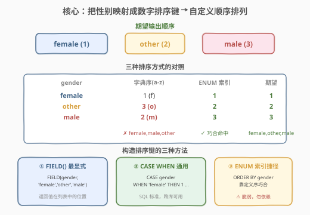
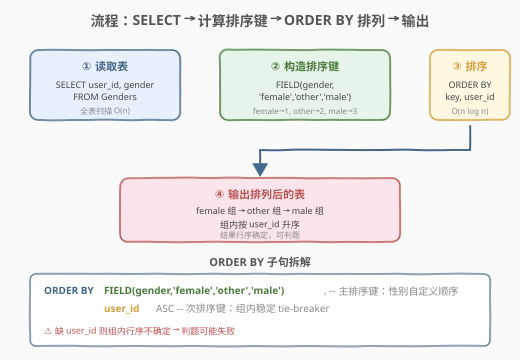
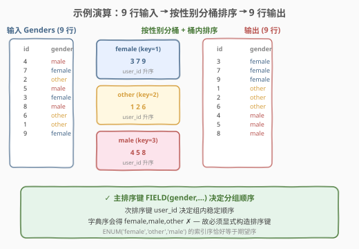

# 按性别排列表格

- **题目名称**：按性别排列表格
- **链接**：[2308. 按性别排列表格](https://leetcode.cn/problems/arrange-table-by-gender/)
- **难度**：中等
- **标签**：数据库、SQL、ORDER BY、自定义排序、`FIELD()`、`CASE WHEN`、ENUM、LeetCode 锁题

## 1. 题目概述

给定 `Genders` 表，每行记录一个用户的 `user_id` 和 `gender`（取值为 `'female'`、`'other'`、`'male'`）。要求编写 SQL 查询，把表按性别**自定义顺序**排列——所有 `'female'` 行在前，`'other'` 行居中，`'male'` 行在末尾；同一性别内部按 `user_id` 升序排列。

> ⚠️ **LeetCode Plus 会员锁题**：本题为 Plus 会员专享题，题目描述与代码模板需会员权限查看。下述题意基于 LeetCode 元数据（`mysqlSchemas` 中的 `Genders(user_id int, gender ENUM('female', 'other', 'male'))` 建表语句与官方测试用例）重建。关键线索有二：① `gender` 列被定义为 `ENUM('female', 'other', 'male')`，**定义顺序恰好就是期望输出顺序**；② 题名「按性别排列」——核心考点是**自定义（非字典序）排序**。

**表结构**：

```text
Table: Genders
+-------------+--------------------------------------+
| Column Name | Type                                 |
+-------------+--------------------------------------+
| user_id     | int                                  |
| gender      | ENUM('female', 'other', 'male')      |
+-------------+--------------------------------------+
(user_id 是该表的主键。
gender 只有 'female' / 'other' / 'male' 三个取值。)
```

**示例 1**（来自官方 `mysqlSchemas` 测试用例）：

```text
输入：
Genders 表:
+---------+--------+
| user_id | gender |
+---------+--------+
| 4       | male   |
| 7       | female |
| 2       | other |
| 5       | male   |
| 3       | female |
| 8       | male   |
| 6       | other |
| 1       | other |
| 9       | female |
+---------+--------+

输出：
+---------+--------+
| user_id | gender |
+---------+--------+
| 3       | female |
| 7       | female |
| 9       | female |
| 1       | other |
| 2       | other |
| 6       | other |
| 4       | male   |
| 5       | male   |
| 8       | male   |
+---------+--------+

解释：
所有 'female' 行排在前（user_id 升序：3,7,9），
接着 'other' 行（user_id 升序：1,2,6），
最后 'male' 行（user_id 升序：4,5,8）。
```

**约束条件**：

- `user_id` 为 `Genders` 表主键，取值唯一
- `gender` 为 `ENUM('female', 'other', 'male')`，只有三个固定取值
- 输出按 `gender` 的自定义顺序（female → other → male），同性别内按 `user_id` 升序

> 💡 **审题关键**：期望顺序是 `female, other, male`，而**字典序**是 `female, male, other`（`f < m < o`）——两者**不同**！这正是本题评为「中等」的核心难点：直接 `ORDER BY gender`（按字符串字典序）会得到 `female, male, other`，与期望不符；必须用**自定义排序键**把期望顺序编码成可比较的数字。

---

## 2. 解题思路

### 2.1 暴力思路：字典序排序（错误）

最直觉的做法是直接按 `gender` 列排序：

```sql
SELECT user_id, gender FROM Genders ORDER BY gender;
```

> ⚠️ **这是错的**：`gender` 是字符串列时，`ORDER BY gender` 按字典序排列得 `female, male, other`（`f < m < o`）——`male` 排到了 `other` 前面，与期望的 `female, other, male` 不符。根因是「期望顺序」与「字符串字典序」**不一致**，不能用列原值直接排序。

> 💡 **但有一个例外**：`gender` 被定义为 `ENUM('female', 'other', 'male')`。MySQL 对 ENUM 列排序时**按定义顺序的索引**（`female`=1, `other`=2, `male`=3）而非字符串值！所以 `ORDER BY gender` 在 ENUM 列上恰好得到 `female, other, male`——与期望一致。这是 2.4 将讨论的「ENUM 索引捷径」，但**依赖定义顺序巧合**，脆弱不通用，故先看更稳健的通用解法。

### 2.2 核心观察：把期望顺序编码成数字排序键



**关键洞察**：`ORDER BY` 比较的是「可排序的值」。当期望顺序与列原值的自然序不一致时，只需构造一个**派生列**，把每个 `gender` 值映射到它在期望顺序中的**位次**（数字），再按这个位次排序即可：

$$\text{key}(\text{gender}) = \begin{cases} 1 & \text{if } \text{gender} = \text{'female'} \\ 2 & \text{if } \text{gender} = \text{'other'} \\ 3 & \text{if } \text{gender} = \text{'male'} \end{cases}$$

排序时以 `key` 为主键、`user_id` 为次键：`ORDER BY key, user_id`。这样 `female`(1) 先于 `other`(2) 先于 `male`(3)，组内再按 `user_id` 升序稳定排列。

构造这个「位次映射」有三种 SQL 写法，**逻辑完全等价**，区别只在表达力与可移植性：

| 方法 | 写法 | 来源 | 评价 |
|------|------|------|------|
| **`FIELD()`** | `FIELD(gender, 'female', 'other', 'male')` | MySQL 专有函数 | 最直接：返回值在列表中的位置，语义即「位次」 |
| **`CASE WHEN`** | `CASE gender WHEN 'female' THEN 1 WHEN 'other' THEN 2 WHEN 'male' THEN 3 END` | SQL 标准 | 最通用：跨库可用，多分支显式 |
| **ENUM 索引** | `ORDER BY gender`（依赖 `ENUM('female','other','male')` 定义序） | MySQL ENUM 特性 | 最省字：靠定义序巧合命中，但脆弱 |

> 💡 **`FIELD(x, a, b, c)` 的语义**：返回 `x` 在 `(a, b, c)` 中**首次出现的下标**（从 1 起）；若 `x` 不在列表中则返回 `0`。所以 `FIELD('female','female','other','male')=1`、`FIELD('other',...)=2`、`FIELD('male',...)=3`，正是期望位次。它是 MySQL 为「自定义顺序」量身定做的函数——把「期望顺序列表」直接当作参数，写法最贴近自然语言描述。

### 2.3 算法流程图



| 步骤 | 子句 | 作用 |
|------|------|------|
| ① | `SELECT user_id, gender FROM Genders` | 读取全表，$O(n)$ |
| ② | `FIELD(gender, 'female', 'other', 'male')` | 为每行计算性别位次排序键（1/2/3） |
| ③ | `ORDER BY <key>, user_id ASC` | 按位次为主键、`user_id` 为次键排序，$O(n \log n)$ |
| ④ | 输出排列后的结果集 | `female` 组 → `other` 组 → `male` 组，组内 `user_id` 升序 |

> ⚠️ **`user_id` 次键不可省**：仅按性别位次排序时，同一性别内部行序由存储/扫描顺序决定，不确定。LeetCode 判题要求结果行序完全确定，故必须加 `user_id` 作为**稳定 tie-breaker**——这与期望输出「组内按 `user_id` 升序」一致。

### 2.4 示例演算

以官方 9 行测试用例为例，观察按位次键排序的全过程：



**步骤 ①：输入 Genders 表（9 行）**

| user_id | gender | 位次 key |
|---------|--------|----------|
| 4 | male | 3 |
| 7 | female | 1 |
| 2 | other | 2 |
| 5 | male | 3 |
| 3 | female | 1 |
| 8 | male | 3 |
| 6 | other | 2 |
| 1 | other | 2 |
| 9 | female | 1 |

**步骤 ②：按 `(key, user_id)` 升序排序**

先按 `key` 分桶，桶内按 `user_id` 升序：

| key | gender | 桶内 user_id（升序） |
|-----|--------|----------------------|
| 1 | female | 3, 7, 9 |
| 2 | other | 1, 2, 6 |
| 3 | male | 4, 5, 8 |

**步骤 ③：按桶顺序输出**

拼接三个桶得最终结果：`(3,female),(7,female),(9,female),(1,other),(2,other),(6,other),(4,male),(5,male),(8,male)` ✓

> 💡 **对照字典序的错误结果**：若误用 `ORDER BY gender`（按字符串值）会得 `female(3,7,9) → male(4,5,8) → other(1,2,6)`，`male` 跑到 `other` 前——可见「位次键」才是正确的排序依据。只有当 `gender` 是 `ENUM('female','other','male')` 时，`ORDER BY gender` 才按索引序（=期望序）排列，这正是 ENUM 捷径的原理，但**它依赖定义序的巧合**。

---

## 3. 参考代码

### SQL（解法 A：`FIELD()` 构造位次键，推荐）

```sql
SELECT user_id, gender
FROM Genders
ORDER BY FIELD(gender, 'female', 'other', 'male'), user_id;
```

> 💡 **写法要点**：
> - `FIELD(gender, 'female', 'other', 'male')` 把期望顺序直接写成列表参数，语义即「位次」。`female`→1、`other`→2、`male`→3，与期望完全对应。
> - `user_id` 作为次排序键保证同性别内行序确定（按 `user_id` 升序）。`ASC` 可省略（默认升序），但显式写更清晰。
> - 不在列表中的值 `FIELD` 返回 `0`，会排在最前——本题 `gender` 是 ENUM 保证三值之一，无此风险。
> - **最推荐**：写法最贴近「期望顺序列表」的自然描述，一行表达全部意图。

### SQL（解法 B：`CASE WHEN` 构造位次键，SQL 标准）

```sql
SELECT user_id, gender
FROM Genders
ORDER BY CASE gender
             WHEN 'female' THEN 1
             WHEN 'other'  THEN 2
             WHEN 'male'   THEN 3
         END,
         user_id;
```

> 💡 **`CASE` vs `FIELD`**：`CASE gender WHEN 'female' THEN 1 ...` 是 SQL 标准的「简单 CASE」，把每个 `gender` 值显式映射到位次。逻辑与 `FIELD` 完全等价，但**跨库通用**（PostgreSQL / SQL Server / Oracle 均支持），且多分支时更灵活（可混用非相等条件，改用搜索 CASE `WHEN gender = 'female' THEN 1`）。`FIELD` 是 MySQL 专有，写法更短但不跨库。与 [627 变更性别](../0601-0700/627_变更性别.md) 的 `CASE sex WHEN 'm' THEN 'f' ...` 共享同一套「简单 CASE 映射」骨架——627 用于 `UPDATE` 派生赋值，本题用于 `ORDER BY` 派生排序键。

### SQL（解法 C：依赖 ENUM 定义序，最省字但脆弱）

```sql
SELECT user_id, gender
FROM Genders
ORDER BY gender, user_id;
```

> ⚠️ **能通过但不推荐**：`gender` 是 `ENUM('female', 'other', 'male')`，MySQL 对 ENUM 列排序时**按定义顺序的内部索引**（`female`=1, `other`=2, `male`=3）而非字符串字典序。本题 ENUM 恰好按期望顺序定义，故 `ORDER BY gender` 得 `female, other, male`——与期望一致。
>
> **为何脆弱**：① **依赖巧合**——若 ENUM 改为 `ENUM('male', 'female', 'other')`，`ORDER BY gender` 立刻得 `male, female, other`，错；② **不可移植**——若 `gender` 改回 `VARCHAR`（非 ENUM），`ORDER BY gender` 退回字典序 `female, male, other`，错；③ **意图不明**——读者无法从 `ORDER BY gender` 推断「期望 female 在 other 前」，可读性差。生产代码应优先 `FIELD`/`CASE` 显式表达意图，ENUM 捷径仅作「了解 MySQL 特性」的趣味知识。

### Python（pandas：`Categorical` 指定类别序）

```python
import pandas as pd

def arrange_table(genders: pd.DataFrame) -> pd.DataFrame:
    cat = pd.CategoricalDtype(['female', 'other', 'male'], ordered=True)
    genders = genders.copy()
    genders['gender'] = genders['gender'].astype(cat)
    return genders.sort_values(['gender', 'user_id']).reset_index(drop=True)
```

> 💡 **pandas 对照**：
> - `pd.CategoricalDtype(['female', 'other', 'male'], ordered=True)` 显式声明类别及其顺序——这正是「构造自定义排序键」的声明式等价物，对应 SQL 的 `FIELD`/`CASE`。`ordered=True` 让类别成为「有序分类」，`sort_values('gender')` 按声明序排列。
> - `astype(cat)` 把 `gender` 列从普通字符串转为有序 `category` 类型，等价于 `FIELD(gender, 'female', 'other', 'male')` 给每行打上位次。
> - `.sort_values(['gender', 'user_id'])` 对应 `ORDER BY <key>, user_id`——主键性别位次、次键 `user_id`。
> - 若不引入 `Categorical`，可用 `map` 显式映射：`genders['key'] = genders['gender'].map({'female':1,'other':2,'male':3})` 再 `sort_values(['key','user_id'])`，与 SQL 解法 B 的 `CASE` 映射一一对应。

---

## 4. 复杂度分析

| 维度 | 复杂度 | 说明 |
|------|--------|------|
| 时间复杂度 | $O(n \log n)$ | $n$ = `Genders` 行数。全表扫描 $O(n)$；排序 $O(n \log n)$ 主导；每行 `FIELD`/`CASE` 求值 $O(1)$（值在固定 3 元列表中比较，常数次） |
| 空间复杂度 | $O(n)$ | 排序需 $O(n)$ 临时空间存放行 + 位次键；`user_id` 主键保证无重复 |

> 💡 **常数小的排序**：`gender` 仅 3 个取值，理论上可用计数分桶（按 3 个位次分桶后桶内排序）把排序降到 $O(n)$，但 $n$ 通常不大，`ORDER BY` 的 $O(n \log n)$ 已足够，且让数据库优化器自行决定执行计划更简洁。面试中提及「3 值可分桶 $O(n)$」作为优化思路即可，不必手写。

> ⚠️ **索引优化**：在 `Genders(gender, user_id)` 上建联合索引可让 `ORDER BY FIELD(gender,...), user_id` 走索引有序扫描——但 `FIELD()` 是函数，普通索引无法利用（需函数索引 `INDEX((FIELD(gender,'female','other','male')), user_id)`，MySQL 8.0.13+ 支持）。由于位次只有 3 桶、桶内 `user_id` 排序规模小，实践中全表排序代价有限，通常无需特殊索引。

---

## 5. 扩展：自定义排序的三种范式与 ENUM 机制

### 5.1 `ORDER BY` 中的派生表达式

SQL 的 `ORDER BY` 子句不只接受列名，也接受**任意标量表达式**（包括函数调用、`CASE`、算术运算）。本题把「期望顺序」编码进一个派生表达式（`FIELD(...)` 或 `CASE ... END`），让它参与排序——这是处理「自定义/非自然序」的通用范式：

| 需求 | 派生表达式 | 原理 |
|------|------------|------|
| 按固定枚举顺序 | `FIELD(col, 'A','B','C')` / `CASE col WHEN 'A' THEN 1...` | 把值映射到位次 |
| 按业务优先级 | `CASE WHEN priority='high' THEN 1 WHEN 'mid' THEN 2 ELSE 3 END` | 把优先级编码为数字 |
| 按自定义数值权重 | `col * w` 或查表 `JOIN weight t ON ...` | 外接权重表 |
| 把 NULL 排到末尾 | `ORDER BY (col IS NULL), col` | 布尔表达式 0/1 分组 |

> 💡 **核心思想**：任何「非列原值自然序」的排序需求，都可通过「在 `ORDER BY` 中构造一个派生标量」解决——把业务期望翻译成可比较的数字/布尔。`FIELD` 是 MySQL 对「值→位次」的专门封装；`CASE` 是 SQL 标准的通用封装。

### 5.2 ENUM 类型的排序机制

MySQL 的 `ENUM` 是一种字符串对象，内部以**整数索引**存储（从 1 起，按定义顺序）。这带来一个易被忽略的特性：

```sql
-- gender 为 ENUM('female', 'other', 'male')
SELECT user_id, gender FROM Genders ORDER BY gender;
-- 排序依据是 ENUM 索引：female(1) < other(2) < male(3)
-- 结果：female, other, male  ← 按定义序，非字典序！
```

| 排序上下文 | ENUM 列按什么排？ |
|------------|-------------------|
| `ORDER BY enum_col` | **定义序索引**（female=1, other=2, male=3） |
| `ORDER BY CAST(enum_col AS CHAR)` | 字典序（female, male, other） |
| `ORDER BY enum_col + 0` | 定义序索引（强制转数字） |

> ⚠️ **陷阱**：`ORDER BY enum_col` 与 `ORDER BY CAST(enum_col AS CHAR)` 结果**不同**！前者按定义序，后者按字典序。本题期望序恰好等于定义序，故 `ORDER BY gender`（解法 C）成立；若期望序与定义序不符，必须改用 `FIELD`/`CASE` 显式控制。**切勿在生产代码中依赖「ENUM 定义序恰好等于业务期望序」这一巧合**——业务需求变化时排序会静默出错且难以排查。

### 5.3 三种写法的选用决策

| 场景 | 推荐 | 理由 |
|------|------|------|
| MySQL 内、期望顺序固定 | **`FIELD`** | 写法最短、语义最贴近「期望顺序列表」 |
| 跨库（PG/SQL Server）或需非相等条件 | **`CASE WHEN`** | SQL 标准，通用性强 |
| ENUM 定义序恰好等于期望序且永不改动 | ENUM 捷径 | 最省字，但需注释说明依赖定义序 |
| 期望顺序可配置/可变 | **查表 `JOIN` 权重表** | 把顺序外置为数据，便于维护 |

> 💡 **生产建议**：优先 `CASE WHEN`（可移植、意图明确），MySQL 专用场景可用 `FIELD` 缩短代码。ENUM 捷径仅作「理解 MySQL ENUM 排序机制」的知识储备，不作为首选——它的「正确性」绑定在表结构定义上，重构时极易破坏。

---

## 6. 面试要点

1. **为什么直接 `ORDER BY gender` 可能是错的？什么时候又是对的？**

   > 当 `gender` 是普通字符串列时，`ORDER BY gender` 按字典序得 `female, male, other`（`f < m < o`），`male` 排在 `other` 前，与期望的 `female, other, male` 不符——所以错了。但当 `gender` 是 `ENUM('female', 'other', 'male')` 时，MySQL 对 ENUM 列排序**按定义序索引**（female=1, other=2, male=3），`ORDER BY gender` 恰好得期望序——这时是对的。关键区别：字符串列走字典序，ENUM 列走定义序。本题期望序与 ENUM 定义序巧合一致，故捷径可用但脆弱。

2. **`FIELD(x, a, b, c)` 的返回值是什么？有什么用？**

   > 返回 `x` 在 `(a, b, c)` 中首次出现的下标（从 1 起），不在列表中则返回 0。用途是**把任意值映射到它在自定义顺序中的位次**——这正是「自定义排序」的核心。`FIELD(gender, 'female', 'other', 'male')` 把期望顺序直接写成参数，`female`→1、`other`→2、`male`→3，再 `ORDER BY` 这个位次即得期望序。它是 MySQL 为自定义排序量身定做的函数，语义最贴近自然语言。

3. **`ORDER BY` 里能写表达式吗？为什么？**

   > 能。SQL 标准允许 `ORDER BY` 接受任意标量表达式（列名、函数调用、`CASE`、算术运算），对每行求值后按结果排序。本题把「期望顺序」编码进 `FIELD(...)` / `CASE ... END` 派生表达式参与排序，是处理「非自然序」的通用范式——把业务期望翻译成可比较的数字。`GROUP BY`/`WHERE` 也有类似的表达式求值能力，但 `ORDER BY` 的表达式只用于排序不影响选择。

4. **为什么次排序键 `user_id` 不能省略？**

   > 仅按性别位次排序时，同一性别内部行序由存储/扫描顺序决定，**不确定**。SQL 表本身无序，LeetCode 判题要求结果行序完全确定，故必须加 `user_id` 作为稳定 tie-breaker——这也与期望「组内按 `user_id` 升序」一致。省略次键会导致同一性别组内行序随机，判题可能失败。

5. **ENUM 列排序时按字典序还是定义序？怎么强制按字典序？**

   > ENUM 列在 `ORDER BY` 时按**定义序索引**（定义中出现的顺序，从 1 起），不是字符串字典序。要强制按字典序，需 `CAST(enum_col AS CHAR)` 转为字符串再排，或 `ORDER BY CONCAT(enum_col)`。本题若 ENUM 定义为 `ENUM('female', 'other', 'male')`，定义序 = 期望序，`ORDER BY gender` 直接正确；若定义序与期望不符，必须 `FIELD`/`CASE` 显式控制。理解这一点能解释「为何解法 C 恰好通过」。

> 💡 **一句话总结**：2308 的核心是「自定义（非字典序）排序」——把期望顺序 `female, other, male` 编码成数字位次，再 `ORDER BY` 该派生键。`FIELD()` 是 MySQL 专用最短写法、`CASE WHEN` 是 SQL 标准通用写法、ENUM 定义序是「恰好命中」的脆弱捷径。主键性别位次 + 次键 `user_id` 共同保证行序确定可判题。

---

## 7. 同类练习题

- [627. 变更性别](https://leetcode.cn/problems/swap-salary/)（[题解](../0601-0700/627_变更性别.md)）：共享 `CASE WHEN` + ENUM 主题——627 用简单 CASE 在 `UPDATE` 中派生赋值翻转 `sex`，本题用简单 CASE 在 `ORDER BY` 中派生排序键位次；同一套「简单 CASE 映射」骨架，分别服务「写时修改」与「读时排序」
- [1440. 计算布尔表达式的值](https://leetcode.cn/problems/evaluate-boolean-expression/)（[题解](../1401-1500/1440_计算布尔表达式的值.md)）：ENUM + `CASE WHEN` 多分支分类——`operator` 为 ENUM(`'>'`,`'<'`,`'='`)，用 `CASE WHEN e.operator='>'` 把运算符映射为比较结果，对照本题把 gender 映射为位次，巩固「ENUM 列 + CASE 派生」范式
- [620. 有趣的电影](https://leetcode.cn/problems/not-boring-movies/)（[题解](../0601-0700/620_有趣的电影.md)）：SQL 基础 `WHERE` + `ORDER BY`——`ORDER BY rating DESC` 按数值降序，是「自然序排序」的入门题，对照本题理解「自然序 `ORDER BY col`」与「自定义序 `ORDER BY 派生键`」的差异
- [610. 判断三角形](https://leetcode.cn/problems/triangle-judgement/)（[题解](../0601-0700/610_判断三角形.md)）：搜索型 `CASE WHEN` 条件派生列——`CASE WHEN x+y>z THEN 'Yes' ELSE 'No' END` 用非相等条件派生标签，对照本题简单 CASE（相等匹配）理解两种 CASE 形态
- [178. 分数排名](https://leetcode.cn/problems/rank-scores/)（[题解](../0101-0200/178_分数排名.md)）：`ORDER BY` + 窗口函数排名——按 `score` 降序并分配 `DENSE_RANK`，是「自然序 + 排名」家族，对照本题「自定义序 + 排列」理解 `ORDER BY` 在排序与排名中的不同用法
