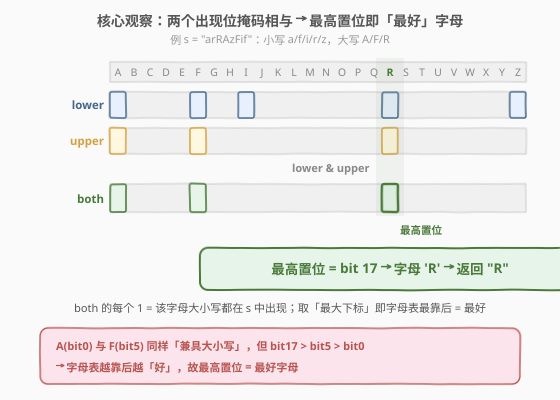
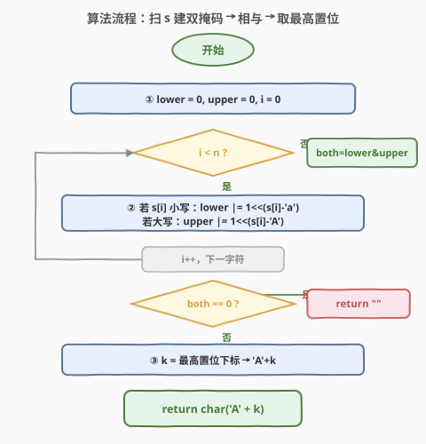
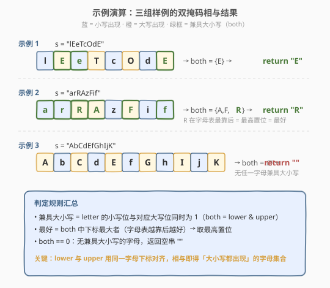

# 兼具大小写的最好英文字母

- **题目名称**：兼具大小写的最好英文字母
- **链接**：[2309. 兼具大小写的最好英文字母](https://leetcode.cn/problems/greatest-english-letter-in-upper-and-lower-case/)
- **难度**：简单
- **标签**：位运算、哈希表、字符串、位掩码

## 1. 题目概述

给定一个由大小写英文字母组成的字符串 `s`，找出其中的**最好**英文字母，并以**大写形式**返回；若不存在则返回空串 `""`。

- **最好**的定义：某字母的大写与小写形式**都**在 `s` 中出现；在这些「兼具大小写」的字母中，**字母表越靠后越好**（`b` 比 `a` 更好，因为 `b` 在 `a` 之后）。

**示例 1**：

```text
输入：s = "lEeTcOdE"
输出："E"
解释：字母 'E' 是唯一一个大写和小写形式都出现的字母。
```

**示例 2**：

```text
输入：s = "arRAzFif"
输出："R"
解释：字母 'R' 是大写和小写形式都出现的最好英文字母。
注意 'A' 和 'F' 的大写和小写形式也都出现了，但 'R' 比 'F' 和 'A' 更好。
```

**示例 3**：

```text
输入：s = "AbCdEfGhIjK"
输出：""
解释：不存在大写和小写形式都出现的字母。
```

**约束条件**：

- $1 \le \text{s.length} \le 1000$
- `s` 仅由小写和大写英文字母组成

> 💡 **审题关键**：①「兼具大小写」= 同一字母的小写位与大写位**同时为真**——天然对应两个集合的**交集**；②「最好」= 交集中**下标最大**的字母（字母表越靠后越好），即「最大下标」而非「出现顺序」。两个条件一旦转为「下标集合的交 + 取最大」，位掩码就呼之欲出。

---

## 2. 解题思路

### 2.1 朴素思路：两个布尔数组 + 倒序扫描

最直觉的做法是分别记录每个字母的小写/大写是否出现，再从 `'Z'` 向 `'A'` 倒着找第一个「两者都为真」的字母：

```python
lower = [False] * 26
upper = [False] * 26
for c in s:
    if 'a' <= c <= 'z': lower[ord(c) - ord('a')] = True
    else:                upper[ord(c) - ord('A')] = True
for i in range(25, -1, -1):
    if lower[i] and upper[i]:
        return chr(ord('A') + i)
return ""
```

> 💡 **已经正确且 $O(n)$**：一次扫描 + 26 步倒序，时间 $O(n)$、空间 $O(1)$（两个 26 长布尔数组是常数）。但存在两处「啰嗦」：① 用了**两个独立结构** `lower`/`upper`，求交靠「逐位 `and`」循环；② 找「最好」靠**倒序线性扫描** 26 步。当字母表固定为 26 个时这无关紧要，但把这两步压缩成**一次位运算**就是本题的优雅之处——也是它被归入「位运算」标签的缘由。

### 2.2 核心观察：两个出现位掩码相与 → 最高置位即「最好」字母



**关键洞察**：字母表只有 26 个字母，一个 32 位整数的 26 个低位恰好能**位编码**「某字母是否出现」——第 `i` 位为 `1` 表示字母 `'A'+i`（及其小写 `'a'+i`）出现过。于是：

$$\text{lower} = \sum_{i:\,'a'+i\in s} 2^i, \qquad \text{upper} = \sum_{i:\,'A'+i\in s} 2^i$$

两个掩码**共用同一套下标**（字母 `i` 的小写记进 `lower` 第 `i` 位、大写记进 `upper` 第 `i` 位），于是「兼具大小写」就是两个掩码的**按位与**：

$$\text{both} = \text{lower}\ \&\ \text{upper}$$

`both` 中每个 `1` 对应一个兼具大小写的字母，其**下标**就是该位在字母表中的位置。而「最好」= 字母表最靠后 = 下标最大 = **最高置位**（most significant set bit）。整道题被压缩成「建两个掩码 → 相与 → 取最高置位」三步：

| 步骤 | 操作 | 含义 |
|------|------|------|
| ① 扫 `s` | 小写：`lower |= 1<<i`；大写：`upper |= 1<<i` | 把「出现」编码进对应位 |
| ② 相与 | `both = lower & upper` | 同时出现的字母 = `both` 中的 `1` |
| ③ 取最高置位 | `k = msb(both)` | 下标最大 = 最好字母 |
| ④ 输出 | `both==0 ? "" : 'A'+k` | 无则空串，有则大写形式 |

> 💡 **为何「最高置位」就是「最好」**：位 `i` 越高 ⟺ 字母 `'A'+i` 在字母表越靠后 ⟺ 越「好」。取 `both` 的最高置位，正是从所有「兼具大小写」的候选里挑出字母表最靠后那一个——一步位运算替代了朴素版的「26 步倒序扫描」。
>
> ⚠️ **下标对齐是前提**：`lower` 和 `upper` 必须用**同一个字母下标** `i = c - 'a'`（小写）/ `c - 'A'`（大写）。大小写字母的 ASCII 差是固定的 32，减去各自基址后落到同一个 `i`，这是相与能有意义的前提——否则两个掩码错位，相与恒为 0。

### 2.3 算法流程图



| 步骤 | 说明 |
|------|------|
| ① 初始化 | `lower = 0`，`upper = 0`，指针 `i = 0` |
| ② 逐字符置位 | 小写 → `lower |= 1<<(c-'a')`；大写 → `upper |= 1<<(c-'A')` |
| ③ 相与 | `both = lower & upper`，得到兼具大小写的字母位集 |
| ④ 判空 | `both == 0` → 返回 `""` |
| ⑤ 取最高置位 | `k = msb(both)`，返回 `'A' + k` |

### 2.4 示例演算



以**示例 2** `s = "arRAzFif"` 为例走一遍：

- **扫 `s` 建掩码**：小写 `a,r,z,f,i` → `lower` 的 bit 0,17,25,5,8 为 1；大写 `R,A,F` → `upper` 的 bit 17,0,5 为 1。
- **相与**：`both = lower & upper`，只剩 bit 0(A)、bit 5(F)、bit 17(R) 同时为 1。
- **取最高置位**：bit 17 > bit 5 > bit 0 → `k = 17` → `'A'+17 = 'R'` → 返回 `"R"` ✓

示例 1 `lEeTcOdE` 中 `both` 仅 bit 4(E) 为 1 → 返回 `"E"`；示例 3 `AbCdEfGhIjK` 中小写全是 `b,d,f,h,j`、大写全是 `A,C,E,G,I,K`，无任一字母同时出现 → `both == 0` → 返回 `""`。

> 💡 **示例 3 的启示**：仅凭「有大写也有小写」不够，必须是**同一字母**的大小写同时出现。这正是「下标对齐后相与」的价值——错位的位相与必为 0，自然过滤掉「大小写都有但不是同一字母」的情况。

---

## 3. 参考代码

### C++（位掩码主解，推荐）

```cpp
class Solution {
public:
    string greatestLetter(string s) {
        unsigned lower = 0, upper = 0;
        for (char c : s) {
            if (c >= 'a' && c <= 'z') lower |= 1u << (c - 'a');
            else                       upper |= 1u << (c - 'A');
        }
        unsigned both = lower & upper;
        if (both == 0) return "";
        int k = 31 - __builtin_clz(both);   // 最高置位下标
        return string(1, 'A' + k);
    }
};
```

> 💡 **写法要点**：
> - `1u << (c - 'a')` 用 `unsigned` 避免符号位问题；`both` 是 `unsigned` 保证 `__builtin_clz` 行为确定。
> - `__builtin_clz(x)` 返回 `x` 前导 0 的个数，`31 - __builtin_clz(both)` 即最高置位下标（GCC/Clang 内建，$O(1)$ 单指令）。`both != 0` 是调用前提，故先判空。
> - C++20 起可用 `std::bit_width(both) - 1` 替代，语义更直白：`bit_width` = 有效位数 = 最高置位下标 + 1。
> - 不愿用内建函数时，可改成从 `'Z'` 倒序到 `'A'` 的线性扫描（见下方「朴素版」），最坏 26 步，常数级。

### C++（朴素版：两布尔数组 + 倒序，2.1 直译）

```cpp
class Solution {
public:
    string greatestLetter(string s) {
        bool lower[26] = {false}, upper[26] = {false};
        for (char c : s) {
            if (c >= 'a' && c <= 'z') lower[c - 'a'] = true;
            else                       upper[c - 'A'] = true;
        }
        for (int i = 25; i >= 0; --i)
            if (lower[i] && upper[i])
                return string(1, 'A' + i);
        return "";
    }
};
```

> 💡 **朴素版 vs 位掩码版**：逻辑完全等价——`lower[i] && upper[i]` 就是位掩码里 `both` 第 `i` 位为 1；倒序找首个 `true` 就是取最高置位。位掩码版把「26 个 bool 压成一个 int」「逐位 `and` 压成一次 `&`」「倒序扫描压成 `__builtin_clz`」三步合一，更紧凑、更「位运算味」，但朴素版可读性更好、无内建函数依赖。面试中两版都讲，能体现「同一思路在不同抽象层级的表达」。

### Python（位掩码主解）

```python
class Solution:
    def greatestLetter(self, s: str) -> str:
        lower = upper = 0
        for c in s:
            if 'a' <= c <= 'z':
                lower |= 1 << (ord(c) - ord('a'))
            else:
                upper |= 1 << (ord(c) - ord('A'))
        both = lower & upper
        if both == 0:
            return ""
        k = both.bit_length() - 1      # 最高置位下标
        return chr(ord('A') + k)
```

> 💡 `int.bit_length()` 返回二进制有效位数 = 最高置位下标 + 1，故 `- 1` 得最高置位下标。`both == 0` 时 `bit_length()` 为 0，需先判空再调用。Python 大整数无固定位宽，`<<` 不溢出，比 C++ 更省心。

### Python（集合交集版，最 Pythonic）

```python
class Solution:
    def greatestLetter(self, s: str) -> str:
        up = {c for c in s if c.isupper()}
        lo = {c.upper() for c in s if c.islower()}   # 小写统一转大写便于对齐
        both = up & lo                               # 交集 = 兼具大小写
        return max(both) if both else ""             # max = 字母表最靠后 = 最好
```

> 💡 **集合版对应关系**：`up & lo` 就是 `lower & upper`（把小写都转大写后下标自然对齐）；`max(both)` 就是「最高置位」——字符串的 `max` 按字典序，大写字母字典序与字母表序一致，故 `max` = 字母表最靠后。三行直白翻译题意，但用 $O(26)$ 集合与哈希，常数大于位掩码。

---

## 4. 复杂度分析

| 维度 | 复杂度 | 说明 |
|------|--------|------|
| 时间复杂度 | $O(n)$ | $n = |s|$。一次扫描建掩码 $O(n)$；相与 $O(1)$；取最高置位 $O(1)$（`__builtin_clz`/`bit_length` 为常数指令）。朴素版倒序扫描 26 步仍是常数 |
| 空间复杂度 | $O(1)$ | 仅两个 26 位整数（或两个 26 长布尔数组、两个 ≤26 元素集合），与输入规模无关 |

> 💡 **字母表大小是常数是关键**：26 个字母的「常数性」让朴素版的 26 步倒序扫描与位掩码版的 1 步 `__builtin_clz` 都是 $O(1)$，整题被压到 $O(n)$。若把字母表泛化为更大字符集（如全 Unicode），位掩码需要扩成多字 / 哈希表，倒序扫描也需排序，「最好」的取法从「取最高置位」退化为「取最大键」——但「相与求交 + 取最大」的骨架不变。

---

## 5. 扩展：「出现性位掩码 + 位运算求交」范式

本题是把「集合求交 + 取最值」用位运算表达的典型。当元素来自一个**小而固定**的全集（如 26 字母、52 大小写、状态位）时，把「出现」编码进一个整数的位，能把集合操作压成单条指令：

| 集合操作 | 位运算 | 本题对应 |
|----------|--------|----------|
| 交集 $A \cap B$ | `a & b` | `lower & upper` 求兼具大小写 |
| 并集 $A \cup B$ | `a \| b` | （未用，合并大小写出现性） |
| 差集 $A \setminus B$ | `a & ~b` | 小写出现但大写没出现 |
| 对称差 $A \triangle B$ | `a ^ b` | 只出现一种大小写的字母 |
| 集合为空 | `a == 0` | `both == 0` 判无解 |
| 最大元素 | `msb(a)` | 最高置位 = 最好字母 |
| 集合大小 | `popcount(a)` | 兼具大小写的字母个数 |

> 💡 **下标对齐的设计要点**：位掩码求交要求两个集合**共用同一套位定义**。本题让小写 `'a'+i` 与大写 `'A'+i` 都映射到位 `i`（同一字母同一位），这是「相与有意义」的前提。若两个集合的下标体系不同（如字母 vs 数字），相与前需先做下标对齐（映射到同一编号空间），否则结果无意义——这与哈希求交前需统一键是同一类要求。

### 5.1 取「最高置位」的几种写法

| 语言 | 写法 | 说明 |
|------|------|------|
| C++ (GCC) | `31 - __builtin_clz(x)` | 前导 0 取反，$x \ne 0$ 时调用 |
| C++20 | `std::bit_width(x) - 1` | 标准库，语义=有效位数−1 |
| Python | `x.bit_length() - 1` | 有效位数−1，`x==0` 时为 −1 需判空 |
| Java | `Integer.numberOfLeadingZeros(x)` | 同 GCC，`31 - ...` |
| 通用 | 从高到低试位 / 二分 | 不依赖内建函数 |

> ⚠️ **`x == 0` 是陷阱**：`__builtin_clz(0)` 行为未定义、`31 - __builtin_clz(0)` 会得到错误结果；`bit_length(0) == 0` 则 `−1` 错位。务必**先判空再取最高位**，本题用 `both == 0 ? "" : ...` 守住这一前提。

### 5.2 「兼具 X 与 Y」的判定骨架

本题是「**两个属性同时为真则纳入候选，再取最值**」的骨架，位掩码只是其压缩实现。更一般地：

- 记录属性 A 的出现集 `maskA`、属性 B 的出现集 `maskB`；
- 候选 = `maskA & maskB`（同时满足）；
- 答案 = 候选集的「最值」（最高/最低位，或最大/最小键）；
- 空集 → 返回「无」标识。

把「属性」换成「出现过」「满足约束」即可迁移到其它「同时满足 + 取最值」题型。

---

## 6. 面试要点

1. **为什么「相与」能求出「兼具大小写」的字母？前提是什么？**

   > 前提是 `lower` 和 `upper` **共用同一套字母下标**：小写 `'a'+i` 记进 `lower` 的位 `i`、大写 `'A'+i` 记进 `upper` 的位 `i`。这样同一位在两个掩码里代表**同一字母**的不同形态，按位与 `both = lower & upper` 只有当位 `i` 在两掩码都为 1（即该字母大小写都出现）时才为 1。若下标不对齐（如小写用 `c-'a'`、大写用 `c`），相与恒为 0，结果错误。

2. **「最好」为什么是「最高置位」而不是「出现顺序最后」？**

   > 题目定义「更好」= 字母表更靠后，与在 `s` 中出现的先后无关。位 `i` 越高 ⟺ 字母 `'A'+i` 越靠后 ⟺ 越好，故「最好」= `both` 中下标最大的位 = 最高置位。朴素版对应「从 `'Z'` 倒序扫到 `'A'` 取首个兼具大小写者」——倒序首个即最高位。两者等价，位掩码用 `__builtin_clz`/`bit_length` 一步完成。

3. **`both == 0` 时为什么要单独判空？不判会怎样？**

   > 取最高置位的内建函数对 0 输入行为不良：`__builtin_clz(0)` 未定义、`bit_length(0)` 返回 0 导致 `−1` 错位，会得到错误下标（甚至越界）。必须先判 `both == 0` 返回 `""`，再在非零时取最高位——这同时对应「不存在兼具大小写的字母」的题意（返回空串）。

4. **位掩码版相对朴素布尔数组版的优势在哪？什么时候反而该用朴素版？**

   > 优势：① 空间更省（两个 int 替代两个 26 长数组）；② 求交压成单条 `&` 指令、取最值压成单条 `clz`/`bit_length`，常数更小、更「位运算味」。但当全集很大（非 26 常数）、或需要记录每个字母的**出现次数/位置**而非仅「是否出现」时，位掩码失效（位不够 / 信息不足），应回退到哈希表/数组。本题全集恰为 26 个字母，是位掩码的甜区。

5. **如果题目改成「同时出现的小写与大写字母**个数**」或「**任一**兼具大小写的字母」呢？**

   > 「个数」= `both` 中 1 的个数 = `popcount(both)`，即 [191 位 1 的个数] 的 `n & (n-1)` 或内建 `__builtin_popcount`，骨架不变只换末步。「任一」= 不取最高置位而取**任一**置位（如最低置位 `both & -both` 或 `ctz(both)`），甚至直接判 `both != 0`。可见「建双掩码 → 相与」是公共骨架，末步的「取最值/取个数/判存在」决定具体题型。

> 💡 **一句话总结**：2309 的核心是「出现性位掩码相与求交 + 最高置位取最值」——把「兼具大小写」压成 `lower & upper`、把「最好」压成「最高置位」，三步位运算解题。关键设计是大小写共用字母下标让相与有意义，关键守则是先判空再取最高位。它是 [318 最大单词长度乘积]「字母集位掩码」与 [191 位 1 的个数]「位计数」家族的入门款。

---

## 7. 同类练习题

- [318. 最大单词长度乘积](https://leetcode.cn/problems/maximum-product-of-word-lengths/)（[题解](../0301-0400/318_最大单词长度乘积.md)）：把每个单词的「字母出现集」编码成 26 位掩码——两单词无公共字母 ⟺ 两掩码相与为 0。共享「出现性位掩码」骨架，本题用相与求**交集**，318 用相与判**交集为空**，一正一反巩固位掩码集合运算
- [191. 位 1 的个数](https://leetcode.cn/problems/number-of-1-bits/)（[题解](../0001-0100/191_位1的个数.md)）：`n & (n-1)` 消最低位 1 计数——本题若改成「兼具大小写的字母**个数**」即对 `both` 做 popcount。共享「对单个位掩码做位运算提取信息」的范式，末步从「取最高置位」换成「数 1 的个数」
- [338. 比特位计数](https://leetcode.cn/problems/counting-bits/)（[题解](../0301-0400/338_比特位计数.md)）：对 $0..n$ 每个数算 popcount 的 DP——`i & (i-1)` 去最低位复用更小子问题。是 191 的批量版，进一步巩固「位掩码 + 位计数」家族，承接本题把 `both` 当作一个数来分析的视角
- [389. 找不同](https://leetcode.cn/problems/find-the-difference/)（[题解](../0301-0400/389_找不同.md)）：字符串 `s` 拼进 `t` 多一个字符，用**异或**消去成对出现的字符剩出多那一个——与本题同样处理「字母出现性」，本题用**相与**求两掩码交集，389 用**异或**求两串差集，对照理解位运算在「集合求交 vs 求差」中的不同用法
- [231. 2 的幂](https://leetcode.cn/problems/power-of-two/)（[题解](../0201-0300/231_2的幂.md)）：`n & (n-1) == 0` 判单 1——本题取最高置位后结果是一位掩码，判定「恰好一个兼具大小写的字母」可借用 231 的单 1 判定。共享「对位掩码做 `n&(n-1)` 系操作」的位运算基本功
