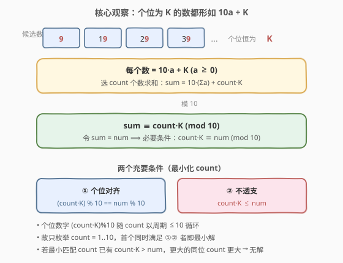
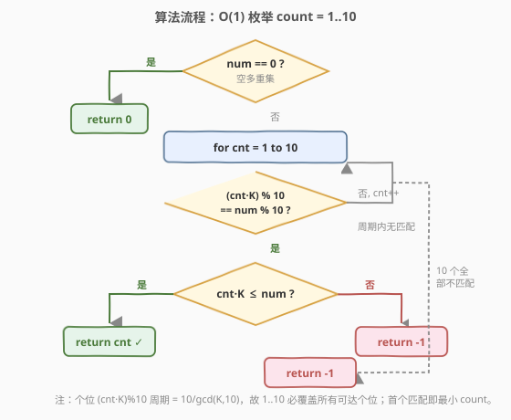
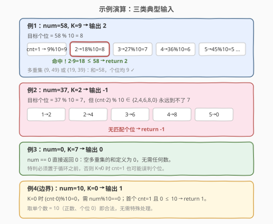

# 个位数字为 K 的整数之和

- **题目名称**：个位数字为 K 的整数之和
- **链接**：[2310. 个位数字为 K 的整数之和](https://leetcode.cn/problems/sum-of-numbers-with-units-digit-k/)
- **难度**：中等
- **标签**：数学、贪心、数论（同余）

## 1. 题目概述

给定两个整数 `num` 和 `k`，求一个**正整数多重集**，满足：

- 每个整数的**个位数字**都是 `k`；
- 所有整数之和恰为 `num`。

返回该多重集的**最小大小**；若不存在则返回 `-1`。注意：空多重集的和为 `0`。

**示例 1**：

```text
输入：num = 58, k = 9
输出：2
解释：[9, 49] 满足（和 58，个位均为 9）；[19, 39] 亦可。最小长度为 2。
```

**示例 2**：

```text
输入：num = 37, k = 2
输出：-1
解释：个位为 2 的整数无法相加得到 37。
```

**示例 3**：

```text
输入：num = 0, k = 7
输出：0
解释：空多重集的和为 0。
```

**约束条件**：

- $0 \le \text{num} \le 3000$
- $0 \le k \le 9$

> 💡 本题看似要「枚举组合」，实则是一道披着组合外衣的**同余（模 10）**问题。一旦把「个位为 $k$」翻译成「$\equiv k \pmod{10}$」，最小大小就被压成 $O(1)$ 的个位扫描——无需 DP、无需 BFS。

---

## 2. 解题思路

### 2.1 暴力思路：完全背包 DP

最直白的做法是把「选若干个位为 $k$ 的正数凑出 `num`」当成**完全背包**：物品是所有个位为 $k$ 的正数（$k, 10{+}k, 20{+}k, \ldots$，个位为 $0$ 时为 $10, 20, \ldots$），容量是 `num`，求凑满容量的最少物品数。

```text
dp[0] = 0，其余 dp[s] = +∞
for s = 1 .. num:
    for v ∈ {个位为 k 的正数, v ≤ s}:
        dp[s] = min(dp[s], dp[s - v] + 1)
return dp[num] 若为 +∞ 则 -1
```

约束 $\text{num} \le 3000$ 下物品约 $\text{num}/10$ 种，总运算 $\approx 3000 \times 300 \approx 9 \times 10^5$，能 AC。但这是**用组合优化的重炮打了个位算术的蚊子**——状态维度 $O(\text{num})$、转移 $O(\text{num}/10)$，而真实答案只取决于个位数字。

> ⚠️ 暴力能过 ≠ 正确解法。面试中只给 DP 会被追问「$O(1)$ 能不能做」。关键观察：**个位为 $k$ 的数都形如 $10a + k$**，它们的和对个位的影响完全由「个数」与 $k$ 的乘积决定。

### 2.2 核心观察：同余 + 不透支



个位数字为 $k$ 的正整数都可写成 $10a + k$（$a \ge 0$；当 $k = 0$ 时要求 $a \ge 1$ 以保证正数，此时数为 $10a \ge 10$）。设选了 $c$ 个这样的数，则它们的和

$$
\text{sum} = \sum_{i=1}^{c}(10a_i + k) = 10\sum_{i=1}^{c} a_i + c \cdot k
$$

对它**模 10**，第一项（$10$ 的倍数）消失，只剩：

$$
\text{sum} \equiv c \cdot k \pmod{10}
$$

令 $\text{sum} = \text{num}$，便得到一个**必要条件**：$c \cdot k \equiv \text{num} \pmod{10}$，即 $(c \cdot k) \bmod 10 = \text{num} \bmod 10$。

但这只是「个位对得上」，还要保证**和不透支**：$\sum a_i \ge 0$（$k \ne 0$ 时各数 $\ge k$ 已为正；$k = 0$ 时需 $\sum a_i \ge c$），等价于 $c \cdot k \le \text{num}$ 且余量 $\text{num} - c \cdot k$ 是 $10$ 的倍数（已由个位条件保证）。

> 💡 **关键转化**：最小化 $c$ 的问题，被压缩成「在 $c = 1, 2, \ldots$ 中找最小的、同时满足 ① 个位对齐 ② $c \cdot k \le \text{num}$ 的 $c$」。

### 2.3 为什么只枚举 1..10？

$(c \cdot k) \bmod 10$ 随 $c$ 递增按 $k \bmod 10$ 步进，**周期**为 $10 / \gcd(k, 10) \le 10$。故在 $c \in \{1, \ldots, 10\}$ 内，每个可达的个位数字至少出现一次，且**首次出现即该个位对应的最小 $c$**。

- 命中个位后只看 $c \cdot k \le \text{num}$：成立则直接返回这个最小 $c$；
- 若这个最小匹配 $c$ 已有 $c \cdot k > \text{num}$，则任何更大的同位 $c' = c + 10m$ 都有 $c' \cdot k > c \cdot k > \text{num}$，**必然无解**，直接返回 $-1$；
- $1..10$ 全程无个位匹配（如 $k=2$ 凑不出个位 $7$），返回 $-1$。

> ⚠️ 边界 $\text{num} = 0$：空多重集和为 $0$，答案恒为 $0$，必须**在循环前特判**——否则 $k \ne 0$ 时 $c=1$ 可能恰好个位匹配（如 $\text{num}=0, k=0$）而误返回 $1$。

### 2.4 算法流程图



三道关卡串联：

1. **特判** $\text{num} = 0$ → 返回 $0$；
2. **枚举** $c = 1 \ldots 10$，找首个 $(c \cdot k) \bmod 10 = \text{num} \bmod 10$；
3. **不透支判定** $c \cdot k \le \text{num}$：是则返回 $c$，否则返回 $-1$；全程无匹配返回 $-1$。

### 2.5 示例演算



| 输入 | num%10 | 扫描过程 | 输出 |
|------|--------|----------|------|
| `num=58, k=9` | 8 | $c=1{:}\,9;\; c=2{:}\,18{\to}8$ 命中，$18 \le 58$ | `2`（$\{9,49\}$） |
| `num=37, k=2` | 7 | $(c\cdot2)\bmod 10 \in \{2,4,6,8,0\}$，永不命中 $7$ | `-1` |
| `num=0, k=7` | 0 | 特判 $\text{num}=0$ | `0` |
| `num=10, k=0` | 0 | $k=0$，$c=1{:}\,0{=}0$ 命中，$0 \le 10$ | `1`（单个数 $10$） |

注意例 4：$k=0$ 时被选数必须是正数（$\ge 10$），但取单个数 $= \text{num}$（$=10$）即合法，故无需特殊处理——$c \cdot k = 0 \le \text{num}$ 与「$\text{num}$ 是 $10$ 的倍数」共同保证 $\sum a_i = \text{num}/10 \ge 1 = c$。

---

## 3. 参考代码

### C++

```cpp
class Solution {
public:
    int minimumNumbers(int num, int k) {
        if (num == 0) return 0;
        for (int c = 1; c <= 10; ++c) {
            if ((c * k) % 10 == num % 10) {
                return (c * k <= num) ? c : -1;
            }
        }
        return -1;
    }
};
```

> 💡 $\text{num} \le 3000,\ k \le 9,\ c \le 10$，故 $c \cdot k \le 90$，`int` 毫无溢出风险。`num == 0` 特判置于循环之前，是唯一需要绕过「个位巧合」的边界。

### Python

```python
class Solution:
    def minimumNumbers(self, num: int, k: int) -> int:
        if num == 0:
            return 0
        for c in range(1, 11):
            if (c * k) % 10 == num % 10:
                return c if c * k <= num else -1
        return -1
```

> ⚠️ Python 中 `(c * k) % 10` 与 `num % 10` 均为非负（Python 取模结果符号随除数），无需额外处理负数；C++ 中 `num` 非负故 `num % 10` 亦非负，两者行为一致。

---

## 4. 复杂度分析

| 维度 | 复杂度 | 说明 |
|------|--------|------|
| **时间复杂度** | $O(1)$ | 循环至多 10 次，每次常数操作；与 $\text{num}$、$k$ 大小无关 |
| **空间复杂度** | $O(1)$ | 仅用常数个变量 `c`，无额外数据结构 |
| 对照：完全背包 DP | $O(\text{num}^2 / 10)$ / $O(\text{num})$ | 状态 $O(\text{num})$、转移 $O(\text{num}/10)$，约束下可过但本质浪费 |

> 💡 严格说时间是 $O(1)$：循环上界是常数 $10$，与输入规模无关。即便 $\text{num}$ 放大到 $10^{18}$，本解法依旧常数次完成，而 DP 会直接爆内存。

---

## 5. 扩展：从「模 10」到「最小硬币数」的抽象

本题是经典「**用若干种面额凑目标值的最少个数**」问题的退化特例：面额集合是「个位为 $k$ 的所有正数」，是一个**无限稠密**的等差数列。正因稠密，凑出目标值的**唯一障碍是个位对齐**——一旦个位对得上，多出来的 $10$ 的倍数总能用更大的面额（$+10$）吸收。

对照标准**硬币/背包**家族：

| 模型 | 面额性质 | 关键障碍 | 解法 |
|------|---------|----------|------|
| [322. 零钱兑换](https://leetcode.cn/problems/coin-change/) | 离散有限集 | 任意剩余量 | 完全背包 DP $O(n \cdot \text{amt})$ |
| [279. 完全平方数](https://leetcode.cn/problems/perfect-squares/) | $1,4,9,\ldots$（稀疏） | 拉格朗日四平方和定理 | DP / 数学定理 |
| **本题 2310** | 等差数列 $k, 10{+}k, \ldots$（稠密） | 仅个位对齐 | 同余 $O(1)$ |

> 💡 抽象经验：**面额越稠密，凑值越自由，约束越退化为同余**。判定「能否凑出」只需看模 $\gcd$（裴蜀定理的推广）；求「最少个数」则在个位对齐后取最小匹配。这是「同余分析」对背包问题的降维打击。

---

## 6. 面试要点

1. **为什么 $(c \cdot k) \bmod 10 = \text{num} \bmod 10$ 是必要条件？**

   - 个位为 $k$ 的数都形如 $10a + k$，$c$ 个数之和 $= 10\sum a_i + c \cdot k$。
   - 模 10 后 $10\sum a_i$ 项消失，只剩 $c \cdot k \bmod 10$。
   - 故 $\text{sum} = \text{num}$ 蕴含两者个位相等。

2. **为什么只枚举 $c = 1 \ldots 10$ 就够？**

   - $(c \cdot k) \bmod 10$ 随 $c$ 的周期为 $10 / \gcd(k, 10) \le 10$。
   - 一个周期内每个可达个位至少出现一次，首次出现即最小 $c$。
   - 命中后再判 $c \cdot k \le \text{num}$ 即可；若最小匹配已透支，更大的同位 $c$ 只会更大，必无解。

3. **为什么 $\text{num} = 0$ 要特判返回 $0$？**

   - 题目定义空多重集的和为 $0$，即答案为 $0$。
   - 若不特判，循环中 $c=1$ 可能因 $(1 \cdot k) \bmod 10 = 0 = \text{num} \bmod 10$（当 $k$ 为 $0$ 或 $10$ 的倍数，即 $k=0$）误返回 $1$。
   - 把 $\text{num} = 0$ 挡在循环外，是唯一需要绕开的「个位巧合」。

4. **$k = 0$ 时为什么不用特殊处理「正数」要求？**

   - $k=0$ 时被选数须为正（$\ge 10$），不能用 $0$。
   - 但个位匹配要求 $\text{num} \bmod 10 = 0$，且首个匹配 $c=1$ 满足 $0 \le \text{num}$，此时取单个数 $= \text{num} \ge 10$ 即合法（$\sum a_i = \text{num}/10 \ge 1 = c$）。
   - 故通用公式 $c \cdot k \le \text{num}$ 已隐含「正数性」，无需分支。

5. **本题与背包问题 / 裴蜀定理的关联？**

   - 它是「等差数列面额」的完全背包特例；因面额稠密，背包 DP 退化为同余判定。
   - 「能否凑出」对应裴蜀定理的推广：一数能被等差数列 $\{k, 10{+}k, \ldots\}$ 的非负线性组合表出的充要条件是个位对齐且不小于下界。
   - 求「最少个数」则进一步取个位匹配中的最小 $c$。

> 💡 **一句话总结**：个位为 $k$ 的数都形如 $10a + k$，$c$ 个数之和的个位即 $c \cdot k \bmod 10$；特判 $\text{num}=0$ 后，扫 $c=1..10$ 找首个个位对齐且 $c \cdot k \le \text{num}$ 者即最小解——$O(1)$ 的同余降维。

---

## 7. 同类练习题

- [322. 零钱兑换](https://leetcode.cn/problems/coin-change/)：标准完全背包求最少硬币数，对照本题「面额离散需 DP、面额稠密退化为同余」的差异
- [279. 完全平方数](https://leetcode.cn/problems/perfect-squares/)：用平方数（稀疏面额）凑目标值的最少个数，DP 或拉格朗日四平方和定理，与本题同属「凑值最少个数」家族
- [365. 水壶问题](https://leetcode.cn/problems/water-and-jug-problem/)：用两容量壶凑目标水量，裴蜀定理判定可达性，与本题「同余判定能否凑出」同源
- [1250. 检查「好数组」](https://leetcode.cn/problems/check-if-it-is-a-good-array/)：数组的非负线性组合能否凑出 $1$，裴蜀定理 $\gcd = 1$ 判定，本题「个位对齐」的推广版
