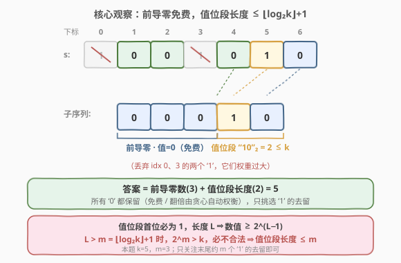
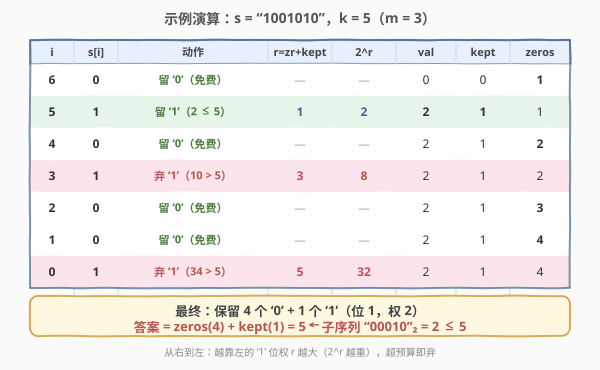

# LeetCode 小于等于K的最长二进制子序列 题解

## 1. 题目概述

- **标题 / 题号**：小于等于 K 的最长二进制子序列（#2311，medium）
- **链接**：https://leetcode.cn/problems/longest-binary-subsequence-less-than-or-equal-to-k/
- **难度**：中等
- **标签**：贪心、字符串、位运算

**题意**：给你一个二进制字符串 `s` 和一个正整数 `k`，请返回 `s` 的**最长**子序列的长度，且该子序列对应的**二进制数值**小于等于 `k`。

**注意**：

- 子序列可以含**前导 0**；
- **空串**视为数值 `0`；
- 子序列是从原串中删除若干字符后、不改变顺序得到的剩余序列。

**示例 1**：

```text
输入：s = "1001010", k = 5
输出：5
解释：s 中 ≤ 5 的最长子序列是 "00010"，十进制为 2。
     "00100"(=4)、"00101"(=5) 同样是长度 5 的可行解。
```

**示例 2**：

```text
输入：s = "00101001", k = 1
输出：6
解释："000001" 是 ≤ 1 的最长子序列，十进制为 1。
```

**约束**：

- $1 \le \text{s.length} \le 1000$
- `s[i]` 为 `'0'` 或 `'1'`
- $1 \le k \le 10^9$

> 💡 关键量级：$k \le 10^9 < 2^{30}$，所以任何**值位段**（从第一个保留的 `1` 到末尾的有效数值部分）长度一旦超过 $m = \lfloor \log_2 k \rfloor + 1 \le 30$，其数值就 $\ge 2^m > k$ 必然不合法。这意味着真正"决定数值大小"的 `1` 至多 30 个，为 $O(n)$ 贪心埋下伏笔。

## 2. 解题思路

### 2.1 暴力思路

枚举 `s` 的所有子序列（$2^n$ 个），逐个转成十进制判断是否 $\le k$，取最长。$n = 1000$ 时 $2^{1000}$ 完全不可行。

> ⚠️ 暴力的浪费在于：许多子序列共享前缀却各自独立计算；且我们只关心"长度尽可能长 + 数值不超预算"，并不需要枚举所有方案。

### 2.2 核心观察：前导零免费 + 值位段有界 + 低位优先选 `1`



子序列的二进制数值由两部分决定：

1. **前导零**（第一个保留的 `1` 之前的所有 `0`）：它们位于更高位但取值为 $0$，**不改变数值**，只增加长度——属于"免费的"长度，能留则留。
2. **值位段**（从第一个保留的 `1` 到末尾）：首位必为 `1`，长度 $L$ 的值位段数值 $\ge 2^{L-1}$。一旦 $L > m = \lfloor \log_2 k \rfloor + 1$，数值 $\ge 2^m > k$，**必然不合法**。因此值位段长度 $\le m \le 30$。

进一步可证（贪心保证）：**保留 `s` 中所有的 `0`、只挑选 `1` 的去留，就能达到最优**。理由是 `0` 对数值贡献为 $0$，丢掉一个夹在中间的 `0` 顶多让某个 `1` 的位权减半（省下一点预算），却要付出 $-1$ 长度的代价；从右到左贪心选 `1` 时会自动权衡这种翻倍，无需刻意丢 `0`。

> 💡 **数值的可加性**：在"保留所有 `0`"的前提下，最终子序列的数值 $= \sum_{\text{保留的 }1} 2^{r_i}$，其中 $r_i = $（该 `1` 右侧的 `0` 数）$+$（右侧已保留的 `1` 数），即该 `1` 在最终二进制数中的**位**。每个保留的 `1` 占据一个不同的位 $r_i$，数值就是这些 $2^{r_i}$ 之和。

于是问题转化为：**在预算 $k$ 内，从位权最小的 `1` 开始尽可能多地保留 `1`，使 $\sum 2^{r_i} \le k$，最大化保留的 `1` 的个数。** 这是经典的"个数最大化、权重预算"贪心——优先选最轻的（从右向左扫描，越靠右的 `1` 位权越小），选得上就选，选不上说明它（以及更靠左、位权更大的 `1`）已超预算，直接跳过。

> ⚠️ 注意位权相互依赖：保留右侧一个 `1` 会把左侧所有 `1` 的位权 $r$ 各 $+1$（翻倍其 $2^r$）。因此必须**从右到左**处理，这样在判定某个 `1` 时，它右侧已保留的 `1` 数已经确定，$r_i$ 就是精确的"右侧保留位数"，$2^{r_i}$ 也是精确贡献，无需事后修正。

### 2.3 算法流程图


整体只从右向左扫一遍：遇 `0` 必留（`zeros++`，并把它计入"右侧零数" `zr`）；遇 `1` 计算 $r = \text{zr} + \text{kept}$，若 $r < 31$（即 $2^r$ 不会大到必然超预算）且 $\text{val} + 2^r \le k$ 则保留（`val += 2^r`、`kept++`），否则丢弃。最终答案为 `zeros + kept`。

### 2.4 示例演算



以 $s = \text{"1001010"}$、$k = 5$（$m = 3$）为例，从右向左：

- `i=6 '0'`：留零，`zr=1`，`zeros=1`。
- `i=5 '1'`：$r = \text{zr}(1) + \text{kept}(0) = 1$，$2^1 = 2$，$0 + 2 \le 5$ ⇒ **保留**，`val=2, kept=1`。
- `i=4 '0'`：留零，`zr=2`，`zeros=2`。
- `i=3 '1'`：$r = 2 + 1 = 3$，$2^3 = 8$，$2 + 8 = 10 > 5$ ⇒ **丢弃**。
- `i=2 '0'`、`i=1 '0'`：留零，`zr=4`，`zeros=4`。
- `i=0 '1'`：$r = 4 + 1 = 5$，$2^5 = 32$，$2 + 32 = 34 > 5$ ⇒ **丢弃**。

最终 `zeros(4) + kept(1) = 5`，对应子序列 `"00010"`（数值 $2 \le 5$）。

> ⚠️ 直觉陷阱：从左到右"能留就留"的贪心是**错的**——它会在 `i=0` 留下那个最靠左的 `1`（成为最高位、吃光预算），得到 `"100"`(=4) 长度 3，远非最优。必须**从右到左**、优先留低位 `1`，才能把高位 `1` 腾给"免费的前导零"。

## 3. 参考代码

### C++

```cpp
class Solution {
public:
    int longestSubsequence(string s, int k) {
        int n = s.size();
        long long val = 0;        // 当前已保留 1 的数值之和
        int kept = 0;             // 已保留的 1 的个数
        int zeros = 0, zr = 0;    // zeros=总保留 0 数；zr=当前 1 右侧的 0 数
        for (int i = n - 1; i >= 0; --i) {
            if (s[i] == '0') {
                zeros++;          // 0 必留
                zr++;
            } else {
                int r = zr + kept;           // 该 1 在最终数中的位
                if (r < 31) {                 // 2^30 > 1e9 >= k，r>=30 必超预算
                    long long contrib = 1LL << r;
                    if (val + contrib <= k) {
                        val += contrib;
                        kept++;
                    }
                }
            }
        }
        return zeros + kept;
    }
};
```

### Python

```python
class Solution:
    def longestSubsequence(self, s: str, k: int) -> int:
        val = 0
        kept = 0
        zeros = 0
        zr = 0                       # 当前 1 右侧的 0 数（从右往左累计）
        for ch in reversed(s):
            if ch == '0':
                zeros += 1           # 0 必留
                zr += 1
            else:
                r = zr + kept        # 该 1 在最终数中的位
                if r < 31:           # 2^30 > 1e9 >= k，r>=30 必超预算
                    contrib = 1 << r
                    if val + contrib <= k:
                        val += contrib
                        kept += 1
        return zeros + kept
```

> ⚠️ **两个易错点**：
> 1. **必须用 64 位**。$k$ 与 $\text{val}$ 可达 $10^9$ 量级，C++ 中 `val`、`contrib` 用 `long long`；`1LL << r` 才不会在 $r=29,30$ 时溢出。Python 整数精度无限，无需操心。
> 2. **`r < 31` 是防溢出的护栏**，而非严格界。真正能保留的 `1` 满足 $2^r \le k < 2^{30}$，故 $r \le 29$；$r \ge 30$ 时 $2^r > k$ 必然被 `val + contrib <= k` 判否。加这一层避免 `1 << 999` 在 C++ 中溢出，逻辑上等价。
>
> 💡 也可不显式记 `zr`：从右扫时顺手累计"右侧 0 数"即可，本写法把 `zeros` 与 `zr` 合并在同一循环，更紧凑。

## 4. 复杂度分析

| 维度 | 复杂度 | 说明 |
|------|--------|------|
| 时间复杂度 | $O(n)$ | 从右到左扫描一遍，每个字符 $O(1)$ 处理；`r < 31` 护栏保证位运算常数时间 |
| 空间复杂度 | $O(1)$ | 仅用 `val / kept / zeros / zr` 等常数个变量 |

## 5. 扩展：为何"从右到左"是对的、而"从左到右"会错

把子序列数值写成 $V = \sum 2^{r_i}$ 后，问题本质是"在 $\sum 2^{r_i} \le k$ 下选最多项"。因为 $\{2^{r_i}\}$ 是**两两不同的 2 的幂**（每个保留的 `1` 占据不同位），这恰是一个二进制数的逐位表示。从右到左、按 $r$ 从小到大贪心地"能加就加"，等价于**从最低位起逐位构造一个尽可能长、且 $\le k$ 的二进制数**：

- 若某个低位的 `1` 都加不进去（$2^r > k - \text{val}$），那任何更高位（$r$ 更大）的 `1` 更加不进去，直接跳过——不会遗漏。
- 加进一个低位 `1` 会把更高位的 `1` 权重翻倍，但这个翻倍在**判定该更高位 `1` 时**已通过 $r = \text{zr} + \text{kept}$ 精确计入，无需回溯修正。

反过来，"从左到右能留就留"会优先把**最高位**（最靠左）的 `1` 留下，使 $V$ 瞬间逼近 $k$，后续低位 `1` 与夹在中间的 `0`（它们会让 $V$ 翻倍）再也塞不进去，长度反而最短。本题的精髓正是**把高位让给免费的前导零、把预算花在低位的 `1` 上**，于是"从右到左"成为唯一正确的扫描方向。

> 💡 另一个等价视角：答案 $=$（前导零数）$+$（值位段长度 $\le m$）。值位段长度受 $m \le 30$ 上界约束，故哪怕 $n = 1000$，真正参与"数值博弈"的也仅末尾约 $m$ 个 `1`，算法天然 $O(n)$。

## 6. 面试要点

1. **为什么前导零是"免费"的？**

   - 前导零位于第一个保留的 `1` 之前，处在更高位却取值 $0$，对数值贡献为 $0$，只增加长度。所以保留它们永远不会让数值变大，应尽可能保留。

2. **为什么保留所有的 `0` 不会让答案变差？**

   - 夹在 `1` 之间的 `0` 确实会翻倍其左侧 `1` 的位权，但"从右到左贪心"在判定每个 `1` 时已通过 $r = \text{zr} + \text{kept}$ 精确计入这些 `0` 的翻倍效应；若某个 `1` 因此超预算就丢弃它。所以保留所有 `0` + 贪心选 `1` 已能取到最优，无需刻意丢 `0`。

3. **`r = zr + kept` 中的两项分别是什么？**

   - `zr` 是该 `1` **右侧的 `0` 数**（全部保留，固定），`kept` 是该 `1` **右侧已保留的 `1` 数**（从右到左已决定）。两者之和 = 该 `1` 在最终二进制数中距离最低位的位数 $r$，贡献即 $2^r$。

4. **$k$ 高达 $10^9$，溢出与边界要注意什么？**

   - $k, \text{val} \in [0, 10^9]$，C++ 用 `long long` 存 `val` 与 `contrib`，`1LL << r` 避免溢出；用 `r < 31` 护栏避免 $r$ 高达 $n-1 \approx 999$ 时 `1 << r` 的未定义行为。Python 无此虑。另外 $k \ge 1$ 保证至少能保留数值为 $1$ 的单个 `1`，无需特判空串。

5. **如果把题改成"子序列数值恰好等于 $k$"还能这样做吗？**

   - 不能直接套。"至多 $k$"（上界）是贪心友好的：超过预算就丢、且更靠左的更超；"恰好 $k$"是精确值问题，丢一个 `1` 可能正好过头也可能不够，没有"超了就丢一定最优"的单调性，通常需 DP（按位、状态为余数）处理，复杂度上升。

> 💡 **一句话总结**：2311 的核心是"前导零免费 + 值位段 $\le \lfloor \log_2 k \rfloor + 1$ 位 + 从右到左低位优先选 `1`"——保留所有 `0`、对 `1` 按位权 $2^r$ 贪心、$O(n)$ 一遍扫完。

## 同类练习题

| # | 题目 | 与本题的关联 |
|---|------|-------------|
| 402 | [移掉 K 位数字](https://leetcode.cn/problems/remove-k-digits/)（[题解](../0401-0500/402_移掉K位数字.md)） | 同为"选子序列使数值满足要求"的贪心，但目标是数值最小（单调栈），对照本题"长度最大 + 数值 ≤ k"的低位优先贪心 |
| 67 | [二进制求和](https://leetcode.cn/problems/add-binary/)（[题解](../0001-0100/67_二进制求和.md)） | 按二进制位权从右（低位）向左处理，对照本题"从右到左、按 $2^r$ 累加"的视角 |
| 231 | [2 的幂](https://leetcode.cn/problems/power-of-two/)（[题解](../0201-0300/231_2的幂.md)） | 用 2 的幂性质判定，对照本题"值位段超 $m = \lfloor \log_2 k \rfloor + 1$ 位则 $\ge 2^m > k$ 不合法"的界 |
| 2575 | [找出可整除二进制串的偏移量](https://leetcode.cn/problems/find-the-divisibility-array-of-a-string/) | 二进制前缀对应数值与整除判定，对照"二进制串 ↔ 数值"的换算 |
| 1673 | [找出最具竞争力的子序列](https://leetcode.cn/problems/find-the-most-competitive-subsequence/) | 贪心选子序列（单调栈），对照不同目标下的子序列贪心范式 |
