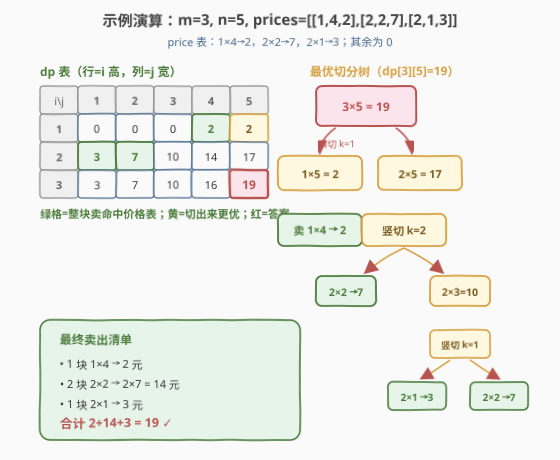

# 卖木头块

- **题目名称**：卖木头块
- **链接**：[2312. 卖木头块](https://leetcode.cn/problems/selling-pieces-of-wood/)
- **难度**：困难
- **标签**：动态规划、二维 DP、记忆化搜索、切分型 DP

## 1. 题目概述

给定一块高为 `m`、宽为 `n` 的矩形木块，以及一张价格表 `prices`，其中 `prices[i] = [hi, wi, pricei]` 表示可以以 `pricei` 元卖掉一块 `hi × wi` 的矩形小木块。每次操作可沿**垂直方向贯穿整高**或**水平方向贯穿整宽**切一刀，把木块完全分成两块更小的矩形；可切任意多次。切好若干小木块后，按价格表卖掉其中任意子集（同尺寸可重复卖、不必全卖），求最终能得到的**最多钱数**。

> ⚠️ **不能旋转**：`h × w` 的木块只能按原朝向卖，不能转成 `w × h`。因此 `price[h][w]` 与 `price[w][h]`（当 `h ≠ w`）是两条独立的报价。

**示例 1**：

```text
输入：m = 3, n = 5, prices = [[1,4,2],[2,2,7],[2,1,3]]
输出：19
解释：3×5 木块切成
  - 2 块 2×2  → 2 × 7 = 14 元
  - 1 块 2×1  → 1 × 3 = 3 元
  - 1 块 1×4  → 1 × 2 = 2 元
  合计 14 + 3 + 2 = 19 元（最优）
```

**示例 2**：

```text
输入：m = 4, n = 6, prices = [[3,2,10],[1,4,2],[4,1,3]]
输出：32
解释：4×6 木块切成
  - 3 块 3×2  → 3 × 10 = 30 元
  - 1 块 1×4  → 1 × 2 = 2 元
  合计 30 + 2 = 32 元（最优，注意 1×4 不能转成 4×1）
```

**约束条件**：

- $1 \le m, n \le 200$
- $1 \le \text{prices.length} \le 2 \times 10^4$
- $\text{prices[i].length} == 3$
- $1 \le h_i \le m,\ 1 \le w_i \le n,\ 1 \le \text{price}_i \le 10^6$
- 所有 $(h_i, w_i)$ **互不相同**

> 💡 **审题关键**：① 切割**必须完全贯穿**——一刀下去整条边都断开，得到两个更小的**矩形**，不能只切一段；② 切好之后子块独立定价、互不影响，这正是**最优子结构**的来源；③ 「不能旋转」意味着 DP 维度方向固定，`dp[i][j]` 中 `i` 始终是高、`j` 始终是宽。

---

## 2. 解题思路

### 2.1 暴力思路：枚举所有切法（不可行）

最朴素的想法定义「方案」= 一棵二叉切割树，每个内部节点选「横切/竖切 + 切点 k」。但切割树形态无限（每次切完还能继续切），方案数随尺寸指数爆炸，且尺寸 `200×200` 时无法直接枚举所有切法。

> ⚠️ **关键转折**：我们**不关心具体切了几块、切成什么样**，只关心「一块 `i×j` 木块最多能卖多少钱」。把目标函数写成 `dp[i][j]` 后，切法之间的差异被压扁成「取哪个切点的子问题之和最大」——这是把指数级方案空间压缩成 $O(mn)$ 个子问题的关键。

### 2.2 核心观察：二维 DP，三选一取最大

![核心观察：dp[i][j] = max(整块卖, 横切, 竖切)](../images/selling_wood_concept.svg)

定义 $dp[i][j]$ 表示**高为 $i$、宽为 $j$ 的木块**能卖出的最多钱数。对一块 `i×j` 木块，只有三类决策，取其最大：

**决策 ① 整块出售**：若价格表里有 `i×j` 的报价 `price[i][j]`，则直接卖整块得 `price[i][j]` 元；否则该选项值为 `0`（这格尺寸不整卖）。

**决策 ② 横切一刀（贯穿整宽，分裂高度 $i$）**：在高度 $k$（$1 \le k < i$）处横切，得到上块 `k×j` 与下块 `(i−k)×j`，两块独立定价求和：

$$\text{cutH}(i,j) = \max_{1 \le k < i}\bigl(dp[k][j] + dp[i-k][j]\bigr)$$

**决策 ③ 竖切一刀（贯穿整高，分裂宽度 $j$）**：在宽度 $k$（$1 \le k < j$）处竖切，得到左块 `i×k` 与右块 `i×(j−k)`：

$$\text{cutV}(i,j) = \max_{1 \le k < j}\bigl(dp[i][k] + dp[i][j-k]\bigr)$$

合并三选项即得状态转移：

$$\boxed{\,dp[i][j] = \max\Bigl(\,\text{price}[i][j],\ \max_{1 \le k < i}(dp[k][j] + dp[i-k][j]),\ \max_{1 \le k < j}(dp[i][k] + dp[i][j-k])\Bigr)\,}$$

> 💡 **三个观察撑起整个解法**：
> - **最优子结构**——切完两块各自独立定价，子问题互不相干，故「整体最优 = 子问题最优之和」；
> - **切点互斥可合并**——横切与竖切是对 `i×j` 的两类不相交决策，分别取 `max` 再并入总 `max` 即覆盖全部切法（任何切割树的根节点要么不切、要么横切一刀、要么竖切一刀）；
> - **天然拓扑序**——切点 $k \in [1,i)$ 使子块尺寸 $k, i-k$ 严格小于 $i$，故按 $i$ 从小到大、$j$ 从小到大填表时，所依赖的子状态必然已就位。
>
> ⚠️ **不能旋转的影响**：若允许旋转，则 `dp[i][j]` 还要考虑 `dp[j][i]`，状态空间耦合；本题禁止旋转，故 `i`（高）与 `j`（宽）方向固定，`dp` 维度独立递推——这是「不能旋转」反成好事的典型。

### 2.3 算法流程图

![流程：初始化价格表 → 双重循环 → 横切竖切取最大 → 返回 dp[m][n]](../images/selling_wood_flow.svg)

| 步骤 | 操作 | 作用 |
|------|------|------|
| ① | 建二维价格表 `price[h][w]`，初始化 `dp[i][j] = price[i][j]` | 整块出售的「基线值」 |
| ② | 双重循环 `i: 1→m`，`j: 1→n` | 按尺寸递增填表，保证子问题先算好 |
| ③a | 对每个 `i×j`，枚举横切点 `k∈[1,i)`，取 `dp[k][j]+dp[i-k][j]` 的最大 | 贯穿整宽横切的所有可能 |
| ③b | 对每个 `i×j`，枚举竖切点 `k∈[1,j)`，取 `dp[i][k]+dp[i][j-k]` 的最大 | 贯穿整高竖切的所有可能 |
| ④ | `dp[i][j] = max(dp[i][j], ③a, ③b)` | 整块卖 vs 横切 vs 竖切，三者取最大 |
| ⑤ | 返回 `dp[m][n]` | `m×n` 整块的最优值 |

> ⚠️ **初始化顺序**：`price[i][j]` 必须在填 `dp[i][j]` 前就位（基线值）。切点循环要在 `dp[i][j]` 已经等于基线值后进行 `max` 更新——这样「整块卖」天然作为候选之一参与比较，无需特殊处理「价格表无此尺寸」的情况（无则基线为 0）。

### 2.4 示例演算



以示例 1（`m=3, n=5`，`price: 1×4→2, 2×2→7, 2×1→3`）为例，逐格填表。先初始化基线，再按 `i` 升序、`j` 升序逐格更新。

**步骤 ① 初始化基线（`dp[i][j] = price[i][j]`，缺省 0）**

| i \ j | 1 | 2 | 3 | 4 | 5 |
|-------|---|---|---|---|---|
| 1 | 0 | 0 | 0 | **2** | 0 |
| 2 | **3** | **7** | 0 | 0 | 0 |
| 3 | 0 | 0 | 0 | 0 | 0 |

**步骤 ② 逐格用切点更新（仅列关键格）**

- `dp[1][4] = 2`：横切无（$k<1$ 无），竖切 $k=1,2,3$ 均得 $0$，基线 `price[1][4]=2` 最大 → **2**
- `dp[2][2] = 7`：横切 $k=1$ → $dp[1][2]+dp[1][2]=0$；竖切 $k=1$ → $dp[2][1]+dp[2][1]=6$；基线 `7` 最大 → **7**
- `dp[2][3] = 10`：竖切 $k=1$ → $dp[2][1]+dp[2][2]=3+7=10$ → **10**
- `dp[2][4] = 14`：竖切 $k=2$ → $dp[2][2]+dp[2][2]=7+7=14$ → **14**
- `dp[2][5] = 17`：竖切 $k=2$ → $dp[2][2]+dp[2][3]=7+10=17$ → **17**
- `dp[3][4] = 16`：横切 $k=1$ → $dp[1][4]+dp[2][4]=2+14=16$ → **16**
- `dp[3][5] = 19`：横切 $k=1$ → $dp[1][5]+dp[2][5]=2+17=19$；竖切 $k=1$ → $dp[3][1]+dp[3][4]=3+16=19$ → **19** ✓

**步骤 ③ 回溯最优切分树**

`dp[3][5]=19` 取自横切 $k=1$：

- 上块 `1×5` → `dp[1][5]=2`，取自竖切 → `dp[1][4]=2`（整卖 `1×4`）+ `1×1` 不卖
- 下块 `2×5` → `dp[2][5]=17`，取自竖切 $k=2$：
  - 左 `2×2` → 整卖 `7`
  - 右 `2×3` → `dp[2][3]=10`，取自竖切 $k=1$：
    - 左 `2×1` → 整卖 `3`
    - 右 `2×2` → 整卖 `7`

最终卖出：`1×4`(2) + `2×2`(7) + `2×1`(3) + `2×2`(7) = **19**，与示例一致。

> 💡 **回溯技巧**：实际代码只要求返回最大钱数，不必回溯切法。若面试被追问「具体怎么切」，可在每个 `dp[i][j]` 旁记一个 `choice[i][j]`（`0`=整卖/`k`=切点+方向），填完表从 `dp[m][n]` 递归展开即可还原一棵切割树。

---

## 3. 参考代码

### C++

```cpp
class Solution {
public:
    long long sellingWood(int m, int n, vector<vector<int>>& prices) {
        vector<vector<long long>> price(m + 1, vector<long long>(n + 1, 0));
        for (auto& p : prices) {
            price[p[0]][p[1]] = p[2];
        }
        vector<vector<long long>> dp(m + 1, vector<long long>(n + 1, 0));
        for (int i = 1; i <= m; ++i) {
            for (int j = 1; j <= n; ++j) {
                dp[i][j] = price[i][j];
                for (int k = 1; k < i; ++k) {
                    dp[i][j] = max(dp[i][j], dp[k][j] + dp[i - k][j]);
                }
                for (int k = 1; k < j; ++k) {
                    dp[i][j] = max(dp[i][j], dp[i][k] + dp[i][j - k]);
                }
            }
        }
        return dp[m][n];
    }
};
```

> 💡 **写法要点**：
> - 用 `long long` 防 `10^6 × 200 × 200` 量级乘积溢出——单格最大值约 $4 \times 10^4 \times 10^6 = 4 \times 10^{10}$，超出 `int` 上界 $2.1 \times 10^9$。
> - `price` 用二维数组而非哈希表：尺寸上界 200，二维数组仅 $201 \times 201$ 格，$O(mn)$ 预处理 + $O(1)$ 查询，比 `map<pair,int>` 更快且更简单。
> - 横切循环 `k∈[1,i)` 与竖切循环 `k∈[1,j)` 顺序无关，但**都在 `dp[i][j]` 已置基线值后**用 `max` 更新，保证「整块卖」候选不丢。

### Python

```python
class Solution:
    def sellingWood(self, m: int, n: int, prices: List[List[int]]) -> int:
        price = [[0] * (n + 1) for _ in range(m + 1)]
        for h, w, p in prices:
            price[h][w] = p

        dp = [[0] * (n + 1) for _ in range(m + 1)]
        for i in range(1, m + 1):
            for j in range(1, n + 1):
                dp[i][j] = price[i][j]
                for k in range(1, i):
                    dp[i][j] = max(dp[i][j], dp[k][j] + dp[i - k][j])
                for k in range(1, j):
                    dp[i][j] = max(dp[i][j], dp[i][k] + dp[i][j - k])
        return dp[m][n]
```

### Python（记忆化搜索版，对照递推写法）

```python
from functools import lru_cache

class Solution:
    def sellingWood(self, m: int, n: int, prices: List[List[int]]) -> int:
        price = [[0] * (n + 1) for _ in range(m + 1)]
        for h, w, p in prices:
            price[h][w] = p

        @lru_cache(None)
        def dfs(i: int, j: int) -> int:
            best = price[i][j]
            for k in range(1, i):
                best = max(best, dfs(k, j) + dfs(i - k, j))
            for k in range(1, j):
                best = max(best, dfs(i, k) + dfs(i, j - k))
            return best

        return dfs(m, n)
```

> 💡 **递推 vs 记忆化**：两者状态数与转移同构，复杂度一致。递推按尺寸升序填表天然利用拓扑序；记忆化自顶向下更贴近「定义即答案」的思维方式，且自动跳过不可达尺寸（本题尺寸大多可达，差异不大）。面试中优先写递推版避免递归栈深度顾虑（$m,n \le 200$ 时递归深度最多 200，Python 默认栈够用，但显式递推更稳妥）。

---

## 4. 复杂度分析

| 维度 | 复杂度 | 说明 |
|------|--------|------|
| 时间复杂度 | $O(mn(m+n))$ | 共 $mn$ 个状态；每状态枚举横切点 $O(i)$ 与竖切点 $O(j)$，合计 $O(i+j) \le O(m+n)$。$m=n=200$ 时约 $200\times200\times400 \approx 1.6\times10^7$，毫秒级 |
| 空间复杂度 | $O(mn)$ | `dp` 与 `price` 各 $O(mn)$；记忆化版另加递归栈 $O(m+n)$ |

> 💡 **能否更快？** 切点枚举的 $O(m+n)$ 难以再降——每个切点对应不同的子问题组合，无法直接二分或单调队列优化（目标函数是两个子状态之和，非凸非单调）。常数上可做小优化：只枚举到 $k \le i/2$（$k$ 与 $i-k$ 对称）能把横切循环减半，竖切同理，但渐近仍是 $O(mn(m+n))$，且对称剪枝需注意 $k=i/2$ 的自对称边界，收益有限，初版不写更安全。

---

## 5. 扩展：切分对称性与状态空间压缩

### 5.1 对称切点剪枝

注意到 $dp[k][j] + dp[i-k][j]$ 与 $dp[i-k][j] + dp[k][j]$ 完全相同（加法交换），枚举 $k$ 从 $1$ 到 $i-1$ 时，$k$ 与 $i-k$ 是重复计算。可只枚举 $k \in [1, \lfloor i/2 \rfloor]$，把横切循环减半：

```cpp
for (int k = 1; k <= i / 2; ++k) {
    dp[i][j] = max(dp[i][j], dp[k][j] + dp[i - k][j]);
}
```

> ⚠️ **边界**：$k = i/2$ 时 `k == i-k`（$i$ 为偶数），$dp[k][j]+dp[k][j] = 2\,dp[k][j]$，仍合法（同一尺寸卖两块），不可漏。竖切同理枚举 $k \in [1, \lfloor j/2 \rfloor]$。实测约省一半常数，但渐近不变。

### 5.2 若允许旋转会怎样？

若题目放宽「可旋转」，则 `price[h][w]` 与 `price[w][h]` 等价，`dp` 也需对称化：$dp[i][j]$ 在 $i \neq j$ 时还要参考 $dp[j][i]$（把木块横过来定价）。状态间出现循环依赖，需改用记忆化搜索或先按「短边 $\le$ 长边」归一化尺寸再填表。本题禁止旋转恰好规避了这一耦合，使二维 DP 维度独立——这是审题时值得点明的「约束即福利」。

### 5.3 与一维修的对照

把本题退化成一维：若 `n=1`（只能横切、宽度固定），则 $dp[i][1] = \max(price[i][1], \max_{k<i}(dp[k][1]+dp[i-k][1]))$，正是 [343 整数拆分](../0301-0400/343_整数拆分.md)「把 $n$ 拆成若干正整数之积最大」的结构骨架——343 是「拆分求积」，本题是「拆分求和」，同属「切分型 DP」家族，区别只在合并算子（积 vs 和）与目标（乘积最大 vs 价值和最大）。

---

## 6. 面试要点

**Q1：为什么这题是 DP 而不是贪心？**

> 因为「切哪一刀」没有局部最优策略——某尺寸木块直接卖可能很贵，但切成两块各自再卖之和可能更贵（如 `2×4` 直卖若 `0`、切成两个 `2×2` 各卖 `7` 得 `14`）。每一步的最优取决于子问题的最优值，需把所有子问题答案算出来后比较，无法用单次贪心选择定夺。这正是「最优子结构 + 子问题重叠」的 DP 信号。

**Q2：状态为什么是 $dp[i][j]$ 而不是「剩余矩形坐标」？**

> 因为本题的「价值」只依赖矩形的**尺寸** $i \times j$，与它在原木块中的**位置**无关——价格表按尺寸报价、不按位置。所以子问题可由尺寸唯一标识，$O(mn)$ 个状态足够。若价格随位置变（如不同区域地价不同），才需把坐标编进状态，状态数会暴涨。

**Q3：横切与竖切的切点为什么要枚举到 $i-1$ / $j-1$？切在 $i$ 处会怎样？**

> 切点 $k$ 表示「在距一边 $k$ 处切断」，得到尺寸 $k$ 与 $i-k$ 两块。$k \in [1, i-1]$ 保证两块尺寸都 $\ge 1$（边长至少为 1 的矩形才有意义）。若 $k=i$ 则一块尺寸为 $0$，不是合法矩形；若 $k=0$ 同理。故切点范围是 $[1, i-1]$（横切）/ $[1, j-1]$（竖切）。

**Q4：为什么 `dp[i][j]` 要先初始化为 `price[i][j]`？直接从 0 开始更新不行吗？**

> 必须先置基线 `price[i][j]` 再用切点取 `max`。若初值是 0，则「整块出售」这一候选需单独写分支判断（`if price[i][j] > 0` 才参与比较）；而先置基线后，`max` 自然把「整块卖」当作候选之一——写法更简洁且不漏候选。代价仅 $O(1)$ 赋值，可忽略。

**Q5：`long long` 是必须的吗？**

> 是。最坏情况 `m=n=200`，每格可由多个 $10^6$ 报价累加。例如全部切成 $1\times1$ 各卖 $10^6$，总和 $200\times200\times10^6 = 4\times10^{10}$，远超 `int` 上界 $2.1\times10^9$。虽然实际测试用例未必触顶，但用 `long long` 是正确的工程习惯；Python 整数无限精度无此虑。

> 💡 **一句话总结**：2312 是「切分型二维 DP」——`dp[i][j] = max(整块卖, 横切枚举, 竖切枚举)`，三选一取最大。关键是把无限切割方案压缩成 $O(mn)$ 个尺寸子问题，靠「切完两块独立定价」的最优子结构保证正确。与 343 整数拆分同属切分家族，区别在合并算子（和 vs 积）。

---

## 7. 同类练习题

- [343. 整数拆分](https://leetcode.cn/problems/integer-break/)（[题解](../0301-0400/343_整数拆分.md)）：一维切分型 DP 的母题——把 $n$ 拆成若干正整数之积最大，$dp[i]=\max(dp[i-k]\times k,\ (i-k)\times k)$。本题是其二维推广（切矩形求价值和最大），结构骨架同构，对照理解「切点枚举」
- [1444. 切披萨的方案数](https://leetcode.cn/problems/number-of-ways-of-cutting-a-pizza/)（[题解](../1401-1500/1444_切披萨的方案数.md)）：同为「矩形贯穿切分 + DP」——但目标是切 $k$ 刀的方案数（计数 DP）而非最大值，且子问题依赖「剩余矩形是否含苹果」。对照本题理解「切分型 DP 的计数 vs 最值两种目标」
- [312. 戳气球](https://leetcode.cn/problems/burst-balloons/)（[题解](../0301-0400/312_戳气球.md)）：区间 DP——按「最后操作」划分区间，$dp[i][j]$ 表示戳掉区间 $(i,j)$ 内气球的最大收益。与本题「按切点划分尺寸」对偶：312 切的是**位置区间**，2312 切的是**尺寸**，两题都靠「枚举切点 + 子问题合并」
- [62. 不同路径](https://leetcode.cn/problems/unique-paths/)（[题解](../0001-0100/62_不同路径.md)）：二维网格 DP 入门——$dp[i][j]=dp[i-1][j]+dp[i][j-1]$，与本题共享「按 $i,j$ 双重循环填表」的二维 DP 骨架，对照理解尺寸维度递推的方向性
- [1465. 切割后面积最大的蛋糕](https://leetcode.cn/problems/maximum-area-of-a-piece-of-cake-after-horizontal-and-vertical-cuts/)（[题解](../1401-1500/1465_切割后面积最大的蛋糕.md)）：也是「横竖贯穿切矩形」，但只切固定几刀、求最大子块面积——是本题「只切一刀求最大块」的退化场景，对照理解「固定切点」与「枚举切点」的差别
