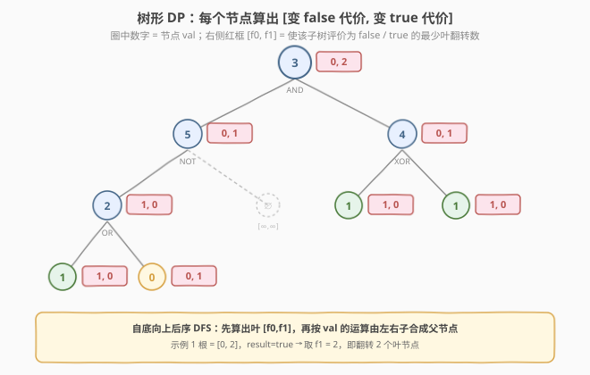

# 二叉树中得到结果所需的最少翻转次数

- **题目名称**：二叉树中得到结果所需的最少翻转次数
- **链接**：[2313. 二叉树中得到结果所需的最少翻转次数](https://leetcode.cn/problems/minimum-flips-in-binary-tree-to-get-result/)
- **难度**：困难
- **标签**：树、深度优先搜索、动态规划、二叉树

## 1. 题目概述

给定一棵**二叉树**的根 `root`，节点取值含义如下：

- **叶节点**：值为 `0`（false）或 `1`（true）。
- **非叶节点**：值为 `2` / `3` / `4` / `5`，分别代表布尔运算 **OR / AND / XOR / NOT**。

节点的**评价**（evaluate）递归定义：

- 叶节点：评价 = 自身值。
- 非叶节点：把其值对应的运算作用于**左右子节点评价**，结果即该节点评价。

再给你布尔值 `result`，表示 `root` 节点**期望的评价结果**。

**操作**：一次操作可以**翻转一个叶节点**——`false ↔ true`（即 `0 ↔ 1`）。注意**只能翻叶子**，非叶节点的运算（`2`/`3`/`4`/`5`）是**固定不可改**的。

返回使 `root` 评价等于 `result` 所需的**最少操作数**。题目保证总有解。

> ⚠️ **结构约定**：`OR`/`AND`/`XOR` 节点有**左右两个孩子**；`NOT` 节点**只有一个孩子**（可能是左孩子或右孩子，另一个为空）。

**示例 1**：

```text
输入：root = [3,5,4,2,null,1,1,1,0], result = true
输出：2
解释：至少需要翻转 2 个叶节点才能使 root 的评价为 true。
```

对应树结构（层序还原）：

```text
            3 (AND)
           /        \
       5 (NOT)    4 (XOR)
        /          /    \
    2 (OR)       1      1
     /  \
    1    0
```

**示例 2**：

```text
输入：root = [0], result = false
输出：0
解释：root 的评价已经为 false，无需翻转。
```

**约束条件**：

- 树中节点数在 $[1, 10^5]$ 范围内。
- $0 \le \text{Node.val} \le 5$。
- `OR` / `AND` / `XOR` 节点有 `2` 个子节点；`NOT` 只有 `1` 个子节点。
- 叶节点值为 `0` 或 `1`；非叶节点值为 `2` / `3` / `4` / `5`。

> 💡 **关键信号**：每个节点"想"得到某个布尔结果的最小代价，**只取决于子树能给出什么、代价多少**，与树外其余部分无关——这是典型的**最优子结构**，提示用**树形 DP**：后序 DFS，每个节点只向上返回"两个数"即可，无需在全局上做搜索。

---

## 2. 解题思路

### 2.1 暴力思路

每个叶节点可翻或不翻，共 $2^{L}$ 种翻法（$L$ 为叶数，最坏可达 $5\times 10^4$）。对每种翻法把整棵树求值一次，再判根评价是否等于 `result`，取其中翻转数最小的方案。这是指数级的，完全不可行。其浪费在于：**同一棵子树在不同全局方案下被重复求值**，而子树本身的最优代价是封闭的。利用这一最优子结构，就能把指数搜索压缩成线性递推。

### 2.2 核心观察：树形 DP，每节点返回 $[f_0, f_1]$

定义 `dfs(node)` 返回一个**二元组** $[f_0, f_1]$：

- $f_0$ = 使 `node` 子树的评价为 **false** 所需的最少叶翻转数；
- $f_1$ = 使 `node` 子树的评价为 **true** 所需的最少叶翻转数。

则答案为 $\text{dfs}(\text{root})[\text{result ? 1 : 0}]$。

记左子结果 $l = [l_0, l_1]$、右子结果 $r = [r_0, r_1]$，空节点返回 $[+\infty, +\infty]$。按 `node.val` 分情况合成：



| val | 运算 | $f_0$（变 false） | $f_1$（变 true） |
|-----|------|--------------------|-------------------|
| `0` | 叶（false） | `0` | `1`（翻叶） |
| `1` | 叶（true） | `1`（翻叶） | `0` |
| `2` | **OR** | 左右都 false：$l_0+r_0$ | 至少一个 true：$\min(l_0+r_1,\, l_1+r_0,\, l_1+r_1)$ |
| `3` | **AND** | 至少一个 false：$\min(l_0+r_0,\, l_0+r_1,\, l_1+r_0)$ | 左右都 true：$l_1+r_1$ |
| `4` | **XOR** | 左右相同：$\min(l_0+r_0,\, l_1+r_1)$ | 左右不同：$\min(l_0+r_1,\, l_1+r_0)$ |
| `5` | **NOT** | 子须 true（取反得 false）：$\min(l_1,\, r_1)$ | 子须 false（取反得 true）：$\min(l_0,\, r_0)$ |

> 💡 **NOT 的统一写法**：NOT 只有一个孩子，另一个为空。空节点返回 $[+\infty, +\infty]$，于是 $\min(l_1, r_1)$ 会自动选中"真实孩子"那一项、把 $+\infty$ 顶掉。因此**不必特判"孩子在左还是在右"**，统一用 `min(left, right)` 即可，代码极简。

> ⚠️ **为什么非叶节点没有翻转代价？** 因为题目规定**只能翻叶子**，`2/3/4/5` 这些运算节点是固定不可改的——它们的"代价"只来自子树，自身不产生额外开销。这是与"可翻转运算符"类题目的根本区别，务必读清题意。

### 2.3 算法流程图


### 2.4 示例演算

以示例 1（`result = true`）自底向上演算，每个节点算出 $[f_0, f_1]$：


- 叶 `1` → $[1, 0]$（已是 true，翻一下才得 false）；
- 叶 `0` → $[0, 1]$；
- `idx3 (OR)`：$l=[1,0]$、$r=[0,1]$ → $f_0=1+0=1$，$f_1=\min(2,0,1)=0$ → $[1,0]$；
- `idx2 (XOR)`：$l=[1,0]$、$r=[1,0]$ → $f_0=\min(2,0)=0$，$f_1=\min(1,1)=1$ → $[0,1]$；
- `idx1 (NOT)`：$l=[1,0]$、$r=[\infty,\infty]$ → $f_0=\min(0,\infty)=0$，$f_1=\min(1,\infty)=1$ → $[0,1]$；
- `idx0 (AND 根)`：$l=[0,1]$、$r=[0,1]$ → $f_0=\min(0,1,1)=0$，$f_1=1+1=2$ → $[0,2]$。

根 $[0,2]$，`result=true` 取 $f_1=2$。一种达成方案：翻 `idx7` 的叶 `1→0`（使 `idx3 OR=false`，经 `NOT` 变 `true`），再翻 `idx6` 的叶 `1→0`（使 `idx2 XOR=true`），两子都 `true` 则 `AND=true`，共 **2** 次翻转 ✔。

---

## 3. 参考代码

### C++

```cpp
/**
 * Definition for a binary tree node.
 * struct TreeNode {
 *     int val;
 *     TreeNode *left;
 *     TreeNode *right;
 *     TreeNode() : val(0), left(nullptr), right(nullptr) {}
 *     TreeNode(int x) : val(x), left(nullptr), right(nullptr) {}
 *     TreeNode(int x, TreeNode *left, TreeNode *right) : val(x), left(left), right(right) {}
 * };
 */
class Solution {
public:
    int minimumFlips(TreeNode* root, bool result) {
        // dfs 返回 {使该子树评价为 false 的最少翻转, 使其为 true 的最少翻转}
        function<pair<int, int>(TreeNode*)> dfs = [&](TreeNode* node) -> pair<int, int> {
            if (!node) return {1 << 30, 1 << 30};          // 空节点：不可达
            int x = node->val;
            if (x < 2) return {x, x ^ 1};                  // 叶：0->[0,1], 1->[1,0]
            auto [l0, l1] = dfs(node->left);
            auto [r0, r1] = dfs(node->right);
            int a = 0, b = 0;                              // a=f0, b=f1
            if (x == 2) {                                  // OR
                a = l0 + r0;
                b = min({l0 + r1, l1 + r0, l1 + r1});
            } else if (x == 3) {                           // AND
                a = min({l0 + r0, l0 + r1, l1 + r0});
                b = l1 + r1;
            } else if (x == 4) {                           // XOR
                a = min(l0 + r0, l1 + r1);
                b = min(l0 + r1, l1 + r0);
            } else {                                       // NOT (5)：单孩，空孩 ∞ 自动失效
                a = min(l1, r1);
                b = min(l0, r0);
            }
            return {a, b};
        };
        auto [a, b] = dfs(root);
        return result ? b : a;
    }
};
```

### Python

```python
# Definition for a binary tree node.
# class TreeNode:
#     def __init__(self, val=0, left=None, right=None):
#         self.val = val
#         self.left = left
#         self.right = right
class Solution:
    def minimumFlips(self, root: Optional[TreeNode], result: bool) -> int:
        INF = inf

        def dfs(node: Optional[TreeNode]) -> tuple[int, int]:
            if node is None:
                return INF, INF                      # 空节点不可达
            x = node.val
            if x in (0, 1):
                return x, x ^ 1                      # 叶：0->[0,1], 1->[1,0]
            l0, l1 = dfs(node.left)
            r0, r1 = dfs(node.right)
            if x == 2:                                # OR
                return l0 + r0, min(l0 + r1, l1 + r0, l1 + r1)
            if x == 3:                                # AND
                return min(l0 + r0, l0 + r1, l1 + r0), l1 + r1
            if x == 4:                                # XOR
                return min(l0 + r0, l1 + r1), min(l0 + r1, l1 + r0)
            return min(l1, r1), min(l0, r0)          # NOT (5)

        return dfs(root)[int(result)]
```

> 💡 **实现细节**：用 `1 << 30`（C++）/ `inf`（Python）表示"不可达"，保证任何真实代价都更小，使 `min` 自然忽略空孩子分支；叶节点用 `x, x ^ 1` 一行写出两种取值，无需 `if x == 0 / x == 1` 分支。

---

## 4. 复杂度分析

| 维度 | 复杂度 | 说明 |
|------|--------|------|
| 时间复杂度 | $O(n)$ | 每个节点做常数次 `min`/加法（最多枚举 4 种子状态组合），整树后序遍历一次 |
| 空间复杂度 | $O(n)$ | 递归栈深度；最坏退化链为 $O(n)$，平衡树为 $O(\log n)$。返回值仅 2 个 int，不计入 |

> ⚠️ 本题状态空间极小（每节点只 2 个标量），关键在于"**状态定义贴合题意**"：把"评价为 0/1 的最小代价"作为状态，运算节点天然成为转移函数，无需任何额外维度。

---

## 5. 扩展：输出具体翻转方案

若题目改为要求**输出翻转了哪些叶节点**，只需在 DP 返回值旁再带一个"最优决策"——即对每个 $f_0/f_1$ 记录取到最小值时选用的 `(子目标组合)`，再自顶向下回溯即可还原方案。例如 AND 节点取 $f_1=l_1+r_1$ 时，记录"左子需 true、右子需 true"，递归下钻到叶子即得到该翻哪些叶。状态不变、只多存指针，复杂度仍为 $O(n)$。

---

## 6. 面试要点

1. **为什么想到树形 DP 而非在叶子上搜索？**
   - $L$ 个叶子的翻法是 $2^L$ 种，搜索指数爆炸；而"子树想得到某布尔结果的最小代价"只依赖子树自身（最优子结构），把指数搜索折叠成"每节点两标量"的线性递推。看到"每节点只关心 0/1 两种结果"的二叉树代价题，第一反应应是树形 DP。

2. **状态为什么只取 2 维（false/true）而非更多？**
   - 节点的评价结果只有 false/true 两种，运算节点的"目标"也只在这两种之间二选一。每种目标对应一个最小代价，故 $[f_0, f_1]$ 足以覆盖全部信息；运算本身固定，无需把"运算符种类"纳入状态维度。

3. **NOT 节点只有一个孩子，代码如何避免特判左右？**
   - 让空孩子返回 $[+\infty,+\infty]$，再用 $\min(l_1, r_1)$、$\min(l_0, r_0)$ 取较小。$\infty$ 会被真实孩子的代价顶掉，于是无论独子在左还是在右，公式都成立，省去"判断哪个非空"的分支。

4. **AND/OR 的 true/false 转移为什么是"至少一个"与"都"的镜像？**
   - `AND` 为真当且仅当两子都真（$f_1=l_1+r_1$），为假当至少一子假（对三种"一真一假/两假"取 min）；`OR` 恰好镜像：为假当两子都假（$f_0=l_0+r_0$），为真当至少一子真。把这两个成对记忆，不易写反。

5. **能否改成"也允许翻转运算节点"的变体？怎么扩展？**
   - 给运算节点也加"改运算"的代价：枚举目标运算 $t\in\{2,3,4,5\}$，代价为 `0 (t==x) 否则 1`（注意 `NOT` 与二元运算互换可能改变孩子数合法性，需约定）。在 $t$ 下用对应的合成规则算 $[f_0,f_1]$，再取所有 $t$ 的最小值即可，状态维度不变，仅转移多一层枚举。

---

## 7. 同类练习题

- [2331. 计算布尔二叉树的值](https://leetcode.cn/problems/evaluate-boolean-binary-tree/)：本题的"无翻转"姊妹篇，同样的 0/1 叶 + 2/3 运算，只求评价不问代价，理解评价递归后再看翻转版更顺
- [337. 打家劫舍 III](https://leetcode.cn/problems/house-robber-iii/)（[站内题解](../0301-0400/337_打家劫舍III.md)）：树形 DP 母题，每节点返回 `[偷, 不偷]` 二元组向上合并，与本题 `[f0, f1]` 同构
- [968. 监控二叉树](https://leetcode.cn/problems/binary-tree-cameras/)：每节点返回"三种状态"的树形 DP，状态定义更细，承接本题"用状态覆盖目标结果"的思路
- [124. 二叉树中的最大路径和](https://leetcode.cn/problems/binary-tree-maximum-path-sum/)：后序 DFS 返回"子树贡献"向上合并，训练"子树封闭最优子结构"的直觉
- [834. 树中距离之和](https://leetcode.cn/problems/sum-of-distances-in-tree/)：换根 DP，节点信息在父子方向各传一次，对照本题"信息只自底向上"的单向传递
