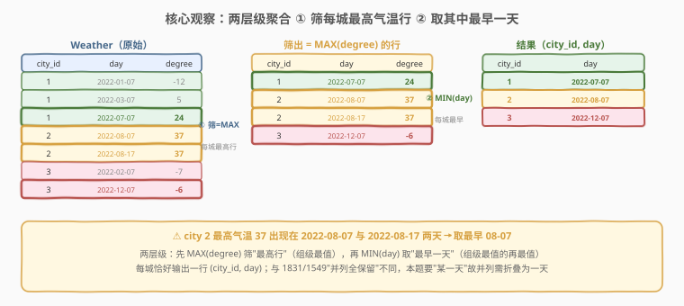
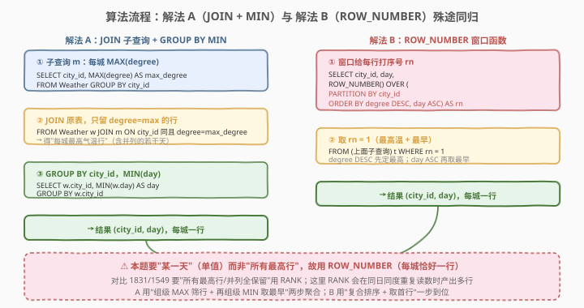
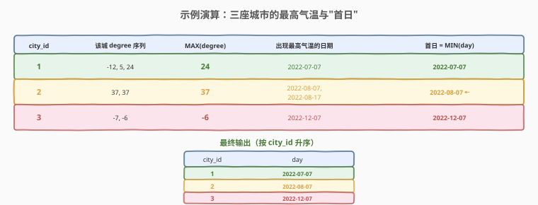

# 每个城市最高气温的第一天

- **题目名称**：每个城市最高气温的第一天
- **链接**：[2314. 每个城市最高气温的第一天 🔒](https://leetcode.cn/problems/the-first-day-of-the-maximum-recorded-degree-in-each-city/)
- **难度**：中等
- **标签**：数据库、SQL、`GROUP BY`、`MAX()`、`MIN()`、`JOIN` 子查询、窗口函数、`ROW_NUMBER`、`RANK` vs `ROW_NUMBER`、组级最值的再最值、LeetCode 锁题

## 1. 题目概述

给定 `Weather` 表，记录各城市若干天的气温。编写 SQL 查询，找出**每个城市出现最高气温的那一天中最早的一天**——即：先确定每座城市的最高气温 $\max(\text{degree})$，再在该城市所有"气温等于最高气温"的记录里取**最早**的 `day`。返回 `city_id` 与 `day` 两列，按 `city_id` 升序排列。

**表结构**：

```text
Table: Weather
+----------+---------+
| Column   | Type    |
+----------+---------+
| city_id  | int     |
| day      | date    |
| degree   | int     |
+----------+---------+
(city_id, day) 是该表具有唯一值的列（主键）。
每行表示某城市在某一天记录的气温。
```

> ⚠️ **锁题说明**：2314 为 LeetCode **Plus 会员专享题**，题目正文不公开。本篇题解依据官方公开的样例测试用例（表结构 `Weather(city_id, day, degree)` 与下方示例数据）复原题意、样例与约束；输出列名 / 排序以官方样例为准（样例输出按 `city_id` 升序）。

**示例 1**：

```text
输入：
Weather 表:
+---------+------------+--------+
| city_id | day        | degree |
+---------+------------+--------+
| 1       | 2022-01-07 | -12    |
| 1       | 2022-03-07 | 5      |
| 1       | 2022-07-07 | 24     |
| 2       | 2022-08-07 | 37     |
| 2       | 2022-08-17 | 37     |
| 3       | 2022-02-07 | -7     |
| 3       | 2022-12-07 | -6     |
+---------+------------+--------+

输出:
+---------+------------+
| city_id | day        |
+---------+------------+
| 1       | 2022-07-07 |
| 2       | 2022-08-07 |
| 3       | 2022-12-07 |
+---------+------------+
```

**解释**：

| 城市 | degree 序列 | 最高气温 | 出现最高气温的日期 | 首日 |
|------|------------|----------|-------------------|------|
| 1 | -12, 5, 24 | 24 | 2022-07-07 | 2022-07-07 |
| 2 | 37, 37 | 37 | 2022-08-07, 2022-08-17 | 2022-08-07（取最早） |
| 3 | -7, -6 | -6 | 2022-12-07 | 2022-12-07 |

**约束条件**：

- `city_id` 与 `day` 的组合在表中具有唯一值（每城每日一条读数）；
- `degree` 可为负数、零或正数（最高气温亦可能为负，如城市 3 的 $-6$）；
- 每座城市至少有一条记录，故每城必出现在结果中；
- 结果含 `city_id`、`day` 两列，按 `city_id` 升序排列。

> 💡 **关键观察**：这是「组级最值的再最值」——第一层 `MAX(degree)` 找每城最高气温，第二层 `MIN(day)` 在「最高气温行」里取最早。难点有二：① **两层聚合的衔接**（`GROUP BY` 后拿不到行级 `day`，须先筛行再聚合）；② **排序列数与并列**——与 1831/1549 单列排序「并列全保留」不同，本题按 `(degree, day)` 复合排序取首行，详见第 5 节。

---

## 2. 解题思路

### 2.1 暴力思路：逐城扫描

最直觉的过程式做法：对每座城市，取出其全部记录，找出 `MAX(degree)`，再在「气温等于该最高值」的行里挑 `day` 最小者。伪代码：

```text
for each city c:
    rows = SELECT * FROM Weather WHERE city_id = c
    max_deg = max(r.degree for r in rows)
    cand = [r for r in rows if r.degree == max_deg]   # 最高气温行
    answer[c] = min(r.day for r in cand)               # 最早一天
```

但 SQL 无显式逐行循环，需换成「集合式」表达。关键是：`MAX(degree)` 是**组级**值，`GROUP BY city_id` 后只能 SELECT 聚合列或分组键，拿不到同组的具体 `day`——故须「先算组级 MAX 筛行级，再组级 MIN 取最早」，把两层最值拆成两个聚合阶段。

### 2.2 核心观察：两层级聚合——筛「最高行」再取「最早天」



问题拆为三步：

1. **算每城最高气温**（组级聚合）：子查询 `SELECT city_id, MAX(degree) FROM Weather GROUP BY city_id` 得 `(city_id, max_degree)` 二维表。
2. **筛「最高气温行」**（行级过滤）：把原表 `JOIN` 该子查询，`ON city_id 同且 degree = max_degree`，只留气温恰为该城最高的行。此时一座城市可能保留**多行**（最高气温跨多天）。
3. **取最早一天**（再组级聚合）：对保留行 `GROUP BY city_id`，`SELECT MIN(day)`——把多天折叠为最早那一天。每城恰好输出一行。

$$\text{首日}(c) = \min\{\, \text{day} : (\text{city\_id}=c) \land (\text{degree} = \max_{c}\text{degree}) \,\}$$

> 💡 **为何要拆两步？** 直接 `SELECT city_id, MIN(day) ... GROUP BY city_id` 会把「非最高气温」的更早日期也算进来——如城市 1 的 `2022-01-07`（$-12$）比 `2022-07-07`（$24$）早，但那天并非最高。故必须**先用 MAX 筛掉非最高行，再对剩下的行取 MIN**：MAX 管「是否最高」，MIN 管「最早是哪天」，两层各司其职，缺一不可。

### 2.3 算法流程图



两条等价路径：

| 维度 | 解法 A：JOIN 子查询 + GROUP BY MIN | 解法 B：ROW_NUMBER 窗口函数 |
|------|------------------------------------|------------------------------|
| **思路** | 组级 MAX 筛行 → 再组级 MIN 取最早 | 复合排序 `degree DESC, day ASC`，取每城首行 |
| **关键写法** | `JOIN (SELECT city_id, MAX(degree) ... GROUP BY city_id) ON degree=max_degree`，外层 `GROUP BY city_id, MIN(day)` | `ROW_NUMBER() OVER (PARTITION BY city_id ORDER BY degree DESC, day ASC)`，外层 `WHERE rn=1` |
| **并列处理** | 多个最高行被 `MIN(day)` 折叠为最早一天 | 按 `(degree, day)` 复合排序；`(city_id, day)` 唯一时城内无并列，RANK/ROW_NUMBER 结果一致——选 ROW_NUMBER 表「取首行」之意且对重复读数稳健 |
| **依赖窗口函数** | 否（兼容 MySQL 5.7） | 是（MySQL 8.0+） |
| **推荐度** | ✓ **通用首选** | ✓ 进阶首选（一步到位，扩展性好） |

> ⚠️ **本题与 1831/1549 的关键区别在「排序列数」**：1831/1549 按**单列**（`amount`/`order_date`）排序，同组内常见并列（同额/同日多行）→ 必须用 `RANK` 保并列，`ROW_NUMBER` 会丢并列行。本题按 **`(degree, day)` 两列**排序，在 `(city_id, day)` 唯一时城内 `(degree, day)` 不重复 → **无并列** → RANK/ROW_NUMBER 结果一致，都给单一首日。此时选 `ROW_NUMBER` 是因语义匹配（「取首行」）与稳健性（同日重复读数下不爆多行）。详见第 5 节。

### 2.4 示例演算



以官方样例数据走一遍解法 A 的「筛最高行 → MIN(day)」两步：

| 城市 | degree 序列 | MAX(degree) | 出现最高气温的日期 | 首日 = MIN(day) |
|------|------------|------------|-------------------|-----------------|
| 1 | -12, 5, 24 | 24 | 2022-07-07 | 2022-07-07 |
| 2 | 37, 37 | 37 | 2022-08-07, 2022-08-17 | 2022-08-07（取最早） |
| 3 | -7, -6 | -6 | 2022-12-07 | 2022-12-07 |

- **步骤①② 筛最高行**：城市 1 留 `(07-07, 24)`；城市 2 留 `(08-07, 37)` 与 `(08-17, 37)` 两行；城市 3 留 `(12-07, -6)`。
- **步骤③ MIN(day)**：城市 1 → 07-07；城市 2 → $\min(\text{08-07}, \text{08-17}) = \text{08-07}$；城市 3 → 12-07。
- **排序**：按 `city_id` 升序 → `(1,07-07)、(2,08-07)、(3,12-07)`。

> 💡 **城市 2 是核心考点**：最高气温 37 跨两天出现，`MAX(degree)` 把两天都「筛进来」，再由 `MIN(day)` 折叠为 08-07。这正是「两层级聚合」的体现——少了第二步会误返回两天（多行），少了第一步会把更早的非最高日（如城市 1 的 01-07）误当首日。

---

## 3. 参考代码

### SQL（解法 A：JOIN 子查询 + GROUP BY MIN，推荐）

```sql
SELECT w.city_id, MIN(w.day) AS day
FROM Weather w
JOIN (
    SELECT city_id, MAX(degree) AS max_degree
    FROM Weather
    GROUP BY city_id
) m
    ON w.city_id = m.city_id
   AND w.degree = m.max_degree
GROUP BY w.city_id
ORDER BY w.city_id;
```

> 💡 **写法要点**：
> - 子查询 `m` 算出每城 `(city_id, max_degree)`；`JOIN ... ON degree = max_degree` 把原表过滤到「气温恰为该城最高」的行——这是「组级 MAX 回填到行级」。
> - 外层 `GROUP BY w.city_id, MIN(w.day)` 把（可能跨多天的）最高行折叠为最早那一天。`MIN(day)` 对 `date` 类型或 `'YYYY-MM-DD'` 字符串都按时间 / 字典序正确取最早（ISO 8601 格式字典序 = 时间序）。
> - `ORDER BY w.city_id` 保证输出按城市号升序，与官方样例一致。
> - 兼容 MySQL 5.7 等不支持窗口函数的版本，**通用首选**。

### SQL（解法 B：ROW_NUMBER 窗口函数，一步到位）

```sql
SELECT city_id, day
FROM (
    SELECT city_id, day,
           ROW_NUMBER() OVER (
               PARTITION BY city_id
               ORDER BY degree DESC, day ASC
           ) AS rn
    FROM Weather
) t
WHERE rn = 1
ORDER BY city_id;
```

> 💡 **写法要点**：
> - `PARTITION BY city_id` 每城独立编号；`ORDER BY degree DESC, day ASC` 先按气温降序（最高在前），再按日期升序（最早在前）——`rn=1` 即「最高气温里最早那一天」。
> - **复合排序的关键**：`day ASC` 用来在「同 degree 的多行」里挑最早——这正是「折叠为最早一天」的窗口写法。若只写 `degree DESC`（单列），同 degree 的多行会并列，`ROW_NUMBER` 任意取一行（未必最早）。
> - **用 `ROW_NUMBER`**：本题要「某一天」单值，`ROW_NUMBER` 保证每城恰好一行。在 `(city_id, day)` 唯一时城内 `(degree, day)` 不重复 → 无并列 → `RANK`/`DENSE_RANK` 与之结果一致；选 `ROW_NUMBER` 还因其在同日重复读数（唯一键放松）的边角下仍只给一行，而 `RANK` 会给多行。详见第 5 节。
> - 窗口函数在 `SELECT` 阶段计算，**晚于 `WHERE`**，故必须套子查询先算 `rn`，外层再 `WHERE rn=1`。
> - 需 MySQL 8.0+ / PostgreSQL / SQL Server 等支持窗口函数的版本。

### SQL（解法 C：NOT EXISTS 相关子查询 + MIN，语义对照）

```sql
SELECT w.city_id, MIN(w.day) AS day
FROM Weather w
WHERE NOT EXISTS (
    SELECT 1
    FROM Weather w2
    WHERE w2.city_id = w.city_id
      AND w2.degree > w.degree
)
GROUP BY w.city_id
ORDER BY w.city_id;
```

> 💡 **写法要点**：
> - `NOT EXISTS (... w2.degree > w.degree)` 筛出「本城不存在气温比自己更高」的行——即最高气温行（反连接思想，承接 1831 解法 C / 1581）。
> - 再 `GROUP BY city_id, MIN(day)` 折叠为最早一天，与解法 A 的第二步一致。
> - 与解法 A 等价：$x = \max S \iff \nexists y \in S,\ y > x$。相关子查询对每行执行一次，最坏 $O(n^2)$；`(city_id, degree)` 上有复合索引时可降到 $O(n \log n)$。

### Python（pandas）

```python
import pandas as pd

def the_first_day_of_the_maximum_recorded_degree_in_each_city(weather: pd.DataFrame) -> pd.DataFrame:
    weather = weather.copy()
    max_degree = weather.groupby('city_id')['degree'].transform('max')   # 每行广播本城最高气温
    max_rows = weather[weather['degree'] == max_degree]                  # 只留"最高气温"行
    idx = max_rows.groupby('city_id')['day'].idxmin()                    # 每城最早那一天的下标
    result = max_rows.loc[idx, ['city_id', 'day']]
    return result.sort_values('city_id').reset_index(drop=True)
```

> 💡 **pandas 对照**：
> - `groupby('city_id')['degree'].transform('max')` 对应解法 A 的子查询 `MAX(degree) ... GROUP BY city_id`——`transform` 把组级 MAX 广播回每行，长度与原 DataFrame 对齐。
> - `weather['degree'] == max_degree` 对应 `JOIN ON degree = max_degree` 行级过滤，筛出最高气温行。
> - `groupby('city_id')['day'].idxmin()` 对应外层 `GROUP BY city_id, MIN(day)`——返回每城最早行的下标，折叠并列。
> - 若想对照解法 B 的 `ROW_NUMBER`：`weather.sort_values(['city_id','degree','day'], ascending=[True, False, True]).drop_duplicates('city_id', keep='first')[['city_id','day']]`，即复合排序后每城取首行。
> - ⚠️ **不能用 `idxmax` 直接取首日**：`groupby('city_id')['degree'].idxmax()` 返回最大值首次出现的下标，受 DataFrame 原始顺序影响；若未按 `day` 排序，可能取到较晚的一天。须如上「先 transform 筛最高行，再 idxmin 取最早」两步，与 SQL 两层级聚合严格对应。

---

## 4. 复杂度分析

| 维度 | 解法 A（JOIN+MIN） | 解法 B（ROW_NUMBER） | 解法 C（NOT EXISTS） | pandas |
|------|--------------------|----------------------|----------------------|--------|
| **时间** | $O(n)$（哈希聚合）/ $O(n \log n)$（排序聚合） | $O(n \log n)$ | $O(n^2)$（最坏）/ $O(n \log n)$（有索引） | $O(n \log n)$ |
| **空间** | $O(n)$ | $O(n)$ | $O(1)$ 额外 | $O(n)$ |
| **依赖窗口函数** | 否 | 是（MySQL 8.0+） | 否 | 否 |
| **并列折叠** | ✓ `MIN(day)` | ✓ `ROW_NUMBER` 唯一 | ✓ `MIN(day)` | ✓ `idxmin` |
| **推荐度** | ✓ **通用首选** | ✓ 进阶首选 | ✓ 语义对照 | ✓ 验证用 |

> - $n$ = `Weather` 表行数。
> - **时间**：解法 A 子查询 `GROUP BY` 哈希聚合 $O(n)$ + `JOIN` 半 / 哈希连接 $O(n)$ + 外层 `GROUP BY MIN` $O(n)$，总体 $O(n)$（排序聚合则为 $O(n \log n)$）。解法 B 分区排序 $O(n \log n)$ + 过滤 $O(n)$。解法 C 对每行执行相关子查询，最坏 $O(n^2)$；`Weather(city_id, degree)` 上建复合索引可降到 $O(n \log n)$。
> - **空间**：解法 A 的子查询物化 / 哈希表 $O(n)$；解法 B 的窗口排序缓冲 $O(n)$；解法 C 仅常数额外空间。
> - **索引优化**：在 `Weather(city_id, degree)` 上建复合索引可让解法 A 的 `JOIN` 走索引等值、解法 C 的子查询走索引范围扫描；`Weather(city_id, degree DESC, day ASC)` 的覆盖索引可让解法 B 的窗口排序直接走索引顺序。

---

## 5. 扩展：何时 RANK ≠ ROW_NUMBER——「并列保留」与「取首行」的边界

`RANK` 与 `ROW_NUMBER` 只在 **ORDER BY 列存在并列**时才不同。关键判据是：**排序键是否构成（分组内的）唯一键**。

### 5.1 本题的排序键：`(degree DESC, day ASC)` 在城内唯一吗？

设城市 2 有两行最高气温 37：`08-07` 与 `08-17`。按 `degree DESC, day ASC` 排序：

| 行 (day, degree) | 排序键 (degree, day) | `ROW_NUMBER` | `RANK` |
|------------------|----------------------|--------------|--------|
| 08-07, 37 | (37, 08-07) | 1 | 1 |
| 08-17, 37 | (37, 08-17) | 2 | 2 |

> 💡 两行 **degree 相同但 day 不同** → 排序键 `(degree, day)` **不同** → `RANK` 也分 1、2，**无并列**！关键：`RANK` 只在**整个排序键**相等时才同号，仅 degree 相等不足以并列。故在 `(city_id, day)` 唯一（每城每日一条读数）的前提下，城内 `(degree, day)` 不重复 → `RANK`/`DENSE_RANK`/`ROW_NUMBER` **结果完全一致**，都给单一 `rn=1` 行（08-07）。

### 5.2 那 RANK 与 ROW_NUMBER 何时才不同？

只有当**同分组内两行排序键完全相等**时：

| 场景 | 排序键 | 是否并列 | RANK vs ROW_NUMBER |
|------|--------|----------|---------------------|
| 1831 按 `amount DESC` 排，同日两笔同额 | (amount,) 相等 | ✓ 并列 | RANK 都=1（保留两行）；ROW_NUMBER 1,2（丢一行） |
| 1549 按 `order_date DESC` 排，同商品同日两单 | (order_date,) 相等 | ✓ 并列 | RANK 都=1；ROW_NUMBER 1,2 |
| **2314 按 `degree DESC, day ASC` 排** | (degree, day) 城内唯一 | ✗ 无并列 | **两者一致，都给单行** |

> ⚠️ **本题选 `ROW_NUMBER` 的真正理由**：① **语义匹配**——要「某一天」单值，`ROW_NUMBER` 天然保证每城一行；② **稳健性**——若 `(city_id, day)` 唯一键假设放松（同日重复读数），排序键 `(degree, day)` 可能并列，此时 `RANK` 会给多行 `rn=1`（产出重复），而 `ROW_NUMBER` 仍只给一行。`RANK` 在本题「恰好可用」是因为排序键无并列，并非其语义正确——选 `ROW_NUMBER` 是「对的工具做对的事」。

### 5.3 与 1831/1549 的对照

| 维度 | 1831 / 1549（并列全保留） | **2314（折叠为首日）** |
|------|--------------------------|--------------------------|
| 排序列数 | 单列（amount / order_date） | 两列（degree, day） |
| 排序键是否唯一 | 否（同额 / 同日可重复） | 是（`(city_id,day)` 唯一 ⟹ `(degree,day)` 城内唯一） |
| 是否有并列 | 有 | 无（PK 下） |
| RANK 与 ROW_NUMBER | **不同**：RANK 保留并列、ROW_NUMBER 丢 | **相同**（无并列） |
| 选函数 | **必须 RANK**（要保留） | `ROW_NUMBER`（语义 + 稳健） |

> 💡 **一句话辨析**：「`RANK` 与 `ROW_NUMBER` 是否相同」取决于**排序键有无并列**，而非题目本身。1831/1549 单列排序有并列 → 两者不同 → 按语义选（保留用 `RANK`）；2314 复合排序无并列 → 两者相同 → 选 `ROW_NUMBER` 表「取首行」之意，且对边角（重复读数）稳健。理解了「排序键是否唯一键」这一判据，就能判断何时函数选择真正影响结果。

### 5.4 变体：若题目改为「最高气温的每一天都返回」（并列全保留）

把 `ORDER BY` 改为单列 `degree DESC`（去掉 `day ASC`），并用 `RANK`：

```sql
SELECT city_id, day
FROM (
    SELECT city_id, day,
           RANK() OVER (PARTITION BY city_id ORDER BY degree DESC) AS rk
    FROM Weather
) t
WHERE rk = 1
ORDER BY city_id, day;
```

> 💡 去掉 `day ASC` 后，排序键只剩 `degree` → 城市 2 的两个 37 并列 → `RANK` 都=1 → 两行全保留（08-07、08-17），退化回 1831/1549 的「并列全保留」模式。对比可见：**加 `day ASC` 是为了「折叠取最早」，去 `day ASC` 则「保留所有最高日」**——同一张表，排序键的列数决定并列与否，进而决定保留 vs 折叠。

---

## 6. 面试要点

1. **本题解法 B 用 `ROW_NUMBER`，能用 `RANK` 吗？**

   > 能——在 `(city_id, day)` 唯一的前提下，结果与 `ROW_NUMBER` **完全一致**。原因：`RANK` 只在**整个排序键**相等时才同号；本题排序键是 `(degree, day)`，城内 `day` 不重复 ⟹ `(degree, day)` 不重复 ⟹ 无并列，`RANK`/`DENSE_RANK`/`ROW_NUMBER` 都给单一 `rn=1`。选 `ROW_NUMBER` 的理由是**语义**（要「某一天」单值，强制每城一行）与**稳健性**（若唯一键放松、出现同日重复读数，`RANK` 会产出重复行而 `ROW_NUMBER` 不会）。这与 1831/1549 不同——它们按单列排序、并列常见，必须用 `RANK` 保并列，`ROW_NUMBER` 会丢行。

2. **为什么必须拆两层聚合，不能一步 `MIN(day)`？**

   > 直接 `SELECT city_id, MIN(day) ... GROUP BY city_id` 会取每城最早的 `day`，但那天未必是最高气温——如城市 1 的 `01-07`（$-12$）比 `07-07`（$24$）早却非最高。须先用 `MAX(degree)` 过滤到「最高气温行」，再对这些行取 `MIN(day)`。两层最值各司其职：MAX 管「是否最高」，MIN 管「最早是哪天」。

3. **解法 A 的 `JOIN` 与解法 C 的 `NOT EXISTS` 为何等价？**

   > 「`degree` 等于该城最高」⇔「本城不存在 `degree` 更高的行」。形式化：$x = \max S \iff \nexists y \in S,\ y > x$。解法 A 正向（等于 MAX），解法 C 反向（无更大者），逻辑等价，都先筛出最高行，再 `MIN(day)` 折叠。解法 C 是 1831 解法 C / 1581 反连接招牌的复用。

4. **`MIN(day)` 对 `date` 与字符串都成立吗？**

   > 成立。`day` 为 `date` 类型时 `MIN` 按时间序取最早；为 `'YYYY-MM-DD'` 字符串时按字典序比较，因 ISO 8601 格式字典序 = 时间序，结果一致。故两种类型都正确。若 `day` 含时间部分（`datetime`），则需 `DATE(day)` 截断后比较——但本题 `day` 为纯日期，无需截断（与 1831 的 `datetime` 分组不同）。

5. **三种解法性能与面试首选？**

   > 解法 A（JOIN+MIN）：$O(n)$ 哈希聚合，优化器常改写为哈希连接，通用稳定，**通用首选**；解法 B（ROW_NUMBER）：$O(n \log n)$ 一次排序到位，**进阶首选**，扩展到 Top-K 友好；解法 C（NOT EXISTS）：$O(n^2)$ 最坏，仅作禁用窗口函数且不用 MAX 的语义对照。面试答：「首选 A——兼容性好、语义直观；若上 MySQL 8.0+，B 更简洁且扩展性好；三者核心都是『组级 MAX 筛行 + 再组级 MIN 取最早』，区别只在筛行手段（JOIN / 排序 / 反连接）。」

> 💡 **一句话总结**：2314 是「组级最值的再最值」——先 `MAX(degree)` 筛每城最高气温行，再 `MIN(day)` 折叠为最早那一天。要点：① 两层聚合缺一不可（少了 MAX 会误取非最高日，少了 MIN 会留多天）；② 解法 B 用 `ROW_NUMBER` + `ORDER BY degree DESC, day ASC` 一步到位——因排序键 `(degree, day)` 在城内唯一而无并列，`RANK`/`ROW_NUMBER` 此处一致，选 `ROW_NUMBER` 表「取首行」之意且对边角稳健；对比 1831/1549 单列排序有并列、必须 `RANK` 保并列。记住「MAX 筛行 + MIN 取最早」这条公式，所有「每组取最值的首例」SQL 题都能套用。

---

## 7. 同类练习题

- [1831. 每天的最大交易](https://leetcode.cn/problems/maximum-transaction-each-day/)（[题解](../1801-1900/1831_每天的最大交易.md)）：分组求最值母题变体，**单列排序有并列、必须 `RANK` 保并列**，与本题「复合排序无并列、`ROW_NUMBER` 取首行」形成「保留 vs 折叠」对照
- [1549. 每件商品的最新订单 🔒](https://leetcode.cn/problems/the-most-recent-orders-for-each-product/)（[题解](../1501-1600/1549_每件商品的最新订单.md)）：Top-1 per group 保并列（`RANK`），与本题「取首日单值（`ROW_NUMBER`）」方向相反，对照学习
- [184. 部门工资最高的员工](https://leetcode.cn/problems/department-highest-salary/)（[题解](../0101-0200/184_部门工资最高的员工.md)）：分组求最值入门母题，`MAX + IN`/`RANK`/自连接三解法，本题解法 A/C 即其延伸
- [511. 游戏玩法分析 I](https://leetcode.cn/problems/game-play-analysis-i/)（[题解](../0501-0600/511_游戏玩法分析I.md)）：求每玩家最早登录日（`MIN` 取组内最早），与本题「`MIN(day)` 取最早」同属取组内首例；对比 511 是纯 `MIN`、2314 是 `MAX` 筛后再 `MIN` 的两层
- [1174. 即时食物配送 II 🔒](https://leetcode.cn/problems/immediate-food-delivery-ii/)（[题解](../1101-1200/1174_即时食物配送II.md)）：求每顾客首次订单（最早日期）并算比例，共享「组内取最早行」骨架，对照 `MIN` 取首例的应用
