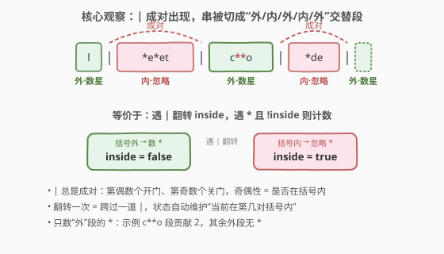
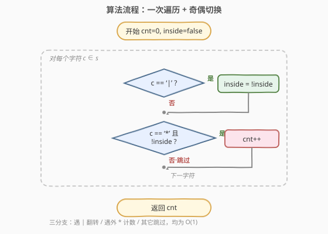
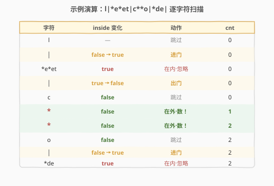

# LeetCode 统计星号 题解

## 1. 题目概述

- **标题 / 题号**：统计星号（#2315，easy）
- **链接**：https://leetcode.cn/problems/count-asterisks/
- **难度**：简单
- **标签**：字符串、模拟、状态标志（奇偶切换）、一次遍历

**题意**：给定字符串 `s`，其中每两个连续的竖线 `|` 配成一对（成对出现），成对的 `|` 之间的内容位于「括号内」被忽略。返回**不在任何一对 `|` 之间**的 `*` 字符个数。

**示例 1**：

```text
输入：s = "l|*e*et|c**o|*de|"
输出：2
解释：不在成对 | 之间的 * 共 2 个（来自 c**o 段）。
成对 | 之间（忽略）的内容：*e*et、*de。
```

**示例 2**：

```text
输入：s = "iamprogrammer"
输出：0
解释：字符串中没有 * 字符。
```

**示例 3**：

```text
输入：s = "yo|uar|e**|b|e***au|tifu|l"
输出：5
解释：不在成对 | 之间的 * 来自 e** 与 e***au 两段，共 5 个。
```

**约束**：

- $1 \le \text{s.length} \le 1000$
- `s` 由小写英文字母、`|`、`*` 组成。

> 💡 **关键不变式**：题目保证 `|` 总是**成对**出现（每两个配一对），因此第一个 `|` 开门、第二个关门，依此类推——`|` 的奇偶性天然等价于「是否在括号内」。这把「统计成对之间的字符」问题压缩成了一次扫描 + 一个布尔标志的奇偶切换。

## 2. 解题思路

### 2.1 暴力思路：split 后取偶数段

最直觉的做法是按 `|` 切分字符串，把切分后的子串按下标分为两组：**偶数下标段**（在括号外，要数 `*`）与**奇数下标段**（在括号内，忽略）。

```text
parts = s.split('|')
ans = 0
for i in 0, 2, 4, ...:
    ans += parts[i].count('*')
return ans
```

以示例 1 验证 `s = "l|*e*et|c**o|*de|"`：

- split → `["l", "*e*et", "c**o", "*de", ""]`
- 偶数下标段：`"l"`、`"c**o"`、`""`
- 数 `*`：$0 + 2 + 0 = 2$ ✓

正确，但**多花了空间**：split 需 $O(n)$ 额外空间存所有子串，且语义上把「是否成对」这层不变式藏在了下标奇偶里——理解、调试、扩展都隔了一层。

### 2.2 核心观察：单遍扫描 + 奇偶切换标志



把 `|` 视为「门」：遇到第一个 `|` 门打开（进入括号内），遇到第二个 `|` 门关闭（回到括号外），循环往复。这等价于**用一个布尔标志 `inside`，每次遇 `|` 就翻转它**：

- 遇 `|` → `inside = !inside`
- 遇 `*` → 若 `!inside`，计数 `+1`
- 其它字符 → 跳过

> 💡 **为何「翻转」等价于「成对」？** 题目保证 `|` 总是**偶数个且配对**。设第 $2k$ 个 `|` 是「开门」、第 $2k+1$ 个 `|` 是「关门」——翻转标志在第偶数次翻转后为 true（内），第奇数次翻转后为 false（外），恰好对应「括号内/外」的交替。**翻转一次 = 跨过一道 `|`**，状态自动维护「当前在第几对括号内」。

> ⚠️ 若题目不保证 `|` 成对（如末尾有个孤立 `|`），翻转模型仍然有效——它只是「最后一道门开着」，符合「成对之间的才忽略」的字面语义；但 LC 2315 保证配对，故无需操心边界。

### 2.3 算法流程图



线性扫描 `s`，对每个字符走三分支：遇 `|` 翻转 `inside`；遇 `*` 看标志决定是否计数；其它跳过。结束后返回计数。

### 2.4 示例演算



以示例 1 走一遍单遍扫描，把连续同状态的字符合并成行：

| 字符 | inside 变化 | 动作 | cnt |
|------|------------|------|-----|
| `l` | — | 跳过 | 0 |
| `\|` | false→true | 进门 | 0 |
| `*e*et` | true | 在内·忽略 | 0 |
| `\|` | true→false | 出门 | 0 |
| `c` | false | 跳过 | 0 |
| `*` | false | 在外·数！ | 1 |
| `*` | false | 在外·数！ | 2 |
| `o` | false | 跳过 | 2 |
| `\|` | false→true | 进门 | 2 |
| `*de` | true | 在内·忽略 | 2 |
| `\|` | true→false | 出门 | 2 |

结果 `cnt = 2` ✓。仅 `c**o` 段的两个 `*` 被计入，成对 `|` 之间的 `*e*et`、`*de` 全部被忽略。

## 3. 参考代码

### C++

```cpp
class Solution {
public:
    int countAsterisks(string s) {
        int cnt = 0;
        bool inside = false;
        for (char c : s) {
            if (c == '|') inside = !inside;
            else if (c == '*' && !inside) ++cnt;
        }
        return cnt;
    }
};
```

### Python

```python
class Solution:
    def countAsterisks(self, s: str) -> int:
        cnt = 0
        inside = False
        for c in s:
            if c == '|':
                inside = not inside
            elif c == '*' and not inside:
                cnt += 1
        return cnt
```

> 💡 Python 一行流：`return sum(p.count('*') for i, p in enumerate(s.split('|')) if i % 2 == 0)`，等价于 split 法，但牺牲了可读性与 $O(n)$ 空间；单遍扫描版 $O(1)$ 空间且语义直白。

## 4. 复杂度分析

| 维度 | 复杂度 | 说明 |
|------|--------|------|
| **时间复杂度** | $O(n)$ | 一次遍历，每个字符 $O(1)$ 分支判定 |
| **空间复杂度** | $O(1)$ | 仅用 `cnt` 与 `inside` 两个变量 |
| 对照：split 法 | $O(n)$ / $O(n)$ | split 额外存所有子串 |

> 💡 $n = \text{s.length} \le 1000$，两种做法都能 AC；单遍扫描的优势在空间 $O(1)$ 与语义直白，尤其适合扩展到「流式输入」（不能 split 的场景）。

## 5. 扩展：奇偶切换 vs split——两种思维范式

2315 是「奇偶切换（toggle）」范式的最简代表。这类问题的共同骨架：**一个状态在某个分隔符处反复翻转，统计只在某种状态下出现的元素**。

| 范式 | 代表 | 关键操作 | 优势 |
|------|------|----------|------|
| **奇偶切换** | 本题 2315 | `inside = !inside` 维护二值状态 | $O(1)$ 空间、流式友好 |
| **深度计数** | 1614 括号最大嵌套深度 | `depth++/depth--`，维护层级 | 状态非二值，可扩展到嵌套 |
| **split 分段** | 2114 最多单词数 | 按 `\|`/空格切分，下标分组 | 直觉，适合无嵌套的均质分段 |

> 💡 当分隔符「成对且不嵌套」时（如本题 `|`），奇偶切换与 split 等价；一旦出现**嵌套**（如括号 `(()())`），奇偶切换会失效——必须改用「深度计数」（递增/递减而非翻转）。判断该用哪种：看分隔符是否允许嵌套。

## 6. 面试要点

1. **为什么翻转 `inside` 等价于「成对忽略」？**

   > 题目保证 `|` 成对出现：第偶数个 `|` 是「开门」，第奇数个是「关门」。翻转标志在第 $2k$ 次后为 true（内），第 $2k+1$ 次后为 false（外），恰好对应括号内外交替。

2. **split 法和单遍法结果一致吗？**

   > 一致。split 后偶数下标段恰是「括号外」内容，奇数下标段是「括号内」——因为成对的 `|` 把串分成「外、内、外、内、…」的交替段，下标奇偶与内外一一对应。区别只在空间：split $O(n)$，单遍 $O(1)$。

3. **如果 `|` 不保证成对，翻转模型还对吗？**

   > 仍对。翻转模型的本意是「遇 `|` 切换内外」，对孤立 `|` 也成立——它只是「最后一道门开着」。但若题目要「严格成对才忽略，孤立 `|` 不算」，则需改用「成对计数」逻辑（只在配对的第二个 `|` 才切换），LC 2315 不涉及此边角。

4. **能否用位运算替代布尔标志？**

   > 能：`inside ^= (c == '|')` 用一个整数最低位当布尔，异或翻转。语义一致，略炫技；生产代码仍建议布尔更可读。

5. **本题能扩展到「成对忽略多种分隔符」吗？**

   > 单一布尔 `inside` 只支持一种分隔符。若多种成对分隔符不交叉（如 `|..|` 与 `#..#` 互不嵌套），可用多个独立 `inside_*` 标志；若可交叉嵌套（如 `<a <b> >`），须改用栈维护嵌套层级。

> 💡 **一句话总结**：2315 =「成对分隔符 + 计数某状态下的元素」。`|` 成对出现 ⟹ 遇 `|` 翻转 `inside`，遇 `*` 且在外则计数——一次遍历 $O(n)/O(1)$。核心是「翻转即跨过分隔符」的奇偶不变式，可推广到 1614 的深度计数、1541 的成对配平等「分隔符状态切换」家族。

## 同类练习题

| # | 题目 | 与本题的关联 |
|---|------|-------------|
| 1614 | [括号的最大嵌套深度](https://leetcode.cn/problems/maximum-nesting-depth-of-the-parentheses/) | 遇 `(`/`)` 增减 depth，单遍扫描维护嵌套层级——本题「奇偶切换」二值版升级为「深度计数」多值版 |
| 1541 | [插入后的最小括号对数](https://leetcode.cn/problems/minimum-insertions-to-balance-a-parentheses-string/) | `)` 需成对（两个 `)` 配一个 `(`），同样涉及「成对分隔符」的奇偶判定，本题的进阶配平 |
| 2114 | [句子中的最多单词数](https://leetcode.cn/problems/maximum-number-of-words-found-in-sentences/) | 按空格 split 后数段内词数，对照本题 split 法的「切分再计数」思维 |
| 557 | [反转字符串中的单词 III](https://leetcode.cn/problems/reverse-words-in-a-string-iii/) | 按空格 split 后逐段处理，「成对分隔符分段处理」的另一应用 |
