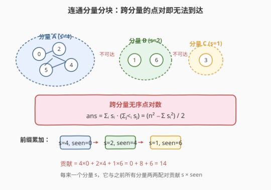
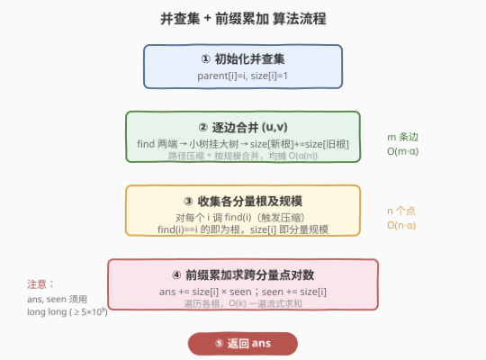
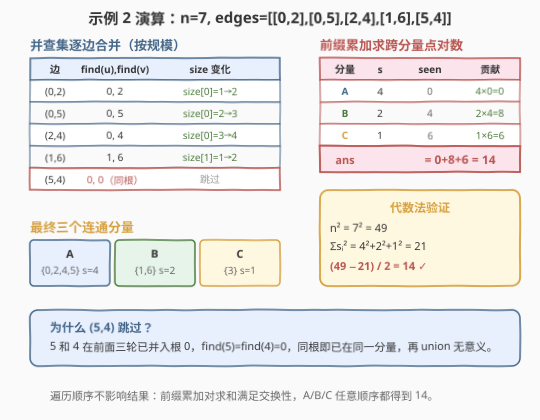

# 统计无向图中无法互相到达点对数

- **题目名称**：统计无向图中无法互相到达点对数
- **链接**：[2316. 统计无向图中无法互相到达点对数](https://leetcode.cn/problems/count-unreachable-pairs-of-nodes-in-an-undirected-graph/)
- **难度**：中等
- **标签**：图、并查集、深度优先搜索、广度优先搜索

## 1. 题目概述

给你一个整数 `n`，表示一张**无向图**中有 `n` 个节点，编号为 `0` 到 `n - 1`。同时给你一个二维整数数组 `edges`，其中 `edges[i] = [ai, bi]` 表示节点 `ai` 和 `bi` 之间有一条**无向**边。

请你返回 **无法互相到达** 的不同**点对数目**。

**示例 1**：

```text
输入：n = 3, edges = [[0,1],[0,2],[1,2]]
输出：0
解释：所有点都能互相到达，意味着没有点对无法互相到达，所以我们返回 0。
```

**示例 2**：

```text
输入：n = 7, edges = [[0,2],[0,5],[2,4],[1,6],[5,4]]
输出：14
解释：总共有 14 个点对互相无法到达：
[[0,1],[0,3],[0,6],[1,2],[1,3],[1,4],[1,5],[2,3],[2,6],[3,4],[3,5],[3,6],[4,6],[5,6]]
所以我们返回 14。
```

**约束条件**：

- $1 \le n \le 10^5$
- $0 \le \text{edges.length} \le 2 \times 10^5$
- `edges[i].length == 2`
- $0 \le a_i, b_i < n$
- $a_i \ne b_i$
- 不会有重复边

> 💡 **关键观察**：两点无法互相到达，当且仅当它们分属**不同的连通分量**。于是问题归约为两步：①求出所有连通分量及其大小；②把"跨分量的无序点对数"算出来。这正是**并查集 + 前缀累加**的标准舞台。

---

## 2. 解题思路

### 2.1 暴力思路：逐对 BFS/DFS 判连通

最直白的做法：对每一对节点 $(u, v)$ 跑一次 BFS/DFS 看能否从 $u$ 走到 $v$，统计不可达对数。

$$T = O\!\left(\binom{n}{2}\cdot(n+m)\right) = O(n^2(n+m))$$

$n\le10^5$ 时这至少是 $10^{15}$ 量级，完全不可行。问题在于**重复计算**——同一连通分量内的所有点对都被独立判连通，而其实只需一次遍历就能标记整片分量。

> 💡 **从逐对判连通到整体分块**：无向图的连通关系是**等价关系**（自反、对称、传递），天然把 $n$ 个点划分为若干**连通分量**。一旦把每个分量的规模 $s_1,s_2,\dots,s_k$ 求出来，跨分量的点对数就能用纯算术一次算清，无需再逐对搜索。

### 2.2 核心观察：连通分量 + 前缀累加



**第 1 步：求连通分量大小。** 用并查集把每条边的两端 `union`，合并完后每个集合的根就是该分量的代表。在 `union` 时维护 `size[根]`，合并后小树挂大树、`size[新根] += size[被挂根]`，所有边处理完即得各分量规模。

**第 2 步：算跨分量无序点对数。** 设各分量为 $s_1, s_2, \dots, s_k$（$\sum s_i = n$）。分属不同分量的无序点对数为：

$$\text{ans} = \sum_{i<j} s_i\,s_j$$

直接双重求和是 $O(k^2)$，分量多时（如全是孤立点，$k=n$）退化为 $O(n^2)$。用**前缀累加**降到 $O(k)$：维护已遍历分量大小之和 `seen`，每来一个新分量 $s_i$，它与之前所有分量两两配对贡献 $s_i \times \text{seen}$，再 `seen += s_i`。

$$\text{ans} = \sum_{i=1}^{k} s_i \cdot \left(\sum_{j<i} s_j\right), \qquad \text{seen}_i = \sum_{j<i} s_j$$

> 💡 **等价的代数恒等式**：由 $(\sum s_i)^2 = \sum s_i^2 + 2\sum_{i<j}s_is_j$ 可得 $\text{ans} = \dfrac{n^2 - \sum s_i^2}{2}$。前缀累加与之等价但无需存全部 $s_i$，一遍流式求和即可，且天然避免 $n^2$ 这个大中间值（虽 $n\le10^5$ 时 $n^2=10^{10}$ 不超 `int64`）。

### 2.3 算法流程图



1. **初始化**：`parent[i]=i`、`size[i]=1`，逐条边还没合并。
2. **逐边合并**：对每条 `(u, v)`，`find(u)`、`find(v)`；若不同根，小树挂大树，`size[新根] += size[旧根]`，更新 `parent`。带**路径压缩 + 按规模合并**，单次均摊 $O(\alpha(n))$。
3. **收集分量**：对每个 $i\in[0,n)$ 调 `find(i)`（触发压缩），`find(i)==i` 的即为各分量根，其 `size[i]` 即分量大小。
4. **前缀累加**：`ans=0`、`seen=0`；遍历各根，`ans += size[i]*seen`，`seen += size[i]`。
5. **返回** `ans`。

### 2.4 示例演算



以示例 2 `n=7, edges=[[0,2],[0,5],[2,4],[1,6],[5,4]]` 为例。

**并查集合并过程**（按规模合并，`size` 标在根处）：

| 处理边 | find(u) | find(v) | 合并动作 | size 变化 |
|--------|---------|---------|----------|-----------|
| (0,2) | 0 | 2 | parent[2]=0 | size[0]=1→2 |
| (0,5) | 0 | 5 | parent[5]=0 | size[0]=2→3 |
| (2,4) | 0 | 4 | parent[4]=0 | size[0]=3→4 |
| (1,6) | 1 | 6 | parent[6]=1 | size[1]=1→2 |
| (5,4) | 0 | 0 | 同根，跳过 | — |

最终三个连通分量：

| 分量 | 节点 | 规模 $s$ |
|------|------|----------|
| A | {0, 2, 4, 5} | 4 |
| B | {1, 6} | 2 |
| C | {3} | 1 |

**前缀累加**（遍历顺序不影响求和，此处按 A→B→C）：

| 分量 | $s$ | seen（之前分量和） | 贡献 $s\times\text{seen}$ |
|------|-----|--------------------|---------------------------|
| A | 4 | 0 | $4\times0=0$ |
| B | 2 | 4 | $2\times4=8$ |
| C | 1 | 6 | $1\times6=6$ |

$$\text{ans} = 0 + 8 + 6 = 14$$

验证（代数法）：$n^2=49$，$\sum s_i^2=16+4+1=21$，$\text{ans}=(49-21)/2=14$ ✓。

> 💡 **示例 1 为何返回 0**：三条边把 3 个点并成单一分量 $\{0,1,2\}$，$s=[3]$，前缀累加 $3\times0=0$，即所有点对都可达。

---

## 3. 参考代码

### C++

```cpp
class Solution {
public:
    long long countPairs(int n, vector<vector<int>>& edges) {
        vector<int> parent(n), rank_(n, 0), size_(n, 1);
        iota(parent.begin(), parent.end(), 0);

        function<int(int)> find = [&](int x) -> int {
            while (parent[x] != x) {
                parent[x] = parent[parent[x]];     // 路径压缩（隔代）
                x = parent[x];
            }
            return x;
        };

        auto unite = [&](int x, int y) {
            int rx = find(x), ry = find(y);
            if (rx == ry) return;
            if (size_[rx] < size_[ry]) swap(rx, ry);   // 小树挂大树
            parent[ry] = rx;
            size_[rx] += size_[ry];
        };

        for (auto& e : edges) unite(e[0], e[1]);

        long long ans = 0, seen = 0;
        for (int i = 0; i < n; i++) {
            if (find(i) == i) {                        // i 是分量根
                ans += (long long)size_[i] * seen;
                seen += size_[i];
            }
        }
        return ans;
    }
};
```

> 💡 用 `long long` 接住 `size_[i] * seen`：最坏全孤立点时 $k=n$，中间累加值可达 $\sum_{i}i\approx n^2/2\approx5\times10^9$，超 `int32` 上界 $2{,}147{,}483{,}647$，故必须 64 位。`seen` 同理声明为 `long long`。

### Python

```python
class Solution:
    def countPairs(self, n: int, edges: List[List[int]]) -> int:
        parent = list(range(n))
        size = [1] * n

        def find(x: int) -> int:
            while parent[x] != x:
                parent[x] = parent[parent[x]]     # 路径压缩（隔代）
                x = parent[x]
            return x

        for u, v in edges:
            ru, rv = find(u), find(v)
            if ru != rv:
                if size[ru] < size[rv]:
                    ru, rv = rv, ru                # 小树挂大树
                parent[rv] = ru
                size[ru] += size[rv]

        ans = seen = 0
        for i in range(n):
            if find(i) == i:                       # i 是分量根
                ans += size[i] * seen
                seen += size[i]
        return ans
```

> 💡 Python 大整数天然不溢出，但 `size[i] * seen` 在全孤立点时约 $5\times10^9$，仍落在 `int` 范围内（CPython `int` 任意精度），无需类型标注。

---

## 4. 复杂度分析

| 维度 | 复杂度 | 说明 |
|------|--------|------|
| **时间复杂度** | $O\!\left((n+m)\,\alpha(n)\right)$ | 逐边 `union` 共 $m$ 次、逐点 `find` 共 $n$ 次，每次均摊 $O(\alpha(n))\approx O(1)$；前缀累加 $O(n)$ |
| **空间复杂度** | $O(n)$ | `parent`、`size`、`rank` 三个 $O(n)$ 数组 |

> 💡 暴力 $O(n^2(n+m))$ 与本解 $O((n+m)\alpha(n))$ 差了一个 $n$ 因子，关键在于**把"逐对判连通"重构为"先分块再算术"**——连通的等价关系让分块只需线性扫描，跨块配对数用前缀累加一次求清。

---

## 5. 扩展：DFS / BFS 求连通分量

并查集并非唯一解。把 `edges` 建成邻接表后，对每个未访问节点做一次 DFS/BFS 即可遍历出整个分量并计其规模，再套同一套前缀累加：

```cpp
class Solution {
public:
    long long countPairs(int n, vector<vector<int>>& edges) {
        vector<vector<int>> g(n);
        for (auto& e : edges) { g[e[0]].push_back(e[1]); g[e[1]].push_back(e[0]); }
        vector<int> vis(n, 0);
        long long ans = 0, seen = 0;
        for (int i = 0; i < n; i++) {
            if (vis[i]) continue;
            int cnt = 0;
            queue<int> q; q.push(i); vis[i] = 1;
            while (!q.empty()) {
                int u = q.front(); q.pop(); cnt++;
                for (int v : g[u]) if (!vis[v]) { vis[v] = 1; q.push(v); }
            }
            ans += (long long)cnt * seen;
            seen += cnt;
        }
        return ans;
    }
};
```

> ⚠️ **递归 DFS 在 $n=10^5$、退化成链时栈深达 $10^5$，可能爆栈**；BFS 或迭代 DFS 更稳。并查集用迭代 `find`，无递归栈风险。

| 解法 | 思路 | 时间 | 空间 | 备注 |
|------|------|------|------|------|
| 并查集 | `union` 合并 + `size` 计数 | $O((n+m)\alpha(n))$ | $O(n)$ | 支持动态加边，模板可复用 |
| BFS/DFS | 邻接表遍历分量 | $O(n+m)$ | $O(n+m)$ | 静态图一次扫描，常数更小 |

---

## 6. 面试要点

1. **"无法互相到达的点对"如何转化？**

    - 两点无法互相到达 ⟺ 它们在**不同的连通分量**里。于是问题拆成：①求连通分量及规模；②算跨分量的无序点对数。第一步并查集/DFS，第二步前缀累加，两层都线性。

2. **跨分量点对数为什么用前缀累加而不是双重循环？**

    - 直接 $\sum_{i<j}s_is_j$ 是 $O(k^2)$，全是孤立点时 $k=n$ 退化到 $O(n^2)$。前缀累加维护 $\text{seen}=\sum_{j<i}s_j$，每步贡献 $s_i\cdot\text{seen}$，单遍 $O(k)\le O(n)$。等价的代数式 $\frac{n^2-\sum s_i^2}{2}$ 也行，但需先存全部 $s_i$。

3. **为什么必须用 `long long`？**

    - 最坏全孤立点（$m=0$），$k=n$，答案 $=\binom{n}{2}=\frac{n(n-1)}{2}$，$n=10^5$ 时约 $5\times10^9$，超 `int32` 上界 $\approx2.1\times10^9$。`seen` 在累加中也会达到同量级，故 `ans`、`seen` 都须 64 位。

4. **并查集为什么要维护 `size` 并按规模合并？**

    - 本题需要各分量规模来算点对数，`size` 直接挂在根上，合并时 `size[新根]+=size[旧根]` 即可维护。按规模合并（小挂大）与按秩合并效果相近，都把树高控制在 $O(\log n)$，搭配路径压缩后均摊 $O(\alpha(n))$。本题 `size` 本就要维护，顺手用作合并策略最自然。

5. **DFS 递归版会有什么坑？**

    - $n=10^5$ 且图退化成链时，递归深度达 $10^5$，C++ 默认栈可能溢出（segfault）。改 BFS 或迭代 DFS，或用并查集（`find` 也写迭代）规避。Python 默认递归上限 1000，更需改迭代。

> 💡 **一句话总结**：2316 是「连通分量 + 前缀累加」——并查集线性求出各分量规模 $s_i$，跨分量无序点对数 $=\sum_i s_i\cdot\sum_{j<i}s_j$，一遍流式求和 $O(n)$ 搞定，注意结果 64 位。

---

## 7. 同类练习题

- [547. 省份数量](../0501-0600/547_省份数量.md)：并查集模板题，求连通分量个数；本题在此之上多算"跨分量配对数"，承接 547 的 `union`+`find`
- [200. 岛屿数量](../0101-0200/200_岛屿数量.md)：DFS/BFS 求连通分量，可与本题的并查集解法对照，体会"分块计数"通用思路
- [684. 冗余连接](../0601-0700/684_冗余连接.md)：并查集判环，加边时两端已同根即为冗余边，同模板不同问法
- [1319. 连通网络的操作次数](https://leetcode.cn/problems/number-of-operations-to-make-network-connected/)：并查集统计连通分量数，求使全图连通的最少接线数，分量计数变体
- [924. 尽量减少恶意软件的传播](https://leetcode.cn/problems/minimize-malware-spread/)：并查集求分量规模后，按"移除该感染点能拯救的节点数"选最优，规模统计的进阶应用
