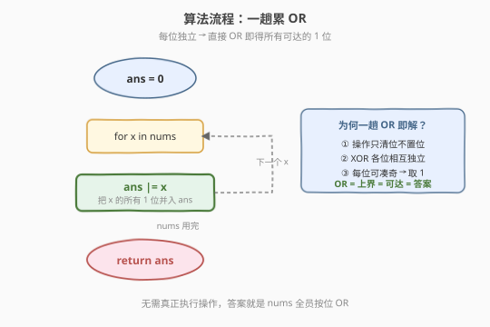

# 操作后的最大异或和

- **题目名称**：操作后的最大异或和
- **链接**：[2317. 操作后的最大异或和](https://leetcode.cn/problems/maximum-xor-after-operations/)
- **难度**：中等
- **标签**：位运算、数组、贪心

## 1. 题目概述

给定下标从 0 开始的整数数组 `nums`。一次操作中，可以选择**任意**非负整数 `x` 和一个下标 `i`，把 `nums[i]` 更新为：

$$\text{nums}[i] \leftarrow \text{nums}[i]\ \text{AND}\ (\text{nums}[i]\ \text{XOR}\ x)$$

可以执行**任意次**操作（含 0 次），返回 `nums` 中所有元素的**最大**逐位异或和。

**示例 1**：

```text
输入：nums = [3,2,4,6]
输出：7
解释：选 x = 4, i = 3，nums[3] = 6 AND (6 XOR 4) = 6 AND 2 = 2。
     现在 nums = [3,2,4,2]，逐位异或 3 XOR 2 XOR 4 XOR 2 = 7。
```

**示例 2**：

```text
输入：nums = [1,2,3,9,2]
输出：11
解释：执行 0 次操作。1 XOR 2 XOR 3 XOR 9 XOR 2 = 11。
```

**约束条件**：

- $1 \le \text{nums.length} \le 10^5$
- $0 \le \text{nums}[i] \le 10^8$

> 💡 题眼在于「操作能做什么」。把操作式变形后会看出：它能且只能把 `nums[i]` 变成**它自身二进制 1 位的一个子集**（submask）。再结合「异或逐位独立」即可得到极简答案——**全员按位 OR**。

---

## 2. 解题思路

### 2.1 暴力思路：搜索每个数的取值

最朴素的想法是：操作可以执行任意次，每个 `nums[i]` 可能变成很多值，枚举每个数最终取什么，再求异或和取最大。但单个数可取的值就指数级（$2^{\text{popcount}}$），$n$ 个数组合起来更不可行。

> 💡 转机在于：操作式有固定结构 `a AND (a XOR x)`，先把「能变成什么」这一步分析清楚，再叠加「异或按位独立」的性质，问题会瞬间塌缩。

### 2.2 核心观察：操作只能「清位」，结果 = 全员按位 OR

![核心观察：操作只能「清位」，v_i ⊆ nums[i] 即 submask](../images/2317_concept.svg)

**第一步——化简操作式。** 注意到 `x` 是任意非负整数，因此 $y = \text{nums}[i] \oplus x$ 也可以是**任意**非负整数（取 $x = \text{nums}[i] \oplus y$ 即可）。于是操作等价于：

$$\text{nums}[i] \leftarrow \text{nums}[i]\ \text{AND}\ y,\quad y \in \mathbb{N}$$

逐位看 `a AND y`：若 `a` 的某位是 0，结果该位必为 0（与 $y$ 无关）；若 `a` 的某位是 1，结果该位由 $y$ 的对应位决定，可 0 可 1。所以操作后 `nums[i]` 能变成**任意**「1 位是 `nums[i]` 的 1 位子集」的数，即 `nums[i]` 的任一 **submask**（子掩码）：

$$v_i \text{ 可达} \iff v_i\ \&\ \text{nums}[i] = v_i \iff v_i \text{ 的 1 位} \subseteq \text{nums}[i] \text{ 的 1 位}$$

> ⚠️ 关键不变量：操作**只会清除 1 位，永远不会新增 1 位**。`nums[i]` 原本某位是 0，无论怎么操作都还是 0。

**第二步——异或逐位独立。** 异或和的结果第 $b$ 位 =（所有 $v_i$ 第 $b$ 位为 1 的个数）模 2，即奇偶性。而每个 $v_i$ 的各位**互不耦合**（submask 的各位可独立取 0/1，只要该位在 `nums[i]` 中是 1）。所以对每一位 $b$ **独立**地最大化：

- 设 $S_b = \{i : \text{nums}[i]\text{ 第 }b\text{ 位}=1\}$。只有这些下标的 $v_i$ 第 $b$ 位**可能**为 1；其余 $v_i$ 第 $b$ 位必为 0。
- 要让异或结果第 $b$ 位 = 1，只需在 $S_b$ 中**恰选一个** $v_i$ 第 $b$ 位为 1（其余为 0）→ 奇数个 → 该位为 1。
- 若 $S_b = \varnothing$（没有任何 `nums[i]` 该位为 1），该位只能为 0。

> 💡 由于各位的变量互不耦合，逐位「凑奇」可同时成立：对每个出现在 OR 中的位 $b$，挑一个代表 $i_b \in S_b$，把 $v_{i_b}$ 的第 $b$ 位置 1，其余位全 0（每个 $v_i$ 的各位独立可设）。如此每个被点亮的位都恰有 1 个 $v_i$ 贡献，奇偶性必为 1。

**结论**：异或和第 $b$ 位能为 1 $\iff$ $S_b \ne \varnothing$ $\iff$ 全员按位 OR 的第 $b$ 位为 1。故：

$$\boxed{\text{最大异或和} = \text{nums}[0]\ |\ \text{nums}[1]\ |\ \cdots\ |\ \text{nums}[n-1]}$$

> 💡 双向夹逼：操作只清位不置位 → OR 是**上界**；上面构造又使 OR 的每位都能凑奇 → OR **可达**。上界 = 可达 = 答案，一步到位。与 [2275. 按位与结果大于零的最长组合](../2201-2300/2275_按位与结果大于零的最长组合.md)「位独立分解」同源，只是这里从「求最长组合」变成「求最大异或」。

### 2.3 算法流程图



算法极其简洁——一趟扫描累 OR：

1. `ans = 0`。
2. 遍历 `nums`，对每个 `x` 执行 `ans |= x`。
3. 返回 `ans`。

无需真正模拟任何一次操作，OR 直接给出所有「可达 1 位」的并集。

### 2.4 示例演算

![示例演算：nums = [3,2,4,6] → OR = 7](../images/2317_example_walkthrough.svg)

以示例 1 `nums = [3,2,4,6]`（3 位足矣，$\max = 6 < 8$）为例：

| 下标 | 数值 | bit2 | bit1 | bit0 |
|------|------|------|------|------|
| 0 | 3 | 0 | **1** | **1** |
| 1 | 2 | 0 | **1** | 0 |
| 2 | 4 | **1** | 0 | 0 |
| 3 | 6 | **1** | **1** | 0 |
| **OR** | **7** | **1** | **1** | **1** |

- bit2：`{4,6}` 贡献 1 → 选其一（如下标 2）凑奇；
- bit1：`{3,2,6}` 贡献 1 → 选其一凑奇；
- bit0：`{3}` 贡献 1 → 选下标 0 凑奇。

**构造验证**：取 $v = [3,2,4,2]$（每个 $v_i \subseteq \text{nums}[i]$，其中 $6 \to 2$ 即 $6\ \& (6 \oplus 4) = 6\ \& 2 = 2$，清掉了 bit2），则

$$3 \oplus 2 \oplus 4 \oplus 2 = 7 = \text{OR} \quad \checkmark$$

> 💡 **示例 2 验证**：`nums = [1,2,3,9,2]`，OR $= 1|2|3|9|2 = 0001|0010|0011|1001|0010 = 1011 = 11$，与题面「0 次操作即得 11」吻合。

---

## 3. 参考代码

### C++：一趟累 OR（$O(n)$ / $O(1)$）

```cpp
class Solution {
public:
    int maximumXor(vector<int>& nums) {
        int ans = 0;
        for (int x : nums) ans |= x;
        return ans;
    }
};
```

### Python：一行 reduce / 累 OR

```python
class Solution:
    def maximumXor(self, nums: List[int]) -> int:
        ans = 0
        for x in nums:
            ans |= x
        return ans
```

等价的函数式写法（`functools.reduce` + `operator.or_`）：

```python
from functools import reduce
import operator

class Solution:
    def maximumXor(self, nums: List[int]) -> int:
        return reduce(operator.or_, nums)
```

> 💡 三种写法等价。面试中先讲「为何答案是 OR」的推导（操作只清位 + 异或位独立），再落地成一行 `|=`，体现从原理到代码的完整链路。

---

## 4. 复杂度分析

| 维度 | 复杂度 | 说明 |
|------|--------|------|
| **时间复杂度** | $O(n)$ | 一趟扫描，每个数做一次按位 OR（$O(1)$）；$n \le 10^5$ |
| **空间复杂度** | $O(1)$ | 仅 `ans` 一个累加变量 |

> 💡 比暴力的指数级（枚举每个数的 submask）降到 $O(n)$ 线性，关键在于两步简化：① 把操作等价为「取 submask」（只清位）；② 利用「异或逐位独立」把多变量最优化塌缩成「逐位凑奇 → OR」。

---

## 5. 扩展：严格正确性证明

为完整起见，给出「答案 = OR」的双向证明。

设 $\text{OR} = \bigvee_i \text{nums}[i]$（全员按位或）。

**（上界）$\le$ OR**：由 2.2，操作只清位不置位，故任意可达的 $v_i$ 满足 $v_i\ \&\ \text{nums}[i] = v_i$，即 $v_i$ 的 1 位 $\subseteq \text{nums}[i]$ 的 1 位 $\subseteq \text{OR}$ 的 1 位。异或不会凭空产生某位 1（仅当存在贡献），故异或和的每个 1 位必来自某个 $v_i$ 的 1 位 $\subseteq \text{OR}$，即异或和 $\le \text{OR}$。

**（可达）$\ge$ OR**：对 OR 的每个 1 位 $b$，$S_b = \{i : \text{nums}[i]\text{ 第 }b\text{ 位}=1\} \ne \varnothing$，任取代表 $i_b \in S_b$。令 $v_i = \sum_{b:\, i_b = i} 2^b$（把所有以 $i$ 为代表的位并入 $v_i$）。则 $v_i$ 的 1 位都是 `nums[i]` 的 1 位（因 $i \in S_b$ 当且仅当 `nums[i]` 第 $b$ 位为 1），故 $v_i \subseteq \text{nums}[i]$，是合法 submask，可由操作达到。此时对每个 $b$，恰有一个 $v_{i_b}$ 第 $b$ 位为 1，其余为 0 → 奇偶性为 1 → 异或和第 $b$ 位 = 1。故异或和 = OR。

上界 = 可达，证毕。$\blacksquare$

> ⚠️ 注意「各位独立」是证明的核心：submask 的各位**可独立取值**，因此对位 $b_1$ 凑奇与对位 $b_2$ 凑奇不冲突——这正是为什么能**同时**点亮 OR 的所有 1 位，而非只能在某一位上取到 1。

---

## 6. 面试要点

1. **为什么操作只能「清位」而不能「置位」？**

   - 操作式 `a AND (a XOR x)` 中，`a XOR x` 可取任意值 $y$，故等价于 `a AND y`。按位与的规则是「见 0 即 0」：`a` 该位为 0 时结果必为 0；`a` 该位为 1 时结果才由 $y$ 决定（可 0 可 1）。所以结果只会保留 `a` 已有的 1 位的一部分，永远不会新增 `a` 没有的 1 位，即只清位、不置位。

2. **为什么异或和能取到 OR 而非更小？**

   - 异或逐位独立：结果第 $b$ 位只看有多少 $v_i$ 第 $b$ 位为 1 的奇偶性。对 OR 中为 1 的每个位 $b$，至少有一个 `nums[i]` 该位为 1，挑其中任一个 $v_i$ 第 $b$ 位设为 1（其余该位设 0）→ 恰一个贡献 → 奇 → 结果该位为 1。由于各位的取值互不耦合（submask 各位独立），这些「凑奇」可同时成立，故 OR 的每位都能被点亮。

3. **「位独立」在本题为何成立，在哪些问题不成立？**

   - 本题 $v_i$ 是 `nums[i]` 的 submask，其各位可独立取 0/1（只要该位在 `nums[i]` 中是 1），所以对位 $b$ 的凑奇不牵连其他位。若 $v_i$ 的取值对各 位有耦合约束（例如要求 $v_i$ 本身满足某种整体条件），则位独立失效，需整体建模（如线性基、状压 DP）。本题正是「位独立」让指数问题塌缩成 $O(n)$。

4. **数据范围 $10^8$ 对位运算有何影响？**

   - $10^8 < 2^{27}$，故有效位不超过 27 位。但本题根本不需要逐位循环——一趟按位 OR 自动覆盖所有位，$O(n)$ 与位数无关。若改用「逐位枚举 + 计数」的写法（参考 [2275](../2201-2300/2275_按位与结果大于零的最长组合.md)），则需遍历 $\lceil \log_2(\max+1) \rceil \le 27$ 位。

5. **能否给出把 OR 各位同时凑奇的具体构造？**

   - 能。对 OR 的每个 1 位 $b$，任选一个该位为 1 的 `nums[i]` 作代表 $i_b$，令 $v_i$ 为「以 $i$ 为代表的所有位」之和。则每个 $v_i \subseteq \text{nums}[i]$（合法 submask，可由操作达到），且每个 OR 的 1 位恰有一个 $v_i$ 贡献 → 异或和 = OR。示例 1 中 $v = [3,2,4,2]$ 即一例。

> 💡 **一句话总结**：操作 `a AND (a XOR x)` 等价于「取 `a` 的 submask」（只清位不置位），叠加异或逐位独立 → 每个 OR 中的 1 位都能凑奇点亮 → 最大异或和 = 全员按位 OR，$O(n)$ 一趟搞定。

---

## 7. 同类练习题

- [2275. 按位与结果大于零的最长组合](https://leetcode.cn/problems/largest-combination-with-bitwise-greater-than-zero/)（[题解](../2201-2300/2275_按位与结果大于零的最长组合.md)）：同为「位独立分解」的位运算题，把组合问题拆成逐位计数，对照本题「逐位凑奇」
- [421. 数组中两个数的最大异或和](https://leetcode.cn/problems/maximum-xor-of-two-numbers-in-an-array/)：异或最值家族的招牌题，用 01-Trie 贪心逐位定答案，对照本题「OR 即解」的极简特例
- [1707. 与数组中元素的最大异或和](https://leetcode.cn/problems/maximum-xor-with-an-element-from-array/)：在线 01-Trie 求最大异或，是 421 的进阶，体会「逐位贪心」与「位独立」的边界
- [231. 2 的幂](https://leetcode.cn/problems/power-of-two/)（[题解](../0201-0300/231_2的幂.md)）：submask 视角的基础题——2 的幂恰是「只有一个 1 位」的数，`n & (n-1) == 0` 判定即「没有更小的 submask」
- [371. 两整数之和](https://leetcode.cn/problems/sum-of-two-integers/)（[题解](../0301-0400/371_两整数之和.md)）：位运算家族同源，异或做「不进位加法」、与做「进位」，与本题「与做清位、异或做奇偶」形成对照
