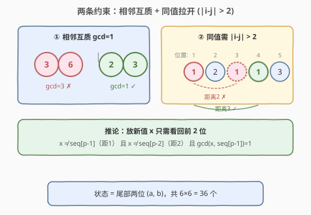
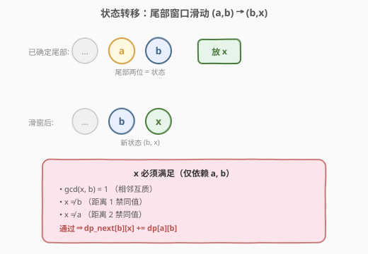
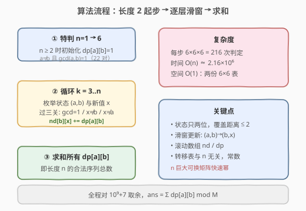
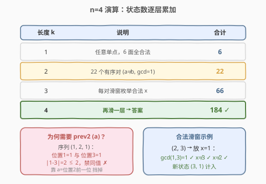

# 不同骰子序列的数目

- **题目名称**：不同骰子序列的数目
- **链接**：[2318. 不同骰子序列的数目](https://leetcode.cn/problems/number-of-distinct-roll-sequences/)
- **难度**：困难
- **标签**：动态规划、状态机、数学

## 1. 题目概述

给你一个整数 `n`，掷一个 6 面骰子 `n` 次，求满足以下两条约束的**不同**序列总数（对 $10^9+7$ 取余）：

1. **相邻互质**：序列中任意**相邻**两个数字的最大公约数为 `1`，即 $\gcd(\text{seq}[i], \text{seq}[i+1]) = 1$。
2. **同值拉开**：相等的值之间至少隔 `2` 个其他值。正式地，若第 $i$ 次与第 $j$ 次的值相等，则 $|i - j| > 2$。等价地——**任意一个值不得与它前 2 个位置内的值相同**（距离 1、2 都禁止，距离 3 才允许）。

**示例 1**：

```text
输入：n = 4
输出：184
解释：可行序列如 (1, 2, 3, 4)、(6, 1, 2, 3)、(1, 2, 3, 1) 等。
  不可行：(1, 2, 1, 3) —— 第 1、3 位值相等且 |1-3|=2，违反同值拉开；
          (1, 2, 3, 6) —— 3 与 6 的 gcd=3，违反相邻互质。
```

**示例 2**：

```text
输入：n = 2
输出：22
解释：可行序列如 (1, 2)、(2, 1)、(3, 2)；不可行如 (3, 6)、(2, 4)（gcd≠1）。
```

**约束条件**：

- $1 \le n \le 10^4$

> ⚠️ **关键信号**：骰子面数恒为 6，序列的合法性**只依赖最近几个位置的取值**——这是典型的**有限状态机 DP**。同值拉开要求看回前 2 位，故状态需记录「倒数第二、倒数第一」两个点数，状态空间仅 $6\times 6 = 36$，再乘以步数 $n$，规模极小。

---

## 2. 解题思路

### 2.1 暴力思路

每个位置独立取 1–6，共 $6^n$ 个候选序列，逐个验证两条约束。$n=10^4$ 时 $6^n$ 是天文数字，且大部分序列在很早就违反约束，毫无剪枝可言。需要把「约束可由尾部决定」这一结构利用起来——一旦固定了最后两位，新增一位时能否取某值只与这两位有关。

### 2.2 核心观察：以「最后两位」为状态的有限状态机 DP

放第 $p$ 个骰子（点数 $x$）时，它与前面两位的关系决定了合法性：



- $\gcd(x, \text{seq}[p-1]) = 1$（相邻互质）；
- $x \ne \text{seq}[p-1]$（距离 1，禁同值）；
- $x \ne \text{seq}[p-2]$（距离 2，禁同值）。

这三条**只依赖倒数第二位 $a=\text{seq}[p-2]$ 与倒数第一位 $b=\text{seq}[p-1]$**，于是把「合法序列的尾部 $(a,b)$」当状态即可：

$$dp[a][b] = \text{以 } \dots, a, b \text{ 结尾的合法序列数}$$

转移时枚举新点数 $x \in [1,6]$，满足三条约束后滑动窗口——新尾部变成 $(b, x)$：

$$dp_{\text{next}}[b][x] \mathrel{+}= dp[a][b]$$



**初始**：长度 1 的序列，任意点数都合法，6 个状态各 1。但状态定义需要「两位」，故直接从长度 2 起步——枚举所有有序对 $(a,b)$ 满足 $a\ne b$ 且 $\gcd(a,b)=1$，各赋 $1$（共 22 个，即 $n=2$ 的答案）。

> 💡 **为什么状态只需要 2 位而非 3 位？** 约束 1 只看相邻 1 位；约束 2 的禁令边界是「距离 $\le 2$」，即新值只需避开前 2 位。两位尾部已经足以判定一切，状态空间 $O(6^2)=O(1)$。

### 2.3 算法流程图



### 2.4 示例演算

以 $n=4$ 为例，逐层累加状态数：



- $n=1$：6 个单点序列；
- $n=2$：22 个合法有序对（每对 $a\ne b$ 且 $\gcd=1$）；
- $n=3$：从每个 $(a,b)$ 出发，枚举合法 $x$ 滑窗成 $(b,x)$，合计 66；
- $n=4$：再滑一层，合计 **184**，与示例吻合。

注意如 $(1,2,1)$ 在 $n=3$ 时合法（1 与 1 间隔距离 2，但 $|1-3|=2\not>2$ 故禁止——所以 $(1,2,1)$ 其实**不**合法）。演算中此类分支被「$x\ne a$」一步挡掉，正体现了 prev2 状态的必要性。

---

## 3. 参考代码

### C++

```cpp
class Solution {
public:
    int distinctSequences(int n) {
        const int MOD = 1e9 + 7;
        if (n == 1) return 6;

        vector<vector<long long>> dp(7, vector<long long>(7, 0));
        for (int a = 1; a <= 6; ++a)
            for (int b = 1; b <= 6; ++b)
                if (a != b && gcd(a, b) == 1) dp[a][b] = 1;  // 长度 2 初始状态

        for (int k = 3; k <= n; ++k) {
            vector<vector<long long>> nd(7, vector<long long>(7, 0));
            for (int a = 1; a <= 6; ++a)
                for (int b = 1; b <= 6; ++b) {
                    if (!dp[a][b]) continue;
                    for (int x = 1; x <= 6; ++x) {
                        if (x == b || x == a) continue;        // 同值拉开：距离 1、2
                        if (gcd(x, b) != 1) continue;          // 相邻互质
                        nd[b][x] = (nd[b][x] + dp[a][b]) % MOD; // 滑窗 -> (b, x)
                    }
                }
            dp = move(nd);
        }

        long long ans = 0;
        for (auto& r : dp)
            for (long long v : r) ans = (ans + v) % MOD;
        return (int)ans;
    }
};
```

### Python

```python
class Solution:
    def distinctSequences(self, n: int) -> int:
        from math import gcd
        MOD = 10**9 + 7
        if n == 1:
            return 6

        # dp[(a, b)]: 以 ...a, b 结尾的合法序列数（a=倒数第二, b=最后一位）
        dp = {}
        for a in range(1, 7):
            for b in range(1, 7):
                if a != b and gcd(a, b) == 1:
                    dp[(a, b)] = 1                       # 长度 2 初始状态

        for k in range(3, n + 1):
            ndp = {}
            for (a, b), cnt in dp.items():
                for x in range(1, 7):
                    if x == b or x == a:                 # 同值拉开：距离 1、2
                        continue
                    if gcd(x, b) != 1:                  # 相邻互质
                        continue
                    key = (b, x)                        # 滑窗 -> (b, x)
                    ndp[key] = (ndp.get(key, 0) + cnt) % MOD
            dp = ndp

        return sum(dp.values()) % MOD
```

> 💡 **细节**：`x == b` 这条在 $b\ne 1$ 时其实被 `gcd(x,b)==1` 隐含（$\gcd(b,b)=b\ne 1$），唯独 $b=1$ 时 $\gcd(1,1)=1$ 会漏放，故显式判 `x == b` 更稳妥、也更贴合「同值拉开」语义。`dp` 用 `dict` 仅存非零状态，常数极小。

---

## 4. 复杂度分析

| 维度 | 复杂度 | 说明 |
|------|--------|------|
| 时间复杂度 | $O(n)$ | 每步 $6\times6\times6=216$ 次转移判定，$n=10^4$ 时约 $2.16\times 10^6$ 次常数操作 |
| 空间复杂度 | $O(1)$ | 仅两份 $6\times6$ 状态表，滚动后与 $n$ 无关 |

> ⚠️ 转移表是**固定常数**（与 $n$ 无关），故时间严格 $O(n)$；若 $n$ 巨大（如 $10^{18}$）可把 36 阶转移做**矩阵快速幂**降到 $O(36^3 \log n)$，本题 $n\le 10^4$ 无此必要。

---

## 5. 扩展：矩阵快速幂视角

把所有合法状态 $(a,b)$ 编号为 $1\dots 36$，构造转移矩阵 $T$：若 $(a,b)\to(b,x)$ 合法则 $T_{(a,b),(b,x)}=1$，否则 $0$。设初值向量 $v$（长度 2 的 22 个状态各为 1），则长度 $n$ 的答案为 $v\cdot T^{\,n-2}$ 各分量之和。

- 矩阵 $36\times36$，$T$ 高度稀疏（每行至多 6 个 1）；
- $n$ 较小时直接递推更简单；$n$ 极大时用快速幂 $O(36^3\log n)\approx 4.7\times 10^4\cdot \log n$，远优于线性递推的不可行边界。

这把「有限状态机计数」与「矩阵幂」统一在同一框架下——骰子面数换成更大的 $m$（如 26 个字母、$m$ 种颜色）时，状态数 $m^2$ 仍可控。

---

## 6. 面试要点

1. **为什么状态要保留两位而不是一位？**
   - 约束 2 的禁令是「距离 $\le 2$ 禁同值」，新值需同时避开前 1 位与前 2 位；只记一位会漏掉「隔 2 位重复」的非法情形（如 $(1,2,1)$）。两位尾部恰好覆盖，状态空间 $6^2=36$ 仍很小。

2. **初始状态为什么从长度 2 起步、长度 1 单独返回 6？**
   - 状态定义为「尾部两位」，需要至少两个元素才成形。长度 1 没有相邻/同值可言，6 面全合法直接返回 6；长度 2 枚举所有 $a\ne b$ 且 $\gcd(a,b)=1$ 的有序对，共 22 个，恰好是 $n=2$ 的答案，作为 DP 初值。

3. **转移为什么是「滑窗」而非「拼接」？**
   - 放入新值 $x$ 后，旧的最后一位 $b$ 晋升为倒数第二位，新值 $x$ 成为最后一位，故新状态键为 $(b, x)$。这是滑动窗口式更新，不是把 $x$ 接到 $b$ 后面再做别的——状态维度始终是 2。

4. **同值拉开「距离 $>2$」如何翻译成代码？**
   - $|i-j|>2$ 等价于「禁距离 1、禁距离 2」，即新值 $x$ 不能等于 $\text{seq}[p-1]$（距离 1）也不能等于 $\text{seq}[p-2]$（距离 2）。落到状态 $(a,b)$ 上就是 $x\ne b$ 且 $x\ne a$，两行判定搞定。

5. **能否把 `gcd` 判定预处理掉以提速？**
   - 可以。1–6 之间 $\gcd=1$ 的合法相邻对是常数集合，可预生成「每个 $b$ 可接哪些 $x$」的邻接表，转移时直接遍历候选表再过 `x != a` 即可，省掉运行时 `gcd` 调用，常数更小。

---

## 7. 同类练习题

- [70. 爬楼梯](https://leetcode.cn/problems/climbing-stairs/)（[站内题解](../0001-0100/70_爬楼梯.md)）：一维状态机 DP 入门，状态只看前 1 位；本题是其「多约束 + 多状态」升级版
- [2646. 减少任务数](https://leetcode.cn/problems/reduce-the-score-of-the-game/)：序列上有限状态机 DP 计数，转移表固定、滑窗更新的同类思路
- [1419. 唱片序列](https://leetcode.cn/problems/minimum-number-of-frogs-croaking/)：序列上多状态约束（同种字符需满足间隔/计数），状态机 DP 推进，与本题「同值需拉开」同源
- [552. 学生出勤记录 II](https://leetcode.cn/problems/student-attendance-record-ii/)：含「连续迟到不超 2 次」的有限状态计数 DP，状态机 + 滚动，可升级为矩阵快速幂
- [935. 骑士拨号器](https://leetcode.cn/problems/knight-dialer/)：有限状态机计数母题，状态 = 当前数字，转移表固定，$n$ 步累加，直接对应本题框架
