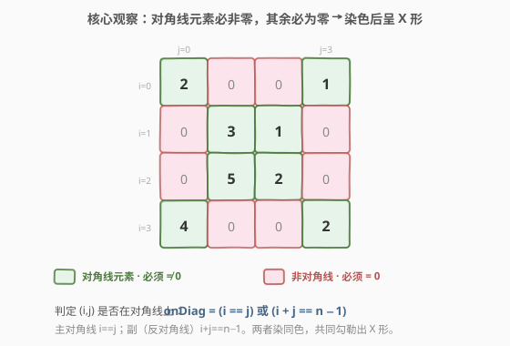
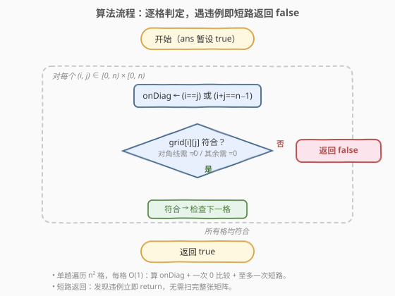
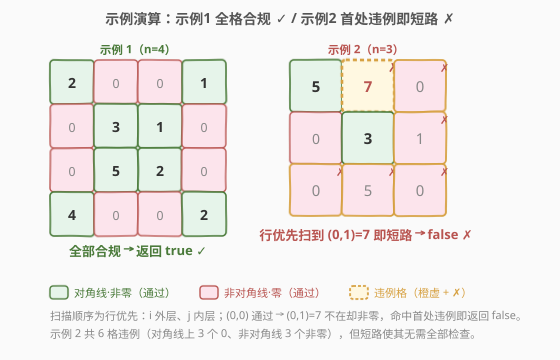

# 判断矩阵是否是一个 X 矩阵

- **题目名称**：判断矩阵是否是一个 X 矩阵
- **链接**：[2319. 判断矩阵是否是一个 X 矩阵](https://leetcode.cn/problems/check-if-matrix-is-x-matrix/)
- **难度**：简单
- **标签**：数组、矩阵、模拟、一次遍历

## 1. 题目概述

给定大小为 `n x n` 的二维整数数组 `grid` 表示一个正方形矩阵。若它满足下述**全部**条件，则称之为 **X 矩阵**：

1. 矩阵**对角线**上的所有元素都**不是 0**；
2. 矩阵中**所有其他元素**都是 **0**。

判断 `grid` 是否为 X 矩阵，是返回 `true`，否则 `false`。

> 💡 **题眼**：这里的「对角线」是**两条**——主对角线（左上到右下）与副对角线（右上到左下，反对角线）。当 $n$ 为奇数时，正中心那一格同时属于两条对角线，染色时会落在同一类里，无需特殊处理。

**示例 1**：

```text
输入：grid = [[2,0,0,1],[0,3,1,0],[0,5,2,0],[4,0,0,2]]
输出：true
解释：两条对角线上的元素（2,3,2,2 与 1,1,5,4）均非 0，其余全为 0。
```

**示例 2**：

```text
输入：grid = [[5,7,0],[0,3,1],[0,5,0]]
输出：false
解释：(0,1)=7 不在对角线上却非 0；(2,2)=0 在主对角线上却为 0……存在违例。
```

**约束条件**：

- `n == grid.length == grid[i].length`
- $3 \le n \le 100$
- $0 \le \text{grid}[i][j] \le 10^5$

---

## 2. 解题思路

### 2.1 暴力思路：分别收集两条对角线再比对

最直觉的写法是先把两条对角线上的位置「圈」出来，再逐格核对：对角线位置上查 $\ne 0$，其余位置查 $= 0$。但若真去**预存**两条对角线集合，会多花 $O(n)$ 空间，且把「$(i,j)$ 是否在对角线上」这件 $O(1)$ 可判定的事复杂化了。

> 💡 转机在于：一个格子是否落在任一对角线上，**只需两个等式即可就地判定**，根本不必先收集。于是整个问题塌缩成「单趟遍历 + 一次 0 比较」。

### 2.2 核心观察：就地判定对角线，逐格核对零/非零



对正方形矩阵下标从 $0$ 计起：

- **主对角线**：行下标等于列下标，即 $i = j$；
- **副对角线**（反对角线）：行、列下标之和为 $n-1$，即 $i + j = n - 1$。

任一格 $(i, j)$ 是否「在对角线上」可一次布尔运算得出：

$$\text{onDiag} = (i = j)\ \lor\ (i + j = n - 1)$$

于是每格只需按角色核对**一个条件**：

| 角色 | 条件 |
|------|------|
| 对角线上（`onDiag == true`） | $\text{grid}[i][j] \ne 0$ |
| 非对角线（`onDiag == false`） | $\text{grid}[i][j] = 0$ |

> ⚠️ **奇数阶中心格**：$n$ 为奇时，中心 $(\lfloor n/2\rfloor, \lfloor n/2\rfloor)$ 同时满足 $i=j$ 与 $i+j=n-1$，它只算「对角线上」一次（布尔或），要求非零——这与题意「对角线上所有元素都非 0」一致，无需去重。

> 💡 **短路思想**：一旦发现某格违例即可立即 `return false`，不必扫完整张矩阵；最坏情况（合法矩阵）才遍历全部 $n^2$ 格。

### 2.3 算法流程图



算法极简——双层循环遍历每个 $(i, j)$：

1. 计算 `onDiag = (i == j) || (i + j == n - 1)`；
2. 若 `onDiag` 且 `grid[i][j] == 0` → 返回 `false`（对角线上不该为零）；
3. 若非 `onDiag` 且 `grid[i][j] != 0` → 返回 `false`（非对角线不该非零）；
4. 全部通过 → 返回 `true`。

无需预处理、无需额外集合，原地一次扫描即可。

### 2.4 示例演算



**示例 1**（`n=4`，合法）逐格核对（行优先扫描）：

| 格子 $(i,j)$ | 角色 | 值 | 期望 | 结果 |
|------|------|----|----|------|
| $(0,0)$ | 主对角 | 2 | $\ne 0$ | ✓ |
| $(0,1)$ | 非对角 | 0 | $= 0$ | ✓ |
| $(0,2)$ | 非对角 | 0 | $= 0$ | ✓ |
| $(0,3)$ | 副对角 | 1 | $\ne 0$ | ✓ |
| … | … | … | … | ✓ |
| $(3,3)$ | 主对角 | 2 | $\ne 0$ | ✓ |

全部 16 格合规 → 返回 `true`。

**示例 2**（`n=3`，非法）行优先扫描，第 2 格即短路：

| 格子 $(i,j)$ | 角色 | 值 | 期望 | 结果 |
|------|------|----|----|------|
| $(0,0)$ | 主对角 | 5 | $\ne 0$ | ✓ |
| $(0,1)$ | 非对角 | **7** | $= 0$ | ✗ 命中违例 |

行优先扫描到 $(0,1)$ 时，发现「非对角线却非零」→ 立即 `return false`，**不再检查** $(0,2)$ 及之后。

> 💡 示例 2 实际共有 **6 格违例**：对角线上 3 个 0（$(0,2),(2,0),(2,2)$）与非对角线 3 个非零（$(0,1),(1,2),(2,1)$）。但短路使算法只验到第 2 格就停——这就是「遇违例即返回」的价值：非法输入常能极早终止。

---

## 3. 参考代码

### C++：双层循环 + 就地判定（$O(n^2)$ / $O(1)$）

```cpp
class Solution {
public:
    bool checkXMatrix(vector<vector<int>>& grid) {
        int n = grid.size();
        for (int i = 0; i < n; ++i) {
            for (int j = 0; j < n; ++j) {
                bool onDiag = (i == j) || (i + j == n - 1);
                if (onDiag) {
                    if (grid[i][j] == 0) return false;
                } else {
                    if (grid[i][j] != 0) return false;
                }
            }
        }
        return true;
    }
};
```

### Python：同逻辑

```python
class Solution:
    def checkXMatrix(self, grid: List[List[int]]) -> bool:
        n = len(grid)
        for i in range(n):
            for j in range(n):
                on_diag = (i == j) or (i + j == n - 1)
                if on_diag:
                    if grid[i][j] == 0:
                        return False
                elif grid[i][j] != 0:
                    return False
        return True
```

> 💡 也可把两分支合成一行异或判定：`if (onDiag != (grid[i][j] != 0)) return false;`——即「在对角线上」与「值非零」两布尔必须同真同假。语义紧凑但可读性略降，面试建议先写分支版讲清逻辑，再提一句可合并。

---

## 4. 复杂度分析

| 维度 | 复杂度 | 说明 |
|------|--------|------|
| **时间复杂度** | $O(n^2)$ | 最坏遍历全部 $n^2$ 格，每格 $O(1)$（两个等式 + 一次 0 比较）；合法矩阵必扫满，非法矩阵常因短路提前结束 |
| **空间复杂度** | $O(1)$ | 仅用 `i`、`j`、`onDiag` 与 `n` 几个标量，原地判定 |

> 💡 $n \le 100$ ⟹ $n^2 \le 10^4$，规模极小，任何 $O(n^2)$ 写法都能轻松 AC。本题考点不在性能，而在**正确刻画「对角线 = 主 ∪ 副」这一几何条件**，并处理好奇数阶中心格的重叠。

---

## 5. 扩展：为何不预存对角线集合？

一个自然的「工程化」念头是先构造 `diagSet = {(i,i),(i,n-1-i)}`，再逐格 `if (i,j) in diagSet` 核对。它正确，但有三处劣势：

1. **空间**：多花 $O(n)$ 存集合（去重后仍是 $2n - (n\bmod 2)$ 个元素），而就地判定 $O(1)$；
2. **常数**：集合查询（哈希/树）远慢于两个整数等式比较；
3. **可读性**：把「$i=j$ 或 $i+j=n-1$」这层几何不变量藏进了数据结构，反而隔了一层。

> 💡 通用经验：**能用 $O(1)$ 公式就地判定的几何关系，不要落成数据结构**。集合/哈希应留给「无法公式判定、需查询历史」的场景（如 128 最长连续序列的边界探测、1 两数之和的配对查找）。

---

## 6. 面试要点

1. **「对角线」具体指哪几条？需要去重吗？**

   > 两条：主对角线（$i=j$）与副对角线（$i+j=n-1$）。判定用布尔或 `||` 即可，奇数阶中心格虽同时属于两条，但或运算天然只计一次，要求非零——与题意一致，**无需显式去重**。

2. **下标从 0 还是 1 计起，影响公式吗？**

   > 本题下标从 $0$ 起，故副对角线条件是 $i+j=n-1$。若下标从 $1$ 起（部分场景），则改为 $i+j=n+1$。务必先确认下标基，再写等式——这是矩阵题最易踩的坑。

3. **短路返回的意义？**

   > 非法矩阵常在扫描前几格就命中违例，提前 `return false` 避免剩余遍历。最坏情况（合法矩阵）才扫满 $n^2$ 格。短路不改变渐进复杂度（仍 $O(n^2)$），但能显著降低常数与平均耗时。

4. **能否把两分支条件合并成单次比较？**

   > 能。令 `role = onDiag`、`nonzero = (grid[i][j] != 0)`，则违例 $\iff role \ne nonzero$（对角线要求非零却遇零，或非对角线要求零却非零）。写成 `if (onDiag != (grid[i][j] != 0)) return false;` 一行即可。但分支版更易讲清「两种角色两种期望」，建议先用分支版沟通，再提合并优化。

5. **若把题改为「X 矩阵 = 对角线元素全相同且非零，其余全为另一值」，思路如何迁移？**

   > 骨架不变：仍逐格用 `onDiag` 分流角色。只需把「$\ne 0$ / $= 0$」换成「等于对角线基准值 / 等于背景值」，并在扫第一格对角线时记录基准值。即「就地角色判定 + 基准值收集」的组合，是本题的自然延展。

> 💡 **一句话总结**：2319 =「就地判定对角线 + 逐格核对零/非零」。`onDiag = (i==j) || (i+j==n-1)`，对角线要求 $\ne 0$、其余要求 $= 0$，遇违例即短路 `return false`——$O(n^2)/O(1)$，一次扫描搞定。

---

## 7. 同类练习题

- [1572. 矩阵对角线之和](https://leetcode.cn/problems/matrix-diagonal-sum/)：同为「遍历两条对角线」，但求和需对奇数阶中心格去重一次——对照本题中心格「只计一次角色」的处理
- [766. 托普利茨矩阵](https://leetcode.cn/problems/toeplitz-matrix/)：矩阵逐格遍历 + 对角线性质判定（每条左上→右下对角线上元素相等），对照本题「对角线条件刻画」
- [1582. 二进制矩阵中的特殊位置](https://leetcode.cn/problems/special-positions-in-a-binary-matrix/)：逐格判定 + 行/列约束核对（该格为 1 且所在行列其余为 0），与本题「角色分流 + 零/非零核对」同构
- [832. 翻转图像](https://leetcode.cn/problems/flipping-an-image/)：矩阵原地变换 + 水平翻转即「按列 $j \leftrightarrow n-1-j$ 映射」，与本题副对角线下标 $i+j=n-1$ 同源
- [566. 重塑矩阵](https://leetcode.cn/problems/reshape-the-matrix/)：矩阵遍历与下标映射 $(i,j) \to k$ 的基本功，巩固「下标几何」直觉
