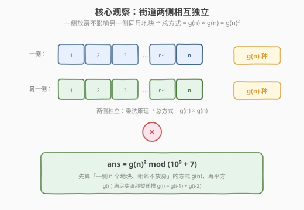
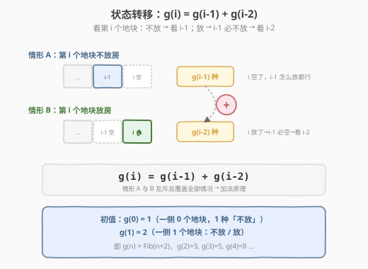
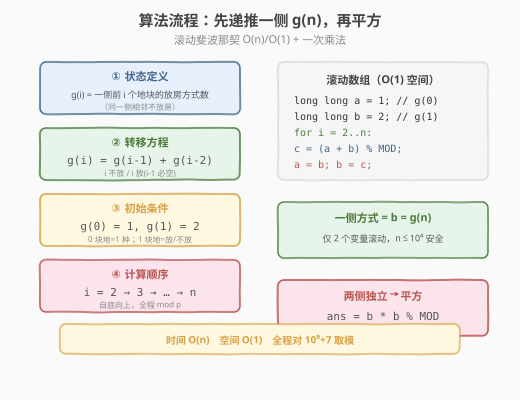
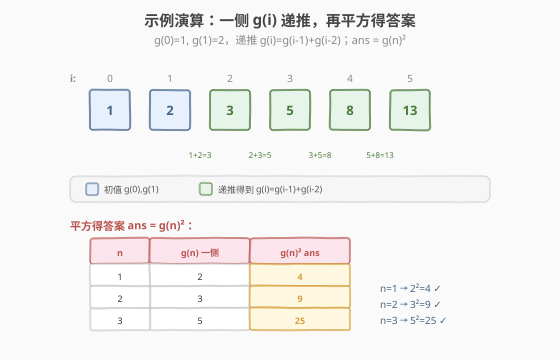

# LeetCode 统计放置房子的方式数 题解

## 1. 题目概述

- **标题 / 题号**：统计放置房子的方式数（#2320，medium）
- **链接**：https://leetcode.cn/problems/count-number-of-ways-to-place-houses/
- **难度**：中等
- **标签**：动态规划、数学

**题意**：一条街道上共有 `n * 2` 个**地块**，街道的两侧各有 `n` 个地块，每边按 $1$ 到 $n$ 编号。每个地块上都可以放置一所房子。要求**街道同一侧不能存在两所房子相邻**，请计算并返回放置房屋的方式数目。由于答案可能很大，需对 $10^9 + 7$ 取余后返回。

注意：如果一所房子放在某一侧的第 $i$ 个地块，**不影响**在另一侧的第 $i$ 个地块放置房子（两侧相互独立）。

**示例 1**：

```text
输入：n = 1
输出：4
解释：
1. 所有地块都不放置房子。
2. 一所房子放在街道的某一侧。
3. 一所房子放在街道的另一侧。
4. 放置两所房子，街道两侧各放置一所。
```

**示例 2**：

```text
输入：n = 2
输出：9
```

**约束**：

- $1 \le n \le 10^4$

> 💡 本题表面是「两侧街道放房」，实则两层归约：① **两侧相互独立**，总方式 = 一侧方式数 $g(n)$ 的**平方**；② 一侧 $n$ 个地块「相邻不放房」的方式数 $g(n)$ 满足斐波那契递推 $g(i)=g(i-1)+g(i-2)$，即 $g(n)=\text{Fib}(n+2)$。于是问题归约到「斐波那契滚动 + 一次平方」，承接 [70. 爬楼梯](https://leetcode.cn/problems/climbing-stairs/)。

## 2. 解题思路

### 2.1 暴力思路：枚举两侧所有放置方案

最直白的做法是对每侧独立枚举全部 $2^n$ 种「放/不放」的 01 串，逐个检查同一侧是否出现相邻的 `1`，统计一侧合法方案数 $g(n)$，再平方得到答案：

```text
brute(n):
    ans = 0
    for mask in 0 .. 2^n-1:        # 枚举一侧所有 01 串
        if mask & (mask << 1) == 0: # 无相邻 1 → 合法
            ans += 1
    return ans * ans % MOD
```

时间 $O(2^n \cdot n)$（枚举 $2^n$ 个状态，每个检查相邻需 $O(n)$，可位运算优化到 $O(1)$ 仍为 $O(2^n)$）。$n=10^4$ 时状态数约 $10^{3010}$，**完全不可行**。

> ⚠️ 暴力的问题在于把「相邻不放房」的约束逐个状态验证，浪费了递推结构。注意到：若前 $i-1$ 个地块已合法，则第 $i$ 个地块只受第 $i-1$ 个地块状态约束——这就是斐波那契递推的来源，也是 [198. 打家劫舍](https://leetcode.cn/problems/house-robber/) 的同款「相邻互斥」结构。

### 2.2 核心观察：两侧独立 + 斐波那契递推



**关键观察一（两侧独立）**：题目明确「一侧第 $i$ 个地块放房不影响另一侧第 $i$ 个地块」。两侧的约束**互不耦合**，由乘法原理：

$$
\text{ans} = g(n) \times g(n) = g(n)^2 \bmod (10^9+7)
$$

其中 $g(n)$ 表示**一侧** $n$ 个地块满足「相邻不放房」的放置方式数。

**关键观察二（斐波那契递推）**：定义 $g(i)$ = 一侧前 $i$ 个地块的合法放置方式数。考虑第 $i$ 个地块：

- **情形 A：第 $i$ 个地块不放房** → 第 $i-1$ 个地块放或不放都行 → 前 $i-1$ 个地块任意合法方案，共 $g(i-1)$ 种；
- **情形 B：第 $i$ 个地块放房** → 为避免相邻，第 $i-1$ 个地块**必不放**，等价于前 $i-2$ 个地块任意合法方案，共 $g(i-2)$ 种。

两种情形互斥且覆盖全部情况，由加法原理：

$$
g(i) = g(i-1) + g(i-2)
$$



**初始条件**：

- $g(0) = 1$：一侧 $0$ 个地块，只有「全不放」$1$ 种方式（空方案，作为递推地基）；
- $g(1) = 2$：一侧 $1$ 个地块，可放可不放，$2$ 种方式。

于是 $g(2)=g(1)+g(0)=3$、$g(3)=g(2)+g(1)=5$、$g(4)=8$、$g(5)=13$ … 与斐波那契数列 $\text{Fib}(1)=1,\text{Fib}(2)=1,\text{Fib}(3)=2,\text{Fib}(4)=3,\text{Fib}(5)=5$ 对照，得 $g(n)=\text{Fib}(n+2)$。

> 💡 **为什么 $g(0)=1$ 而非 $0$？** 因为「一个地块也没有」本身就是一种合法方案（什么都不放）。把 $g(0)=1$ 当作递推地基，可让 $g(2)=g(1)+g(0)=2+1=3$ 自然成立，避免对 $i=2$ 单独写初值。这与 [70. 爬楼梯](https://leetcode.cn/problems/climbing-stairs/) 中令 $f(0)=1$ 的做法同源：**初值与转移方程自洽即可**。

> ⚠️ **为什么不能直接平方后忘取模？** $g(n) \approx \varphi^{n+2}/\sqrt5$（$\varphi\approx1.618$），$n=10^4$ 时 $g(n)$ 有数千位。必须**全程对 $10^9+7$ 取模**，且平方时用 `long long` 临时承接（$g(n)<10^9+7$，平方 $<10^{18}$，仍在 64 位内）。

### 2.3 算法流程图



1. **初始化**：令 $\text{MOD}=10^9+7$，滚动变量 $a=g(0)=1$、$b=g(1)=2$。
2. **滚动递推** $i$ 从 $2$ 到 $n$：
   - $c = (a + b) \bmod \text{MOD}$；
   - $a \leftarrow b$（$g(i-2) \leftarrow g(i-1)$）；
   - $b \leftarrow c$（$g(i-1) \leftarrow g(i)$）。
3. **一侧方式数**：循环结束时 $b = g(n) \bmod \text{MOD}$。
4. **两侧平方**：$\text{ans} = b \times b \bmod \text{MOD}$，返回。

> 💡 $n=1$ 时循环不执行，$b$ 保持初值 $g(1)=2$，平方得 $4$，与示例 1 一致。递推只依赖前两个状态，**无需数组**，两个变量滚动即可，空间 $O(1)$。

### 2.4 示例演算



**递推一侧 $g(i)$**（$g(0)=1,\ g(1)=2$，递推 $g(i)=g(i-1)+g(i-2)$）：

| $i$ | $g(i-2)$ | $g(i-1)$ | $g(i)=g(i-1)+g(i-2)$ | 说明 |
|-----|----------|----------|----------------------|------|
| 0 | — | — | 1 | 初值：0 个地块，1 种（全不放） |
| 1 | — | — | 2 | 初值：1 个地块，放/不放 |
| 2 | g(0)=1 | g(1)=2 | 1+2=**3** | 00, 01, 10（不含 11） |
| 3 | g(1)=2 | g(2)=3 | 2+3=**5** | 5 种合法方案 |
| 4 | g(2)=3 | g(3)=5 | 3+5=**8** | 斐波那契 Fib(6)=8 |
| 5 | g(3)=5 | g(4)=8 | 5+8=**13** | Fib(7)=13 |

**平方得答案**：

| $n$ | $g(n)$ 一侧方式数 | $\text{ans}=g(n)^2$ |
|-----|------------------|---------------------|
| 1 | 2 | $2^2=$ **4** ✓ |
| 2 | 3 | $3^2=$ **9** ✓ |
| 3 | 5 | $5^2=$ **25** |
| 4 | 8 | $8^2=$ **64** |
| 5 | 13 | $13^2=$ **169** |

> ⚠️ **校验示例 1/2**：$n=1\Rightarrow g(1)=2,\ 2^2=4$ ✓；$n=2\Rightarrow g(2)=3,\ 3^2=9$ ✓。两侧独立是平方的依据，缺一不可。

## 3. 参考代码

### C++（滚动斐波那契 + 平方，推荐）

```cpp
class Solution {
  public:
    int countHousePlacements(int n) {
        const long long MOD = 1e9 + 7;
        long long a = 1;  // g(0)
        long long b = 2;  // g(1)
        for (int i = 2; i <= n; ++i) {
            long long c = (a + b) % MOD;
            a = b;
            b = c;
        }
        return (int)(b * b % MOD);  // g(n)^2 mod MOD
    }
};
```

> 💡 `a/b/c` 用 `long long` 保证加法不溢出（$2 \times (10^9+7) < 2^{31}$ 其实也安全，但平方 $b^2$ 可达 $\approx10^{18}$ 必须 64 位）。`n=1` 时循环不进，`b=2` 直接平方返回 `4`。

### Python

```python
class Solution:
    def countHousePlacements(self, n: int) -> int:
        MOD = 10**9 + 7
        a, b = 1, 2  # g(0), g(1)
        for i in range(2, n + 1):
            a, b = b, (a + b) % MOD
        return (b * b) % MOD
```

> 💡 Python 整数自带大数，理论上不取模也行，但平方后位数随 $n$ 指数增长（$n=10^4$ 时数千位），**取模既保证结果正确又避免大数运算拖慢速度**。`a, b = b, (a+b) % MOD` 是同时赋值，无需临时变量。

### C++（直接调用斐波那契数 + 一次平方，逻辑更直观）

```cpp
class Solution {
  public:
    int countHousePlacements(int n) {
        const long long MOD = 1e9 + 7;
        // g(n) = Fib(n+2)，先递推到 Fib(n+2)
        long long f_prev2 = 1, f_prev1 = 1;  // Fib(1)=Fib(2)=1
        for (int i = 3; i <= n + 2; ++i) {
            long long cur = (f_prev1 + f_prev2) % MOD;
            f_prev2 = f_prev1;
            f_prev1 = cur;
        }
        long long g = f_prev1;  // g(n) = Fib(n+2)
        return (int)(g * g % MOD);
    }
};
```

> ⚠️ 此版把 $g(n)$ 直接写成 $\text{Fib}(n+2)$，从 $\text{Fib}(1)=\text{Fib}(2)=1$ 起递推到 $\text{Fib}(n+2)$。$n=1$ 时循环 $i=3$ 执行一次得 $\text{Fib}(3)=2$，平方得 $4$。两种写法等价，选自己思路最清晰的一种。

## 4. 复杂度分析

| 维度 | 复杂度 | 说明 |
|------|--------|------|
| 时间复杂度 | $O(n)$ | 单层循环 $n-1$ 次加法与取模，最后一次乘法 |
| 空间复杂度 | $O(1)$ | 仅用 $a/b/c$ 三个滚动变量，无需数组 |
| 最优时间 | $O(\log n)$ | 矩阵快速幂求斐波那契（见扩展） |

> 💡 相比暴力的 $O(2^n)$，关键归约在于把「相邻不放房」的约束写成 $g(i)=g(i-1)+g(i-2)$ 的递推，从而把指数级枚举压成线性递推。若把约束改为「同侧不能有 $k$ 所房子相邻」，递推变为 $g(i)=\sum_{j=1}^{k}g(i-j)$，仍可滚动 $O(k)$ 空间求解。

## 5. 扩展：从「相邻不放房」到斐波那契计数

### 5.1 归约链

本题的优雅之处在于一条两层归约链：

$$
\underbrace{\text{两侧 }2n\text{ 个地块、相邻不放房}}_{\text{原问题}}
\;\xrightarrow{\text{两侧独立}}\;
\underbrace{g(n)^2}_{\text{一侧平方}}
\;\xrightarrow{\text{递推}}\;
\underbrace{g(n)=\text{Fib}(n+2)}_{\text{斐波那契}}
$$

**乘法原理的合法性**：两侧独立意味着「一侧任选一种合法方案 $A$、另一侧任选一种合法方案 $B$」构成一个独立的全局方案，方案数 $=|A|\cdot|B|=g(n)^2$。题目中「一侧第 $i$ 地块不影响另一侧第 $i$ 地块」正是这条独立性的保证。

### 5.2 「相邻不放房」= 长度 $n$ 无连续 1 的 01 串

把一侧 $n$ 个地块的「放/不放」编码为长度 $n$ 的 01 串，「同侧相邻不放房」等价于「串中无连续两个 $1$」。设其个数为 $g(n)$，则：

$$
g(n) = g(n-1) + g(n-2),\quad g(0)=1,\ g(1)=2
$$

- 末位为 $0$：前 $n-1$ 位任意合法 → $g(n-1)$；
- 末位为 $1$：则倒数第二位必为 $0$，前 $n-2$ 位任意合法 → $g(n-2)$。

这正是斐波那契数列，且 $g(n)=\text{Fib}(n+2)$。该模型与 [70. 爬楼梯](https://leetcode.cn/problems/climbing-stairs/)（爬法 $f(n)=\text{Fib}(n+1)$）、[198. 打家劫舍](https://leetcode.cn/problems/house-robber/)（取 $\max$ 而非求和的「相邻互斥」版）同源。

### 5.3 矩阵快速幂：$O(\log n)$ 解法

递推 $g(i)=g(i-1)+g(i-2)$ 可写成矩阵形式：

$$
\begin{pmatrix} g(i) \\ g(i-1) \end{pmatrix} =
\begin{pmatrix} 1 & 1 \\ 1 & 0 \end{pmatrix}
\begin{pmatrix} g(i-1) \\ g(i-2) \end{pmatrix}
$$

迭代展开：$\begin{pmatrix} g(n) \\ g(n-1) \end{pmatrix} = \begin{pmatrix} 1 & 1 \\ 1 & 0 \end{pmatrix}^{n-1} \begin{pmatrix} g(1) \\ g(0) \end{pmatrix}$。矩阵幂用快速幂可在 $O(\log n)$ 内算出。本题 $n\le10^4$，线性递推已足够；若题目放宽到 $n\le10^{18}$（如某些斐波那契模质数变体），矩阵快速幂是唯一可行解。

> ⚠️ 平方操作必须在矩阵递推**之后**单独做——因为 $\text{Fib}(n+2)^2 \ne \text{Fib}(n+2)^2 \bmod p$ 的递推（平方破坏了线性递推结构），不能把平方塞进矩阵里。

## 6. 面试要点

1. **为什么答案是 $g(n)^2$ 而不是 $g(2n)$ 之类？**

   - 题目中「街道两侧各有 $n$ 个地块」且「一侧第 $i$ 地块不影响另一侧第 $i$ 地块」，说明**两侧的约束互不耦合**。由乘法原理，全局方案数 = 一侧方案数 $\times$ 另一侧方案数 = $g(n)\times g(n) = g(n)^2$。两侧不是「拼成一条长 $2n$ 的街」（那样相邻约束会跨侧，递推完全不同），而是两条**独立**的长度 $n$ 链。

2. **递推 $g(i)=g(i-1)+g(i-2)$ 的两个分支为何互斥且完备？**

   - 按第 $i$ 个地块「放房」与否二分：放了（情形 B）则第 $i-1$ 必空；没放（情形 A）则第 $i-1$ 自由。这两种情况覆盖了第 $i$ 个地块的全部可能，且一个「放」一个「不放」天然互斥。故方案数相加。这与 [198. 打家劫舍](https://leetcode.cn/problems/house-robber/) 的「偷/不偷」二分同构，只是把 $\max$ 换成了 $+$（计数型 vs 最值型）。

3. **$g(0)=1$ 还是 $g(0)=0$？为什么这样设？**

   - 取 $g(0)=1$。「一侧 $0$ 个地块」本身就是「全不放」这一种合法方案，故为 $1$。这样 $g(2)=g(1)+g(0)=2+1=3$ 自然成立，无需为 $i=2$ 单独写初值。若误取 $g(0)=0$，则 $g(2)=2$，会漏掉「$1$ 放 $2$ 不放」的合法方案。**初值要和转移方程自洽**，是所有 DP 的通用原则。

4. **为什么要全程取模？平方时会有溢出吗？**

   - $g(n)=\text{Fib}(n+2)$，$n=10^4$ 时位数达数千位，不取模则大数运算慢且答案错误。全程对 $10^9+7$ 取模保证 $g(n)<\text{MOD}<2^{30}$。平方时 $g(n)^2 < (10^9)^2 = 10^{18}$，仍在 64 位 `long long` 范围内（上限 $\approx9.2\times10^{18}$），故 C++ 用 `long long` 临时承接平方即可，**最后再取一次模**。Python 整数无限大，但取模避免大数拖慢。

5. **本题与 [70. 爬楼梯] / [198. 打家劫舍] 的递推有何异同？**

   - 三者都是「$f(i)$ 依赖前两项」的线性递推，骨架相同：本题 $g(i)=g(i-1)+g(i-2)$（计数，加法），爬楼梯 $f(i)=f(i-1)+f(i-2)$（计数，加法，初值不同），打家劫舍 $r(i)=\max(r(i-1),\ r(i-2)+\text{nums}[i])$（最值，取 $\max$）。差异在「运算」（$+$ vs $\max$）与「第二项是否带额外收益」。掌握「相邻互斥」这一结构后，三者可举一反三；本题额外套了一层「两侧独立 → 平方」的乘法原理。

## 同类练习题

| # | 题目 | 与本题的关联 |
|---|------|-------------|
| 70 | [爬楼梯](https://leetcode.cn/problems/climbing-stairs/)（[题解](../0001-0100/70_爬楼梯.md)） | 斐波那契递推母题，本题 $g(n)=\text{Fib}(n+2)$ 的直接来源，对照初值差异 |
| 198 | [打家劫舍](https://leetcode.cn/problems/house-robber/)（[题解](../0101-0200/198_打家劫舍.md)） | 同款「相邻互斥」结构，把计数的 $+$ 换成最值的 $\max$，递推骨架完全一致 |
| 509 | [斐波那契数](https://leetcode.cn/problems/fibonacci-number/) | 斐波那契数列本身，理解 $g(n)=\text{Fib}(n+2)$ 的下标平移 |
| 790 | [多米诺与托米诺平铺](https://leetcode.cn/problems/domino-and-tromino-tiling/) | 二维平铺计数，同样是「末位分情形」的线性递推（含两状态联动），承接本题「按末位状态转移」的思路 |
| 746 | [使用最小花费爬楼梯](https://leetcode.cn/problems/min-cost-climbing-stairs/) | 把计数改成最小花费的 $\min$ 版线性递推，对照运算差异 |
