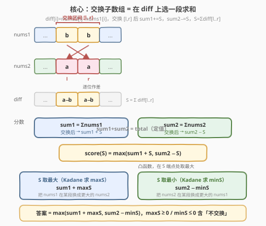
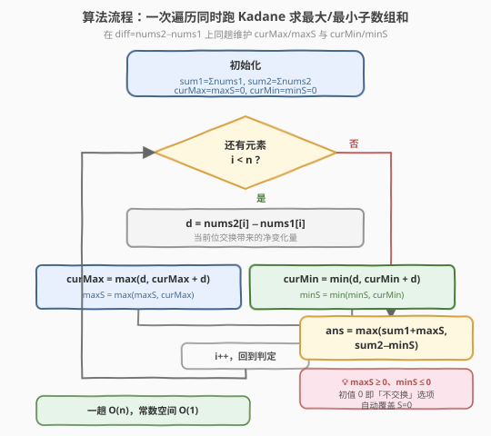
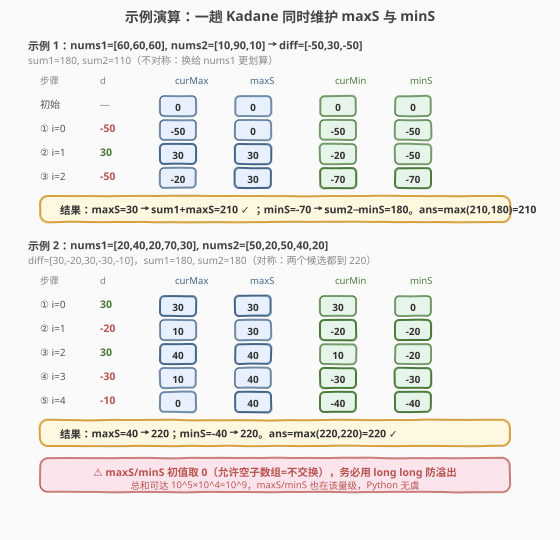

# LeetCode 拼接数组的最大分数 题解

## 1. 题目概述

- **标题 / 题号**：拼接数组的最大分数（#2321，hard）
- **链接**：https://leetcode.cn/problems/maximum-score-of-spliced-array/
- **难度**：困难
- **标签**：数组、动态规划、贪心

**题意**：给你两个下标从 **0** 开始的整数数组 `nums1` 和 `nums2`，长度都是 `n`。你可以选择两个整数 `left` 和 `right`（$0 \le \text{left} \le \text{right} \lt n$），**交换**两个子数组 `nums1[left...right]` 与 `nums2[left...right]`（可执行一次或不执行）。交换后，数组的**分数**取 $\max(\sum \text{nums1},\ \sum \text{nums2})$。返回可能的最大分数。

**示例 1**：

```text
输入：nums1 = [60,60,60], nums2 = [10,90,10]
输出：210
解释：选择 left = 1, right = 1，nums1 = [60,90,60]，nums2 = [10,60,10]。
分数 = max(sum(nums1), sum(nums2)) = max(210, 80) = 210。
```

**示例 2**：

```text
输入：nums1 = [20,40,20,70,30], nums2 = [50,20,50,40,20]
输出：220
解释：选择 left = 3, right = 4，nums1 = [20,40,20,40,20]，nums2 = [50,20,50,70,30]。
分数 = max(140, 220) = 220。
```

**示例 3**：

```text
输入：nums1 = [7,11,13], nums2 = [1,1,1]
输出：31
解释：不交换任何子数组。分数 = max(31, 3) = 31。
```

**约束**：

- $n == \text{nums1.length} == \text{nums2.length}$
- $1 \le n \le 10^5$
- $1 \le \text{nums1}[i],\ \text{nums2}[i] \le 10^4$

> 💡 表面是「交换子数组」，本质是**在差值数组上选一段求和**。定义 $\text{diff}[i] = \text{nums2}[i] - \text{nums1}[i]$：交换区间 $[\text{left},\text{right}]$ 会让 $\sum \text{nums1}$ 增加 $S=\sum_{\text{left}}^{\text{right}}\text{diff}$、$\sum \text{nums2}$ 减少 $S$。于是「选哪个区间」就归约成「在 diff 上选一段子数组和」——一个标准的 Kadane 问题（承接 [53. 最大子数组和](https://leetcode.cn/problems/maximum-subarray/)）。

## 2. 解题思路

### 2.1 暴力思路：枚举所有交换区间

最直白的做法是枚举所有 $\binom{n}{2}$ 量级的区间 $[\text{left},\text{right}]$，对每个区间模拟交换后求两个数组和、取大者：

```text
ans = max(sum(nums1), sum(nums2))     # 不交换
for left in 0..n-1:
    for right in left..n-1:
        交换 nums1[left..right] 与 nums2[left..right]
        ans = max(ans, sum(nums1), sum(nums2))
        交换回来  # 回溯
return ans
```

时间 $O(n^3)$（每个区间还要 $O(n)$ 重算两个和），$n \le 10^5$ 时约 $10^{15}$ 次运算，完全不可行。但这个做法暴露了关键量：交换一段后，**两个数组和的变化只取决于这段上 nums2 与 nums1 的逐位之差**。

> ⚠️ 重复重算两个和是暴力的根源。注意到 $\sum\text{nums1}$ 与 $\sum\text{nums2}$ 之和是定值（交换不改变总量），变化的只是「这一段从谁那里拿走多少」。把逐位差值抽成一个 diff 数组，区间选择就变成 diff 上的子数组求和问题。

### 2.2 核心观察：差值数组 + Kadane——交换归约成子数组和



**关键转化**：令 $\text{diff}[i] = \text{nums2}[i] - \text{nums1}[i]$。若交换区间 $[\text{left},\text{right}]$，则：

$$
\sum\text{nums1} \to \text{sum1} + S, \qquad \sum\text{nums2} \to \text{sum2} - S, \qquad S = \sum_{i=\text{left}}^{\text{right}}\text{diff}[i]
$$

其中 $\text{sum1}=\sum\text{nums1}$、$\text{sum2}=\sum\text{nums2}$ 为交换前的和，$\text{sum1}+\text{sum2}=\text{total}$ 是与交换无关的**定值**。分数为：

$$
\text{score}(S) = \max\big(\text{sum1} + S,\ \text{sum2} - S\big) = \max\big(\text{sum1} + S,\ \text{total} - (\text{sum1} + S)\big)
$$

**两个核心观察**：

1. **$S$ 是 diff 上的子数组和**（含空段 $S=0$，即「不交换」）。于是「选区间」就是「在 diff 上选子数组求和」——典型的 Kadane 场景。
2. **$\text{score}(S)$ 是 $S$ 的凸函数**（两段一次式的 $\max$，呈 V 形，在端点处取最大）。因此最大值只可能在 $S$ 的两个极端取得：**最大子数组和 $\text{maxS}$** 与**最小子数组和 $\text{minS}$**。

$$
\boxed{\text{ans} = \max\big(\text{sum1} + \text{maxS},\ \text{sum2} - \text{minS}\big)}
$$

其中 $\text{maxS} = \max(0,\ \text{最大子数组和})$、$\text{minS} = \min(0,\ \text{最小子数组和})$，初值取 $0$ 以**显式包含「不交换」选项**（$S=0$）。两个候选的直观含义：

- **$\text{sum1} + \text{maxS}$**：选一段让 nums1 增益最大（把 nums1 在某段换成更大的 nums2）；
- **$\text{sum2} - \text{minS}$**：选一段让 nums2 降幅最小，即把 nums2 在某段换成更大的 nums1（$\text{minS}$ 越负，减去它增益越大）。

> 💡 **为什么只需两个端点？** 因为 $\text{score}(S)=\max(a,b)$ 中 $a=\text{sum1}+S$ 随 $S$ 单增、$b=\text{sum2}-S$ 随 $S$ 单减，$\max(a,b)$ 是 V 形凸函数，最小值在交叉点，**最大值必在区间端点**。又因 $\text{maxS}\ge 0 \ge \text{minS}$，候选 $\text{sum1}+\text{maxS}\ge\text{sum1}$、$\text{sum2}-\text{minS}\ge\text{sum2}$，自动覆盖了不交换基线，故无需再单独比较 $\text{sum1}/\text{sum2}$。

### 2.3 算法流程图



1. **预处理**：求 $\text{sum1}=\sum\text{nums1}$、$\text{sum2}=\sum\text{nums2}$；初始化 $\text{curMax}=\text{maxS}=\text{curMin}=\text{minS}=0$。
2. **一趟遍历** $i$ 从 $0$ 到 $n-1$：
   - 计算 $d = \text{nums2}[i] - \text{nums1}[i]$；
   - **Kadane 求最大**：$\text{curMax} = \max(d,\ \text{curMax}+d)$，$\text{maxS} = \max(\text{maxS},\text{curMax})$；
   - **Kadane 求最小**：$\text{curMin} = \min(d,\ \text{curMin}+d)$，$\text{minS} = \min(\text{minS},\text{curMin})$。
3. **返回** $\max(\text{sum1}+\text{maxS},\ \text{sum2}-\text{minS})$。

> 💡 不必显式构造 diff 数组——遍历时即时算 $d$ 即可，空间 $O(1)$。最大与最小两套 Kadane 完全独立，同趟循环里各跑各的互不干扰。

### 2.4 示例演算



**示例 1**：`nums1=[60,60,60]`，`nums2=[10,90,10]` → `diff=[-50,30,-50]`，$\text{sum1}=180$，$\text{sum2}=110$

| 步骤 | $d$ | curMax | maxS | curMin | minS |
|------|-----|--------|------|--------|------|
| 初始 | — | 0 | 0 | 0 | 0 |
| ① i=0 | -50 | -50 | 0 | -50 | -50 |
| ② i=1 | 30 | 30 | **30** | -20 | -50 |
| ③ i=2 | -50 | -20 | 30 | -70 | **-70** |

得 $\text{maxS}=30$、$\text{minS}=-70$：

- 候选 A：$\text{sum1}+\text{maxS} = 180+30 = 210$（把下标 1 的 60 换成 90）；
- 候选 B：$\text{sum2}-\text{minS} = 110-(-70) = 180$。

$\text{ans}=\max(210,180)=210$ ✓（不对称：换给 nums1 更划算，候选 A 胜）

**示例 2**：`nums1=[20,40,20,70,30]`，`nums2=[50,20,50,40,20]` → `diff=[30,-20,30,-30,-10]`，$\text{sum1}=180$，$\text{sum2}=180$

| 步骤 | $d$ | curMax | maxS | curMin | minS |
|------|-----|--------|------|--------|------|
| 初始 | — | 0 | 0 | 0 | 0 |
| ① i=0 | 30 | 30 | 30 | 30 | 0 |
| ② i=1 | -20 | 10 | 30 | -20 | -20 |
| ③ i=2 | 30 | 40 | **40** | 10 | -20 |
| ④ i=3 | -30 | 10 | 40 | -30 | -30 |
| ⑤ i=4 | -10 | 0 | 40 | -40 | **-40** |

得 $\text{maxS}=40$（子数组 $[30,-20,30]$，即下标 0–2）、$\text{minS}=-40$（子数组 $[-30,-10]$，即下标 3–4）：

- 候选 A：$\text{sum1}+\text{maxS} = 180+40 = 220$；
- 候选 B：$\text{sum2}-\text{minS} = 180-(-40) = 220$。

$\text{ans}=\max(220,220)=220$ ✓（对称：两个候选殊途同归，均命中 220）

> ⚠️ **示例 3 的「不交换」**：`nums1=[7,11,13]`，`nums2=[1,1,1]` → `diff=[-6,-10,-12]` 全负。Kadane 求最大时每步 $\text{curMax}$ 都为负，$\text{maxS}$ 始终保持初值 $0$；求最小时 $\text{minS}=-28$。于是 $\text{sum1}+\text{maxS}=31+0=31$、$\text{sum2}-\text{minS}=3-(-28)=31$，两者相等，$\text{ans}=31$ ✓。这正体现了初值取 $0$（允许空段=不交换）的必要性：全负 diff 下任何实际交换都会拖累分数。

## 3. 参考代码

### C++（一趟 Kadane 同时求 maxS/minS，推荐）

```cpp
class Solution {
  public:
    long long maximumsSplicedArray(vector<int>& nums1, vector<int>& nums2) {
        long long sum1 = accumulate(nums1.begin(), nums1.end(), 0LL);
        long long sum2 = accumulate(nums2.begin(), nums2.end(), 0LL);

        long long curMax = 0, maxS = 0;   // 最大子数组和（允许空段）
        long long curMin = 0, minS = 0;   // 最小子数组和（允许空段）
        for (int i = 0; i < (int)nums1.size(); ++i) {
            long long d = (long long)nums2[i] - nums1[i];
            curMax = max(d, curMax + d);
            maxS   = max(maxS, curMax);
            curMin = min(d, curMin + d);
            minS   = min(minS, curMin);
        }
        return max(sum1 + maxS, sum2 - minS);
    }
};
```

> 💡 `accumulate` 第三参数传 `0LL` 让累加在 `long long` 上进行。`d` 显式转 `long long` 防止 `int` 相减后赋值截断。`maxS/minS` 初值为 `0` 即「允许空子数组=不交换」，自动覆盖 $S=0$ 基线。

### Python（同一趟）

```python
class Solution:
    def maximumsSplicedArray(self, nums1: List[int], nums2: List[int]) -> int:
        sum1, sum2 = sum(nums1), sum(nums2)

        cur_max = max_s = 0   # 最大子数组和（允许空段）
        cur_min = min_s = 0   # 最小子数组和（允许空段）
        for a, b in zip(nums1, nums2):
            d = b - a
            cur_max = max(d, cur_max + d)
            max_s   = max(max_s, cur_max)
            cur_min = min(d, cur_min + d)
            min_s   = min(min_s, cur_min)
        return max(sum1 + max_s, sum2 - min_s)
```

> 💡 Python 整数自带大数，无需担心溢出。返回类型为 `int`，因 `max_s/min_s` 初值 `0` 是 `int`，全程运算结果均为 `int`。

### C++（拆分版：分别求最大/最小子数组和，逻辑更直观）

```cpp
class Solution {
  public:
    long long maximumsSplicedArray(vector<int>& nums1, vector<int>& nums2) {
        long long sum1 = accumulate(nums1.begin(), nums1.end(), 0LL);
        long long sum2 = accumulate(nums2.begin(), nums2.end(), 0LL);
        int n = nums1.size();

        // 在 diff=nums2-nums1 上求最大子数组和（允许空段，故下界 0）
        long long maxS = 0, cur = 0;
        for (int i = 0; i < n; ++i) {
            long long d = (long long)nums2[i] - nums1[i];
            cur = max(0LL, cur + d);
            maxS = max(maxS, cur);
        }
        // 在同一 diff 上求最小子数组和（允许空段，故上界 0）
        long long minS = 0;
        cur = 0;
        for (int i = 0; i < n; ++i) {
            long long d = (long long)nums2[i] - nums1[i];
            cur = min(0LL, cur + d);
            minS = min(minS, cur);
        }
        return max(sum1 + maxS, sum2 - minS);
    }
};
```

> ⚠️ 拆分版用 `cur = max(0LL, cur + d)` 把「重新开始」直接写成截到 0，等价于 Kadane 的 $\max(d, \text{cur}+d)$ 在允许空段时再与 $0$ 取大。两趟遍历仍为 $O(n)$，逻辑分层清晰，适合面试时先讲清「两个独立候选」再合并为一趟。

## 4. 复杂度分析

| 维度 | 复杂度 | 说明 |
|------|--------|------|
| 时间复杂度 | $O(n)$ | 一趟遍历，每个位置做常数次加减与比较；拆分版两趟遍历仍为 $O(n)$ |
| 空间复杂度 | $O(1)$ | 仅用 `sum1/sum2`、`curMax/maxS`、`curMin/minS` 等常数个变量，无需构造 diff 数组 |

> 💡 相比暴力的 $O(n^3)$，关键归约在于把「交换子数组」翻译成「差值数组上的子数组和」。若题目改为「交换任意两段（不必连续）」或「可交换多次」，则子数组和结构被破坏，需另谋他法（如分组 DP）。

## 5. 扩展：从「枚举区间」到「凸函数端点」的归约

本题最优雅的观察是下面这条归约链：

$$
\underbrace{\max_{[\text{left},\text{right}]}\ \max\big(\text{sum1}+S,\ \text{sum2}-S\big)}_{\text{枚举区间 }O(n^2)}
\;\xrightarrow{\text{diff 归约}}\;
\underbrace{\max_{S\in\text{子数组和集合}}\ \max\big(\text{sum1}+S,\ \text{sum2}-S\big)}_{\text{子数组求和}}
\;\xrightarrow{\text{凸性}}\;
\underbrace{\max\big(\text{sum1}+\text{maxS},\ \text{sum2}-\text{minS}\big)}_{\text{端点候选 }O(n)}
$$

**凸性证明**：令 $a(S)=\text{sum1}+S$（单增）、$b(S)=\text{sum2}-S$（单减），$f(S)=\max(a,b)$。设交叉点 $S^*$ 使 $a(S^*)=b(S^*)$，即 $\text{sum1}+S^*=\text{sum2}-S^*\Rightarrow S^*=(\text{sum2}-\text{sum1})/2$。则：

- 当 $S\le S^*$ 时 $b(S)\ge a(S)$，$f(S)=b(S)$ 随 $S$ 增大而**减小**；
- 当 $S\ge S^*$ 时 $a(S)\ge b(S)$，$f(S)=a(S)$ 随 $S$ 增大而**增大**。

故 $f$ 是 V 形凸函数，在区间 $[\text{minS},\text{maxS}]$ 上的最大值必在端点取得：$f(\text{minS})$ 或 $f(\text{maxS})$。展开即 $\max(\text{sum1}+\text{minS},\text{sum2}-\text{minS})$ 与 $\max(\text{sum1}+\text{maxS},\text{sum2}-\text{maxS})$；又因 $\text{maxS}\ge0\ge\text{minS}$，前者被 $\text{sum2}-\text{minS}$ 主导、后者被 $\text{sum1}+\text{maxS}$ 主导，故最终只需比较这两项。

> ⚠️ 这个「凸 $\Rightarrow$ 端点」的性质依赖目标函数是**分段取大的线性函数**。若题改为取 $\min$（即「最小化两个数组的较小者」），则 $f$ 变成倒 V 形凹函数，最大值反而在交叉点附近，需另作分析。

## 6. 面试要点

1. **为什么「交换子数组」能归约成「diff 上的子数组和」？**

   - 交换区间 $[\text{left},\text{right}]$ 后，$\sum\text{nums1}$ 的变化量恰是 $\sum_{i}(\text{nums2}[i]-\text{nums1}[i])=\sum_i\text{diff}[i]$，即 diff 在该区间的子数组和 $S$；$\sum\text{nums2}$ 则变化 $-S$。于是选区间等价于在 diff 上选一段求和，问题天然归约到 Kadane。

2. **为什么答案是 $\max(\text{sum1}+\text{maxS},\text{sum2}-\text{minS})$ 而非四个候选都要比？**

   - $\text{score}(S)=\max(\text{sum1}+S,\text{sum2}-S)$ 是 $S$ 的凸函数，最大值在端点 $\text{maxS}$ 或 $\text{minS}$ 取得。再由 $\text{maxS}\ge0\ge\text{minS}$：在 $\text{maxS}$ 处 $\text{sum1}+\text{maxS}\ge\text{sum2}-\text{maxS}$（候选被前者主导），在 $\text{minS}$ 处 $\text{sum2}-\text{minS}\ge\text{sum1}+\text{minS}$（候选被后者主导）。故两项足够，且 $\text{maxS}\ge0$、$\text{minS}\le0$ 自动覆盖了「不交换」基线。

3. **`maxS/minS` 为什么初值取 0 而不是像 [53. 最大子数组和] 那样取首元素？**

   - 本题允许「不交换」（$S=0$），相当于允许**空子数组**。Kadane 求最大子数组和时把下界设为 0（`cur=max(0,cur+d)` / 初值 0），即允许「前缀和跌到负就丢弃重启，但始终保留空段 0 作为一个候选」；求最小同理设上界 0。若照搬 53 的「至少取一个元素」初值，全负 diff（示例 3）会把 $\text{maxS}$ 算成最大负数，错失「不交换」这一最优解。

4. **为什么要用 `long long`？最大数据量是多少？**

   - $n\le10^5$、$\text{nums}_i\le10^4$，故 $\text{sum1}/\text{sum2}$ 可达 $10^9$；$\text{maxS}/\text{minS}$ 也在 $10^9$ 量级；两数相加最大约 $2\times10^9$，已超 32 位有符号整数上界 $\approx2.1\times10^9$，临界且危险。C++ 必须用 `long long`，`accumulate` 第三参数传 `0LL`、`d` 显式转 `long long` 防中途截断；Python 整数自带大数无虞。

5. **本题与 [53. 最大子数组和] / [918. 环形子数组的最大和] 的 Kadane 应用有何异同？**

   - 三者都把问题归约到子数组求和后用 Kadane。53 是单点求最大子数组和（必取非空，初值首元素）；918 用「总和−最小子数组和」处理环形；本题则**同时**求最大与最小子数组和，分别服务于两个候选——「最大」对应「让 nums1 增益最大」，「最小」对应「让 nums2 增益最大」。三者共享 Kadane 这把「锤子」，但「空段是否允许」「求 max 还是 max+min 联动」是各自的变量。

## 同类练习题

| # | 题目 | 与本题的关联 |
|---|------|-------------|
| 53 | [最大子数组和](https://leetcode.cn/problems/maximum-subarray/)（[题解](../0001-0100/53_最大子数组和.md)） | Kadane 母题，本题求 maxS 的直接来源，对照「必取非空 vs 允许空段」的初值差异 |
| 918 | [环形子数组的最大和](https://leetcode.cn/problems/maximum-sum-circular-subarray/)（[题解](../0901-1000/918_环形子数组的最大和.md)） | 同样用到「最大子数组和 + 最小子数组和」的联动（total−minS），与本题的两候选结构同源 |
| 1749 | [任意子数组和的绝对值的最大值](https://leetcode.cn/problems/maximum-absolute-sum-of-any-subarray/) | 求子数组和绝对值最大 = $\max(\text{maxS},\ -\text{minS})$，与本题「同时维护 maxS/minS」的 Kadane 双跑完全一致 |
| 152 | [乘积最大子数组](https://leetcode.cn/problems/maximum-product-subarray/)（[题解](../0101-0200/152_乘积最大子数组.md)） | 维护 max/min 两状态的 Kadane 变体，承接本题「一趟维护两个极值」的思想到乘积域 |
| 1746 | [经过一次操作后的最大子数组和](https://leetcode.cn/problems/maximum-subarray-sum-after-one-operation/) | 同样是「一次操作 + 子数组和」的归约，把单点操作融入 Kadane 状态转移，与本题「一次交换」的建模思路对照 |
