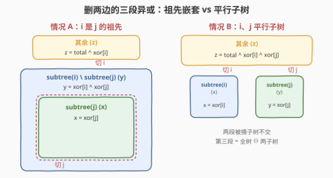
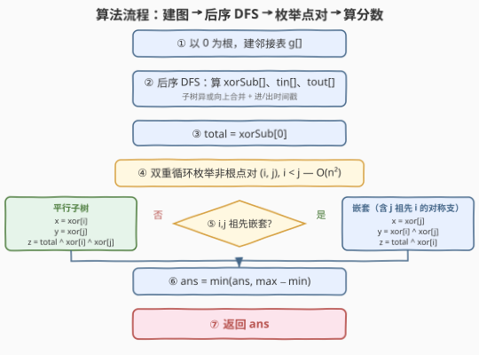
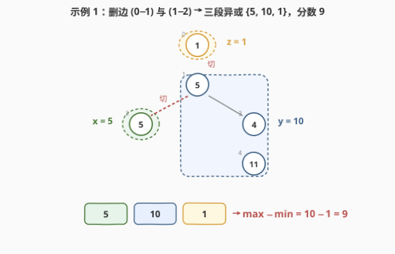

# 从树中删除边的最小分数

- **题目名称**：从树中删除边的最小分数
- **链接**：[2322. 从树中删除边的最小分数](https://leetcode.cn/problems/minimum-score-after-removals-on-a-tree/)
- **难度**：困难
- **标签**：树、深度优先搜索、位运算、无向连通图

## 1. 题目概述

给你一棵 $n$ 个节点（编号 $0 \dots n-1$）的**无向连通树**（$n-1$ 条边），每个节点 $i$ 有权值 $\text{nums}[i]$。**删除两条不同的边**，树被切成**三个连通分量**；每个分量取其所有节点权值的**异或值**，该方案的**分数** $=$ 三个异或值里的 $\max - \min$。求所有删边方案中的**最小分数**。

**示例 1**：

```text
输入：nums = [1,5,5,4,11], edges = [[0,1],[1,2],[1,3],[3,4]]
输出：9
解释：删边 (0,1) 与 (1,2)：
  分量 {0} 异或 1；{2} 异或 5；{1,3,4} 异或 5^4^11 = 10。
  分数 = 10 − 1 = 9。
```

**示例 2**：

```text
输入：nums = [5,5,2,4,4,2], edges = [[0,1],[1,2],[5,2],[4,3],[1,3]]
输出：0
解释：删边 (1,2) 与 (1,3)：
  分量 {2,5} 异或 2^2 = 0；{3,4} 异或 4^4 = 0；{0,1} 异或 5^5 = 0。
  分数 = 0 − 0 = 0。
```

**约束条件**：

- $3 \le n \le 1000$
- $1 \le \text{nums}[i] \le 10^8$
- `edges` 表示一棵有效的树

> 💡 **关键观察**：删一条边 $=$ 把某棵子树"摘下来"。删两条边得到的三段异或，**只取决于两个断点（被摘子树的根）是否成祖先关系**——而这能靠 DFS 的进/出时间戳 $O(1)$ 判定。于是 $\binom{n-1}{2}$ 种删边方案可被线性扫描，整体 $O(n^2)$。

---

## 2. 解题思路

### 2.1 暴力思路：枚举边对 + 每次重算异或

最直白的做法：在 $\binom{n-1}{2} \approx 5 \times 10^5$ 种删边方案里，每次**重新遍历**三个分量算异或。每方案 $O(n)$，总计 $O(n^3) \approx 10^9$，$n=1000$ 下超时。浪费在于：**同一棵子树在不同方案里被反复遍历求异或**，而子树异或是封闭可预计算的。

### 2.2 核心观察：子树异或 + 进出时间戳

把树**任意定根**（取 $0$ 为根）。对每个非根节点 $v$，"删边 $(v, \text{parent}[v])$" 等价于"把 $v$ 的子树摘下来"。一次性后序 DFS 算出：

- $\text{xor}[v]$ = 子树 $v$ 内所有点权的异或；
- $\text{tin}[v] / \text{tout}[v]$ = DFS 进/出时间戳，用于 $O(1)$ 判祖先：$u$ 是 $v$ 的祖先 $\Leftrightarrow \text{tin}[u] \le \text{tin}[v] \le \text{tout}[u]$（且 $\text{tout}[v] \le \text{tout}[u]$）。

记 $\text{total} = \text{xor}[0]$（全树异或）。删两条边（对应断点 $i, j$，即"被摘子树的根"），三段异或由 $i, j$ 的祖先关系分两种情况：



| 关系 | 三段异或 | 说明 |
|------|----------|------|
| $i$ 是 $j$ 的祖先 | $x=\text{xor}[j]$；$y=\text{xor}[i] \oplus \text{xor}[j]$；$z=\text{total} \oplus \text{xor}[i]$ | 摘 $i$ 再在 $i$ 内摘 $j$：剩下的是 $i$ 内除 $j$ 外那块 |
| $i, j$ 平行（互非祖先） | $x=\text{xor}[i]$；$y=\text{xor}[j]$；$z=\text{total} \oplus \text{xor}[i] \oplus \text{xor}[j]$ | 各摘一棵子树，第三段是全树去掉两棵子树 |

> 💡 **第三段为何这样算？** 全树异或 $\text{total}$ 覆盖所有点权。把若干棵**不交子树**摘掉后，剩余部分的异或 $= \text{total} \oplus$（各被摘子树的 $\text{xor}$）。因为被摘子树两两不交，它们的 $\text{xor}$ 只覆盖各自点权，逐个异或上去即"抠掉"这些点。祖先嵌套情况里，摘 $i$ 时 $j$ 还在 $i$ 内，所以"抠掉 $i$"先消去 $\text{xor}[i]$；而 $i$ 内除 $j$ 外那块 $= \text{xor}[i] \oplus \text{xor}[j]$（$i$ 异或掉 $j$ 的部分）。

> ⚠️ **"j 是 i 的祖先"怎么办？** 把 $i, j$ 对调即与第一种情况同构：$x=\text{xor}[i]$、$y=\text{xor}[j] \oplus \text{xor}[i]$、$z=\text{total} \oplus \text{xor}[j]$。代码里单独写一支，便于直读。

### 2.3 算法流程图



### 2.4 示例演算

以示例 1 `nums = [1,5,5,4,11]`，以 $0$ 为根后序 DFS：

| 节点 | 子树异或 xor | 说明 |
|------|--------------|------|
| 4 | 11 | 叶 |
| 3 | $4 \oplus 11 = 15$ | 自身 ^ 子 4 |
| 2 | 5 | 叶 |
| 1 | $5 \oplus 5 \oplus 15 = 15$ | 自身 ^ 子 2 ^ 子 3 |
| 0 | $1 \oplus 15 = 14$ | total |

断点对 $(i, j) = (1, 2)$：$1$ 是 $2$ 的祖先（边 $0\text{-}1$ 在上、边 $1\text{-}2$ 在下）。

- $x = \text{xor}[2] = 5$
- $y = \text{xor}[1] \oplus \text{xor}[2] = 15 \oplus 5 = 10$（即 $\{1,3,4\}$ 的异或）
- $z = \text{total} \oplus \text{xor}[1] = 14 \oplus 15 = 1$（即 $\{0\}$）

三段异或 $\{5, 10, 1\}$，$\max - \min = 10 - 1 = 9$。



> 💡 **示例 2 为何得 0**：以 $0$ 为根后 $\text{xor}[2] = 2 \oplus 2 = 0$、$\text{xor}[3] = 4 \oplus 4 = 0$、$\text{total} = 0$。断点 $(2, 3)$ 平行，三段 $= 0, 0, 0$，分数 $0 - 0 = 0$。分数非负，能取到 $0$ 即全局最小。

---

## 3. 参考代码

### C++

```cpp
class Solution {
public:
    int minimumScore(vector<int>& nums, vector<vector<int>>& edges) {
        int n = nums.size();
        vector<vector<int>> g(n);
        for (auto& e : edges) {
            g[e[0]].push_back(e[1]);
            g[e[1]].push_back(e[0]);
        }
        vector<int> xorSub(n), tin(n), tout(n);
        int timer = 0;
        function<void(int, int)> dfs = [&](int u, int p) {
            tin[u] = timer++;
            xorSub[u] = nums[u];
            for (int v : g[u]) {
                if (v == p) continue;
                dfs(v, u);
                xorSub[u] ^= xorSub[v];          // 子树异或向上合并
            }
            tout[u] = timer++;
        };
        dfs(0, -1);

        auto isAnc = [&](int u, int v) {
            return tin[u] <= tin[v] && tout[v] <= tout[u];
        };

        int total = xorSub[0], ans = INT_MAX;
        for (int i = 1; i < n; i++) {             // 非根节点：每个 v 对应删边 (v, parent[v])
            for (int j = i + 1; j < n; j++) {
                int x, y, z;
                if (isAnc(i, j)) {               // i 是 j 的祖先
                    x = xorSub[j];
                    y = xorSub[i] ^ xorSub[j];
                    z = total ^ xorSub[i];
                } else if (isAnc(j, i)) {        // j 是 i 的祖先（对称）
                    x = xorSub[i];
                    y = xorSub[j] ^ xorSub[i];
                    z = total ^ xorSub[j];
                } else {                         // 平行子树
                    x = xorSub[i];
                    y = xorSub[j];
                    z = total ^ xorSub[i] ^ xorSub[j];
                }
                ans = min(ans, max({x, y, z}) - min({x, y, z}));
            }
        }
        return ans;
    }
};
```

### Python

```python
import sys


class Solution:
    def minimumScore(self, nums: List[int], edges: List[List[int]]) -> int:
        n = len(nums)
        g = [[] for _ in range(n)]
        for u, v in edges:
            g[u].append(v)
            g[v].append(u)

        xor_sub = [0] * n
        tin = [0] * n
        tout = [0] * n
        timer = 0

        sys.setrecursionlimit(10000)           # n=1000 退化成链时防 RecursionError
        def dfs(u: int, p: int) -> None:
            nonlocal timer
            tin[u] = timer
            timer += 1
            xor_sub[u] = nums[u]
            for v in g[u]:
                if v == p:
                    continue
                dfs(v, u)
                xor_sub[u] ^= xor_sub[v]        # 子树异或向上合并
            tout[u] = timer
            timer += 1

        dfs(0, -1)

        def is_anc(u: int, v: int) -> bool:
            return tin[u] <= tin[v] and tout[v] <= tout[u]

        total = xor_sub[0]
        ans = float("inf")
        for i in range(1, n):                   # 非根节点：每个 v 对应删边 (v, parent[v])
            for j in range(i + 1, n):
                if is_anc(i, j):                # i 是 j 的祖先
                    x, y, z = xor_sub[j], xor_sub[i] ^ xor_sub[j], total ^ xor_sub[i]
                elif is_anc(j, i):              # j 是 i 的祖先（对称）
                    x, y, z = xor_sub[i], xor_sub[j] ^ xor_sub[i], total ^ xor_sub[j]
                else:                           # 平行子树
                    x, y, z = xor_sub[i], xor_sub[j], total ^ xor_sub[i] ^ xor_sub[j]
                ans = min(ans, max(x, y, z) - min(x, y, z))
        return int(ans)
```

> 💡 **实现细节**：① 判祖先用 `tin[u] <= tin[v] && tout[v] <= tout[u]`——DFS 时进/出都 `timer++`，故 $[\text{tin}[u], \text{tout}[u]]$ 恰好覆盖 $u$ 子树内所有节点的进出时刻；② 枚举的是**非根节点对**——每个非根节点 $v$ 唯一对应"删边 $(v, \text{parent}[v])$"，根 $0$ 无父边故从 $i=1$ 起；③ 两种祖先情况（$i$ 祖先 $j$、$j$ 祖先 $i$）对称，把 $i, j$ 对调即同公式，代码各写一支便于直读。

---

## 4. 复杂度分析

| 维度 | 复杂度 | 说明 |
|------|--------|------|
| **时间复杂度** | $O(n^2)$ | 后序 DFS $O(n)$；双重循环枚举非根点对 $\binom{n-1}{2} \approx \tfrac{n^2}{2}$，每对 $O(1)$（时间戳判祖先 + 常数次异或） |
| **空间复杂度** | $O(n)$ | 邻接表 `g`、`xorSub`、`tin`、`tout` 各 $O(n)$；递归栈最坏 $O(n)$（退化成链） |

> 💡 暴力 $O(n^3)$ 与本解 $O(n^2)$ 差了一个 $n$ 因子，关键在于**把"每次重算三段异或"重构为"预处理子树异或 + 时间戳，方案判定变 $O(1)$"**——子树异或的可叠加性（不交子树异或可逐个抠除）让三段异或成为纯算术。

---

## 5. 扩展：迭代 DFS 与时间戳约定

$n=1000$ 时递归深度可达 $1000$，C++ 默认栈足够、Python 需 `setrecursionlimit`。若想完全规避递归，可用**迭代 DFS**：手写栈存 `(u, p, childIdx)`，进栈时记 `tin`，全部子节点处理完记 `tout`，回溯时把子树异或累加回父。逻辑等价，常数略大但无栈溢出风险。

此外判祖先有两种等价的时间戳约定：

| 约定 | tin | tout | 判祖先 |
|------|-----|------|--------|
| 进出时刻（本题） | 进入时 `timer++` | 离开时 `timer++` | $\text{tin}[u] \le \text{tin}[v] \wedge \text{tout}[v] \le \text{tout}[u]$ |
| 预序号 + 子树大小 | 预序号 | 子树最大预序号 / 子树大小 | $\text{tin}[u] \le \text{tin}[v] < \text{tin}[u] + \text{sz}[u]$ |

两者都利用"子树对应 DFS 序上一段连续区间"这一性质，选哪种看个人习惯。

---

## 6. 面试要点

1. **为什么想到"子树异或 + 时间戳"？**

    - 删一条边 $\Leftrightarrow$ 摘一棵子树，子树的异或可后序 DFS 预处理；删两条边得到三段，第三段由"全树异或 ⊖ 被摘子树异或"算出——只要被摘子树不交，异或就能逐个抠除。而判断两断点是"嵌套还是平行"只需祖先关系，时间戳 $O(1)$ 给出。把"几何的删边"翻译成"代数的子树异或 + 祖先判定"，是本题的解题钥匙。

2. **三段异或的公式怎么推（尤其祖先嵌套的 $y$）？**

    - 平行：三段是两棵不交子树 + 全树剩余，$z = \text{total} \oplus \text{xor}[i] \oplus \text{xor}[j]$。
    - 嵌套（$i$ 祖先 $j$）：摘 $j$ 得 $\text{xor}[j]$；$i$ 内除 $j$ 外那块 $= \text{xor}[i] \oplus \text{xor}[j]$（$i$ 异或掉 $j$）；$i$ 外的剩余 $= \text{total} \oplus \text{xor}[i]$。关键是"摘 $i$ 时 $j$ 还在 $i$ 内"，故 $y$ 不是 $\text{xor}[i]$ 而要再异或掉 $\text{xor}[j]$。

3. **如何 $O(1)$ 判祖先？两种时间戳约定有何区别？**

    - 进出时刻法：`tin` 记进入时刻、`tout` 记离开时刻，$u$ 是 $v$ 祖先 $\Leftrightarrow \text{tin}[u] \le \text{tin}[v] \wedge \text{tout}[v] \le \text{tout}[u]$。预序号 + 子树大小法：$u$ 是 $v$ 祖先 $\Leftrightarrow \text{tin}[u] \le \text{tin}[v] < \text{tin}[u] + \text{sz}[u]$。两者本质相同：子树对应 DFS 序上的连续区间。

4. **枚举的是"点对"还是"边对"？为何从 $i=1$ 起？**

    - 枚举**非根节点对**：每个非根节点 $v$ 唯一对应删边 $(v, \text{parent}[v])$。根 $0$ 无父边，故 $i$ 从 $1$ 起。这把"边的组合"转化为"被摘子树根的组合"，正好接上预处理好的 $\text{xor}[]$ 与时间戳。共 $\binom{n-1}{2}$ 对，与边对一一对应、不重不漏。

5. **递归爆栈怎么办？**

    - $n=1000$ 退化成链时递归深 $1000$：C++ 默认栈（约 MB 级）足以容纳，Python 默认上限 $1000$ 会 `RecursionError`，故 `sys.setrecursionlimit(10000)`。追求稳妥可写迭代 DFS，逻辑等价，只是把"父等子回溯累加"用手写栈 + 子节点索引显式控制。

> 💡 **一句话总结**：2322 是「子树异或预处理 + 时间戳判祖先」——删两条边的三段异或由两断点是嵌套还是平行分两种公式 $O(1)$ 算出，$\binom{n-1}{2}$ 种方案线性扫描取 $\max-\min$ 最小，整体 $O(n^2)$。

---

## 7. 同类练习题

- [2049. 统计最高分的节点数目](../2001-2100/2049_统计最高分的节点数目.md)：删一个节点后用各子树 size 与剩余部分算"分数"；"删点算分量"与本题"删边算分量"同构，都是后序 DFS 统计子树聚合量
- [834. 树中距离之和](../0801-0900/834_树中距离之和.md)：换根 DP，子树 size 信息父子双向传递；对照本题"子树异或只向上合并"的单向后序
- [2316. 统计无向图中无法互相到达点对数](2316_统计无向图中无法互相到达点对数.md)：同区间，无向图连通分量计数；对照本题"删两条边后的三个树连通分量"
- [684. 冗余连接](../0601-0700/684_冗余连接.md)：并查集处理树边/判环，理解树"删边即多一个连通分量"的结构基础
