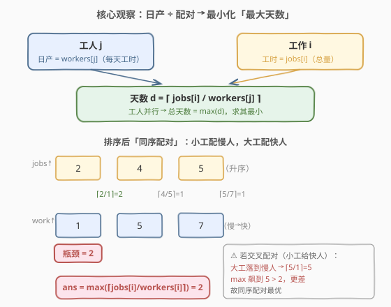
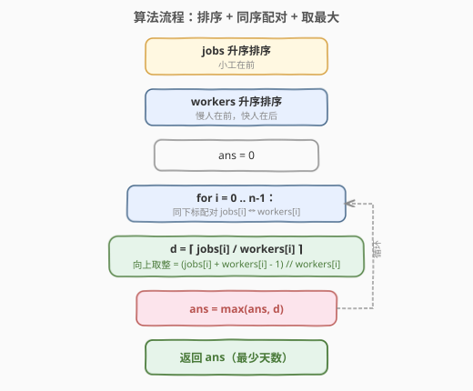

# 完成所有工作的最短时间 II

- **题目名称**：完成所有工作的最短时间 II
- **链接**：[2323. 完成所有工作的最短时间 II 🔒](https://leetcode.cn/problems/find-minimum-time-to-finish-all-jobs-ii/)
- **难度**：中等
- **标签**：贪心、数组、排序

## 1. 题目概述

给你两个**下标从 0 开始**的整数数组 `jobs` 和**等长**的 `workers`，其中：

- `jobs[i]` 是完成第 $i$ 个工作所需的**总工时**；
- `workers[j]` 是第 $j$ 个工人**每天可以工作的时间**（即日产产能，越大越快）。

每项工作都应**恰好**分配给一个工人，使得每个工人**只能**完成一项工作（一一配对）。工人 $j$ 接到工作 $i$ 后，需要的天数为 $\lceil \text{jobs}[i] / \text{workers}[j] \rceil$（向上取整：不足一天也按一天计）。所有工人**并行**开工，故完成全部工作的总天数为各对天数取最大值。返回分配后**最少**需要的天数。

**示例 1**：

```text
输入：jobs = [5,2,4], workers = [1,7,5]
输出：2
解释：
- 第 2 个工人（日产 5）→ 第 0 个工作（工时 5）：⌈5/5⌉ = 1 天
- 第 0 个工人（日产 1）→ 第 1 个工作（工时 2）：⌈2/1⌉ = 2 天
- 第 1 个工人（日产 7）→ 第 2 个工作（工时 4）：⌈4/7⌉ = 1 天
全部完成需 max(1,2,1) = 2 天。
```

**示例 2**：

```text
输入：jobs = [3,18,15,9], workers = [6,5,1,3]
输出：3
解释：排序后同序配对，四对天数均为 3，max = 3。
```

**约束条件**：

- $n = \text{jobs.length} = \text{workers.length}$
- $1 \le n \le 10^5$
- $1 \le \text{jobs}[i],\ \text{workers}[i] \le 10^5$

> ⚠️ **关键信号**：这是一道**一一配对 + 最小化最大值**的题。天数由比值 $\lceil \text{job}/\text{worker} \rceil$ 决定，瓶颈来自「大工时 / 慢工人」。直觉上：**把小工时给慢工人、大工时给快工人**才能压住最大值——这正是排序后「同序配对」的贪心。

---

## 2. 解题思路

### 2.1 暴力思路：枚举全排列

把 `workers` 的每一种排列与 `jobs` 配对，共 $n!$ 种方案，对每种取 $\max_i \lceil \text{jobs}[i] / \text{workers}[\pi(i)] \rceil$，再取最小值。当 $n \le 10^5$ 时 $n!$ 完全不可行，必须找到**单调结构**把搜索压缩到排序 $O(n \log n)$。

### 2.2 核心观察：排序后同序配对



把代价写清楚：工人 $j$ 做工作 $i$ 需 $d = \lceil \text{jobs}[i] / \text{workers}[j] \rceil$ 天。要让所有工人**并行**完工，总天数 $= \max_i d_i$，要最小化它。

直觉判断：**大工时若落到慢工人头上，$\lceil 大/小 \rceil$ 会爆炸成最大瓶颈**；反之把大工时给快工人、小工时给慢工人，能让每对比值尽量均匀。形式化即：把 `jobs` 与 `workers` **分别升序排序后，按下标配对**（最小工时配最慢工人、最大工时配最快工人），取所有 $\lceil \text{jobs}[i] / \text{workers}[i] \rceil$ 的最大值即为答案。

> 💡 **方向辨析**：目标函数是**比值** $\text{job}/\text{worker}$ 时，同序配对（小配小、大配大）能最小化最大值；若是**乘积** $\text{job}\times\text{worker}$，则需**逆序配对**（小配大）才最小化最大值。两者方向相反，切勿混淆。

### 2.3 算法流程图



三步串联：① `jobs` 升序；② `workers` 升序；③ 逐对算 $d_i = \lceil \text{jobs}[i] / \text{workers}[i] \rceil$，`ans = max(ans, d_i)`。向上取整用整数实现：$\lceil a/b \rceil = (a + b - 1) \;\text{//}\; b$（$a, b > 0$）。

### 2.4 示例演算

![示例演算：jobs=[3,18,15,9], workers=[6,5,1,3]](../images/jobs2_example_walkthrough.svg)

以示例 2 演算：原数组排序后 `jobs = [3,9,15,18]`、`workers = [1,3,5,6]`，同序配对得四对天数 $\lceil3/1\rceil=3$、$\lceil9/3\rceil=3$、$\lceil15/5\rceil=3$、$\lceil18/6\rceil=3$，$\max = 3$。对照「交叉配对」（如把 $18$ 给日产 $1$ 的慢工人）会得到 $\lceil18/1\rceil=18$，最大值飙升——可见同序配对把瓶颈压到了下界 $3$。

---

## 3. 参考代码

### C++

```cpp
class Solution {
public:
    int minimumTime(vector<int>& jobs, vector<int>& workers) {
        ranges::sort(jobs);
        ranges::sort(workers);
        int ans = 0;
        int n = jobs.size();
        for (int i = 0; i < n; ++i) {
            ans = max(ans, (jobs[i] + workers[i] - 1) / workers[i]);  // ⌈job/worker⌉
        }
        return ans;
    }
};
```

### Python

```python
class Solution:
    def minimumTime(self, jobs: List[int], workers: List[int]) -> int:
        jobs.sort()
        workers.sort()
        return max((a + b - 1) // b for a, b in zip(jobs, workers))
```

> 💡 **细节**：`a + b - 1` 形式的整数向上取整等价于 `math.ceil(a / b)`，但全程整数运算、无浮点误差、更快。`a, b ≥ 1` 保证不会除零；`jobs[i], workers[i] ≤ 1e5` 故中间项 `a+b-1 ≤ 2e5`，`int` 无溢出风险。

---

## 4. 复杂度分析

| 维度 | 复杂度 | 说明 |
|------|--------|------|
| **时间复杂度** | $O(n \log n)$ | 两次排序各 $O(n \log n)$，单次线性扫描 $O(n)$，瓶颈在排序 |
| **空间复杂度** | $O(\log n)$ | 仅排序所需的递归栈（原地快排），不计输入存储；若用归并则为 $O(n)$ |

> 💡 本题是**配对贪心**而非二分答案：因为一一配对 + 比值代价的结构下，排序同序配对直接给出全局最优，无需「二分一个答案上限再验证」。$n = 10^5$ 下 $O(n \log n)$ 毫秒级通过。

---

## 5. 扩展：交换论证的严格证明

为什么「同序配对」一定最优？用**交换论证（exchange argument）**给出严格性。

设排序后 $\text{jobs}_1 \le \text{jobs}_2 \le \cdots \le \text{jobs}_n$，$\text{workers}_1 \le \cdots \le \text{workers}_n$。对任意配对排列 $\pi$，目标 $M(\pi) = \max_i \lceil \text{jobs}_i / \text{workers}_{\pi(i)} \rceil$。我们要证：按下标对应（$\pi(i) = i$）的 $M$ 不大于任意 $\pi$ 的 $M$。

若某个 $\pi$ 存在**交叉**：存在 $i < k$（故 $\text{jobs}_i \le \text{jobs}_k$）但 $\text{workers}_{\pi(i)} \ge \text{workers}_{\pi(k)}$（即小工时反而拿了不更慢的工人、大工时拿了不更快的工人）。交换这两对的工人指派，让 $i$ 配 $\pi(k)$、$k$ 配 $\pi(i)$：

- 交换前两对代价：$\lceil \text{jobs}_i / w_{\pi(i)} \rceil$ 与 $\lceil \text{jobs}_k / w_{\pi(k)} \rceil$；
- 交换后两对代价：$\lceil \text{jobs}_i / w_{\pi(k)} \rceil$ 与 $\lceil \text{jobs}_k / w_{\pi(i)} \rceil$。

由 $\text{jobs}_i \le \text{jobs}_k$ 与 $w_{\pi(i)} \ge w_{\pi(k)}$：

$$
\Big\lceil \frac{\text{jobs}_i}{w_{\pi(k)}} \Big\rceil \;\le\; \Big\lceil \frac{\text{jobs}_k}{w_{\pi(k)}} \Big\rceil
\quad(\text{分子更小，分母相同}),\qquad
\Big\lceil \frac{\text{jobs}_k}{w_{\pi(i)}} \Big\rceil \;\le\; \Big\lceil \frac{\text{jobs}_k}{w_{\pi(k)}} \Big\rceil
\quad(\text{分母更大})
$$

即交换后这两对的天数都不超过交换前的大工时对 $\lceil \text{jobs}_k / w_{\pi(k)} \rceil$，故交换**不增**整体最大值，反而可能消去一个瓶颈。反复消除所有交叉，最终得到**无交叉的同序配对**，且 $M$ 单调不增。因此同序配对给出全局最小 $M$。

> 💡 本质是「排序不等式」在**比值最小化最大值**下的对偶形式：消除「小工时配大工人、大工时配小工人」的逆序，让比值序列尽可能平。

---

## 6. 面试要点

1. **为什么是「同序配对」而非「逆序配对」？**

   - 代价是比值 $\lceil \text{job}/\text{worker} \rceil$，瓶颈来自「大 job / 小 worker」。要让最大值小，必须把**大 job 配大 worker（快工人）**、小 job 配小 worker（慢工人），即两者**同向**排序后按下标配对。若误用乘积模型的逆序配对，会把大工时丢给慢工人，瓶颈瞬间爆炸。

2. **为什么向上取整写成 `(a + b - 1) / b`？**

   - 整数除法 $a / b$（向下取整）会丢掉余数；加 $b - 1$ 后再除等价于 $\lceil a/b \rceil$，全程整数运算、无浮点精度损失。前提 $a, b > 0$，本题恒满足。也可写 `math.ceil(a / b)` 但慢且有可能有浮点边界问题。

3. **本题与 1723「完成所有工作的最短时间」有何区别？**

   - **1723**：$k$ 个工人、每个工人可承担**多项**工作，工人代价 $=$ 分配工作的**工时之和**，最小化最大和——是 NP-hard，需回溯剪枝 / 状压 DP / 二分答案。
   - **2323（本题）**：工人数 $=$ 工作数，**一一配对**，工人代价 $=$ $\lceil \text{工时}/\text{日产} \rceil$ 天数，并行取最大——有贪心最优解 $O(n \log n)$。模型从「多对一求和」退化成「一对一比值」，难度从 NP-hard 跳到贪心。

4. **交换论证的核心一句是什么？**

   - 任何「小工时配不更慢工人、大工时配不更快工人」的**交叉**，交换后两对代价都不超过原大工时对，故交换不增最大值；反复消交叉即得同序配对最优。这是把贪心从直觉提升为证明的标准武器。

5. **如何快速判定该用同序还是逆序配对？**

   - 看代价函数与目标：**比值**（$a/b$）最小化最大值 → **同序**（小配小、大配大）；**乘积**（$a \cdot b$）最小化最大值或最小化和 → **逆序**（小配大、大配小）。先写出一对代价公式，再用 2 个元素的交换算例验证方向，避免背反。

> 💡 **一句话总结**：工人日产 $w$、工时 $j$，天数 $=\lceil j/w \rceil$，并行取最大。把 `jobs`、`workers` **同序排序后按下标配对**，取 $\max \lceil j/w \rceil$ 即全局最优——比值模型的最小化最大值，贪心 $O(n \log n)$。

---

## 7. 同类练习题

- [1723. 完成所有工作的最短时间](https://leetcode.cn/problems/find-minimum-time-to-finish-all-jobs/)（[站内题解](../1701-1800/1723_完成所有工作的最短时间.md)）：同名前作，**多项工作 / 工人求和**模型，NP-hard，对比本题「一一配对 / 比值」退化为贪心的难度跳变
- [2037. 使每位学生都有座位的最少移动次数](https://leetcode.cn/problems/minimum-number-of-moves-to-seat-everyone/)（[站内题解](../2001-2100/2037_使每位学生都有座位的最少移动次数.md)）：学生与座位**同序配对最小化总代价**（min-sum 版），与本题 min-max 版同属「排序后同序配对」家族
- [881. 救生艇](https://leetcode.cn/problems/boats-to-save-people/)（[站内题解](../0801-0900/881_救生艇.md)）：最轻配最重的**逆序配对**贪心，对比本题说明「何时同序、何时逆序」的判定
- [561. 数组拆分](https://leetcode.cn/problems/array-partition/)（[站内题解](../0501-0600/561_数组拆分.md)）：排序后取相邻对最小值之和最大，配对贪心的入门母题，承接本题的排序配对思路
