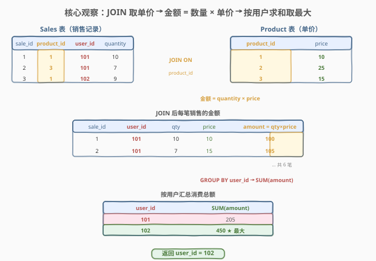
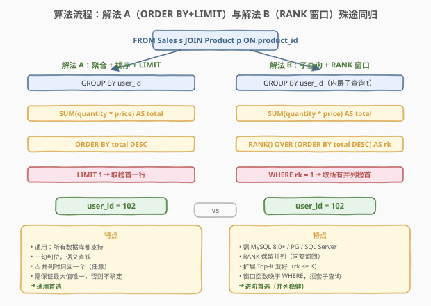
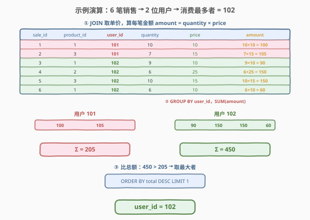

# LeetCode 产品销售分析 IV 题解

## 1. 题目概述

- **标题 / 题号**：产品销售分析 IV（#2324，medium）
- **链接**：https://leetcode.cn/problems/product-sales-analysis-iv/
- **难度**：中等
- **标签**：数据库、SQL、JOIN、`GROUP BY`、`SUM`、聚合乘积（派生度量）、子查询、`ORDER BY` + `LIMIT`、窗口函数、`RANK` vs `ROW_NUMBER`、并列处理、LeetCode 锁题

**题意**：给定 `Sales` 表（销售记录，含购买者 `user_id` 与数量 `quantity`）与 `Product` 表（产品单价 `price`），编写 SQL 查询，返回**消费金额最高的用户**的 `user_id`。其中每笔销售的金额为 $\text{quantity} \times \text{price}$，某用户的总消费为该用户所有销售金额之和，取总和最大者。

**表结构**：

```text
表：Sales
+------------+---------+
| 列名       | 类型    |
+------------+---------+
| sale_id    | int     |  ← 主键
| product_id | int     |  ← 外键 → Product.product_id
| user_id    | int     |
| quantity   | int     |
+------------+---------+
sale_id 是该表的主键（具有唯一值）。
product_id 是关联到 Product 表的外键。
每行表示某 user_id 购买了 quantity 件 product_id 产品。

表：Product
+------------+---------+
| 列名       | 类型    |
+------------+---------+
| product_id | int     |  ← 主键
| price      | int     |
+------------+---------+
product_id 是该表的主键。
每行表示一种产品的单价（按每单位计）。
```

> ⚠️ **锁题说明**：2324 为 LeetCode **Plus 会员专享题**，题目正文不公开。本篇题解依据官方公开的样例测试用例（表结构 `Sales(sale_id, product_id, user_id, quantity)` 与 `Product(product_id, price)`，以及下方示例数据）复原题意、样例与约束；输出列以官方样例为准（返回单列 `user_id`）。本表的 schema 与 1068–1070 系列不同：**无 `year`、无 `product_name`**，`Product` 表改为存**单价 `price`**，`Sales` 表多了**购买者 `user_id`**。

**示例 1**：

```text
输入：
Sales 表：
+---------+------------+---------+----------+
| sale_id | product_id | user_id | quantity |
+---------+------------+---------+----------+
| 1       | 1          | 101     | 10       |
| 2       | 3          | 101     | 7        |
| 3       | 1          | 102     | 9        |
| 4       | 2          | 102     | 6        |
| 5       | 3          | 102     | 10       |
| 6       | 1          | 102     | 6        |
+---------+------------+---------+----------+
Product 表：
+------------+-------+
| product_id | price |
+------------+-------+
| 1          | 10    |
| 2          | 25    |
| 3          | 15    |
+------------+-------+

输出：
+---------+
| user_id |
+---------+
| 102     |
+---------+

解释：
用户 101 总消费 = 10×10 + 7×15 = 100 + 105 = 205
用户 102 总消费 = 9×10 + 6×25 + 10×15 + 6×10 = 90 + 150 + 150 + 60 = 450
450 > 205，故返回 user_id = 102。
```

**约束**：

- `sale_id` 为 `Sales` 表主键，`product_id` 为 `Product` 表主键，`Sales.product_id` 为指向 `Product` 的外键。
- 一种产品恰有一个单价（`Product` 中 `product_id` 唯一）。
- 一个用户可有多笔销售、一笔销售只属一个用户。
- `quantity`、`price` 均为正整数，故金额恒正。
- 结果返回单列 `user_id`；题目保证至少有一笔销售（结果非空）。

> 💡 **关键观察**：单价 `price` 只在 `Product` 表，数量 `quantity` 只在 `Sales` 表——要算「金额」须先把两表按 `product_id` 拼起来再做**行内乘积**，再按 `user_id` **分组求和**，最后取最大。难点不在语法，而在三步串联的顺序：**JOIN 取单价 → 派生金额 → 分组聚合 → 取最值**。

## 2. 解题思路

### 2.1 暴力思路：逐行扫描累加

最直觉的过程式做法：读出 `Sales` 全表，对每行用 `product_id` 去查 `Product` 拿单价，算 `quantity × price` 累加进以 `user_id` 为键的字典；遍历完后在字典里找总和最大的键。伪代码：

```text
spent = {}                          # user_id -> 总消费
for row in Sales:
    price = lookup(Product, row.product_id)   # 取单价
    spent[row.user_id] += row.quantity * price
return argmax(spent)                # 总和最大的 user_id
```

这能解决问题，但把数据库引擎擅长的**连接与分组聚合**搬到了应用层——既低效也违背 SQL 的声明式哲学。本题在 SQL 中是一条「JOIN + GROUP BY + 聚合 + 取最值」的流水线，无需逐行循环。

### 2.2 核心观察：JOIN 取单价 → 派生金额 → 分组求和 → 取最大



问题拆为四步，每一步都不可省：

| 步骤 | 操作 | 产出 |
|------|------|------|
| ① JOIN 取单价 | `Sales JOIN Product ON product_id` | 每行多了 `price` 列（宽行） |
| ② 派生金额 | `quantity * price`（行内乘积） | 每笔销售的金额 |
| ③ 分组求和 | `GROUP BY user_id` + `SUM(quantity * price)` | 每位用户的总消费 |
| ④ 取最大 | `ORDER BY SUM(...) DESC LIMIT 1`（或 `RANK()`） | 消费最高者的 `user_id` |

$$\text{总消费}(u) = \sum_{\text{sale} \in u} \text{quantity} \times \text{price}(\text{product\_id}),\quad \text{答案} = \arg\max_{u}\, \text{总消费}(u)$$

> 💡 **为什么必须 JOIN？** 单价 `price` 只存在于 `Product` 表，`Sales` 里没有「金额」列。若不 JOIN，就无法把 `quantity` 与 `price` 放到同一行做乘积。`Sales.product_id` 是外键，保证每条销售一定能匹配到一个单价——`INNER JOIN` 与 `LEFT JOIN` 此处等价（无 NULL 顾虑）。

> 💡 **派生度量（aggregate of product）的落点**：`SUM(quantity * price)` 把「行内乘积」与「组内求和」合在一个聚合函数里——SQL 允许 `GROUP BY` 后的 `SELECT`/`ORDER BY`/`HAVING` 直接写「对行的表达式套聚合」，即 `SUM( 行表达式 )`。这是把「金额」当作**未命名的派生列**直接聚合，无需先算出一列再聚合。

### 2.3 算法流程图



两条等价路径，区别只在「取最大」的手段：

| 维度 | 解法 A：聚合 + ORDER BY + LIMIT（推荐） | 解法 B：RANK() 窗口函数 |
|------|----------------------------------------|-------------------------|
| **思路** | 分组求和后按总额降序、取榜首一行 | 分组求和后用窗口排名，取 `rk=1` |
| **关键写法** | `GROUP BY user_id` → `ORDER BY SUM(qty*price) DESC` → `LIMIT 1` | 子查询 `GROUP BY` 算 `total`，再套 `RANK() OVER (ORDER BY total DESC)`，外层 `WHERE rk=1` |
| **并列处理** | ⚠️ 只回一个（任意一行） | ✓ 同额并列均 `rk=1`，全保留 |
| **依赖窗口函数** | 否（兼容 MySQL 5.7） | 是（MySQL 8.0+） |
| **扩展 Top-K** | 不便（`LIMIT K` 可改但并列不稳） | 友好（`WHERE rk <= K`） |
| **推荐度** | ✓ **通用首选** | ✓ 进阶首选（并列稳健、扩展好） |

> ⚠️ **本题用 `LIMIT 1` 的前提是「最大值唯一」**：若两位用户总额相同，`ORDER BY ... LIMIT 1` 只返回其中**任意一个**（排序对并列行的相对顺序未指定）。题目样例无并列，且通常此类「找最高消费者」题隐含唯一性或接受任一；若要求「并列全返回」，须改用解法 B 的 `RANK` 或解法 C 的 `HAVING ... >= ALL(...)`，详见第 5 节。

### 2.4 示例演算



以官方样例走一遍「JOIN 取单价 → 派生金额 → 分组求和 → 取最大」：

| sale_id | product_id | user_id | qty | price | 金额 = qty×price |
|---------|-----------|---------|-----|-------|------------------|
| 1 | 1 | 101 | 10 | 10 | 100 |
| 2 | 3 | 101 | 7 | 15 | 105 |
| 3 | 1 | 102 | 9 | 10 | 90 |
| 4 | 2 | 102 | 6 | 25 | 150 |
| 5 | 3 | 102 | 10 | 15 | 150 |
| 6 | 1 | 102 | 6 | 10 | 60 |

- **② 派生金额**：6 笔销售各自的金额如最右列。
- **③ 分组求和**：用户 101 = $100+105=205$；用户 102 = $90+150+150+60=450$。
- **④ 取最大**：$450 > 205$ → 返回 `user_id = 102`。

> 💡 **用户 102 是核心考点**：她有 4 笔销售、跨 3 种产品（单价各不同 10/25/15），`SUM` 把不同单价的金额正确累加——这正是「JOIN 取单价」不可省的体现：若漏掉 JOIN，便无从对每笔匹配到正确的单价。对比用户 101 只有 2 笔、用户 102 有 4 笔，说明「分组求和」对笔数不一视同仁，靠 `GROUP BY user_id` 把可变笔数折叠为一个总额。

## 3. 参考代码

### SQL（解法 A：JOIN + GROUP BY + ORDER BY + LIMIT，推荐）

```sql
SELECT s.user_id
FROM Sales s
JOIN Product p ON s.product_id = p.product_id
GROUP BY s.user_id
ORDER BY SUM(s.quantity * p.price) DESC
LIMIT 1;
```

> 💡 **写法要点**：
> - `JOIN Product p ON s.product_id = p.product_id` 把单价 `price` 拼到每行销售旁——这是「JOIN 取单价」。
> - `GROUP BY s.user_id` 按 purchasing user 分组；`SUM(s.quantity * p.price)` 是「行内乘积 → 组内求和」的一体聚合，即为派生度量「总消费」。
> - `ORDER BY SUM(...) DESC` 按总消费降序；`LIMIT 1` 取榜首——这是「取最大」。
> - **`ORDER BY` 里可直接写聚合表达式 `SUM(...)`**：SQL 允许 `ORDER BY` 引用 `GROUP BY` 后的聚合（与 `SELECT` 同级，作用在分组结果上），无需为它起别名。
> - 用 `JOIN`（INNER）：外键保证每条销售都匹配到单价，无丢失行；`LEFT JOIN` 此处等价。

### SQL（解法 B：子查询 + RANK() 窗口函数，并列稳健）

```sql
SELECT user_id
FROM (
    SELECT user_id,
           RANK() OVER (ORDER BY total DESC) AS rk
    FROM (
        SELECT s.user_id, SUM(s.quantity * p.price) AS total
        FROM Sales s
        JOIN Product p ON s.product_id = p.product_id
        GROUP BY s.user_id
    ) t
) u
WHERE rk = 1;
```

> 💡 **写法要点**：
> - **两层子查询**：内层 `t` 先 `GROUP BY user_id` 算出 `(user_id, total)`；外层 `u` 对其套 `RANK() OVER (ORDER BY total DESC)`，总额越大 `rk` 越小，最大者 `rk=1`。
> - **务必用 `RANK()` 而非 `ROW_NUMBER()`**：`RANK` 对相同 `total` 给相同 `rk`，并列最高者全保留；`ROW_NUMBER` 强制唯一编号，并列时只留一个（见 5.1）。本题若不要求并列全返回，两者结果一致，但选 `RANK` 语义更稳。
> - 窗口函数在 `SELECT` 阶段计算、**晚于 `WHERE`**，且不能直接与 `GROUP BY` 同层套在聚合列上，故必须先 `GROUP BY` 物化 `total`，再在派生表上开窗。
> - 需 MySQL 8.0+ / PostgreSQL / SQL Server 等支持窗口函数的版本。

### SQL（解法 C：HAVING + `>= ALL`，关系式「全最大」，语义对照）

```sql
SELECT s.user_id
FROM Sales s
JOIN Product p ON s.product_id = p.product_id
GROUP BY s.user_id
HAVING SUM(s.quantity * p.price) >= ALL (
    SELECT SUM(s2.quantity * p2.price)
    FROM Sales s2
    JOIN Product p2 ON s2.product_id = p2.product_id
    GROUP BY s2.user_id
);
```

> 💡 **写法要点**：
> - `>= ALL (子查询)` 保留「总额 ≥ 所有用户总额」者——即等于最大者，是关系代数里「全最大」的直译：$x = \max S \iff x \geq \forall y \in S$。
> - 子查询返回**全体用户的总额集合**（非相关，只算一次），外层按 `user_id` 分组后逐组判定其 `SUM` 是否 `>= ALL` 该集合——并列时所有最大者都保留，与解法 B 的 `RANK` 等价。
> - **`HAVING` 里可直接写聚合表达式**：`HAVING SUM(...)` 对分组结果过滤，与 `SELECT`/`ORDER BY` 中的聚合同级，合法。
> - 语义清晰但写法偏冗长，且 `ALL` 子查询在某些老旧环境优化不佳，面试作为「并列全返回」的关系式对照解法。

### Python（pandas）

```python
import pandas as pd

def sales_analysis(sales: pd.DataFrame, product: pd.DataFrame) -> pd.DataFrame:
    merged = sales.merge(product, on='product_id')           # ① JOIN 取单价
    merged['amount'] = merged['quantity'] * merged['price']  # ② 派生金额
    totals = merged.groupby('user_id', as_index=False)['amount'].sum()  # ③ 分组求和
    return totals.loc[[totals['amount'].idxmax()], ['user_id']].reset_index(drop=True)  # ④ 取最大
```

> 💡 **pandas 对照**：
> - `merge(product, on='product_id')` 对应 `JOIN Product ON product_id`，默认 `how='inner'`。
> - `merged['quantity'] * merged['price']` 对应行内派生金额 `quantity * price`，逐元素相乘。
> - `groupby('user_id')['amount'].sum()` 对应 `GROUP BY user_id` + `SUM(quantity * price)`。
> - `idxmax()` 取最大总额的下标，对应 `ORDER BY total DESC LIMIT 1`。
> - ⚠️ **并列语义**：`idxmax` 只返回**首个**最大值下标，行为类似 `LIMIT 1`；若要「并列全返回」，改用 `totals[totals['amount'] == totals['amount'].max()][['user_id']]`（对应解法 B/C 的 `RANK`/`>= ALL`）。

## 4. 复杂度分析

| 维度 | 解法 A（ORDER BY+LIMIT） | 解法 B（RANK 窗口） | 解法 C（HAVING `>= ALL`） | pandas |
|------|--------------------------|----------------------|---------------------------|--------|
| **时间** | $O(n \log n)$（排序） | $O(n \log n)$（两次排序/聚合） | $O(n)$ ~ $O(n^2)$（视优化器） | $O(n \log n)$ |
| **空间** | $O(u)$ | $O(u)$ | $O(u)$（子查询物化） | $O(n)$ |
| **依赖窗口函数** | 否 | 是（MySQL 8.0+） | 否 | 否 |
| **并列处理** | 只回一个 | ✓ 全保留 | ✓ 全保留 | 首个（`idxmax`）/ 全保留（`==max`） |
| **推荐度** | ✓ **通用首选** | ✓ 进阶首选 | ✓ 语义对照 | ✓ 验证用 |

> - $n$ = `Sales` 表行数，$u$ = 不同 `user_id` 数（$u \le n$）。
> - **时间**：解法 A 的 `GROUP BY` 聚合 $O(n)$ + `ORDER BY SUM(...)` 排序 $O(u \log u)$，总体 $O(n \log n)$（$u$ 接近 $n$ 时）。解法 B 内层聚合 $O(n)$ + 窗口排序 $O(u \log u)$，外层过滤 $O(u)$。解法 C 子查询聚合 $O(n)$ 物化为 $u$ 元集合，外层 `>= ALL` 比较取决于实现：若优化器将子查询物化并取 `MAX` 比较 $O(u)$，总体 $O(n)$；若退化为相关子查询逐行比对则最坏 $O(u^2)$。
> - **空间**：分组聚合的哈希表 / 派生表物化为 $O(u)$；pandas 的 `merged` 宽表 $O(n)$。
> - **索引优化**：`Product(product_id)` 主键默认有索引，`JOIN` 走索引嵌套 $O(n \log n)$；`Sales(user_id, product_id)` 复合索引可让 `GROUP BY user_id` 走索引有序聚合，免去排序。

## 5. 扩展：「取最大」的三种语义——`LIMIT 1` vs `RANK` vs `>= ALL`

`LIMIT 1`、`RANK()=1`、`HAVING ... >= ALL(...)` 三者只在对**并列最大值**的处理上不同。关键判据是：**题目要「任一最大者」还是「全部并列最大者」**。

### 5.1 三种写法的并列行为

设有两位用户总额相同且并列最大（各 450）：

| 写法 | 并列行为 | 返回行数 | 等价于 |
|------|---------|----------|--------|
| `ORDER BY total DESC LIMIT 1` | 取榜首**任意一行** | 1（丢并列） | `argmax` 任取 |
| `RANK() ... WHERE rk=1` | 同额同 `rk=1`，全保留 | 2（并列全留） | 集合式 $\arg\max$ |
| `HAVING SUM(...) >= ALL(...)` | 总额 ≥ 全体者，全保留 | 2（并列全留） | 关系式 $\max$ |
| `ROW_NUMBER() ... WHERE rn=1` | 强制唯一，只留一行 | 1（丢并列） | `LIMIT 1` 同款 |

> 💡 **`ROW_NUMBER` 与 `LIMIT 1` 同属「取首行」语义**：二者在并列时都只留一行（`ROW_NUMBER` 靠强制唯一编号丢并列，`LIMIT 1` 靠截断丢并列）。故「找任一最高者」用 `LIMIT 1` 最简；「找全部并列最高者」必须 `RANK` 或 `>= ALL`。**绝对不能用 `ROW_NUMBER` 充当「并列全保留」**——它的语义从设计上就与并列保留相反。

### 5.2 本题该选哪种？

- **样例无并列**（102 独占 450），三种写法结果一致，都返回 `user_id = 102`。
- **若题目隐含「最高消费者唯一」或接受任一**：解法 A 的 `LIMIT 1` 最简，**通用首选**。
- **若要求「并列全返回」**：用解法 B 的 `RANK`（进阶）或解法 C 的 `>= ALL`（关系式）。本题题面「返回消费金额最高的用户」语义偏单数，选 A 即可；面试可主动点出并列边界，展示对 `LIMIT` 不确定性的认知（见 6.1）。

### 5.3 泛化到 Top-K 消费者

若题目改为「找消费前 K 高的用户」，三种写法的扩展性差异明显：

```sql
-- 范式 B：窗口函数天然支持 Top-K（含并列）
SELECT user_id
FROM (
    SELECT user_id, RANK() OVER (ORDER BY SUM(quantity * price) DESC) AS rk
    FROM Sales s JOIN Product p ON s.product_id = p.product_id
    GROUP BY user_id
) t WHERE rk <= K;

-- 范式 A：LIMIT K 能取 K 个，但并列时行数不保证（不稳定）
... ORDER BY SUM(...) DESC LIMIT K;
```

> 💡 Top-K 场景下窗口函数（范式 B）更优：`WHERE rk <= K` 语义清晰、并列处理一致；`LIMIT K` 受并列行影响，返回行数可能少于或多于 K 的「逻辑排名」。这与 1070 取「首年全部行」用 `RANK`、1831/1549 保并列用 `RANK` 一脉相承——「排名 + 过滤」是 SQL 处理 Top-K / 并列的标准范式。

## 6. 面试要点

1. **`ORDER BY ... LIMIT 1` 在并列时返回什么？为什么仍可选它？**

   > 并列时返回**任意一行**——SQL 标准不保证并列行的相对顺序，`LIMIT 1` 截断后留下哪个未指定。仍可选它是因为本题语义偏「找**那位**最高消费者」（单数），且样例无并列、题目通常隐含唯一最大或接受任一。若面试官追问「并列怎么办」，立即改口用 `RANK() ... WHERE rk=1` 或 `HAVING ... >= ALL(...)` 全保留——主动点出 `LIMIT` 的不确定性是加分项。

2. **为什么要 JOIN？不能直接对 `Sales` 聚合吗？**

   > 因为**单价 `price` 只在 `Product` 表**，`Sales` 里没有金额列。要算「每笔销售金额 = `quantity × price`」，必须先 `JOIN Product ON product_id` 把单价拼到每行，再在同行做乘积。若直接对 `Sales` 聚合（如 `SUM(quantity)`），只得到「总件数」而非「总金额」——漏掉 JOIN 就漏掉了度量核心。外键 `Sales.product_id` 保证每行都能匹配到单价，`INNER JOIN` 无丢失行。

3. **`SUM(quantity * price)` 写在 `ORDER BY` / `HAVING` 里合法吗？**

   > 合法。SQL 允许在 `GROUP BY` 之后的 `SELECT`/`ORDER BY`/`HAVING` 中直接写**聚合函数包裹行表达式**的形式，如 `SUM(quantity * price)`——它表示「对组内每行算 `quantity*price` 再求和」，等价于先派生一列金额再 `SUM`。故无需把金额物化成中间列即可聚合。常见误区是以为必须先 `SELECT quantity*price AS amount` 再外层 `SUM(amount)`，其实内联即可，更简洁。

4. **解法 B 为什么用 `RANK()` 而非 `ROW_NUMBER()`？**

   > 因为 `RANK` 对相同总额给相同 `rk`，并列最高者都 `rk=1`、全保留；`ROW_NUMBER` 强制唯一编号，并列时只留一个。本题样例无并列、二者结果一致，但选 `RANK` 是为「并列稳健」——一旦出现并列最高，`RANK` 仍返回全部正确答案，`ROW_NUMBER` 会丢行。这与 1070 取首年「全部行」用 `RANK`、1831/1549 保并列用 `RANK` 同理：**要保并列就 `RANK`，要强取单行才 `ROW_NUMBER`**。

5. **三种解法性能与面试首选？**

   > 解法 A（ORDER BY+LIMIT）：$O(n \log n)$ 一次排序，通用、简洁，**通用首选**；解法 B（RANK）：$O(n \log n)$ 两次排序/聚合，并列稳健、Top-K 扩展好，**进阶首选**；解法 C（`>= ALL`）：语义清晰但偏冗长，面试作「关系式全最大」的对照解。面试答：「首选 A——一句到位、兼容性好、语义直观；若上 MySQL 8.0+ 且关心并列或 Top-K，B 更稳；三者骨架一致：JOIN 取单价 → SUM(quantity×price) 派生金额 → GROUP BY user_id → 取最值，区别只在『取最大』的手段（LIMIT / RANK / ALL）。」

> 💡 **一句话总结**：2324 是「派生度量 + 分组求最值」母题——核心就一句 `SELECT user_id FROM Sales JOIN Product ON product_id GROUP BY user_id ORDER BY SUM(quantity*price) DESC LIMIT 1`。要点：① `price` 在 Product 表，必须 JOIN 才能算金额；② `SUM(quantity*price)` 把行内乘积与组内求和合在一体聚合；③ 「取最大」三选：`LIMIT 1`（任一）、`RANK()=1`（并列全留）、`>= ALL`（关系式全留），并列边界决定选型。记住这条「JOIN → 派生 → 聚合 → 取最值」流水线，所有「按维度汇总派生指标找 Top」类 SQL 题都能套用。

## 同类练习题

| # | 题目 | 与本题的关联 |
|---|------|-------------|
| 1068 | [产品销售分析 I](https://leetcode.cn/problems/product-sales-analysis-i/)（[题解](../1001-1100/1068_产品销售分析I.md)） | 同 `Sales`+`Product` 宇宙的 JOIN 入门题，`JOIN Product ON product_id` 取 `product_name`，是本系列起点；2324 在其 JOIN 骨架上叠加「派生金额 + 分组求最值」 |
| 1069 | [产品销售分析 II](https://leetcode.cn/problems/product-sales-analysis-ii/)（[题解](../1001-1100/1069_产品销售分析II.md)） | 同系列，`GROUP BY product_id` + `SUM(quantity)` 求总销量，与 2324 共享「分组求和」范式，区别在聚合列（直接 quantity vs 派生 quantity×price） |
| 1070 | [产品销售分析 III](https://leetcode.cn/problems/product-sales-analysis-iii/)（[题解](../1001-1100/1070_产品销售分析III.md)） | 同系列，`GROUP BY` + `MIN(year)` 取每产品首年再 JOIN 回取明细，与 2324 同属「分组聚合 + 取最值」骨架，对照 `MIN` 取最早 vs `SUM` 取最大 |
| 184 | [部门工资最高的员工](https://leetcode.cn/problems/department-highest-salary/)（[题解](../0101-0200/184_部门工资最高的员工.md)） | 分组求最值母题，`MAX + IN`/`JOIN`/`RANK` 三解法取每部门最高薪者，与 2324「按维度取最大」同范式且都涉及并列处理 |
| 1831 | [每天的最大交易](https://leetcode.cn/problems/maximum-transaction-each-day/)（[题解](../1801-1900/1831_每天的最大交易.md)） | 按日分组取最大交易额对应行，**单列排序有并列、必须 `RANK` 保并列**，与 2324 的「取最大 + RANK/ROW_NUMBER 选型」深度对照，辨析并列边界 |
