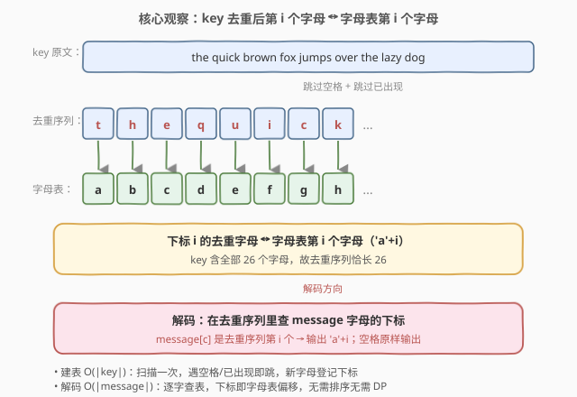
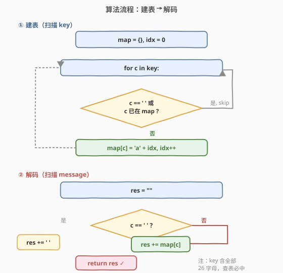
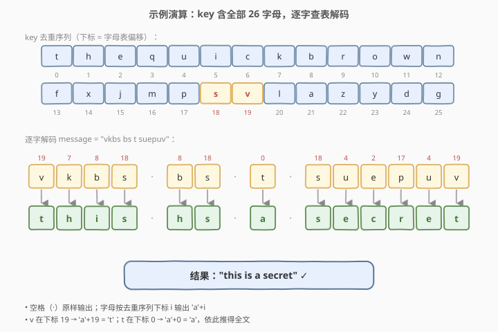

# 解密消息

- **题目名称**：解密消息
- **链接**：[2325. 解密消息](https://leetcode.cn/problems/decode-the-message/)
- **难度**：简单
- **标签**：哈希表、字符串、模拟

## 1. 题目概述

给定字符串 `key`（加密密钥）和 `message`（加密消息），二者只含小写英文字母和空格。`key` **保证包含 `a`–`z` 每个字母至少一次**。解密规则：

1. 取 `key` 中 **26 个小写字母首次出现的顺序**，作为替换表的「字母顺序」；
2. 将该顺序与普通字母表 `a, b, c, …, z` **对齐**：第 $i$ 个（$0$ 起的下标 $i$）首次出现的字母对应 `'a' + i`；
3. 按 `message` 中每个字母在替换表里的位置，替换为对应的字母表字母；
4. 空格 `' '` 保持不变。

> 💡 简言之：`key` 去重后的第 $i$ 个字母 $\leftrightarrow$ 字母表第 $i$ 个字母（`'a'+i`）。解码时，`message` 的每个字母查「它在去重序列里的下标 $i$」，输出 `'a'+i`。

**示例 1**：

```text
输入：key = "the quick brown fox jumps over the lazy dog", message = "vkbs bs t suepuv"
输出："this is a secret"
解释：去重序列 t,h,e,q,u,i,c,k,b,r,o,w,n,f,x,j,m,p,s,v,l,a,z,y,d,g
      v 在下标 19 → 't'；k 在下标 7 → 'h'；b 在下标 8 → 'i'；s 在下标 18 → 's' …… 全文解出 "this is a secret"。
```

**示例 2**：

```text
输入：key = "eljuxhpwnyrdgtqkviszcfmabo", message = "zwx hnfx lqantp mnoeius ycgk vcnjrdb"
输出："the five boxing wizards jump quickly"
解释：key 本身即 26 个互异字母，去重序列就是它本身。
      z 在下标 19 → 't'；w 在下标 7 → 'h'；x 在下标 4 → 'e' → "the" …… 全文解出 "the five boxing wizards jump quickly"。
```

**约束条件**：

- $26 \le \text{key.length} \le 2000$
- `key` 由小写英文字母及 `' '` 组成，且包含 `'a'` 到 `'z'` 每个字母**至少一次**
- $1 \le \text{message.length} \le 2000$
- `message` 由小写英文字母和 `' '` 组成

> ⚠️ 关键信号：字母表只有 26 个、`key` 又必含全部 26 个字母——这意味着去重序列**长度恒为 26**，映射表是 $O(1)$ 大小的双射。这是一道纯粹的「**建表 + 查表**」题，没有任何搜索/DP 成分。

---

## 2. 解题思路

### 2.1 暴力思路：每次扫描 key 找下标

最直白的做法是：对 `message` 的每个字母 $c$，从头扫描 `key` 找到 $c$ 的首次出现位置，统计其前出现过的「不同字母数」即为下标 $i$，再输出 `'a'+i`。该法每次查询 $O(|\text{key}|)$，整体 $O(|\text{message}|\cdot|\text{key}|)$，最坏约 $2000\times2000=4\times10^6$，能 AC 但**重复劳动严重**——同一个字母的映射在整条消息中要被反复计算。

> ⚠️ 暴力能过 ≠ 正确解法。映射表只建一次即可复用，把「重复扫描」压缩成「一次建表 + $O(1)$ 查表」才是本题的正解骨架。

### 2.2 核心观察：去重序列 ↔ 字母表（建表即映射）



把 `key` 的空格丢弃、重复字母只留首次出现，得到一条长度恰为 $26$ 的「去重序列」$D$。它与字母表逐位对齐：

$$
D[i] \;\leftrightarrow\; \text{字母表的第 } i \text{ 个字母} = \texttt{'a'} + i \qquad (i = 0,1,\dots,25)
$$

于是每个去重字母 $D[i]$ 解码为 $\texttt{'a'}+i$。我们只需在**一次扫描 `key`** 时，维护一个计数器 $\textit{idx}$（从 $0$ 起），每当遇到「未登记过」的字母，就令 $\textit{map}[c] = \texttt{'a'}+\textit{idx}$，并 $\textit{idx}\mathrel{+}=1$。

> 💡 **关键转化**：解码从「对每个字母找下标」变成「建一张 26 项的字符对照表，查询 $O(1)$」。空格不在表里，单独处理（原样输出）即可。

### 2.3 算法流程图



两阶段串联：

1. **建表**：扫描 `key`，遇 `' '` 或已登记字母就跳过；否则 $\textit{map}[c]=\texttt{'a'}+\textit{idx}$，$\textit{idx}\mathrel{+}=1$；
2. **解码**：扫描 `message`，遇 `' '` 输出 `' '`，否则输出 $\textit{map}[c]$。

### 2.4 示例演算



以示例 1 为例，去重序列 $D=\text{thequickbrownfoxjumpsv...}$（共 26 个字母），按位置编号 $0\dots25$。`message = "vkbs bs t suepuv"` 逐字解码：

| message | $D$ 中下标 | 输出 |
|---------|-----------|------|
| `v` | $19$ | `t` |
| `k` | $7$ | `h` |
| `b` | $8$ | `i` |
| `s` | $18$ | `s` |
| ` ` | — | ` ` |
| `b` | $8$ | `h` |
| `s` | $18$ | `s` |
| ` ` | — | ` ` |
| `t` | $0$ | `a` |
| ` ` | — | ` ` |
| `s u e p u v` | $18,4,2,17,4,19$ | `s e c r e t` |

合起来即 `"this is a secret"`。

> 💡 注意 `t` 在下标 $0$ → 输出 `'a'`；`v` 在下标 $19$ → 输出 `'a'+19='t'`。下标即字母表偏移，无需任何额外运算。

---

## 3. 参考代码

### C++

```cpp
class Solution {
public:
    string decodeMessage(string key, string message) {
        char cur = 'a';
        unordered_map<char, char> mp;
        for (char c : key) {
            if (c != ' ' && !mp.count(c)) {
                mp[c] = cur++;
            }
        }
        string res;
        for (char c : message) {
            res.push_back(c == ' ' ? ' ' : mp[c]);
        }
        return res;
    }
};
```

> 💡 `cur` 从 `'a'` 起、每次登记后自增，天然保证第 $i$ 个登记字母映射到 `'a'+i`。由于 `key` 含全部 26 个字母，循环结束时 `cur` 恰为 `'z'+1`，所有 `message` 字母查询必中、不会访问空表项。

### Python

```python
class Solution:
    def decodeMessage(self, key: str, message: str) -> str:
        mp = {}
        idx = 0
        for c in key:
            if c != ' ' and c not in mp:
                mp[c] = chr(ord('a') + idx)
                idx += 1
        return ''.join(' ' if c == ' ' else mp[c] for c in message)
```

> ⚠️ Python 用 `chr(ord('a') + idx)` 显式构造目标字母，比维护一个 `cur` 字符更不易出错（避免对字符做算术后忘记转回 `chr`）。`c not in mp` 在首次登记时为真，去重逻辑自洽。

---

## 4. 复杂度分析

| 维度 | 复杂度 | 说明 |
|------|--------|------|
| **时间复杂度** | $O(|\text{key}| + |\text{message}|)$ | 建表扫一遍 `key`、解码扫一遍 `message`，哈希插入/查询均摊 $O(1)$ |
| **空间复杂度** | $O(|\Sigma|) = O(1)$ | 映射表至多 26 项，与输入规模无关（字母表大小为常数 $26$） |
| 对照：暴力查下标 | $O(|\text{message}|\cdot|\text{key}|)$ / $O(1)$ | 每个字母重扫 `key`，重复劳动；建表法把重复查询摊成一次性建表 |

> 💡 严格说空间是 $O(1)$：映射表大小被字母表常数 $|\Sigma|=26$ 封顶。即便 `key`、`message` 各长达 $2000$，额外空间仍是 26 项。

---

## 5. 扩展：数组代替哈希表

字母表只有 26 个小写字母，可用定长数组 `to[26]` 取代哈希表，消除哈希常数并显式区分「未登记」。用 `seen[26]` 布尔数组记录是否首次出现，或用一个 `valid[26]` 标记：

```cpp
// 数组版：消除哈希常数，空间严格 O(1)（26 项定长）
class Solution {
public:
    string decodeMessage(string key, string message) {
        char to[26];
        bool seen[26] = {false};
        char cur = 'a';
        for (char c : key) {
            if (c != ' ' && !seen[c - 'a']) {
                seen[c - 'a'] = true;
                to[c - 'a'] = cur++;
            }
        }
        string res;
        for (char c : message) {
            res.push_back(c == ' ' ? ' ' : to[c - 'a']);
        }
        return res;
    }
};
```

> 💡 因为 `key` 含全部 26 字母，循环结束后 `to[*]` 全部填充完毕，解码阶段 `to[c-'a']` 必然合法、无需再查 `seen`。若题目弱化「保证含全 26 字母」，则解码前需对未登记字母做兜底处理。

---

## 6. 面试要点

1. **映射的方向是什么？为什么 `message` 字母查下标而非反过来？**

   - 题目规定 `key` 去重序列与字母表逐位对齐：去重序列第 $i$ 个字母对应 `'a'+i`。
   - `message` 是「用 key 字母书写」的密文，故每个字母要先在去重序列里定位（查下标 $i$），再输出 `'a'+i`。
   - 若反向理解成「字母表字母 → key 字母」，则会把解码当成编码做反了方向，得到无意义结果。

2. **为什么 `key` 一定要含全部 26 个字母？这条保证带来什么简化？**

   - 它保证去重序列长度恰为 26，是字母表到 key 字母的**双射**。
   - 因此 `message` 中任一字母都必能在表中查到，解码阶段无需处理「未登记字母」的兜底；建表结束后计数器必然走到 $26$，可作自检。
   - 若去掉该保证，则 `message` 可能含表外字母，需定义兜底策略（报错/原样保留等）。

3. **去重时遇到空格为什么要跳过？遇到已登记字母又如何处理？**

   - 空格不是「字母」，不进入替换表；它只在 `message` 中被原样保留，`key` 里的空格纯粹是分隔。
   - 已登记字母再次出现时「首次出现位置」不变，跳过即可保证下标 $i$ 与字母表严格对齐；若重复登记会覆盖旧值或递增计数器，破坏一一对应。

4. **能否一次遍历同时完成建表与解码？为什么这里分两阶段？**

   - 理论上若 `message` 全部字母在 `key` 中都已先于其查询位置出现，可边建边查；但这不成立——`message` 的首字母未必在 `key` 前缀里出现过，可能尚未登记。
   - 故必须先**完整扫完 `key`** 建好表（表是 $O(1)$ 大小、建表极快），再扫 `message` 解码。两阶段各扫一遍，清晰且无竞态。

5. **空间为什么是 $O(1)$ 而非 $O(n)$？**

   - 映射表项数被字母表大小 $|\Sigma|=26$ 封顶，与 `key`、`message` 长度无关。
   - 输出字符串本身不计入辅助空间（它是题目要求返回的结果）；即便计入，也只是 $O(|\text{message}|)$，与算法额外开销无关。

> 💡 **一句话总结**：`key` 去重后的第 $i$ 个字母对应 `'a'+i`，扫一次 `key` 建 26 项对照表，再扫一次 `message` 逐字查表、空格原样输出——$O(n+m)$ 时间、$O(1)$ 额外空间的纯模拟。

---

## 7. 同类练习题

- [205. 同构字符串](https://leetcode.cn/problems/isomorphic-strings/)（[站内题解](../0001-0100/205_同构字符串.md)）：建立两字符串间字符对照表并验证双射，与本题「建字符映射表」同源，区别在它要双向校验、本题单向查表
- [290. 单词规律](https://leetcode.cn/problems/word-pattern/)（[站内题解](../0001-0100/290_单词规律.md)）：模式字符 ↔ 单词的双射映射，205 的单词级版，同为「先建对照表再验证」
- [1309. 解码字母到整数映射](https://leetcode.cn/problems/decrypt-string-from-alphabet-to-integer-mapping/)：按 `#` 标记把数字串翻译成字母，同为「按规则逐字翻译字符串」，区别在它的规则依赖前瞻一位的 `#` 标记
- [890. 查找和替换模式](https://leetcode.cn/problems/find-and-replace-pattern/)：判定能否在模式串与各串间建立一致的字符对照表，对照表思想的进阶（需保证多对一/一对一双射一致）
