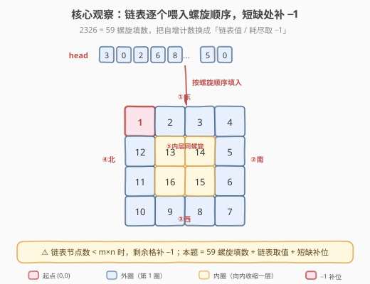
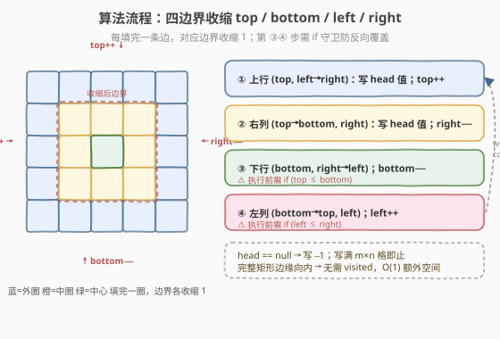
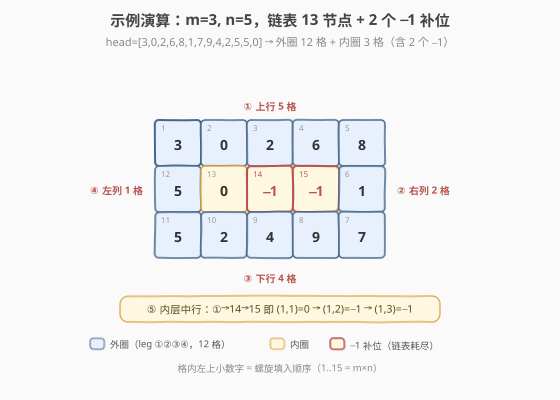

# 螺旋矩阵 IV

- **题目名称**：螺旋矩阵 IV
- **链接**：[2326. 螺旋矩阵 IV](https://leetcode.cn/problems/spiral-matrix-iv/)
- **难度**：中等
- **标签**：数组、矩阵、链表、模拟

## 1. 题目概述

给你两个整数 `m` 和 `n`，以及一个单链表的头节点 `head`。请构造一个 `m × n` 的矩阵，**从左上角 `(0,0)` 开始按顺时针螺旋顺序**逐格填入链表节点的值。若链表节点数少于 `m × n`，剩余位置用 `-1` 填充。

**示例 1**：

```text
输入：m = 3, n = 5, head = [3,0,2,6,8,1,7,9,4,2,5,5,0]
输出：[[3,0,2,6,8],[5,0,-1,-1,1],[5,2,4,9,7]]
解释：链表 13 个节点，矩阵 3×5=15 格，多出 2 格补 -1。
  螺旋顺序：顶行→(3,0,2,6,8) → 右列→(1,7) → 底行←(9,4,2,5) → 左列↑(5) → 中行→(0,-1,-1)
```

**示例 2**：

```text
输入：m = 1, n = 4, head = [0,1,2]
输出：[[0,1,2,-1]]
解释：单行矩阵，螺旋退化为从左到右；链表 3 个节点，第 4 格补 -1。
```

**约束条件**：

- `1 <= m, n <= 10^5`
- `1 <= m * n <= 10^5`
- 链表节点数在 `[1, 10^5]` 范围内
- `0 <= Node.val <= 10^5`

> ⚠️ **关键信号**：`m × n ≤ 10^5`（而非 `m, n` 各自 ≤ 10^5），说明总格数是可控的小规模；但矩阵可能极扁（如 `1 × 100000` 或 `100000 × 1`），**任何「按层循环」的实现都必须保证非目标格不被遍历**——这正是四边界收缩法的天然优势：每条 `for` 只走当前边界的格子，空区间直接跳过，绝不越界多走。

> 💡 **定位**：2326 是 [59. 螺旋矩阵 II](https://leetcode.cn/problems/spiral-matrix-ii/)（[站内题解](../0001-0100/59_螺旋矩阵II.md)）的**直接变体**——59 用自增计数 `num++` 填矩阵，2326 把「值来源」换成链表 `head`、并在链表耗尽时取 `-1`。螺旋形状与四边界模板完全一致。

---

## 2. 解题思路

### 2.1 暴力思路：方向转向 + 已访问标记

维护当前位置 `(r,c)` 与方向 `d`（右、下、左、上循环），每格填入 `head` 当前值（耗尽填 `-1`），再尝试沿 `d` 前进一步；若下一步越界或**已访问**，就顺时针转向。用 `visited` 矩阵标记已填格子。

这是最通用的螺旋模板（承接 [885. 螺旋矩阵 III](https://leetcode.cn/problems/spiral-matrix-iii/)（[站内题解](../0801-0900/885_螺旋矩阵III.md)）的方向向量法）。但 2326 是**完整矩形、从边缘向内**填数，方向向量法在此需额外 $O(m \times n)$ 的 `visited` 矩阵；而四边界收缩法无需任何标记，额外空间 $O(1)$，更省也更直观。

### 2.2 核心观察：四边界收缩（与 59 同构）



维护四个边界 `top / bottom / left / right`，每填完一条边，对应边界**向内收缩 1**，相当于「剥掉一层皮」，里层变成规模更小的同构子问题：

1. **向右**填 `top` 行（`left → right`），填完 `top++`；
2. **向下**填 `right` 列（`top → bottom`），填完 `right--`；
3. **向左**填 `bottom` 行（`right → left`），填完 `bottom--`；
4. **向上**填 `left` 列（`bottom → top`），填完 `left++`。

循环终止于 `top > bottom` 或 `left > right`。**值来源**用一个内联取值函数：链表未空取 `p.val` 并推进 `p = p.next`，否则返回 `-1`——这一行替换就把 59 的 `num++` 升级为 2326 的解。

> 💡 **关键转化**：59 → 2326 的唯一改动，是填数表达式 `matrix[i][j] = num++` 换成 `matrix[i][j] = next()`，其中 `next()` 在链表耗尽时返回 `-1`。螺旋几何完全不变，故复杂度、边界守卫、易错点也完全不变。

### 2.3 算法流程图



> ⚠️ **必须加 `if` 守卫**：第 3、4 步（向左、向上）执行前要重新检查 `top <= bottom` 和 `left <= right`。当矩阵**只剩一行或一列**（如 `1 × n` 的顶行填完后，或奇数边长的最后一层中心格）时，第 1 步已把该行填完，第 3 步若不加守卫会**反向覆盖**同一格。这与 54 / 59 的坑完全一致——只是后果从「重复读取」变成「覆盖错误」。

### 2.4 示例演算



以示例 1 为例，`(top, bottom, left, right) = (0, 2, 0, 4)`：

| 轮次 | 边 | 填入格（顺序号 → 坐标 → 值） | 边界变化 |
|------|----|------------------------------|----------|
| 1 | ① 上行 | 1→(0,0)=3, 2→(0,1)=0, 3→(0,2)=2, 4→(0,3)=6, 5→(0,4)=8 | `top: 0→1` |
| 1 | ② 右列 | 6→(1,4)=1, 7→(2,4)=7 | `right: 4→3` |
| 1 | ③ 下行 | 8→(2,3)=9, 9→(2,2)=4, 10→(2,1)=2, 11→(2,0)=5 | `bottom: 2→1` |
| 1 | ④ 左列 | 12→(1,0)=5 | `left: 0→1` |
| 2 | ① 上行 | 13→(1,1)=0, 14→(1,2)=**−1**, 15→(1,3)=**−1** | `top: 1→2` |

第 2 轮的右列/下行/左列区间皆空（守卫或自然空区间跳过），循环终止。共 15 格 = `3 × 5`，链表 13 节点用尽后第 14、15 格取 `-1`。最终矩阵：

```text
[[3,0,2,6,8],
 [5,0,-1,-1,1],
 [5,2,4,9,7]]
```

---

## 3. 参考代码

### C++

```cpp
// 螺旋矩阵IV.cpp —— 四边界收缩（59 的值来源换成链表）
// 编译: g++ -O2 -std=c++17 螺旋矩阵IV.cpp -o spiral4
/**
 * Definition for singly-linked list.
 * struct ListNode { int val; ListNode *next; ListNode() : val(0), next(nullptr) {}
 *   ListNode(int x) : val(x), next(nullptr) {}; ListNode(int x, ListNode *next) : val(x), next(next) {}; };
 */
class Solution {
  public:
    vector<vector<int>> spiralMatrix(int m, int n, ListNode* head) {
        vector<vector<int>> ans(m, vector<int>(n));
        int top = 0, bottom = m - 1, left = 0, right = n - 1;
        ListNode* p = head;
        auto next = [&]() -> int {            // 取下一个填入值：链表耗尽返回 -1
            if (p) { int v = p->val; p = p->next; return v; }
            return -1;
        };
        while (top <= bottom && left <= right) {
            for (int j = left; j <= right; ++j) ans[top][j] = next();   // ① 上行 L→R
            ++top;
            for (int i = top; i <= bottom; ++i) ans[i][right] = next();  // ② 右列 T→B
            --right;
            if (top <= bottom) {                                         // 守卫：防反向覆盖
                for (int j = right; j >= left; --j) ans[bottom][j] = next(); // ③ 下行 R→L
                --bottom;
            }
            if (left <= right) {                                         // 守卫：防反向覆盖
                for (int i = bottom; i >= top; --i) ans[i][left] = next();   // ④ 左列 B→T
                ++left;
            }
        }
        return ans;
    }
};
```

### Python

```python
# 螺旋矩阵IV.py —— 四边界收缩
# Definition for singly-linked list.
# class ListNode:
#     def __init__(self, val=0, next=None):
#         self.val = val
#         self.next = next
class Solution:
    def spiralMatrix(self, m: int, n: int, head: Optional[ListNode]) -> list[list[int]]:
        ans = [[0] * n for _ in range(m)]
        top, bottom, left, right = 0, m - 1, 0, n - 1
        p = head

        def nxt() -> int:                  # 链表耗尽返回 -1
            nonlocal p
            if p:
                v = p.val
                p = p.next
                return v
            return -1

        while top <= bottom and left <= right:
            for j in range(left, right + 1):       # ① 上行 L→R
                ans[top][j] = nxt()
            top += 1
            for i in range(top, bottom + 1):       # ② 右列 T→B
                ans[i][right] = nxt()
            right -= 1
            if top <= bottom:                       # 守卫
                for j in range(right, left - 1, -1):  # ③ 下行 R→L
                    ans[bottom][j] = nxt()
                bottom -= 1
            if left <= right:                       # 守卫
                for i in range(bottom, top - 1, -1):  # ④ 左列 B→T
                    ans[i][left] = nxt()
                left += 1
        return ans
```

> 💡 **细节**：`next`/`nxt` 用闭包捕获 `p` 并推进，**只在本题「填数」时才消费链表节点**——四边界的空区间（如 `1 × n` 的右列/下行）连循环体都不进入，不会白白吞掉链表值或错填 `-1`，所以「极扁矩阵」也安全。

---

## 4. 复杂度分析

| 维度 | 复杂度 | 说明 |
|------|--------|------|
| **时间复杂度** | $O(m \times n)$ | 每格恰好被填一次，共 $m \times n$ 次 `next()` 调用；空区间的 `for` 不进入循环体，极扁矩阵也不多走 |
| **空间复杂度** | $O(1)$ | 仅 `top/bottom/left/right` 与游标 `p` 四五个变量；输出矩阵不计入 |

> ⚠️ $m, n$ 各自可达 $10^5$，但 $m \times n \le 10^5$ 是**总格数**上界。这意味着输出矩阵本身规模可控（$10^5$ 个 int），算法 $O(m \times n)$ 在时限内绰绰有余。关键是避免任何「按 $m$、$n$ 中的大者单独分配 $O(\max(m,n))$ 标记」的写法——四边界法天然不需要。

---

## 5. 扩展：方向向量 + 转向（通用模板）

[885 题解](../0801-0900/885_螺旋矩阵III.md) 的对比表把 2326 归入「方向向量 + 转向」，是因为它**最通用**——能兼容任意形状、任意起点。但 2326 是完整矩形、从左上角边缘向内填数，四边界法更省空间（$O(1)$ vs $O(m \times n)$），故作主方法。下面给出方向向量版作为「不规则形状也能套」的兜底：

维护方向数组 `dirs = [(0,1),(1,0),(0,-1),(-1,0)]`（右、下、左、上），每格填值并标记 `seen`，再试探下一步：越界或已访问则顺时针转向 `d = (d+1) % 4`，然后前进。写满 `m × n` 格即止。

### C++

```cpp
// 方向向量 + 转向（承接 885，通用兜底版）
class Solution {
  public:
    vector<vector<int>> spiralMatrix(int m, int n, ListNode* head) {
        vector<vector<int>> ans(m, vector<int>(n));
        vector<vector<char>> seen(m, vector<char>(n, 0));
        int dirs[4][2] = {{0,1},{1,0},{0,-1},{-1,0}};  // 右 下 左 上
        int r = 0, c = 0, d = 0;
        ListNode* p = head;
        for (int k = 0; k < m * n; ++k) {
            int v = -1;
            if (p) { v = p->val; p = p->next; }
            ans[r][c] = v;
            seen[r][c] = 1;
            int nr = r + dirs[d][0], nc = c + dirs[d][1];
            if (nr < 0 || nr >= m || nc < 0 || nc >= n || seen[nr][nc])
                d = (d + 1) % 4;                       // 撞墙/已访问 → 转向
            r += dirs[d][0];
            c += dirs[d][1];
        }
        return ans;
    }
};
```

### Python

```python
class Solution:
    def spiralMatrix(self, m: int, n: int, head: Optional[ListNode]) -> list[list[int]]:
        ans = [[0] * n for _ in range(m)]
        seen = [[False] * n for _ in range(m)]
        dirs = [(0, 1), (1, 0), (0, -1), (-1, 0)]   # 右 下 左 上
        r = c = d = 0
        p = head
        for _ in range(m * n):
            v = -1
            if p:
                v = p.val
                p = p.next
            ans[r][c] = v
            seen[r][c] = True
            nr, nc = r + dirs[d][0], c + dirs[d][1]
            if not (0 <= nr < m and 0 <= nc < n) or seen[nr][nc]:
                d = (d + 1) % 4                      # 撞墙/已访问 → 转向
            r += dirs[d][0]
            c += dirs[d][1]
        return ans
```

| 维度 | 复杂度 | 说明 |
|------|--------|------|
| **时间复杂度** | $O(m \times n)$ | 恰好 $m \times n$ 次填值；转向判断 $O(1)$ |
| **空间复杂度** | $O(m \times n)$ | `seen` 矩阵标记已填，这是与四边界法的主要差距 |

> 💡 **何时选方向向量？** 当螺旋**不规整**（如 885 从内部起点向外、或要绕开某些障碍格）时，四边界的「矩形剥皮」假设失效，方向向量 + `visited` 才是正解。2326 是规整矩形，故四边界更优。

---

## 6. 面试要点

1. **2326 和 59 的区别到底是什么？**

   - 几何完全相同（都是左上角出发、顺时针、边缘向内的矩形螺旋）。唯一区别是**填入值的来源**：59 是自增计数 `num++`，2326 是链表 `p.val`，链表耗尽后取 `-1`。所以把 59 的 `matrix[i][j] = num++` 换成 `matrix[i][j] = next()`（`next` 耗尽返回 `-1`）即得 2326 解。复杂度、守卫、易错点全部继承。

2. **为什么第 3、4 步必须加 `if` 守卫？去掉会怎样？**

   - 守卫防止「反向覆盖」。例如 `1 × n`：第 1 步向右填满顶行后 `top` 变 1，第 3 步向左若不加 `if (top <= bottom)`，会在 `bottom` 行（=刚填过的第 0 行）从右到左**再写一遍**，把正确值覆盖掉。59 里是覆盖错误值，54（读取）里是重复读取同一行。守卫是「最后一行/列只走一次」的保障。

3. **链表节点比 `m × n` 多怎么办？多出来的节点要处理吗？**

   - 题目保证只填 `m × n` 格，多出的链表节点**直接忽略**——循环在 `top > bottom` 或 `left > right`（即填满）时退出，`p` 停在未消费的位置即可，无需也不应当继续遍历。反过来节点不足时，`next()` 返回 `-1` 自然补位，无需特判。

4. **极扁矩阵（如 `1 × 100000`）会不会超时或出错？**

   - 不会。四边界法第 1 步填满 `1 × 100000` 的顶行后，右列区间 `top(1)..bottom(0)` 为空、`for` 不进入循环体；第 3 步被守卫跳过。全程恰好 $10^5$ 次 `next()`，$O(m \times n)$。要点是**空区间的循环体不能执行**——若误写成「先走再判」就会多消费链表值。

5. **四边界 vs 方向向量，面试怎么选？**

   - 规整矩形边缘向内（54/59/2326）首选**四边界**：代码短、$O(1)$ 额外空间、无 `visited`。不规整螺旋（885 中心向外、或带障碍）用**方向向量 + visited**。面试可先写四边界，再口述方向向量作为「能扩展到任意形状」的通用版，体现对模板边界的理解。

> 💡 **一句话总结**：2326 = 59 螺旋填数 + 链表取值 + 短缺补 `-1`。四边界收缩 $O(m \times n)$ 时间、$O(1)$ 额外空间，守卫防反向覆盖，是完整矩形螺旋的标配。

---

## 7. 同类练习题

- [54. 螺旋矩阵](https://leetcode.cn/problems/spiral-matrix/)（[站内题解](../0001-0100/54_螺旋矩阵.md)）：从边缘**向内读取**矩阵，四边界收缩的母题；2326 是其「填数」镜像
- [59. 螺旋矩阵 II](https://leetcode.cn/problems/spiral-matrix-ii/)（[站内题解](../0001-0100/59_螺旋矩阵II.md)）：从边缘**向内填数**，2326 的直接前身——把 `num++` 换成链表取值即本题
- [885. 螺旋矩阵 III](https://leetcode.cn/problems/spiral-matrix-iii/)（[站内题解](../0801-0900/885_螺旋矩阵III.md)）：从**中心向外**扩展，方向向量 + 步长递增模板，与本题（边缘向内、四边界）形成对照
- [48. 旋转图像](https://leetcode.cn/problems/rotate-image/)：同属矩阵边界操作，练「转置 + 翻转」拆解
- [73. 矩阵置零](https://leetcode.cn/problems/set-matrix-zeroes/)：矩阵原地标记题，用首行首列做哨兵，对比本题「输出矩阵即标记」的思路
