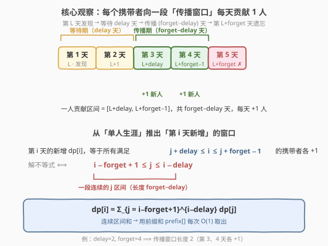
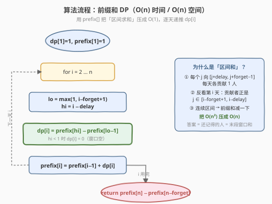
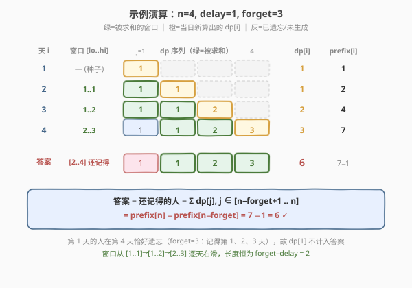

# LeetCode 知道秘密的人数 题解

## 1. 题目概述

- **标题 / 题号**：知道秘密的人数（#2327，medium）
- **链接**：https://leetcode.cn/problems/number-of-people-aware-of-a-secret/
- **难度**：中等
- **标签**：动态规划、前缀和、差分

**题意**：第 $1$ 天有一个人（记作 $A$）发现了一个秘密。每天，每个**还记得**秘密的人可以把秘密分享给**一个**新的人，但有两条时间规则：

1. **延迟分享**：一个人要在发现秘密后等满 `delay` 天才开始每天分享。即在发现后的第 `delay` 天及之后才分享。
2. **遗忘**：一个人在发现秘密 `forget` 天后忘记秘密，遗忘当天及之后**不再**分享，也不再算作「知道秘密的人」。

求第 `n` 天结束时知道秘密的人数，答案对 $10^9+7$ 取余。

**示例 1**：

```text
输入：n = 6, delay = 2, forget = 4
输出：5
解释：
第 1 天：A 发现秘密（1 人）
第 2 天：A 还在等待（1 人）
第 3 天：A 分享给 B（2 人）
第 4 天：A 分享给 C（3 人）
第 5 天：A 遗忘；B 分享给 D（3 人）
第 6 天：B 分享给 E，C 分享给 F（5 人）
```

**示例 2**：

```text
输入：n = 4, delay = 1, forget = 3
输出：6
解释：
第 1 天：A 发现（1 人）
第 2 天：A 分享给 B（2 人）
第 3 天：A、B 分别分享给 C、D（4 人）
第 4 天：A 遗忘；B、C、D 各分享 1 人（6 人）
```

**约束**：

- $2 \le n \le 1000$
- $1 \le \text{delay} < \text{forget} \le n$

> ⚠️ **关键信号**：每个携带者的「能分享」与「会遗忘」都只取决于「它是哪一天发现的」这一单一时间锚点 $L$。不同 $L$ 之间互不干扰，各自独立地向未来若干天贡献新感染——这是典型的**按天递推、贡献叠加**的结构，把「每个 $L$ 的贡献区间」求和即可，自然引出**前缀和**。

## 2. 解题思路

### 2.1 暴力思路

最朴素地按天模拟：维护「当前还记得秘密的人」集合，每天让每个还记得且等待期满的人各拉一个新人。但「还记得的人」会随遗忘而流出，实现上要把人按发现日分组。若直接按人计数，第 $i$ 天新增人数 = 当前活跃传播者数，逐一累加，时间 $O(n)$ 其实已足够——真正的难点不在暴力而在**看清贡献的结构**。

把视角从「按天看谁在传播」换成「按发现日 $L$ 看它向哪些天贡献」：一个第 $L$ 天发现的人，会在第 $L+\text{delay}, L+\text{delay}+1, \dots, L+\text{forget}-1$ 这 $\text{forget}-\text{delay}$ 天里，**每天各贡献 1 个新人**。于是「第 $i$ 天新增人数」就是所有满足该区段覆盖 $i$ 的 $L$ 之和。

### 2.2 核心观察：每个携带者的「传播窗口」是一段连续区间



设 $\text{dp}[i]$ 为第 $i$ 天**新发现**秘密的人数（注意是「当日新增」，不是当日累计）。那么：

- $\text{dp}[1] = 1$（只有 $A$ 这一个种子）。
- 对第 $i \ge 2$ 天，能向它贡献新人的携带者 $j$ 必须满足

$$j + \text{delay} \le i \le j + \text{forget} - 1$$

解这个关于 $j$ 的不等式：

$$i - \text{forget} + 1 \le j \le i - \text{delay}$$

> 💡 这是一段**长度恒为 $\text{forget}-\text{delay}$ 的连续区间**。换言之，第 $i$ 天的新增等于「窗口 $[i-\text{forget}+1,\; i-\text{delay}]$ 内所有 $\text{dp}[j]$ 之和」。窗口随 $i$ 每天向右平移一格——典型的**滑动窗口求和**，用前缀和即可 $O(1)$ 取出。

于是状态转移为：

$$\text{dp}[i] = \sum_{j=\max(1,\, i-\text{forget}+1)}^{i-\text{delay}} \text{dp}[j]$$

（当 $i-\text{delay} < 1$，即 $i \le \text{delay}$ 时窗口为空，$\text{dp}[i]=0$，对应「种子还在等待」的那几天。）

记前缀和 $\text{prefix}[i] = \sum_{k=1}^{i} \text{dp}[k]$，约定 $\text{prefix}[0]=0$，则：

$$\text{dp}[i] = \text{prefix}[i-\text{delay}] - \text{prefix}[\max(0,\, i-\text{forget})]$$

最后，第 $n$ 天**还记得**秘密的人，正是发现日 $j$ 满足 $n - j < \text{forget}$（即 $j \ge n-\text{forget}+1$）的那些人，因此答案为：

$$\text{ans} = \sum_{j=\max(1,\, n-\text{forget}+1)}^{n} \text{dp}[j] = \text{prefix}[n] - \text{prefix}[\max(0,\, n-\text{forget})]$$

### 2.3 算法流程图



### 2.4 示例演算

以示例 2（$n=4,\ \text{delay}=1,\ \text{forget}=3$）为例，逐天递推 $\text{dp}[i]$ 与 $\text{prefix}[i]$：



- $\text{dp}[1]=1$，$\text{prefix}[1]=1$；
- $i=2$：窗口 $[1,1]$，$\text{dp}[2]=\text{prefix}[1]-\text{prefix}[0]=1$，$\text{prefix}[2]=2$；
- $i=3$：窗口 $[1,2]$，$\text{dp}[3]=\text{prefix}[2]-\text{prefix}[0]=2$，$\text{prefix}[3]=4$；
- $i=4$：窗口 $[2,3]$，$\text{dp}[4]=\text{prefix}[3]-\text{prefix}[1]=3$，$\text{prefix}[4]=7$；
- 答案 $=$ 还记得的人 $=\text{dp}[2]+\text{dp}[3]+\text{dp}[4]=\text{prefix}[4]-\text{prefix}[1]=7-1=6$，与示例吻合。

注意第 $1$ 天的 $A$ 在第 $4$ 天恰好遗忘（$\text{forget}=3$：记得第 $1,2,3$ 天），故 $\text{dp}[1]$ 不计入答案——这正是答案取「末段窗口」而非全和的原因。

## 3. 参考代码

### C++

```cpp
class Solution {
public:
    int peopleAwareOfSecret(int n, int delay, int forget) {
        const int MOD = 1e9 + 7;
        vector<long long> dp(n + 1, 0), prefix(n + 1, 0);
        dp[1] = 1;                                  // 第 1 天的种子
        prefix[1] = 1;
        for (int i = 2; i <= n; ++i) {
            int lo = max(1, i - forget + 1);        // 窗口左端
            int hi = i - delay;                     // 窗口右端
            long long range = (hi >= 1)
                ? (prefix[hi] - prefix[lo - 1] + MOD) % MOD
                : 0;                                // i <= delay 时窗口为空
            dp[i] = range;
            prefix[i] = (prefix[i - 1] + dp[i]) % MOD;
        }
        int lo = max(1, n - forget + 1);            // 还记得的人的窗口
        long long ans = (prefix[n] - prefix[lo - 1] + MOD) % MOD;
        return (int)ans;
    }
};
```

### Python

```python
class Solution:
    def peopleAwareOfSecret(self, n: int, delay: int, forget: int) -> int:
        MOD = 10**9 + 7
        dp = [0] * (n + 1)
        prefix = [0] * (n + 1)          # prefix[0] = 0
        dp[1] = 1                       # 第 1 天的种子
        prefix[1] = 1
        for i in range(2, n + 1):
            lo = max(1, i - forget + 1) # 窗口左端
            hi = i - delay             # 窗口右端
            if hi >= 1:                # i <= delay 时窗口为空，dp[i] = 0
                dp[i] = (prefix[hi] - prefix[lo - 1]) % MOD
            prefix[i] = (prefix[i - 1] + dp[i]) % MOD
        lo = max(1, n - forget + 1)    # 还记得的人的窗口
        return (prefix[n] - prefix[lo - 1]) % MOD
```

> 💡 **细节**：Python 的 `%` 对负数天然返回非负结果，无需 `+MOD`；C++ 减法可能为负，需 `+MOD` 再取模。窗口右端 `hi = i - delay`，当 `i <= delay` 时 `hi < 1` 表示种子尚在等待、无人能传播，此时 `dp[i] = 0`。答案窗口左端 `max(1, n-forget+1)` 是为防止 $n < \text{forget}$ 时越界（本题 $\text{forget} \le n$，多数情况下即 $n-\text{forget}+1$）。

## 4. 复杂度分析

| 维度 | 复杂度 | 说明 |
|------|--------|------|
| 时间复杂度 | $O(n)$ | 每天一次 $O(1)$ 的前缀和区间求和，共 $n-1$ 步 |
| 空间复杂度 | $O(n)$ | $\text{dp}$ 与 $\text{prefix}$ 各 $n+1$ 个元素 |

> ⚠️ 暴力按「窗口内逐项相加」是 $O(n \cdot (\text{forget}-\text{delay}))$，最坏 $O(n^2)$；前缀和把区间和降到 $O(1)$ 是本题的关键优化。$n \le 1000$ 时 $O(n^2)$ 也能过，但前缀和版更通用、更不易写错。

## 5. 扩展：差分视角——把「区间加」摊成「一次累加」

换个等价视角：每个携带者 $L$ 向 $[L+\text{delay},\; L+\text{forget}-1]$ 这段区间**每天各 $+1$**。这是经典的**差分/区间加**模型——对差分数组 $\text{diff}$ 做 $\text{diff}[L+\text{delay}] \mathrel{+}= \text{dp}[L]$、$\text{diff}[L+\text{forget}] \mathrel{-}= \text{dp}[L]$，再前缀和还原即得每天新增。

落地到代码里，可以维护一个**滑动窗口的活跃传播者计数** $\text{sharers}$：它每天加上「今日新解锁传播的 $\text{dp}[i-\text{delay}]$」、减去「今日遗忘的 $\text{dp}[i-\text{forget}]$」，而 $\text{dp}[i]$ 恰好等于 $\text{sharers}$。

```cpp
// 差分/滑动窗口版：O(n) 时间，O(n) 空间，一次遍历
class Solution {
public:
    int peopleAwareOfSecret(int n, int delay, int forget) {
        const int MOD = 1e9 + 7;
        vector<long long> dp(n + 1, 0);
        dp[1] = 1;
        long long sharers = 0;                      // 当日活跃传播者数
        for (int i = 2; i <= n; ++i) {
            if (i - delay >= 1)  sharers = (sharers + dp[i - delay]) % MOD;  // 等待期满，加入传播
            if (i - forget >= 1) sharers = (sharers - dp[i - forget] + MOD) % MOD; // 遗忘，退出传播
            dp[i] = sharers;                        // 当日新增 = 活跃传播者数
        }
        long long ans = 0;
        for (int i = max(1, n - forget + 1); i <= n; ++i)  // 还记得的人
            ans = (ans + dp[i]) % MOD;
        return (int)ans;
    }
};
```

两种解法复杂度相同，前缀和版**从转移方程直接推导**、不易出错；差分版**贴合「加入新传播者、剔除遗忘者」的物理直觉**、一次遍历更优雅。这与「区间加 → 前缀和还原」的差分套路完全同构，参见 [1109. 航班预订统计](https://leetcode.cn/problems/corporate-flight-bookings/)（[站内题解](../1101-1200/1109_航班预订统计.md)）。

> 💡 能否更进一步降到 $O(1)$ 空间？由于答案只依赖末段窗口和，且 $\text{dp}$ 只需 $\text{forget}$ 长度的历史，可用大小为 $\text{forget}$ 的循环数组把空间压到 $O(\text{forget})$；但 $\text{forget}$ 与 $n$ 同阶，渐进仍 $O(n)$，本题无需如此。

## 6. 面试要点

1. **为什么 $\text{dp}[i]$ 定义为「当日新增」而非「当日累计」？**
   - 「当日累计」会把已遗忘的人混入，转移时还需逐个判活，难以写成简洁的区间和。「当日新增」让每个携带者的贡献区间变得**确定且连续**——一旦固定 $L$，它向哪些天贡献完全确定，叠加即得 $\text{dp}[i]$，前缀和自然出场。

2. **窗口为什么是 $[i-\text{forget}+1,\; i-\text{delay}]$？**
   - 携带者 $j$ 在 $[j+\text{delay},\; j+\text{forget}-1]$ 内每天贡献 1 人；反看第 $i$ 天，要求 $j+\text{delay} \le i \le j+\text{forget}-1$，解得 $i-\text{forget}+1 \le j \le i-\text{delay}$。窗口长度恰为 $\text{forget}-\text{delay}$，即每个人的「传播期」长度。

3. **为什么答案不是 $\text{prefix}[n]$，而是末段窗口和？**
   - $\text{prefix}[n]$ 是「历史所有新增之和」，含早已遗忘的人。第 $n$ 天还记得的人必须是 $\text{forget}$ 天内发现的，即 $j \ge n-\text{forget}+1$，故答案 $=\text{prefix}[n]-\text{prefix}[n-\text{forget}]$。示例 2 中 $\text{dp}[1]$ 在第 4 天恰好被剔除，正是这条边界的作用。

4. **前缀和版与差分版有何区别，面试讲哪个？**
   - 复杂度都是 $O(n)/O(n)$。前缀和版从转移方程 $\text{dp}[i]=\sum_{\text{window}}\text{dp}[j]$ 直接推出，**思路链最短、最不容易写错**，适合作为主解法讲清；差分版把「每人向一段区间每天 +1」抽象成区间加，**物理直觉强、一次遍历优雅**，适合作为「换个视角」的加分项，并能展示你对差分模型的熟练度。

5. **取模有哪些坑？**
   - 减法可能产生负中间值：C++ 要 `(a - b + MOD) % MOD`，Python 的 `%` 天然非负可省。前缀和本身在每步都取模，相减后值域为 $(-\text{MOD}, \text{MOD})$，加一次 `MOD` 即可纠正。差分版维护 $\text{sharers}$ 同理，减后需补 `MOD`。

## 同类练习题

| # | 题目 | 与本题的关联 |
|---|------|-------------|
| 70 | [爬楼梯](https://leetcode.cn/problems/climbing-stairs/)（[站内题解](../0001-0100/70_爬楼梯.md)） | $\text{dp}[i]=\text{dp}[i-1]+\text{dp}[i-2]$，窗口大小恒为 2 的滚动求和；本题是其「可变窗口 + 前缀和求区间和」的泛化 |
| 1137 | [第 N 个泰波那契数](https://leetcode.cn/problems/n-th-tribonacci-number/)（[站内题解](../1101-1200/1137_第N个泰波那契数.md)） | 窗口大小恒为 3 的滚动求和，承接 70；本题窗口大小 $=\text{forget}-\text{delay}$ 可变且逐天右滑 |
| 1109 | [航班预订统计](https://leetcode.cn/problems/corporate-flight-bookings/)（[站内题解](../1101-1200/1109_航班预订统计.md)） | 差分区间加经典，每个 booking 向一段区间各加若干座位、最终前缀和还原——与本题第 5 节差分视角完全同构 |
| 1094 | [拼车](https://leetcode.cn/problems/car-pooling/)（[站内题解](../1001-1100/1094_拼车.md)） | 差分同源，区间增减 + 前缀和还原容量，与「加入传播者、剔除遗忘者」一脉相承 |
| 377 | [组合总和 IV](https://leetcode.cn/problems/combination-sum-iv/)（[站内题解](../0301-0400/377_组合总和IV.md)） | 完全背包计数，每个 $\text{dp}[j]$ 向「未来金额」贡献；与本题「每个 $\text{dp}[L]$ 向未来若干天各贡献 1」的「每态向未来区间贡献」思想同源 |
