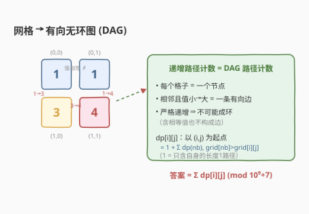
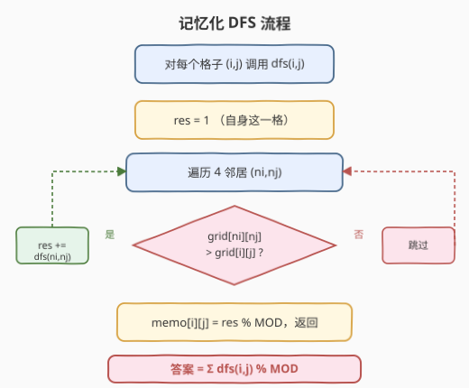
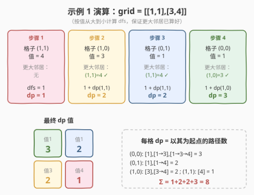

# LeetCode 网格图中递增路径的数目 题解

## 1. 题目概述

- **标题 / 题号**：网格图中递增路径的数目（#2328，hard）
- **链接**：https://leetcode.cn/problems/number-of-increasing-paths-in-a-grid/
- **难度**：困难
- **标签**：动态规划、记忆化搜索、图、拓扑排序

**题意**：给定一个 $m \times n$ 的整数网格 `grid`，可以从一个格子移动到 **4 个方向相邻**的任意一个格子。求网格中**严格递增**的路径总数——路径可从**任意**格子出发、止于**任意**格子。答案可能很大，对 $10^9+7$ 取余后返回。

> 两条路径只要访问过的格子**不完全相同**即视为不同路径（哪怕值序列相同）。

**示例 1**：

```text
输入：grid = [[1,1],[3,4]]
输出：8
解释：严格递增路径：
- 长度 1：[1], [1], [3], [4]                  → 4 条
- 长度 2：[1→3], [1→4], [3→4]                → 3 条
- 长度 3：[1→3→4]                            → 1 条
合计 4 + 3 + 1 = 8 条
```

**示例 2**：

```text
输入：grid = [[1],[2]]
输出：3
解释：长度 1：[1], [2]；长度 2：[1→2]。合计 2 + 1 = 3 条
```

**约束**：

- $m == \text{grid.length}$，$n == \text{grid}[i].\text{length}$
- $1 \le m, n \le 1000$
- $1 \le m \times n \le 10^5$
- $1 \le \text{grid}[i][j] \le 10^5$

> ⚠️ **关键信号**：「严格递增」意味着路径上**值各不相同且逐格变大**——这是一条**有向、无环**的移动关系：把每个格子看成节点、把「小值 → 相邻大值」看成有向边，整个网格就构成一个 **DAG**。求「所有递增路径总数」就是求 **DAG 上从所有节点出发的路径总数**，这是 DP-on-DAG 的招牌场景：每个子问题的答案可缓存复用，天然引出**记忆化搜索**。

> 💡 **定位**：2328 是 [329. 矩阵中的最长递增路径](https://leetcode.cn/problems/longest-increasing-path-in-a-matrix/)（[站内题解](../0301-0400/329_矩阵中的最长递增路径.md)）的**计数孪生题**——329 求「最长长度」（取 $\max$），2328 求「路径总数」（取 $\sum$），状态定义与转移方向完全同构，只是聚合算子从 $\max$ 换成 $+$。

## 2. 解题思路

### 2.1 暴力思路

最朴素的做法是**从每个格子出发做一次 DFS**，沿「值严格更大」的邻居不断深入，每深入一步就累加出一条新路径，直到走不动为止，最后把所有起点求和。

问题在于：同一条递增链会被反复探索。例如从一个小值格子出发走到极大值，沿途每个中间格子的「以它为起点的路径数」会被不同上层路径**重复计算**。当网格呈蛇形递增链时，子问题重叠呈指数级，朴素 DFS 退化为 $O(4^{mn})$，必然超时。

> 💡 **关键卡点**：朴素 DFS 之所以爆炸，是因为「从 $(i,j)$ 出发的递增路径数」**与到达该格的历史无关**——无论从哪条路走到 $(i,j)$，它之后能延伸出的递增路径数都是固定的。这正是**无后效性**，意味着每格的结果可缓存、复用，即**记忆化搜索**。

### 2.2 核心观察：网格是 DAG，路径计数 = DP-on-DAG



定义状态：

$$\text{dp}(i,j) = \text{以 } (i,j) \text{ 为起点的严格递增路径数}$$

只朝**值更大**的邻居递归，于是：

$$\text{dp}(i,j) = 1 + \sum_{\substack{(ni,nj) \text{ 是四邻居} \\ \text{grid}[ni][nj] > \text{grid}[i][j]}} \text{dp}(ni,nj)$$

- 式中的 $1$ 表示「只含 $(i,j)$ 自身这一格」的长度为 $1$ 的路径——它是**每条递归分支的基底**，对应示例中长度为 1 的那些路径。
- 求和项表示把「先走到某个更大邻居 $(ni,nj)$，再从那里继续延伸的所有路径」全部接上 $(i,j)$ 作为前缀——因为 $(i,j)$ 的值严格更小，接到任意一条以 $(ni,nj)$ 开头的递增路径前面都仍严格递增，**无遗漏也无重复**。

> ⚠️ **为什么一定无环？** 路径上值必须**严格递增**，每走一步值就变大；有环意味着回到原值，矛盾。故递归天然终止，不会死循环。相等值也**不构成边**（严格大于），所以同值格子互不影响，处理顺序无所谓。

最终答案为所有格子作为起点的路径数之和：

$$\text{ans} = \sum_{i,j} \text{dp}(i,j) \bmod (10^9+7)$$

### 2.3 算法流程图



> 💡 **递归方向**：从 $(i,j)$ 出发，**只朝更大的邻居**递归。由于值严格递增，递归链长度不超过「不同值的个数」，天然有底。每格算一次后写入 `memo`，后续被任意上层格子引用时直接 $O(1)$ 取回——这是「记忆化」把指数暴力压到多项式的关键。

### 2.4 示例演算

以示例 1（`grid = [[1,1],[3,4]]`）为例，**按值从大到小**逐格计算 $\text{dp}$（保证递归到的更大邻居已经算好）：



| 步骤 | 格子 (值) | 更大的邻居 | 计算 | dp |
|------|-----------|-----------|------|----|
| 1 | (1,1) 价值 4 | 无 | $1$ | $1$ |
| 2 | (1,0) 价值 3 | (1,1)=4 | $1 + \text{dp}(1,1) = 1+1$ | $2$ |
| 3 | (0,1) 价值 1 | (1,1)=4 | $1 + \text{dp}(1,1) = 1+1$ | $2$ |
| 4 | (0,0) 价值 1 | (1,0)=3 | $1 + \text{dp}(1,0) = 1+2$ | $3$ |

- $(0,0)$ 的右邻居 $(0,1)$ 值同为 $1$，**不严格更大**，不计入求和——这正是「相等不构成边」的体现。
- 答案 $= \text{dp}(1,1)+\text{dp}(1,0)+\text{dp}(0,1)+\text{dp}(0,0) = 1+2+2+3 = 8$，与示例吻合。

## 3. 参考代码

### C++

```cpp
class Solution {
public:
    int countPaths(vector<vector<int>>& grid) {
        const int MOD = 1e9 + 7;
        int m = grid.size(), n = grid[0].size();
        vector<vector<long long>> dp(m, vector<long long>(n, -1));   // -1 表示未算
        int dr[4] = {-1, 1, 0, 0}, dc[4] = {0, 0, -1, 1};

        function<long long(int, int)> dfs = [&](int i, int j) -> long long {
            if (dp[i][j] != -1) return dp[i][j];                     // 记忆化命中
            long long res = 1;                                       // 自身这一格
            for (int k = 0; k < 4; ++k) {
                int ni = i + dr[k], nj = j + dc[k];
                if (ni >= 0 && ni < m && nj >= 0 && nj < n &&
                    grid[ni][nj] > grid[i][j])                       // 只朝更大邻居
                    res = (res + dfs(ni, nj)) % MOD;
            }
            return dp[i][j] = res;                                   // 写入记忆
        };

        long long ans = 0;
        for (int i = 0; i < m; ++i)
            for (int j = 0; j < n; ++j)
                ans = (ans + dfs(i, j)) % MOD;
        return (int)ans;
    }
};
```

### Python

```python
import sys
from functools import lru_cache

class Solution:
    def countPaths(self, grid: List[List[int]]) -> int:
        MOD = 10**9 + 7
        m, n = len(grid), len(grid[0])
        # 最坏情况递归深度可达 m*n，抬高递归上限以防栈溢出
        sys.setrecursionlimit(max(sys.getrecursionlimit(), m * n + 10))
        DIRS = ((-1, 0), (1, 0), (0, -1), (0, 1))

        @lru_cache(None)
        def dfs(i: int, j: int) -> int:
            res = 1                                  # 自身这一格
            for dr, dc in DIRS:
                ni, nj = i + dr, j + dc
                if 0 <= ni < m and 0 <= nj < n and grid[ni][nj] > grid[i][j]:
                    res += dfs(ni, nj)
            return res % MOD

        ans = 0
        for i in range(m):
            for j in range(n):
                ans = (ans + dfs(i, j)) % MOD
        return ans
```

> 💡 **细节**：`dp[i][j]` 用 `-1` 表示未算（路径数至少为 $1$，不会与有效值混淆）；递归时**先判邻居更大再进入**，相等与更小一律跳过，天然处理了「相等不构成边」。取模在每个累加点进行，避免大数相加溢出；C++ 用 `long long` 承载累加，Python 大整数天然不溢出、`%` 对负数也无影响（本题全是加法，不会出现负值）。

> ⚠️ **递归深度**：当网格是一条蛇形递增链（如 $1,2,3,\dots,mn$）时，递归深度可达 $m \times n \le 10^5$。C++ 默认栈深度通常足够；Python 默认上限仅 $1000$，**必须 `setrecursionlimit`**，否则 `RecursionError`。若环境对栈深度敏感，改用第 5 节的迭代版更稳妥。

## 4. 复杂度分析

| 维度 | 复杂度 | 说明 |
|------|--------|------|
| 时间复杂度 | $O(m \times n)$ | 每格恰计算一次（记忆化命中后 $O(1)$），每格最多看 $4$ 个邻居，共 $O(4mn) = O(mn)$ |
| 空间复杂度 | $O(m \times n)$ | `dp`/`memo` 表 $m \times n$；递归栈深最坏 $O(mn)$（蛇形链） |

> ⚠️ 暴力无记忆化的 DFS 是 $O(4^{mn})$ 级别（每格 4 分支、无剪枝）；记忆化把「每格只算一次」锁死，复杂度与格子总数同阶。$m \times n \le 10^5$，$O(mn)$ 在时限内绰绰有余。

## 5. 扩展：迭代版——按值排序做拓扑 DP

记忆化 DFS 直观但依赖递归栈。把视角从「自顶向下递归」换成「自底向上递推」，可得到**无递归**的迭代版：把所有格子按值**升序**排好，从小到大处理——处理 $(i,j)$ 时，所有更小的邻居都已就绪，直接累加即可。

这里把状态换成「以 $(i,j)$ 为**终点**」的路径数，方向更贴合升序处理：

$$\text{dp}[i][j] = 1 + \sum_{\substack{(ni,nj) \text{ 邻居} \\ \text{grid}[ni][nj] < \text{grid}[i][j]}} \text{dp}[ni][nj]$$

### C++

```cpp
// 迭代版：按值升序处理，dp[i][j] = 以 (i,j) 为终点的递增路径数
class Solution {
public:
    int countPaths(vector<vector<int>>& grid) {
        const int MOD = 1e9 + 7;
        int m = grid.size(), n = grid[0].size();
        vector<pair<int, int>> cells;
        cells.reserve(m * n);
        for (int i = 0; i < m; ++i)
            for (int j = 0; j < n; ++j)
                cells.push_back({i, j});
        sort(cells.begin(), cells.end(), [&](const auto& a, const auto& b) {
            return grid[a.first][a.second] < grid[b.first][b.second];
        });
        vector<vector<long long>> dp(m, vector<long long>(n, 1));   // 每格自身算 1 条
        int dr[4] = {-1, 1, 0, 0}, dc[4] = {0, 0, -1, 1};
        long long ans = 0;
        for (auto& [i, j] : cells) {
            for (int k = 0; k < 4; ++k) {
                int ni = i + dr[k], nj = j + dc[k];
                if (ni >= 0 && ni < m && nj >= 0 && nj < n &&
                    grid[ni][nj] < grid[i][j])                      // 更小邻居已算好
                    dp[i][j] = (dp[i][j] + dp[ni][nj]) % MOD;
            }
            ans = (ans + dp[i][j]) % MOD;
        }
        return (int)ans;
    }
};
```

### Python

```python
class Solution:
    def countPaths(self, grid: List[List[int]]) -> int:
        MOD = 10**9 + 7
        m, n = len(grid), len(grid[0])
        cells = [(i, j) for i in range(m) for j in range(n)]
        cells.sort(key=lambda p: grid[p[0]][p[1]])
        dp = [[1] * n for _ in range(m)]          # 每格自身算 1 条
        DIRS = ((-1, 0), (1, 0), (0, -1), (0, 1))
        ans = 0
        for i, j in cells:
            for dr, dc in DIRS:
                ni, nj = i + dr, j + dc
                if 0 <= ni < m and 0 <= nj < n and grid[ni][nj] < grid[i][j]:
                    dp[i][j] += dp[ni][nj]
            dp[i][j] %= MOD
            ans = (ans + dp[i][j]) % MOD
        return ans
```

| 维度 | 复杂度 | 说明 |
|------|--------|------|
| 时间复杂度 | $O(mn \log(mn))$ | 排序占主导；若用桶排（值域 $\le 10^5$）可降到 $O(mn + V)$ |
| 空间复杂度 | $O(m \times n)$ | `dp` 表 + 排序用的格子列表，无递归栈 |

> 💡 **两版对照**：记忆化 DFS **思路最短、最贴近自然语言描述**，适合作为主解法；迭代版**无递归栈风险**、对 Python 更友好，且把「按值升序」与「拓扑序」的等价关系点破——DAG 的拓扑序正是「按值排序」。由于「严格大于」保证了相等值不连边，相等值之间的先后顺序无所谓，普通 `sort` 即等价于拓扑排序。

> ⚠️ 能否压到 $O(1)$ 额外空间？不能。每格的答案需被多个上层格子引用，必须保留整张 `dp` 表，故空间下界为 $\Omega(mn)$。

## 6. 面试要点

1. **为什么「严格递增」能保证无环、能放心记忆化？**
   - 每走一步值**严格变大**，若回到曾访问的格子则值必先变大再变小，与「单调增大」矛盾。故路径上值各不相同、长度不超过不同值个数，递归天然有底，不会死循环。相等值不构成边，同样不会在等值格之间打转。

2. **状态定义为「以 $(i,j)$ 为起点」还是「为终点」有何区别？**
   - 二者对称等价，最终求和都是总路径数。「为起点」自然写成**记忆化 DFS**（从 $(i,j)$ 递归到更大邻居）；「为终点」自然写成**升序迭代 DP**（从小值格子累加到当前）。面试讲 DFS 版更直观，口述「换成升序即得迭代版」即可体现双向理解。

3. **为什么答案要 $+1$（每格的基底 $1$）？**
   - $1$ 对应「只取 $(i,j)$ 自身一格」的长度为 $1$ 的路径。它是递归基底：没有更大邻居时 $\text{dp}=1$；有更大邻居时把「先迈一步到邻居再延伸」的所有路径接上自身作前缀，再加回自身这条单格路径。若漏掉这个 $1$，所有长度为 $1$ 的路径全丢失，示例 1 会得到 $4$ 而非 $8$。

4. **记忆化 DFS 与迭代 DP 复杂度相同吗？怎么选？**
   - 都是 $O(mn)$ 时间、$O(mn)$ 空间（迭代版多一个 $O(mn\log mn)$ 的排序）。DFS 思路最短、最易讲清；迭代版**无递归栈**，对 Python（默认栈浅）和大网格更稳。面试可先写 DFS，再提「按值排序即拓扑序」给出迭代版作为避免栈溢出的工程改进。

5. **取模要注意什么？相等值的处理有什么坑？**
   - 全是加法，逐项 `% MOD` 即可，C++ 用 `long long` 承载、相加后取模；Python 大整数无需担心溢出，最后取模也行（中途取模更省内存）。相等值**严格大于不成立**，故不进入求和——绝不能写成 `>=`，否则会把等值格互相连边、引入成环风险并重复计数。

## 同类练习题

| # | 题目 | 与本题的关联 |
|---|------|-------------|
| 329 | [矩阵中的最长递增路径](https://leetcode.cn/problems/longest-increasing-path-in-a-matrix/)（[站内题解](../0301-0400/329_矩阵中的最长递增路径.md)） | 2328 的**孪生题**，状态与转移方向完全同构，只把聚合算子从 $\sum$ 换成 $\max$（求最长长度而非总数）；DAG + 记忆化的母题 |
| 62 | [不同路径](https://leetcode.cn/problems/unique-paths/)（[站内题解](../0001-0100/62_不同路径.md)） | 网格计数 DP 入门，固定右/下方向；本题是其「方向由值大小动态决定、需记忆化」的泛化 |
| 64 | [最小路径和](https://leetcode.cn/problems/minimum-path-sum/)（[站内题解](../0001-0100/64_最小路径和.md)） | 网格 DP 求最值，对照本题「求路径总数」的计数型变体 |
| 300 | [最长递增子序列](https://leetcode.cn/problems/longest-increasing-subsequence/) | 一维版「严格递增 + DP 计数/求长」，把「网格邻居」退化成「数组后继」即得，承接 329/2328 的递增家族 |
| 509 | [斐波那契数](https://leetcode.cn/problems/fibonacci-number/)（[站内题解](../0501-0600/509_斐波那契数.md)） | 最朴素的「每态向未来求和贡献」DP，`dp[i]=dp[i-1]+dp[i-2]`；本题转移 `dp[i][j]=1+Σdp[更大邻居]` 是其在网格图上的计数推广 |
