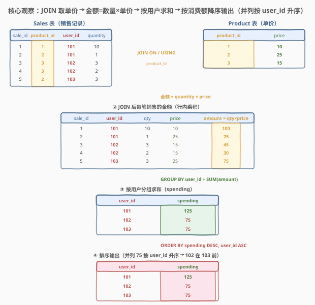
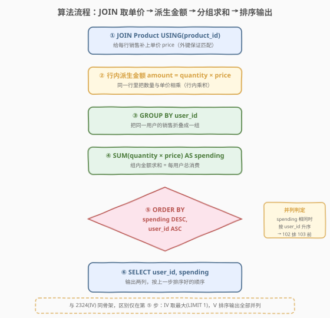
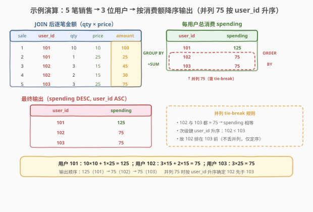

# LeetCode 产品销售分析 V 题解

## 1. 题目概述

- **标题 / 题号**：产品销售分析 V（#2329，easy）
- **链接**：https://leetcode.cn/problems/product-sales-analysis-v/
- **难度**：简单
- **标签**：数据库、SQL、`JOIN`、`USING`、`GROUP BY`、`SUM`、聚合派生度量、`ORDER BY` 多列排序、并列 tie-break、LeetCode 锁题

**题意**：给定 `Sales` 表（销售记录，含购买者 `user_id` 与数量 `quantity`）与 `Product` 表（产品单价 `price`），编写 SQL 查询，返回**每个用户的消费额** `spending`，其中某用户的消费额为该用户所有销售金额（$\text{quantity} \times \text{price}$）之和。结果按 `spending` **递减**排序；**消费额相等时**按 `user_id` **递增**排序。

**表结构**：

```text
表：Sales
+-------------+-------+
| 列名        | 类型  |
+-------------+-------+
| sale_id     | int   |  ← 主键（唯一值）
| product_id  | int   |  ← 外键 → Product.product_id
| user_id     | int   |
| quantity    | int   |
+-------------+-------+
sale_id 包含唯一值。
product_id 是 Product 表的外键。
每行表示某 user_id 购买了 quantity 件 product_id 产品。

表：Product
+-------------+------+
| 列名        | 类型 |
+-------------+------+
| product_id  | int  |  ← 主键（唯一值）
| price       | int  |
+-------------+------+
product_id 包含唯一值。
每行表示一种产品的单价（按每单位计）。
```

> ⚠️ **锁题说明**：2329 为 LeetCode **Plus 会员专享题**，题目正文不公开。本篇题解依据官方公开的样例测试用例（表结构 `Sales(sale_id, product_id, user_id, quantity)` 与 `Product(product_id, price)`，以及下方示例数据）复原题意、样例与约束；输出列以官方样例为准（返回 `user_id`、`spending` 两列，按 `spending` 降序、`user_id` 升序排列）。本表的 schema 与 1068–1070 系列不同：**无 `year`、无 `product_name`**，`Product` 表改为存**单价 `price`**，`Sales` 表多了**购买者 `user_id`**——与 2324(IV) **完全相同**：IV 取「消费最高者一人」，Ⅴ 取「全部用户的消费额并按规则排序」。

**示例 1**：

```text
输入：
Sales 表：
+---------+------------+---------+----------+
| sale_id | product_id | user_id | quantity |
+---------+------------+---------+----------+
| 1       | 1          | 101     | 10       |
| 2       | 2          | 101     | 1        |
| 3       | 3          | 102     | 3        |
| 4       | 3          | 102     | 2        |
| 5       | 2          | 103     | 3        |
+---------+------------+---------+----------+
Product 表：
+------------+-------+
| product_id | price |
+------------+-------+
| 1          | 10    |
| 2          | 25    |
| 3          | 15    |
+------------+-------+

输出：
+---------+----------+
| user_id | spending |
+---------+----------+
| 101     | 125      |
| 102     | 75       |
| 103     | 75       |
+---------+----------+

解释：
用户 101 的消费额 = 10×10 + 1×25 = 125
用户 102 的消费额 = 3×15 + 2×15 = 75
用户 103 的消费额 = 3×25 = 75
用户 101 排最前；用户 102 与 103 消费额相同，按 user_id 升序，102 排在 103 前。
```

**约束**：

- `sale_id` 为 `Sales` 表主键，`product_id` 为 `Product` 表主键，`Sales.product_id` 为指向 `Product` 的外键。
- 一种产品恰有一个单价（`Product` 中 `product_id` 唯一）。
- 一个用户可有多笔销售、一笔销售只属一个用户。
- `quantity`、`price` 均为正整数，故金额恒正。
- 结果返回两列 `user_id`、`spending`；先按 `spending` 降序，再按 `user_id` 升序；题目保证至少有一笔销售（结果非空）。

> 💡 **关键观察**：单价 `price` 只在 `Product` 表，数量 `quantity` 只在 `Sales` 表——要算「金额」须先把两表按 `product_id` 拼起来做**行内乘积**，再按 `user_id` **分组求和**，最后**排序输出全部**。与 2324(IV) 同骨架，区别仅在末步：IV 取最大（`LIMIT 1`/`RANK`），Ⅴ 排序输出全部并列，且**并列必须用次级键 `user_id` 定序**——这是 Ⅴ 的题眼。

## 2. 解题思路

### 2.1 暴力思路：逐行扫描累加 + 应用层排序

最直觉的过程式做法：读出 `Sales` 全表，对每行用 `product_id` 去查 `Product` 拿单价，算 `quantity × price` 累加进以 `user_id` 为键的字典；遍历完后把字典项按金额降序、`user_id` 升序排序后输出。伪代码：

```text
spent = {}                          # user_id -> 总消费
for row in Sales:
    price = lookup(Product, row.product_id)   # 取单价
    spent[row.user_id] += row.quantity * price
rows = [(u, s) for u, s in spent.items()]
rows.sort(key=lambda r: (-r[1], r[0]))         # spending 降序, user_id 升序
return rows
```

这能解决问题，但把数据库引擎擅长的**连接、分组聚合与排序**全搬到了应用层——既低效也违背 SQL 的声明式哲学。本题在 SQL 中是一条「JOIN + GROUP BY + 聚合 + ORDER BY 多列」的流水线，无需逐行循环。

### 2.2 核心观察：JOIN 取单价 → 派生金额 → 分组求和 → 多列排序输出



问题拆为四步，每一步都不可省：

| 步骤 | 操作 | 产出 |
|------|------|------|
| ① JOIN 取单价 | `Sales JOIN Product ON/USING(product_id)` | 每行多了 `price` 列（宽行） |
| ② 派生金额 | `quantity * price`（行内乘积） | 每笔销售的金额 |
| ③ 分组求和 | `GROUP BY user_id` + `SUM(quantity * price) AS spending` | 每位用户的总消费 |
| ④ 排序输出 | `ORDER BY spending DESC, user_id`（默认升序） | 全部用户按规则有序返回 |

$$\text{spending}(u) = \sum_{\text{sale} \in u}\, \text{quantity} \times \text{price}(\text{product\_id}),\quad \text{输出} = \text{sorted}_{\text{spending}\downarrow,\;\text{user\_id}\uparrow}\bigl\{(u, \text{spending}(u))\bigr\}$$

> 💡 **为什么必须 JOIN？** 单价 `price` 只存在于 `Product` 表，`Sales` 里没有「金额」列。若不 JOIN，就无法把 `quantity` 与 `price` 放到同一行做乘积。`Sales.product_id` 是外键，保证每条销售一定能匹配到一个单价——`INNER JOIN` 与 `LEFT JOIN` 此处等价（无 NULL 顾虑）。

> 💡 **`USING(product_id)` vs `ON s.product_id = p.product_id`**：当两表连接列**同名**时，`USING(列名)` 是更简洁的写法——它把同名列折叠成一列（而非 `ON` 写法的两列重复）。本题两表都有 `product_id`，故 `USING(product_id)` 最直观；若用 `ON`，`SELECT` 里引用 `product_id` 需注意二义性（用表别名限定）。

### 2.3 算法流程图



六步流水线一气呵成，唯一需要留意的「分叉」在第 ⑤ 步的 `ORDER BY`：

| 维度 | 单列 `ORDER BY spending DESC` | **多列 `ORDER BY spending DESC, user_id`** ✓ |
|------|-------------------------------|----------------------------------------------|
| **并列行为** | 排序对相同 `spending` 的相对顺序未指定（不确定） | 同额时按 `user_id` 升序，**顺序确定** |
| **是否满足题意** | ✗ 并列行顺序不可控 | ✓ 严格符合「相等时按 user_id 递增」 |
| **稳定性依赖** | 依赖 DB 排序稳定性（不可靠） | 由显式次级键保证，与稳定性无关 |

> ⚠️ **题眼即 tie-break**：样例中 102 与 103 都 `spending = 75`，**正是为了考「并列时如何定序」**。少写次级键 `user_id`，输出虽行数正确但并列两行顺序不保证（102 可能在 103 后），即被样例判错。`ORDER BY spending DESC, user_id` 中 `user_id` 默认 `ASC`，可省略，但写出来更清晰。

### 2.4 示例演算



以官方样例走一遍「JOIN 取单价 → 派生金额 → 分组求和 → 排序输出」：

| sale_id | product_id | user_id | qty | price | 金额 = qty×price |
|---------|-----------|---------|-----|-------|------------------|
| 1 | 1 | 101 | 10 | 10 | 100 |
| 2 | 2 | 101 | 1 | 25 | 25 |
| 3 | 3 | 102 | 3 | 15 | 45 |
| 4 | 3 | 102 | 2 | 15 | 30 |
| 5 | 2 | 103 | 3 | 25 | 75 |

- **② 派生金额**：5 笔销售各自的金额如最右列。
- **③ 分组求和**：用户 101 = $100+25=125$；用户 102 = $45+30=75$；用户 103 = $75$。
- **④ 排序输出**：`spending` 降序 → 125(101) 居首；并列 75(102)、75(103) 由 `user_id` 升序 → 102 在 103 前。

> 💡 **样例的考点在并列**：用户 102 与 103 同为 75，若只 `ORDER BY spending DESC`，二者顺序由优化器决定（可能 103 在前），即与期望输出不符。题面「消费额相等时按 `user_id` 递增」正是要求把 `user_id` 作为次级排序键——这条次级键是本题**唯一非平凡的点**，其余三步与 2324(IV) 完全同构。

## 3. 参考代码

### SQL（解法 A：JOIN + GROUP BY + ORDER BY 多列，推荐）

```sql
SELECT user_id, SUM(quantity * price) AS spending
FROM Sales
JOIN Product USING (product_id)
GROUP BY user_id
ORDER BY spending DESC, user_id;
```

> 💡 **写法要点**：
> - `JOIN Product USING (product_id)` 把单价 `price` 拼到每行销售旁——两表连接列同名故用 `USING` 最简；亦可写 `JOIN Product p ON s.product_id = p.product_id`。
> - `GROUP BY user_id` 按购买者分组；`SUM(quantity * price) AS spending` 是「行内乘积 → 组内求和」的一体聚合，命名为 `spending` 后可在 `ORDER BY` 中按别名引用。
> - `ORDER BY spending DESC, user_id`：主键 `spending` 降序；次级键 `user_id` 默认 `ASC`（升序），处理并列。这是本题**最关键的一行**。
> - **`ORDER BY` 可引用 `SELECT` 中的别名** `spending`：MySQL/PostgreSQL 等允许 `ORDER BY` 引用输出列别名（解析顺序上 `ORDER BY` 在 `SELECT` 之后）；也可写原始聚合 `ORDER BY SUM(quantity * price) DESC, user_id`。

### SQL（解法 B：显式 ON + 位置序号，对照写法）

```sql
SELECT s.user_id, SUM(s.quantity * p.price) AS spending
FROM Sales s
JOIN Product p ON s.product_id = p.product_id
GROUP BY s.user_id
ORDER BY 2 DESC, 1;
```

> 💡 **写法要点**：
> - `ON s.product_id = p.product_id` 是 `USING(product_id)` 的展开；两表连接列同名时 `USING` 更简，`ON` 配表别名更通用（连接列不同名时必须用 `ON`）。
> - `ORDER BY 2 DESC, 1` 用**输出列位置序号**：`2` = 第二列 `spending`，`1` = 第一列 `user_id`。等价于 `ORDER BY spending DESC, user_id`，是官方题解的写法——简洁但可读性略逊于列名，列多时易错位。
> - `GROUP BY` 与 `ORDER BY` 引用列时，**`SELECT` 中非聚合列必须出现在 `GROUP BY` 中**（`ONLY_FULL_GROUP_BY` 模式）：这里非聚合列只有 `user_id`，恰是分组键，合法。

### Python（pandas）

```python
import pandas as pd

def sales_analysis(sales: pd.DataFrame, product: pd.DataFrame) -> pd.DataFrame:
    merged = sales.merge(product, on='product_id')                         # ① JOIN 取单价
    merged['amount'] = merged['quantity'] * merged['price']               # ② 派生金额
    out = (merged.groupby('user_id', as_index=False)['amount']            # ③ 分组求和
                 .sum()
                 .rename(columns={'amount': 'spending'}))
    out = out.sort_values(['spending', 'user_id'], ascending=[False, True])  # ④ 排序输出
    return out.reset_index(drop=True)
```

> 💡 **pandas 对照**：
> - `merge(product, on='product_id')` 对应 `JOIN Product ON product_id`，默认 `how='inner'`。
> - `groupby('user_id')['amount'].sum()` 对应 `GROUP BY user_id` + `SUM(quantity * price)`；亦可不显式派生 `amount`，直接 `groupby('user_id').apply(lambda g: (g['quantity']*g['price']).sum())`。
> - `sort_values(['spending','user_id'], ascending=[False, True])` 对应 `ORDER BY spending DESC, user_id`——`ascending` 列表与键一一对应，`False`=降序、`True`=升序，是 pandas 版的「多列 tie-break」。
> - ⚠️ **并列语义一致**：pandas `sort_values` 默认 `kind='quicksort'`（不稳定），但因次级键 `user_id` 唯一确定顺序，结果与 SQL 的 `ORDER BY ... , user_id` 完全一致——这与 SQL「显式次级键消除对排序稳定性的依赖」同理。

## 4. 复杂度分析

| 维度 | 解法 A（USING + 列名 ORDER BY） | 解法 B（ON + 位置序号 ORDER BY） | pandas |
|------|--------------------------------|---------------------------------|--------|
| **时间** | $O(n \log n)$（排序） | $O(n \log n)$（排序） | $O(n \log n)$ |
| **空间** | $O(u)$ | $O(u)$ | $O(n)$ |
| **写法简洁度** | ✓ 列名可读 | ✓ 序号最短 | — |
| **并列处理** | ✓ 次级键 `user_id` 确定 | ✓ 次级键 `user_id` 确定 | ✓ `ascending` 列表确定 |
| **推荐度** | ✓ **通用首选** | ✓ 官方写法/对照 | ✓ 验证用 |

> - $n$ = `Sales` 表行数，$u$ = 不同 `user_id` 数（$u \le n$）。
> - **时间**：`GROUP BY` 聚合 $O(n)$ + `ORDER BY spending DESC, user_id` 排序 $O(u \log u)$，总体 $O(n \log n)$（$u$ 接近 $n$ 时）。pandas 的 `merge` $O(n)$、`groupby.sum` $O(n)$、`sort_values` $O(u \log u)$。
> - **空间**：分组聚合的哈希表 / 派生表物化为 $O(u)$；pandas 的 `merged` 宽表 $O(n)$。
> - **索引优化**：`Product(product_id)` 主键默认有索引，`JOIN` 走索引嵌套；`Sales(user_id, product_id)` 复合索引可让 `GROUP BY user_id` 走索引有序聚合，排序时若数据已按 `user_id` 有序、`spending` 仅需排序则仍需 $O(u \log u)$。

## 5. 扩展：并列排序的确定性——多列 `ORDER BY` vs 单列 + 排序稳定性

`ORDER BY spending DESC` 与 `ORDER BY spending DESC, user_id` 在「并列行」的处理上不同。关键判据是：**并列时是否要求确定的相对顺序**。

### 5.1 单列排序为何「不可靠」

| 写法 | 并列行为 | 是否确定 |
|------|---------|----------|
| `ORDER BY spending DESC` | 相同 `spending` 行的相对顺序由优化器决定 | ✗ 不确定 |
| `ORDER BY spending DESC, user_id` | 同额时按 `user_id` 升序，顺序固定 | ✓ 确定 |
| `ORDER BY spending DESC` + 依赖 DB 稳定排序 | 稳定排序保原序，但原序未定义 | ✗ 依赖隐式假设 |

> 💡 **排序稳定性（stable sort）救不了你**：即便 DB 用稳定排序，稳定性只保证「并列行保持输入顺序」——而输入顺序（`GROUP BY` 输出顺序）本身未指定。故「单列排序 + 稳定排序」仍是**传递未定义**：未定义的输入顺序经稳定排序后仍是未定义。**唯一可靠的做法是显式给出次级键**，让顺序由数据本身（`user_id`）决定，而非由隐式假设决定。这与 184「部门最高工资」并列保留要靠 `RANK`、1070「首年全行」要靠 `RANK` 同理：**凡是涉及并列，都要显式表达「并列时怎么办」**。

### 5.2 本题与 2324(IV) 的对照

| 维度 | 2324(IV) 取最大 | 2329(Ⅴ) 排序输出全部 |
|------|-----------------|----------------------|
| 末步操作 | `ORDER BY SUM(...) DESC LIMIT 1` / `RANK()=1` | `ORDER BY spending DESC, user_id` |
| 返回行数 | 1（或并列全留，视语义） | $u$（全部用户） |
| 并列处理 | `LIMIT 1` 丢并列 / `RANK` 全留 | **不丢并列**，仅用次级键定序 |
| 题眼 | 「取最大」手段选型 | 「并列 tie-break」次级键 |

> 💡 **同骨架不同末步**：IV 与 Ⅴ 前 3 步完全同构（JOIN 取单价 → 派生金额 → 分组求和），区别只在末步——IV 是「**选**」（取最值之一/全部），Ⅴ 是「**排**」（全部输出 + 定序）。记住这条「JOIN → 派生 → 聚合 → 末步」骨架，IV/Ⅴ 及所有「按维度汇总派生指标」类 SQL 题都能套用。

### 5.3 泛化到 Top-K + 并列定序

若题目改为「找消费前 K 高的用户，并列时按 `user_id` 升序」：

```sql
SELECT user_id, spending
FROM (
    SELECT user_id, SUM(quantity * price) AS spending,
           RANK() OVER (ORDER BY SUM(quantity * price) DESC, user_id ASC) AS rk
    FROM Sales JOIN Product USING (product_id)
    GROUP BY user_id
) t
WHERE rk <= K
ORDER BY rk, user_id;
```

> 💡 Top-K 场景下窗口函数 `RANK` 仍是主力：`RANK() OVER (ORDER BY spending DESC, user_id)` 把并列定序规则内嵌进排名键，`WHERE rk <= K` 取前 K 名（含并列）。注意 `RANK` 的 `ORDER BY` 子句同样**支持多列**，把 `user_id` 写进窗口排序键即等价于外层 `ORDER BY` 的 tie-break——这是「并列 + 定序 + Top-K」的标准范式。

## 6. 面试要点

1. **为什么 `ORDER BY` 要写两列？少写 `user_id` 会怎样？**

   > 少写次级键 `user_id` 时，相同 `spending` 的行的相对顺序由优化器决定，**未定义**——样例中 102/103 都为 75，可能输出成 103 在前，即与期望不符而被判错。题面「消费额相等时按 `user_id` 递增」要求把 `user_id` 作为次级排序键，让顺序由数据本身决定，而非依赖 DB 排序稳定性（稳定性只保原序，而原序未定义，是「传递未定义」）。`ORDER BY spending DESC, user_id` 中 `user_id` 默认升序可省 `ASC`，但写出来更清晰。

2. **`ORDER BY spending` 为什么能引用 `SELECT` 里的别名 `spending`？**

   > 因为 SQL 的逻辑解析顺序是 `FROM → JOIN → WHERE → GROUP BY → HAVING → SELECT → ORDER BY → LIMIT`，`ORDER BY` 在 `SELECT` 之后，故可引用 `SELECT` 中定义的输出列别名（`spending`）。这与 `GROUP BY`/`HAVING` 不同——它们在 `SELECT` 之前，多数实现**不能**引用别名（需写原始聚合 `SUM(...)`）。本题 `GROUP BY user_id`（原始列）合法；`ORDER BY spending`（别名）也合法。若想统一风格，`ORDER BY SUM(quantity * price) DESC, user_id` 亦可。

3. **`USING(product_id)` 和 `ON s.product_id = p.product_id` 有何区别？**

   > 两者都做等值连接，区别在：① **写法**——`USING(列名)` 要求两表连接列**同名**，更简洁；`ON` 配表别名通用，连接列不同名时必须用 `ON`。② **结果列**——`USING` 把同名列 `product_id` 折叠成**一列**；`ON` 写法保留两表各自的 `product_id` 两列（`SELECT` 引用时需表别名限定避免二义性）。本题两表都有 `product_id`，`USING` 最直观；若担心可移植性（部分老版本对 `USING` 支持差异），`ON` 更稳妥。

4. **`SUM(quantity * price)` 写在 `SELECT` 里合法吗？为什么要先 JOIN？**

   > 合法。`SUM(quantity * price)` 表示「对组内每行算 `quantity*price` 再求和」，等价于先派生一列金额再 `SUM`，无需物化中间列。**必须先 JOIN** 是因为单价 `price` 只在 `Product` 表，`Sales` 里没有金额列——要算「每笔销售金额 = `quantity × price`」，须先 `JOIN Product ON product_id` 把单价拼到每行，再在同行做乘积。若直接对 `Sales` 聚合（如 `SUM(quantity)`），只得到「总件数」而非「总金额」——漏掉 JOIN 就漏掉了度量核心。

5. **本题与 2324(IV) 的关系？为什么说同骨架？**

   > IV 与 Ⅴ 共享前三步骨架：`JOIN Product 取单价 → 派生金额 quantity×price → GROUP BY user_id + SUM`。区别只在末步：IV 是「**选**」（`ORDER BY SUM(...) DESC LIMIT 1` 取最大者一人，或 `RANK()=1` 并列全留），Ⅴ 是「**排**」（`ORDER BY spending DESC, user_id` 全部输出 + 次级键定序）。面试可这样答：「同一条『JOIN → 派生 → 聚合 → 末步』流水线，IV 末步是选最值、Ⅴ 末步是排序输出，Ⅴ 的题眼在并列 tie-break 的次级键 `user_id`。」

> 💡 **一句话总结**：2329 是「派生度量 + 分组求和 + 多列排序」母题——核心就一句 `SELECT user_id, SUM(quantity*price) AS spending FROM Sales JOIN Product USING(product_id) GROUP BY user_id ORDER BY spending DESC, user_id`。要点：① `price` 在 Product 表，必须 JOIN 才能算金额；② `SUM(quantity*price)` 把行内乘积与组内求和合在一体聚合；③ **并列必须用次级键 `user_id` 定序**——这是与 2324(IV)「取最大」的唯一分野，也是本题题眼。记住这条「JOIN → 派生 → 聚合 → 多列排序」流水线，所有「按维度汇总派生指标 + 排序输出」类 SQL 题都能套用。

## 同类练习题

| # | 题目 | 与本题的关联 |
|---|------|-------------|
| 2324 | [产品销售分析 IV](https://leetcode.cn/problems/product-sales-analysis-iv/)（[题解](../2301-2400/2324_产品销售分析IV.md)） | **同表同骨架的姐妹题**，`Sales`+`Product`（`price`）宇宙，前三步完全相同，IV 末步取「消费最高者一人」（`LIMIT 1`/`RANK`），Ⅴ 末步「全部用户排序输出 + tie-break」——对照「选最值」vs「排序输出」 |
| 1068 | [产品销售分析 I](https://leetcode.cn/problems/product-sales-analysis-i/)（[题解](../1001-1100/1068_产品销售分析I.md)） | 同系列 JOIN 入门题，`JOIN Product ON product_id` 取 `product_name`，是本系列起点；2329 在其 JOIN 骨架上叠加「派生金额 + 分组求和 + 排序」 |
| 1070 | [产品销售分析 III](https://leetcode.cn/problems/product-sales-analysis-iii/)（[题解](../1001-1100/1070_产品销售分析III.md)） | 同系列「分组聚合 + 取最值」骨架，`MIN(year)` 取每产品首年再 JOIN 回取明细，与 2329 同属「GROUP BY + 聚合」范式，对照 `MIN` 取最早 vs `SUM` 求总额 |
| 184 | [部门工资最高的员工](https://leetcode.cn/problems/department-highest-salary/)（[题解](../0101-0200/184_部门工资最高的员工.md)） | 分组求最值 + 并列处理母题，`MAX + IN`/`JOIN`/`RANK` 三解法取每部门最高薪者，与 2329 同样涉及「并列时如何处理」——184 用 `RANK` 全留，2329 用次级键定序，辨析两种并列范式 |
| 1831 | [每天的最大交易](https://leetcode.cn/problems/maximum-transaction-each-day/)（[题解](../1801-1900/1831_每天的最大交易.md)） | 按日分组取最大交易额对应行，**单列排序有并列、必须 `RANK` 保并列**，与 2329 的「排序 + tie-break」深度对照——辨析「保并列全留」（1831）与「并列定序」（2329）两种需求 |
