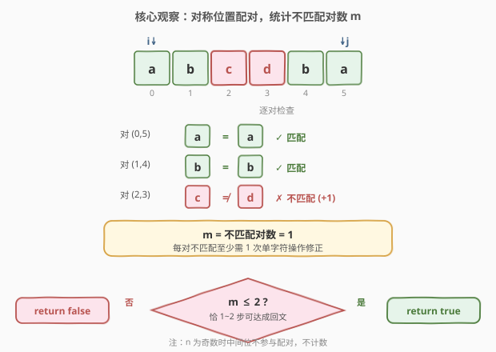
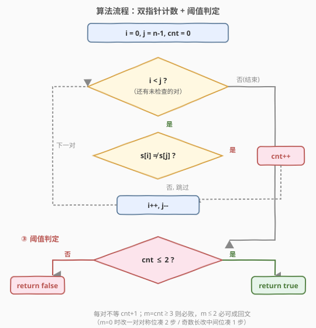
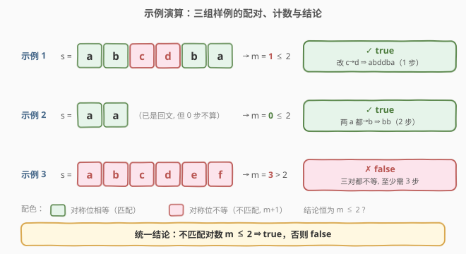

# 验证回文串 IV

- **题目名称**：验证回文串 IV
- **链接**：[2330. 验证回文串 IV](https://leetcode.cn/problems/valid-palindrome-iv/)
- **难度**：中等
- **标签**：双指针、字符串

## 1. 题目概述

给定下标从 $0$ 开始、仅含小写英文字母的字符串 $s$。**一步操作**：把 $s$ 中任意一个字符改成任意其它字符。若你能**恰执行一到两步操作**（即操作次数 $\in\{1,2\}$，$0$ 步不算）后让 $s$ 变成回文，返回 `true`，否则返回 `false`。

**示例 1**：

```text
输入：s = "abcdba"
输出：true
解释：将 s[2] 的 'c' 改成 'd' → "abddba"（回文），用了 1 步。
```

**示例 2**：

```text
输入：s = "aa"
输出：true
解释：将 s[0] 改成 'b' → "ba"；再将 s[1] 改成 'b' → "bb"（回文），用了 2 步。
```

**示例 3**：

```text
输入：s = "abcdef"
输出：false
解释：无法在两步以内将其变为回文。
```

**约束条件**：

- $1 \le \text{s.length} \le 10^5$
- $s$ 仅由小写英文字母组成

> ⚠️ **关键信号**：回文的判定只看「对称位置」$s[i]$ 与 $s[n-1-i]$ 是否相等。把串按对称对切开，整条串被拆成若干「配对」+（若 $n$ 为奇数）一个不参与配对的中间位。于是「还要改多少」直接由**不匹配的对数**决定——双指针天然登场。

---

## 2. 解题思路

### 2.1 暴力思路

$n$ 达 $10^5$，枚举「改哪两个位置、改成什么字母」是 $O(n^2\cdot 26^2)$，显然不可行。正确方向是从回文的**结构**入手，把「要改多少」**算出来**而不是「试出来」。

### 2.2 核心观察：统计不匹配对数 $m$，答案即 $m \le 2$



设 $n = |s|$，用双指针 $i=0,\ j=n-1$ 向中间靠拢，把串切成若干对称对 $(s[i], s[j])$。令

$$m = \#\{(i,j)\mid i<j,\ s[i]\ne s[j]\}$$

即**不匹配的对数**（$n$ 为奇数时中间位 $s[n/2]$ 不与任何人配对，不计数）。

**下界**：每一对不匹配的 $(s[i],s[j])$，要让它们相等，至少得改其中一个（只改一个就能跟上另一个），故操作数 $\ge m$。于是按下界分情况：

| 不匹配对数 $m$ | 能否恰用 $1\sim2$ 步达成回文 | 操作方案 |
|---|---|---|
| $m \ge 3$ | ❌ `false` | 至少需 $3$ 步 $>2$，无解 |
| $m = 2$ | ✅ `true` | 每对各改一个跟上对方，共 $2$ 步 |
| $m = 1$ | ✅ `true` | 把不匹配对的一个改成另一个，$1$ 步 |
| $m = 0$ | ✅ `true` | 见下方说明 |

**唯一的"坑"在 $m=0$**：题目要求**恰 $1\sim2$ 步，$0$ 步不算**。但 $m=0$（已是回文）时仍可做到：

- 若 $n\ge 2$：任取一对当前相等的对称位 $(s[i],s[j])$，把它们**都改成另一个字母**（如 $s[i]=s[j]=\text{a}$ 都改成 $\text{b}$），两边同步改变、仍相等 → 仍是回文，恰好 $2$ 步。示例 2 的 `"aa"→"bb"` 正是此法。
- 若 $n$ 为奇数：还可以只改**中间位** $s[n/2]$ 为任意其它字母（中间位不参与对称，改它不破坏回文），$1$ 步即可；$n=1$ 时改这唯一字符也仍是回文。

于是 $m=0$ 必为 `true`。**综上，所有情况合并为一句话**：

$$\boxed{\;\text{答案} = (\text{不匹配对数 } m \le 2)\;}$$

> 💡 **为什么"恰 $1\sim2$ 步"这个看似更强的约束没有改变答案？** 因为唯一会被它"误伤"的 $m=0$ 情形，总能用 $2$ 步（改一对对称位）或 $1$ 步（奇数长改中间位）补上；而 $m\ge3$ 本就无解。约束被完全吸收，答案退化为 $m\le2$。

### 2.3 算法流程图



### 2.4 示例演算



- **示例 1** `"abcdba"`（$n=6$）：对 $(a,a)\checkmark,\ (b,b)\checkmark,\ (c,d)\times$ → $m=1\le2$ → `true`。把 `c` 改成 `d` 得 `"abddba"`，$1$ 步。
- **示例 2** `"aa"`（$n=2$）：对 $(a,a)\checkmark$ → $m=0\le2$ → `true`。已是回文但需 $\ge1$ 步：把两个 `a` 都改成 `b` 得 `"bb"`，$2$ 步。
- **示例 3** `"abcdef"`（$n=6$）：对 $(a,f)\times,\ (b,e)\times,\ (c,d)\times$ → $m=3>2$ → `false`。

---

## 3. 参考代码

### C++

```cpp
class Solution {
public:
    bool makePalindrome(string s) {
        int cnt = 0, i = 0, j = (int)s.size() - 1;
        for (; i < j; ++i, --j) {
            cnt += s[i] != s[j];
        }
        return cnt <= 2;
    }
};
```

### Python

```python
class Solution:
    def makePalindrome(self, s: str) -> bool:
        i, j = 0, len(s) - 1
        cnt = 0
        while i < j:
            cnt += s[i] != s[j]
            i, j = i + 1, j - 1
        return cnt <= 2
```

> 💡 `cnt += s[i] != s[j]` 利用布尔到整型的隐式转换（C++ 中 `true→1`、Python 中 `True→1`），比写 `if` 更紧凑。循环条件 `i < j` 保证每对只数一次、中间位（奇数长）自动跳过。可选 `if (cnt > 2) return false;` 提前剪枝，但 $O(n)$ 已是下界、循环体极轻，意义不大。

---

## 4. 复杂度分析

| 维度 | 复杂度 | 说明 |
|------|--------|------|
| **时间复杂度** | $O(n)$ | 双指针各移动至多 $\lfloor n/2\rfloor$ 步，共 $\lfloor n/2\rfloor$ 次比较 |
| **空间复杂度** | $O(1)$ | 仅用 $i,j,\text{cnt}$ 三个标量 |

> ⚠️ 朴素地"枚举改哪两位"是 $O(n^2)$ 级；本题关键在于把「试操作」转化为「数不匹配对」，一步把平方级的搜索压成线性扫描。

---

## 5. 扩展：与回文系列 I / II / III 的递进

本题是 LeetCode 回文系列的第四题，前几题的递进值得对照：

- [125. 验证回文串](https://leetcode.cn/problems/valid-palindrome/)（I）：只判**是否**回文（忽略大小写与非字母字符），双指针 $O(n)$——本题的「配对计数」就是它的延伸：I 问"全部对都相等吗"，IV 问"有几对不等"。
- [680. 验证回文串 II](https://leetcode.cn/problems/valid-palindrome-ii/)（[站内题解](../0601-0700/680_验证回文串II.md)，II）：**最多删 1 个字符**能否成回文。遇到不匹配对时尝试删左或删右各贪心一次，$O(n)$——本题是"**改**最多 2 个字符"，每对不匹配可用 1 步修正，故只需数总数。
- [1216. 验证回文串 III](https://leetcode.cn/problems/valid-palindrome-iii/)（[站内题解](../1201-1300/1216_验证回文串III.md)，III，Plus）：**最多删 $k$ 个字符**能否成回文，等价于求 $s$ 与 $s^R$ 的最长公共子序列长度 $\ge n-k$，$O(n^2)$ DP——把"删"换成"求 LCS"。

> 💡 一句话横向对比：**I 判等、II 删 $1$、III 删 $k$（LCS）、IV 改 $1\sim2$**。II/IV 都靠"遇不配对就当场决策"的贪心：II 的决策是"删左还是删右"需分两支，而 IV 的决策是"各改一个"只需计数，故更简。

---

## 6. 面试要点

1. **为什么答案是 $m\le2$ 而非"$m\le2$ 且需特判 $m=0$"？**
   - $m=0$（已是回文）时虽不能用 $0$ 步，但可用 $2$ 步：把任意一对相等的对称位都改成另一字母（仍相等→仍回文）；奇数长还可只改中间位用 $1$ 步。故 $m=0$ 仍为 `true`，无需特判，统一并入 $m\le2$。

2. **"恰 $1\sim2$ 步"与"至多 $2$ 步"在本题结论上为何等价？**
   - "至多 $2$ 步"在 $m=0$ 时用 $0$ 步即可；"恰 $1\sim2$ 步"禁止 $0$ 步，但 $m=0$ 可改用 $1$ 或 $2$ 步补足。两者只在 $m=0$ 这一例有差别，而该例在两种规定下都为 `true`，故结论一致均为 $m\le2$。

3. **为什么不匹配对的"下界"是 $1$ 而非 $2$？**
   - 一对 $(s[i],s[j])$ 不等，只需把其中**一个**改成另一个即相等，是 $1$ 步而非 $2$ 步。若误以为要改两个，会把 $m=2$ 错算成需 $4$ 步。改两个（都改成第三字母）是 $2$ 步的"豪华"方案，仅在需要凑步数（如 $m=1$ 想用满 $2$ 步）时才用。

4. **能否在 `cnt>2` 时提前返回？**
   - 可以，`if (cnt > 2) return false;` 放循环内是合法剪枝，最坏仍 $O(n)$ 但常数更优。本题 $n\le10^5$、循环体极轻，不剪枝也轻松 AC，写与否看个人偏好。

5. **奇数长的中间位为什么不用管？**
   - 回文的定义是对所有 $i$ 有 $s[i]=s[n-1-i]$。$i=n/2$（奇数长）时 $n-1-i=i$，是自反条件 $s[i]=s[i]$，恒成立。故中间位任意取值都不影响回文性——这正是 $m=0$ 奇数长可"改中间位"$1$ 步保回文的依据。

> 💡 **一句话总结**：双指针数对称对里有多少不等（$m$），每对不等至少需 $1$ 步；$m\ge3$ 必败、$m\le2$ 必成（$m=0$ 用 $2$ 步改一对对称位补足），故答案即 $m\le2$。

---

## 7. 同类练习题

- [125. 验证回文串](https://leetcode.cn/problems/valid-palindrome/)：双指针判回文母题，"全部对相等吗"——本题把判等升级为"数有几对不等"。
- [680. 验证回文串 II](https://leetcode.cn/problems/valid-palindrome-ii/)（[站内题解](../0601-0700/680_验证回文串II.md)）：最多删 $1$ 字符成回文，遇不配对时删左/删右两支贪心；与本题"遇不配对各改一个、只计数"对照。
- [1216. 验证回文串 III](https://leetcode.cn/problems/valid-palindrome-iii/)（[站内题解](../1201-1300/1216_验证回文串III.md)）：最多删 $k$ 字符，转为 $s$ 与 $s^R$ 的 LCS，把"删"泛化为"保留最长公共子序列"。
- [9. 回文数](https://leetcode.cn/problems/palindrome-number/)（[站内题解](../0001-0100/9_回文数.md)）：数字版回文判定，同为对称配对比较，区别在不转成字符串的 $O(1)$ 空间反转一半技巧。
- [5. 最长回文子串](https://leetcode.cn/problems/longest-palindromic-substring/)（[站内题解](../0001-0100/5_最长回文子串.md)）：中心扩展法逐位向两侧配对比较，与本题双指针配对同源，只是它在"找最长"而非"判可达"。
