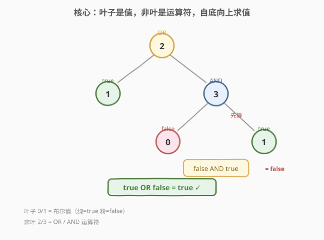
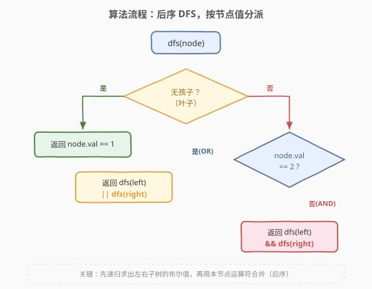
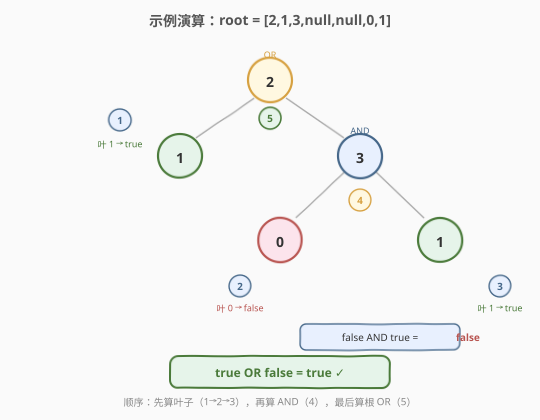

# LeetCode 计算布尔二叉树的值 题解

## 1. 题目概述

- **标题 / 题号**：计算布尔二叉树的值（#2331，easy）
- **链接**：https://leetcode.cn/problems/evaluate-boolean-binary-tree/
- **难度**：简单
- **标签**：树、深度优先搜索、二叉树、递归

**题意**：给你一棵**完整二叉树**的根 `root`，节点取值含义如下：

- **叶子节点**：值为 `0`（false）或 `1`（true）。
- **非叶子节点**：值为 `2`（逻辑或 **OR**）或 `3`（逻辑与 **AND**）。

节点的**值**递归定义：

- 叶子节点：值 = 自身布尔值。
- 非叶子节点：先算出左右孩子的值，再用本节点运算符对它们做 **OR / AND**。

返回根节点的布尔值。

> 💡 **完整二叉树**：每个节点有 `0` 或 `2` 个孩子。**叶子**即无孩子的节点；**非叶**节点恰有左右两个孩子，无需特判单边空。

**示例 1**：

```text
输入：root = [2,1,3,null,null,0,1]
输出：true
解释：AND 节点 = false AND true = false；OR 节点 = true OR false = true。
```

对应树结构（层序还原）：

```text
        2 (OR)
       / \
      1   3 (AND)
         / \
        0   1
```

**示例 2**：

```text
输入：root = [0]
输出：false
解释：根是叶子，值为 false。
```

**约束**：

- 树中节点数目在 $[1, 1000]$ 范围内。
- $0 \le \text{Node.val} \le 3$。
- 每个节点的孩子数为 `0` 或 `2`。
- 叶子节点值为 `0` 或 `1`；非叶子节点值为 `2` 或 `3`。

> 💡 **关键信号**：节点的值**只取决于子树的值与自身运算符**，与树外无关——典型的**最优子结构**（其实是最平凡的子结构）。一个**后序 DFS**，先递归左右子树拿布尔值，再用本节点运算符合并即可，无需任何额外状态。

## 2. 解题思路

### 2.1 暴力思路

题目本身就是递归定义的，所谓"暴力"即直接照题意模拟：写一个递归函数 `dfs(node)`，叶子返回 `val == 1`，非叶按 `val` 分派 OR / AND，对左右子树递归求值后合并。这其实也就是最优解——没有更"巧"的捷径可走，因为每个节点的值必须实算出来才能向上传递。

> ⚠️ 唯一容易踩的坑：**判断叶子的方式**。完整二叉树保证非叶节点有两个孩子，所以"叶子 = 无孩子"（`left == null && right == null`）是可靠的。但若直接用 `val == 0 || val == 1` 判叶子也行（因为值域分明），两种写法等价，下文代码用"无孩子"判定，语义更通用。

### 2.2 核心观察：后序 DFS，按 val 分派



把树看作一棵**表达式树**：叶子是布尔**字面量**，非叶是**运算符**。求值天然是后序遍历——**先算子树、再算本节点**：

| `node.val` | 含义 | 处理 |
|------------|------|------|
| `0` / `1`（且无孩子） | 叶子字面量 | 返回 `val == 1` |
| `2` | **OR** | `dfs(left) || dfs(right)` |
| `3` | **AND** | `dfs(left) && dfs(right)` |

> 💡 **短路价值**：`||` 左侧为真即不再算右子树，`&&` 左侧为假即不再算右子树。完整二叉树的最坏情况仍是 $O(n)$，但短路让"一侧已定结论"时省下另一侧整棵子树的递归。这是 OR / AND 天然的**惰性求值**语义，与 `2.4` 的演算顺序一致。

### 2.3 算法流程图



一句话：**先递归左右拿布尔，再用本节点 val 决定 OR 还是 AND 合并**。

### 2.4 示例演算

以示例 1 自底向上演算（编号为求值顺序）：



| 步骤 | 节点 | 类型 | 计算 | 结果 |
|------|------|------|------|------|
| 1 | 叶 `1`（OR 的左孩） | 字面量 | 叶子值 = 1 | `true` |
| 2 | 叶 `0`（AND 的左孩） | 字面量 | 叶子值 = 0 | `false` |
| 3 | 叶 `1`（AND 的右孩） | 字面量 | 叶子值 = 1 | `true` |
| 4 | `3`（AND） | 运算符 | `false AND true` | `false` |
| 5 | `2`（OR，根） | 运算符 | `true OR false` | `true` ✓ |

根返回 `true`。注意步骤 5 中 OR 的**左操作数已是 true**，按短路语义可不再算右——但此处右子树（步骤 4 的 AND）在自底向上的递归回溯中已被先算出，故短路仅体现在"左右同层时左先定则右可省"的常数优化。

## 3. 参考代码

### C++

```cpp
/**
 * Definition for a binary tree node.
 * struct TreeNode {
 *     int val;
 *     TreeNode *left;
 *     TreeNode *right;
 *     TreeNode() : val(0), left(nullptr), right(nullptr) {}
 *     TreeNode(int x) : val(x), left(nullptr), right(nullptr) {}
 *     TreeNode(int x, TreeNode *left, TreeNode *right) : val(x), left(left), right(right) {}
 * };
 */
class Solution {
public:
    bool evaluateTree(TreeNode* root) {
        // 叶子：无孩子，值即结论
        if (root->left == nullptr && root->right == nullptr) {
            return root->val == 1;
        }
        // 非叶：先递归求左右子树的布尔值
        bool l = evaluateTree(root->left);
        bool r = evaluateTree(root->right);
        if (root->val == 2) return l || r;   // OR
        return l && r;                       // AND (val == 3)
    }
};
```

### Python

```python
# Definition for a binary tree node.
# class TreeNode:
#     def __init__(self, val=0, left=None, right=None):
#         self.val = val
#         self.left = left
#         self.right = right
class Solution:
    def evaluateTree(self, root: Optional[TreeNode]) -> bool:
        # 叶子：无孩子，值即结论
        if root.left is None and root.right is None:
            return root.val == 1
        # 非叶：先递归求左右子树的布尔值
        l = self.evaluateTree(root.left)
        r = self.evaluateTree(root.right)
        if root.val == 2:
            return l or r    # OR
        return l and r       # AND (val == 3)
```

> 💡 **写法选择**：上例显式递归左右再合并，便于讲解短路。若想直接利用语言短路写成 `return dfs(left) || dfs(right)`（OR）/`&&`（AND），效果一致——短路会让右子树在"左已定论"时不被递归。两者复杂度同阶，显式版更易读、面试更易解释。

## 4. 复杂度分析

| 维度 | 复杂度 | 说明 |
|------|--------|------|
| **时间复杂度** | $O(n)$ | 最坏遍历所有节点；OR/AND 短路常能省下整棵子树，但最坏（无短路触发）仍 $O(n)$ |
| **空间复杂度** | $O(h)$ | 递归栈深度 = 树高 $h$。平衡树 $h = O(\log n)$；链状树 $h = O(n)$ |

> ⚠️ 本题 $n \le 1000$，链状树栈深最多 1000，Python 默认递归上限（通常 1000）恰好可能触线。若遇到 `RecursionError`，可 `sys.setrecursionlimit(2000)` 或改用显式栈的迭代后序遍历（见第 5 节）。

## 5. 扩展：迭代后序遍历（显式栈）

把递归栈显式化，避免栈溢出。用栈模拟后序：入栈时记 `(node, visited)` 标志，第二次弹出时（孩子已处理）执行合并。

```python
class Solution:
    def evaluateTree(self, root: Optional[TreeNode]) -> bool:
        stack = [(root, False)]
        while stack:
            node, visited = stack.pop()
            if not node.left and not node.right:        # 叶子
                continue  # 字面量在 node.val 上，由父节点合并时直接读取
            if not visited:
                stack.append((node, True))              # 标记"已访问"，待合并
                stack.append((node.right, False))
                stack.append((node.left, False))
            else:
                l = node.left.val == 1 if not node.left.left and not node.left.right else node.left.val
                r = node.right.val == 1 if not node.right.left and not node.right.right else node.right.val
                node.val = 1 if ((node.val == 2 and (l or r)) or (node.val == 3 and l and r)) else 0
        return root.val == 1
```

> 💡 上述迭代版通过"把子树结果回写到 `node.val`"复用节点空间，省去额外哈希。逻辑上等价于递归版，只是把调用栈换成了手动栈，适合面试中"能否非递归"的追问。生产中递归版可读性更佳，推荐为主。

## 6. 面试要点

1. **为什么用后序 DFS 而非前序 / 层序？**

   > 节点的值依赖子树的值——必须**先有子结果才能合并父**。这是后序（左→右→根）的天然语义。前序（根→左→右）在访问根时子树尚未求值，无法合并；层序同理。凡"表达式树求值 / 树形信息自底向上传递"都指向后序。

2. **如何判断一个节点是叶子？两种写法选哪个？**

   > 完整二叉树下，`left == null && right == null`（无孩子）与 `val == 0 || val == 1`（值域判别）等价且都正确。推荐"无孩子"判定——它不依赖"叶子值恰为 0/1"的题目约定，迁移到值域更宽的变体（如 [2313](2313_二叉树中得到结果所需的最少翻转次数.md) 的 0–5）依然成立。

3. **OR / AND 的短路在本题有何意义？**

   > `||` 左真则不算右，`&&` 左假则不算右。当一侧子树已定结论，另一侧整棵子树的递归可被跳过，常数级优化。最坏情况（短路不触发，如 OR 左恒假 / AND 左恒真）仍遍历全部 $n$ 个节点。这是"惰性求值"在树递归里的直接体现。

4. **完整二叉树的约定简化了什么？**

   > 非叶节点**必有两个孩子**，所以递归到非叶时 `left`/`right` 都非空，无需特判单边为空。若题目改为允许单孩子（如 [2313](2313_二叉树中得到结果所需的最少翻转次数.md) 的 NOT 节点只有一个孩子），则需对空孩子做 `∞`/不可达处理或判断"孩子在左还是在右"。

5. **能否把递归改成尾递归或用 DP 优化？**

   > 无需 DP——每个节点的值是唯一确定的（不是求最值/计数），没有重叠子问题可言。本题就是纯粹的"递归求值"，状态空间即每个节点一次。所谓优化只有"短路省一侧"这一层常数意义。

> 💡 **一句话总结**：2331 =「表达式树后序求值」的最简形态。叶子是布尔字面量、非叶是 OR/AND，先递归左右拿布尔、再按 `val` 合并。掌握它，再看 [2313](2313_二叉树中得到结果所需的最少翻转次数.md)（加翻转代价的树形 DP）就是从"确定值"升级到"最小代价"的自然延伸。

## 同类练习题

| # | 题目 | 与本题的关联 |
|---|------|-------------|
| 2313 | [二叉树中得到结果所需的最少翻转次数](https://leetcode.cn/problems/minimum-flips-in-binary-tree-to-get-result/) | 本题的"翻转版"进阶，同样的 0/1 叶 + 运算符结构，但求"使根评价等于 result 的最少叶翻转数"，从"确定求值"升级为"树形 DP 求最小代价"（[题解](2313_二叉树中得到结果所需的最少翻转次数.md)） |
| 112 | [路径总和](https://leetcode.cn/problems/path-sum/) | 另一棵树的简单后序 DFS 入门，"目标递减 + 叶子判等 + `\|\|` 短路"，与本题同属"树递归判定"母题（[题解](../0101-0200/112_路径总和.md)） |
| 104 | [二叉树的最大深度](https://leetcode.cn/problems/maximum-depth-of-binary-tree/) | 后序 DFS 返回子树信息向上合并的最经典入门，训练"先递归子、再合并父"的直觉（[题解](../0101-0200/104_二叉树的最大深度.md)） |
| 508 | [出现次数最多的子树元素和](https://leetcode.cn/problems/most-frequent-subtree-sum/) | 后序 DFS 把子树和向上传递 + 哈希统计，"后序求值"思想在计数场景的延伸（[题解](../0501-0600/508_出现次数最多的子树元素和.md)） |
| 145 | [二叉树的后序遍历](https://leetcode.cn/problems/binary-tree-postorder-traversal/) | 后序遍历的母题，"左→右→根"的访问序正是本题求值的执行序（[题解](../0101-0200/145_二叉树的后序遍历.md)） |
