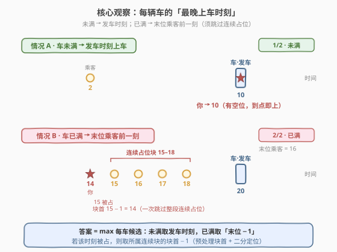
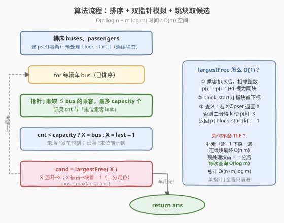
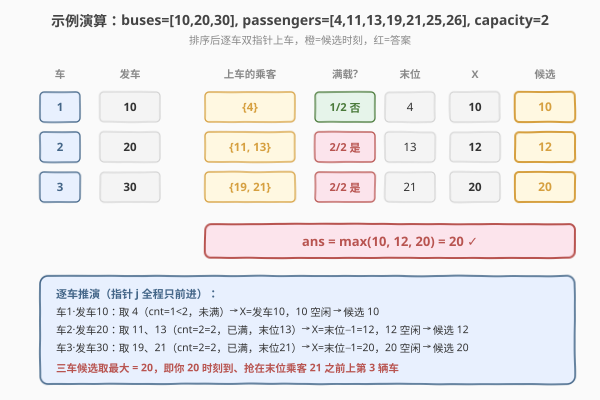

# 坐上公交的最晚时间

- **题目名称**：坐上公交的最晚时间
- **链接**：[2332. 坐上公交的最晚时间](https://leetcode.cn/problems/the-latest-time-to-catch-a-bus/)
- **难度**：中等
- **标签**：排序、双指针、二分查找

## 1. 题目概述

给定 `buses[i]`（第 `i` 辆公交的**出发时间**）、`passengers[j]`（第 `j` 位乘客的**到达时间**）和 `capacity`（每辆车最多容纳人数）。所有公交出发时间互不相同，所有乘客到达时间也互不相同。数组**不一定有序**。

规则：

- 每位乘客排队搭乘**下一辆有座位的公交**；**最早到达者优先上车**。
- 你若在 `y` 时刻到达、公交在 `x` 时刻出发，且 `y <= x` 且车未满，则可乘这一辆。
- 求你可以搭乘公交的**最晚到达时刻**，且你**不能与任何乘客同时刻到达**。

**示例 1**：

```text
输入：buses = [10,20], passengers = [2,17,18,19], capacity = 2
输出：16
解释：第 1 辆载乘客 2；第 2 辆载你与乘客 17。你不能与乘客 17 同时刻到，故须在 17 之前到达，最晚 16。
```

**示例 2**：

```text
输入：buses = [20,30,10], passengers = [19,13,26,4,25,11,21], capacity = 2
输出：20
解释：排序后 buses=[10,20,30]。车1 载 4；车2 载 11、13；车3 载 19、21 与你。你在 20 到达抢在 21 之前。
```

**约束条件**：

- $1 \le n, m, \text{capacity} \le 10^5$
- $2 \le \text{buses}[i], \text{passengers}[i] \le 10^9$
- `buses` 与 `passengers` 内元素各自互不相同。

> ⚠️ **关键信号**：乘车是「按到达顺序贪心上满即止」的过程，天然要求先**排序**再用**单指针**扫描乘客；而你能否挤上某辆车，只取决于「该车是否还有空位」或「能否抢在末位乘客之前」——两类情况都有确定的「最晚上车时刻」。难点在最后一跳：候选时刻若被乘客占用，须高效跳过**连续占位段**。

---

## 2. 解题思路

### 2.1 暴力思路

把 `buses`、`passengers` 排序后，模拟每辆车按到达顺序装满 `capacity` 人。对每辆车，按两类情况给出候选时刻，然后「从候选值开始逐 $-1$ 下探，直到遇到一个非乘客时刻」即为该车的可行最晚时刻，最后取所有车的最大值。

朴素下探的隐患：若存在长为 $L$ 的连续占位段（如乘客恰为 $1,2,\dots,L$），一次查询就要下探 $L$ 步；多辆车反复扫同一段时最坏 $O(n\cdot m)$，$n,m\le 10^5$ 会超时。核心要做的是把「跳过连续占位」从 $O(L)$ 降到 $O(\log m)$。

### 2.2 核心观察：每辆车的候选只有两类



先在不考虑「你」的情况下模拟。设第 $i$ 辆车（已排序）装了 $\text{cnt}$ 人，其中**末位乘客**到达时间为 $\text{last}$：

- **未满**（$\text{cnt} < \text{capacity}$）：车还有空位，你可踩着**发车时刻**到（$y=x=\text{buses}[i]$ 满足 $y\le x$）。候选 $X=\text{buses}[i]$。
- **已满**（$\text{cnt}=\text{capacity}$）：所有座位被占满，你只能**抢在末位乘客之前**挤掉他（他被顶到后续车或不乘车，但你已上车）。候选 $X=\text{last}-1$。

> 💡 抢在末位之前一定有效：你到得比末位早，排在你与末位之间没人插队（时刻不与乘客重合），末位自然被顶出，你拿到末位的位置。

剩下唯一的问题：$X$ 可能恰好是某乘客的到达时刻（你不能与乘客同时刻到）。此时需要找到 $\le X$ 的**最大非乘客时刻**。把乘客到达时刻排序后，相邻整数 $p[i]=p[i-1]+1$ 视为**同一连续块**。预处理每个下标所属块的**块首下标** $\text{blockStart}[\cdot]$：

$$
\text{largestFree}(X)=\begin{cases} X, & X\notin \text{pset}\\ \text{passengers}[\text{blockStart}[k]]-1, & X=\text{passengers}[k]\ \text{（即取其块首减 1）} \end{cases}
$$

> ⚠️ 块首减 1 必然空闲：块首的定义正是「前一个乘客不与之相邻」，所以 $\text{passengers}[\text{blockStart}[k]]-1$ 不可能是任何乘客时刻。

于是对每辆车 $i$：候选 $=\text{largestFree}(X_i)$，答案 $=\max_i$ 候选。

### 2.3 算法流程图



### 2.4 示例演算

以示例 2 为例（排序后 $\text{buses}=[10,20,30]$，$\text{passengers}=[4,11,13,19,21,25,26]$，$\text{capacity}=2$）：



- 车 1（发车 10）：取 $\{4\}$，$\text{cnt}=1<2$ 未满 $\Rightarrow X=10$，10 空闲 $\Rightarrow$ 候选 10；
- 车 2（发车 20）：取 $\{11,13\}$，$\text{cnt}=2=2$ 已满、末位 13 $\Rightarrow X=12$，12 空闲 $\Rightarrow$ 候选 12；
- 车 3（发车 30）：取 $\{19,21\}$，$\text{cnt}=2=2$ 已满、末位 21 $\Rightarrow X=20$，20 空闲 $\Rightarrow$ 候选 20；
- 答案 $=\max(10,12,20)=20$。✓

注意乘客指针 $j$ 全程只前进，三辆车总共只扫一遍乘客数组。

---

## 3. 参考代码

### C++

```cpp
class Solution {
public:
    int latestTimeCatchTheBus(vector<int>& buses, vector<int>& passengers, int capacity) {
        sort(buses.begin(), buses.end());
        sort(passengers.begin(), passengers.end());
        int m = passengers.size();
        unordered_set<int> pset(passengers.begin(), passengers.end());

        // blockStart[i]：下标 i 所属「连续块」的块首下标
        vector<int> blockStart(m);
        for (int i = 0; i < m; ++i) {
            if (i > 0 && passengers[i] == passengers[i - 1] + 1)
                blockStart[i] = blockStart[i - 1];
            else
                blockStart[i] = i;
        }

        // 不超过 x 的最大「非乘客时刻」
        auto largestFree = [&](int x) -> int {
            if (!pset.count(x)) return x;                       // x 空闲
            int k = lower_bound(passengers.begin(), passengers.end(), x)
                    - passengers.begin();                       // passengers[k]==x
            return passengers[blockStart[k]] - 1;               // 块首减 1
        };

        int j = 0, ans = 0;
        for (int bus : buses) {
            int cnt = 0, last = -1;
            while (j < m && passengers[j] <= bus && cnt < capacity) {
                last = passengers[j];
                ++j; ++cnt;
            }
            int X = (cnt < capacity) ? bus : last - 1;          // 未满→发车；已满→末位−1
            ans = max(ans, largestFree(X));
        }
        return ans;
    }
};
```

### Python

```python
import bisect

class Solution:
    def latestTimeCatchTheBus(self, buses: List[int], passengers: List[int], capacity: int) -> int:
        buses.sort()
        passengers.sort()
        m = len(passengers)
        pset = set(passengers)

        # block_start[i]：下标 i 所属连续块的块首下标
        block_start = list(range(m))
        for i in range(1, m):
            if passengers[i] == passengers[i - 1] + 1:
                block_start[i] = block_start[i - 1]

        def largest_free(x: int) -> int:
            """不超过 x 的最大非乘客时刻"""
            if x not in pset:
                return x                                     # x 空闲
            k = bisect.bisect_left(passengers, x)            # passengers[k] == x
            return passengers[block_start[k]] - 1            # 块首减 1

        j = ans = 0
        for bus in buses:
            cnt, last = 0, -1
            while j < m and passengers[j] <= bus and cnt < capacity:
                last = passengers[j]
                j += 1
                cnt += 1
            X = bus if cnt < capacity else last - 1           # 未满→发车；已满→末位−1
            ans = max(ans, largest_free(X))
        return ans
```

> 💡 **细节**：`largest_free` 中 `last - 1` 由约束 $\text{passengers}[i]\ge 2$ 保证 $\ge 1$，不会越界到非正数。乘客指针 `j` 在外层循环中**单调前进**，故整个模拟是 $O(n+m)$ 的线性归并扫描；耗时全在排序与二分。

---

## 4. 复杂度分析

| 维度 | 复杂度 | 说明 |
|------|--------|------|
| 时间复杂度 | $O(n\log n+m\log m)$ | 排序主导；模拟 $O(n+m)$，每车一次 $O(\log m)$ 的 `largest_free` 共 $O(n\log m)$ |
| 空间复杂度 | $O(m)$ | 哈希集合 `pset`、`block_start` 数组各 $m$ 个元素 |

> ⚠️ 若用「逐 $-1$ 下探」朴素版，遇连续占位段最坏 $O(n\cdot m)$；预处理块首 + 二分把单次查询压到 $O(\log m)$ 是本题的关键优化。也可用哈希表做**路径压缩**（记忆每个已占时刻对应的下个空闲点），把均摊降到 $O(n+m)$，但实现稍繁。

---

## 5. 扩展：路径压缩把查询降到均摊 O(1)

`largest_free` 还可仿并查集做**路径压缩**：用哈希表 $\text{skip}$ 记录「已占时刻 $\to$ 其下个空闲点」。查询 $x$ 时，若 $x$ 空闲直接返回；否则沿 $x-1,x-2,\dots$ 下探，途中把每个已占点登记指向最终空闲点。每个乘客时刻至多被登记一次，故均摊 $O(n+m)$。

```cpp
// 路径压缩版：O(n+m) 均摊时间，O(m) 额外空间
class Solution {
public:
    int latestTimeCatchTheBus(vector<int>& buses, vector<int>& passengers, int capacity) {
        sort(buses.begin(), buses.end());
        sort(passengers.begin(), passengers.end());
        unordered_set<int> pset(passengers.begin(), passengers.end());
        unordered_map<int,int> skip;               // 已占时刻 -> 下个空闲点

        function<int(int)> largestFree = [&](int x) -> int {
            vector<int> path;
            while (pset.count(x) && !skip.count(x)) { path.push_back(x); --x; }
            int res = skip.count(x) ? skip[x] : x; // x 空闲 或 已记忆
            for (int v : path) skip[v] = res;      // 路径压缩
            return res;
        };

        int j = 0, ans = 0;
        for (int bus : buses) {
            int cnt = 0, last = -1;
            while (j < (int)passengers.size() && passengers[j] <= bus && cnt < capacity) {
                last = passengers[j]; ++j; ++cnt;
            }
            int X = (cnt < capacity) ? bus : last - 1;
            ans = max(ans, largestFree(X));
        }
        return ans;
    }
};
```

两版复杂度同阶；块首 + 二分版**从结构直接推出**、不易写错，适合作为主解法讲清；路径压缩版**贴合「跳过连续段」的物理直觉**，均摊更优。这与 [947. 移除最多的同行同列石头](https://leetcode.cn/problems/most-stones-removed-with-same-row-or-column/) 中并查集合并同属「等价类 + 路径压缩」思想。

---

## 6. 面试要点

1. **为什么先排序？不排序会怎样？**
   - 「最早到达者优先上车」要求按到达顺序处理乘客；「下一辆有座的车」要求按发车顺序处理车辆。两者都必须排序后，才能用**单指针** $j$ 一遍扫完，避免每辆车都从头找乘客。

2. **未满取「发车时刻」、已满取「末位−1」的依据分别是什么？**
   - 未满时车上有空位，你踩发车时刻到即可上车（$y=x$ 满足 $y\le x$）；已满时无空位，唯有**抢在末位乘客之前**到达，把他顶到后续车，你才能拿到座位，故取末位 $-1$。两者都须保证时刻不与乘客重合，故再过一遍 `largest_free`。

3. **为什么 `largest_free` 不能朴素逐 −1 下探？**
   - 乘客到达时刻可能构成很长的一段连续整数（如 $1\sim m$），一次下探就要 $O(m)$；多辆车反复扫同一段时最坏 $O(n\cdot m)=10^{10}$，必然 TLE。预处理块首后，一次二分即可定位块首，查询降到 $O(\log m)$。

4. **「抢在末位之前」会不会把别人挤掉、导致别人上不了车从而影响答案？**
   - 会挤掉末位乘客，但题目只问你**能否上车**，不关心别人。末位被顶到后续车或不上车都不影响「你已上车」这一事实；且候选时刻严格小于末位，不会引出新的占位冲突。取所有车候选的**最大**即覆盖了所有可行乘车方案。

5. **`block_start` 的状态定义与递推？**
   - $\text{blockStart}[i]$ 表示下标 $i$ 所属连续块的**最左下标**。若 $p[i]=p[i-1]+1$ 则与左邻同块、$\text{blockStart}[i]=\text{blockStart}[i-1]$；否则 $i$ 自成新块首。一次线性扫描即可，查询时二分找到 $p[k]=X$ 的 $k$，返回 $p[\text{blockStart}[k]]-1$。

---

## 7. 同类练习题

- [2335. 装满杯子需要的最短总时长](https://leetcode.cn/problems/minimum-amount-of-time-to-fill-cups/)：贪心模拟分配的姊妹题，按需求贪心取最大类，承接本题「按规则模拟装载」的思路
- [1854. 人口最多的年份](https://leetcode.cn/problems/maximum-population-year/)：按时间区间贡献叠加求最大值，与本题「逐车取候选再取最大」的归并思想同源
- [1094. 拼车](https://leetcode.cn/problems/car-pooling/)（[站内题解](../1001-1100/1094_拼车.md)）：差分区间加减 + 容量判定，与「车辆按容量装人」模型一脉相承
- [826. 安排工作以达到最大收益](https://leetcode.cn/problems/most-profit-assigning-work/)：排序 + 双指针贪心分配（按能力匹配任务），承接本题「排序后单指针扫描」范式
- [475. 供暖器](https://leetcode.cn/problems/heaters/)：排序 + 二分找最近覆盖点，与本题「二分定位 + 跳过连续段」的二分应用同源
