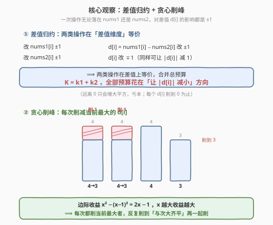
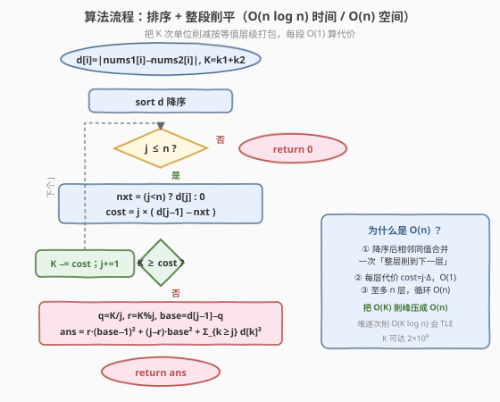
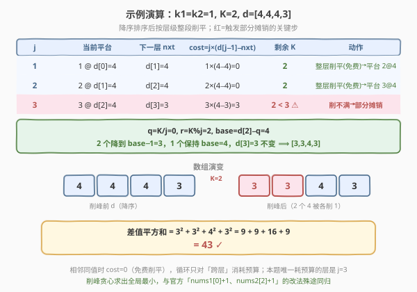

# 最小差值平方和

- **题目名称**：最小差值平方和
- **链接**：[2333. 最小差值平方和](https://leetcode.cn/problems/minimum-sum-of-squared-difference/)
- **难度**：中等
- **标签**：贪心、排序、数组

## 1. 题目概述

给定两个长度均为 $n$ 的下标从 $0$ 开始的整数数组 `nums1` 和 `nums2`，定义**差值平方和**为

$$\sum_{i=0}^{n-1} \left(\text{nums1}[i] - \text{nums2}[i]\right)^2$$

再给两个正整数 $k_1$、$k_2$：你可以将 `nums1` 的任意元素 $+1$ 或 $-1$ 至多 $k_1$ 次，将 `nums2` 的任意元素 $+1$ 或 $-1$ 至多 $k_2$ 次（元素可变负）。求修改后的**最小差值平方和**。

**示例 1**：

```text
输入：nums1 = [1,2,3,4], nums2 = [2,10,20,19], k1 = 0, k2 = 0
输出：579
解释：k1 = k2 = 0，不能修改。
(1-2)² + (2-10)² + (3-20)² + (4-19)² = 1 + 64 + 289 + 225 = 579
```

**示例 2**：

```text
输入：nums1 = [1,4,10,12], nums2 = [5,8,6,9], k1 = 1, k2 = 1
输出：43
解释：nums1[0] 增一次、nums2[2] 增一次后：
(2-5)² + (4-8)² + (10-7)² + (12-9)² = 9 + 16 + 9 + 9 = 43
```

**约束条件**：

- $n = \text{nums1.length} = \text{nums2.length}$
- $1 \le n \le 10^5$
- $0 \le \text{nums1}[i],\ \text{nums2}[i] \le 10^5$
- $0 \le k_1,\ k_2 \le 10^9$

> ⚠️ **关键信号**：一次操作无论落在 `nums1` 还是 `nums2`，对差值 $d[i]=\text{nums1}[i]-\text{nums2}[i]$ 的影响都是 $\pm 1$。于是 $k_1$、$k_2$ 这两类操作**在差值维度上完全等价**，可合并成一个总预算 $K=k_1+k_2$。问题瞬间从「两个数组各自分配」塌缩成「在一个差值数组上花掉 $K$ 次单位移动、最小化平方和」——典型的**贪心削峰**结构。

---

## 2. 解题思路

### 2.1 暴力思路

最朴素地：每个位置 $i$ 的差值 $d[i]$ 至多可被「削」$|d[i]|$ 次（削到 $0$），每次削 $1$。总预算 $K=k_1+k_2$。我们要决定每个位置削多少次 $r[i]\in[0,\,|d[i]|]$、$\sum r[i]\le K$，使得 $\sum (|d[i]|-r[i])^2$ 最小。

直接 $O(K)$ 模拟「每次挑当前最大的 $|d[i]|$ 削 $1$」即可——但 $K$ 可达 $2\times 10^9$，单步循环必然超时。难点不在贪心策略本身，而在**把 $O(K)$ 的逐次削峰压缩成 $O(n\log n)$ 的整段削平**。

### 2.2 核心观察：差值合并 + 贪心削峰



**第一步——差值归约。** 对任意 $i$，记 $d[i]=|\text{nums1}[i]-\text{nums2}[i]|$。一次操作：

- 改 `nums1[i]` $\pm 1$ ⟹ $d[i]$ 改变 $\pm 1$；
- 改 `nums2[i]` $\pm 1$ ⟹ $d[i]$ 也改变 $\pm 1$（方向相反）。

无论动哪个数组，**对差值的影响都是「某个 $d[i]$ 改 $\pm 1$」**。要降低平方和，必然把这 $1$ 用在「让 $|d[i]|$ 减小」的方向上（远离 $0$ 只会增大平方，亏本）。所以两类操作在差值维度等价，合并成总预算 $K=k_1+k_2$，问题变成：

> 在数组 $d$ 上花掉至多 $K$ 次单位削减（每个 $d[i]$ 削到 $0$ 为止），最小化 $\sum d[i]^2$。

> 💡 **预算为何能随意分配给两个数组？** 每次削减某个 $d[i]$ 的 $1$，可以选「调 `nums1`」或「调 `nums2`」中任意一种实现（$d>0$ 时减 `nums1` 或增 `nums2$；$d<0$ 时增 `nums1` 或减 `nums2`）。所以只要总削减数 $\le k_1+k_2$，总能把削减拆成「$\le k_1$ 次给 `nums1` + $\le k_2$ 次给 `nums2`」——分配方案不影响平方和，本题只问最小平方和，故无需还原具体改法。

**第二步——贪心削峰。** 把 $|d[i]|$ 削 $1$ 的边际收益是 $x^2-(x-1)^2=2x-1$，**$x$ 越大收益越大**。所以每次都该削当前最大的那个 $d[i]$——这正是**削高填低（此处只削不填）**的水位模型。由平方函数的严格凸性（或交换论证）可知：使剩余值尽量均衡的削减方案最优，而「反复削当前最大」恰好达成均衡。

### 2.3 算法流程图



把 $d$ **降序排序**后，所有「当前最大」连成一段平台，按层级整段削平：

设当前已削平的平台有 $j$ 个元素、都停在水平 $d[j-1]$，下一层是 $d[j]$（最后一个元素的下一层取 $0$）。把平台从 $d[j-1]$ 整体削到 $d[j]$ 需花费

$$\text{cost}=j\times\big(d[j-1]-d[j]\big)$$

- 若 $K\ge\text{cost}$：花掉 $\text{cost}$，平台扩为 $j+1$ 个、水平 $d[j]$，继续下一层；
- 若 $K<\text{cost}$：削不满整层，把剩余 $K$ **尽量均匀**摊到 $j$ 个元素上——令 $q=K/j$、$r=K\bmod j$，则 $r$ 个元素多削 $1$（降到 $\text{base}-1$）、$j-r$ 个降到 $\text{base}$，其中 $\text{base}=d[j-1]-q$。剩余 $d[j\,..\,n-1]$ 不变，直接求和返回。

若所有层都削完仍走完循环，说明全部削到 $0$，答案为 $0$。

### 2.4 示例演算

以示例 2（$k_1=k_2=1,\ K=2$）为例，$d=[4,4,4,3]$，降序排序后仍为 $[4,4,4,3]$：



- $j=1$：下一层 $d[1]=4$，$\text{cost}=1\times(4-4)=0$，$K=2$ 不减；平台 $1$ 个 @ $4$；
- $j=2$：下一层 $d[2]=4$，$\text{cost}=2\times(4-4)=0$，$K=2$；平台 $2$ 个 @ $4$；
- $j=3$：下一层 $d[3]=3$，$\text{cost}=3\times(4-3)=3>K=2$，触发部分摊销。$q=2//3=0,\ r=2$，$\text{base}=4-0=4$：$2$ 个降到 $3$、$1$ 个保持 $4$，$d[3]=3$ 不变；
- 求和：$2\times 3^2+1\times 4^2+1\times 3^2=18+16+9=43$ ✓

> 💡 本题有不止一种改法（可动 `nums1` 或 `nums2`），但**最小平方和唯一**——削峰贪心求出的就是全局最小值。

---

## 3. 参考代码

### C++

```cpp
class Solution {
public:
    long long minSumSquareNums(vector<int>& nums1, vector<int>& nums2,
                              int k1, int k2) {
        int n = nums1.size();
        vector<int> d(n);
        for (int i = 0; i < n; ++i)
            d[i] = abs(nums1[i] - nums2[i]);
        sort(d.begin(), d.end(), greater<int>());        // 降序：从最大开始削

        long long K = (long long)k1 + k2;                // 差值维度的总预算
        for (int j = 1; j <= n; ++j) {
            long long nxt = (j < n) ? d[j] : 0;          // 下一层水平
            long long cost = (long long)j * (d[j - 1] - nxt);
            if (K >= cost) {
                K -= cost;                               // 整层削平，平台扩为 j+1
            } else {
                long long q = K / j, r = K % j;          // 削不满：均匀摊销
                long long base = d[j - 1] - q;
                long long ans = r * (base - 1) * (base - 1)
                               + ((long long)j - r) * base * base;
                for (int k = j; k < n; ++k)              // 以下层不动
                    ans += (long long)d[k] * d[k];
                return ans;
            }
        }
        return 0;                                       // 全部削到 0
    }
};
```

### Python

```python
class Solution:
    def minSumSquareNums(self, nums1: List[int], nums2: List[int],
                         k1: int, k2: int) -> int:
        d = sorted((abs(a - b) for a, b in zip(nums1, nums2)),
                   reverse=True)        # 降序：从最大开始削
        n = len(d)
        K = k1 + k2                      # 差值维度的总预算
        for j in range(1, n + 1):
            nxt = d[j] if j < n else 0   # 下一层水平
            cost = j * (d[j - 1] - nxt)
            if K >= cost:
                K -= cost                # 整层削平，平台扩为 j+1
            else:
                q, r = divmod(K, j)      # 削不满：均匀摊销
                base = d[j - 1] - q
                ans = r * (base - 1) ** 2 + (j - r) * base ** 2
                ans += sum(x * x for x in d[j:])   # 以下层不动
                return ans
        return 0                         # 全部削到 0
```

> 💡 **细节**：
> - `K = (long long)k1 + k2`：$k_1,k_2$ 各达 $10^9$，相加超过 `int` 范围，C++ 必须用 `long long` 承接；Python 整数无溢出之忧。
> - 答案上界 $n\cdot(2\times10^5)^2=4\times10^{15}$，仍在 `long long`（约 $9.2\times10^{18}$）内；求和时 `(long long)d[k]*d[k]` 必须**先转型再相乘**，否则两 `int` 相乘先溢出。
> - `base-1` 不会为负：进入部分摊销分支时 $K< j\cdot(d[j-1]-\text{nxt})$，故 $q=\lfloor K/j\rfloor\le d[j-1]-\text{nxt}-1$，$\text{base}-1=d[j-1]-q-1\ge\text{nxt}\ge 0$，绝不会把元素削穿到负。

---

## 4. 复杂度分析

| 维度 | 复杂度 | 说明 |
|------|--------|------|
| 时间复杂度 | $O(n\log n)$ | 排序主导；削峰循环 $O(n)$，最坏摊销求和 $O(n)$ |
| 空间复杂度 | $O(n)$ | 差值数组 $d$（排序原地，不计输出） |

> ⚠️ 朴素「逐次削当前最大」用最大堆是 $O((n+K)\log n)$，$K$ 可达 $2\times10^9$ 必然 TLE。关键优化是把「$K$ 次单位削减」按**等值层级**打包成至多 $n$ 段整段削平，每段 $O(1)$ 算出代价，从而把 $O(K)$ 压成 $O(n)$。由于 $d[i]\le 2\times10^5$ 取值范围不大，亦可改用值域桶 + 从大到小扫桶，做到 $O(n+V)$ 时间，但 $O(n\log n)$ 已绰绰有余。

---

## 5. 扩展：堆贪心与「削峰」的最优性证明

**堆贪心（直观但慢）。** 用最大堆维护所有 $d[i]$，重复 $K$ 次：弹出最大值 $x$，若 $x>0$ 就 push 回 $x-1$。每次削减当前最大，逻辑与削峰完全一致，正确性显然。但 $K$ 可达 $2\times10^9$，单次 $O(\log n)$ 累乘必超时——本题的「排序 + 整段削平」正是把这套堆循环**按等值层批量展开**的产物：相邻相同值只需走一次循环、一次性削到下一层，把 $O(K)$ 步压成 $O(n)$ 段。

**最优性的交换论证。** 设最优解 $\{r[i]\}$ 中存在某次「削了较小的 $a$ 却没把更大的 $b$ 削到底（$b$ 还有余量）」。把这一单位削减从 $a$ 挪到 $b$：收益变化 $(2a-1)\to(2b-1)$，因 $b>a$ 故收益增加，与「最优」矛盾。故最优解必先把最大者削到与次大者齐平，再两者一起削……这正是削峰的层级顺序。等价地，由 $x^2$ 的严格凸性 + Jensen 不等式：在总削减量固定时，剩余值越**均衡**平方和越小，削峰恰好把高位「摊平」到低位，达到最均衡的状态。

**预算够大时的退化。** 当 $K\ge\sum|d[i]|$ 时所有层都能削平到 $0$，循环走完返回 $0$；本题 $K$ 上限 $2\times10^9$、$\sum|d[i]|$ 上限 $2\times10^{10}$，两种情形（全削到 $0$ / 削不满）都可能发生，代码用「循环正常结束即返回 $0$」统一处理，无需特判。

---

## 6. 面试要点

1. **为什么 $k_1$、$k_2$ 能合并成 $K=k_1+k_2$？**
   - 一次操作无论落在 `nums1` 还是 `nums2`，对差值 $d[i]=\text{nums1}[i]-\text{nums2}[i]$ 的影响都是 $\pm 1$。要降平方和必然朝 $|d[i]|$ 减小的方向用，于是两类操作在差值维度**等价且可互换**。又因每个 $d[i]$ 的削减可任选「调 `nums1`」或「调 `nums2`」实现，只要总削减 $\le k_1+k_2$ 就能拆成合法分配，故平方和只依赖总预算 $K$。

2. **为什么贪心「削当前最大」最优？**
   - 削 $|d|=x$ 一单位的边际收益 $2x-1$ 随 $x$ 单调递增，当前最大者收益最高；由交换论证或 $x^2$ 严格凸性，把削减集中到最大者直到均衡才最优。削峰（water-filling）正是把高位逐步摊平到低位，达成最均衡的剩余分布。

3. **部分摊销时为什么 $r$ 个元素多削 $1$ 而非集中削少数？**
   - 剩余 $K$ 削不满整层时，$q=K/j$ 是每人保底削的量，余数 $r$ 个再各削 $1$。由凸性，削减越**均匀**平方和越小，故把余数撒成「每人最多多削 $1$」而非堆给少数元素。这等价于把 $j$ 个值从全 $d[j-1]$ 变成 $r$ 个 $d[j-1]-q-1$、$j-r$ 个 $d[j-1]-q$。

4. **有哪些溢出/边界坑？**
   - $k_1+k_2$ 超 `int`，C++ 须 `long long` 承接；$d[k]\times d[k]$ 在 `int` 下溢出，需先转 `long long` 再乘；答案上界 $4\times10^{15}$ 安全落在 `long long` 内。`base-1` 恒 $\ge 0$（见第 3 节细节），不会削穿。$n=1$ 时循环只走 $j=1$ 一层，next 取 $0$，逻辑自洽。

5. **为什么 $O(K)$ 堆贪心会超时，而排序版能过？**
   - 堆贪心每单位削减 $O(\log n)$，$K$ 达 $2\times10^9$ 必超时。排序版把「$K$ 次单位削减」按**等值层级**打包：相邻同值的削减合并成一次「整层削到下一层」，至多 $n$ 段、每段 $O(1)$ 算代价，把 $O(K)$ 压成 $O(n)$，瓶颈回到排序的 $O(n\log n)$。

---

## 7. 同类练习题

- [2332. 坐上公交车的最新时间](https://leetcode.cn/problems/the-latest-time-to-catch-a-bus/)：贪心 + 排序匹配，同属「排序后线性贪心」家族，对照本题「排序后整段推进」的套路
- [2144. 打折购买糖果的最低成本](https://leetcode.cn/problems/minimum-cost-of-buying-candies-with-discount/)：排序 + 贪心整段跳过，与本题「降序后按层级批量处理」思想相通
- [881. 救生艇](https://leetcode.cn/problems/boats-to-save-people/)（[站内题解](../0801-0900/881_救生艇.md)）：排序 + 双指针贪心，典型「排序后线性贪心」模板，可对照本题的排序贪心范式
- [621. 任务调度器](https://leetcode.cn/problems/task-scheduler/)（[站内题解](../0601-0700/621_任务调度器.md)）：贪心 + 按频次「削峰填谷」安排冷却，与本题「把最大者削到与次大齐平再一起削」的削峰思路同构
- [1798. 你能构造的最大连续整数值](https://leetcode.cn/problems/maximum-number-of-consecutive-values-you-can-make/)：排序后贪心扩展可达区间，同属「排序 + 线性贪心推进」的题型
