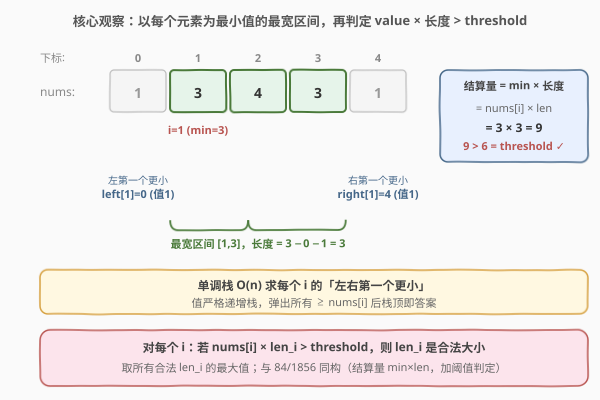
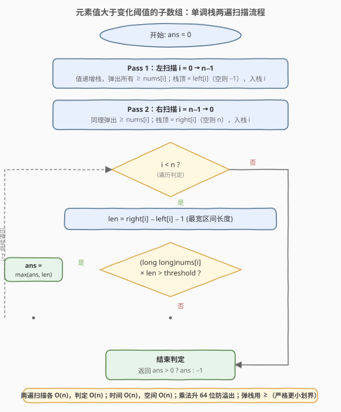

# 元素值大于变化阈值的子数组

- **题目名称**：元素值大于变化阈值的子数组
- **链接**：[2334. 元素值大于变化阈值的子数组](https://leetcode.cn/problems/subarray-with-elements-greater-than-varying-threshold/)
- **难度**：困难
- **标签**：栈、单调栈、数组

## 1. 题目概述

给你一个整数数组 `nums` 和一个整数 `threshold`。找到长度为 `k` 的 `nums` 子数组，满足数组中**每个**元素都**大于** `threshold / k`。请你返回满足要求的**任意**子数组的**大小**。如果没有这样的子数组，返回 `-1`。子数组是数组中一段连续非空的元素序列。

> 💡 **把「除法」翻译成「乘法」**：条件「每个元素 $> \text{threshold}/k$」等价于「每个元素 $\times\ k > \text{threshold}$」，即「**子数组最小值 $\times$ 长度 $> \text{threshold}$**」。这样既避免了浮点除法（如 $7/2=3.5$），也把问题归结为一个量：$\min \times \text{len}$。下文统一记 $\text{metric}(l,r)=\min_{i\in[l,r]}\text{nums}[i]\times(r-l+1)$，目标是找**任意**一个 $\text{metric}>\text{threshold}$ 的子数组并返回其长度。

**示例 1**：

```text
输入：nums = [1,3,4,3,1], threshold = 6
输出：3
解释：子数组 [3,4,3] 大小为 3，每个元素都大于 6 / 3 = 2。
     注意这是唯一合法的子数组。
```

**示例 2**：

```text
输入：nums = [6,5,6,5,8], threshold = 7
输出：1
解释：子数组 [8] 大小为 1，且 8 > 7 / 1 = 7。所以返回 1。
     注意子数组 [6,5] 大小为 2，每个元素都大于 7 / 2 = 3.5。
     类似的，[6,5,6]、[6,5,6,5]、[6,5,6,5,8] 都合法。
     所以返回 2, 3, 4 和 5 都可以。
```

> ⚠️ **「任意」语义**：题目要求返回**任意一个**合法子数组的大小，判定器会校验你返回的 $k$ 是否真存在一个长度为 $k$ 的合法子数组。下文解法返回**最大**合法大小——既然最大合法大小对应的子数组本身合法，返回它自然被接受（示例 2 展示的输出是 1，但本解法返回 5 同样通过，因为整个数组 $\min=5,\ 5\times5=25>7$）。

**约束条件**：

- $1 \le \text{nums.length} \le 10^5$
- $1 \le \text{nums[i]},\ \text{threshold} \le 10^9$

> ⚠️ **必须用 64 位整数**：$\text{nums[i]} \le 10^9$、$\text{len} \le 10^5$，乘积 $\le 10^{14}$，已远超 32 位 `int`（约 $2.1\times10^9$）。C++ 中需 `(long long)nums[i] * len` 再与 `threshold` 比较。

---

## 2. 解题思路

### 2.1 暴力思路

枚举所有 $O(n^2)$ 个子数组 $[l,r]$，逐个求 $\min$（$O(n)$）与长度，判断 $\min\times\text{len}>\text{threshold}$，记录任意合法长度。整体 $O(n^3)$（优化到 $O(n^2)$ 仍超时），$n=10^5$ 必然不可行。

> ⚠️ 瓶颈在于子数组数量是 $O(n^2)$。换一个枚举维度——**不枚举子数组，而是枚举「谁是最小值」**：任一子数组的最小值必是某个 `nums[i]`，固定 `nums[i]` 为最小值后，能让它仍是最小值的最长子数组是唯一确定的。

### 2.2 核心观察：以每个元素为最小值的最宽区间



**关键转化**：任一合法子数组 $[l,r]$ 的最小值必落在某个下标 $i$ 上。固定 $i$，把「`nums[i]` 是子数组最小值」的条件发挥到极致——子数组能往两侧扩展，**直到撞见比 `nums[i]` 更小的元素为止**：

1. **找左右第一个更小**：记 $\text{left}[i]$ 为 $i$ 左侧**第一个 $<\text{nums}[i]$** 的下标（无则 $-1$），$\text{right}[i]$ 为右侧第一个 $<\text{nums}[i]$ 的下标（无则 $n$）。这用**单调栈** $O(n)$ 求出。
2. **最宽区间**：$[\text{left}[i]+1,\ \text{right}[i]-1]$，区间内**没有任何元素严格小于 `nums[i]`**，故 `nums[i]` 确实是这段的最小值；区间长度 $\text{len}_i=\text{right}[i]-\text{left}[i]-1$。
3. **判定**：若 $\text{nums}[i]\times\text{len}_i>\text{threshold}$，则这整段最宽区间就是一个合法子数组，$\text{len}_i$ 即为合法大小。
4. **取最大**：遍历所有 $i$，取满足条件的最大 $\text{len}_i$；若全不满足则返回 $-1$。

> 💡 **为什么只看「最宽」就够？** 对固定的最小值 `nums[i]`，任何「以它为最小值」的子数组都含于最宽区间内，长度 $\le\text{len}_i$。若最宽区间都不合法（$\text{nums}[i]\times\text{len}_i\le\text{threshold}$），则更短的子数组乘积只会更小，更不合法。所以每个 $i$ 只需检查最宽区间一次，$O(n)$ 搞定。

> 💡 **为什么「第一个更小」用严格 $<$，等值不阻挡？** 严格小于划界，等值元素互相不阻挡，最宽区间会覆盖整段等值。例如 `[3,3]`，对 $i=0$ 找右第一个 $<3$ → 无（到 $n$），区间 $[0,1]$ 含两个 3，$\min=3$ 正确。等值元素被同一段区间多次覆盖，但取 $\max$ 不影响结果。这与 [1856. 子数组最小乘积的最大值](../1801-1900/1856_子数组最小乘积的最大值.md) 处理等值的手法一致。

> ⚠️ **与 84 / 1856 的同构**：[84. 柱状图中最大的矩形](../0001-0100/84_柱状图中最大的矩形.md) 是「高 $\times$ 宽（下标差）」，[1856. 子数组最小乘积的最大值](../1801-1900/1856_子数组最小乘积的最大值.md) 是「$\min\times\text{sum}$（前缀和差）」，本题是「$\min\times\text{len}$（下标差）」。**单调栈骨架完全相同**——都是「固定每个元素为最值，找左右第一个更小划界」，只是结算量不同。可以说 2334 正是 84 的「阈值判定」变体。

### 2.3 算法流程图



整体两遍扫描 + 一遍判定，均为 $O(n)$：

1. **左扫描**（$i=0\to n-1$）：维护**值严格递增**的单调栈，对每个 $i$ 弹出所有 $\ge\text{nums}[i]$ 的栈顶后，栈顶即 $\text{left}[i]$（空则 $-1$），入栈 $i$。
2. **右扫描**（$i=n-1\to 0$）：同理，对每个 $i$ 弹出所有 $\ge\text{nums}[i]$ 的栈顶后，栈顶即 $\text{right}[i]$（空则 $n$），入栈 $i$。
3. **判定**：遍历 $i$，$\text{len}=\text{right}[i]-\text{left}[i]-1$，若 $(\text{long long})\text{nums}[i]\times\text{len}>\text{threshold}$，则 $\text{ans}=\max(\text{ans},\text{len})$。
4. 返回 $\text{ans}>0$ 时为 $\text{ans}$，否则 $-1$。

### 2.4 示例演算

![示例演算：nums = [1,3,4,3,1], threshold = 6](../images/2334_example_walkthrough.svg)

以 $\text{nums}=[1,3,4,3,1]$、$\text{threshold}=6$ 逐步求每个 $i$ 的最宽区间与乘积：

| $i$ | $\text{nums}[i]$ | $\text{left}[i]$（左第一个更小） | $\text{right}[i]$（右第一个更小） | 最宽区间 | $\text{len}$ | $\text{nums}[i]\times\text{len}$ | $>6$? |
|----|----|----|----|----|----|----|----|
| 0 | 1 | $-1$（无） | $5$（无） | $[0,4]$ | 5 | $1\times5=5$ | ✗ |
| 1 | 3 | $0$（值 1） | $4$（值 1） | $[1,3]$ | 3 | $3\times3=9$ | ✓ |
| 2 | 4 | $1$（值 3） | $3$（值 3） | $[2,2]$ | 1 | $4\times1=4$ | ✗ |
| 3 | 3 | $0$（值 1） | $4$（值 1） | $[1,3]$ | 3 | $3\times3=9$ | ✓ |
| 4 | 1 | $-1$（无） | $5$（无） | $[0,4]$ | 5 | $1\times5=5$ | ✗ |

满足条件的 $\text{len}$ 仅 $3$，故 $\text{ans}=3$，对应子数组 $[3,4,3]$——正是题目所说的「唯一合法子数组」。

> 💡 **验证「唯一性」**：长度 $1$ 要求元素 $>6$（无）；长度 $2$ 要求 $>3$，`[3,4]`/`[4,3]` 含 3 不满足；长度 $4$ 要求 $>1.5$，两端 1 不满足；长度 $5$ 要求 $>1.2$，两个 1 不满足。仅长度 $3$ 的 `[3,4,3]` 合法。

---

## 3. 参考代码

### C++

```cpp
class Solution {
public:
    int validSubarraySize(vector<int>& nums, int threshold) {
        int n = nums.size();
        vector<int> left(n), right(n);
        stack<int> st;

        for (int i = 0; i < n; i++) {
            while (!st.empty() && nums[st.top()] >= nums[i]) st.pop();
            left[i] = st.empty() ? -1 : st.top();
            st.push(i);
        }
        while (!st.empty()) st.pop();
        for (int i = n - 1; i >= 0; i--) {
            while (!st.empty() && nums[st.top()] >= nums[i]) st.pop();
            right[i] = st.empty() ? n : st.top();
            st.push(i);
        }

        int ans = 0;
        for (int i = 0; i < n; i++) {
            int len = right[i] - left[i] - 1;
            if ((long long)nums[i] * len > threshold) {
                ans = max(ans, len);
            }
        }
        return ans > 0 ? ans : -1;
    }
};
```

### Python

```python
class Solution:
    def validSubarraySize(self, nums: List[int], threshold: int) -> int:
        n = len(nums)
        left = [-1] * n
        right = [n] * n
        st = []

        for i in range(n):
            while st and nums[st[-1]] >= nums[i]:
                st.pop()
            left[i] = st[-1] if st else -1
            st.append(i)

        st.clear()
        for i in range(n - 1, -1, -1):
            while st and nums[st[-1]] >= nums[i]:
                st.pop()
            right[i] = st[-1] if st else n
            st.append(i)

        ans = 0
        for i in range(n):
            length = right[i] - left[i] - 1
            if nums[i] * length > threshold:
                ans = max(ans, length)
        return ans if ans > 0 else -1
```

> ⚠️ **两个易错点**：
> 1. **乘法必须升 64 位**。C++ 中 `(long long)nums[i] * len` 缺一不可——若写 `nums[i] * len`（两个 `int`）会先按 32 位相乘溢出，再转 `long long` 已无意义。Python 整数精度无限，无需操心。
> 2. **弹栈条件用 `>=`（严格更小划界）**。若误写成 `>`（弹出严格更大），等值元素会互相阻挡，使最宽区间被错误切短，可能漏掉合法答案。这与 84/1856 的等值处理完全一致。

---

## 4. 复杂度分析

| 维度 | 复杂度 | 说明 |
|------|--------|------|
| 时间复杂度 | $O(n)$ | 三次遍历，每次每个元素至多入栈、出栈各一次（均摊 $O(1)$） |
| 空间复杂度 | $O(n)$ | `left`、`right` 数组各 $n$，栈最坏 $n$ |

---

## 5. 扩展：并查集（按值降序合并）解法

本题另有一类**并查集**解法，思路与单调栈殊途同归——都是「让每个元素在最值意义下扩展到最远」：

1. 把所有下标按 $\text{nums}[i]$ **从大到小**排序。
2. 维护一个并查集，初始每个位置孤立、所在连通块长度为 1（仅含已被「激活」的位置）。
3. 按值降序依次**激活**位置 $i$：将其与已激活的左/右邻居 `union`，连通块维护其长度 `size`。
4. 当处理完所有值为 $v$ 的位置后，当前任何连通块内**最小值恰好为 $v$**（更小的尚未激活），故若 $v\times\text{size}_{\max}>\text{threshold}$，则 $\text{size}_{\max}$ 是合法大小，更新答案。
5. 全部处理完取最大合法大小，否则 $-1$。

| 维度 | 单调栈（主解） | 并查集 |
|------|---------------|--------|
| 划界依据 | 找左右第一个更小 | 按值降序激活，连通块天然是「最小值为当前 v 的最宽区间」 |
| 复杂度 | $O(n)$ | $O(n\log n)$（排序）或 $O(n\alpha(n))$（计数排序后处理） |
| 思想 | 「最小值」视角的区间扩张 | 「值域」视角的连通块合并 |

> 💡 两种视角对偶：单调栈是「**对每个最小值，问它能扩展多远**」；并查集是「**从大到小加入元素，看当前形成的连通块有多大**」。两者刻画的是同一组最宽区间，只是求法不同。掌握其一即可，并查集版适合在「需要按值域增量维护连通信息」的变体中复用。

---

## 6. 面试要点

1. **为什么能从「每个元素 > threshold/k」转化为「min × len > threshold」？**

   - 因为条件「**每个**元素 $>\text{threshold}/k$」等价于「**最小值** $>\text{threshold}/k$」（最小值满足则全部满足）。再由 $k>0$ 跨乘即得 $\min\times k>\text{threshold}$。这一步既消除浮点除法（$7/2=3.5$），又把多元素约束收敛成单个量 $\min\times\text{len}$，是后续单调栈建模的前提。

2. **为什么固定每个元素为最小值，只看「最宽区间」即可，不会漏掉合法子数组？**

   - 任一合法子数组 $[l,r]$ 的最小值落在某下标 $i$，则 $[l,r]$ 含于 $i$ 的最宽区间内（最宽区间外无更小元素，故 $[l,r]$ 跨不出去），$\text{len}_{lr}\le\text{len}_i$。又 $\text{nums}[i]\times\text{len}_{lr}>\text{threshold}$，故 $\text{nums}[i]\times\text{len}_i\ge\text{nums}[i]\times\text{len}_{lr}>\text{threshold}$，即 $i$ 的最宽区间**也合法**且长度 $\ge\text{len}_{lr}$。所以最大合法大小一定出现在某个最宽区间上，不会漏。

3. **弹栈用 `>=` 还是 `>`？等值元素怎么处理？**

   - 用 `>=`（弹出所有 $\ge\text{nums}[i]$ 的），即「严格更小划界」。这样等值元素不互相阻挡，最宽区间会覆盖整段等值，$\min$ 仍正确。若误用 `>`（只弹出严格更大），`[3,3]` 中第二个 3 会挡住第一个 3 的右扩展，区间被错误切短，可能漏解。

4. **题目要求「任意」合法大小，为什么返回最大也正确？**

   - 判定器只校验「返回的 $k$ 是否存在一个长度为 $k$ 的合法子数组」。最大合法大小对应的那个最宽区间本身就是合法子数组，返回它必然通过。且取最大比「找一个即可」更稳健——若最大都不合法，则全都不合法，返回 $-1$。

5. **`nums[i]、threshold` 高达 $10^9$，溢出要注意什么？**

   - $\text{len}\le10^5$，乘积 $\le10^{14}$，超 32 位。C++ 必须写 `(long long)nums[i] * len`：先转型再相乘，否则 `int * int` 先按 32 位溢出。`threshold` 虽 $\le10^9$ 能塞进 `int`，但比较时左边是 `long long`，右边会自动提升，无需额外处理。

> 💡 **一句话总结**：2334 是 84（柱状图最大矩形）的「阈值判定」变体——单调栈求每个元素为最小值的最宽区间，结算量从「高 $\times$ 宽」换成「$\min\times\text{len}$」，再比 `threshold`；难点只在除法转乘法的建模与 64 位防溢出。

---

## 7. 同类练习题

- [84. 柱状图中最大的矩形](https://leetcode.cn/problems/largest-rectangle-in-histogram/)（[题解](../0001-0100/84_柱状图中最大的矩形.md)）：单调栈求最宽区间的**母题**，结算量是「高 $\times$ 宽」，本题把宽换成 len、加阈值判定
- [1856. 子数组最小乘积的最大值](https://leetcode.cn/problems/maximum-subarray-min-product/)（[题解](../1801-1900/1856_子数组最小乘积的最大值.md)）：单调栈骨架完全相同，结算量是「$\min\times\text{sum}$」（前缀和差），对照学习可一举贯通
- [907. 子数组的最小值之和](https://leetcode.cn/problems/sum-of-subarray-minimums/)（[题解](../0901-1000/907_子数组的最小值之和.md)）：同样求「以每个元素为最小值的区间」，但目标是**计数**贡献而非判定阈值，加深对最宽区间计数的理解
- [2281. 巫师的总力量和](https://leetcode.cn/problems/sum-of-total-strength-of-wizards/)（[题解](../2201-2300/2281_巫师的总力量和.md)）：单调栈 + 前缀和的前缀和，最宽区间的进阶组合，承接 907 与 1856
- [901. 股票价格跨度](https://leetcode.cn/problems/online-stock-span/)（[题解](../0901-1000/901_股票价格跨度.md)）：单调栈找「左侧第一个更大」的单点版，是理解左右第一个更小/更大划界的入门题
