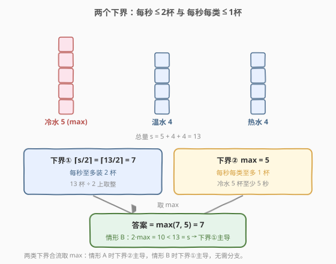
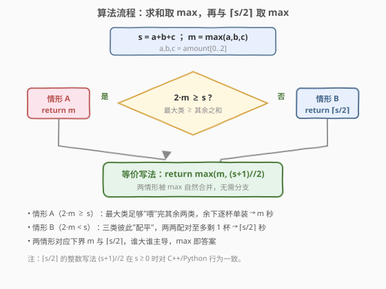
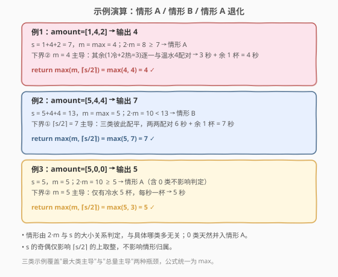

# 装满杯子需要的最短总时长

- **题目名称**：装满杯子需要的最短总时长
- **链接**：[2335. 装满杯子需要的最短总时长](https://leetcode.cn/problems/minimum-amount-of-time-to-fill-cups/)
- **难度**：简单
- **标签**：贪心、数组、数学

## 1. 题目概述

一台饮水机可制备冷水、温水、热水。每秒钟你可以**二选一**：

- 装满 **2 杯不同类型** 的水；或
- 装满 **1 杯任意类型** 的水。

给你长度为 3 的数组 `amount`，`amount[0]/[1]/[2]` 分别表示要装满的冷水、温水、热水杯数。返回装满所有杯子所需的最少秒数。

**示例 1**：

```text
输入：amount = [1,4,2]
输出：4
解释：冷+温、温+热、温+热、温，共 4 秒。
```

**示例 2**：

```text
输入：amount = [5,4,4]
输出：7
```

**示例 3**：

```text
输入：amount = [5,0,0]
输出：5
解释：每秒一杯冷水。
```

**约束条件**：

- `amount.length == 3`
- $0 \le \text{amount}[i] \le 100$

> 💡 三类杯子、每秒至多两杯且必须不同类型——约束极简，容易让人想"逐秒模拟"。但真正精髓在两个**下界**的拼合：答案 $= \max(\max(\text{amount}),\, \lceil \text{sum}/2 \rceil)$，$O(1)$ 一步到位。

---

## 2. 解题思路

### 2.1 暴力思路：逐秒贪心模拟

最直白的做法：每一秒**排序后选当前数量最多的两类**，若都非零就各装一杯（装两杯不同类型）；否则只装一杯最多的。重复到全零。

```text
while sum(amount) > 0:
    sort desc
    if amount[1] > 0: amount[0] -= 1; amount[1] -= 1   # 两杯不同类
    else:            amount[0] -= 1                    # 只剩一类
    ans += 1
```

这一贪心模拟**本身就是最优的**（每秒尽量装两杯、且优先削平最高堆，证明见 2.2），复杂度 $O(\text{sum} \cdot 3\log 3) = O(\text{sum})$，sum ≤ 300 轻松 AC。

> ⚠️ 模拟虽对，却把 $O(\text{sum})$ 的逐秒过程背在身上，且未揭示"为什么这就是最少"。面试会被追问"能不能 $O(1)$"。关键观察：**答案完全由两个物理下界决定**，无需逐秒推演。

### 2.2 核心观察：两个下界 + 可达性



设 $s = a+b+c$（总杯数），$m = \max(a,b,c)$（最大类）。每秒的物理限制给出两个**下界**：

1. **每秒至多装 2 杯** → 秒数 $\ge \lceil s/2 \rceil$；
2. **每秒每类至多装 1 杯**（同一秒不能装两杯同类）→ 秒数 $\ge m$。

因此 **答案 $\ge \max(m,\, \lceil s/2 \rceil)$**。下面证明这个下界**总能取到**（可达），分两种情形：

**情形 A：$2m \ge s$（最大类 $\ge$ 其余两类之和）**。把其余两类的杯子逐一与最大类配对（每次 1 杯最大类 + 1 杯其余），共耗 $s - m$ 秒；此时最大类还剩 $m - (s-m) = 2m - s \ge 0$ 杯，只能逐杯单独装，再耗 $2m - s$ 秒。合计 $= (s-m) + (2m-s) = m$。恰达下界 $m$。

**情形 B：$2m < s$（最大类 $<$ 其余两类之和）**。可把杯子**两两配对**直到至多剩 1 杯，即用 $\lfloor s/2 \rfloor$ 次"装两杯"加 $(s \bmod 2)$ 次"装一杯"，共 $\lceil s/2 \rceil$ 秒。可行性来自贪心"每秒削平最高两堆"：因 $2m < s$，每步从两个最大各减 1，最大值不增、总量减 2，**不变式 $2\cdot\max \le \text{剩余总量}$ 始终保持**——故直到剩余 ≤1 杯前永远有两类非零可配对，至多最后 1 杯单装。恰达下界 $\lceil s/2 \rceil$。

> 💡 两种情形合流：**答案 $= \max(m,\, \lceil s/2 \rceil)$**。情形 A 下界②主导（$m \ge \lceil s/2\rceil$），情形 B 下界①主导。无需分支判断——取 max 即可。

### 2.3 算法流程图



四步：求 $s$ → 求 $m$ → 算 $\lceil s/2\rceil = (s+1)//2$ → 返回 $\max(m,\, (s+1)//2)$。两条分支对应情形 A/B，但代码层面被 `max` 自然合并。

### 2.4 示例演算



| 输入 | $s$ | $m$ | $2m$ vs $s$ | 情形 | $\lceil s/2\rceil$ | $\max$ | 输出 |
|------|-----|-----|-------------|------|---------------------|--------|------|
| `[1,4,2]` | 7 | 4 | $8 \ge 7$ | A | 4 | $\max(4,4)$ | `4` |
| `[5,4,4]` | 13 | 5 | $10 < 13$ | B | 7 | $\max(5,7)$ | `7` |
| `[5,0,0]` | 5 | 5 | $10 \ge 5$ | A | 3 | $\max(5,3)$ | `5` |

注意例 3：虽有 0 类，仍落入情形 A（最大类独大），答案由 $m=5$ 主导；空类不影响公式。

---

## 3. 参考代码

### C++

```cpp
class Solution {
public:
    int fillCups(vector<int>& amount) {
        int s = amount[0] + amount[1] + amount[2];
        int m = max({amount[0], amount[1], amount[2]});
        return max(m, (s + 1) / 2);
    }
};
```

> 💡 `max({a,b,c})` 用 initializer_list 重载；`(s+1)/2` 即 $\lceil s/2\rceil$ 的整数写法。$s \le 300$，`int` 无溢出。

### Python

```python
class Solution:
    def fillCups(self, amount: List[int]) -> int:
        s = sum(amount)
        m = max(amount)
        return max(m, (s + 1) // 2)
```

> ⚠️ Python `//` 对非负数与 C++ `/` 行为一致；`amount` 元素均非负，无需处理负数取整差异。

---

## 4. 复杂度分析

| 维度 | 复杂度 | 说明 |
|------|--------|------|
| **时间复杂度** | $O(1)$ | 求和、求 max、一次除法，均为常数操作（长度恒为 3） |
| **空间复杂度** | $O(1)$ | 仅用常数个变量 |
| 对照：逐秒贪心模拟 | $O(\text{sum})$ / $O(1)$ | 每秒一次排序（$3\log 3$），sum ≤ 300；正确但逐秒推进 |

> 💡 严格说时间是 $O(1)$：输入长度恒为 3，且与 $\text{amount}[i]$ 的大小无关。即便元素放大到 $10^9$，本解法依旧常数次完成，而模拟会爆炸。

---

## 5. 扩展：下界论证 + 可达性范式

本题是"**每步容量受限的批量处理**"求最短步数的 $k=2$ 特例。通用范式 = **列出每步物理上界导出的所有下界，再构造证明 $\max$ 这些下界可达**。

- **下界①**（总量 ÷ 每步吞吐）：$s/2$；
- **下界②**（瓶颈类别容量）：$m$；
- 答案 $=\max(①,②)$，对应"瓶颈在吞吐" vs "瓶颈在某类"。

同范式的招牌题是 [621. 任务调度器](https://leetcode.cn/problems/task-scheduler/)：CPU 每轮 $n+1$ 个槽、同类任务需冷却 $n$，求最短调度。它同样有两个下界——总任务数 $\text{len}$、最高频任务撑起的框架 $(\text{mx}-1)(n+1)+c$——答案 $= \max(\text{len},\, (\text{mx}-1)(n+1)+c)$。两题结构同构：把"每步容量"与"同类冷却"换成"每秒 2 杯"与"每类 1 杯"即可。

> 💡 抽象经验：见到"每步处理 $\le k$ 个、且有排他约束"的求最短步数，先写**下界清单**，再各构造一个达到该下界的方案——往往 $\max$ 就是答案，省去模拟。

---

## 6. 面试要点

1. **为什么 $\max(m,\, \lceil s/2 \rceil)$ 是下界？**

   - 每秒至多装 2 杯 $\Rightarrow$ 秒数 $\ge \lceil s/2 \rceil$；
   - 同一秒不能装两杯同类 $\Rightarrow$ 每类 $x$ 杯至少 $x$ 秒 $\Rightarrow$ 秒数 $\ge m = \max$。
   - 两个下界同时成立，故答案 $\ge \max(m,\, \lceil s/2 \rceil)$。

2. **为什么情形 A（$2m \ge s$）能取到 $m$？**

   - 其余两类和 $= s - m \le m$，把它们逐杯与最大类配对，用 $s-m$ 秒；
   - 最大类还剩 $m - (s-m) = 2m - s \ge 0$ 杯，逐杯单装，再用 $2m - s$ 秒；
   - 合计 $(s-m) + (2m-s) = m$，恰达下界。

3. **为什么情形 B（$2m < s$）能取到 $\lceil s/2 \rceil$？**

   - 贪心"每秒削平最高两堆"保持不变式 $2\cdot\max \le \text{剩余总量}$（每步从两个最大各减 1，最大值不增、总量减 2）；
   - 故直到剩余 ≤1 杯前永远有两类非零可配对，至多最后 1 杯单装；
   - 用 $\lfloor s/2 \rfloor$ 次双杯 + $(s \bmod 2)$ 次单杯 = $\lceil s/2 \rceil$ 秒，恰达下界。

4. **含 0 类时公式还成立吗？**

   - 成立。0 类不参与配对，$s$、$m$ 照常计算；$2m \ge s$ 仍判定为情形 A（如 `[5,0,0]`，$2\cdot5 \ge 5$），答案 $=m$。
   - 无需对 0 类特判，`(s+1)//2` 与 `max` 自动处理。

5. **逐秒模拟和公式谁更优？**

   - 都正确且最优。模拟 $O(\text{sum})$ 揭示"怎么装"，公式 $O(1)$ 揭示"为什么是这么多"。
   - 面试先给公式（体现洞察），再用模拟解释可达性构造，二者互补。

> 💡 **一句话总结**：每秒至多 2 杯给下界 $\lceil s/2\rceil$，每类每秒至多 1 杯给下界 $m$；证明两者皆可达后，答案即 $\max(m,\, \lceil s/2\rceil)$——$O(1)$ 的下界拼合。

---

## 7. 同类练习题

- [621. 任务调度器](https://leetcode.cn/problems/task-scheduler/)：同"每步受限求最短步数"的下界取 max 范式——答案 = max(总任务数, (最高频-1)(n+1)+同频任务数)，结构同构
- [881. 救生艇](https://leetcode.cn/problems/boats-to-save-people/)：每船至多 2 人 + 重量约束，排序后双指针贪心配对，与本题"两两配对削平最高堆"同源
- [2310. 个位数字为 K 的整数之和](../2301-2400/2310_个位数字为K的整数之和.md)：本库同区间题，同为"看似搜索/模拟、实则 $O(1)$ 闭式"的降维思路
