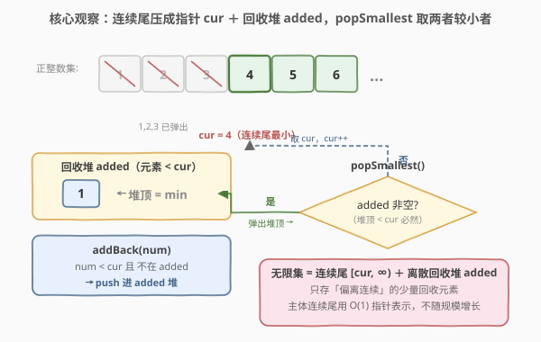
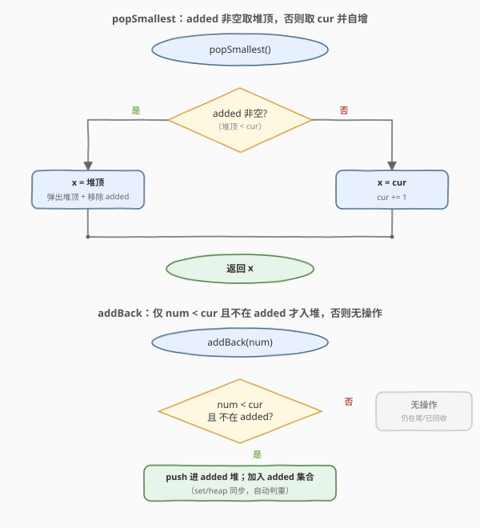
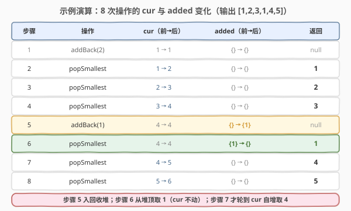

# LeetCode 无限集中的最小数字 题解

## 1. 题目概述

- **标题 / 题号**：无限集中的最小数字（#2336，medium）
- **链接**：https://leetcode.cn/problems/smallest-number-in-infinite-set/
- **难度**：中等
- **标签**：设计、堆、有序集合

**题意**：现有一个包含**所有正整数**的集合 $[1, 2, 3, 4, 5, \ldots]$。实现 `SmallestInfiniteSet` 类：

- `SmallestInfiniteSet()` 初始化对象以包含**所有**正整数。
- `int popSmallest()` **移除**并返回无限集中最小的整数。
- `void addBack(int num)` 若正整数 `num` **不**存在于集合中，则将一个 `num` **添加**回集合。

**示例**：

```text
输入：
["SmallestInfiniteSet", "addBack", "popSmallest", "popSmallest", "popSmallest", "addBack", "popSmallest", "popSmallest", "popSmallest"]
[[], [2], [], [], [], [1], [], [], []]
输出：
[null, null, 1, 2, 3, null, 1, 4, 5]

解释：
SmallestInfiniteSet s = new SmallestInfiniteSet();  // {1,2,3,4,5,...}
s.addBack(2);        // 2 已在集合中，无变化
s.popSmallest();     // 返回 1，集合变为 {2,3,4,5,...}
s.popSmallest();     // 返回 2，集合变为 {3,4,5,...}
s.popSmallest();     // 返回 3，集合变为 {4,5,6,...}
s.addBack(1);        // 1 已不在集合中，加回，集合变为 {1,4,5,6,...}
s.popSmallest();     // 返回 1（从回收堆取），集合变为 {4,5,6,...}
s.popSmallest();     // 返回 4，集合变为 {5,6,7,...}
s.popSmallest();     // 返回 5，集合变为 {6,7,8,...}
```

**约束**：

- $1 \le \text{num} \le 1000$
- 最多调用 `popSmallest` 和 `addBack` 共计 $1000$ 次

> 💡 集合「无限」是障眼法——真正被弹出的连续段只有有限长，剩余永远是 $[\text{cur}, \text{cur}+1, \ldots]$ 的连续尾。把「连续尾」压缩成一个指针 `cur`，再单独用一个**回收堆**收容 `addBack` 重新插回来的少量离散元素，`popSmallest` 取两者较小即可，$O(\log n)$ 完成。

## 2. 解题思路

### 2.1 暴力思路：布尔数组 + 线性扫描

最直白的做法：维护一个足够大的布尔数组 `present[i]`（或哈希集合）标记每个正整数是否在集合中，初值全为 `true`。

- `popSmallest`：从 $1$ 开始**线性扫描**第一个 `present[i]==true` 的 $i$，置 `false`，返回 $i$；
- `addBack(num)`：`present[num] = true`。

约束 $1 \le \text{num} \le 1000$、调用 $\le 1000$ 次，所以 `cur` 至多增长到 $\approx 2000$，数组开到 $2005$ 即可。每次 `popSmallest` 最坏 $O(2000)$，总计 $\approx 10^6$ 次操作轻松 AC。

> ⚠️ 暴力虽对，却把整个集合**显式存储**——「无限集」被拍成 $2000$ 长的数组，$O(U)$ 的扫描既浪费空间也掩盖了结构。面试会被追问：「集合是无限的，能不能不存无限？」

### 2.2 核心观察：无限尾指针 + 回收堆



关键观察：**`popSmallest` 永远按 $1,2,3,\ldots$ 的顺序弹**（因为每次都取最小）。因此任意时刻，已被弹出的连续段恰是 $1, 2, \ldots, \text{cur}-1$ 的一段前缀，剩余无限集的「主干部」永远是连续尾 $[\text{cur}, \text{cur}+1, \ldots, \infty)$——只需一个指针 `cur` 即可表示，无需存储！

唯一会「偏离连续」的，是 `addBack` 把某个已弹出的 `num` 重新塞回来——这些 `num` 都满足 $\text{num} < \text{cur}$，数量少且离散。用一个**回收堆** `added`（C++ `std::set` / Python `heapq`+`set`）收容它们即可：

- **`popSmallest()`**：若 `added` 非空，其堆顶必 $< \text{cur}$，是全局最小 → 弹出并返回；否则返回 `cur` 并 `cur += 1`（吃掉连续尾的最前端）。
- **`addBack(num)`**：仅当 $\text{num} < \text{cur}$（已被弹出过）且不在 `added` 时，入堆；$\text{num} \ge \text{cur}$ 时它本就在连续尾里，**无操作**。

> 💡 不变式：`added` 中所有元素严格 $< \text{cur}$。因为 `addBack` 只收 $\text{num}<\text{cur}$ 的，而 `cur` 只增不减，旧元素始终 $< \text{cur}$。这保证「`added` 非空 ⇒ 堆顶是全局最小」，两路取 `min` 的正确性由此奠定。

### 2.3 算法流程图



`popSmallest` 是一个二选一：`added` 非空走堆顶分支，否则走 `cur` 自增分支。`addBack` 是一个合并判定：`num < cur` 且不在 `added` 两关都过才入堆，否则无操作（要么仍在连续尾里、要么已被回收）。两条流程都不显式遍历无限集。

### 2.4 示例演算



| 步骤 | 操作 | cur（前→后） | added（前→后） | 返回 |
|------|------|--------------|----------------|------|
| 1 | `addBack(2)` | $1 \to 1$ | $\{\} \to \{\}$ | `null` |
| 2 | `popSmallest` | $1 \to 2$ | $\{\} \to \{\}$ | `1` |
| 3 | `popSmallest` | $2 \to 3$ | $\{\} \to \{\}$ | `2` |
| 4 | `popSmallest` | $3 \to 4$ | $\{\} \to \{\}$ | `3` |
| 5 | `addBack(1)` | $4 \to 4$ | $\{\} \to \{1\}$ | `null` |
| 6 | `popSmallest` | $4 \to 4$ | $\{1\} \to \{\}$ | `1` |
| 7 | `popSmallest` | $4 \to 5$ | $\{\} \to \{\}$ | `4` |
| 8 | `popSmallest` | $5 \to 6$ | $\{\} \to \{\}$ | `5` |

注意步骤 6：`cur=4` 不动，最小值来自回收堆 `added` 顶部的 $1$（$1 < 4$），故返回 $1$ 而非 $4$；步骤 7 才轮到 `cur` 自增取 $4$。两路来源在此交替。

## 3. 参考代码

### C++

```cpp
class SmallestInfiniteSet {
    int cur = 1;            // 连续无限尾的最小值，初值 1
    set<int> added;         // 回收堆：所有 < cur 且被 addBack 回来的数（自动有序、去重）
public:
    SmallestInfiniteSet() {}

    int popSmallest() {
        if (!added.empty()) {                 // 回收堆非空 → 堆顶 < cur，是全局最小
            int x = *added.begin();
            added.erase(added.begin());
            return x;
        }
        return cur++;                         // 否则吃掉连续尾最前端
    }

    void addBack(int num) {
        if (num < cur) {                      // 只有已被弹出的数才需要回收
            added.insert(num);               // set 自动去重；num >= cur 时已在尾中，无操作
        }
    }
};
```

> 💡 `std::set` 同时承担「有序（`begin()` 即最小）」与「去重」两职，比手写 `priority_queue` + `unordered_set` 更省心。若改用 `priority_queue`，需额外哈希集合判重或惰性跳过重复堆顶。

### Python

```python
import heapq


class SmallestInfiniteSet:

    def __init__(self):
        self.cur = 1                  # 连续无限尾的最小值
        self.added = set()            # 回收堆成员判重
        self.heap = []                # 回收堆（最小堆），与 added 同步

    def popSmallest(self) -> int:
        if self.heap:                 # 回收堆非空 → 堆顶 < cur
            x = heapq.heappop(self.heap)
            self.added.discard(x)
            return x
        x = self.cur
        self.cur += 1
        return x

    def addBack(self, num: int) -> None:
        if num < self.cur and num not in self.added:
            self.added.add(num)
            heapq.heappush(self.heap, num)
```

> ⚠️ Python 无内置有序集合，用「`heap` 取最小 + `set` 判重」组合实现 `std::set` 的功能。由于 `addBack` 先查 `added` 再入堆，堆中不会出现重复；`popSmallest` 同步移除 `added` 成员，二者始终一致。

## 4. 复杂度分析

| 维度 | 复杂度 | 说明 |
|------|--------|------|
| **时间**（单次操作） | $O(\log n)$ | `popSmallest` 与 `addBack` 各一次堆/有序集合操作，$n$ 为当前回收堆大小 |
| **空间** | $O(n)$ | 仅存回收堆 `added`，$n$ 为同时驻留的回收元素数；连续尾用 $O(1)$ 的 `cur` 表示，不随集合规模增长 |
| 对照：布尔数组 | $O(U)$ / $O(U)$ | `popSmallest` 线性扫描到 $\approx 2000$；空间需开 $O(U)$ 数组，正确但臃肿 |

> 💡 上界：`addBack` 只回收 $<\text{cur}$ 的数，而 `cur` 至多增至 $\approx 2000$，故 $n \le 1000$；实际最坏 $n$ 远小于调用次数——多数 `addBack` 命中已被回收或仍在尾中，不入堆。

## 5. 扩展：用「指针 + 偏差集」压缩无限/稀疏结构

本题是「**理想连续态 + 少量偏差**」压缩范式的小品：理想的无限集是连续的 $1,2,3,\ldots$，用一个指针 `cur` 代表；`addBack` 引入的离散回收元素是「偏差」，用小堆单独收纳。**只存偏差，不存主体**——空间与「偏离连续的程度」成正比，而与集合规模无关。

同范式的招牌是**数据流第 K 大**（[703](https://leetcode.cn/problems/kth-largest-element-in-a-stream/)）：维护一个容量 $K$ 的小顶堆，流中比堆顶大的才入堆、小的自然淘汰——堆大小恒为 $K$，用 $O(K)$ 空间跟踪「当前 Top-K」这一稀疏关注点，而非存全流。

> 💡 抽象经验：见到「维护一个巨大/无限集合 + 反复查询极值」的设计题，先问「主体是否连续/可参数化」——能压缩成一个指针或公式，就只把偏差显式存储，往往从 $O(U)$ 降到 $O(\text{偏差量})$。

## 6. 面试要点

1. **为什么连续尾用一个指针 `cur` 就够？**

   - `popSmallest` 每次取最小，必按 $1,2,3,\ldots$ 顺序弹出，所以已被弹出的恰是 $1 \sim \text{cur}-1$ 这段前缀；
   - 剩余主体恒为 $[\text{cur}, \text{cur}+1, \ldots)$ 连续尾，最小值即 `cur`，无需逐个存储。

2. **为什么 `added` 非空时堆顶一定是全局最小？**

   - 不变式：`added` 中元素恒 $< \text{cur}$（`addBack` 只收 $<\text{cur}$ 的，`cur` 只增不减，旧元素不失效）；
   - 故堆顶 $< \text{cur} \le$ 连续尾最小值，堆顶即全局最小，两路取 `min` 正确。

3. **`addBack(num)` 中 `num >= cur` 为何直接忽略？**

   - `num >= cur` 意味着 `num` 仍在连续尾 $[\text{cur},\infty)$ 里，本就存在于集合；
   - 「不存在才添加」的前提不满足，按题意无操作；若误入堆反而会破坏「`added` 元素 $< \text{cur}$」不变式。

4. **重复 `addBack` 同一个数会怎样？**

   - C++ `set::insert` 天然去重；Python 先查 `added` 集合再入堆，重复不入；
   - 故堆中无重复元素，`popSmallest` 不会把同一数返回两次。

5. **若把 `num` 上界去掉（任意大正整数）还成立吗？**

   - 成立。`cur` 可任意增长（用 `int`/`long` 即可），`added` 仍只收 $<\text{cur}$ 的回收元素；
   - 时间仍 $O(\log n)$、空间 $O(n)$，$n$ 为回收堆大小，与 `num` 上界无关——这正是「只存偏差」范式的威力。

> 💡 **一句话总结**：连续尾压成指针 `cur`，离散回收元素进小堆 `added`；`popSmallest` 在「堆顶」与 `cur` 间取较小者，$O(\log n)$ 维护一个无限集的最小值。

## 同类练习题

| # | 题目 | 与本题的关联 |
|---|------|-------------|
| 703 | [数据流中的第 K 大元素](https://leetcode.cn/problems/kth-largest-element-in-a-stream/) | 同「数据流 + 堆 + 设计」，容量 $K$ 的小顶堆跟踪流式 Top-K，与本题「指针 + 堆」跟踪无限集最小同属「用小顶结构维护流式极值」范式 |
| 295 | [数据流的中位数](https://leetcode.cn/problems/find-median-from-data-stream/) | 对顶双堆维护流式中位数，比本题单堆更复杂，但同源——「分桶 + 堆取极值」的设计题模板 |
| 729 | [我的日程安排 I](https://leetcode.cn/problems/my-calendar-i/) | 有序集合维护动态区间集合与重叠查询，对比「维护动态集合 + 查极值/边界」类设计题的有序结构选型 |
| 23 | [合并 K 个升序链表](https://leetcode.cn/problems/merge-k-sorted-lists/) | 小顶堆多路归并每次取堆顶最小，与本题 `popSmallest` 从堆顶取最小的堆用法同源 |
