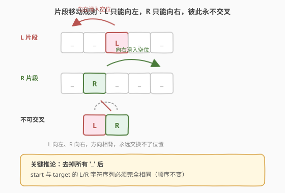
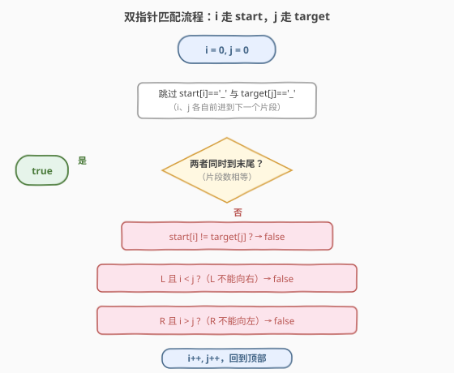
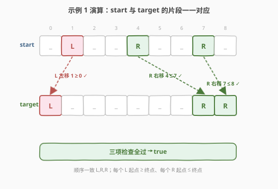

# LeetCode 移动片段得到字符串 题解

## 1. 题目概述

- **标题 / 题号**：移动片段得到字符串（#2337，medium）
- **链接**：https://leetcode.cn/problems/move-pieces-to-obtain-a-string/
- **难度**：中等
- **标签**：字符串、双指针

**题意**：给定两个长度均为 `n` 的字符串 `start` 和 `target`，只由字符 `'L'`、`'R'`、`'_'` 组成：

- `'L'` 和 `'R'` 表示片段。`'L'` 只有在其**左侧**直接是空位 `'_'` 时才能向**左**移动一格；`'R'` 只有在其**右侧**直接是空位 `'_'` 时才能向**右**移动一格。
- `'_'` 表示空位，可被任意片段占据。

每次可移动任意一个片段，移动次数不限。判断能否由 `start` 得到 `target`。

**示例 1**：

```text
输入：start = "_L__R__R_", target = "L______RR"
输出：true
解释：
- 第一个片段 L 向左一步：  "_L__R__R_" -> "L___R__R_"
- 最后一个片段 R 向右一步："L___R__R_" -> "L___R___R"
- 第二个片段 R 向右三步："L___R___R"  -> "L______RR"
```

**示例 2**：

```text
输入：start = "R_L_", target = "__LR"
输出：false
```

**示例 3**：

```text
输入：start = "_R", target = "R_"
输出：false
```

**约束**：

- `n == start.length == target.length`
- `1 <= n <= 10^5`
- `start` 和 `target` 由字符 `'L'`、`'R'` 和 `'_'` 组成

## 2. 解题思路

### 2.1 暴力思路：BFS 搜索所有可达状态

最直白的做法是把每个字符串配置当作一个状态，从 `start` 出发做 BFS：每一步枚举所有可移动的 `L`/`R`，向空位滑动一格得到新状态，直到出现 `target` 或队列空。

问题在于状态空间极大——长度 `n` 的串每个位置 3 种字符，理论配置数高达 $3^n$，对 $n=10^5$ 完全不可行。必须找到**不模拟、只判定**的充要条件。

### 2.2 核心观察：片段不能交叉，方向决定位置

抓住两条不变量，把"能否到达"降维成"三个属性是否一致"：



1. **顺序不变**：`'L'` 只能左移、`'R'` 只能右移，两个片段方向相背、**永远无法越过对方**。因此片段的相对顺序恒定——把 `start` 与 `target` 里所有 `'_'` 抹掉，剩下的 `L/R` 字符序列**必须完全相同**。

2. **位置受限**：把 `start` 中的第 $k$ 个片段与 `target` 中第 $k$ 个片段配对（顺序保证了一一对应）：
   - 若是 `L`：它只能向左走，故 `start` 中的下标必须 $\ge$ `target` 中的下标（`i >= j`）。若 `i < j` 说明它要往右，做不到。
   - 若是 `R`：它只能向右走，故 `start` 中的下标必须 $\le$ `target` 中的下标（`i <= j`）。

> 💡 **为何这三条是充分的？** 每个 `L` 只向左吞空位、每个 `R` 只向右吞空位，方向相背、互不阻塞；固定顺序保证任意两片段之间"靠左的那个若要移动必是向右的 R、靠右的那个若要移动必是向左的 L"，二者背道而驰。因此每个片段都能独立地一步步滑到目标位，途中所需空位不会被同向片段长期占用（它们最终也会离开）。详细构造见第 5 节。

于是算法蜕化为：两个指针 `i`（走 `start`）、`j`（走 `target`），各自跳过 `'_'`，逐个比对片段的**身份**与**位置**即可。

### 2.3 算法流程图



### 2.4 示例演算

以示例 1 为例，三条判据逐一通过：



| 配对 | start 位 i | target 位 j | 片段 | 判据 | 结果 |
|------|-----------|-------------|------|------|------|
| 1 | 1 | 0 | L | i(1) ≥ j(0)，可左移 | ✓ |
| 2 | 4 | 7 | R | i(4) ≤ j(7)，可右移 | ✓ |
| 3 | 7 | 8 | R | i(7) ≤ j(8)，可右移 | ✓ |

顺序 `L,R,R` 两边一致，三个片段位置全部满足方向约束 → 返回 `true`。

再看示例 2：`start="R_L_"` 去掉 `'_'` 得 `RL`，`target="__LR"` 去掉 `'_'` 得 `LR`，顺序已不同（`R,L` vs `L,R`）→ 直接 `false`，连位置都不必查。示例 3：`start="_R"` 的 `R` 在位 1、`target="R_"` 的 `R` 在位 0，`i(1) > j(0)` 但 `R` 不能向左 → `false`。

## 3. 参考代码

### C++

```cpp
class Solution {
public:
    bool canChange(string start, string target) {
        int n = start.size();
        int i = 0, j = 0;
        while (i < n || j < n) {
            while (i < n && start[i] == '_') i++;      // 跳过 start 的空位
            while (j < n && target[j] == '_') j++;    // 跳过 target 的空位
            if (i == n || j == n) return i == n && j == n; // 必须同时到末尾（片段数相等）
            if (start[i] != target[j]) return false;       // 身份/顺序必须一致
            if (start[i] == 'L' && i < j) return false;     // L 只能左移，不能向右
            if (start[i] == 'R' && i > j) return false;     // R 只能右移，不能向左
            i++;
            j++;
        }
        return true;
    }
};
```

### Python

```python
class Solution:
    def canChange(self, start: str, target: str) -> bool:
        n = len(start)
        i = j = 0
        while i < n or j < n:
            while i < n and start[i] == '_':
                i += 1                       # 跳过 start 的空位
            while j < n and target[j] == '_':
                j += 1                       # 跳过 target 的空位
            if i == n or j == n:
                return i == n and j == n     # 必须同时到末尾（片段数相等）
            if start[i] != target[j]:
                return False                 # 身份/顺序必须一致
            if start[i] == 'L' and i < j:
                return False                 # L 只能左移，不能向右
            if start[i] == 'R' and i > j:
                return False                 # R 只能右移，不能向左
            i += 1
            j += 1
        return True
```

> ⚠️ 注意 `if (i == n || j == n) return i == n && j == n;` 这一行：它**同时**处理了"片段数量不等"和"两者恰好都走完"两种情况。若只有一个到末尾（说明一方片段多/少），返回 `false`；若同时到末尾，返回 `true`。漏写会导致末尾的 `'_'` 判定出错。

## 4. 复杂度分析

| 维度 | 复杂度 | 说明 |
|------|--------|------|
| 时间复杂度 | $O(n)$ | `i`、`j` 各至多扫描一次字符串，总推进步数不超过 $2n$ |
| 空间复杂度 | $O(1)$ | 只用常数个指针变量，无额外数据结构 |

> 💡 虽然代码里有两层 `while`，但**均摊**来看每个字符至多被 `i` 访问一次、被 `j` 访问一次，所以总时间仍是线性。与 BFS 暴力的指数级形成对比。

## 5. 扩展：为何三条判据是充分的

上面论证了三条判据是**必要**的（违反任一条必然到达不了），这里补一段**充分性**的构造性说明，证明三条件成立时一定能凑出 `target`。

**核心：片段移动互不阻塞。** 把 `start` 中第 $k$ 个片段记为 $S_k$，`target` 中对应片段记为 $T_k$（顺序一致保证配对唯一）。

- **同向片段之间**：两个 `L` 都向左吞空位。若 $S_a$ 在 $S_b$ 左边，则 $T_a$ 也在 $T_b$ 左边（顺序不变），$S_a$ 先到位后，$S_b$ 向左滑经过的区域只会是空位或 $S_a$ 已离开的位置，不会被卡住；`R` 同理（镜像，向右）。
- **异向片段之间**：`R` 在左、`L` 在右时，`R` 向右、`L` 向左，二者**背道而驰**，只会越离越远，绝不冲突。而"`L` 在左、`R` 在右"时，左边的 `L` 往左走、右边的 `R` 往右走，同样相背，互不抢占空位。

因此可按任意顺序（例如从左到右）逐个把片段滑到目标位：每个片段从 $S_k$ 走到 $T_k$ 途经的格子，要么本是空位，要么被"迟早也会离开、且离开方向不挡路"的同向片段占据。一步步平移即可，空位永远够用。$\square$

> 💡 这本质上是 [777. 在LR字符串中交换相邻字符](https://leetcode.cn/problems/swap-adjacent-in-lr-string/) 的推广：777 每次"交换相邻的 XL→LX / RX→XR"（一步跨一格空位），2337 允许一步跨任意多格空位，但充要判据完全一致——顺序相同 + 方向位置约束。

## 6. 面试要点

1. **为什么片段不能交换顺序？**
   - `L` 只向左、`R` 只向右，二者方向相背。要让两个片段"交叉"，必有一个要逆方向移动，规则不允许，所以相对顺序恒定。这是把问题降维的关键。

2. **为什么 `L` 要求 `i >= j`、`R` 要求 `i <= j`？**
   - `L` 在 `start` 的位 $i$、在 `target` 的位 $j$，它只能左移，故起点必在终点右边或同位，即 $i \ge j$；`R` 只能右移，故 $i \le j$。方向反了即不可达。

3. **两个指针同时跳 `'_'` 后，为什么要检查"同时到末尾"？**
   - 控制片段数量相等。若一方还有片段、另一方已无，说明片段数不同，必然不可达——哪怕顺序的前缀都对得上，多出的片段无处安放。

4. **能否用双指针从右往左扫？**
   - 可以，对称地：`L` 从右往左配对应满足 `i >= j` 不变，`R` 应满足 `i <= j`，方向判定与从左扫一致，只是指针起止颠倒。两种扫法等价。

5. **和 777 题的关系？**
   - 777 每次只能让片段跨**一格**空位（`XL→LX`、`RX→XR`）；2337 允许跨**任意格**空位。但"能否到达"的充要条件相同，因此代码可以照搬本题的双指针判据。2337 更宽松，反而更好证充分性（步子大，构造更自由）。

6. **可能的坑？**
   - 忘记处理"两边都只剩 `'_'` 的尾部"——必须用"同时到末尾"的判定兜住，否则会把 `start="_"`、`target="_"` 这类判错。
   - 把 `L`/`R` 的方向判据写反（`L` 误用 `i <= j`），易在示例 3 这类边界翻车。

## 同类练习题

| # | 题目 | 与本题的关联 |
|---|------|-------------|
| 777 | [在LR字符串中交换相邻字符](https://leetcode.cn/problems/swap-adjacent-in-lr-string/)（[题解](../0701-0800/777_在LR字符串中交换相邻字符.md)） | 与本题完全同构，L 左移 / R 右移不可交叉，2337 是其"一步跨多格"的推广 |
| 844 | [比较含退格的字符串](https://leetcode.cn/problems/backspace-string-compare/)（[题解](../0801-0900/844_比较含退格的字符串.md)） | 双指针判定两字符串经变换后是否相等，同类"不模拟、只判定等价性"思路 |
| 283 | [移动零](https://leetcode.cn/problems/move-zeroes/)（[题解](../0201-0300/283_移动零.md)） | 双指针按方向约束把零挪到末尾，"按规则移动元素"的姊妹题 |
| 925 | [长按键入](https://leetcode.cn/problems/long-pressed-name/)（[题解](../0901-1000/925_长按键入.md)） | 双指针逐字符比对、处理重复段，字符串等价性判定的另一变体 |
