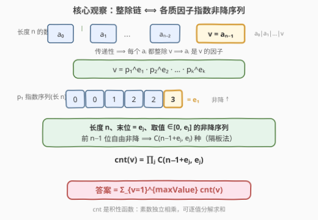
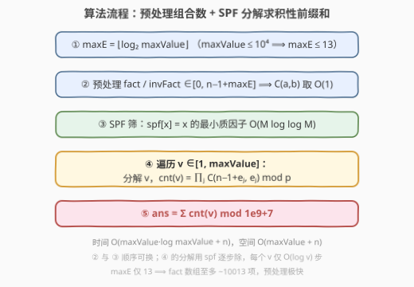
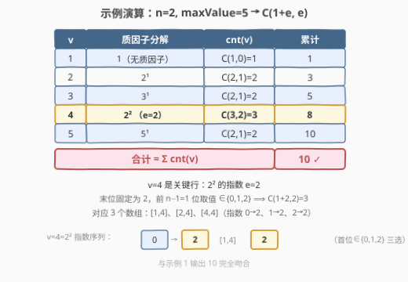

# 统计理想数组的数目

- **题目名称**：统计理想数组的数目
- **链接**：[2338. 统计理想数组的数目](https://leetcode.cn/problems/count-the-number-of-ideal-arrays/)
- **难度**：困难
- **标签**：数学、动态规划、组合数学、数论

## 1. 题目概述

给定两个整数 `n` 和 `maxValue`。一个长度为 `n` 的下标从 0 开始的整数数组 `arr` 是**理想数组**，当且仅当：

- 每个 `arr[i]` 取值在 $[1, \text{maxValue}]$ 内；
- 对任意 $0 < i < n$，`arr[i]` 能被 `arr[i-1]` 整除，即 $\text{arr}[i] \bmod \text{arr}[i-1] = 0$。

返回不同理想数组的数目，对 $10^9+7$ 取余。

**示例 1**：

```text
输入：n = 2, maxValue = 5
输出：10
解释：
  以 1 开头(5 个)：[1,1]、[1,2]、[1,3]、[1,4]、[1,5]
  以 2 开头(2 个)：[2,2]、[2,4]
  以 3 开头(1 个)：[3,3]
  以 4 开头(1 个)：[4,4]
  以 5 开头(1 个)：[5,5]
  共 5+2+1+1+1 = 10 个
```

**示例 2**：

```text
输入：n = 5, maxValue = 3
输出：11
解释：
  以 1 开头(9 个)：[1,1,1,1,1]；含一个 2 的 4 个；含一个 3 的 4 个
  以 2 开头(1 个)：[2,2,2,2,2]
  以 3 开头(1 个)：[3,3,3,3,3]
  共 9+1+1 = 11 个
```

**约束条件**：

- $2 \le n \le 10^4$
- $1 \le \text{maxValue} \le 10^4$

> 💡 **关键信号**：整除关系 $\text{arr}[i-1] \mid \text{arr}[i]$ 构成一条**整除链**。链上每个元素都整除最后一个元素（传递性），于是数组的"形状"完全由末元素 `v` 的**质因子分解**决定——每个质因子的指数沿链**非降**，可用隔板法独立计数。这正是组合数学 + 数论的经典结合点。

---

## 2. 解题思路

### 2.1 暴力思路：倍数 DP

最自然的 DP：令 $dp[i][v]$ 表示长度为 $i$、末元素为 $v$ 的理想数组数。

- **初值**：$dp[1][v] = 1$（$v \in [1,\text{maxValue}]$）。
- **转移**：$\text{arr}[i-1] \mid \text{arr}[i]$ 意味着前一位取 $v$ 的任一**因子** $u$（$u \mid v$）：

$$dp[i][v] = \sum_{u \mid v} dp[i-1][u]$$

实现时按倍数枚举：对每个 $u$，把它对 $dp[i][2u], dp[i][3u], \dots$ 的贡献累加，单层工作量 $\sum_{u=1}^{\text{maxValue}} \lfloor \text{maxValue}/u \rfloor \approx \text{maxValue} \cdot \ln(\text{maxValue})$。

> ⚠️ **复杂度陷阱**：总时间为 $O(n \cdot \text{maxValue} \cdot \ln(\text{maxValue}))$。代入 $n=\text{maxValue}=10^4$ 约 $9.2 \times 10^8$ 次操作，**严重超时**。问题出在 $n$ 这一维被逐层展开——而它其实有闭式解。需要把"沿链的 $n$ 步递推"压缩成一步组合计数。

### 2.2 核心观察：整除链 → 指数非降 → 隔板法计数



**第一步：链上每个元素都整除末元素。** 由 $\text{arr}[0] \mid \text{arr}[1] \mid \cdots \mid \text{arr}[n-1] = v$ 的传递性，$\text{arr}[i] \mid v$ 对所有 $i$ 成立。于是每个 $\text{arr}[i]$ 都是 $v$ 的因子。

**第二步：拆成各质因子独立的指数序列。** 设 $v = p_1^{e_1} p_2^{e_2} \cdots p_k^{e_k}$。每个 $\text{arr}[i] = \prod_j p_j^{a_{i,j}}$，其中 $0 \le a_{i,j} \le e_j$。整除 $\text{arr}[i-1] \mid \text{arr}[i]$ 等价于每个质因子的指数**非降**：

$$a_{0,j} \le a_{1,j} \le \cdots \le a_{n-1,j} = e_j$$

（末位固定为 $e_j$，因为 $\text{arr}[n-1]=v$。）

**第三步：隔板法数单个质因子。** 对质因子 $p_j$（指数 $e_j$），需要一条长 $n$、取值 $\in [0, e_j]$、末位 $= e_j$ 的非降序列。由于末位已固定，只需确定前 $n-1$ 位——它们组成一条长 $n-1$、取值 $\in \{0,1,\dots,e_j\}$ 的非降序列。这等价于从 $e_j+1$ 种值里**可重复地选 $n-1$ 个**（非降排列即多重集），由**隔板法**得：

$$\binom{(n-1) + (e_j+1) - 1}{n-1} = \binom{n-1+e_j}{n-1} = \binom{n-1+e_j}{e_j}$$

**第四步：质因子独立相乘。** 各质因子的指数序列互不约束，故末元素为 $v$ 的理想数组数为：

$$\text{cnt}(v) = \prod_{p_j^{e_j} \| v} \binom{n-1+e_j}{e_j}$$

> 💡 $\text{cnt}$ 是一个**积性函数**：当 $\gcd(a,b)=1$ 时 $\text{cnt}(ab) = \text{cnt}(a)\,\text{cnt}(b)$（因为 $a,b$ 的质因子集合不相交，乘积拆开即得）。最终答案为所有末元素求和：

$$\text{ans} = \sum_{v=1}^{\text{maxValue}} \text{cnt}(v) \bmod (10^9+7)$$

### 2.3 算法流程图



五步：求 $\text{maxE}$（指数上界）→ 预处理阶乘/逆阶乘使组合数 $O(1)$ → SPF 筛求最小质因子 → 逐值分解并累乘 $\binom{n-1+e_j}{e_j}$ → 求和取模。

> ⚠️ **指数上界**：$\text{maxValue} \le 10^4$，故 $2^{13}=8192 \le 10^4 < 2^{14}$，任意质因子的指数 $e \le 13$。因此组合数只需预处理到 $n-1+13$（约 $10012$），开销极小。

### 2.4 示例演算



以示例 1（$n=2, \text{maxValue}=5$）为例，此时 $\binom{n-1+e}{e} = \binom{1+e}{e}$：

| $v$ | 质因子分解 | $\text{cnt}(v)$ | 累计 |
|-----|-----------|------------------|------|
| 1 | 1（无质因子） | $\binom{1}{0}=1$ | 1 |
| 2 | $2^1$ | $\binom{2}{1}=2$ | 3 |
| 3 | $3^1$ | $\binom{2}{1}=2$ | 5 |
| 4 | $2^2$ | $\binom{3}{2}=3$ | 8 |
| 5 | $5^1$ | $\binom{2}{1}=2$ | **10** |

关键是 $v=4=2^2$ 这一行：指数 $e=2$，末位固定为 $2$，前 $n-1=1$ 位取值 $\in\{0,1,2\}$ 三选一，得 $\binom{3}{2}=3$，对应 $[1,4], [2,4], [4,4]$（指数 $0\to2, 1\to2, 2\to2$）。合计 $10$，与示例吻合。

---

## 3. 参考代码

### C++

```cpp
class Solution {
public:
    int idealArrays(int n, int maxValue) {
        const long long MOD = 1e9 + 7;

        // maxE = floor(log2(maxValue))：所有质因子指数的上界
        int maxE = 0;
        while ((1 << (maxE + 1)) <= maxValue) maxE++;

        // 预处理阶乘与逆阶乘，范围 [0, n-1+maxE]
        int maxN = n - 1 + maxE;
        vector<long long> fact(maxN + 1), invFact(maxN + 1);
        fact[0] = 1;
        for (int i = 1; i <= maxN; i++) fact[i] = fact[i - 1] * i % MOD;

        auto powMod = [&](long long a, long long b) {
            long long r = 1; a %= MOD;
            while (b) {
                if (b & 1) r = r * a % MOD;
                a = a * a % MOD;
                b >>= 1;
            }
            return r;
        };
        invFact[maxN] = powMod(fact[maxN], MOD - 2);
        for (int i = maxN; i >= 1; i--) invFact[i - 1] = invFact[i] * i % MOD;

        auto C = [&](int a, int b) -> long long {
            if (b < 0 || b > a) return 0;
            return fact[a] * invFact[b] % MOD * invFact[a - b] % MOD;
        };

        // SPF 筛：spf[x] = x 的最小质因子
        vector<int> spf(maxValue + 1);
        iota(spf.begin(), spf.end(), 0);
        for (int i = 2; (long long)i * i <= maxValue; i++) {
            if (spf[i] == i) {
                for (int j = i * i; j <= maxValue; j += i)
                    if (spf[j] == j) spf[j] = i;
            }
        }

        long long ans = 0;
        for (int v = 1; v <= maxValue; v++) {
            long long res = 1;
            int x = v;
            while (x > 1) {
                int p = spf[x], e = 0;
                while (x % p == 0) { x /= p; e++; }
                res = res * C(n - 1 + e, e) % MOD;   // ∏ C(n-1+e_j, e_j)
            }
            ans = (ans + res) % MOD;                  // Σ cnt(v)
        }
        return (int)ans;
    }
};
```

> 💡 `iota` 给 `spf` 赋初值 `spf[x]=x`（自身）；筛时只把未被打过标记的 `spf[j]` 改成更小的 $i$，保证记录的是**最小**质因子。分解时反复取 `spf[x]` 连除，每个 $v$ 仅 $O(\log v)$ 步。

### Python

```python
class Solution:
    def idealArrays(self, n: int, maxValue: int) -> int:
        MOD = 10**9 + 7

        # maxE = floor(log2(maxValue))：所有质因子指数的上界
        maxE = 0
        while (1 << (maxE + 1)) <= maxValue:
            maxE += 1

        # 预处理阶乘与逆阶乘
        maxN = n - 1 + maxE
        fact = [1] * (maxN + 1)
        for i in range(1, maxN + 1):
            fact[i] = fact[i - 1] * i % MOD
        invFact = [1] * (maxN + 1)
        invFact[maxN] = pow(fact[maxN], MOD - 2, MOD)
        for i in range(maxN, 0, -1):
            invFact[i - 1] = invFact[i] * i % MOD

        def C(a: int, b: int) -> int:
            if b < 0 or b > a:
                return 0
            return fact[a] * invFact[b] % MOD * invFact[a - b] % MOD

        # SPF 筛：spf[x] = x 的最小质因子
        spf = list(range(maxValue + 1))
        for i in range(2, int(maxValue**0.5) + 1):
            if spf[i] == i:
                for j in range(i * i, maxValue + 1, i):
                    if spf[j] == j:
                        spf[j] = i

        ans = 0
        for v in range(1, maxValue + 1):
            res = 1
            x = v
            while x > 1:
                p = spf[x]
                e = 0
                while x % p == 0:
                    x //= p
                    e += 1
                res = res * C(n - 1 + e, e) % MOD    # ∏ C(n-1+e_j, e_j)
            ans = (ans + res) % MOD                  # Σ cnt(v)
        return ans
```

> ⚠️ `pow(fact[maxN], MOD - 2, MOD)` 用费马小定理求逆，仅调一次；后续逆阶乘由 $\text{invFact}[i-1] = \text{invFact}[i] \cdot i$ 线性回推，全 $O(\text{maxN})$。

---

## 4. 复杂度分析

| 维度 | 复杂度 | 说明 |
|------|--------|------|
| **时间复杂度** | $O(\text{maxValue}\cdot\log\text{maxValue} + n)$ | SPF 筛 $O(M\log\log M)$；逐值分解共 $O(M\log M)$；阶乘预处理 $O(n+\text{maxE})$。$M=\text{maxValue}$ |
| **空间复杂度** | $O(\text{maxValue} + n)$ | `spf` 数组 $O(M)$、阶乘/逆阶乘 $O(n+\text{maxE})$ |

> 💡 主导项是逐值分解 $O(M\log M) \approx 10^4 \times 9.2 \approx 9.2\times10^4$ 次操作，远优于暴力 DP 的 $9.2\times10^8$。$\text{maxE}\le 13$ 使组合数预处理范围极小，$n$ 的开销可忽略。

---

## 5. 扩展：线性筛求积性函数前缀和

$\text{cnt}$ 是积性函数，当 $\text{maxValue}$ 更大（如 $10^6$）时，可用**线性筛**在 $O(\text{maxValue})$ 内一次性算出所有 $\text{cnt}(v)$，省去逐值分解。关键是在筛中追踪每个数的最小质因子幂次 $\text{low}[v]=p^e$（$p=\text{spf}(v)$，$p^e \| v$）及其指数 $e$：

- **质数 $p$**：$\text{cnt}(p)=\binom{n-1+1}{1}=n$，$\text{exp}(p)=1$。
- **$i \times p$，$p \nmid i$**（$p$ 是新质因子）：$\text{cnt}(i p)=\text{cnt}(i)\cdot n$，$\text{exp}(ip)=1$。
- **$i \times p$，$p \mid i$**（$p=\text{spf}(i)$，旧指数 $e=\text{exp}(i)$）：由 $\binom{n-1+e+1}{e+1}\big/\binom{n-1+e}{e}=\dfrac{n+e}{e+1}$，得

$$\text{cnt}(i p) = \text{cnt}(i) \cdot \frac{n+e}{e+1}, \qquad \text{exp}(ip) = e+1$$

其中 $\dfrac{1}{e+1}$ 取 $e+1$ 的模逆（$e+1\le 14 \ll 10^9+7$，可预处理 `invSmall`）。该写法把每个合数 $O(1)$ 推出，整体严格 $O(\text{maxValue})$。本题 $M\le 10^4$ 用 SPF 分解已足够快，线性筛的优势要等 $M\ge 10^6$ 才显现。

> 💡 这套"积性函数 + 线性筛 + 隔板法"组合在 [1735. 生成乘积数组的方案数](https://leetcode.cn/problems/count-ways-to-make-array-with-product/) 中是**正解**——那里把乘积 $k$ 分解后对每个质因子做隔板法，思路与本题完全同构。

---

## 6. 面试要点

1. **为什么链上每个元素都整除末元素？**
   - 由整除的传递性：$\text{arr}[0]\mid\text{arr}[1]\mid\cdots\mid\text{arr}[n-1]=v$，逐项传递得 $\text{arr}[i]\mid v$。所以每个 $\text{arr}[i]$ 都是 $v$ 的因子，可用 $v$ 的质因子分解统一描述。

2. **为什么 $\binom{n-1+e_j}{e_j}$ 是单个质因子的方案数？**
   - 末位固定为 $e_j$，前 $n-1$ 位是取值 $\in\{0,\dots,e_j\}$ 的非降序列。非降序列 ⟺ 从 $e_j+1$ 种值里可重复选 $n-1$ 个（多重集），隔板法得 $\binom{(n-1)+(e_j+1)-1}{n-1}=\binom{n-1+e_j}{e_j}$。

3. **为什么各质因子可以独立相乘？**
   - 不同质因子的指数序列互不约束（整除条件逐质因子独立），且末元素的因子分解唯一。于是总方案数 = 各质因子方案数之积，这正是积性函数的定义。

4. **暴力倍数 DP 为什么会超时？**
   - $O(n\cdot\text{maxValue}\cdot\ln(\text{maxValue}))$：$n$ 与 $\text{maxValue}$ 同为 $10^4$，乘积约 $9.2\times10^8$。根因是 $n$ 这一维被逐层递推展开，而它对每个质因子有隔板法闭式，无需展开。

5. **$\text{maxE}$ 取多少？组合数预处理范围如何确定？**
   - $\text{maxE}=\lfloor\log_2\text{maxValue}\rfloor$，因最小质数 $2$ 的幂次增长最慢、指数最大。$M\le10^4\Rightarrow\text{maxE}\le13$，组合数只需预处理到 $n-1+13\approx 10012$，内存与时间都极小。

6. **SPF 筛相比朴素试除分解有何优势？**
   - 朴素试除每个 $v$ 需 $O(\sqrt{v})$，总和 $O(M\sqrt{M})\approx 10^6$；SPF 筛建表 $O(M\log\log M)$，之后每个 $v$ 分解仅需 $O(\log v)$（逐步除最小质因子），总和 $O(M\log M)$，且常数更小。

> 💡 **一句话总结**：整除链 → 末元素质因子分解 → 各指数非降序列用隔板法 $\binom{n-1+e}{e}$ 独立计数 → 积性函数逐值求和。把 $n$ 维 DP 压缩成一步组合计数，是本题从 $10^9$ 降到 $10^5$ 的关键。

---

## 7. 同类练习题

- [1735. 生成乘积数组的方案数](https://leetcode.cn/problems/count-ways-to-make-array-with-product/)（[题解](../1701-1800/1735_生成乘积数组的方案数.md)）：把乘积 $k$ 分解质因子后对每个质因子做隔板法，思路与本题完全同构，是积性函数 + 组合计数的姊妹题
- [1808. 好因子的最大数目](https://leetcode.cn/problems/maximize-number-of-nice-divisors/)（[题解](../1801-1900/1808_好因子的最大数目.md)）：在隔板法 $\binom{n-1+e}{e}$ 的基础上求**最大化**乘积，是本题"计数"变体为"优化"的对偶
- [62. 不同路径](https://leetcode.cn/problems/unique-paths/)（[题解](../0001-0100/62_不同路径.md)）：隔板法 $\binom{m+n}{m}$ 计数的母题，理解"可重复选取 = 隔板法"的基础
- [204. 计数质数](https://leetcode.cn/problems/count-primes/)（[题解](../0201-0300/204_计数质数.md)）：埃氏筛 / SPF 筛入门，是本题预处理最小质因子的基础工具
- [172. 阶乘后的零](https://leetcode.cn/problems/factorial-trailing-zeroes/)（[题解](../0101-0200/172_阶乘后的零.md)）：勒让德公式 $v_p(n!)=\sum\lfloor n/p^i\rfloor$，与本题"统计质因子指数"同一数论脉络
