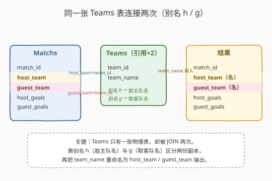
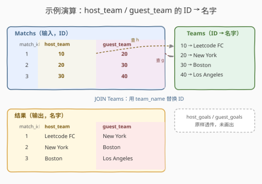

# LeetCode 联赛的所有比赛 题解

## 1. 题目概述

- **标题 / 题号**：联赛的所有比赛（#2339，easy）
- **链接**：https://leetcode.cn/problems/all-the-matches-of-the-league/
- **难度**：简单
- **标签**：数据库、SQL、`JOIN`、自连接、LeetCode 锁题

**题意**：联赛中有若干球队，球队信息存于 `Teams` 表，比赛信息存于 `Matchs` 表（每场比赛记录主队 `host_team`、客队 `guest_team` 的 **`team_id`** 及双方进球数）。编写 SQL，返回**所有比赛的数据**，其中 `host_team` 与 `guest_team` 列要显示**队名**而非队号。

**表结构**：

```text
表：Teams
+-----------+----------+
| 列名      | 类型     |
+-----------+----------+
| team_id   | int      |  ← 主键
| team_name | varchar  |
+-----------+----------+
team_id 是该表的主键（具有唯一值）。
每行表示联赛中的一支球队。

表：Matchs
+-------------+----------+
| 列名        | 类型     |
+-------------+----------+
| match_id    | int      |  ← 主键
| host_team   | int      |  ← 外键 → Teams.team_id
| guest_team  | int      |  ← 外键 → Teams.team_id
| host_goals  | int      |
| guest_goals | int      |
+-------------+----------+
match_id 是该表的主键（具有唯一值）。
host_team 与 guest_team 是关联到 Teams 表的外键。
每行表示一场比赛：host_team 为主队、guest_team 为客队，
host_team 进 host_goals 球、guest_team 进 guest_goals 球。
host_team ≠ guest_team（球队不与自己比赛）。
```

> ⚠️ **锁题说明**：2339 为 LeetCode **Plus 会员专享题**，题目正文与官方样例不公开（力扣页面仅显示会员升级提示）。本篇题解**依公开的题目信息与表结构复原**题意、样例与约束，**具体数据以官方为准**。核心考点——「同一张 `Teams` 表被 `JOIN` 两次，把 `host_team`/`guest_team` 的 ID 换成队名」——是确定的。

**示例 1**（示意，具体以官方样例为准）：

```text
输入：
Teams 表：
+---------+-------------+
| team_id | team_name   |
+---------+-------------+
| 10      | Leetcode FC |
| 20      | New York    |
| 30      | Boston      |
| 40      | Los Angeles |
+---------+-------------+
Matchs 表：
+----------+------------+------------+-------------+--------------+
| match_id | host_team  | guest_team | host_goals  | guest_goals  |
+----------+------------+------------+-------------+--------------+
| 1        | 10         | 20         | 3           | 0            |
| 2        | 20         | 30         | 1           | 1            |
| 3        | 30         | 40         | 2           | 3            |
+----------+------------+------------+-------------+--------------+

输出：
+----------+-------------+-------------+-------------+--------------+
| match_id | host_team   | guest_team  | host_goals  | guest_goals  |
+----------+-------------+-------------+-------------+--------------+
| 1        | Leetcode FC | New York    | 3           | 0            |
| 2        | New York    | Boston      | 1           | 1            |
| 3        | Boston      | Los Angeles | 2           | 3            |
+----------+-------------+-------------+-------------+--------------+

解释：把每场 host_team / guest_team 的 team_id 通过 Teams 表查到 team_name，
连同 match_id、host_goals、guest_goals 一并输出。
```

**约束**：

- `team_id` 为 `Teams` 主键，`match_id` 为 `Matchs` 主键；`Matchs.host_team`、`Matchs.guest_team` 均为指向 `Teams.team_id` 的外键。
- 外键保证每场比赛的主客队 ID 在 `Teams` 中都存在，故 `INNER JOIN` 不会丢行。
- `host_team ≠ guest_team`；`host_goals`、`guest_goals` $\ge 0$。
- 结果返回五列 `match_id, host_team, guest_team, host_goals, guest_goals`，其中 `host_team`/`guest_team` 为**队名**；行顺序任意。

> 💡 **关键观察**：`Matchs` 表只存队号、`Teams` 表才存队名——要输出队名，必须把两张表拼起来。而一场比赛**同时**有主队和客队两个队号要换名，所以同一张 `Teams` 表得被 `JOIN` **两次**：一次查主队名、一次查客队名。这就是经典的「**自连接（self-join）**」——同一物理表用不同别名各连一次。

## 2. 解题思路

### 2.1 直觉思路：逐场查表替换

最朴素的过程式做法：读出 `Matchs` 每一行，用 `host_team` 去 `Teams` 查到主队名、用 `guest_team` 再查一次得到客队名，拼成一行输出。伪代码：

```text
for row in Matchs:
    h_name = lookup(Teams, row.host_team)     # 查主队名
    g_name = lookup(Teams, row.guest_team)     # 查客队名
    emit row.match_id, h_name, g_name, row.host_goals, row.guest_goals
```

逻辑无误，但把数据库引擎擅长的**连接**搬到了应用层逐行循环——既低效也违背 SQL 的声明式哲学。本题在 SQL 里就是「`Matchs` JOIN `Teams` 两次」一行陈述，无需循环。

### 2.2 核心观察：同一张 Teams 表 JOIN 两次（自连接）



一场比赛要同时换出主队名与客队名，意味着对 `Teams` 表做**两次独立的按 `team_id` 等值连接**：

| 连接 | 条件 | 取出 |
|------|------|------|
| 第一次 `JOIN Teams AS h` | `m.host_team = h.team_id` | 主队名 `h.team_name` |
| 第二次 `JOIN Teams AS g` | `m.guest_team = g.team_id` | 客队名 `g.team_name` |

两次连接互不干扰——`h` 这份 `Teams` 副本只负责主队、`g` 这份只负责客队，靠**表别名** `h` / `g` 区分。最后把 `h.team_name` 重命名为 `host_team`、`g.team_name` 重命名为 `guest_team` 输出，使列名与题面一致。

$$\text{输出行} = (\text{match\_id},\;\text{Teams}[\text{host\_team}].\text{team\_name},\;\text{Teams}[\text{guest\_team}].\text{team\_name},\;\text{host\_goals},\;\text{guest\_goals})$$

> 💡 **为什么必须 JOIN 两次、而不是一次？** 一行比赛有两个不同的外键（`host_team`、`guest_team`）都要换名。一次 `JOIN` 只能为**一个**外键配上对应的队名——若只连一次，主队名有了客队名却没有（或反之）。要让同一行同时拥有主队名与客队名，就必须把 `Teams` 这张「字典表」连**两遍**，各管一端。这正是 1068（取一个 `product_name`）与 2339（取两个名字）的差异：要换的外键数 = JOIN 字典表的次数。

> ⚠️ **别名的必要性**：同一张物理表在一条 SQL 中被连接多次时，**必须**给它不同的表别名（`h`、`g`），否则引擎无法区分两份副本的列。别名是自连接的灵魂——没有别名，`team_id`、`team_name` 到底指主队那份还是客队那份无从分辨。

### 2.3 算法流程图



三步流水线，每步不可省：

| 步骤 | 操作 | 产出 |
|------|------|------|
| ① JOIN 取主队名 | `Matchs m JOIN Teams h ON m.host_team = h.team_id` | 每行多了 `h.team_name`（主队名） |
| ② JOIN 取客队名 | `JOIN Teams g ON m.guest_team = g.team_id` | 每行再多了 `g.team_name`（客队名） |
| ③ 重命名输出 | `SELECT match_id, h.team_name AS host_team, g.team_name AS guest_team, host_goals, guest_goals` | 五列、队名入位 |

### 2.4 示例演算

以示例 1 走一遍「双 JOIN 换名」：

| match_id | host_team(id) | guest_team(id) | → 主队名(查 h) | → 客队名(查 g) | host_goals | guest_goals |
|----------|---------------|----------------|----------------|----------------|------------|-------------|
| 1 | 10 | 20 | Leetcode FC | New York | 3 | 0 |
| 2 | 20 | 30 | New York | Boston | 1 | 1 |
| 3 | 30 | 40 | Boston | Los Angeles | 2 | 3 |

- **第 1 行**：`host_team=10` 查 `Teams` 得 `Leetcode FC`；`guest_team=20` 查 `Teams` 得 `New York`。注意 `20` 这支球队在第 2 行会以**主队**身份出现——同一球队可在不同比赛分别充当主/客队，正因如此主客两份 `Teams` 副本必须独立连接。
- `match_id`、`host_goals`、`guest_goals` 来自 `Matchs` 原**样透传**，不参与连接。

## 3. 参考代码

### SQL（解法 A：双 INNER JOIN，推荐）

```sql
SELECT m.match_id,
       h.team_name AS host_team,
       g.team_name AS guest_team,
       m.host_goals,
       m.guest_goals
FROM Matchs m
JOIN Teams h ON m.host_team = h.team_id
JOIN Teams g ON m.guest_team = g.team_id;
```

> 💡 **写法要点**：
> - `Matchs m` 给主表起别名 `m`，便于书写；`Teams h`、`Teams g` 是**同一张表的两个副本**，别名 `h`（主队）、`g`（客队）是自连接的关键。
> - 两个 `JOIN` 的 `ON` 条件分别绑定 `host_team` 与 `guest_team` 到 `team_id`，互不干扰。
> - `h.team_name AS host_team`、`g.team_name AS guest_team` 把取到的队名**重命名**为题面要求的列名；`match_id`、`host_goals`、`guest_goals` 直接选 `m.` 的原列。
> - 用 `JOIN`（INNER）：外键 `host_team`/`guest_team` 保证每个 ID 在 `Teams` 中都存在，不会丢行；若数据可能不完整，见解法 B 的 `LEFT JOIN`。

> ⚠️ **表名拼写**：本题官方数据表名为 `Matchs`（力扣原题拼写如此，非 `Matches`）。若你所在环境表名为 `Matches`，将上面 SQL 中的 `Matchs` 替换为 `Matches` 即可，逻辑不变。

### SQL（解法 B：双 LEFT JOIN，防御性）

```sql
SELECT m.match_id,
       h.team_name AS host_team,
       g.team_name AS guest_team,
       m.host_goals,
       m.guest_goals
FROM Matchs m
LEFT JOIN Teams h ON m.host_team = h.team_id
LEFT JOIN Teams g ON m.guest_team = g.team_id;
```

> 💡 **写法要点**：
> - `LEFT JOIN` 保留 `Matchs` 全部行；若某队 ID 在 `Teams` 中缺失，对应队名为 `NULL`（而非整行消失）。
> - 本题外键保证完整性，`LEFT JOIN` 与 `INNER JOIN` **结果等价**；用 `LEFT` 是「防御性」写法——当外键约束被破坏或表数据不一致时仍能返回比赛记录（缺名以 `NULL` 占位）。面试可点出二者在本题等价、差异只在「外键可能失效」的边界。

### SQL（解法 C：相关子查询，对照写法）

```sql
SELECT m.match_id,
       (SELECT team_name FROM Teams t WHERE t.team_id = m.host_team)  AS host_team,
       (SELECT team_name FROM Teams t WHERE t.team_id = m.guest_team) AS guest_team,
       m.host_goals,
       m.guest_goals
FROM Matchs m;
```

> 💡 **写法要点**：
> - 每个标量子查询为一行比赛取一个队名，逻辑直观、可读性好；`Teams.team_id` 是主键默认有索引，子查询为索引点查 $O(\log n)$。
> - 与解法 A 的 `JOIN` **语义等价**，但写法不同：`JOIN` 是「横向拼宽」、子查询是「列内嵌套」。多数优化器对二者生成相近计划；`JOIN` 通常更通用、更易被优化为哈希/归并连接，**推荐 A**。
> - 标量子查询要求每场主/客队 ID 在 `Teams` 中**至多一行**——主键保证满足；若 `team_id` 不唯一则子查询会报错（返回多行），此时必用 `JOIN`。

### Python（pandas）

```python
import pandas as pd

def all_matches(teams: pd.DataFrame, matchs: pd.DataFrame) -> pd.DataFrame:
    m = matchs.merge(teams, left_on='host_team', right_on='team_id', how='left') \
              .merge(teams, left_on='guest_team', right_on='team_id', how='left',
                     suffixes=('_host', '_guest'))
    return (m[['match_id', 'team_name_host', 'team_name_guest', 'host_goals', 'guest_goals']]
              .rename(columns={'team_name_host': 'host_team',
                               'team_name_guest': 'guest_team'}))
```

> 💡 **pandas 对照**：
> - 两次 `merge(teams, ...)` 对应两次 `JOIN Teams`；`suffixes=('_host','_guest')` 给重复的 `team_name` 列加后缀区分两份副本，等价于 SQL 的表别名 `h`/`g`。
> - `left_on` / `right_on` 对应 `ON m.host_team = t.team_id`（pandas 用列名匹配，无「表的别名」概念，故靠 `suffixes` 区分重名列）。
> - `how='left'` 对应解法 B 的 `LEFT JOIN`；末尾 `rename` 把 `team_name_host/team_name_guest` 改回题面列名 `host_team/guest_team`。

## 4. 复杂度分析

| 维度 | 解法 A（双 INNER JOIN） | 解法 B（双 LEFT JOIN） | 解法 C（相关子查询） | pandas |
|------|--------------------------|------------------------|----------------------|--------|
| **时间** | $O(M)$（有索引）/ $O(M\log T)$ | 同 A | $O(M\log T)$ | $O(M+T)$ |
| **空间** | $O(M)$ | $O(M)$ | $O(M)$ | $O(M+T)$ |
| **依赖窗口函数** | 否 | 否 | 否 | 否 |
| **外键失效时** | 丢行 | 留 `NULL` | 留 `NULL` | 留 `NaN` |
| **推荐度** | ✓ **通用首选** | ✓ 防御性 | ✓ 对照 | ✓ 验证用 |

> - $M$ = `Matchs` 行数（比赛数），$T$ = `Teams` 行数（球队数）。
> - **时间**：`Teams.team_id` 为主键默认建索引，两个 `JOIN` 各为索引等值查找 $O(\log T)$，共 $O(M\log T)$；若优化器走哈希连接则 $O(M+T)$。子查询为每行做两次主键点查，同为 $O(M\log T)$，优化器常将其改写为 `JOIN`，实测相近。
> - **空间**：输出 $M$ 行宽行 $O(M)$；pandas 的 `merged` 宽表 $O(M+T)$。
> - **索引建议**：`Teams(team_id)` 主键已自带索引；若 `Matchs` 极大，可在 `Matchs(host_team)`、`Matchs(guest_team)` 建索引以利反向查询，但本题只正向 `Matchs→Teams`，主键索引已足够。

## 5. 扩展：自连接 vs 子查询 vs 窗口——「一行多外键换名」的三种写法

本题属于「**一行内有多个外键、各自要换名为对应字典值**」的母题。三种写法的取舍：

### 5.1 三种写法对比

| 维度 | 双 JOIN（A/B） | 标量子查询（C） | 窗口函数 |
|------|----------------|-----------------|----------|
| **思路** | 字典表横向拼宽两次 | 列内嵌套查字典 | —（不适合） |
| **可读性** | 高（声明式） | 高（直观） | — |
| **可扩展换名数** | 加一个 JOIN | 加一列子查询 | — |
| **优化器友好** | ✓ 易改写为哈希/归并 | 常被改写为 JOIN | — |
| **字典键不唯一** | 不报错（笛卡尔） | ✗ 报错（返回多行） | — |

> 💡 窗口函数**不适合**本题：窗口函数处理「同组行间关系」（如排名、累计），而本题是「行的两个外键各自查字典表」——属于**行间连接**而非组内计算，故用 `JOIN`/子查询而非 `OVER()`。

### 5.2 泛化：一行 $k$ 个外键换名

推广到一行有 $k$ 个指向同一字典表的外键都要换名：**字典表 JOIN $k$ 次**，每次起不同别名、绑不同外键。例如订单表含 `buyer_id`、`seller_id`、`carrier_id` 三个指向 `Users` 的外键，要换三个名字——就 `JOIN Users` 三次（别名 `b/s/c`）。本题 $k=2$ 是最常见特例。

> ⚠️ 当 $k$ 较大且字典表极大时，多次 `JOIN` 的代价上升；可改用「先 `IN` 过滤字典子集再连」或在应用层批量查表。但本题 $k=2$、表规模小，双 `JOIN` 是最简最优。

## 6. 面试要点

1. **为什么要 JOIN 两次 `Teams`？**

   > 一场比赛同时有 `host_team` 和 `guest_team` 两个外键都要换成队名，而 `Teams` 表只存一份队名。一次 `JOIN` 只能为一个外键配上队名，故需把 `Teams` 这张「字典表」连**两遍**——一遍查主队名、一遍查客队名。这是自连接的典型场景：同一物理表用不同别名各连一次。

2. **`INNER JOIN` 和 `LEFT JOIN` 在本题等价吗？**

   > 等价。`Matchs.host_team`/`guest_team` 是指向 `Teams.team_id` 的外键，保证每个 ID 在 `Teams` 中存在，`INNER JOIN` 不会丢行，故与 `LEFT JOIN` 结果一致。差异只在边界：若外键约束失效、出现孤儿 ID，`INNER` 会丢行、`LEFT` 留 `NULL`。面试答「首选 INNER，逻辑清晰；若担心数据不一致用 LEFT 防御」即可。

3. **为什么必须给 `Teams` 起别名 `h`、`g`？**

   > 同一张物理表在一条 SQL 中被连接多次时，**必须**用不同别名区分两份副本，否则 `team_id`/`team_name` 到底指主队那份还是客队那份无法分辨，引擎报「列名不明确」错误。别名是自连接的灵魂——没有别名就没有自连接。

4. **`h.team_name AS host_team` 这个列别名有何作用？**

   > 题面要求输出列名为 `host_team`/`guest_team`，但这两列的**值**应来自 `Teams.team_name`（队名）。`AS host_team` 把取到的队名重命名为题面要求的列名，使结果列名与值都对上。若不写别名，输出列名会是 `team_name`，与题面不符。

5. **能否用子查询代替 JOIN？性能如何？**

   > 可以，见解法 C：每场主/客队 ID 各用一个标量子查询查队名。`Teams.team_id` 为主键有索引，子查询为 $O(\log T)$ 点查，与 `JOIN` 同阶，多数优化器还会把子查询改写为 `JOIN`，实测相近。区别：子查询在 `team_id` 不唯一时会报「返回多行」错，`JOIN` 则不会（产生笛卡尔）。本题主键保证唯一，二者皆可，**推荐 `JOIN`**——声明式、更通用、易扩展到更多外键。

> 💡 **一句话总结**：2339 是「自连接换名」母题——核心就一句 `FROM Matchs m JOIN Teams h ON host_team=h.team_id JOIN Teams g ON guest_team=g.team_id`，选 `h.team_name AS host_team, g.team_name AS guest_team`。要点：① 同一张 `Teams` 字典表 JOIN 两次，靠别名 `h`/`g` 区分两份副本；② 外键保证完整，INNER 与 LEFT 等价；③ 列别名把队名重命名为题面要求的 `host_team`/`guest_team`。记住「一行有几个外键要换名，字典表就 JOIN 几次」，所有「多外键取字典值」类 SQL 题都能套用。

## 同类练习题

| # | 题目 | 与本题的关联 |
|---|------|-------------|
| 175 | [组合两个表](https://leetcode.cn/problems/combine-two-tables/) | `LEFT JOIN` 把 `Person` 与 `Address` 按 `personId` 拼起来取地址，最经典的「用 JOIN 取关联表字段」入门题，与 2339 同属「JOIN 取名字」范式（单外键版） |
| 1068 | [产品销售分析 I](https://leetcode.cn/problems/product-sales-analysis-i/)（[题解](../1001-1100/1068_产品销售分析I.md)） | `Sales JOIN Product ON product_id` 取 `product_name`，是 2339 的「单外键换名」退化版；2339 在其骨架上把字典表 JOIN 一次升级为两次（双外键） |
| 577 | [员工奖金](https://leetcode.cn/problems/employee-bonus/) | `Employee LEFT JOIN Bonus` 保留无奖金员工，对照 2339 解法 B 的 `LEFT JOIN` 语义——外键可能缺失时 LEFT 的取舍 |
| 1378 | [使用唯一标识码替换员工 ID](https://leetcode.cn/problems/replace-employee-id-with-the-unique-identifier/) | `JOIN` 取 `unique_id` 替换显示，与 2339「用 team_name 替换 team_id」同构（单外键换标识） |
