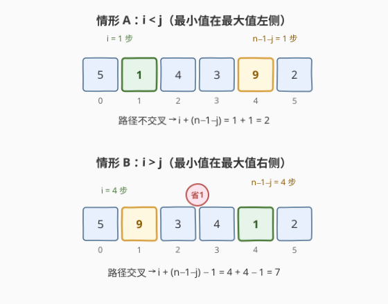
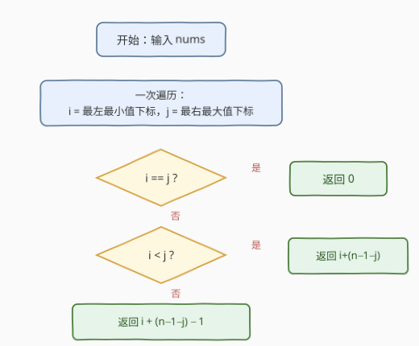

# LeetCode 生成有效数组的最少交换次数 题解

## 1. 题目概述

- **标题 / 题号**：生成有效数组的最少交换次数（#2340，medium）
- **链接**：https://leetcode.cn/problems/minimum-adjacent-swaps-to-make-a-valid-array/
- **难度**：中等
- **标签**：贪心、数组

**题意**：给定一个**下标从 0 开始**的整数数组 `nums`，每次操作可**交换两个相邻元素**。一个**有效**数组需同时满足：

- 最小元素位于数组最左端（下标 `0`）；
- 最大元素位于数组最右端（下标 `n-1`）。

最小值/最大值有多个时，取其中任意一个即可。返回使 `nums` 成为有效数组所需的**最少交换次数**。

**示例 1**：

```text
输入：nums = [3,4,5,5,3,1]
输出：6
解释：最小值 1 在下标 5，最大值 5（取最右）在下标 3；把 1 左移到首位、5 右移到末位，
      二者路径交叉共享一次交换，合计 5 + 2 − 1 = 6。
```

**示例 2**：

```text
输入：nums = [9]
输出：0
解释：单元素数组已有效，无需交换。
```

**约束**：

- $1 \le \text{nums.length} \le 10^5$
- $1 \le \text{nums}[i] \le 10^5$

> ⚠️ 本题为 LeetCode **Plus 会员专享**（🔒 锁题），力扣页面对非会员隐藏完整描述，题意与示例取自官方描述。

> 💡 题面看似「逐次模拟交换」，实质只需**定位两个最值的下标**后用一次算式给出答案：把某个最小值冒泡到首位、某个最大值冒泡到末位，两条移动路径是否交叉决定是否再减 1。

## 2. 解题思路

### 2.1 暴力思路：状态空间搜索

把每个数组排列视作节点、相邻交换为边，BFS 找从初始状态到任一「有效状态」的最短路。但状态空间达 $O(n!)$，$n \le 10^5$ 完全不可行。

> ⚠️ 模拟既无法承受规模，也掩盖了「只需移动两个元素」的结构。突破口：题目**只要求最小值到首位、最大值到末位**，其余元素的相对顺序无关紧要——把搜索问题降维为「定位两个最值 + 一次分类讨论」。

### 2.2 核心观察：定位最值下标 + 路径是否交叉



只移动两个目标元素：

- 把一个最小值从下标 $i$ 冒泡左移到下标 $0$，每次与左邻交换前进一格，代价恰为 $i$；
- 把一个最大值从下标 $j$ 冒泡右移到下标 $n-1$，代价恰为 $n-1-j$。

为使总代价最小：

- 最小值取**最左**出现（$i$ 最小）→ 左移代价最小；
- 最大值取**最右**出现（$j$ 最大）→ 右移代价最小。

两条路径是否相交，分两种情形：

- **情形 A（$i < j$）**：最小值在最大值左侧，左移与右移的路径互不重叠，各走各的 → 总代价 $= i + (n-1-j)$。
- **情形 B（$i > j$）**：最小值在最大值右侧，两条路径必然相交；相交处那一次相邻交换**同时**让最小值左移一格、最大值右移一格，一举两得 → 总代价 $= i + (n-1-j) - 1$。
- **$i = j$**：仅当 $n = 1$（单元素），数组已有效，返回 $0$。

> 💡 为何「相交处一次交换同时推进两者」能省且只省 1？把两个目标元素各自拆成一段独立冒泡：不交叉时共 $i+(n-1-j)$ 次；交叉时二者必须互相越过对方一次，这一跳同时计入两段（既是 min 左移一格、又是 max 右移一格），故重复计数 1 次、总代价 $-1$。越过后两者不再有共享步，故只减 1。

### 2.3 算法流程图



一次遍历用**严格小于**更新 $i$（保最左最小值）、**大于等于**更新 $j$（保最右最大值），随后三分支返回。

### 2.4 示例演算

![示例 [3,4,5,5,3,1]：i=5, j=3, 交叉 → 6](../images/valid_array_example_walkthrough.svg)

| 量 | 值 | 说明 |
|------|------|------|
| $n$ | 6 | 数组长度 |
| 最小值 | 1 | 唯一，位于下标 5 |
| $i$ | 5 | 最左最小值下标 |
| 最大值 | 5 | 出现于下标 2、3 |
| $j$ | 3 | 最右最大值下标 |
| $i > j\,?$ | 是 | 路径交叉 |
| 答案 | $i + (n-1-j) - 1 = 5 + 2 - 1$ | **6** |

官方给出的 6 步交换（下标从 0 计，`swap(a,b)` 表示交换下标 a、b）：

```text
[3,4,5,5,3,1]
swap(3,4): [3,4,5,3,5,1]
swap(4,5): [3,4,5,3,1,5]   ← 最大值 5 到位(末位)，此步同时把 min 1 从 idx5 左移到 idx4
swap(3,4): [3,4,5,1,3,5]
swap(2,3): [3,4,1,5,3,5]
swap(1,2): [3,1,4,5,3,5]
swap(0,1): [1,3,4,5,3,5]   ← 最小值 1 到位(首位)
```

> 💡 `swap(4,5)` 是共享的那一步：交换前 `idx4=5`(max)、`idx5=1`(min)，交换后 `idx4=1`、`idx5=5`——min 左移一格、max 右移一格同在此步完成。故 $\underbrace{5}_{\min\text{ 左移}} + \underbrace{2}_{\max\text{ 右移}} - 1 = 6$ 而非 7。

## 3. 参考代码

### C++

```cpp
class Solution {
public:
    int minimumSwaps(vector<int>& nums) {
        int n = nums.size();
        int i = 0, j = 0;
        for (int k = 0; k < n; ++k) {
            if (nums[k] < nums[i]) i = k;
            if (nums[k] >= nums[j]) j = k;
        }
        if (i == j) return 0;
        return i + (n - 1 - j) - (i > j);
    }
};
```

> 💡 `i` 用严格 `<` 更新（遇相等不换）→ 保留**最左**最小值；`j` 用 `>=` 更新（遇相等也换）→ 保留**最右**最大值，一次遍历同时确定。`(i > j)` 是 bool，算术上下文中转为 1/0，故 `- (i > j)` 即「交叉时再减 1」。`i == j` 仅 $n=1$ 时命中，直接返回 0。

### Python

```python
class Solution:
    def minimumSwaps(self, nums: List[int]) -> int:
        i = j = 0
        for k, v in enumerate(nums):
            if v < nums[i]:
                i = k
            if v >= nums[j]:
                j = k
        return 0 if i == j else i + len(nums) - 1 - j - (i > j)
```

> ⚠️ Python 中 `True == 1`，`- (i > j)` 同样成立；若追求可读性可写 `- (1 if i > j else 0)`。

## 4. 复杂度分析

| 维度 | 复杂度 | 说明 |
|------|--------|------|
| **时间复杂度** | $O(n)$ | 单次遍历定位 $i$、$j$，其余为常数次算术 |
| **空间复杂度** | $O(1)$ | 仅用常数个变量 $i$、$j$、$n$ |
| 对照：状态空间 BFS | $O(n!)$ / $O(n!)$ | 状态数与边数均为阶乘级，$n \le 10^5$ 不可行 |

> 💡 与暴力的 $O(n!)$ 相比，本解法把「最少交换」从**搜索问题**降维为「定位两个最值 + 一次分类讨论」，$O(n)$ 一次扫描即出答案。

## 5. 扩展：冒泡距离 = 下标差

本题是「**带约束的冒泡距离**」：相邻交换让某元素到达指定位置的次数，恰等于其当前下标与目标下标之差（单元素冒泡距离）。多个目标独立移动时：

- 路径**不交叉** → 代价直接相加；
- 路径**交叉** → 二者在相遇处共享一次交换，总代价 $-1$。

> 💡 抽象经验：见到「最少相邻交换使某些元素到达指定位置」，先算每个目标的「下标差」，再判路径是否交叉——不交叉直接加，交叉减 1。

## 6. 面试要点

1. **为什么最小值取最左、最大值取最右？**

   - 最小值要到下标 0，左移代价 = 当前下标，取最左出现使该代价最小；最大值要到下标 $n-1$，右移代价 $= n-1-$ 当前下标，取最右出现使该代价最小。两者独立可加。

2. **$i > j$ 时为什么恰好减 1 而非更多？**

   - 两个目标各做一段冒泡，代价 $i$ 与 $n-1-j$。路径交叉时二者必须互相越过对方一次，这一跳同时计入两段（既是 min 左移一格、又是 max 右移一格），故重复计数 1 次、总代价 $-1$。越过后两者不再有共享步，故只减 1。

3. **$i = j$ 何时发生？**

   - $i$ 为最左最小值下标、$j$ 为最右最大值下标。若 $\min \ne \max$ 则二者在不同位置，$i \ne j$；若所有元素相等，$i=0$、$j=n-1$，$n>1$ 时 $i<j$。故 $i=j$ 仅当 $n=1$，返回 0。

4. **如何一遍扫描同时拿到「最左最小值」与「最右最大值」？**

   - 最小值用严格 `<` 更新（相等不换，保留更早下标）→ 最左；最大值用 `>=` 更新（相等也换，保留更晚下标）→ 最右。一次遍历 $O(n)$ 同时确定 $i$、$j$。

5. **若改为「最小值到首 或 最大值到末（满足其一即可）」会怎样？**

   - 取两者代价的较小者 $\min(i,\, n-1-j)$。交叉与否不再相关，因为只移动一个目标。

> 💡 **一句话总结**：一次遍历记最左最小值下标 $i$ 与最右最大值下标 $j$；$i<j$ 直接加，$i>j$ 减 1，$i=j$ 返回 0——$O(n)$/$O(1)$。

## 同类练习题

| # | 题目 | 与本题的关联 |
|---|------|-------------|
| 1850 | [邻位交换的最小次数](https://leetcode.cn/problems/minimum-adjacent-swaps-to-reach-the-kth-smallest-number/) | 把排列经相邻交换变为第 $k$ 小，所需相邻交换次数 = 两排列间的「下标差/逆序」之和，与本题「相邻交换 = 冒泡距离」同源（贪心） |
| 315 | [计算右侧小于当前元素的个数](https://leetcode.cn/problems/count-of-smaller-numbers-after-self/)（[题解](../0301-0400/315_计算右侧小于当前元素的个数.md)） | 冒泡排序的交换总次数 = 逆序对数，是「相邻交换计数」的母题 |
| 912 | [排序数组](https://leetcode.cn/problems/sort-an-array/)（[题解](../0901-1000/912_排序数组.md)） | 冒泡排序即相邻交换排序，交换次数 = 逆序对；对照「全排序」与本题「只移动两个元素」的降维 |
