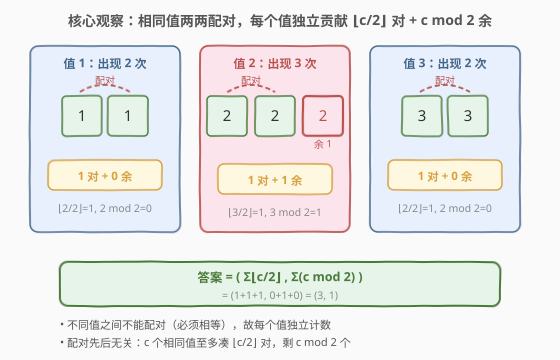
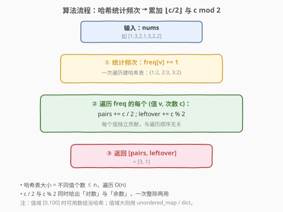
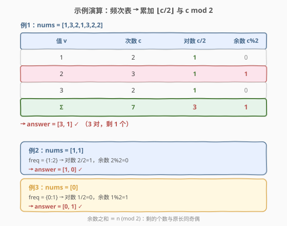

# 数组能形成多少数对

- **题目名称**：数组能形成多少数对
- **链接**：[2341. 数组能形成多少数对](https://leetcode.cn/problems/maximum-number-of-pairs-in-array/)
- **难度**：简单
- **标签**：数组、哈希表、计数、一次遍历

## 1. 题目概述

给你下标从 0 开始的整数数组 `nums`。每步操作可：

- 从 `nums` 选出**两个相等的**整数
- 移除它们，形成一个**数对**

多次执行直到无法继续。返回长度为 2 的数组 `answer`，其中 `answer[0]` 是形成的数对数目，`answer[1]` 是剩下的整数数目。

**示例 1**：

```text
输入：nums = [1,3,2,1,3,2,2]
输出：[3,1]
解释：1 配 1、3 配 3、两个 2 配一对，剩一个 2，共 3 对，剩 1 个。
```

**示例 2**：

```text
输入：nums = [1,1]
输出：[1,0]
解释：两个 1 配成 1 对，无剩余。
```

**示例 3**：

```text
输入：nums = [0]
输出：[0,1]
解释：无法配对，剩 1 个。
```

**约束条件**：

- $1 \le \text{nums.length} \le 100$
- $0 \le \text{nums}[i] \le 100$

> 💡 **关键不变式**：题目只允许「相等」的两个数配对——不同值之间天然隔离。因此每个值的配对能力**完全由它出现的次数 $c$ 决定**，与其在数组中的位置无关。次数 $c$ 至多凑出 $\lfloor c/2 \rfloor$ 对、剩 $c \bmod 2$ 个。把所有值各自独立算再求和即答案。

---

## 2. 解题思路

### 2.1 暴力思路：逐轮扫描找等值配对

最直白的做法是**忠实地模拟题目操作**：每轮从头扫描 `nums`，找到任意一对相等元素就移除，直到再也凑不出对。

```text
ans_pairs = 0
while True:
    找到任意两个相等的元素 i,j
    若找不到 → 跳出
    移除 nums[i], nums[j]
    ans_pairs += 1
return [ans_pairs, len(nums)]
```

正确性没问题，但每轮移除需 $O(n)$（数组搬移或标记），至多 $n/2$ 轮，最坏 $O(n^2)$。对 $n \le 100$ 能 AC，却把「逐个配对」的过程背在身上，且未揭示「为什么这恰好是最多」。

> ⚠️ 模拟把「配对顺序」当成变量，但顺序其实**不影响总数**——任何两个相等的数都能配，先配谁后配谁，最终每个值 $c$ 次出现都只能凑 $\lfloor c/2\rfloor$ 对。关键观察：**配对能力按值解耦**。

### 2.2 核心观察：配对按值解耦 + 整除取整



由于配对必须「相等」，不同值之间互不干扰。把 `nums` 按值分桶统计频次 $c_v$，则：

- 值 $v$ 的 $c_v$ 个副本至多凑 $\lfloor c_v / 2 \rfloor$ 对（每对消耗 2 个）；
- 配完必剩 $c_v \bmod 2$ 个（0 或 1 个）；
- 这个上界**总可达**：把同值的副本任意两两配对即可——无论挑哪两个，只要相等就成对。

把所有值独立贡献求和：

$$\text{answer} = \left[\, \sum_{v} \left\lfloor \frac{c_v}{2} \right\rfloor,\;\; \sum_{v} (c_v \bmod 2) \,\right]$$

> 💡 **为什么配对顺序无关？** 同值副本两两配对是「完美匹配」问题，而完全图 $K_{c}$ 上任意完美匹配的边数都等于 $\lfloor c/2\rfloor$（每次消耗 2 个顶点，与挑哪条边无关）。故先配谁后配谁不影响总数——模拟里那个看似自由的「找哪一对」其实没有自由度。

### 2.3 算法流程图



三步走：一次遍历建频次哈希表 → 遍历每个 $(v, c)$ 累加 $c/2$ 到对数、$c\bmod 2$ 到余数 → 返回 $[\text{pairs}, \text{leftover}]$。整除与取模一次给出两个答案分量，零浪费。

### 2.4 示例演算



以示例 1 `nums = [1,3,2,1,3,2,2]` 建频次表：

| 值 $v$ | 次数 $c$ | 对数 $\lfloor c/2\rfloor$ | 余数 $c\bmod 2$ |
|--------|----------|---------------------------|------------------|
| 1      | 2        | 1                         | 0                |
| 2      | 3        | 1                         | 1                |
| 3      | 2        | 1                         | 0                |
| **Σ**  | **7**    | **3**                     | **1**            |

`answer = [3, 1]` ✓。注意值 2 出现 3 次：凑 1 对后必剩 1 个；余数总和 $0+1+0=1$，与原长 $7$ 同奇偶（一般地 $\sum (c_v\bmod 2) \equiv n \pmod 2$）。

---

## 3. 参考代码

### C++

```cpp
class Solution {
public:
    vector<int> numberOfPairs(vector<int>& nums) {
        unordered_map<int, int> freq;
        for (int x : nums) ++freq[x];
        int pairs = 0, leftover = 0;
        for (auto& [v, c] : freq) {
            pairs += c / 2;
            leftover += c % 2;
        }
        return {pairs, leftover};
    }
};
```

> 💡 值域 $[0,100]$ 时可用 `int cnt[101]` 当哈希，省去 unordered_map 开销；值域未知则用 unordered_map 通用。`c/2` 与 `c%2` 在 C++ 非负整数下与数学定义一致。

### Python

```python
class Solution:
    def numberOfPairs(self, nums: List[int]) -> List[int]:
        pairs = leftover = 0
        for c in Counter(nums).values():
            pairs += c // 2
            leftover += c % 2
        return [pairs, leftover]
```

> 💡 `collections.Counter` 一次遍历建表；`//` 与 `%` 对非负数与 C++ 行为一致。也可一行流 `c = Counter(nums); return [sum(x//2 for x in c.values()), sum(x%2 for x in c.values())]`，但拆开更易读。

---

## 4. 复杂度分析

| 维度 | 复杂度 | 说明 |
|------|--------|------|
| **时间复杂度** | $O(n)$ | 一次遍历建频次表 + 一次遍历累加，每元素 $O(1)$ |
| **空间复杂度** | $O(n)$ | 哈希表存不同值个数，最坏 $n$ 个不同值 |
| 对照：逐轮模拟 | $O(n^2)$ / $O(1)$ | 每轮扫描+移除，正确但慢；空间省 |
| 对照：排序后扫描 | $O(n\log n)$ / $O(1)$ | 排序后相邻等值配对，折中方案 |

> 💡 值域 $[0,100]$ 时空间退化为 $O(1)$（定长数组）；值域大则用哈希表，最坏 $O(n)$。本题 $n \le 100$，三种做法皆 AC，频次法胜在 $O(n)$ 且语义直白。

---

## 5. 扩展：决策版 vs 计数版——同一频次骨架的两个题型

2341 是「频次整除取整」家族的**计数版**：每个值独立贡献 $\lfloor c/2\rfloor$ 对。同骨架可衍生两类变体：

| 变体 | 代表题 | 关系 |
|------|--------|------|
| **决策版** | 2206. 将数组划分成相等对 | 问能否把 $2n$ 个数划成 $n$ 对相等对 ⟺ 所有 $c_v \bmod 2 = 0$ |
| **组合计数版** | 1512. 好数对的数目 | 数 $(i,j), i<j, \text{nums}[i]=\text{nums}[j]$，答案 $=\sum_v \binom{c_v}{2}$ |
| **本计数版** | 2341 | 答案 $=\sum_v \lfloor c_v/2\rfloor$，剩 $\sum_v(c_v\bmod 2)$ |

三者骨架一致——「按值分桶统计频次，再对每个 $c_v$ 做一次运算」，区别只在最后一步：判断奇偶 / 取组合数 / 取整除。

> 💡 抽象经验：见到「找相等元素配对/分组/计数」类题目，第一反应应是**频次表**，而非逐对模拟。配对能力天然按值解耦，频次给出闭式。

---

## 6. 面试要点

1. **为什么配对顺序不影响总数？**

   > 配对必须相等 ⟹ 不同值之间天然隔离。同值的 $c$ 个副本两两配对是「消耗 2 个凑 1 对」，无论挑哪两个，至多凑 $\lfloor c/2\rfloor$ 对、剩 $c\bmod 2$ 个——配对先后不改变这个上界，且上界总可达。

2. **为什么 $\lfloor c/2\rfloor$ 是每个值的上界？又为什么可达？**

   > 上界：每对消耗 2 个，$c$ 个副本至多 $\lfloor c/2\rfloor$ 对。可达：把同值副本任意两两配对即可，凑出 $\lfloor c/2\rfloor$ 对后剩 $c\bmod 2$ 个。

3. **余数总和与原长有什么关系？**

   > $\sum_v (c_v\bmod 2) \equiv \sum_v c_v = n \pmod 2$，即剩余个数与原数组长度同奇偶。也验证了 `pairs·2 + leftover = n`，两分量自洽。

4. **能否不建哈希表，原地完成？**

   > 能。先排序再单遍扫描：相邻等值的每两个凑一对，$O(n\log n)$ 时间 / $O(1)$ 额外空间。值域小时用定长数组当哈希更省；值域大时哈希表最通用。

5. **本题与 1512 好数对的区别？**

   > 1512 数所有**有序下标对** $(i,j), i<j$ 且相等，答案 $=\sum \binom{c_v}{2}$，是组合计数；2341 数**不相交配对**的最大数，答案 $=\sum \lfloor c_v/2\rfloor$，是贪心整除。前者同一副本可被多对复用，后者每副本只用一次。

> 💡 **一句话总结**：相等才能配 ⟹ 配对按值解耦 ⟹ 每个值贡献 $\lfloor c/2\rfloor$ 对 + $c\bmod 2$ 余。一次遍历建频次，再遍历累加整除与取模——$O(n)$ 闭式，无需模拟配对过程。

---

## 7. 同类练习题

- [2206. 将数组划分成相等对](https://leetcode.cn/problems/divide-array-into-equal-pairs/)：同频次骨架的决策版——$2n$ 个数能否划成 $n$ 对相等对 ⟺ 所有频次为偶，即 2341 判「全配完无剩余」
- [1512. 好数对的数目](https://leetcode.cn/problems/number-of-good-pairs/)：同频次骨架的组合计数版——数所有相等下标对，答案 $=\sum\binom{c_v}{2}$，对照 2341 的 $\sum\lfloor c_v/2\rfloor$
- [1748. 唯一元素的和](https://leetcode.cn/problems/sum-of-unique-elements/)：频次表筛选——只对 $c_v=1$ 的值求和，同「一次遍历建频次再二次筛选」范式
- [1394. 找出数组中的幸运数](https://leetcode.cn/problems/find-lucky-integer-in-an-array/)：频次表查询——找 $c_v=v$ 的最大值，同「建频次后做一次判断/累加」
- [1636. 按照频率将数组升序排序](https://leetcode.cn/problems/sort-array-by-increasing-frequency/)：频次表驱动排序——先建频次再以此为键排序，频次表作为通用预处理步骤的延伸
