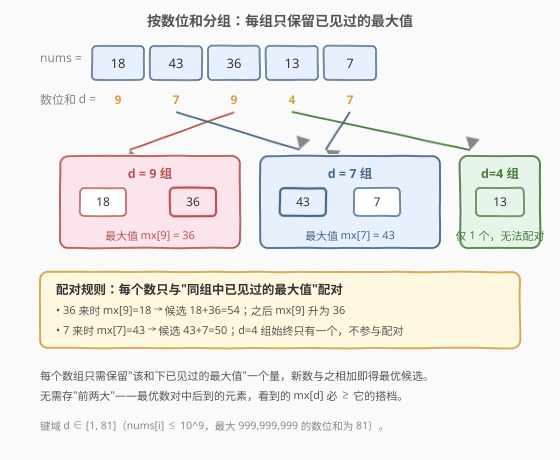
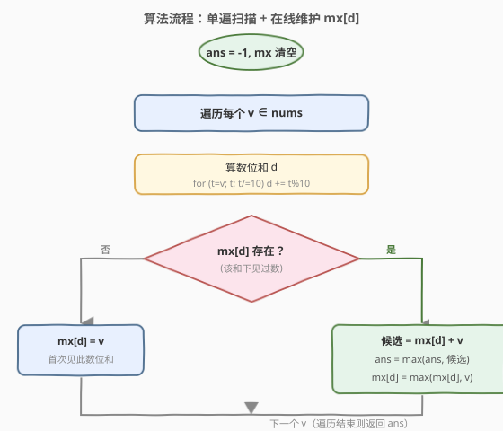
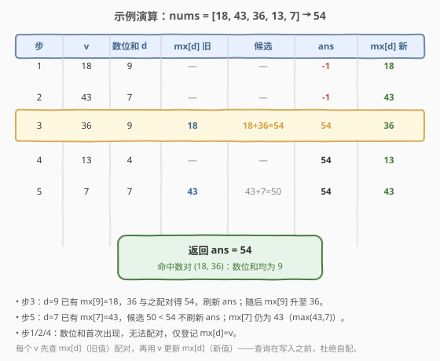

# 数位和相等数对的最大和

- **题目名称**：数位和相等数对的最大和
- **链接**：[2342. 数位和相等数对的最大和](https://leetcode.cn/problems/max-sum-of-a-pair-with-equal-sum-of-digits/)
- **难度**：中等
- **标签**：数组、哈希表

## 1. 题目概述

给定下标从 0 开始的正整数数组 `nums`，选出两个不同下标 `i != j`，使得 `nums[i]` 与 `nums[j]` 的**数位和**相等。返回 `nums[i] + nums[j]` 可取得的**最大值**；不存在这样的数对则返回 `-1`。

**示例 1**：

```text
输入：nums = [18,43,36,13,7]
输出：54
解释：
  - (18, 36)：数位和都是 9，18 + 36 = 54
  - (43,  7)：数位和都是 7，43 +  7 = 50
  最大值为 54。
```

**示例 2**：

```text
输入：nums = [10,12,19,14]
输出：-1
解释：不存在数位和相等的数对。
```

**约束条件**：

- $1 \le \text{nums.length} \le 10^5$
- $1 \le \text{nums}[i] \le 10^9$

> 💡 **关键约束**：`nums[i] <= 10^9`，故一个数的数位和至多为 $9\times 9 = 81$（即 $999{,}999{,}999$）。数位和取值落在 $[1, 81]$ 这个极小区间内——这一"键域极小"的性质是后面用数组代替哈希、做到 $O(1)$ 空间的依据。

---

## 2. 解题思路

### 2.1 暴力思路：双重循环枚举数对

最直白的做法：双重循环枚举所有 $(i, j)$，对每对计算两个数位和并比较，相等则用 `nums[i] + nums[j]` 更新答案。复杂度 $O(n^2)$，$n = 10^5$ 时约 $10^{10}$ 次操作，**超时**。

> ⚠️ 暴力的浪费在于：对每个数位和，我们其实只关心"和它配对能取到的最大值"，而暴力把同组内的所有两两组合都试了一遍。把"枚举所有对"换成"每组只留最大值"，即降到 $O(n)$。

### 2.2 核心观察：按数位和分组，每组只留最大值，单遍扫描



把每个数按其**数位和**归入一组。在同一组内，要让两个数的和最大，**必然取该组中最大的两个数**。进一步化简：扫描时每来一个新数 $v$（数位和为 $d$），它若能配对，最优搭档一定是"之前见过的、数位和同为 $d$ 的最大数"——记为 `mx[d]`。

于是只需一个映射 `mx[d]`：**数位和 → 该和下已出现过的最大值**。对每个 $v$：

1. 算数位和 $d$；
2. 若 `mx[d]` 已存在，则候选 `candidate = mx[d] + v`，用它更新答案；
3. 把 `mx[d]` 更新为 $\max(\text{mx}[d],\, v)$，供后续配对使用。

> 💡 **为什么只存"最大"一个值就够，不用存前两大？** 设最优数对为 $(a, b)$（$a+b$ 最大），不妨设 $b$ 在扫描中后于 $a$ 被处理。当处理到 $b$ 时，`mx[d]` 保存的是 $b$ 之前所有同和数的最大值，而 $a$ 是其中之一，故 `mx[d] >= a`。候选 `mx[d] + b >= a + b` = 最优值；又候选本身是一个合法数对之和，`candidate <= 最优值`。两向夹逼 → 候选恰为最优。所以"只留最大"不会漏掉最优，单遍扫描即正确。

### 2.3 算法流程图



四步循环：**算数位和** → **查 mx[d] 是否存在** → 存在则更新 `ans = max(ans, mx[d] + v)` → **更新 `mx[d] = max(mx[d], v)`**。无配对时 `ans` 保持 `-1`。

> ⚠️ **不会把一个数与自身配对**：查询 `mx[d]` 时，当前 $v$ 尚未写入映射（写入在查询之后），故 `mx[d]` 只含先于 $v$ 出现的数，天然排除自配。

### 2.4 示例演算

以 `nums = [18, 43, 36, 13, 7]` 为例，`mx` 初值为空，`ans = -1`：



| 步骤 | $v$ | 数位和 $d$ | `mx[d]` 旧值 | 候选 $v+\text{mx}[d]$ | `ans` | 更新后 `mx[d]` |
|------|-----|-----------|-------------|----------------------|-------|----------------|
| 1 | 18 | 9 | — | — | -1 | 18 |
| 2 | 43 | 7 | — | — | -1 | 43 |
| 3 | 36 | 9 | 18 | 18+36 = **54** | **54** | 36 |
| 4 | 13 | 4 | — | — | 54 | 13 |
| 5 | 7  | 7 | 43 | 43+7 = 50 | 54 | 43 |

第 3 步命中 $(18, 36)$ 得 $54$，第 5 步候选 $50$ 不刷新，最终返回 `54`，与示例一致。

---

## 3. 参考代码

### C++

```cpp
class Solution {
public:
    int maximumSum(vector<int>& nums) {
        unordered_map<int, int> mx; // 数位和 -> 该和下已见过的最大值
        int ans = -1;
        for (int v : nums) {
            int d = 0;
            for (int t = v; t; t /= 10) d += t % 10; // 算数位和
            auto it = mx.find(d);
            if (it != mx.end()) {
                ans = max(ans, it->second + v);     // 与同和最大值配对
                it->second = max(it->second, v);    // 更新该和最大值
            } else {
                mx[d] = v;
            }
        }
        return ans;
    }
};
```

> 💡 `for (int t = v; t; t /= 10) d += t % 10;` 是数位和的标准写法；`t` 为 0 时循环终止，正整数至少进入一次。`ans` 初值 `-1` 兼顾"无配对"语义。

### Python

```python
class Solution:
    def maximumSum(self, nums: List[int]) -> int:
        mx = {}  # 数位和 -> 该和下已见过的最大值
        ans = -1
        for v in nums:
            d = sum(map(int, str(v)))  # 数位和
            if d in mx:
                ans = max(ans, mx[d] + v)
                mx[d] = max(mx[d], v)
            else:
                mx[d] = v
        return ans
```

> ⚠️ `sum(map(int, str(v)))` 简洁直观；若追求常数更优，可用 `s = 0; t = v; while t: s += t % 10; t //= 10`，避免字符串构造。

---

## 4. 复杂度分析

| 维度 | 复杂度 | 说明 |
|------|--------|------|
| **时间复杂度** | $O(n \cdot \log_{10}(\max \text{val}))$ | 每个数算一次数位和，位数 $\le 10$，即 $O(10n) = O(n)$；查/更新哈希均摊 $O(1)$ |
| **空间复杂度** | $O(\min(n, 82))$ | 不同数位和至多 82 种（$1\sim 81$），哈希表大小有上界，渐进 $O(1)$ |

> 💡 严格说哈希表大小受数位和值域封顶为 82，与 $n$ 无关，故空间可视为 $O(1)$。下一节给出直接用数组的常数更优版本。

---

## 5. 扩展：数位和值域极小 → 数组代替哈希

数位和 $d \in [1, 81]$，键域极小且稠密，可直接用一个大小约 90 的整型数组替代 `unordered_map`，用 `-1` 哨兵表示"未见"。免去哈希开销，常数更优、空间严格 $O(1)$：

```cpp
class Solution {
public:
    int maximumSum(vector<int>& nums) {
        int mx[90];
        memset(mx, -1, sizeof(mx)); // -1 表示该数位和尚未出现
        int ans = -1;
        for (int v : nums) {
            int d = 0;
            for (int t = v; t; t /= 10) d += t % 10;
            if (mx[d] >= 0) {
                ans = max(ans, mx[d] + v);
                mx[d] = max(mx[d], v);
            } else {
                mx[d] = v;
            }
        }
        return ans;
    }
};
```

| 解法 | 时间 | 空间 | 适用 |
|------|------|------|------|
| 哈希表 `unordered_map` | $O(n)$ | $O(82) \approx O(1)$ | 通用，键域未知或稀疏时仍可用 |
| 数组下标（值域封顶） | $O(n)$ | $O(1)$，常数更小 | 键域小且稠密（本题数位和 $\le 81$，最优） |

> 💡 **抽象经验**：当"派生键"（数位和、取模余数、字母异位词键等）的取值范围有较小上界时，用数组替代哈希可省去哈希函数与冲突处理，常数显著下降。识别"键域大小"是选数据结构的关键一环。

---

## 6. 面试要点

1. **为什么每组只存"最大值"一个数，不用存前两大也能得到最优？**

   - 设最优数对为 $(a, b)$，$b$ 后于 $a$ 被扫描。处理 $b$ 时 `mx[d]` 是 $b$ 之前同和数的最大值，$a$ 在其中，故 `mx[d] >= a`，候选 `mx[d]+b >= a+b`。
   - 候选本身是合法数对之和，又 `<= a+b`（最优），故相等。单遍 + 只留最大即正确。

2. **如何避免把一个数与自身配对？**

   - 查询 `mx[d]` 发生在写入之前。当前 $v$ 尚未入表，`mx[d]` 只含先于 $v$ 出现的数，天然不含 $v$ 自身，无自配风险。无需额外判 `i != j`。

3. **数位和的取值范围是多少？能否用数组代替哈希表？**

   - `nums[i] <= 10^9`，最大数位和为 $9 \times 9 = 81$（$999{,}999{,}999$），最小为 1。键域 $[1, 81]$ 仅 81 个值，稠密且小，可用大小 90 的 `int` 数组 + `-1` 哨兵替代哈希，省去哈希开销。

4. **数位和怎么算，复杂度多少？**

   - 反复 `t % 10` 取末位累加、`t /= 10` 去末位，直到 `t == 0`。每数 $\le 10$ 位，即 $O(10)$。总体 $O(10n) = O(n)$。Python 可用 `sum(map(int, str(v)))`，等价但常数略高。

5. **为什么单遍扫描就够，不需要先分组再两遍处理？**

   - "最大值"是一个**可在线维护**的聚合量：新来元素只需知道历史最大值即可算出最优候选，再更新最大值。这种"单遍 + 维护聚合"的归约模式，与 [1. 两数之和] 一次哈希遍历同构——后处理元素回查先处理元素即可。

> 💡 **一句话总结**：按数位和分组，每组只在线维护"已见最大值"；新数与同和最大值配对刷新答案，单遍 $O(n)$ 搞定。键域 $\le 81$ 还可进一步用数组替哈希。

---

## 7. 同类练习题

- [1. 两数之和](https://leetcode.cn/problems/two-sum/)（[题解](../0001-0100/1_两数之和.md)）：哈希一次遍历，"后处理元素回查先处理元素"同模板，目标从"等值"换成"等数位和"
- [1010. 总持续时间可被 60 整除的歌曲对](https://leetcode.cn/problems/pairs-of-songs-with-total-durations-divisible-by-60/)（[题解](../1001-1100/1010_总持续时间可被60整除的歌曲对.md)）：按导出键（对 60 取模）分组后组内配对，结构同构——差别仅在"求最大和"vs"计数对"
- [454. 四数相加 II](https://leetcode.cn/problems/4sum-ii/)（[题解](../0401-0500/454_四数相加%20II.md)）：分组 + 哈希 Meet in the Middle，把"按派生键归并"思想推广到多数组计数
- [740. 删除并获得点数](https://leetcode.cn/problems/delete-and-earn/)（[题解](../0701-0800/740_删除并获得点数.md)）：按值域建桶把"派生属性"暴露为相邻关系，同源思想"键域小则数组替哈希 + 转化为经典 DP"
