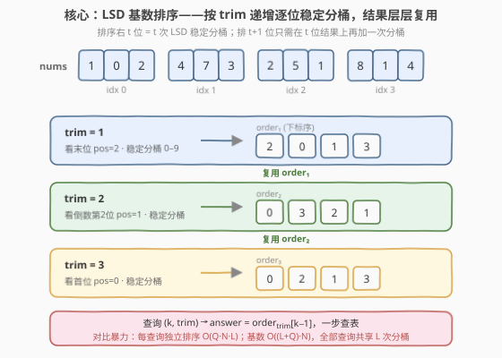
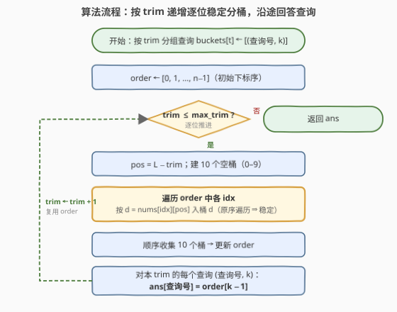
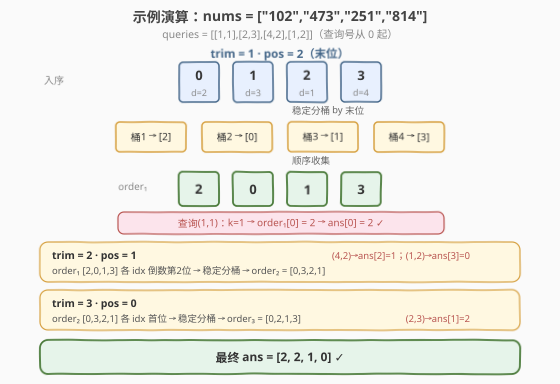

# LeetCode 裁剪数字后查询第 K 小的数字 题解

## 1. 题目概述

- **标题 / 题号**：裁剪数字后查询第 K 小的数字（#2343，medium）
- **链接**：https://leetcode.cn/problems/query-kth-smallest-trimmed-number/
- **难度**：中等
- **标签**：数组、基数排序、排序、稳定排序

**题意**：给你下标从 0 开始的字符串数组 `nums`，每个字符串**长度相等**且只含数字。再给二维整数数组 `queries`，`queries[i] = [ki, trimi]`。对每个查询：

- 把 `nums` 中每个数字**裁剪**到只剩**最右边** `trimi` 个数位；
- 在裁剪后的数字中找**第 `ki` 小**的那个对应的**原下标**（裁剪后相等时，**下标更小**者视为更小）；
- 最后把 `nums` 恢复原状。

返回长度与 `queries` 相等的 `answer`。

**示例 1**：

```text
输入：nums = ["102","473","251","814"], queries = [[1,1],[2,3],[4,2],[1,2]]
输出：[2,2,1,0]
解释：
1. trim=1 → ["2","3","1","4"]，第 1 小是 1，下标 2
2. trim=3 → 原样不变，第 2 小是 251，下标 2
3. trim=2 → ["02","73","51","14"]，第 4 小是 73，下标 1
4. trim=2 → 最小是 02(=2)，下标 0
```

**示例 2**：

```text
输入：nums = ["24","37","96","04"], queries = [[2,1],[2,2]]
输出：[3,0]
解释：trim=1 时有两个 4，下标 0 的 4 视为小于下标 3 的 4 → 第 2 小是下标 3
```

**约束**：

- $1 \le \text{nums.length} \le 100$
- $1 \le \text{nums}[i].\text{length} \le 100$
- $\text{nums}[i]$ 只含数字，所有 $\text{nums}[i]$ 长度相同
- $1 \le \text{queries.length} \le 100$
- $1 \le k_i \le \text{nums.length}$
- $1 \le \text{trim}_i \le \text{nums}[0].\text{length}$

> 💡 本题的「进阶」明确点出**基数排序**。关键不在"每个查询独立排一次"，而在把所有查询按 `trim` 递增排成一条流水线——每多裁一位只多做**一次稳定分桶**，全部查询共享这 $L$ 次分桶的结果。

## 2. 解题思路

### 2.1 暴力思路：每个查询独立排序

最直白的做法：对每个查询 `[k, trim]`，把每个 `nums[i]` 取最右 `trim` 位组成新串，与下标 $i$ 配对后**整体排序**（裁剪后相等时下标小者在前），取第 $k-1$ 个的下标。

```text
for (k, trim) in queries:
    pairs = [(nums[i][-trim:], i) for i in range(n)]
    pairs.sort()                 # 字符串比较 + 下标升序，天然满足平局规则
    ans.append(pairs[k-1][1])
```

一次排序 $O(n \log n \cdot \text{trim})$（字符串比较随 trim 线性增长），共 $Q$ 个查询，合计 $O(Q \cdot n \log n \cdot L)$。约束 $n, Q, L \le 100$ 时也能 AC，但**每个查询都从头排一遍**——`trim=2` 完全无视 `trim=1` 已经做过的排序工作，重复计算严重。

> ⚠️ 暴力的浪费点：`trim` 从 1 到 $L$ 的查询之间**共享同一批数字串**，且"排右 $t+1$ 位"与"排右 $t$ 位"只差一个数位。把查询按 `trim` 递增串成流水线，即可让所有 $L$ 个 `trim` 级别共享一份递增的排序结果。

### 2.2 核心观察：LSD 基数排序——逐位稳定分桶，结果层层复用



把"排序右 $t$ 位"看成 **LSD（最低位优先）基数排序的前 $t$ 趟**：从最低位（最右）开始，每一位做一次**稳定分桶**（10 个桶，对应数字 0–9），桶内保持上一趟的相对顺序，再顺序收集。LSD 的经典结论：

> 若第 $1 \dots t$ 趟都已按"右起第 $1 \dots t$ 位"稳定排好，那么第 $t+1$ 趟只需在当前序上**再对右起第 $t+1$ 位稳定分桶**，结果即按"右起 $t+1$ 位"整体有序。

于是流程非常自然：

1. **按 `trim` 分组查询**：`buckets_by_trim[t]` 收集所有 `(查询号, k)`。
2. **初始 `order = [0,1,…,n−1]`**——下标升序，正是"平局取小下标"这条规则的**载体**。
3. **`for trim in 1..max_trim`**（逐位递增）：
   - `pos = L − trim`（右起第 `trim` 位在串中的下标）；
   - 10 个空桶；**按 `order` 中的次序**把每个下标 `idx` 丢进桶 `nums[idx][pos]`（原序遍历 ⇒ 稳定）；
   - 顺序收集 10 个桶 ⇒ 更新 `order`，此时 `order` 已按"右 `trim` 位"整体有序；
   - 对所有 `trim == t` 的查询 `(查询号, k)`：`ans[查询号] = order[k−1]`，一步查表。

> 💡 **平局自动满足**：LSD 稳定排序"键相等时保留上一趟的相对顺序"。初始序是下标升序 `[0,1,…,n−1]`，第一趟分桶里同桶（同末位）元素保留下标升序；归纳可知任一 `trim` 级别里，裁剪后相等的元素**下标小者必在前**。无需任何显式比较即可满足题面平局规则。

### 2.3 算法流程图



要点：循环里**每轮只对一位做分桶**（$O(n)$），共 $\text{max\_trim} \le L$ 轮；查询答案在对应 `trim` 级别"顺手" $O(1)$ 取走，不另花排序代价。

### 2.4 示例演算



以示例 1 `nums = ["102","473","251","814"]`、`queries = [[1,1],[2,3],[4,2],[1,2]]`（查询号从 0 起）：

| trim | pos | 入序 order | 各 idx 该位数字 | 稳定分桶后 order | 命中查询 → ans |
|------|-----|-----------|------------------|------------------|----------------|
| 1 | 2(末位) | `[0,1,2,3]` | 2,3,1,4 | `[2,0,1,3]` | (1,1) k=1 → `order[0]=2` → ans[0]=2 |
| 2 | 1 | `[2,0,1,3]` | 5,0,7,1 | `[0,3,2,1]` | (4,2) k=4→`order[3]=1`→ans[2]=1；(1,2) k=1→`order[0]=0`→ans[3]=0 |
| 3 | 0(首位) | `[0,3,2,1]` | 1,8,2,4 | `[0,2,1,3]` | (2,3) k=2 → `order[1]=2` → ans[1]=2 |

最终 `ans = [2,2,1,0]`，与题面一致。注意 trim=2 时 `order` 在 trim=1 结果 `[2,0,1,3]` 之上再做一次分桶——**没有从头重排**，这正是复用的体现。

## 3. 参考代码

### C++

```cpp
class Solution {
public:
    vector<int> smallestTrimmedNumber(vector<string>& nums, vector<vector<int>>& queries) {
        int n = nums.size();
        int L = nums[0].size();
        int qn = queries.size();
        int maxTrim = 0;
        for (auto& q : queries) maxTrim = max(maxTrim, q[1]);

        // 按 trim 分组查询：(查询号, k)
        vector<vector<pair<int,int>>> qByTrim(maxTrim + 1);
        for (int i = 0; i < qn; i++)
            qByTrim[queries[i][1]].push_back({i, queries[i][0]});

        vector<int> order(n);
        iota(order.begin(), order.end(), 0);          // 初始下标升序 = 平局规则载体
        vector<int> ans(qn);

        for (int trim = 1; trim <= maxTrim; trim++) {
            int pos = L - trim;                       // 右起第 trim 位
            vector<vector<int>> buckets(10);
            for (int idx : order)                     // 按 order 次序入桶 ⇒ 稳定
                buckets[nums[idx][pos] - '0'].push_back(idx);
            order.clear();
            for (auto& b : buckets)                   // 顺序收集 10 桶
                for (int idx : b) order.push_back(idx);
            for (auto& [qi, k] : qByTrim[trim])       // 顺手回答本 trim 查询
                ans[qi] = order[k - 1];
        }
        return ans;
    }
};
```

> 💡 `iota` 把 `order` 填成 `0,1,…,n−1`；`nums[idx][pos]-'0'` 取该位数字 0–9。结构化绑定 `auto& [qi,k]` 需 C++17，LeetCode 默认支持。`maxTrim` 由查询给出，循环到 `maxTrim` 即可，不必遍历到 $L$。

### Python

```python
from collections import defaultdict

class Solution:
    def smallestTrimmedNumber(self, nums: List[str], queries: List[List[int]]) -> List[int]:
        n, L = len(nums), len(nums[0])
        max_trim = max(t for _, t in queries)
        q_by_trim = defaultdict(list)
        for i, (k, t) in enumerate(queries):
            q_by_trim[t].append((i, k))

        order = list(range(n))                       # 初始下标升序
        ans = [0] * len(queries)

        for trim in range(1, max_trim + 1):
            pos = L - trim
            buckets = [[] for _ in range(10)]
            for idx in order:                         # 原序入桶 ⇒ 稳定
                buckets[int(nums[idx][pos])].append(idx)
            order = [idx for b in buckets for idx in b]   # 顺序收集
            for qi, k in q_by_trim[trim]:
                ans[qi] = order[k - 1]
        return ans
```

> ⚠️ Python 字符串位直接 `int(nums[idx][pos])`，无需 `- '0'`。`max_trim` 只到查询里出现过的最大 `trim`，没查询的 `trim` 级别不必白跑分桶。

## 4. 复杂度分析

| 维度 | 复杂度 | 说明 |
|------|--------|------|
| **时间复杂度** | $O(L \cdot n + Q)$ | 至多 $L$ 趟分桶，每趟 $O(n)$（遍历 + 收集共触 $n$ 次）；分组与沿途回答查询合计 $O(Q)$，每个查询 $O(1)$ 取表 |
| **空间复杂度** | $O(n + Q)$ | `order` 与 10 个桶共 $O(n)$；`q_by_trim` 分组与 `ans` 共 $O(Q)$ |
| 对照：每查询独立排序 | $O(Q \cdot n \log n \cdot L)$ / $O(n)$ | 每查询一次整体排序，字符串比较随 trim 线性增长；正确但重复排除了已被复用的低位工作 |

> 💡 本质是把"排序"从**按查询**重排为**按数位**：每位只排一次而非每查询一次。$n, Q, L \le 100$ 时差异不显，但若规模放大，$O(L \cdot n)$ 对 $O(Q \cdot n \log n \cdot L)$ 的优势立刻拉开。

## 5. 扩展：稳定性与 LSD 正确性

**为什么逐位累加的稳定分桶能产生"右 $t$ 位整体有序"？** 这是 LSD 基数排序的经典引理，按归纳理解最清楚：

- **基线**：`trim=0` 时 `order = [0,1,…,n−1]`，按"空串"平凡有序。
- **归纳步**：设 `order` 已按"右起 $t$ 位"整体有序（含平局下标升序）。第 $t+1$ 趟按右起第 $t+1$ 位稳定分桶后收集：对任意两个下标 $a, b$，看它们的右 $t+1$ 位串 $s_a, s_b$——
  - 若**高位不同**：桶号（高位数字）小者先被收集，高位即定序，低位不起作用；
  - 若**高位相同**：二者同桶，**稳定性**保留它们在上一趟的相对顺序，而上一趟已按"右 $t$ 位"有序 ⇒ 低位部分顺序正确。
  - 两种情况合流，`order` 即按"右 $t+1$ 位"整体有序。

**平局（裁剪后完全相等）**：意味着右 $t$ 位完全相同，整条归纳链上两元素始终同桶、始终靠稳定性保序；而最底层 `order` 初值是下标升序，故**下标小者恒在前**。题面平局规则被初始序"免费"满足。

> 💡 抽象经验：凡是"按键的多位前缀排序 + 平局按某固定序"的问题，把固定序做成**初始序**、把前缀拆成**逐位稳定分桶**，即可把 $O(\text{前缀数} \cdot n \log n)$ 压成 $O(\text{前缀数} \cdot n)$。本题的"前缀"就是裁剪串本身。

## 6. 面试要点

1. **为什么按 `trim` 递增而非递减处理？**

   - 排序右 $t$ 位是 LSD 的前 $t$ 趟；`trim` 递增 = 趟数递增，每趟只在前一趟结果上**加一位**，能直接复用。
   - 若按 `trim` 递减（从高位 MSD），高位定序后低位只能在**高位桶内**局部排，跨桶顺序不能再变——也能做（MSD 基数排序递归分桶），但要维护嵌套桶结构、递归更重；本题查询只问"右 $t$ 位"，LSD 一条线最省。

2. **平局（裁剪后相等取小下标）是怎么自动满足的？**

   - 初始 `order = [0,1,…,n−1]` 是下标升序；LSD 稳定排序"键相等保上一趟序"。整条归纳链上相等的两元素始终同桶、恒保初始相对序 ⇒ 下标小者恒在前。
   - 暴力法用 `(trimmed, i)` 排序让下标做次键；基数法把"次键"做成了**初始序**，省去显式比较。

3. **为什么桶是 10 个？分桶代价怎么算？**

   - 数字串每位只 0–9 共 10 种取值 ⇒ 10 个桶；分桶一遍遍历 `order`（$n$ 次），收集再 $n$ 次，每趟严格 $O(n)$，与位值范围无关。
   - 若字符集更大（如字母），桶数 = 字符集大小 $|\Sigma|$，每趟 $O(n + |\Sigma|)$；本题 $|\Sigma|=10$ 视作常数。

4. **`max_trim` 没到 $L$ 时怎么办？查询只问小 `trim`。**

   - 循环只跑到查询里的 `max_trim`，没有查询的 `trim` 级别直接跳过（其 `q_by_trim` 为空，分桶照跑但无人取表）。题目保证 `trim ≤ L`，故 `pos = L − trim ≥ 0` 不会越界。
   - 若想更省，可只对"出现过查询的 `trim`"排序——但相邻查询 `trim` 之间需要**连续递增**地分桶才能复用，故仍需补齐中间空缺的 `trim` 趟。

5. **能不能不分组、直接按查询原顺序回答？**

   - 可以但低效：每个查询都得"快进"到自己的 `trim`。分组后**同 `trim` 批量取表**，且按 `trim` 升序一次性流过分桶循环，逻辑与性能都最干净。分组本身 $O(Q)$。

> 💡 **一句话总结**：把查询按 `trim` 串成递增流水线，每位做一次稳定分桶复用上一位结果，全部查询共享 $L$ 趟分桶；平局由初始下标升序经稳定性自动满足——$O(L n + Q)$ 的 LSD 基数排序。

## 同类练习题

| # | 题目 | 与本题的关联 |
|---|------|-------------|
| 164 | [最大间距](https://leetcode.cn/problems/maximum-gap/) | 线性时间排序思想——桶排利用"间距 ≤ (max−min)/(n−1)"下界把每桶内差距消掉，与本题同属"非比较排序利用键的结构" |
| 1122 | [数组的相对排序](https://leetcode.cn/problems/relative-sort-array/) | 计数排序——按值建桶累计计数再按自定义次序串接，稳定的计数分桶是本题单趟分桶的"整数版" |
| 1370 | [上升下降字符串](https://leetcode.cn/problems/increasing-decreasing-string/) | 按字符频次分桶后多轮往返收集，反复利用同一组桶，与本题"多趟分桶复用"结构一致 |
| 451 | [根据字符出现频率排序](https://leetcode.cn/problems/sort-characters-by-frequency/) | 桶排序按频率建桶，与"按数位建桶"同型，对照"键值即桶号"的范式 |
