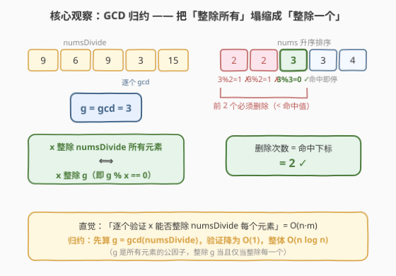
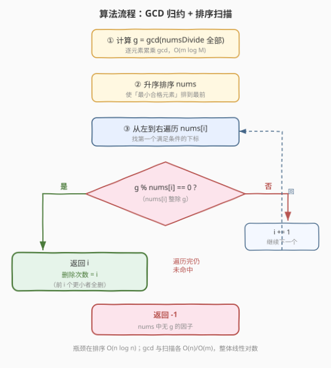
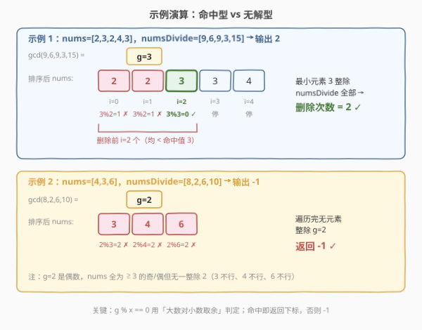

# 使数组可以被整除的最少删除次数

- **题目名称**：使数组可以被整除的最少删除次数
- **链接**：[2344. 使数组可以被整除的最少删除次数](https://leetcode.cn/problems/minimum-deletions-to-make-array-divisible/)
- **难度**：困难
- **标签**：数组、数学、数论、排序、贪心

## 1. 题目概述

给你两个正整数数组 `nums` 和 `numsDivide`。你可以从 `nums` 中删除任意数目的元素。请返回使 `nums` 中**最小**元素可以整除 `numsDivide` 中所有元素的**最少**删除次数。如果无法得到这样的元素，返回 `-1`。

> 整除定义：若 $y \bmod x == 0$，则称 $x$ 整除 $y$（记 $x \mid y$）。

**示例 1**：

```text
输入：nums = [2,3,2,4,3], numsDivide = [9,6,9,3,15]
输出：2
解释：最小元素 2 无法整除 numsDivide 中所有元素。
删除 2 个大小为 2 的元素，得 nums = [3,4,3]，最小元素 3 可整除 numsDivide 所有元素。
```

**示例 2**：

```text
输入：nums = [4,3,6], numsDivide = [8,2,6,10]
输出：-1
解释：nums 中没有任何元素能整除 numsDivide 所有元素。
```

**约束条件**：

- $1 \le \text{nums.length},\ \text{numsDivide.length} \le 10^5$
- $1 \le \text{nums}[i],\ \text{numsDivide}[i] \le 10^9$

> 💡 **关键信号**：「最小元素能整除 `numsDivide` 中**每一个**元素」——这个「每一个」是典型的**逐元素验证**，朴素做是 $O(n\cdot m)$。但整除关系有一个数论事实：$x$ 整除一组数的每一个，当且仅当 $x$ 整除它们的**最大公约数**。于是把 $m$ 次验证塌缩成 1 次与 $g=\gcd(\text{numsDivide})$ 的比较，再排序扫一遍找最小合格元素即可。

---

## 2. 解题思路

### 2.1 暴力思路

最直白的做法：枚举 `nums` 中每个元素 $x$ 作为删完后剩下的「最小元素」候选：

- 验证 $x$ 能整除 `numsDivide` 的**每一个**元素（$O(m)$ 次 `%`）；
- 若合格，计算「让 $x$ 成为最小」需删除多少个元素 = `nums` 中严格小于 $x$ 的元素个数（$O(n)$）；
- 取所有合格候选里删除次数的最小值。

总复杂度 $O(n\cdot m + n^2)$，在 $n,m$ 各达 $10^5$ 时约 $10^{10}$，必然超时。瓶颈在于**逐元素验证整除**与**逐个统计小于 $x$ 的个数**两处。

> ⚠️ 暴力的根本问题：没有利用整除关系的传递性。验证「$x$ 整除全部」其实不必逐个查——所有元素的公因子已经浓缩在一个数 $g$ 里了。

### 2.2 核心观察：GCD 归约 + 排序找最小合格元素



**第一步——GCD 归约。** 由最大公约数的定义，对任意正整数 $x$：

$$
x \mid \text{numsDivide}[i]\ \ \forall i \quad\Longleftrightarrow\quad x \mid g,\ \ \text{其中 } g = \gcd(\text{numsDivide}[0],\text{numsDivide}[1],\dots)
$$

**证明**：
- $(\Rightarrow)$：$x$ 整除每一个 $\text{numsDivide}[i]$，而 $g$ 是它们的公约数之最大者，更精确地 $g$ 是它们**线性组合**的生成元（Bézout 等式：$g=\sum k_i\,\text{numsDivide}[i]$）。$x$ 整除每一项必整除其线性组合，故 $x \mid g$。
- $(\Leftarrow)$：$g$ 整除每一个 $\text{numsDivide}[i]$（$g$ 是公因子），若 $x\mid g$，则由整除的传递性 $x\mid\text{numsDivide}[i]$。

于是「验证 $x$ 能否整除全部」从 $O(m)$ 次 `%` 降为 $O(1)$：只需判 $g \bmod x == 0$。

**第二步——排序找最小合格元素。** 要让删除次数最少，应当让「留下的最小元素」尽量小：删除掉所有比它更小的元素即可，保留等于它及更大的元素。因此：

> 在 `nums` 中找**最小的**满足 $g \bmod x == 0$ 的 $x$；删除次数 = `nums` 中严格小于 $x$ 的元素个数。

把 `nums` **升序排序**后，从左到右扫，第一个满足 $g \bmod \text{nums}[i]==0$ 的下标 $i$ 即为答案——前 $i$ 个元素都更小、必须删掉。若扫完都不满足，返回 $-1$。

> 💡 为什么「最小合格元素」一定使删除次数最少？删除次数 $=$ 比合格元素小的元素个数。合格元素越小，比它小的元素越少，删除次数越少。所以排序后**第一个**命中的就是最优。等值元素（与命中值相同）天然都合格，无需删除，留在数组里也不影响「最小」等于该值。

### 2.3 算法流程图



三步走：① 累乘求 $g=\gcd(\text{numsDivide})$；② 升序排序 `nums`；③ 从左扫，遇 $g\bmod\text{nums}[i]==0$ 返回 $i$，扫完未命中返回 $-1$。

### 2.4 示例演算



**示例 1**（命中型）：
- $g=\gcd(9,6,9,3,15)=3$；排序 `nums` $=[2,2,3,3,4]$；
- 扫描：$i{=}0$ 时 $3\bmod2=1$ ✗；$i{=}1$ 时 $3\bmod2=1$ ✗；$i{=}2$ 时 $3\bmod3=0$ ✓ 命中；
- 返回 $i=2$ ✓（删掉前 2 个 2，剩 $[3,3,4]$，最小元素 3 整除全部）。

**示例 2**（无解型）：
- $g=\gcd(8,2,6,10)=2$；排序 `nums` $=[3,4,6]$；
- 扫描：$2\bmod3=2$ ✗、$2\bmod4=2$ ✗、$2\bmod6=2$ ✗，全部不命中；
- 返回 $-1$ ✓。

> ⚠️ 注意判定写法是 $g\bmod x==0$（大数 $g$ 对小数 $x$ 取余），不是 $x\bmod g$。$x>g$ 时 $x\bmod g$ 恒有意义但无关于整除性；只有 $g\bmod x==0$ 才正确表达「$x$ 整除 $g$」。

---

## 3. 参考代码

### C++

```cpp
class Solution {
public:
    int minOperations(vector<int>& nums, vector<int>& numsDivide) {
        int g = 0;
        for (int x : numsDivide) g = gcd(g, x);     // g = gcd(全部)；gcd(0,x)=x 作起点

        sort(nums.begin(), nums.end());             // 升序，使最小合格元素排到最前
        for (int i = 0; i < (int)nums.size(); ++i)
            if (g % nums[i] == 0) return i;         // 命中：前 i 个更小者全删
        return -1;                                  // 无合格元素
    }
};
```

> 💡 `gcd(0, x) = x` 是 C++17 `std::gcd` 的良定义行为，故用 `g=0` 作累乘起点无需特判空数组（题目保证长度 $\ge1$）。`std::gcd` 在 `<numeric>` 中。$g$ 与 `nums[i]` 均 $\le10^9$，`int` 足够，无溢出。

### Python

```python
class Solution:
    def minOperations(self, nums: List[int], numsDivide: List[int]) -> int:
        g = 0
        for x in numsDivide:
            g = math.gcd(g, x)                      # g = gcd(全部)

        nums.sort()                                  # 升序
        for i, x in enumerate(nums):
            if g % x == 0:                           # 命中：删除次数 = i
                return i
        return -1
```

> ⚠️ Python `math.gcd(0, x)` 返回 `abs(x)`，与 C++ 行为一致，作起点安全。`math.gcd` 对多个数无内置聚合，需手动 reduce（或 `from functools import reduce; g = reduce(math.gcd, numsDivide)`）。

---

## 4. 复杂度分析

| 维度 | 复杂度 | 说明 |
|------|--------|------|
| **时间复杂度** | $O(n\log n + m\log M)$ | 排序主导 $O(n\log n)$；求 $g$ 为 $O(m\log M)$（每次 `gcd` 是 $O(\log M)$，$M=\max\text{numsDivide}$）；扫描 $O(n)$ |
| **空间复杂度** | $O(\log n)$ | 排序的递归栈/临时空间（原地排序，不计输出） |

> 💡 暴力 $O(n\cdot m)$ 与本解 $O(n\log n)$ 的差距全来自 GCD 归约：把「逐元素验证」压成「与一个数比较」。$m$ 达 $10^5$ 时，$O(m\log M)$ 求 $g$ 远优于 $O(n\cdot m)$ 验证。若 `nums` 已有序或改用值域桶，扫描可降到 $O(n)$，但排序已非瓶颈。

---

## 5. 扩展：直接枚举 $g$ 的因子

排序扫描是对「找最小合格 `nums` 元素」的直接实现。换个视角：合格元素必是 $g$ 的因子，故也可**先枚举 $g$ 的所有因子**（$O(\sqrt{g})$，$g\le10^9$ 时约 $31623$ 次），升序排列后逐个查「是否出现在 `nums` 中」（用哈希集合 $O(1)$ 判定）：

```text
factors = [d for d in 1..sqrt(g) if g % d == 0]   # 同时收集 d 和 g//d
sort(factors)
seen = set(nums)
for d in factors:
    if d in seen: return count(nums < d)          # 删除小于 d 的元素个数
return -1
```

此法把扫描对象从 `nums`（$n\le10^5$）换成 $g$ 的因子表（至多约 $1344$ 个，$10^9$ 以内因子最多的数是 $735134400$，有 $1344$ 个因子），常数更小，但需要额外统计「`nums` 中严格小于 $d$ 的个数」（可用排序后的 `bisect` 或值域前缀和）。两种视角等价，**排序扫描写法更短、更不易错**，是首选；因子枚举法在 $g$ 较小而 $n$ 极大时略优。

> 💡 还可不经排序直接求 `nums` 中「整除 $g$ 的最小元素」$x^{*}$，再统计 `nums` 中 $<x^{*}$ 的个数——一次遍历求 $x^{*}$、一次遍历计数，$O(n)$ 时间 $O(1)$ 额外空间。但这牺牲了代码直观性，仅在严格卡空间/时间时考虑。

---

## 6. 面试要点

1. **为什么「$x$ 整除 `numsDivide` 所有元素」等价于「$x$ 整除 $g$」？**
   - $(\Rightarrow)$：$x$ 整除每一项，$g$ 是各项的整系数线性组合（Bézout 等式 $g=\sum k_i\,\text{numsDivide}[i]$），$x$ 整除每一项必整除其组合，故 $x\mid g$。
   - $(\Leftarrow)$：$g$ 整除每一项（$g$ 是公因子），$x\mid g$ 由传递性得 $x\mid\text{numsDivide}[i]$。两端成立即等价。

2. **为什么排序后第一个命中元素就是最优？**
   - 删除次数 $=$ `nums` 中严格小于合格元素 $x$ 的个数。$x$ 越小，比它小的越少，删除次数越少。升序后第一个合格的就是最小合格 $x$，删除次数 $=$ 其下标 $i$。等值元素无需删除，不影响「最小值」。

3. **判定条件为什么是 $g\bmod x==0$ 而非 $x\bmod g==0$？**
   - 「$x$ 整除 $g$」的数学定义是 $g=kx$，即 $g$ 被 $x$ 整除，编程写作 $g\bmod x==0$。写成 $x\bmod g==0$ 表达的是「$g$ 整除 $x$」，方向反了；尤其 $x>g$ 时 $x\bmod g$ 与「$x$ 是否整除 $g$」无关（$x>g$ 必然 $x\nmid g$，除非 $g=0$）。这是本题最高频的笔误。

4. **$g=0$ 会出现吗？如何处理？**
   - 不会。`numsDivide` 元素均为正整数（$\ge1$），$\gcd$ 累乘结果 $\ge1$。但若数组含 $0$，$\gcd(0,0)=0$，此时任何 $x$ 都「整除 $0$」（因 $0\bmod x=0$），应返回 $0$——以 `gcd(0,x)=x` 为起点天然兼容，但需留意语义。本题约束保证 $g\ge1$，无需特判。

5. **暴力 $O(n\cdot m)$ 与 GCD 归约 $O(n\log n)$ 的本质区别？**
   - 区别在「验证整除性」的成本：暴力对每个候选 $x$ 都遍历 `numsDivide` 全体，$O(m)$ 次 `%`；归约把「全部整除」压缩进单个数 $g$，验证降为 $O(1)$。这是**以一次 $O(m)$ 预处理换取 $n$ 次 $O(1)$ 验证**的经典权衡，总成本从 $O(nm)$ 降到 $O(n+m)$（加排序 $O(n\log n)$）。

> 💡 **一句话总结**：用 $g=\gcd(\text{numsDivide})$ 把「整除全部」塌缩成「整除 $g$」，排序 `nums` 后第一个满足 $g\bmod\text{nums}[i]==0$ 的下标即最少删除次数，否则 $-1$。

---

## 7. 同类练习题

- [914. 卡牌分组](https://leetcode.cn/problems/x-of-a-kind-in-a-deck-of-cards/)：同样「先求 $\gcd$ 再判定」——统计每张牌频次后取所有频次的 $\gcd$，若 $\gcd\ge2$ 即可分组，与本题「$\gcd$ 归约 + 因子判定」同源
- [1071. 字符串的最大公因子](https://leetcode.cn/problems/greatest-common-divisor-of-strings/)：字符串版的 $\gcd$，用辗转相减/相除验证 $s{+}t$ 是否等于 $t{+}s$ 后对长度求 $\gcd$，对照本题对数值数组求 $\gcd$
- [1979. 找出数组的最大公约数](https://leetcode.cn/problems/find-greatest-common-divisor-of-array/)：直接求数组最大值与最小值的 $\gcd$，$\gcd$ 入门题，可与本题「$\gcd$ 归约」对照巩固
- [8. 字符串转换整数 (atoi)](https://leetcode.cn/problems/string-to-integer-atoi/)（[站内题解](../0001-0100/8_字符串转换整数atoi.md)）：同为「看似需逐元素模拟、实则可归约」的降维思路，对照暴力与最优的差距
