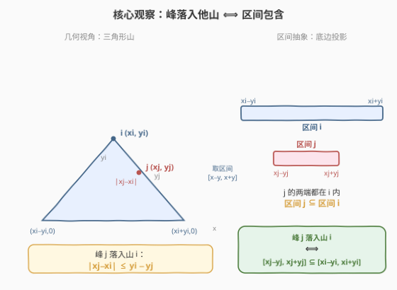
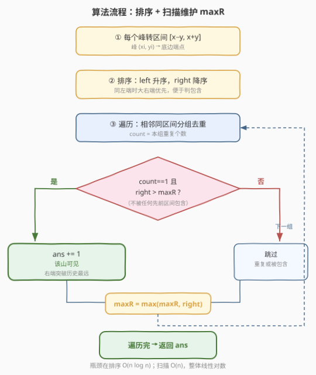
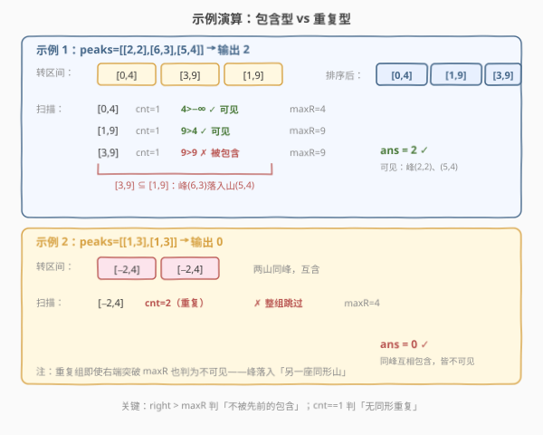

# 寻找可见山的数量

- **题目名称**：寻找可见山的数量
- **链接**：[2345. 寻找可见山的数量](https://leetcode.cn/problems/finding-the-number-of-visible-mountains/)
- **难度**：中等
- **标签**：数组、排序、区间、几何

## 1. 题目概述

给定一个数组 `peaks`，其中 `peaks[i] = [xi, yi]` 表示一座山峰的峰位于坐标 `(xi, yi)`。每座山是一个**等腰三角形**，其三个顶点为 `(xi - yi, 0)`、`(xi + yi, 0)`（底边在 X 轴上）和 `(xi, yi)`（峰顶）。

一个点 $(x, y)$ 落在某座山（峰为 $(x_i, y_i)$）的三角形**内部或边界上**时，称它「在这座山里」。一座山是**可见的**，当且仅当它的峰顶**不在任何其它山的三角形里**。返回可见山的数量。

> ⚠️ 峰坐标相同的两座山视为**不同**的山——它们彼此把对方的峰顶包含在内，因此都不可见。

**示例 1**：

```text
输入：peaks = [[2,2],[6,3],[5,4]]
输出：2
解释：峰 (2,2) 与 (5,4) 可见；峰 (6,3) 落入山 (5,4) 的三角形内（|6−5| ≤ 4−3 成立）。
```

**示例 2**：

```text
输入：peaks = [[1,3],[1,3]]
输出：0
解释：两座山同峰，彼此互含，皆不可见。
```

**约束条件**：

- $1 \le \text{peaks.length} \le 10^5$
- $\text{peaks}[i] = [x_i, y_i]$
- $1 \le x_i, y_i \le 10^5$

> 💡 **关键信号**：「点是否在等腰三角形内」看似是几何题，但等腰三角形的底边恰以 $[x_i - y_i,\ x_i + y_i]$ 落在 X 轴上——把每座山压缩成**底边区间**后，「峰落入他山」就塌缩成「区间被包含」。于是题目从一个 $O(n^2)$ 的几何判定问题归约成经典的「区间被覆盖」问题，用排序 + 一次扫描即可。

---

## 2. 解题思路

### 2.1 暴力思路

最直白的做法：对每座山 $j$，遍历所有**其它**山 $i$，判定峰 $(x_j, y_j)$ 是否落入山 $i$：

$$
|x_j - x_i| \le y_i - y_j
$$

若存在任一 $i \ne j$ 使其成立，则 $j$ 不可见；否则可见。总复杂度 $O(n^2)$，在 $n = 10^5$ 时约 $10^{10}$，必然超时。瓶颈在于「为每个峰逐一检查所有其它山」。

> ⚠️ 暴力的根本问题：把「几何包含」当作「逐对比较」，没有发现包含关系可以投影成一维区间上的「被覆盖」判定，从而一次性排序消解。

### 2.2 核心观察：几何包含 ⟺ 区间包含



**第一步——把山压成区间。** 山 $i$ 的等腰三角形底边在 X 轴上恰好覆盖 $[x_i - y_i,\ x_i + y_i]$。对任意点 $(x, y)$（$y \ge 0$），它落入该三角形（含边界）的充要条件是：

$$
|x - x_i| + |y| \le y_i
$$

（这是以峰顶投影为基准的「菱形/三角」不等式；代入三个顶点即可验证：$(x_i, y_i)$ 给 $0 + y_i \le y_i$ ✓，底边端点给 $y_i + 0 \le y_i$ ✓。）

**第二步——峰落入他山的等价改写。** 把上式用于「峰 $j$ 落入山 $i$」（$y_j \ge 1 > 0$）：

$$
|x_j - x_i| \le y_i - y_j \quad(\text{要求 } y_i \ge y_j)
$$

展开绝对值：

$$
-(y_i - y_j) \le x_j - x_i \le y_i - y_j
\ \Longleftrightarrow\ 
\underbrace{x_j + y_j}_{r_j} \le \underbrace{x_i + y_i}_{r_i}
\ \text{ 且 }\ 
\underbrace{x_j - y_j}_{l_j} \ge \underbrace{x_i - y_i}_{l_i}
$$

即

$$
[l_j,\ r_j] \subseteq [l_i,\ r_i],\quad \text{其中 } l = x - y,\ r = x + y
$$

> 💡 **一句话**：峰 $j$ 落入山 $i$ ⟺ 区间 $j$ 被**包含**在区间 $i$ 里（含边界）。于是「山 $j$ 可见」⟺ 区间 $j$ **不被任何其它区间包含**。

**第三步——「不被任何其它区间包含」怎么一次扫描判定？** 把所有区间按 **左端升序** 排好。对一个区间 $j$，所有在它**之前**的区间左端都 $\le l_j$，故它们能包含 $j$ 的充要条件是「右端 $\ge r_j$」。只要维护一个变量 $\text{maxR} =$ 已扫描区间的右端最大值：

- 若 $r_j > \text{maxR}$：没有任何先前区间右端达到 $r_j$，故 $j$ 不被任何先前区间包含 → 可见候选；
- 若 $r_j \le \text{maxR}$：必有某先前区间（取到 $\text{maxR}$ 的那个）左端 $\le l_j$ 且右端 $= \text{maxR} \ge r_j$，故 $j$ 被它包含 → 不可见。

**两个细节**：

1. **同左端时按右端降序**：保证「同起点的大区间」先于「同起点的小区间」出现，使后者进入扫描时 $\text{maxR}$ 已被前者抬高，从而正确判为被包含（否则会把被包含者误判可见）。
2. **同峰重复**：峰坐标完全相同的两座山，区间完全相同，彼此互含 → **都不可见**。排序后它们相邻成组；若某区间在本组出现 $\ge 2$ 次，整组跳过（即便 $r > \text{maxR}$ 也不计）。

> ⚠️ 细节 2 不可或缺：若不去重，重复组里**第一个**区间会因 $r > \text{maxR}$ 被误判为可见——但它实际被同形的另一座山包含。用「本组仅出现 1 次」的判定即可堵住这个漏洞。

### 2.3 算法流程图



四步走：① 每个峰 $(x, y)$ 转区间 $[x-y,\ x+y]$；② 排序：左端升序、同左端右端降序；③ 顺序扫描，相邻同区间成组、统计重复数 `cnt`；④ 若 `cnt == 1` 且 `right > maxR` 则 `ans += 1`；无论是否计数，都更新 `maxR = max(maxR, right)`。

### 2.4 示例演算



**示例 1**（包含型）：
- 转区间：$(2,2)\to[0,4]$、$(6,3)\to[3,9]$、$(5,4)\to[1,9]$；
- 排序后：$[0,4],\ [1,9],\ [3,9]$；
- 扫描：$[0,4]$：$4>-\infty$ ✓ 可见，$\text{maxR}=4$；$[1,9]$：$9>4$ ✓ 可见，$\text{maxR}=9$；$[3,9]$：$9>9$ ✗ 被包含（$[3,9]\subseteq[1,9]$，即峰 $(6,3)$ 落入山 $(5,4)$）；
- 结果 $2$ ✓。

**示例 2**（重复型）：
- 转区间：两座 $(1,3)\to[-2,4]$、$[-2,4]$；
- 扫描：本组 `cnt = 2`，整组跳过，$\text{maxR}=4$；
- 结果 $0$ ✓（同峰互含皆不可见）。

> 💡 判定方向：`right > maxR`（严格大于）。`right == maxR` 也算被包含——此时存在某先前区间左端 $\le l_j$ 且右端 $= r_j$，正好把 $j$ 套住。这与示例 1 中 $[3,9]$ 因 $9 = \text{maxR}$ 被判不可见一致。

---

## 3. 参考代码

### C++

```cpp
class Solution {
public:
    int visibleMountains(vector<vector<int>>& peaks) {
        int n = peaks.size();
        vector<pair<int,int>> iv;
        iv.reserve(n);
        for (auto& p : peaks)
            iv.emplace_back(p[0] - p[1], p[0] + p[1]);   // [l, r] = [x - y, x + y]

        // 排序：左端升序；左端相同时右端降序（大右端先出，便于用 maxR 判包含）
        sort(iv.begin(), iv.end(), [](const auto& a, const auto& b){
            if (a.first != b.first) return a.first < b.first;
            return a.second > b.second;
        });

        int ans = 0, maxR = INT_MIN;
        for (int i = 0; i < n; ) {
            int j = i;
            while (j < n && iv[j] == iv[i]) ++j;          // 相邻同区间成组（处理同峰重复）
            int cnt = j - i;
            if (cnt == 1 && iv[i].second > maxR) ++ans;   // 不被任何先前区间包含且无重复
            maxR = max(maxR, iv[i].second);               // 无论是否计数都要更新
            i = j;
        }
        return ans;
    }
};
```

> 💡 `pair` 的默认字典序是「first 升序，second 升序」，而这里同 `first` 需要 `second` **降序**，故显式传比较器。`pair` 相等比较 `iv[j] == iv[i]` 同时比对左、右端，恰好刻画「同峰」。

### Python

```python
class Solution:
    def visibleMountains(self, peaks: List[List[int]]) -> int:
        iv = [(x - y, x + y) for x, y in peaks]            # [l, r] = [x - y, x + y]
        # 排序：左端升序；左端相同时右端降序
        iv.sort(key=lambda t: (t[0], -t[1]))

        ans = 0
        maxR = -inf
        i = 0
        n = len(iv)
        while i < n:
            j = i
            while j < n and iv[j] == iv[i]:                # 相邻同区间成组（处理同峰重复）
                j += 1
            cnt = j - i
            if cnt == 1 and iv[i][1] > maxR:               # 不被任何先前区间包含且无重复
                ans += 1
            maxR = max(maxR, iv[i][1])                     # 无论是否计数都要更新
            i = j
        return ans
```

> ⚠️ Python 中 `-t[1]` 把「右端降序」转成「负右端升序」，与 `key` 元组升序一致。`maxR` 初值用 `float('-inf')`，需 `from math import inf` 或直接 `-float('inf')`。

---

## 4. 复杂度分析

| 维度 | 复杂度 | 说明 |
|------|--------|------|
| **时间复杂度** | $O(n \log n)$ | 排序主导 $O(n \log n)$；转区间 $O(n)$；扫描成组 $O(n)$（内层 `while` 越过的元素被外层跳过，总移动 $O(n)$） |
| **空间复杂度** | $O(n)$ | 存放 $n$ 个区间元组；排序额外 $O(\log n)$ 栈空间 |

> 💡 暴力 $O(n^2)$ 与本解 $O(n \log n)$ 的差距全来自「区间归约」：把「逐对几何判定」塌缩成「排序 + 一次扫描」，用一次 $O(n \log n)$ 的排序消解所有包含关系。若输入已按 $l$ 有序，扫描可降到 $O(n)$，但排序仍是瓶颈。

---

## 5. 扩展：单调栈视角与「不被包含」的等价刻画

`maxR` 维护的其实是「扫描过的区间中右端最远者」。换一个等价视角：把区间按 $l$ 升序排好后，序列的「右端最大前缀」$\text{maxR}_k = \max_{i \le k} r_i$ 是单调不减的。一个区间 $k$ 被先前包含，当且仅当 $r_k \le \text{maxR}_{k-1}$；不被包含当且仅当它「把右端最大值**严格推高**」。于是「可见」⟺「该区间是右端最大前缀的一个严格递增台阶，且无同形重复」。

这等价于一个去掉重复后的**右端严格递增子序列**计数：

```text
排序后去重（保留出现次数）
对每个唯一区间 [l, r]：
    若 r 严格大于已见最大右端 → 计入并更新；否则跳过
    若该区间原出现次数 > 1 → 不计入（哪怕它推高了右端）
```

此视角与 [1288. 删除被覆盖区间](https://leetcode.cn/problems/remove-covered-intervals/) 的解法**完全同构**——后者只需统计「被覆盖的区间数」，不涉及「同形重复互含」的细节，因而是本题的简化版。本题多出的难点正在重复处理：重复区间彼此互含，连「推高右端」的那个也不可见。

> 💡 另一种实现：先把区间去重（用哈希集合记录「出现过 $>1$ 次的区间」），再排序扫描，对每个区间判「$r > \text{maxR}$ 且不在重复集合中」。时间仍 $O(n \log n)$，但常数略大；分组写法一次扫描既判重复又判包含，更紧凑。

---

## 6. 面试要点

1. **为什么「峰落入他山」能等价成「区间被包含」？**
   - 山是底边在 X 轴上的等腰三角形，底边恰覆盖 $[x_i - y_i, x_i + y_i]$。点 $(x, y)$ 在三角形内（含边界）⟺ $|x - x_i| + |y| \le y_i$。代入峰 $j$（$y_j > 0$）得 $|x_j - x_i| \le y_i - y_j$，展开即 $x_j + y_j \le x_i + y_i$ 且 $x_j - y_j \ge x_i - y_i$，即 $[l_j, r_j] \subseteq [l_i, r_i]$，其中 $l = x - y,\ r = x + y$。于是几何包含塌缩成一维区间包含。

2. **为什么 `right > maxR`（严格大于）就能判「不被任何先前区间包含」？**
   - 排序后先前区间左端都 $\le l_j$。它们能包含 $j$ 当且仅当某者右端 $\ge r_j$。$\text{maxR}$ 是先前右端最大值：$r_j > \text{maxR}$ 意味着没有任何先前区间右端达到 $r_j$，故无一包含 $j$；$r_j \le \text{maxR}$ 则取到 $\text{maxR}$ 的那个先前区间（左端 $\le l_j$、右端 $= \text{maxR} \ge r_j$）必包含 $j$。`==` 属被包含，故必须严格大于。

3. **同左端时为何按右端降序？反过来会怎样？**
   - 同左端意味着两区间共享左端点；右端大者「套住」右端小者。降序让大者先出、先抬高 $\text{maxR}$，小者随后因 $r \le \text{maxR}$ 被正确判为被包含。若改成升序，被包含者会先于包含者出现，此时 $\text{maxR}$ 还未被抬高，它会被误判为可见。这是本题最高频的笔误。

4. **同峰重复的两座山为何都不可见？怎么处理？**
   - 同峰 → 同区间 → 彼此 $[l, r] \subseteq [l, r]$（含边界），互相包含，故都不可见。排序后同区间相邻成组；统计本组重复数 `cnt`，仅当 `cnt == 1` 才考虑计入。否则即便该组把 $\text{maxR}$ 推高也不计。少了这一步，重复组里第一个区间会被 $r > \text{maxR}$ 误判为可见。

5. **暴力 $O(n^2)$ 与区间归约 $O(n \log n)$ 的本质区别？**
   - 暴力对每座山逐一检查所有其它山，把包含关系当「逐对比较」；归约发现「被任何山包含」可投影成一维「被某个右端更大的区间套住」，排序使所有候选包含者集中到扫描的前缀，用一个 $\text{maxR}$ 变量即可判定。即**用一次 $O(n \log n)$ 排序把 $n$ 次 $O(n)$ 检查压缩成 $n$ 次 $O(1)$ 比较**。

> 💡 **一句话总结**：每座山映射为底边区间 $[x-y, x+y]$，「可见」⟺「区间不被任何其它区间包含且无同形重复」；按左端升序、右端降序排序后，一次扫描维护 $\text{maxR}$，对重复数为 1 且右端严格突破 $\text{maxR}$ 的区间计数即可。

---

## 7. 同类练习题

- [1288. 删除被覆盖区间](https://leetcode.cn/problems/remove-covered-intervals/)（[站内题解](../1201-1300/1288_删除被覆盖区间.md)）：本题的简化版——统计「被另一区间覆盖」的区间数，同样排序 + `maxR`，只是没有「同形重复互含」的细节，正好对照巩固模板
- [56. 合并区间](https://leetcode.cn/problems/merge-intervals/)（[站内题解](../0001-0100/56_合并区间.md)）：区间族母题，按左端排序后贪心合并，承接本题「按左端排序 + 一次扫描」的范式
- [435. 无重叠区间](https://leetcode.cn/problems/non-overlapping-intervals/)（[站内题解](../0401-0500/435_无重叠区间.md)）：区间重叠/包含的贪心调度，按右端排序求最少删除，与本题「右端最远者套住他人」同源
- [986. 区间列表的交集](https://leetcode.cn/problems/interval-list-intersection/)（[站内题解](../0901-1000/986_区间列表的交集.md)）：有序区间的双指针归并取交集，与本题「区间端点比较」一脉相承，可作端点处理的基础练习
