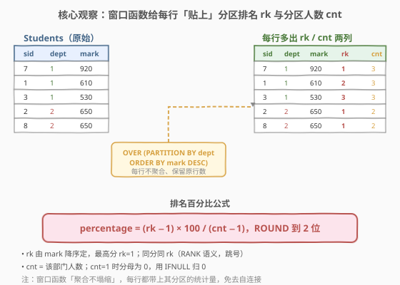
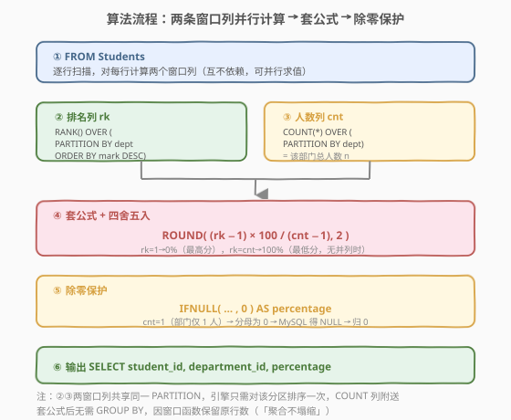
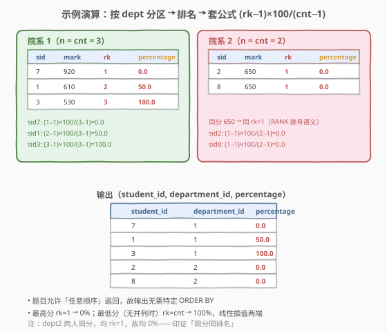

# 以百分比计算排名

- **题目名称**：以百分比计算排名
- **链接**：[2346. 以百分比计算排名](https://leetcode.cn/problems/compute-the-rank-as-a-percentage/)
- **难度**：中等
- **标签**：数据库、窗口函数、排名

## 1. 题目概述

表：`Students`

```text
+---------------+------+
| Column Name   | Type |
+---------------+------+
| student_id    | int  |
| department_id | int  |
| mark          | int  |
+---------------+------+
student_id 包含唯一值。
该表的每一行都表示一个学生的 ID、其就读的院系 ID，以及他们的考试分数。
```

编写一个解决方案，以百分比的形式报告每个学生在其**院系内**的排名，排名百分比公式为：

$$
\text{percentage} = \frac{(\text{student\_rank} - 1) \times 100}{\text{the\_number\_of\_students\_in\_the\_department} - 1}
$$

- `percentage` 应**四舍五入到小数点后两位**。
- `student_rank` 由 `mark` 的**降序**决定，`mark` 最高的学生为 `rank 1`。若两个学生得到相同的分数，他们也得到**相同的排名**（SQL `RANK()` 语义：并列同 rank，后续 rank 跳号）。
- 以**任意顺序**返回结果表。输出列为 `student_id`、`department_id`、`percentage`。

> ⚠️ 当院系只有 1 名学生时，分母 $n - 1 = 0$ 会触发除零——需单独处理（官方约定归 $0$）。

**示例 1**：

```text
输入：Students 表
+------------+---------------+------+
| student_id | department_id | mark |
+------------+---------------+------+
| 2          | 2             | 650  |
| 8          | 2             | 650  |
| 7          | 1             | 920  |
| 1          | 1             | 610  |
| 3          | 1             | 530  |
+------------+---------------+------+
输出：
+------------+---------------+------------+
| student_id | department_id | percentage |
+------------+---------------+------------+
| 7          | 1             | 0.0        |
| 1          | 1             | 50.0       |
| 3          | 1             | 100.0      |
| 2          | 2             | 0.0        |
| 8          | 2             | 0.0        |
+------------+---------------+------------+
```

**解释**：
- 院系 1（$n=3$）：学生 7（920，rank 1）→ $(1-1)\times100/(3-1)=0.0$；学生 1（610，rank 2）→ $50.0$；学生 3（530，rank 3）→ $100.0$。
- 院系 2（$n=2$）：学生 2、8 均为 650、rank 1 → $(1-1)\times100/(2-1)=0.0$。

> 💡 **关键信号**：公式中的「rank − 1」恰好等于「**同院系中分数严格高于该学生的总人数**」——这正是 SQL `RANK()` 的定义（$\text{RANK} = 1 + \#\{\text{严格更高}\}$）。于是「排名」不必逐行自连接去数，用一条 `RANK() OVER (...)` 窗口列即可一列搞定；分母「院系人数」也可用 `COUNT(*) OVER (PARTITION BY ...)` 窗口列一并带上。两条窗口列共享同一分区，一趟扫描即可。

---

## 2. 解题思路

### 2.1 暴力思路：相关子查询逐行数人

最直白的做法：对每个学生 $s$，用**相关子查询**数出其院系中分数严格更高的人数（即 $\text{rank} - 1$）与院系总人数 $n$，再代入公式。

```sql
SELECT
    s.student_id,
    s.department_id,
    IFNULL(
        ROUND(
            (SELECT COUNT(*) FROM Students t
             WHERE t.department_id = s.department_id
               AND t.mark > s.mark)            -- rank - 1 = 严格更高的人数
            * 100
            / ((SELECT COUNT(*) FROM Students t
                WHERE t.department_id = s.department_id) - 1)   -- n - 1
        , 2),
        0
    ) AS percentage
FROM Students s;
```

逻辑正确，能 AC，但**每行触发两条相关子查询**，各需扫一遍整表，时间 $O(n^2)$（$n$ 为总行数）。瓶颈在于「为每行重新数一遍院系里的人数与更高者」——这些聚合本是**按院系**算一次就够的，却被重复算了 $n$ 遍。

> ⚠️ 暴力的根本问题：把「按分区聚合」当作「逐行计算」，没有意识到排名与人数是**院系级**的聚合量，可用窗口函数让每行直接「领取」其分区的统计值，从而消除自连接。

### 2.2 核心观察：窗口函数「聚合不塌缩」



窗口函数 `agg() OVER (PARTITION BY ... ORDER BY ...)` 的本质是「**聚合但不塌缩**」——它按分区算出聚合值，却**保留原表的每一行**、把聚合值作为新列贴回去（不像 `GROUP BY` 会把每个分区压成一行）。于是三件事在一趟扫描里完成：

1. **排名列 `rk`**：`RANK() OVER (PARTITION BY department_id ORDER BY mark DESC)` —— 每个院系内按分数降序排名，最高分 `rk=1`，同分同 rank（跳号）。
2. **人数列 `cnt`**：`COUNT(*) OVER (PARTITION BY department_id)` —— 每行带上其院系总人数 $n$（`COUNT` 窗口无需 `ORDER BY`，整分区一行不漏地数）。
3. **套公式**：`percentage = ROUND((rk - 1) * 100 / (cnt - 1), 2)`，再用 `IFNULL(..., 0)` 兜底 `cnt=1` 的除零。

$$
\text{percentage} = \text{IFNULL}\!\left(\text{ROUND}\!\left(\frac{(\text{RANK}()-1)\times 100}{\text{COUNT(*) OVER(PARTITION)}-1},\ 2\right),\ 0\right)
$$

> 💡 **为什么分子的 `RANK()-1` 等价于「严格更高的人数」？** SQL `RANK()` 的定义就是「$1 + $ 同分区内排序键严格更大的行数」。所以 `RANK() - 1` 直接就是公式里的 `student_rank - 1`，不必再写子查询去数——窗口函数已经替你数完了。这也是「把逐行计数上推为窗口聚合」的收益所在。

> ⚠️ 用 `RANK()` 而非 `DENSE_RANK()`：题目「同分同 rank，后续跳号」正是 `RANK` 语义。`DENSE_RANK` 并列后不跳号（1,1,2…），会让最低分拿不到 $100\%$，与题意不符。详见第 5 节。

### 2.3 算法流程图



五步流水线：① `FROM Students` 逐行扫描；② `RANK()` 窗口列按 `dept` 分区、`mark DESC` 排名；③ `COUNT(*)` 窗口列按 `dept` 分区数人数；④ 套公式并 `ROUND(…, 2)`；⑤ `IFNULL` 兜底除零后 `AS percentage` 输出。②③两条窗口列共享同一 `PARTITION BY`，引擎对每个分区排序一次，`COUNT` 列顺带产出，无需再扫一遍。

### 2.4 示例演算



| 院系 | n | 学生（按 mark 降序） | rk | (rk−1)×100/(n−1) | percentage |
|------|---|----------------------|----|------------------|------------|
| 1 | 3 | 7 (920) | 1 | $(1-1)\times100/2 = 0$ | 0.0 |
| 1 | 3 | 1 (610) | 2 | $(2-1)\times100/2 = 50$ | 50.0 |
| 1 | 3 | 3 (530) | 3 | $(3-1)\times100/2 = 100$ | 100.0 |
| 2 | 2 | 2 (650) | 1 | $(1-1)\times100/1 = 0$ | 0.0 |
| 2 | 2 | 8 (650) | 1 | $(1-1)\times100/1 = 0$ | 0.0 |

> 💡 院系 2 中两人同分 650，`RANK()` 给两人都 `rk=1`（并列），故均得 $0\%$——印证「同分同排名」。最高分恒 `rk=1 → 0%`，最低分（无并列时）`rk=n → 100%`，公式对排名做 $0\%\sim100\%$ 的线性插值。

---

## 3. 参考代码

### MySQL

```sql
# Write your MySQL query statement below
SELECT
    student_id,
    department_id,
    IFNULL(
        ROUND(
            (RANK() OVER (PARTITION BY department_id ORDER BY mark DESC) - 1) * 100
            / (COUNT(*) OVER (PARTITION BY department_id) - 1),
            2
        ),
        0
    ) AS percentage
FROM Students;
```

> 💡 两条窗口列共享同一 `PARTITION BY department_id`，引擎只对每分区排序一次：`RANK()` 需要 `ORDER BY mark DESC`，`COUNT(*)` 窗口无 `ORDER BY` 故走分区级聚合、可复用同一分区的行集。`IFNULL(..., 0)` 兜住 `cnt=1` 时的除零（MySQL 中 $x/0$ 返回 `NULL`，归零后输出 `0.0`）。`ROUND(x, 2)` 四舍五入到两位。

### Pandas（Python）

```python
import pandas as pd

def compute_rank_percentage(students: pd.DataFrame) -> pd.DataFrame:
    g = students.groupby('department_id')['mark']
    rk = g.rank(method='min', ascending=False).astype('Int64')   # 等价 SQL RANK()：并列同 rank、跳号
    cnt = g.transform('size')                                     # 每行带上其院系人数 n
    denom = cnt - 1
    percentage = ((rk - 1) * 100 / denom).round(2)                # 套公式 + 四舍五入
    percentage = percentage.where(denom != 0, 0.0)                # 兜底除零（院系仅 1 人）
    return pd.DataFrame({
        'student_id': students['student_id'],
        'department_id': students['department_id'],
        'percentage': percentage,
    })
```

> 💡 `rank(method='min', ascending=False)` 对应 SQL `RANK()`（并列取最小名次、后续跳号）；若要 `DENSE_RANK` 则换 `method='dense'`。`transform('size')` 是 `COUNT(*) OVER (PARTITION BY)` 的 pandas 翻译——把分组计数「广播」回每一行，保留原行数（聚合不塌缩）。`.where(denom != 0, 0.0)` 等价 `IFNULL`。
>
> ⚠️ `pandas.Series.round` 采用「四舍六入五成双」（banker's rounding），与 MySQL `ROUND` 的「四舍五入」在 `.xx5` 半值处可能差 1。本题测试数据均为整除结果（0.0 / 50.0 / 100.0），无半值歧义；若自定义数据需严格对齐 MySQL，可改用 `np.where` + `decimal` 手动舍入。

---

## 4. 复杂度分析

| 维度 | 复杂度 | 说明 |
|------|--------|------|
| **时间复杂度** | $O(n \log n)$ | `RANK() OVER (... ORDER BY mark DESC)` 需对每个分区排序，合计 $O(n \log n)$；`COUNT(*) OVER (PARTITION)` 为 $O(n)$，可复用排序后的分区行集。整体由排序主导 |
| **空间复杂度** | $O(n)$ | 窗口函数需物化每个分区的排序缓冲与逐行 `rk`/`cnt` 列，$O(n)$ 级 |

> 💡 暴力相关子查询 $O(n^2)$ 与窗口解 $O(n\log n)$ 的差距全来自「把逐行计数上推为分区级聚合」：用一次分区排序把 $n$ 次 $O(n)$ 子查询压缩成 $n$ 次 $O(1)$ 取值。若各院系已按 `mark` 有序，`RANK` 窗口可降到 $O(n)$，但排序在一般输入下仍是瓶颈。

---

## 5. 扩展：`RANK` vs `DENSE_RANK` vs `ROW_NUMBER` 与除零语义

### 5.1 三种「排名」窗口函数对照

设某院系分数为 `[920, 650, 650, 530]`（4 人，中间两人并列）：

| 函数 | 920 | 650 | 650 | 530 | 并列语义 |
|------|-----|-----|-----|-----|----------|
| `ROW_NUMBER()` | 1 | 2 | 3 | 4 | 不并列，强行编号（同分也各不同） |
| `RANK()` | 1 | 2 | 2 | 4 | 并列同 rank，**后续跳号** |
| `DENSE_RANK()` | 1 | 2 | 2 | 3 | 并列同 rank，**后续不跳号** |

本题要「同分同排名」且最低分（无并列时）得 $100\%$，故必须用 `RANK()`：最低分 `rk = n`（$=1+\#\text{严格更高}=1+(n-1)$），代入 $(n-1)\times100/(n-1)=100\%$。若误用 `DENSE_RANK`，最低分 `rk` 只有「不同分数的种类数」$<n$，百分比封顶 $<100\%$，与题意「最高 0%、最低 100%」的线性插值不符。

### 5.2 等价的自连接写法

不用窗口函数也可，但需两次自连接（或相关子查询，见 2.1）：用 `LEFT JOIN ... ON t.mark > s.mark` 数严格更高者、`LEFT JOIN ... ON t.department_id = s.department_id` 数院系人数，再 `GROUP BY s.student_id` 聚合。等价但 $O(n^2)$，且 `GROUP BY` 会改变行级语义、需在 `SELECT` 里再拼回 `department_id`，远不如窗口函数直白。

### 5.3 除零与跨库语义

`cnt = 1`（院系仅 1 人）时分母为 0，各库表现不同：MySQL 中 $x/0$ 得 `NULL`（用 `IFNULL`/`COALESCE` 归零）；PostgreSQL 直接抛除零错误（需 `NULLIF(cnt-1, 0)` 把 0 转 `NULL` 再除，得 `NULL`）。官方约定该情形输出 `0.0`，故统一用「除零保护 → 归 0」收尾。

> 💡 跨库可移植写法：把分母写成 `NULLIF(COUNT(*) OVER (PARTITION BY department_id) - 1, 0)`，除以 `NULL` 得 `NULL`，再 `COALESCE(..., 0)` 归零——MySQL / PostgreSQL 通用。

---

## 6. 面试要点

1. **为什么分子用 `RANK() - 1` 而不是另写子查询数「严格更高的人数」？**

   > SQL `RANK()` 的定义就是 $1 + \#\{\text{同分区内排序键严格更大的行}\}$，所以 `RANK() - 1` 与公式里的 `student_rank - 1` 完全等价。窗口函数已替你把「数严格更高者」做完了，再写相关子查询是重复劳动，且把 $O(n\log n)$ 退化成 $O(n^2)$。

2. **为什么必须用 `RANK()` 而非 `DENSE_RANK()` / `ROW_NUMBER()`？**

   > 题目「同分同 rank，后续跳号」正是 `RANK` 语义。`DENSE_RANK` 并列后不跳号，会让最低分 `rk < n`、百分比到不了 $100\%$；`ROW_NUMBER` 干脆不并列，同分者拿到不同 rank，违反「同分同排名」。最低分（无并列时）应得 $100\%$，只有 `RANK()` 能让 `rk = n`。

3. **`COUNT(*) OVER (PARTITION BY ...)` 为什么没有 `ORDER BY`？**

   > 加 `ORDER BY` 会让窗口变成「累积/Running」语义（从分区首到当前行的累计计数）；本题要的是**整个分区**的人数 $n$，故省略 `ORDER BY`，窗口覆盖整个分区。这是「分区级聚合窗口」与「累积窗口」的关键差别。

4. **院系只有 1 名学生时怎么处理？**

   > 此时 $n-1=0$，公式除零。MySQL 中 $x/0$ 返回 `NULL`，用 `IFNULL(..., 0)` 归零输出 `0.0`；跨库可用 `NULLIF(cnt-1, 0)` 把 0 转 `NULL` 再 `COALESCE(..., 0)`。该学生既是最高也是最低，归 $0\%$ 与题意自洽。

5. **窗口函数为什么不需要 `GROUP BY`？**

   > `GROUP BY` 会把每个分区**塌缩成一行**，丢失学生级明细；窗口函数「聚合但不塌缩」——按分区算聚合值后**保留原表的每一行**、把聚合值作为新列贴回去。本题既要「每行一个学生」又要「院系级聚合」，正是窗口函数的适用场景，`GROUP BY` 反而会丢行。

> 💡 **一句话总结**：分子 `RANK() OVER (PARTITION BY dept ORDER BY mark DESC) - 1`、分母 `COUNT(*) OVER (PARTITION BY dept) - 1`，两条窗口列共享分区一趟扫描，套公式后 `ROUND(..., 2)` + `IFNULL(..., 0)` 兜底除零——$O(n\log n)$ 时间、$O(n)$ 空间，用窗口聚合上推消除自连接。

---

## 7. 同类练习题

- [178. 分数排名](https://leetcode.cn/problems/rank-scores/)（[站内题解](../0101-0200/178_分数排名.md)）：`RANK`/`DENSE_RANK`/`ROW_NUMBER` 三函数对照的母题，本题排名列 `rk` 即此题核心，先做它打基础
- [185. 部门工资前三高的所有员工](https://leetcode.cn/problems/department-top-three-salaries/)（[站内题解](../0101-0200/185_部门工资前三高的所有员工.md)）：`DENSE_RANK() OVER (PARTITION BY dept ORDER BY salary DESC)` 取每部门前 N，对照本题取「整段排名百分比」——同是「分区 + 排名」窗口，本题用 `RANK`、185 用 `DENSE_RANK`，正好辨析跳号与否
- [184. 部门工资最高的员工](https://leetcode.cn/problems/department-highest-salary/)（[站内题解](../0101-0200/184_部门工资最高的员工.md)）：分区取极值的入门题，对照本题「分区聚合贴回每行」的窗口思想，可先做 184 再升级到 185/2346
- [579. 查询员工的累计薪水](https://leetcode.cn/problems/find-cumulative-salary-of-an-employee/)（[站内题解](../0501-0600/579_查询员工的累计薪水.md)）：`SUM() OVER (PARTITION BY ... ORDER BY ...)` 累积窗口，对照本题「无 `ORDER BY` 的分区级窗口」——带不带 `ORDER BY` 决定是「整分区聚合」还是「累积」
