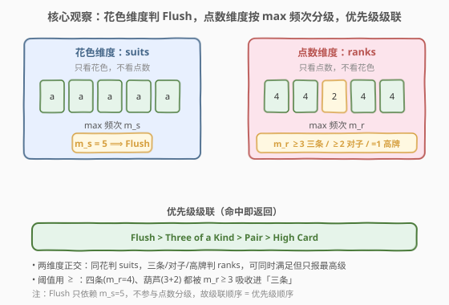
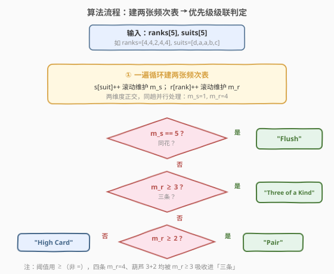
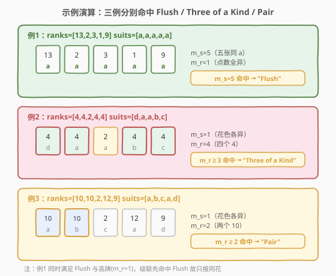

# LeetCode 最好的扑克手牌 题解

## 1. 题目概述

- **标题 / 题号**：最好的扑克手牌（#2347，easy）
- **链接**：https://leetcode.cn/problems/best-poker-hand/
- **难度**：简单
- **标签**：数组、哈希表、计数

**题意**：给你整数数组 `ranks` 和字符数组 `suits`，各长度为 5。第 $i$ 张牌大小为 `ranks[i]`、花色为 `suits[i]`。下述是从好到坏的手牌类型：

1. `"Flush"`：同花，五张相同花色。
2. `"Three of a Kind"`：三条，有 3 张大小相同。
3. `"Pair"`：对子，有两张大小相同。
4. `"High Card"`：高牌，五张大小互不相同。

返回给定 5 张牌能组成的**最好**手牌类型。返回字符串**大小写**需与题目描述一致。

**注意**：一手牌若符合更高级别，则**不再**符合更低级别——例如「四条」/「葫芦」（三同 + 一对）按本规则只报 `"Three of a Kind"`。

**示例 1**：

```text
输入：ranks = [13,2,3,1,9], suits = ["a","a","a","a","a"]
输出："Flush"
解释：5 张牌花色相同。
```

**示例 2**：

```text
输入：ranks = [4,4,2,4,4], suits = ["d","a","a","b","c"]
输出："Three of a Kind"
解释：第 1、2、4 张牌大小相同（实际有 4 张 4），得 "Three of a Kind"。
也可得 "Pair"，但三条级别更高。
```

**示例 3**：

```text
输入：ranks = [10,10,2,12,9], suits = ["a","b","c","a","d"]
输出："Pair"
解释：第 1、2 张牌大小相同，得 "Pair"，无法凑同花或三条。
```

**约束**：

- $\text{ranks.length} == \text{suits.length} == 5$
- $1 \le \text{ranks}[i] \le 13$
- $\text{'a'} \le \text{suits}[i] \le \text{'d'}$
- 任意两张牌不会同时有相同大小和花色。

> 💡 **关键观察**：手牌好坏由**两个相互独立的维度**判定——花色维度 `suits` 决定 `"Flush"`，点数维度 `ranks` 决定 `"Three of a Kind"` / `"Pair"` / `"High Card"`。两个维度可同时满足（如五张同花且其中三张同点数），但只需按**优先级从高到低级联判定**，命中即返回。

## 2. 解题思路

### 2.1 暴力思路：枚举每种手牌逐一核对

最直白的做法是**忠实模拟每种判定**：

```text
若 suits 五张全相同 → "Flush"
否则若 存在某点数出现 ≥3 次 → "Three of a Kind"
否则若 存在某点数出现 ≥2 次 → "Pair"
否则 → "High Card"
```

判定「某点数出现 $k$ 次」时，对每个点数 $O(5)$ 统计，至多扫 5 个点数，单次判定 $O(5^2)=O(25)$；4 次级联判定合计仍 $O(1)$（$5$ 是常数）。完全正确且能 AC，但「每次判定重头统计」重复扫了多遍，且把两个本可解耦的维度揉在一起。

> ⚠️ 把 `suits` 与 `ranks` 混在一遍里反复核对，掩盖了「两个维度正交、可一次性各建一张频次表」的事实。

### 2.2 核心观察：两个正交维度 + 优先级级联



把手牌判定拆成**两个独立频次维度**：

- **花色维度**：统计 `suits` 各花色出现次数，最大值 $m_s$。同花 ⟺ $m_s = 5$（5 张全同花色）。
- **点数维度**：统计 `ranks` 各点数出现次数，最大值 $m_r$：
  - $m_r \ge 3$ ⟹ 三条；
  - $m_r \ge 2$ ⟹ 对子；
  - $m_r = 1$ ⟹ 高牌（5 张点数互不相同）。

两个维度**正交**——`suits` 与 `ranks` 是两套独立属性，同花的判定根本不看 `ranks`，三条的判定根本不看 `suits`。于是只需各扫一遍建表，再按**优先级级联**判定：

$$
\text{bestHand} =
\begin{cases}
\text{"Flush"} & \text{若 } m_s = 5 \\
\text{"Three of a Kind"} & \text{若 } m_r \ge 3 \\
\text{"Pair"} & \text{若 } m_r \ge 2 \\
\text{"High Card"} & \text{否则}
\end{cases}
$$

> 💡 **为什么级联判定是对的？** 题目要求「符合高级别则不报低级别」。级联自上而下：先查 $m_s=5$（最严苛、最高级），命中即返回；否则降一级查 $m_r\ge 3$；再降查 $m_r\ge 2$。由于「命中即返回」的短路语义，任何一手牌只会落到它能匹配的**最高**级别，天然满足规则。两个维度先后无妨——`Flush` 不依赖 `ranks`，而 `Three/Pair/High` 互斥地取决于同一个 $m_r$ 的阈值。

> ⚠️ 注意阈值是**不等式**而非相等：$m_r\ge 3$ 而非 $m_r=3$。因示例 2 有 4 张点数 4（四条），但本题无「四条」类别，按规则归入最高的「三条」。同理葫芦（$3+2$）也归入「三条」。

### 2.3 算法流程图



两遍建表（各 $O(5)$）拿到 $m_s$ 与 $m_r$ 两个标量，随后四次阈值比较依次短路返回。建表与判定分离——一旦两张频次表就绪，判定是纯 $O(1)$ 比较，无重复扫描。

### 2.4 示例演算



三例对照级联：

| 示例 | $m_s$ | $m_r$ | 级联判定 | 返回 |
|------|-------|-------|----------|------|
| 1：suits 全 `a`，ranks 互异 | 5 | 1 | $m_s=5$ 命中 Flush | `"Flush"` |
| 2：ranks 四个 4，suits 互异 | 1 | 4 | $m_s\ne5$；$m_r\ge3$ 命中三条 | `"Three of a Kind"` |
| 3：ranks 两个 10，suits 互异 | 1 | 2 | $m_s\ne5$；$m_r<3$；$m_r\ge2$ 命中对子 | `"Pair"` |

注意例 1 同时满足「同花」与「高牌」（$m_r=1$），但级联先命中 `Flush` 故只报同花——印证「符合高级别不报低级别」。例 2 的 $m_r=4$（四条）同样被「三条」阈值 $m_r\ge3$ 吸收。

## 3. 参考代码

### C++

```cpp
class Solution {
public:
    string bestHand(vector<int>& ranks, vector<char>& suits) {
        int s[128] = {0}, r[14] = {0};
        int ms = 0, mr = 0;
        for (int i = 0; i < 5; ++i) {
            ms = max(ms, ++s[(unsigned char)suits[i]]);
            mr = max(mr, ++r[ranks[i]]);
        }
        if (ms == 5) return "Flush";
        if (mr >= 3) return "Three of a Kind";
        if (mr >= 2) return "Pair";
        return "High Card";
    }
};
```

> 💡 花色仅 `a`–`d` 四种、点数 $1$–$13$，值域极小故用定长数组当哈希（$O(1)$ 空间、无哈希开销）。单遍循环里**同步**累加两个维度的频次并维护各自最大值——两维度正交，可在同一趟里并行处理。`max` 滚动维护免去后续再遍历频次表。

### Python

```python
class Solution:
    def bestHand(self, ranks: List[int], suits: List[str]) -> str:
        rs = Counter(ranks)
        ss = Counter(suits)
        if max(ss.values()) == 5:
            return "Flush"
        if max(rs.values()) >= 3:
            return "Three of a Kind"
        if max(rs.values()) >= 2:
            return "Pair"
        return "High Card"
```

> 💡 `collections.Counter` 一次建表，`max(values())` 取频次最大值。因 $n\equiv5$ 恒定，`max` 与建表均为 $O(1)$。也可在 `for` 循环里手搓两套 `defaultdict` 并滚动最大值，避免二次遍历 `Counter.values()`，但 $n=5$ 下差异可忽略，可读性优先。

## 4. 复杂度分析

| 维度 | 复杂度 | 说明 |
|------|--------|------|
| **时间复杂度** | $O(1)$ | 仅 5 张牌：建表 $O(5)$，阈值比较 $O(1)$；牌数恒为 5，渐近为常数 |
| **空间复杂度** | $O(1)$ | 花色表 4 桶 + 点数表 13 桶，定长数组；与输入规模无关 |

> 💡 牌数 $n$ 若推广为变量，则时间 $O(n)$、空间 $O(\lvert\Sigma\rvert)$（$\lvert\Sigma\rvert$ 为花色/点数取值集合大小）。本题 $n=5$、$\lvert\Sigma_s\rvert=4$、$\lvert\Sigma_r\rvert=13$ 均为常数，故渐近 $O(1)$。

## 5. 扩展：为何没有「四条」「葫芦」「两对」？

本题把扑克手牌**大幅简化**为 4 档，且规则是「符合高级别不报低级别」——这与标准扑克的**互斥分级**不同：

| 手牌（标准扑克） | 本题归类 | 原因 |
|------------------|----------|------|
| 四条（4 同点） | `"Three of a Kind"` | $m_r=4\ge3$，被三条阈值吸收 |
| 葫芦 / 富尔豪斯（3 同 + 1 对） | `"Three of a Kind"` | $m_r=3\ge3$ 先命中三条 |
| 两对（2 组对子） | `"Pair"` | $m_r=2$，只命中对子阈值 |

> 💡 **判定逻辑的两种范式对照**：标准扑克是「**互斥分层**」——先判更稀有者，落层后即排除更高层，各层定义互斥（如「葫芦」要求恰好 3 同 + 恰好 1 对）；本题是「**阈值级联**」——用 $m_r\ge k$ 的不等式阈值，高阈值自动吸收低阈值的情形，故四条/葫芦统统归入「三条」。看到「有 $k$ 张相同」类描述且无「恰好」二字时，多半是阈值级联，用 $\ge$ 而非 $=$。

## 6. 面试要点

1. **为什么要先判 Flush 再判 Three of a Kind？顺序能换吗？**

   > 不能换。`Flush` 只依赖花色维度，`Three of a Kind` 只依赖点数维度，二者可同时满足（五张同花且三张同点数）。题目规定「符合高级别不报低级别」，`Flush` 级别更高，必须先查先返回；若先查三条会错误地把「同花 + 三条」报成「三条」。级联顺序 = 优先级顺序。

2. **为什么阈值用 $\ge$ 而不是 $=$？**

   > 题目无「四条」「葫芦」类别，且描述为「有 3 张大小相同」而非「恰好 3 张」。四张同点数也「有 3 张相同」，故用 $m_r\ge3$ 把四条/葫芦都吸收进「三条」；对子同理用 $m_r\ge2$。若误用 $=$，示例 2（$m_r=4$）会漏判。

3. **两个维度为什么可以一趟循环里同时建表？**

   > `suits[i]` 与 `ranks[i]` 是第 $i$ 张牌的两条独立属性，互不依赖。在遍历每张牌时，分别往花色频次表与点数频次表累加即可——两个表的键空间不交叠，操作互不干扰。正交性允许并行处理，省一遍循环。

4. **能不能不建表，直接判定？**

   > 能但啰嗦。判 `Flush`：`all(s == suits[0] for s in suits)`，$O(5)$ 不建表。判三条/对子：对每个点数数它在 `ranks` 中的出现次数，$O(5^2)$。因 $n=5$ 为常数，任何做法都是 $O(1)$，但建表把「频次最大值」一次算清，三条与对子共用同一个 $m_r$，避免重复统计，且语义清晰。

5. **`High Card` 等价于什么条件？会不会和 Flush 冲突？**

   > `High Card` ⟺ $m_r=1$（5 张点数全互异）且未命中更高级别。一手「五张同花且点数全异」会同时满足 $m_s=5$ 与 $m_r=1$，但级联先命中 `Flush` 返回，故不会报 `High Card`——这正是「符合高级别不报低级别」的体现，无需特判。

> 💡 **一句话总结**：花色维度判同花、点数维度按频次最大值 $m_r$ 分级，两维度正交、各建一张频次表，再按 Flush→Three→Pair→High 的优先级级联命中即返回——$O(1)$ 时间、$O(1)$ 空间，阈值用 $\ge$ 吸收四条/葫芦。

## 同类练习题

| # | 题目 | 与本题的关联 |
|---|------|-------------|
| 2341 | [数组能形成多少数对](https://leetcode.cn/problems/maximum-number-of-pairs-in-array/) | 同「频次表」骨架——按值分桶统计 $c$，本题主判定只需频次最大值 $m_r$，2341 则对每个 $c$ 取 $\lfloor c/2\rfloor$ 与 $c\bmod2$ 累加，对照「取最大值」与「逐值累加」两种频次后处理 |
| 1748 | [唯一元素的和](https://leetcode.cn/problems/sum-of-unique-elements/) | 频次表筛选——只对 $c_v=1$ 的值求和，同为「一次遍历建频次再二次筛选」范式，对照本题用 $m_r$ 做阈值判定 |
| 1365 | [有多少小于当前数字的数字](https://leetcode.cn/problems/how-many-numbers-are-smaller-than-the-current-number/) | 频次表 + 前缀和——把频次转成「小于 x 的个数」，频次表作为通用预处理的延伸用法 |
| 1941 | [检查是否所有字符出现次数相同](https://leetcode.cn/problems/check-if-all-characters-have-equal-number-of-occurrences/) | 频次表判定——所有频次是否相等，对照本题用频次最大值做阈值级联 |
| 383 | [赎金信](https://leetcode.cn/problems/ransom-note/) | 双频次表比较——判断 magazine 频次能否覆盖 ransomNote，频次表作为「计数后比较」的典型场景 |
