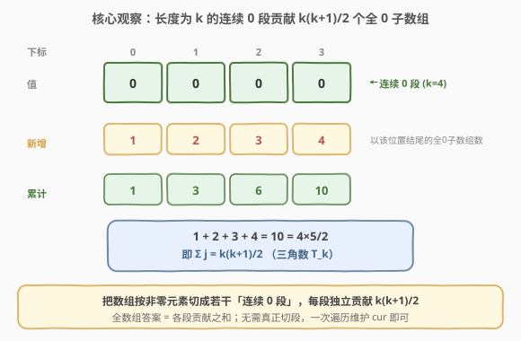
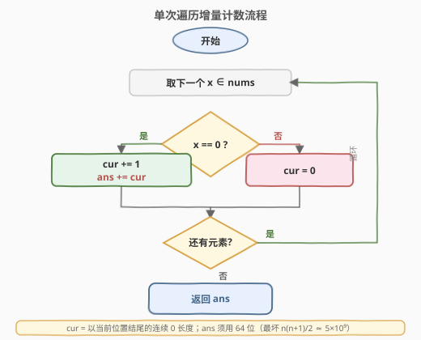

# 全0子数组的数目

- **题目名称**：全0子数组的数目
- **链接**：[2348. 全 0 子数组的数目](https://leetcode.cn/problems/number-of-zero-filled-subarrays/)
- **难度**：中等
- **标签**：数组、数学、一次遍历

## 1. 题目概述

给你一个整数数组 `nums`，返回全部为 `0` 的**子数组**数目。**子数组**是数组中一段连续非空元素组成的序列。

**示例 1**：

```text
输入：nums = [1,3,0,0,2,0,0,4]
输出：6
解释：子数组 [0] 出现 4 次，子数组 [0,0] 出现 2 次，
     不存在长度大于 2 的全 0 子数组，所以返回 6。
```

**示例 2**：

```text
输入：nums = [0,0,0,2,0,0]
输出：9
解释：子数组 [0] 出现 5 次，[0,0] 出现 3 次，[0,0,0] 出现 1 次，共 9 个。
```

**示例 3**：

```text
输入：nums = [2,10,2019]
输出：0
解释：没有全 0 子数组。
```

**约束条件**：

- $1 \le \text{nums.length} \le 10^5$
- $-10^9 \le \text{nums[i]} \le 10^9$

> 💡 关键在于「连续」：全 0 子数组不能跨越非零元素。因此可以把数组按「非零元素」切成若干个**连续 0 段**，每段独立计数再求和——这是本题所有解法的共同出发点。

---

## 2. 解题思路

### 2.1 暴力思路

枚举所有子数组 $[l, r]$，逐个判定是否「全为 0」。共有 $O(n^2)$ 个子数组，每次判定若边枚举边记录是否出现非零可为 $O(1)$，整体仍为 $O(n^2)$。$n = 10^5$ 时 $n^2 = 10^{10}$，必然超时。

> ⚠️ 暴力的浪费在于：它把每段连续 0 内部的子数组**拆开**逐一枚举，却忽略了「同一段内的子数组数目只依赖段长」这一结构。一旦发现「长度为 $k$ 的连续 0 段恰好贡献 $k(k+1)/2$ 个全 0 子数组」，$O(n^2)$ 立刻坍缩为 $O(n)$。

### 2.2 核心观察：连续 0 段的等差数列求和



把数组按非零元素切分，得到若干个**极大连续 0 段**。对任意一个长度为 $k$ 的 0 段，统计它内部的全 0 子数组：

- 长度为 $1$ 的：$k$ 个（每个位置各一个）；
- 长度为 $2$ 的：$k-1$ 个；
- ……
- 长度为 $k$ 的：$1$ 个。

合计

$$
\text{cnt}(k) = \sum_{L=1}^{k} (k - L + 1) = \sum_{j=1}^{k} j = \frac{k(k+1)}{2}
$$

> **为什么是等差数列？** 以「子数组的右端点」分组：右端点落在段的第 $j$ 个位置（$j=1,\dots,k$）时，能向左延伸的长度恰为 $j$，即该右端点贡献 $j$ 个全 0 子数组。把 $j=1,2,\dots,k$ 加起来就是 $1+2+\dots+k$。这正是**三角数** $T_k = k(k+1)/2$。

> 💡 全数组答案 = 各段贡献之和 $= \sum_{\text{每段}} \dfrac{k(k+1)}{2}$。只要一次遍历找出所有段的长度即可，无需真的把段切开。

### 2.3 算法流程图



实现上无需先切段再套公式，可用更精炼的**增量计数**：维护 `cur` = 当前位置往左连续 0 的个数。

- 遇到 `x == 0`：`cur += 1`，此时「以当前位置结尾的全 0 子数组」恰有 `cur` 个，于是 `ans += cur`；
- 遇到 `x != 0`：连续被打断，`cur = 0`，本位置不贡献。

> **增量写法与公式写法等价**：在某段长度从 $j$ 增长到 $k$ 的过程中，每步 `ans += cur` 累加的是 $1,2,\dots,k$，其和正是 $k(k+1)/2$。换言之，增量写法把「段长 $k$ → $k(k+1)/2$」拆成了「每个右端点 → 贡献 $j$」，二者殊途同归。

### 2.4 示例演算

![示例演算：nums = [1,3,0,0,2,0,0,4]](../images/2348_example_walkthrough.svg)

逐步展示 $\text{nums} = [1,3,0,0,2,0,0,4]$ 的执行过程（`cur` = 以当前位置结尾的连续 0 长度）：

- `i=0`(1)：非零，`cur=0`，新增 0，`ans=0`。
- `i=1`(3)：非零，`cur=0`，新增 0，`ans=0`。
- `i=2`(0)：`cur=1`，新增 1（子数组 `[0]`），`ans=1`。
- `i=3`(0)：`cur=2`，新增 2（`[0]`、`[0,0]`），`ans=3`。
- `i=4`(2)：非零，`cur=0`，新增 0，`ans=3`。
- `i=5`(0)：`cur=1`，新增 1，`ans=4`。
- `i=6`(0)：`cur=2`，新增 2，`ans=6`。
- `i=7`(4)：非零，`cur=0`，新增 0，`ans=6`。

两段 0（长度均为 2）分别贡献 $\dfrac{2 \times 3}{2}=3$ 个，合计 $3+3=6$ ✓。

---

## 3. 参考代码

### C++

```cpp
class Solution {
public:
    long long zeroFilledSubarray(vector<int>& nums) {
        long long ans = 0;
        int cur = 0;
        for (int x : nums) {
            if (x == 0) {
                ++cur;
                ans += cur;
            } else {
                cur = 0;
            }
        }
        return ans;
    }
};
```

### Python

```python
class Solution:
    def zeroFilledSubarray(self, nums: List[int]) -> int:
        ans = 0
        cur = 0
        for x in nums:
            if x == 0:
                cur += 1
                ans += cur
            else:
                cur = 0
        return ans
```

> ⚠️ **必须用 64 位整数**：极端情况下整个数组全为 0，$k = n = 10^5$，答案 $= n(n+1)/2 \approx 5 \times 10^9$，超出 32 位 `int` 上界（约 $2.1 \times 10^9$）。C++ 中 `ans` 须声明为 `long long`；`cur` 最大 $10^5$ 用 `int` 即可，`ans += cur` 会自动提升。Python 整数精度无限，无需操心。

> 💡 **等价的「先切段再套公式」写法**：显式累加每段长度 $k$，最后对每段加 $k(k{+}1)/2$。两者都是 $O(n)$，但增量写法只需一个 `cur`、无需存储段长，更简洁。

---

## 4. 复杂度分析

| 维度 | 复杂度 | 说明 |
|------|--------|------|
| 时间复杂度 | $O(n)$ | 单次遍历，每个元素处理 $O(1)$ |
| 空间复杂度 | $O(1)$ | 仅用 `cur / ans` 两个变量 |

---

## 5. 扩展：「按右端点计数」家族

`ans += cur` 本质属于**按右端点分组计数**的子数组计数家族：每轮只统计「以当前下标结尾」的合法子数组个数，按右端点分组互不相交、不重不漏。这与一批经典题同源：

| 题目 | 窗口/段 | 单轮新增 | 关键差异 |
|------|---------|----------|----------|
| 2348（本题） | 连续 0 段 | `cur`（段内位置） | 合法性退化为「全 0」，无需维护窗口左右端，`cur` 自带段长 |
| [713. 乘积小于 K 的子数组](https://leetcode.cn/problems/subarray-product-less-than-k/) | 正数滑窗 | `right-left+1` | 需维护窗口左端 `left` 收缩乘积 |
| [2302. 统计得分小于 K 的子数组数目](https://leetcode.cn/problems/count-subarrays-with-score-less-than-k/) | 正数滑窗 | `right-left+1` | 窗口量为「和 × 长度」 |
| [1248. 统计「优美子数组」](https://leetcode.cn/problems/count-number-of-nice-subarrays/) | 至多 K 差分 | `right-left+1` | 用 `atMost(K)−atMost(K−1)` 转化 |

> 💡 本题是这个家族里**最简单的特例**：「合法」条件极强（必须全 0），所以窗口退化为「连续等值段」，左端无需显式维护——`cur` 既记录段长、又直接给出新增数。一旦把「全 0」放宽为「至多 K 个非零」之类条件，就要重新引入 `left` 与窗口量，回到 1248 的滑窗框架。

---

## 6. 面试要点

1. **为什么长度为 $k$ 的连续 0 段贡献 $k(k+1)/2$ 个全 0 子数组？**

   - 按右端点分组：右端点在第 $j$ 个 0（$j=1,\dots,k$）时，能向左取长度 $1,2,\dots,j$，共 $j$ 个全 0 子数组。求和 $1+2+\dots+k = k(k+1)/2$。也可按子数组长度分组：长度 $L$ 有 $k-L+1$ 个，求和同结果。

2. **`ans += cur` 这种增量写法为什么等价于「先切段再套公式」？**

   - 增量写法把「段长 $k$ → $k(k+1)/2$」拆成「每个右端点 → 贡献其段内序号 $j$」。在某段从 $j=1$ 长到 $j=k$ 的过程中，每步 `ans += cur` 累加 $1,2,\dots,k$，和恰为 $k(k+1)/2$。两种写法对每段算出的数完全一致。

3. **`ans` 为什么要用 64 位？最大能到多少？**

   - 极端情况整个数组全 0，$k=n=10^5$，答案 $n(n+1)/2 \approx 5 \times 10^9$，超 32 位 `int`（$\sim 2.1 \times 10^9$）。C++ 用 `long long`；`cur` 最大 $10^5$ 可用 `int`。

4. **如果把「全 0」改成「值等于某个给定 $v$ 的子数组」，做法要怎么改？**

   - 几乎不变：把 `x == 0` 改成 `x == v` 即可，仍是按连续等值段计数，每段 $k(k+1)/2$。这揭示「全 0」只是「连续等值」的特例，方法对任意定值都成立。

5. **本题与 713/2302 这类滑窗计数题的异同？**

   - 同：都是「按右端点分组」的子数组计数，单轮新增「以当前下标结尾的合法子数组数」。
   - 异：本题的合法性条件（全 0）极强，窗口退化为连续等值段，无需维护 `left`、无需收缩，`cur` 直接给出新增数；713/2302 的合法性是「上界」条件，必须用 `left` 收缩窗口量。难度递进：2348 → 713 → 2302。

> 💡 **一句话总结**：2348 是「按右端点计数」家族的最简特例——连续 0 段贡献三角数 $k(k+1)/2$，单次遍历 `ans += cur` 即可，难点只在识别等差数列结构与 64 位防溢出。

---

## 7. 同类练习题

- [485. 最大连续 1 的个数](https://leetcode.cn/problems/max-consecutive-ones/)（[题解](../0401-0500/485_最大连续1的个数.md)）：连续等值段的最基础形态，练习「维护 `cur` = 连续段长」的扫描技巧
- [713. 乘积小于 K 的子数组](https://leetcode.cn/problems/subarray-product-less-than-k/)（[题解](../0701-0800/713_乘积小于K的子数组.md)）：同为「按右端点计数 `ans += ...`」家族，引入窗口左端收缩
- [2302. 统计得分小于 K 的子数组数目](https://leetcode.cn/problems/count-subarrays-with-score-less-than-k/)（[题解](../2301-2400/2302_统计得分小于K的子数组数目.md)）：同源计数技巧的进阶，窗口量为「和 × 长度」
- [1248. 统计「优美子数组」](https://leetcode.cn/problems/count-number-of-nice-subarrays/)（[题解](../1201-1300/1248_统计优美子数组.md)）：子数组计数 + `atMost` 差分转化，把「精确值」化为「上界」滑窗
