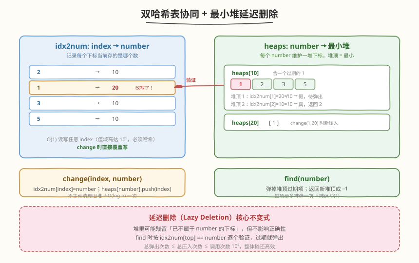
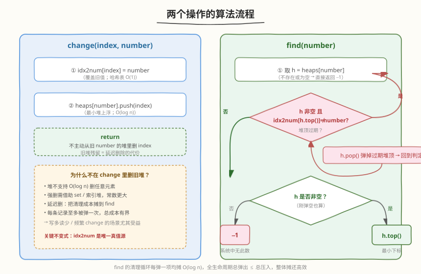
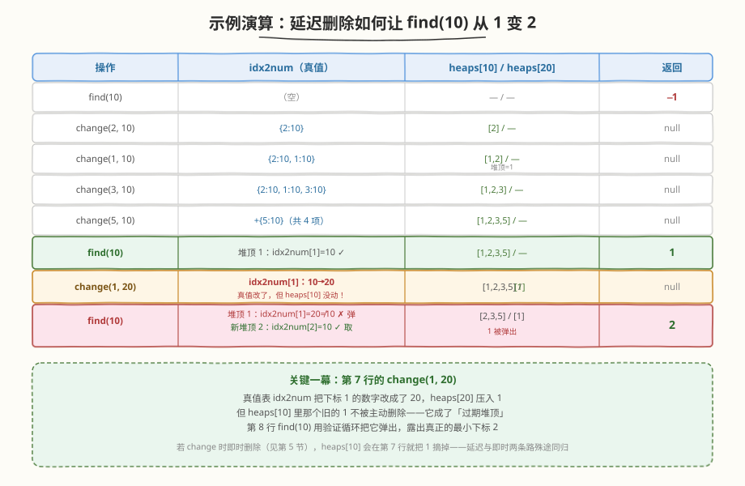

# LeetCode 设计数字容器系统 题解

## 1. 题目概述

- **标题 / 题号**：设计数字容器系统（#2349，medium）
- **链接**：https://leetcode.cn/problems/design-a-number-container-system/
- **难度**：中等
- **标签**：设计、哈希表、堆（优先队列）、有序集合

**题意**：设计一个数字容器系统，支持两个操作：

- `void change(int index, int number)`：在下标 `index` 处填入 `number`。若该下标已有数字，则**替换**之。
- `int find(int number)`：返回数字 `number` 在系统中的**最小下标**；若不存在则返回 `-1`。

**示例**：

```text
输入
["NumberContainers", "find", "change", "change", "change", "change", "find", "change", "find"]
[[], [10], [2, 10], [1, 10], [3, 10], [5, 10], [10], [1, 20], [10]]
输出
[null, -1, null, null, null, null, 1, null, 2]

解释
nc.find(10);      // 系统为空 → -1
nc.change(2, 10); // 下标 2 填 10
nc.change(1, 10); // 下标 1 填 10
nc.change(3, 10); // 下标 3 填 10
nc.change(5, 10); // 下标 5 填 10
nc.find(10);      // 10 所在下标 {1,2,3,5}，最小为 1 → 1
nc.change(1, 20); // 下标 1 从 10 替换为 20
nc.find(10);      // 10 所在下标 {2,3,5}，最小为 2 → 2
```

**约束**：

- `1 <= index, number <= 10^9`
- 调用 `change` 与 `find` 的**总次数**不超过 $10^5$ 次。

> 💡 本题是典型的**数据结构选型 + 延迟删除（lazy deletion）**设计题。难点不在 `change` 的写入，而在 `find` 要**对一个数字的所有下标取最小**——而 `change` 会随时让某个下标「叛逃」到别的数字。核心是两张哈希表 + 最小堆，并接受堆里残留过期项、由 `find` 逐个弹出来清理。这套「哈希 + 堆 + 延迟删除」范式与 [355. 设计推特](../0301-0400/355_设计推特.md) 的「哈希 + 堆」、[146. LRU 缓存](../0101-0200/146_LRU缓存.md) 的「哈希 + 双向链表」同属「哈希表 + 另一结构协同」的设计家族。

## 2. 解题思路

### 2.1 暴力思路：线性扫描

最直觉的做法：维护一个 `index → number` 的数组/哈希表。

- `change(index, number)`：直接 `table[index] = number`，$O(1)$。
- `find(number)`：遍历整张表，收集所有值为 `number` 的下标，取最小。$O(N)$，$N$ 为已写入下标数。

> ⚠️ `find` 的 $O(N)$ 在「`find` 调用频繁」时会爆炸：$10^5$ 次调用 × 每次 $O(10^5)$ 下标 = $10^{10}$，远超时限。题目把 `change` 和 `find` 的总次数都放到 $10^5$，正是逼你把**两个操作都做到对数级以下**。

另一个直觉是用 `number → 下标集合` 的反向索引，`find` 取集合最小值。但 `change` 会让一个下标**从旧 number 的集合叛逃到新 number 的集合**——若集合不支持高效删除，反向索引就成了半残品。本解法的全部巧思都围绕「如何低成本维护这个反向索引」。

### 2.2 核心观察：双哈希表 + 最小堆延迟删除



关键洞察有三层：

1. **值域高达 $10^9$ → 必须哈希**。`index` 与 `number` 都可达 $10^9$，数组下标不可用，两张表都须是哈希表。
2. **`find` 要取最小下标 → 用最小堆**。对每个 `number` 维护一个最小堆存其下标，堆顶即所求。若每次 `find` 前堆是「干净」的，`find` 就是 $O(1)$ 取堆顶。
3. **`change` 会制造「过期堆顶」→ 不强删，延迟到 `find` 清理**。当 `change(1, 20)` 把下标 1 从数字 10 改成 20 时，数字 10 的堆顶仍是 1（已过期）。我们不主动从 10 的堆里删 1（堆不支持 $O(\log n)$ 删任意元素），而是让 `find(10)` 发现堆顶过期就弹出，直到堆顶是真值或堆空。

两个数据结构：

| 结构 | 类型 | 作用 |
|------|------|------|
| `idx2num` | `HashMap<index, number>` | **唯一真值源**：每个下标当前存哪个数。`change` 直接覆盖写。 |
| `heaps` | `HashMap<number, MinHeap<index>>` | 每个数字对应的最小堆，存「曾经/当前」属于它的下标。`find` 在堆顶做真值校验。 |

> 💡 `idx2num` 是**唯一真值源（source of truth）**——判断「下标 `i` 当前是不是数字 `number`」只看 `idx2num[i] == number`。`heaps` 只是加速 `find` 的缓存，允许含过期项，但绝不能有「真值已变、堆顶却谎报」的错误，因为 `find` 每次都拿 `idx2num` 复核。



**`change(index, number)`**：
1. `idx2num[index] = number`（覆盖旧值，真值即此一处更新）。
2. `heaps[number].push(index)`（最小堆上浮，$O(\log n)$）。
3. **不**从旧 number 的堆里删除 `index`——它会在未来某次 `find` 时被验证后弹出。

**`find(number)`**：
1. 取 `h = heaps[number]`；不存在或为空 → 返回 `-1`。
2. **清理循环**：只要 `h` 非空且 `idx2num[h.top()] != number`，就 `h.pop()`（过期堆顶逐个弹出）。
3. 堆空 → `-1`；否则返回 `h.top()`（此时堆顶已通过真值校验）。

> 💡 **为什么清理循环的总成本有界？** 每个下标每被 `push` 一次，至多被 `pop` 一次。`change` 总次数 $\le 10^5$，所以全生命周期 `pop` 总次数 $\le 10^5$。把这笔成本摊到所有 `find` 上，单次 `find` 摊还 $O(1)$；即便最坏某次 `find` 弹一长串过期项，整体仍是 $O(Q \log Q)$，$Q$ 为总调用数。

### 2.3 算法流程图

见上方 `ncs_algorithm_flow.svg`：左路 `change` 两步覆盖写 + 压堆；右路 `find` 是一个「堆顶是否过期」的判定菱形驱动的清理循环，过期则弹、回到判定，未过期则走向「堆是否非空」的二次判定输出 `-1` 或 `h.top()`。

### 2.4 示例演算



完整对照表（与示例输出逐行对应）：

| # | 操作 | `idx2num` 真值 | `heaps[10]` / `heaps[20]` | 输出 |
|---|------|---------------|---------------------------|------|
| 1 | `find(10)` | 空 | — / — | `-1` |
| 2 | `change(2,10)` | `{2:10}` | `[2] / —` | `null` |
| 3 | `change(1,10)` | `{2:10,1:10}` | `[1,2] / —`（堆顶 1） | `null` |
| 4 | `change(3,10)` | `+{3:10}` | `[1,2,3] / —` | `null` |
| 5 | `change(5,10)` | `+{5:10}` | `[1,2,3,5] / —` | `null` |
| 6 | `find(10)` | 不变 | 堆顶 1：`idx2num[1]=10` ✓ | **`1`** |
| 7 | `change(1,20)` | `idx2num[1]: 10→20` | `[1,2,3,5] / [1]`（**10 的堆顶 1 已过期**） | `null` |
| 8 | `find(10)` | 不变 | 弹 1（过期）→ 新堆顶 2：`idx2num[2]=10` ✓；`heaps[10]=[2,3,5]` | **`2`** |

> ⚠️ 看第 7→8 行：`change(1,20)` 只改了真值表 `idx2num[1]` 并把 `1` 压进 `heaps[20]`，**没有**碰 `heaps[10]`。第 8 行 `find(10)` 拿到堆顶 `1`，用 `idx2num[1]==10?` 复核发现是 `20`，判定过期弹出，露出真堆顶 `2`。这就是延迟删除的全部戏法。

## 3. 参考代码

### C++

```cpp
class NumberContainers {
    unordered_map<int, int> idx2num;                                  // index → number（真值源）
    unordered_map<int, priority_queue<int, vector<int>, greater<int>>> heaps; // number → 最小堆

public:
    NumberContainers() {}

    void change(int index, int number) {
        idx2num[index] = number;            // 覆盖写：唯一真值更新点
        heaps[number].push(index);          // 压入新数字的堆；旧堆残留不动
    }

    int find(int number) {
        auto it = heaps.find(number);
        if (it == heaps.end()) return -1;
        auto& pq = it->second;
        while (!pq.empty() && idx2num[pq.top()] != number) {
            pq.pop();                       // 弹掉过期堆顶
        }
        return pq.empty() ? -1 : pq.top();
    }
};
```

### Python

```python
import heapq


class NumberContainers:
    def __init__(self):
        self.idx2num: dict[int, int] = {}                # index → number（真值源）
        self.heaps: dict[int, list[int]] = {}           # number → 最小堆

    def change(self, index: int, number: int) -> None:
        self.idx2num[index] = number                    # 覆盖写：唯一真值更新点
        if number not in self.heaps:
            self.heaps[number] = []
        heapq.heappush(self.heaps[number], index)       # 压入新数字的堆；旧堆残留不动

    def find(self, number: int) -> int:
        h = self.heaps.get(number)
        if not h:
            return -1
        # 清理过期堆顶：堆顶下标当前存的数已不是 number
        while h and self.idx2num[h[0]] != number:
            heapq.heappop(h)
        return h[0] if h else -1
```

> ⚠️ **Python 最小堆技巧**：`heapq` 本是最小堆，`heappush`/`heappop` 天然按升序，堆顶 `h[0]` 即最小下标，无需取负。C++ 的 `priority_queue<int, vector<int>, greater<int>>` 把默认最大堆翻成最小堆。
>
> **不要在 `change` 里尝试 `heaps[old].remove(index)`**：`std::priority_queue` 不支持删任意元素；Python `list.remove` 是 $O(n)$ 线性扫描，$10^5$ 次会退化。延迟删除正是为了规避「堆删任意元素」这个天生短板。

## 4. 复杂度分析

| 维度 | 复杂度 | 说明 |
|------|--------|------|
| **`change` 时间** | $O(\log Q)$ | 一次哈希写 $O(1)$ + 一次堆压入 $O(\log Q)$，$Q$ 为总调用数（$\le 10^5$） |
| **`find` 时间（摊还）** | $O(1)$ 摊还 | 每个下标至多被压一次、弹一次；全生命周期 `pop` 总数 $\le$ `push` 总数 $\le Q$，摊到每次 `find` 上为常数 |
| **`find` 时间（最坏单次）** | $O(k \log Q)$ | 某次 `find` 可能连续弹出 $k$ 个过期堆顶；但所有 `find` 的 $k$ 之和有上界 $Q$ |
| **空间复杂度** | $O(Q)$ | `idx2num` 项数 $\le$ `change` 次数；`heaps` 中元素总数 $=$ 历史压入次数 $\le Q$ |

> 💡 严格说，`heaps` 里同时存活的总元素数 $\le$ `change` 调用次数（每次 `change` 恰好压一条），所以空间是 $O(Q)$ 而非 $O(Q^2)$——即便很多下标早已叛逃到别的数字，它们在旧堆里的过期副本也算进空间，但总数被 `push` 次数上界锁死。延迟删除用「一点空间冗余」换「写操作不退化」。

## 5. 扩展：有序集合的「即时删除」方案

延迟删除的对照面是**即时删除（eager deletion）**：`change` 时主动把 `index` 从旧 number 的集合里摘掉。这需要一个支持 $O(\log n)$ 删任意元素且能取最小的有序容器。

| 语言 | 容器 | `change` 复杂度 | `find` 复杂度 |
|------|------|----------------|---------------|
| C++ | `unordered_map<int, set<int>>` | $O(\log Q)$（erase + insert） | $O(1)$（`*set.begin()`） |
| Python | `dict[int, SortedList]`（`sortedcontainers`） | $O(\log Q)$ | $O(1)$ |

**C++ 即时删除版**（与主解法等价替换）：

```cpp
class NumberContainers {
    unordered_map<int, int> idx2num;
    unordered_map<int, set<int>> num2idxs;   // number → 有序下标集合

public:
    void change(int index, int number) {
        auto it = idx2num.find(index);
        if (it != idx2num.end()) {
            int old = it->second;
            num2idxs[old].erase(index);     // 主动摘掉旧数字中的下标
            if (num2idxs[old].empty()) num2idxs.erase(old);
        }
        idx2num[index] = number;
        num2idxs[number].insert(index);
    }

    int find(int number) {
        auto it = num2idxs.find(number);
        if (it == num2idxs.end() || it->second.empty()) return -1;
        return *it->second.begin();          // 集合始终干净，直接取最小
    }
};
```

**两方案对比**：

| 维度 | 延迟删除（最小堆） | 即时删除（有序集合） |
|------|---------------------|----------------------|
| `change` | 仅 push，$O(\log Q)$，常数小 | erase + insert，$O(\log Q)$，常数大 |
| `find` | 需清理循环，摊还 $O(1)$ | 直接 `begin()`，严格 $O(1)$ |
| 空间 | 堆含过期副本，$\le Q$ | 集合始终干净，$\le$ 当前下标数 |
| 适用场景 | `change` 多 / `find` 少 / `find` 接受偶发抖动 | `find` 极频繁需稳定 $O(1)$ / 内存敏感 |

> 💡 **选型口诀**：「写多读少用延迟删除（写只 push），写读均衡或读极频繁用即时删除（find 恒定 $O(1)$）」。本题 $10^5$ 量级两种都绰绰有余，差异在常数；但延迟删除的「堆 + 真值校验」思想更通用——任何「维护一组值的最值、但元素会被外部改写」的场景都套得上，如缓存失效、拓扑变更下的最短路等。

## 6. 面试要点

1. **为什么用两张哈希表而不是一张？**

   - 一张 `idx2num` 能 $O(1)$ 写 `change`，但 `find` 须 $O(N)$ 扫全表找最小下标。加一张 `number → 堆` 的反向索引把 `find` 降到对数以下。两张表一写一查、各司其职，是「哈希 + 另一结构」设计题的标准双件，与 [146. LRU 缓存](../0101-0200/146_LRU缓存.md) 的「哈希 + 双向链表」、[380. O(1) 插入删除随机](../0301-0400/380_O1时间插入删除和获取随机元素.md) 的「哈希 + 动态数组」同构。

2. **为什么不在 `change` 时删旧堆？为什么这是「延迟删除」？**

   - `std::priority_queue` / `heapq` 都不支持 $O(\log n)$ 删任意元素，强行删要退化到 $O(n)$ 或换索引堆。延迟删除接受旧堆里残留过期项，把删除成本推迟到 `find`：用真值表 `idx2num` 校验堆顶，过期就 `pop`。因为每项至多被压一次、弹一次，总成本被 `push` 次数上界锁死，摊还后 `find` 近乎 $O(1)$。

3. **`idx2num` 为什么是「唯一真值源」？堆为什么不是？**

   - `idx2num[index]` 永远等于下标 `index` 当前真实存的数，因为 `change` 是唯一写入点且每次覆盖。堆只记录「某下标曾经被压进 `number` 的堆」，不能反映它后来是否叛逃——所以堆顶必须经 `idx2num` 复核才算数。一旦让堆也参与决定真值（比如 `find` 直接信堆顶不校验），`change(1,20)` 后 `find(10)` 会错返回 `1`。

4. **`find` 的清理循环会不会死循环或超时？**

   - 不会。清理循环每轮 `pop` 一个过期堆顶，而每个下标至多被 `push` 一次，全生命周期 `pop` 总数 $\le$ `push` 总数 $\le Q = 10^5$。即便某次 `find` 连弹 $k$ 个，这些弹出在「全局预算」里只此一次，后续 `find` 不再为它们付费。所以把所有 `find` 的成本求和是 $O(Q \log Q)$，单次摊还 $O(1)$。

5. **如果 `change(index, number)` 的 `number` 与旧值相同会怎样？重复压入会出问题吗？**

   - 不会。`idx2num[index]` 被覆盖成相同的值（真值不变），`heaps[number]` 再压一次 `index`（堆里出现重复）。下次 `find(number)` 取堆顶 `index`，校验 `idx2num[index]==number` 为真，直接返回，重复副本留在堆里无害——它只在被弹到时校验通过、不参与返回逻辑。若想避免重复压入，可在 `change` 开头加 `if (idx2num[index] == number) return;` 早退，省一次 `push`，但不影响正确性。

> 💡 **一句话总结**：`idx2num` 当真值源，`heaps[number]` 当最小堆加速器，`change` 只覆盖写真值 + 压新堆、不碰旧堆，`find` 用真值校验堆顶、过期就弹、直至干净堆顶或空。延迟删除用「一点空间冗余」换「写不退化」，是堆处理「外部改写元素」的通用范式。

## 同类练习题

| # | 题目 | 与本题的关联 |
|---|------|-------------|
| 355 | [设计推特](https://leetcode.cn/problems/design-twitter/)（[题解](../0301-0400/355_设计推特.md)） | 同属「哈希表 + 堆」设计家族，`getNewsFeed` 用最大堆做 K 路归并，对比本题「最小堆取最小下标」的堆用法与延迟删除思想 |
| 146 | [LRU 缓存](https://leetcode.cn/problems/lru-cache/)（[题解](../0101-0200/146_LRU缓存.md)） | 「哈希表 + 另一结构」$O(1)$ 设计的母题，双向链表维护顺序、哈希表维护定位，对照本题「哈希 + 堆」的选型取舍 |
| 380 | [O(1) 时间插入、删除和获取随机元素](https://leetcode.cn/problems/insert-delete-getrandom-o1/)（[题解](../0301-0400/380_O1时间插入删除和获取随机元素.md)） | 「哈希 + 动态数组」协同删除的设计题，对照「哈希定位 + 数组尾部交换删」与本题「堆延迟删」两种处理删除的策略 |
| 2336 | [无限集中的最小数字](https://leetcode.cn/problems/smallest-number-in-infinite-set/)（[题解](../2301-2400/2336_无限集中的最小数字.md)） | 同区间的「维护一组数取最小」设计题，用最小堆 + 延迟删除（或有序集合）弹出已加回的数，与本题 `find` 的堆清理循环同源 |
| 264 | [丑数 II](https://leetcode.cn/problems/ugly-number-ii/)（[题解](../0201-0300/264_丑数II.md)） | 最小堆多路归并生成有序序列，对照「堆维护最值」与本题「堆维护最小下标」的共性，体会堆作「动态最小值查询器」的通用角色 |
