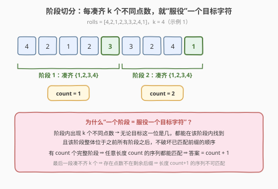
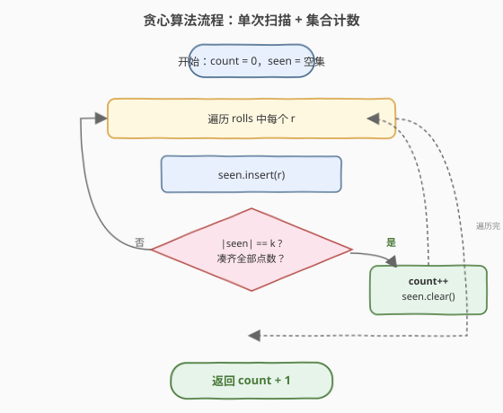
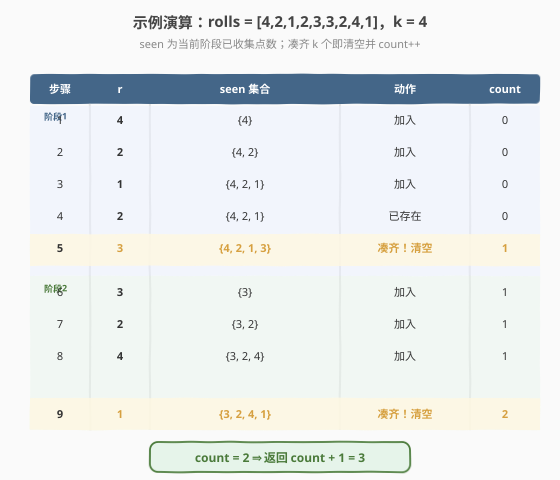

# 不可能得到的最短骰子序列

- **题目名称**：不可能得到的最短骰子序列
- **链接**：[2350. 不可能得到的最短骰子序列](https://leetcode.cn/problems/shortest-impossible-sequence-of-rolls/)
- **难度**：困难
- **标签**：贪心、数组、哈希表

## 1. 题目概述

给定长度为 `n` 的整数数组 `rolls` 和整数 `k`：你扔一个 `k` 面骰子（面值 `1..k`）`n` 次，第 `i` 次结果为 `rolls[i]`。要求返回**无法**从 `rolls` 中得到的**最短**骰子子序列的长度。

- **子序列**：保持原数组顺序，不必连续。
- 掷 `k` 面骰子 `len` 次得到的长度为 `len` 的序列称为一个「骰子子序列」。每个位置可为 `1..k` 任意值，故长度为 `len` 的骰子子序列共 $k^{len}$ 种。

**示例 1**：

```text
输入：rolls = [4,2,1,2,3,3,2,4,1], k = 4
输出：3
解释：长度为 1、2 的所有骰子子序列都能从原数组中得到；[1,4,2] 无法得到，故返回 3。
```

**示例 2**：

```text
输入：rolls = [1,1,2,2], k = 2
输出：2
解释：长度 1 全可得到；[2,1] 无法得到，返回 2。
```

**示例 3**：

```text
输入：rolls = [1,1,3,2,2,2,3,3], k = 4
输出：1
解释：rolls 中不含 4，[4] 无法得到，返回 1。
```

**约束条件**：

- `n == rolls.length`
- $1 \le n \le 10^5$
- $1 \le \text{rolls}[i] \le k \le 10^5$

---

## 2. 解题思路

### 2.1 暴力思路

题目要「无法得到的最短长度」。最朴素的做法是：从 `len = 1` 起枚举长度，对每个 `len` 枚举全部 $k^{len}$ 种骰子子序列，逐个判断是否为 `rolls` 的子序列（每次判断 $O(n)$）。

- $k^{len}$ 指数爆炸（$k=4, len=10$ 已超百万），且最大答案可达约 $n/k$，完全不可行。
- 即便只判断单条子序列，每次 $O(n)$ 也撑不住海量枚举。

> 💡 换个视角：**答案 =「所有长度为 L 的序列都能被匹配」的最大 L，再加 1**。问题转化为求这个上界 L。

### 2.2 核心观察：贪心「阶段计数」

把 `rolls` 从左到右扫描，**用一个集合 `seen` 累计本段已出现的不同点数**。一旦 `seen` 凑齐 `k` 个不同点数，就说**完成了一个「阶段」**：`count++`，并清空 `seen` 进入下一阶段。最终答案即 $\text{count} + 1$。



为什么「一个完整阶段 = 能服役任意一个目标字符」？

- 阶段内出现了全部 `k` 种点数 ⇒ 无论目标序列这一位是几，都能在该阶段内找到一次出现；
- 且该阶段**整体位于之前所有阶段之后**，匹配前缀时用到的位置都在更早处，不会破坏子序列的顺序。

于是：若有 `count` 个完整阶段，那么**任意长度为 `count` 的骰子子序列都能被匹配**——第 `i` 位在阶段 `i` 中取对应点数即可。

### 2.3 算法流程图



### 2.4 示例演算

以 `rolls = [4,2,1,2,3,3,2,4,1], k = 4`（示例 1）为例，逐元素推进 `seen` 与 `count`：



| 步骤 | r | seen | 动作 | count |
|------|---|------|------|-------|
| 1 | 4 | {4} | 加入 | 0 |
| 2 | 2 | {4,2} | 加入 | 0 |
| 3 | 1 | {4,2,1} | 加入 | 0 |
| 4 | 2 | {4,2,1} | 已存在 | 0 |
| 5 | 3 | {4,2,1,3} | 凑齐！清空 | 1 |
| 6 | 3 | {3} | 加入 | 1 |
| 7 | 2 | {3,2} | 加入 | 1 |
| 8 | 4 | {3,2,4} | 加入 | 1 |
| 9 | 1 | {3,2,4,1} | 凑齐！清空 | 2 |

两轮完整阶段后，剩余后缀已无内容，`count = 2`，故答案 `= 2 + 1 = 3`，与示例一致。

> 💡 示例 3 中 `rolls` 根本不含 `4`，`seen` 永远凑不齐 `k=4`，`count` 始终为 `0`，直接返回 `1`。

### 2.5 正确性证明（两方向夹逼）

记贪心切出的完整阶段数为 $c$（即 `count`）。

- **上界（长度 $c$ 全可匹配）**：对任意长度 $c$ 的目标序列 $t[0..c-1]$，第 $i$ 位在阶段 $i$ 内取该点数的**首次出现**即可。阶段 $i$ 含全部 $k$ 种点数（必能取到），且阶段 $i$ 整体在阶段 $i-1$ 之后（顺序成立）。故所有长度 $c$ 的序列都是 `rolls` 的子序列，答案 $\ge c+1$。
- **下界（存在长度 $c+1$ 不可匹配）**：记 $c_j$ 为「完成第 $j$ 个阶段」的那个点数（它在阶段 $j$ 内首次出现即落在该阶段末尾，是该阶段内唯一出现）。构造目标 $T=[c_1,c_2,\dots,c_c,x]$，其中 $x$ 是**剩余后缀中缺失**的点数（后缀未凑齐 $k$ 个 ⇒ 缺某点数）。按最左匹配：$c_1$ 的全局首次出现正是阶段 1 末尾，$c_2$ 在阶段 2 末尾……$c_c$ 落到阶段 $c$ 末尾；之后需在后缀中找 $x$，而后缀无 $x$ ⇒ 不可匹配。故答案 $\le c+1$。

两方向夹逼，答案 $= c + 1$。

---

## 3. 参考代码

### C++

```cpp
class Solution {
  public:
    int shortestSequence(vector<int>& rolls, int k) {
        int count = 0;
        unordered_set<int> seen;
        for (int r : rolls) {
            seen.insert(r);
            if ((int)seen.size() == k) {
                ++count;
                seen.clear();
            }
        }
        return count + 1;
    }
};
```

### Python

```python
class Solution:
    def shortestSequence(self, rolls: List[int], k: int) -> int:
        count = 0
        seen = set()
        for r in rolls:
            seen.add(r)
            if len(seen) == k:
                count += 1
                seen.clear()
        return count + 1
```

---

## 4. 复杂度分析

| 维度 | 复杂度 | 说明 |
|------|--------|------|
| 时间复杂度 | $O(n)$ | 每个元素一次 `insert`；`clear` 共触发 $c$ 次，总清空开销 $\le$ 已插入元素数，均摊 $O(n)$ |
| 空间复杂度 | $O(k)$ | `seen` 最多存 `k` 个点数 |

> ⚠️ `clear()` 不要写成「遍历删除」；直接 `seen.clear()` 释放哈希桶，均摊 $O(\text{本阶段元素数})$，总和 $O(n)$。若用 `vector<bool>` + 计数则可做到真·$O(1)$ 重置（见下节）。

---

## 5. 扩展：时间戳数组免清空

用 `seen[r]` 存「点数 `r` 上一次被记录时所属的阶段编号 `cur`」，比较 `seen[r] != cur` 即判定本阶段是否首次见到 `r`，**无需 `clear`**，单元素严格 $O(1)$：

```cpp
class Solution {
  public:
    int shortestSequence(vector<int>& rolls, int k) {
        vector<int> seen(k + 1, 0);  // seen[r] = r 上次被记录的阶段号
        int count = 0, have = 0, cur = 1;
        for (int r : rolls) {
            if (seen[r] != cur) {
                seen[r] = cur;
                if (++have == k) {
                    ++count;
                    ++cur;   // 切换阶段号，等价于整体清空
                    have = 0;
                }
            }
        }
        return count + 1;
    }
};
```

- 阶段号 `cur` 自增即可让所有 `seen[r]` 自动「过期」，省去 $O(k)$ 的清空；
- 当 $k$ 极大、阶段数也多时比哈希集合更快、常数更低；
- 注意 `cur` 不会溢出：阶段数 $\le n/k \le n \le 10^5$，`int` 足够。

---

## 6. 面试要点

1. **为什么答案 = 完整阶段数 + 1？**
   - 完整阶段数 $c$ 意味着「任意长度 $c$ 的序列都能匹配」（每位在一个阶段内取到，阶段间有序），而剩余后缀凑不齐 $k$ 种 ⇒ 存在长度 $c+1$ 的序列不可匹配，故恰为 $c+1$。

2. **为什么是「凑齐就清空」而不是滑窗？**
   - 这不是求最值窗口，而是把序列**按覆盖能力分段**：一旦某段含全部 `k` 种点数，它就能独立服役一个目标位，后续匹配只依赖该段之后，故果断切断开新段。

3. **下界证明里为什么构造 $T=[c_1,\dots,c_c,x]$？**
   - $c_j$ 只在阶段 $j$ 末尾出现，最左匹配会强制把游标推到各阶段末尾，最后一位 $x$ 落入「缺它的后缀」，从而不可匹配，保证下界紧。

4. **集合清空会不会拖慢到 $O(nk)$？**
   - 不会。每次 `clear` 的代价分摊到该阶段已插入的元素（$\ge k$ 个），总清空 $\le$ 总插入 $= n$，整体仍 $O(n)$。担心常数可用时间戳数组。

5. **若 `rolls` 中某种点数一次都不出现怎么办？**
   - `seen` 永远到不了 `k`，`count` 保持 `0`，返回 `1`（即那个缺失点数本身构成的长度 1 序列不可匹配），与示例 3 一致。

---

## 7. 同类练习题

- [392. 判断子序列](https://leetcode.cn/problems/is-subsequence/)（[题解](../0301-0400/392_判断子序列.md)）：单序列是否为子序列的贪心匹配，本题是其「批量覆盖上界」视角的基础
- [792. 匹配子序列的单词数](https://leetcode.cn/problems/number-of-matching-subsequences/)：批量判断多个词是否为子序列，贪心 + 桶，同「能否匹配子序列」主题
- [767. 重构字符串](https://leetcode.cn/problems/reorganize-string/)（[题解](../0701-0800/767_重构字符串.md)）：贪心按频率轮转放置使相邻不同，同「凑齐即推进」贪心直觉
- [2318. 不同骰子序列的数目](https://leetcode.cn/problems/number-of-distinct-roll-sequences-of-length-n/)（[题解](2318_不同骰子序列的数目.md)）：同骰子主题，DP 计数（不同套路，主题关联）
