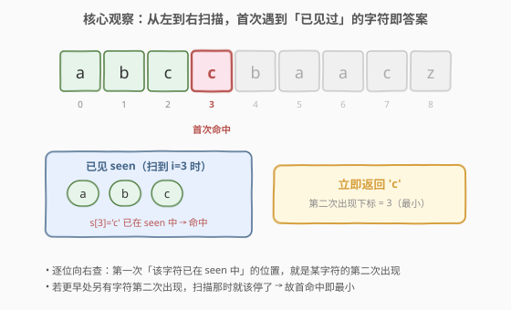
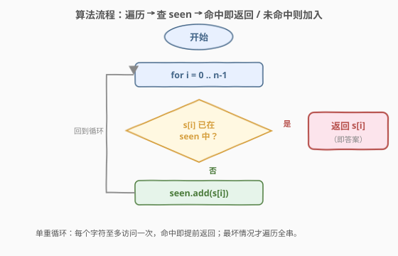
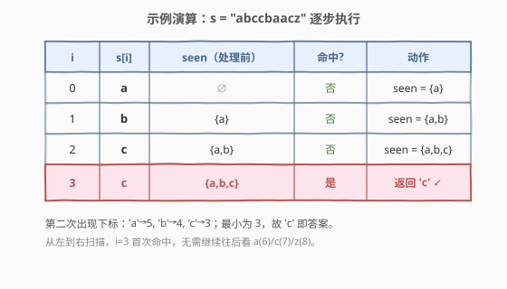

# LeetCode 第一个出现两次的字母 题解

## 1. 题目概述

- **标题 / 题号**：第一个出现两次的字母（#2351，easy）
- **链接**：https://leetcode.cn/problems/first-letter-to-appear-twice/
- **难度**：简单
- **标签**：哈希表、字符串、一次遍历

**题意**：给定一个由小写英文字母组成的字符串 `s`，返回**第一个出现两次**的字母。这里的「第一个」以**第二次出现的位置**为准：若字母 `a` 的第二次出现比 `b` 的第二次出现更靠前，则认为 `a` 在 `b` 之前出现两次。题目保证 `s` 至少有一个出现两次的字母。

**示例 1**：

```text
输入：s = "abccbaacz"
输出："c"
解释：
  'a' 在下标 0、5、6 出现；'b' 在下标 1、4；'c' 在下标 2、3、7；'z' 在下标 8。
  'c' 的第二次出现（下标 3）是所有字母中最早的，故返回 'c'。
```

**示例 2**：

```text
输入：s = "abcdd"
输出："d"
解释：只有 'd' 出现两次，第二次出现在下标 4。
```

**约束**：

- $2 \le \text{s.length} \le 100$
- `s` 仅由小写英文字母组成
- `s` 至少包含一个出现两次的字母

> 💡 **不变式**：题目要的是「第二次出现下标最小的字母」。由于任一字符的第二次出现必然发生在**当前扫描位置**，从左到右扫描时，**第一次撞见一个已见字符**的那一刻，恰是某字符的第二次出现；且它一定是最小的——因为更早处若另有字符第二次出现，扫描在那儿就该停下了。

## 2. 解题思路

### 2.1 暴力思路：逐位向前回查

最直白的模拟：对每个下标 `i`，向前扫描 `s[0..i-1]`，若发现 `s[i]` 已出现过，则 `s[i]` 即答案。

```text
for i in 0..n-1:
    for j in 0..i-1:
        if s[j] == s[i]: return s[i]
```

正确性没问题，但每个 `i` 都回扫 $O(i)$，总计 $O(n^2)$。对 $n \le 100$ 能 AC，却把「重复回看」的浪费背在身上——每次回查都从零开始，已扫描的信息被丢弃。

> ⚠️ 判断「`s[i]` 是否见过」本可 $O(1)$ 回答：把历史压进一个集合即可。回查丢历史，是暴力低效的根因。

### 2.2 核心观察：哈希集合在线查表



维护一个**已见字符集合** `seen`，从左到右遍历 `s`：

- 若 `s[i]` 已在 `seen` 中，说明此刻是 `s[i]` 的**第二次出现**；又因为是从左到右逐位检查，此前没有任何字符第二次出现（否则早就停了），所以 `s[i]` 的第二次出现下标就是最小的 → **立即返回 `s[i]`**。
- 否则把 `s[i]` 加入 `seen`，继续。

> 💡 **为什么首命中即最小？** 反证：设答案字符 `x` 的第二次出现在下标 $k$（所有字符中最小）。扫描到 $k$ 时 `x` 已见 → 命中并返回。若在 $j < k$ 处就命中某字符 $y$，则 $y$ 第二次出现在 $j < k$，与 $k$ 最小矛盾。故首个命中下标恰为 $k$，返回 `s[k] = x`。一句话：**扫描顺序与「第二次出现下标」的单调性天然对齐**。

### 2.3 算法流程图



单重循环，每个字符至多访问一次，命中即提前返回；最坏情况（答案在末尾）才遍历全串。

### 2.4 示例演算



以 `s = "abccbaacz"` 为例，`seen` 随扫描增长：

| i | s[i] | seen（处理前） | 命中? | 动作 |
|---|------|----------------|-------|------|
| 0 | a    | ∅              | 否    | seen = {a} |
| 1 | b    | {a}            | 否    | seen = {a,b} |
| 2 | c    | {a,b}          | 否    | seen = {a,b,c} |
| 3 | c    | {a,b,c}        | **是** | 返回 `'c'` |

下标 3 处 `'c'` 第二次出现，正是所有字母中第二次出现下标最小者（'a' 在 5、'b' 在 4、'c' 在 3），故 `'c'` 为答案 ✓。

## 3. 参考代码

### C++

```cpp
class Solution {
public:
    char repeatedCharacter(string s) {
        unordered_set<char> seen;
        for (char c : s) {
            if (seen.count(c)) return c;
            seen.insert(c);
        }
        return ' '; // 题目保证至少一个重复，不会走到
    }
};
```

> 💡 字符集仅为 26 个小写字母，可用 `int seen[26]` 当哈希（下标 `c-'a'`），省去 `unordered_set` 的哈希开销，常数更小：

```cpp
class Solution {
public:
    char repeatedCharacter(string s) {
        int seen[26] = {0};
        for (char c : s) {
            int k = c - 'a';
            if (seen[k]) return c;
            seen[k] = 1;
        }
        return ' ';
    }
};
```

### Python

```python
class Solution:
    def repeatedCharacter(self, s: str) -> str:
        seen = set()
        for c in s:
            if c in seen:
                return c
            seen.add(c)
        return ""
```

## 4. 复杂度分析

| 维度 | 复杂度 | 说明 |
|------|--------|------|
| **时间复杂度** | $O(n)$ | 单遍扫描，命中即返回；哈希集合查询/插入均 $O(1)$ |
| **空间复杂度** | $O(1)$ | 字符集固定 26 个小写字母，`seen` 至多存 26 项 |
| 对照：逐位回查 | $O(n^2)$ / $O(1)$ | 每个 `i` 回扫前缀，正确但慢；空间省 |
| 对照：按字符找二次出现 | $O(\lvert\Sigma\rvert \cdot n)$ / $O(\lvert\Sigma\rvert)$ | 对每个字符扫一遍找其第二次出现，取最小；常数 $\lvert\Sigma\rvert=26$ |

> 💡 一般地，若字符集大小为 $\lvert\Sigma\rvert$，则空间为 $O(\min(\lvert\Sigma\rvert, n))$。本题 $\lvert\Sigma\rvert=26$ 视作 $O(1)$。

## 5. 扩展：鸽巢上界与位运算压缩

**鸽巢原理给出迭代上界**：字符串仅含 26 个小写字母，且保证至少有一个重复。那么在前 27 个字符内必然出现重复（27 个字符分入 26 个桶，必有一桶 ≥2）。因此循环至多跑 27 次——即便 $n$ 很大，也是 $O(\min(n, 27)) = O(1)$ 次迭代（每次 $O(1)$）。本题 $n \le 100$ 体现不出，但思路可用于「仅需判重」类题目。

**位运算压缩 seen**：用一个 26 位整数 `mask` 当集合，第 $k$ 位表示字母 `'a'+k` 是否已见：

```python
class Solution:
    def repeatedCharacter(self, s: str) -> str:
        mask = 0
        for c in s:
            b = 1 << (ord(c) - 97)      # ord('a') == 97
            if mask & b:
                return c
            mask |= b
        return ""
```

- 查重：`mask & b` 非零即已见；
- 加入：`mask |= b`。
- 一次按位与/或替代哈希查询，无分支预测惩罚意义上的散列开销，$O(1)$ 空间压成一个整数。承接 [191. 位 1 的个数](https://leetcode.cn/problems/number-of-1-bits/) 的位集思想。

## 6. 面试要点

1. **为什么第一次命中就是答案？**

   > 从左到右逐位扫描，第一次「`s[i]` 已在 seen 中」发生的位置 $k$，恰是某字符的第二次出现。若更早处 $j<k$ 另有字符第二次出现，扫描在 $j$ 就该停了——矛盾。故首命中下标即所有「第二次出现下标」的最小值。

2. **用 `unordered_set` 还是 `int[26]`？**

   > 字符集固定且小时，定长数组更快（直接下标、无哈希/再散列开销）；字符集大或未知（如 Unicode）则必须用集合。面试中先写 `unordered_set` 讲清思路，再主动提「字符集仅 26 个，可用数组/位掩码优化常数」。

3. **本题与 [387. 字符串中的第一个唯一字符](https://leetcode.cn/problems/first-unique-character-in-a-string/) 的区别？**

   > 387 找**第一个只出现一次**的字符，无法在线判定——某字符此刻只出现一次，后面可能再来，故须**两遍**：先全量统计频次，再按原顺序找首个频次为 1 的。2351 找**第一个出现两次**的字符，可**在线**判定——第二次出现的那一刻信息已完整，命中即返回，一遍足够。一个需「全局频次」、一个只需「局部已见」，是判重问题的两个面。

4. **若 `s` 不保证有重复字母会怎样？**

   > 需额外处理「无答案」情形：返回空字符或哨兵值。代码末尾的 `return ' '` / `return ""` 即兜底。原题保证有重复，故该分支不可达，但仍写出以闭合函数控制流。

5. **鸽巢原理在这里有什么用？**

   > 26 个字母 + 保证有重复 ⟹ 前 27 个位置内必现重复，循环至多 27 次。它给出迭代次数的常数上界，也是「为什么一遍扫到底也很快」的理论支撑，并可推广到任意 $\lvert\Sigma\rvert$ 大小的判重场景。

## 同类练习题

| # | 题目 | 与本题的关联 |
|---|------|-------------|
| 387 | [字符串中的第一个唯一字符](https://leetcode.cn/problems/first-unique-character-in-a-string/) | 镜像题——找第一个**只出现一次**的字符，需两遍统计频次，对照本题「找第一个出现两次」的一遍在线判定 |
| 217 | [存在重复元素](https://leetcode.cn/problems/contains-duplicate/) | 哈希集合判存重，本题退化为「是否存在重复」的布尔版 |
| 219 | [存在重复元素 II](https://leetcode.cn/problems/contains-duplicate-ii/) | 重复元素 + 下标差 ≤ k 的约束，本题是去掉下标约束的特例（同 seen 集合思路加滑动窗口） |
| 1 | [两数之和](https://leetcode.cn/problems/two-sum/) | 哈希一次遍历 + 在线查表，同「边扫边把历史压进哈希、命中即返回」范式 |
