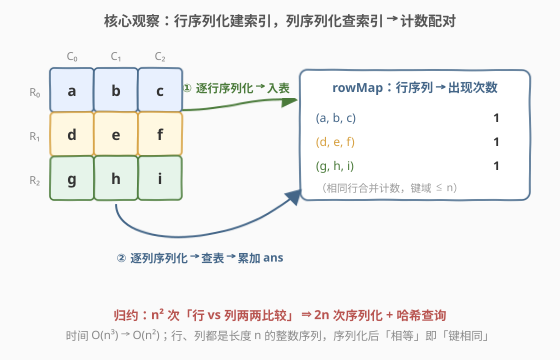
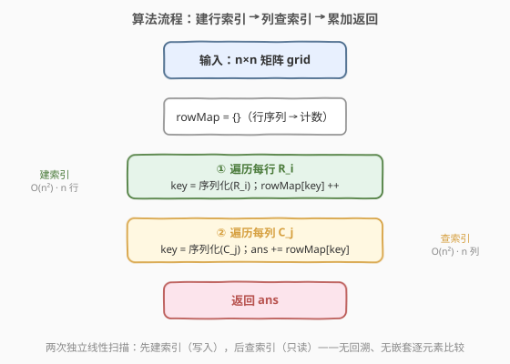
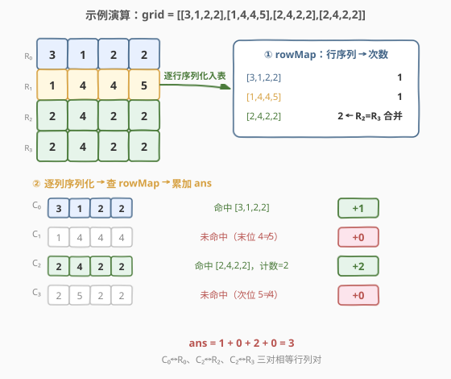

# 相等行列对

- **题目名称**：相等行列对
- **链接**：[2352. 相等行列对](https://leetcode.cn/problems/equal-row-and-column-pairs/)
- **难度**：中等
- **标签**：数组、哈希表、矩阵

## 1. 题目概述

给你一个下标从 **0** 开始、大小为 `n x n` 的整数矩阵 `grid`，返回满足「第 $R_i$ 行」与「第 $C_j$ 列」相等的行列对 $(R_i, C_j)$ 的数目。

「行和列相等」指二者以相同顺序包含相同元素（即两个等长数组完全一致）。

**示例 1**：

```text
输入：grid = [[3,2,1],[1,7,6],[2,7,7]]
输出：1
解释：存在一对相等行列对：
  - (第 2 行，第 1 列)：[2,7,7]
```

**示例 2**：

```text
输入：grid = [[3,1,2,2],[1,4,4,5],[2,4,2,2],[2,4,2,2]]
输出：3
解释：存在三对相等行列对：
  - (第 0 行，第 0 列)：[3,1,2,2]
  - (第 2 行，第 2 列)：[2,4,2,2]
  - (第 3 行，第 2 列)：[2,4,2,2]
```

**约束条件**：

- `n == grid.length == grid[i].length`
- $1 \le n \le 200$
- $1 \le \text{grid}[i][j] \le 10^5$

> 💡 **关键观察**：每一行、每一列都是长度为 $n$ 的整数序列，「行列相等」即「两个序列完全一致」。把每个序列**序列化成一个可哈希的键**（字符串 / 元组），就能把「行 vs 列两两比较」转化为「一边建索引 + 一边查索引」。

---

## 2. 解题思路

### 2.1 暴力思路：双重循环逐对比较

最直白的做法：双重循环枚举所有 $(i, j)$（$n^2$ 对），每对逐元素比较行 $R_i$ 与列 $C_j$ 是否相等（$O(n)$）。总复杂度 $O(n^3)$。当 $n = 200$ 时约 $8 \times 10^6$ 次，看似能过，但每对都重新比较一遍、且无法利用「相同行/列会重复」的结构，**常数与重复计算上都浪费**。

> ⚠️ 暴力的浪费在于：相同的行（或列）可能出现多次，暴力对「每个相同行的每一份」都重复比较了同一批列。把「逐对比较」换成「按序列分组计数」即可消去一层循环。

### 2.2 核心观察：序列化作键，行建索引、列查索引



行与列本质同构——都是长度 $n$ 的整数序列。把每个序列**序列化成一个可哈希的键**：

- C++：把序列拼成以分隔符连接的字符串，如 `[2,4,2,2] → "2#4#2#2#"`；
- Python：直接转成 `tuple`，元组原生可哈希。

随后两阶段处理：

1. **建索引**：遍历每一行 $R_i$，序列化为 `key`，`rowMap[key] ++`。这样 `rowMap[k]` 就表示「键为 $k$ 的行出现了几次」。
2. **查索引**：遍历每一列 $C_j$，序列化为 `key`，`ans += rowMap[key]`——该列能与多少行配对，恰等于「同键行的出现次数」。

> 💡 **为什么对」换成「计数」是等价的？** 设列 $C_j$ 序列化为键 $k$，则所有与 $C_j$ 相等的行，其序列化键也必为 $k$（序列化是双射）。这些行的数量就是 `rowMap[k]`。所以 $C_j$ 贡献的配对数恰为 `rowMap[k]`，逐列累加即得总数。这是**Meet-in-the-Middle 计数**的退化形式（只有两个序列、且配对条件是「全等」）。

> ⚠️ **分隔符不可省**：若 C++ 直接把数字拼接成 `"2422"`，则 `[2,4,2,2]` 与 `[24,22]`（虽非本题合法输入，但通用序列化须防）会撞键。用一个不出现在数字中的分隔符（如 `#`）连接即可。Python 用 `tuple` 天然无此问题。

### 2.3 算法流程图



两次独立的线性扫描，无嵌套逐元素比较：

1. 初始化 `rowMap` 为空；
2. **遍历每行** $R_i$：`key = 序列化(R_i)`，`rowMap[key] ++`；
3. **遍历每列** $C_j$：`key = 序列化(C_j)`，`ans += rowMap[key]`；
4. 返回 `ans`。

> 💡 两阶段天然顺序无关——先建索引的必须是「行」（因为查询的是「行」的出现次数），而「行/列」可互换：把列建索引、行查询也完全对称，结果一致。习惯上把行建索引，因为按行存储缓存更友好。

### 2.4 示例演算

以示例 2 `grid = [[3,1,2,2],[1,4,4,5],[2,4,2,2],[2,4,2,2]]` 为例：



**阶段一 · 建行索引**（`rowMap` 初值为空）：

| 行 $R_i$ | 序列键 | `rowMap[key]` 更新后 |
|----------|--------|----------------------|
| $R_0$ = [3,1,2,2] | `"3#1#2#2#"` | 1 |
| $R_1$ = [1,4,4,5] | `"1#4#4#5#"` | 1 |
| $R_2$ = [2,4,2,2] | `"2#4#2#2#"` | 1 |
| $R_3$ = [2,4,2,2] | `"2#4#2#2#"` | **2**（与 $R_2$ 同键，合并计数）|

**阶段二 · 逐列查询**（`ans` 初值 0）：

| 列 $C_j$ | 序列键 | `rowMap[key]` | 贡献 | `ans` |
|----------|--------|--------------|------|-------|
| $C_0$ = [3,1,2,2] | `"3#1#2#2#"` | 1 | +1 | 1 |
| $C_1$ = [1,4,4,4] | `"1#4#4#4#"` | 0 | +0 | 1 |
| $C_2$ = [2,4,2,2] | `"2#4#2#2#"` | **2** | +2 | 3 |
| $C_3$ = [2,5,2,2] | `"2#5#2#2#"` | 0 | +0 | 3 |

最终返回 `3`，与示例一致。三对分别是 $(R_0,C_0)$、$(R_2,C_2)$、$(R_3,C_2)$——注意 $C_2$ 与「同键的两行」各配一对，故贡献 2。

---

## 3. 参考代码

### C++：字符串序列化 + 哈希计数（$O(n^2)$ / $O(n^2)$）

```cpp
class Solution {
public:
    int equalPairs(vector<vector<int>>& grid) {
        int n = grid.size();
        unordered_map<string, int> rowCnt;
        for (int i = 0; i < n; ++i) {
            string key;
            for (int j = 0; j < n; ++j) {
                key += to_string(grid[i][j]);
                key.push_back('#'); // 分隔符，避免 [2,4] 与 [24] 撞键
            }
            ++rowCnt[key];
        }
        int ans = 0;
        for (int j = 0; j < n; ++j) {
            string key;
            for (int i = 0; i < n; ++i) {
                key += to_string(grid[i][j]);
                key.push_back('#');
            }
            ans += rowCnt[key];
        }
        return ans;
    }
};
```

> 💡 行建索引时键长 $O(n)$、共 $n$ 行，列查询时键长 $O(n)$、共 $n$ 列，序列化总开销 $O(n^2)$；哈希查询摊还 $O(1)$。分隔符 `#` 不出现在十进制数字中，保证双射。

### Python：元组序列化 + Counter

```python
class Solution:
    def equalPairs(self, grid: List[List[int]]) -> int:
        n = len(grid)
        row_cnt = Counter(tuple(row) for row in grid)  # 行序列 -> 出现次数
        ans = 0
        for j in range(n):
            col = tuple(grid[i][j] for i in range(n))  # 列序列化
            ans += row_cnt.get(col, 0)
        return ans
```

> 💡 Python 的 `tuple` 原生可哈希、且天然区分 `[2,4]` 与 `[24]`，无需手动加分隔符，最是简洁。`Counter(...)` 一次生成器即可建好行索引；`row_cnt.get(col, 0)` 处理「列未出现在行索引中」的零贡献。

---

## 4. 复杂度分析

| 维度 | 复杂度 | 说明 |
|------|--------|------|
| **时间复杂度** | $O(n^2)$ | 序列化 $2n$ 个长 $n$ 的序列，共 $2n^2$ 次数字→字符串/元组操作；哈希建/查各 $n$ 次摊还 $O(1)$，总计 $O(n^2)$ |
| **空间复杂度** | $O(n^2)$ | `rowMap` 至多存 $n$ 个键，每键长 $O(n)$，合计 $O(n^2)$；不同行数 $\le n$ |

> 💡 $n \le 200$ ⟹ $n^2 \le 4 \times 10^4$，规模很小，$O(n^2)$ 轻松 AC。本题考点不在性能上限，而在「序列化作键 + 哈希计数」这一**把逐对比较归约为建索引/查索引**的转化思想。

---

## 5. 扩展：C++ 键的其他选法与权衡

C++ 的 `unordered_map` 不支持以 `vector<int>` 直接作键（无默认 hash）。常见替代：

```cpp
// 方案 A：map<vector<int>, int>（红黑树，键比较 O(n)）
map<vector<int>, int> rowCnt;            // 查/插 O(n log n)，总 O(n^2 log n)

// 方案 B：字符串键（本题做法）unordered_map<string, int>，摊还 O(n)
// 方案 C：自定义 vector<int> 的哈希（手写 hash 函数）
struct VecHash {
    size_t operator()(const vector<int>& v) const {
        size_t h = v.size();
        for (int x : v) h ^= x + 0x9e3779b9 + (h << 6) + (h >> 2);
        return h;
    }
};
unordered_map<vector<int>, int, VecHash> rowCnt; // 摊还 O(n)，但需手写哈希
```

| 方案 | 时间 | 空间 | 适用 |
|------|------|------|------|
| `map<vector<int>,int>` | $O(n^2 \log n)$ | $O(n^2)$ | 写法最短，键无须序列化；$n$ 小时够用 |
| `unordered_map<string,int>`（分隔符） | $O(n^2)$ | $O(n^2)$ | 通用、常数好，需注意分隔符防撞键 |
| `unordered_map<vector<int>,int,VecHash>` | $O(n^2)$ | $O(n^2)$ | 免分隔符、键即原序列，但需手写哈希 |

> 💡 **抽象经验**：当需要把「序列相等」转成「哈希键相等」时，Python 用 `tuple` 最省心；C++ 在「常数优先」用字符串键、在「写法优先」用 `map<vector<int>,int>`、在「既要快又要保结构」用手写 `vector` 哈希。识别「序列化作键」这一模式，是 49 字母异位词分组、336 回文对等同源题的共通套路。

---

## 6. 面试要点

1. **为什么序列化后查计数，结果与「逐对比较」一致？**

   > 序列化（按固定顺序把行/列整数列写成键）是「序列 → 键」的**双射**：两序列相等 ⟺ 它们的键相等。于是「列 $C_j$ 与之相等的行数」恰等于「同键行的出现次数」`rowMap[序列化(C_j)]`。逐列累加即所有相等行列对的总数——既不漏（双射保证）也不重（每对 $(R_i,C_j)$ 只在查 $C_j$ 时计入一次）。

2. **为什么必须用分隔符连接字符串？直接拼接数字会怎样？**

   > 不加分隔符时，`[2,4,2,2]` 与 `[24,22]`（若允许两位数输入）都会拼成 `"2422"`，**不同序列撞同键**，导致多算。本题元素为正整数且可达 $10^5$（最多 6 位），用不出现在数字中的 `#` 作分隔即可保证双射。Python 用 `tuple` 天然无此问题。

3. **能否对列建索引、行查询？结果一样吗？**

   > 完全对称。行列都是长 $n$ 的序列，把列建索引 `colMap[序列化(C_j)] ++`、再逐行查询 `ans += colMap[序列化(R_i)]`，结果相同——因为「相等行列对」是对称关系，从行侧或列侧计数都遍历了全部配对。习惯上按行建索引是因为矩阵按行存储、缓存更友好。

4. **复杂度是多少？瓶颈在哪？**

   > 时间 $O(n^2)$：序列化 $2n$ 条长 $n$ 的序列共 $2n^2$，哈希建/查各 $n$ 次摊还 $O(1)$。空间 $O(n^2)$：`rowMap` 至多 $n$ 个键，每键长 $O(n)$。瓶颈在序列化的 $O(n^2)$——这是把「整条序列作为一个整体比较」的固有代价，无法低于 $O(n^2)$（至少要把每个元素读一遍）。

5. **若元素含负数或 0，序列化需调整吗？**

   > 字符串方案：负号 `-` 与数字 `0..9` 共 11 个字符，仍可挑 `#` 作分隔符（负号不出现在数字里），无需调整。`tuple` 方案完全无影响。唯一要注意：若改用「求和/异或」等数值摘要作键则会出错（不同序列可能同摘要）——故**键必须是完整序列的双射表示**，不可用摘要压缩。

> 💡 **一句话总结**：2352 =「序列化作键 + 行建索引 / 列查索引」。把每行/列序列化成可哈希键，`rowMap[key]` 记行出现次数，逐列查询累加即答案——$O(n^2)/O(n^2)$，把逐对比较 $O(n^3)$ 归约为建索引 + 查索引两次线性扫描。

---

## 7. 同类练习题

- [49. 字母异位词分组](https://leetcode.cn/problems/group-anagrams/)（[题解](../0001-0100/49_字母异位词分组.md)）：把每个串「序列化作键」（排序或计数签名）+ 哈希分组，与本题「行序列化建索引」同源，差别在键的构造方式
- [1. 两数之和](https://leetcode.cn/problems/two-sum/)（[题解](../0001-0100/1_两数之和.md)）：「一边建索引、一边/后查另一边」的哈希配对范式母题——本题把「等值配对」推广为「等序列配对」
- [128. 最长连续序列](https://leetcode.cn/problems/longest-consecutive-sequence/)（[题解](../0101-0200/128_最长连续序列.md)）：哈希集合查询「配对元素是否存在」，同属「序列化作可哈希键后用哈希表消除嵌套查找」一族
- [599. 两个列表的最小索引总和](https://leetcode.cn/problems/minimum-index-sum-of-two-lists/)（[题解](../0501-0600/599_两个列表的最小索引总和.md)）：两个序列互相哈希配对，结构同构——把一个列表建索引、另一个查询，只是配对条件从「全等」换成「共同元素」
- [336. 回文对](https://leetcode.cn/problems/palindrome-pairs/)（[题解](../0301-0400/336_回文对.md)）：字符串序列化 + 哈希查询「翻转后是否存在」，把「逐对拼接判回文」$O(n^2 L)$ 归约为「建索引 + 查索引」，与本题的归约思想一脉相承
