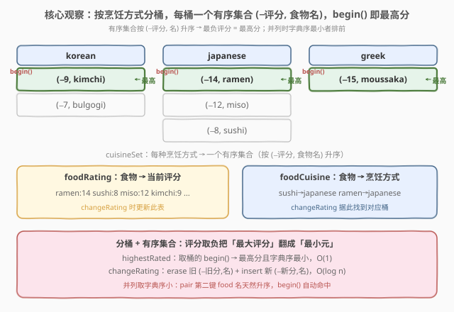
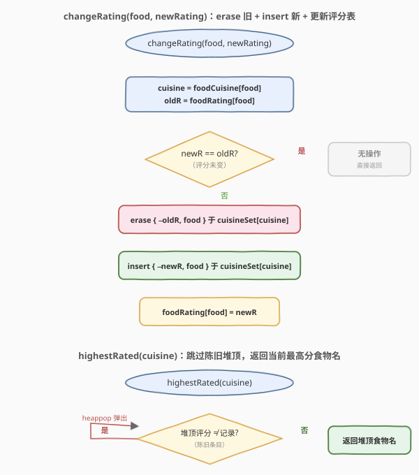
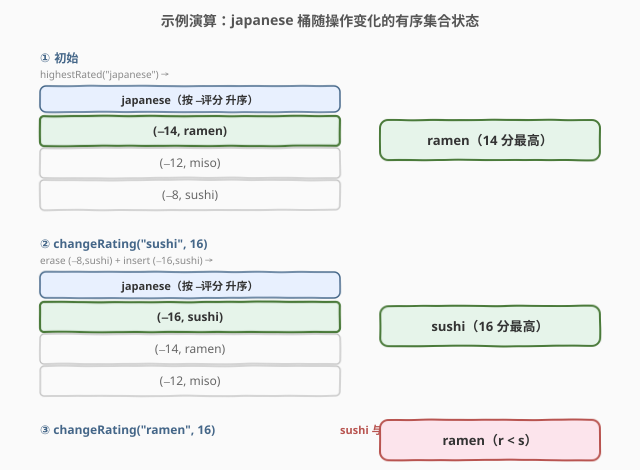

# 设计食物评分系统

- **题目名称**：设计食物评分系统
- **链接**：[2353. 设计食物评分系统](https://leetcode.cn/problems/design-a-food-rating-system/)
- **难度**：中等
- **标签**：设计、堆、有序集合、哈希表

## 1. 题目概述

设计一个食物评分系统，支持两种操作：

- `changeRating(food, newRating)`：**修改**名字为 `food` 的食物的评分为 `newRating`。
- `highestRated(cuisine)`：返回指定烹饪方式 `cuisine` 下**评分最高**的食物名字；并列时返回**字典序较小**者。

初始化 `FoodRatings(foods, cuisines, ratings)` 给出 $n$ 种食物，三数组一一对应：`foods[i]` 名字、`cuisines[i]` 烹饪方式、`ratings[i]` 初始评分。食物名互不相同。

**示例**：

```text
输入：
["FoodRatings","highestRated","highestRated","changeRating","highestRated","changeRating","highestRated"]
[[["kimchi","miso","sushi","moussaka","ramen","bulgogi"],["korean","japanese","japanese","greek","japanese","korean"],[9,12,8,15,14,7]],["korean"],["japanese"],["sushi",16],["japanese"],["ramen",16],["japanese"]]
输出：
[null,"kimchi","ramen",null,"sushi",null,"ramen"]

解释：
foodRatings.highestRated("korean");     // "kimchi"，韩式最高分 9
foodRatings.highestRated("japanese");   // "ramen"，日式最高分 14
foodRatings.changeRating("sushi", 16);  // sushi 升至 16
foodRatings.highestRated("japanese");   // "sushi"，日式最高分 16
foodRatings.changeRating("ramen", 16);  // ramen 升至 16
foodRatings.highestRated("japanese");   // "ramen"，并列 16，ramen 字典序 < sushi
```

**约束条件**：

- $1 \le n \le 2 \times 10^4$
- $n = $ `foods.length` $=$ `cuisines.length` $=$ `ratings.length`
- $1 \le$ `foods[i].length`, `cuisines[i].length` $\le 10$，均为小写字母
- $1 \le$ `ratings[i]` $\le 10^8$
- `foods` 中字符串互不相同
- `changeRating` 与 `highestRated` 调用总计 $\le 2 \times 10^4$ 次

> 💡 两种操作交织：一个**改值**、一个**取每类极值**。若每类只存无序数组，取极值需 $O(k)$ 全扫——$2\times 10^4$ 次查询 $\times$ 每类 $2\times 10^4$ 个食物 $\approx 4\times 10^8$，有超时风险。关键是让「取极值」落到 $O(\log n)$ 甚至 $O(1)$，办法是**按烹饪方式分桶 + 每桶维护一个有序集合**。

---

## 2. 解题思路

### 2.1 暴力思路：每桶数组 + 线性扫描

最直白的做法：用哈希表 `cuisineFoods[cuisine]` 存该烹饪方式下所有 `(food, rating)`，`changeRating` 时遍历该桶找到 `food` 改其评分（$O(k)$），`highestRated` 遍历整桶维护「最高分 + 字典序最小名」（$O(k)$），其中 $k$ 为该桶食物数。

约束 $n \le 2\times 10^4$、调用 $\le 2\times 10^4$ 次，最坏同一桶塞满所有食物，单次 $O(n)$，总计 $\approx 4\times 10^8$，常数虽小但接近上限、不稳定，面试必被追问。

> ⚠️ 暴力把每桶拍成无序数组，「改值」和「取极值」都要扫全桶——根因是**顺序未维护**：评分一变，桶内的「最值位置」可能跳到任意处，只能线性找。把桶换成**有序集合**，让结构自己记住顺序，改值与取极值都落到对数级。

### 2.2 核心观察：按烹饪方式分桶 + 每桶有序集合



关键观察：**评分取负**，把「最高分」翻成「最小元」。每个桶存一个有序集合，元素为 `(-rating, food)`：

- `pair` 默认按第一键（$-$评分）升序，再按第二键 `food` 字典序升序；
- 故 `begin()` 恰是「评分最高（$-$评分最小）、并列时名字字典序最小」的那个——**`highestRated` 直接取桶首**，$O(1)$ 命中。

再配两张元数据表支撑 `changeRating`：

- **`foodRating`**：`food → 当前评分`，改值时更新；
- **`foodCuisine`**：`food → 烹饪方式`，改值时据此找到对应桶。

`changeRating(food, newRating)` 三步：查 `cuisine = foodCuisine[food]`、`oldR = foodRating[food]`；在该桶**擦除**旧元 `{-oldR, food}`、**插入**新元 `{-newR, food}`；更新 `foodRating[food] = newRating`。各为一次有序集合操作，$O(\log n)$。

> 💡 不变式：有序集合中每条 `(−评分, food)` 的评分恒等于 `foodRating[food]` 的当前值。`changeRating` 严格「先擦旧再插新」保证此不变式；它使 `begin()` 永远是真最高分，无需查表二次确认（即时删除范式）。

### 2.3 算法流程图



`changeRating` 是「查 → 判同 → 擦旧 → 插新 → 更新表」的线性链，评分未变时直接短路。`highestRated` 在**惰性删除范式**下需先弹掉评分与记录不符的陈旧堆顶（C++ 用 `std::set` 即时擦除则无陈旧项，直接 `begin()`）。

### 2.4 示例演算



| 步骤 | 操作 | japanese 桶（升序） | 答案 |
|------|------|---------------------|------|
| 1 | `highestRated("japanese")` | `{(-14,ramen), (-12,miso), (-8,sushi)}` | `ramen` |
| 2 | `changeRating("sushi",16)` | `{(-16,sushi), (-14,ramen), (-12,miso)}` | — |
| 3 | `highestRated("japanese")` | （同上） | `sushi` |
| 4 | `changeRating("ramen",16)` | `{(-16,ramen), (-16,sushi), (-12,miso)}` | — |
| 5 | `highestRated("japanese")` | （同上） | `ramen` |

注意步骤 5：`ramen` 与 `sushi` 同为 $-16$，`pair` 第二键比较时 `"ramen" < "sushi"`（`r` 在 `s` 前），故 `(-16, ramen)` 排在 `(-16, sushi)` 之前，`begin()` 取到 `ramen`。**评分取负 + 名字做次键**天然解决并列取字典序小的问题，无需特判。

---

## 3. 参考代码

### C++

```cpp
class FoodRatings {
    unordered_map<string, set<pair<int, string>>> cuisineSet;  // 烹饪方式 → 有序集合 (−评分, 食物名)
    unordered_map<string, int> foodRating;                     // 食物 → 当前评分
    unordered_map<string, string> foodCuisine;                 // 食物 → 烹饪方式
public:
    FoodRatings(vector<string>& foods, vector<string>& cuisines, vector<int>& ratings) {
        int n = foods.size();
        for (int i = 0; i < n; i++) {
            foodRating[foods[i]] = ratings[i];
            foodCuisine[foods[i]] = cuisines[i];
            cuisineSet[cuisines[i]].insert({-ratings[i], foods[i]});  // 取负，begin() 即最高分
        }
    }

    void changeRating(string food, int newRating) {
        int oldRating = foodRating[food];
        if (newRating == oldRating) return;                    // 未变短路
        string& c = foodCuisine[food];
        cuisineSet[c].erase({-oldRating, food});               // 擦旧
        cuisineSet[c].insert({-newRating, food});              // 插新
        foodRating[food] = newRating;                          // 更新表
    }

    string highestRated(string cuisine) {
        return cuisineSet[cuisine].begin()->second;            // 桶首即答案
    }
};
```

> 💡 `std::set<pair<int,string>>` 同时承担「按 $(−$评分$,$ 名$)$ 有序」与「即时去重」两职。`changeRating` 先擦后插保证集合里每条都是当前真值，`begin()` 永远命中真最高分——即时删除范式，`highestRated` 严格 $O(1)$。

### Python

```python
from collections import defaultdict
import heapq


class FoodRatings:

    def __init__(self, foods: List[str], cuisines: List[str], ratings: List[int]):
        self.food_rating = {}                       # 食物 → 当前评分
        self.food_cuisine = {}                      # 食物 → 烹饪方式
        self.cuisine_heap = defaultdict(list)       # 烹饪方式 → 最小堆 [(-评分, 食物名)]
        for f, c, r in zip(foods, cuisines, ratings):
            self.food_rating[f] = r
            self.food_cuisine[f] = c
            heapq.heappush(self.cuisine_heap[c], (-r, f))   # 取负，堆顶 = 最高分且字典序最小

    def changeRating(self, food: str, newRating: int) -> None:
        c = self.food_cuisine[food]
        heapq.heappush(self.cuisine_heap[c], (-newRating, food))  # 惰性：旧条目留堆中稍后清理
        self.food_rating[food] = newRating

    def highestRated(self, cuisine: str) -> str:
        heap = self.cuisine_heap[cuisine]
        # 弹掉评分与当前记录不符的陈旧条目
        while heap and -heap[0][0] != self.food_rating[heap[0][1]]:
            heapq.heappop(heap)
        return heap[0][1]                           # 堆顶 = 最高分且字典序最小
```

> ⚠️ Python 无内置有序集合，用「最小堆 + 惰性删除」实现等价效果：`changeRating` 只 `push` 新条目，**不擦旧**；`highestRated` 取顶前先弹掉评分与 `food_rating` 不符的陈旧堆顶。每条陈旧记录至多被弹一次，故 `highestRated` **均摊** $O(\log n)$。这是惰性删除范式——以「堆中可能混入废条目」换「改值只 push 不擦」的简洁。

---

## 4. 复杂度分析

| 维度 | 复杂度 | 说明 |
|------|--------|------|
| **时间**（单次 `changeRating`） | $O(\log n)$ | C++ 一次 `erase` + 一次 `insert`；Python 一次 `heappush`，均为 $O(\log n)$ |
| **时间**（单次 `highestRated`） | C++ $O(1)$ / Python 均摊 $O(\log n)$ | C++ `set::begin()` 直接取首元；Python 弹陈旧堆顶，每条至多弹一次，均摊 $O(\log n)$ |
| **空间** | $O(n)$ | 三张表 + 各桶有序集合/堆共存 $n$ 条食物，无冗余（C++ 即时擦除无废条目；Python 惰性留少量废条目，总数仍 $O(n)$） |

> 💡 上界：$n \le 2\times 10^4$、调用 $\le 2\times 10^4$ 次。C++ 总时间 $\approx 2\times 10^4 \times O(\log n) \approx 3\times 10^5$；Python 惰性弹废条目总量 $\le$ `push` 次数 $\le 4\times 10^4$，均摊后同量级，均轻松 AC。

---

## 5. 扩展：即时删除 vs 惰性删除

本题两套实现映射**有序集合维护动态极值**的两大范式：

| 范式 | 数据结构 | 改值操作 | 取极值 | 复杂度 |
|------|----------|----------|--------|--------|
| **即时删除** | 平衡 BST（`std::set`、`TreeMap`） | 擦旧 + 插新，$O(\log n)$ | `begin()`，$O(1)$ | 改值稍重、查询极快 |
| **惰性删除** | 二叉堆（`priority_queue`、`heapq`） | 只 push 新，$O(\log n)$ | 弹废顶后取顶，均摊 $O(\log n)$ | 改值极简、查询均摊 |

何时选谁？**改值远多于查询** → 惰性更划算（`push` 比 `erase` 简单且常数小，废条目堆积慢）；**查询远多于改值 / 需严格单次 $O(1)$ 查询** → 即时更稳（查询零均摊、零废条目）。本题两类操作次数相当，二者皆可；C++ 有 `std::set` 自然走即时，Python 无 BST 标准库便走惰性——**语言决定选型**。

> 💡 抽象经验：见到「反复改值 + 反复查每类极值」的设计题，先把元素按「所属类」分桶，每桶维护一个**有序结构**（BST 或堆），让结构替你记住顺序——改值与取极值都从 $O(n)$ 降到 $O(\log n)$。取负评分是把「最大值」问题塞进「最小元」结构的通用技巧（同 [703](https://leetcode.cn/problems/kth-largest-element-in-a-stream/) 的第 K 大用容量 $K$ 小顶堆）。

---

## 6. 面试要点

1. **为什么评分取负？**

   - 有序集合 / 最小堆默认取「最小元」。把评分取负后，**最高分 → 最负 → 最小元**，`begin()`/堆顶直接命中最高分；
   - 取负不改并列判定：`(-16, "ramen")` 与 `(-16, "sushi")` 比较时第一键相同，自动落到第二键 `food` 字典序，`ramen` 排前。

2. **并列时如何保证返回字典序较小者？**

   - 把 `food` 名作为 `pair` 的**第二键**，集合 / 堆比较元组时按 `(−评分, 名)` 双键排序；
   - 第一键并列则比第二键，名字字典序小者排前，`begin()` 自动命中，无需额外特判。

3. **`changeRating` 为何「先擦旧再插新」？**

   - 维护不变式「集合中每条评分 = `foodRating[food]` 当前值」；先擦 `{-oldR, food}` 移除旧记录，再插 `{-newR, food}` 写入新记录；
   - 若只插不擦（即时范式），旧记录会与新记录并存，`begin()` 可能命中废值——这正是 Python 惰性范式需要 `while` 清理的原因。

4. **惰性删除的均摊分析？**

   - 每条记录只在 `changeRating` 时 `push` 一次（产生至多一条新真值 + 一条变成废值的旧记录）；
   - `highestRated` 的 `while` 把每条废记录**至多弹一次**即永久消失，故弹出总次数 $\le$ `push` 总次数 $\le$ 调用次数，均摊每次 $O(\log n)$。

5. **若食物会动态新增/删除呢？**

   - 新增：往对应桶插 `{-rating, food}` + 建两张表条目，$O(\log n)$；
   - 删除：即时范式擦 `{-rating, food}` + 删表条目；惰性范式需标记 `food_rating[food]` 失效（如置 `None`），`highestRated` 见到失效堆顶一并弹出——惰性天然支持「软删除」。

> 💡 **一句话总结**：按烹饪方式分桶、每桶维护有序集合 `(-评分, 食物名)`；`highestRated` 取桶首 $O(1)$，`changeRating` 擦旧插新 $O(\log n)$——评分取负 + 名字做次键把「最高分且字典序最小」一并塞进 `begin()`。

---

## 7. 同类练习题

- [2336. 无限集中的最小数字](https://leetcode.cn/problems/smallest-number-in-infinite-set/)：同「设计 + 有序结构取极值」，连续尾压指针 + 回收堆维护无限集最小，对比本题「分桶 + 每桶有序集合」的选型
- [703. 数据流中的第 K 大元素](https://leetcode.cn/problems/kth-largest-element-in-a-stream/)：容量 $K$ 小顶堆跟踪流式 Top-K，与本题「取负评分把最大值塞进小顶堆」同源
- [295. 数据流的中位数](https://leetcode.cn/problems/find-median-from-data-stream/)：对顶双堆维护流式中位数，比本题单堆更复杂，但同属「堆维护动态极值」设计题模板
- [1801. 积压订单中的订单总数](https://leetcode.cn/problems/number-of-orders-in-the-backlog/)：双优先队列（最大/最小堆）+ 惰性清理过期订单，是本题惰性删除范式在「买卖撮合」场景的招牌应用
