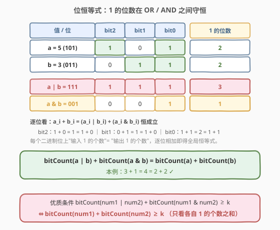
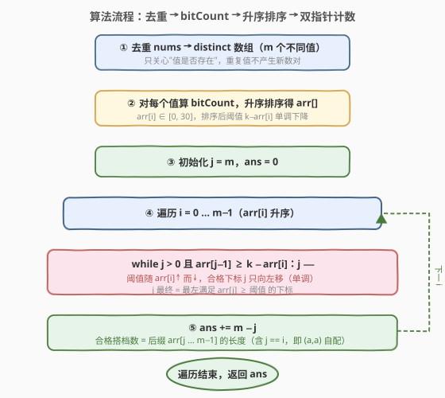
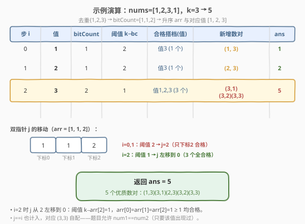

# LeetCode 优质数对的数目 题解

## 1. 题目概述

- **标题 / 题号**：优质数对的数目（#2354，hard）
- **链接**：https://leetcode.cn/problems/number-of-excellent-pairs/
- **难度**：困难
- **标签**：位运算、数组、排序、双指针

**题意**：给定下标从 0 开始的正整数数组 `nums` 和正整数 `k`。数对 `(num1, num2)` 是**优质数对**当且仅当：

- `num1` 和 `num2` **都**在数组 `nums` 中存在；
- `bitCount(num1 OR num2) + bitCount(num1 AND num2)` ≥ `k`，其中 `bitCount` 表示二进制中值为 1 的位数，`OR` 是按位或，`AND` 是按位与。

返回**不同**优质数对的数目。若 `a != c` 或 `b != d`，则认为 `(a, b)` 与 `(c, d)` 是不同的两个数对（即**有序数对**，`(1, 2)` 与 `(2, 1)` 不同）。注意：若 `num1` 在数组中至少出现一次，则 `num1 == num2` 的数对 `(num1, num1)` 也可以是优质数对。

**示例 1**：

```text
输入：nums = [1,2,3,1], k = 3
输出：5
解释：优质数对共 5 个：
  - (3,3)：3 AND 3 = 3(11)，3 OR 3 = 3(11)，位数和 = 2 + 2 = 4 ≥ 3
  - (2,3) 与 (3,2)：2 AND 3 = 2(10)，2 OR 3 = 3(11)，位数和 = 1 + 2 = 3
  - (1,3) 与 (3,1)：1 AND 3 = 1(01)，1 OR 3 = 3(11)，位数和 = 1 + 2 = 3
```

**示例 2**：

```text
输入：nums = [5,1,1], k = 10
输出：0
解释：该数组中不存在优质数对。
```

**约束**：

- $1 \le \text{nums.length} \le 10^5$
- $1 \le \text{nums}[i] \le 10^9$
- $1 \le k \le 60$

> 💡 **关键约束**：`nums[i] <= 10^9 < 2^30`，故任意一个数的 `bitCount` 至多为 30；两数 `bitCount` 之和至多为 60，正对应 `k <= 60` 的上界。这一"位数为极小量"是第 5 节用频次桶 $O(31^2)$ 优化的依据。

## 2. 解题思路

### 2.1 暴力思路：枚举所有数对

最直白的做法：枚举所有有序数对 `(num1, num2)`（取自 `nums` 中的值），对每对实际计算 `bitCount(num1 OR num2) + bitCount(num1 AND num2)` 并判断是否 ≥ `k`。复杂度 $O(n^2 \cdot 30)$，$n = 10^5$ 时约 $3 \times 10^{11}$ 次操作，**超时**。

> ⚠️ 暴力的浪费在于：优质条件其实只依赖两个数"各自 1 的位数之和"，而与它们具体的 `OR` / `AND` 值无关——这一隐藏的**位恒等式**把问题从"两两算位运算"降为"两两算位数和"。

### 2.2 核心观察：位恒等式 + 按位数计数



**位恒等式**：对任意两个非负整数 $a$、$b$，

$$\text{bitCount}(a \text{ OR } b) + \text{bitCount}(a \text{ AND } b) = \text{bitCount}(a) + \text{bitCount}(b)$$

直观理解（逐位看）：在每一个二进制位上，"输入的两比特之和" = "OR 位 + AND 位"：

| 两比特 $(a_i, b_i)$ | $a_i$ OR $b_i$ | $a_i$ AND $b_i$ | 和 |
|---|---|---|---|
| $(1,1)$ | 1 | 1 | $2 = 1+1$ |
| $(1,0)$ / $(0,1)$ | 1 | 0 | $1 = 1+0$ |
| $(0,0)$ | 0 | 0 | $0 = 0+0$ |

逐位相加，全局即得恒等式。于是优质条件

$$\text{bitCount}(num_1 \text{ OR } num_2) + \text{bitCount}(num_1 \text{ AND } num_2) \ge k$$

等价于

$$\text{bitCount}(num_1) + \text{bitCount}(num_2) \ge k$$

**即只看两个数各自"1 的位数"之和！** 问题被归约为：给定每个数的 `bitCount`，数有多少有序对 $(c_1, c_2)$ 满足 $c_1 + c_2 \ge k$。

> 💡 **去重**：题目按"值"计对，重复出现的值不产生新数对。故先对 `nums` 去重得到 `distinct` 集合（$m$ 个不同值），每个值只取一次 `bitCount`。例如 `[1,2,3,1]` 去重得 `{1,2,3}`，重复的 `1` 不再单独参与配对。

### 2.3 算法流程图



把 $m$ 个 `bitCount` 升序排成 `arr[]`，用**双指针**数有序对：左指针 `i` 升序遍历，维护 `j` = "最左满足 `arr[j]` ≥ `k - arr[i]` 的下标"。因为 `arr[i]` 递增 → 阈值 `k - arr[i]` 递减 → 合格下标 `j` 单调左移，所以 `j` 只往左走、从不回退，整体 $O(m)$。

对每个 `i`，合格搭档数 = 后缀 `arr[j .. m-1]` 的长度 = `m - j`（注意包含 `j == i`，对应 `(num, num)` 自配）。累加即得答案。

> 💡 **为什么 `j == i` 也算？** 有序数对 `(num_i, num_i)` 即"自身配自身"，题目允许 `num1 == num2`（只要该值出现过）。当 `arr[i] + arr[i] >= k` 时下标 `i` 落在合格后缀里，自然计入，无需特判。

### 2.4 示例演算

以 `nums = [1,2,3,1], k = 3` 为例：去重 `{1,2,3}`，`bitCount` 分别为 1、1、2，升序 `arr = [1,1,2]`（对应值 1、2、3）。



| 步 `i` | 值 | `bitCount` | 阈值 `k−bc` | 合格搭档（值） | 新增数对 | `ans` |
|---|---|---|---|---|---|---|
| 0 | 1 | 1 | 2 | 值 3（1 个） | (1,3) | 1 |
| 1 | 2 | 1 | 2 | 值 3（1 个） | (2,3) | 2 |
| 2 | 3 | 2 | 1 | 值 1,2,3（3 个） | (3,1)(3,2)(3,3) | **5** |

`i=2` 时阈值降到 1，`j` 从 2 一路左移到 0，三个值全部合格，`ans` 跳到 5，与示例一致。

## 3. 参考代码

### C++

```cpp
class Solution {
public:
    long long countExcellentPairs(vector<int>& nums, long long k) {
        set<int> st(nums.begin(), nums.end());                  // 去重
        vector<int> arr;
        for (int v : st)
            arr.push_back(__builtin_popcount((unsigned)v));    // 各值 bitCount
        sort(arr.begin(), arr.end());                          // 升序

        int m = arr.size();
        long long ans = 0;
        int j = m;                                             // j = 最左合格下标
        for (int i = 0; i < m; i++) {
            while (j > 0 && arr[j - 1] >= k - arr[i]) j--;    // 阈值降 → j 左移
            ans += m - j;                                      // 合格后缀长度
        }
        return ans;
    }
};
```

> 💡 `__builtin_popcount` 是 GCC 内建函数，返回二进制中 1 的位数；`nums[i] < 2^30`，转 `unsigned` 后位模式不变。`ans` 用 `long long`，因为答案可达约 $10^{10}$。`j` 在整趟循环只左移不回退，保证双指针 $O(m)$。

### Python

```python
class Solution:
    def countExcellentPairs(self, nums: List[int], k: int) -> int:
        arr = sorted(bin(v).count("1") for v in set(nums))   # 去重 + bitCount + 升序
        m = len(arr)
        ans = 0
        j = m
        for c in arr:
            while j > 0 and arr[j - 1] >= k - c:             # 阈值降 → j 左移
                j -= 1
            ans += m - j                                     # 合格后缀长度
        return ans
```

> ⚠️ `bin(v).count("1")` 直观简洁；Python 3.10+ 也可用 `v.bit_count()`，常数更优。`set(nums)` 完成去重——重复值不产生新数对。

## 4. 复杂度分析

| 维度 | 复杂度 | 说明 |
|------|--------|------|
| **时间复杂度** | $O(n \log n)$ | 去重 $O(n)$；每值算 `bitCount` $O(30n)=O(n)$；排序 $O(m \log m) \le O(n \log n)$；双指针 $O(m)$ |
| **空间复杂度** | $O(n)$ | 去重集合与 `arr` 数组，最坏 $m = n$ |

## 5. 扩展：bitCount 值域极小 → 频次桶 $O(n)$

`bitCount` ∈ $[0, 30]$（因 `nums[i] < 2^30`），值域仅 31 种。去重后用频次数组 `freq[c]` 统计"`bitCount` 恰为 $c$ 的不同值个数"，再两重循环枚举 $(c_1, c_2)$，若 $c_1 + c_2 \ge k$ 则 `ans += freq[c1] * freq[c2]`。免去排序，整体 $O(n + 31^2) = O(n)$：

```cpp
class Solution {
public:
    long long countExcellentPairs(vector<int>& nums, long long k) {
        set<int> st(nums.begin(), nums.end());
        long long freq[31] = {0};
        for (int v : st) freq[__builtin_popcount((unsigned)v)]++;
        long long ans = 0;
        for (int c1 = 0; c1 <= 30; c1++)
            for (int c2 = 0; c2 <= 30; c2++)
                if (c1 + c2 >= k) ans += freq[c1] * freq[c2];
        return ans;
    }
};
```

| 解法 | 时间 | 空间 | 适用 |
|------|------|------|------|
| 排序 + 双指针 | $O(n \log n)$ | $O(n)$ | 通用，阈值条件可排序时首选 |
| 频次桶枚举 | $O(n)$ | $O(n)$ | 派生量（此处 `bitCount`）值域极小且稠密时更优 |

> 💡 **抽象经验**：与"数位和""取模余数"一样，当某个派生量的取值范围有较小上界时，可放弃排序改用桶 + 双重枚举，把 $O(n \log n)$ 降到 $O(n)$。识别"派生量值域大小"是选解法的关键一环。

## 6. 面试要点

1. **为什么优质条件可以化简为 $\text{bitCount}(num_1) + \text{bitCount}(num_2) \ge k$？**

   - 由位恒等式 $\text{bitCount}(a \text{ OR } b) + \text{bitCount}(a \text{ AND } b) = \text{bitCount}(a) + \text{bitCount}(b)$。逐位看：每个二进制位上 $a_i + b_i = (a_i \text{ OR } b_i) + (a_i \text{ AND } b_i)$ 恒成立（4 种比特组合逐一验证），对所有位求和即得全局恒等式。

2. **为什么要先去重？不去重会怎样？**

   - 题目按"值"计对：同一值出现多次只算一个值，`(num1, num2)` 是值对。若不去重，同一值被当作多个独立元素参与计数，会多算——例如 `[1,1]` 应只产生 `(1,1)` 一个值对（若合格），不去重却会按两个独立下标算成 4 个。

3. **双指针为什么是 $O(m)$ 而非 $O(m^2)$？**

   - `j` 在整个循环中只向左移动、从不回退，总移动次数 $\le m$。`i` 升序遍历使阈值 `k - arr[i]` 单调递减，合格下标 `j` 随之单调左移，故 `i` 与 `j` 各扫一遍，合计 $O(m)$。

4. **`(num, num)` 自配为什么会被正确计入？**

   - 合格后缀 `[j, m-1]` 包含所有满足 `arr[t] + arr[i] >= k` 的下标 `t`。当 `arr[i] + arr[i] >= k` 时 `t = i` 落在后缀内，对应数对 `(num_i, num_i)`。题目允许 `num1 == num2`（只要该值出现过），故无需排除，直接计入。

5. **为什么用 `long long` 存答案？**

   - $m$ 可达 $10^5$，有序数对总数最多 $m^2 = 10^{10}$，超过 `int` 上界（约 $2.1 \times 10^9$）。故 `ans` 必须用 `long long` / Python 的任意精度整数。

> 💡 **一句话总结**：位恒等式把 `OR` / `AND` 的位数和化为各自位数和 → 去重 + 排序 + 双指针数有序对 $O(n \log n)$；`bitCount` 值域仅 31 → 频次桶枚举 $O(n)$。

## 同类练习题

| # | 题目 | 与本题的关联 |
|---|------|-------------|
| 1356 | [根据数字二进制下 1 的数目排序](https://leetcode.cn/problems/sort-integers-by-the-number-of-1-bits/)（[题解](../1301-1400/1356_根据数字二进制下1的数目排序.md)） | 直接按 `bitCount` 排序，是本题"算位数 + 排序"的基础原语 |
| 611 | [有效三角形的个数](https://leetcode.cn/problems/valid-triangle-number/)（[题解](../0601-0700/611_有效三角形的个数.md)） | 排序 + 双指针数满足"和型阈值"的数对，计数型双指针招牌题，结构与本题同构 |
| 231 | [2 的幂](https://leetcode.cn/problems/power-of-two/)（[题解](../0201-0300/231_2的幂.md)） | `n & (n−1)` 消最低位 1 的位运算技巧，承接 `bitCount` 基础 |
| 371 | [两整数之和](https://leetcode.cn/problems/sum-of-two-integers/)（[题解](../0301-0400/371_两整数之和.md)） | 位运算模拟加法，同为"逐位看 OR / AND / 异或关系"的位运算思想 |
| 1 | [两数之和](https://leetcode.cn/problems/two-sum/)（[题解](../0001-0100/1_两数之和.md)） | 哈希一次遍历数满足条件的数对，"后处理回查先处理"的配对计数范式 |
