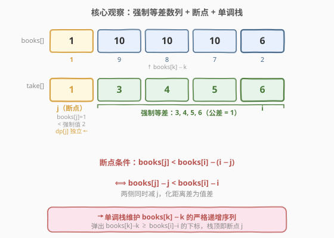
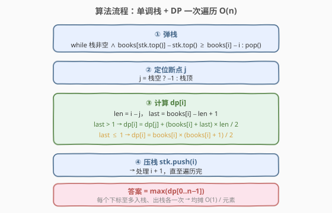

# LeetCode 你能拿走的最大图书数量 题解

## 1. 题目概述

- **标题 / 题号**：你能拿走的最大图书数量（#2355，hard）
- **链接**：https://leetcode.cn/problems/maximum-number-of-books-you-can-take/
- **难度**：困难
- **标签**：栈、数组、动态规划、单调栈

**题意**：给定一个长度为 $n$ 的下标从 0 开始的整数数组 `books`，其中 `books[i]` 表示书架第 $i$ 个书架上的书的数量。

你要从书架 $l$ 到 $r$ 的一个**连续**部分中取书，其中 $0 \le l \le r < n$。对于 $l \le i < r$ 范围内的每个索引 $i$，你从书架 $i$ 取书的数量必须**严格小于**你从书架 $i+1$ 取书的数量。你不能从任何书架取走超过其藏书量的书。

返回你能从书架上拿走的书的**最大**数量。

**示例 1**：

```text
输入：books = [8,5,2,7,9]
输出：19
解释：
  - 从书架 1 上取 1 本书。
  - 从书架 2 上取 2 本书。
  - 从书架 3 上取 7 本书。
  - 从书架 4 上取 9 本书。
  共拿了 19 本书。
```

**示例 2**：

```text
输入：books = [7,0,3,4,5]
输出：12
解释：
  - 从书架 2 上取 3 本书。
  - 从书架 3 上取 4 本书。
  - 从书架 4 上取 5 本书。
  共拿了 12 本书。
```

**示例 3**：

```text
输入：books = [8,2,3,7,3,4,0,1,4,3]
输出：13
解释：
  - 从书架 0 上取 1 本书。
  - 从书架 1 上取 2 本书。
  - 从书架 2 上取 3 本书。
  - 从书架 3 上取 7 本书。
  共拿了 13 本书。
```

**约束**：

- $1 \le \text{books.length} \le 10^5$
- $0 \le \text{books}[i] \le 10^5$

> 💡 **关键约束**：$n \le 10^5$ 要求 $O(n \log n)$ 以内；`books[i]` 可为 0，意味着该书架无法被选入任何子数组（必须取正数本），此时它如同"隔断"将数组分段。

## 2. 解题思路

### 2.1 暴力思路：枚举所有子数组

最直白的做法：枚举所有 $O(n^2)$ 个连续子数组 $[l, r]$，对每个子数组从右端 $r$ 开始向左确定取书量——右端取 $\text{books}[r]$，左邻取 $\min(\text{books}[r-1],\; \text{books}[r]-1)$，依此类推——累加求和。单次扫描 $O(n)$，总计 $O(n^2)$。$n = 10^5$ 时约 $10^{10}$ 次操作，**超时**。

> ⚠️ 暴力的浪费在于：相邻子数组 $[l, r]$ 与 $[l, r+1]$ 的取书量高度重叠——新加入的书架 $r+1$ 只会影响其左侧"被强制压低"的连续段，而这段的起点可以由**单调栈**在均摊 $O(1)$ 内定位。

### 2.2 核心观察：强制等差数列 + 单调栈找断点



**观察一：右端必取满。** 对子数组 $[l, r]$，右端 $r$ 取 $\text{books}[r]$ 本总是最优——取更多不违反任何约束（约束方向是"左 < 右"，增大右端只放松左侧上界），且直接增加总和。

**观察二：强制等差数列。** 一旦右端取 $\text{books}[i] = B$，向左依次被强制递减：书架 $k$ 的取书量为 $\min(\text{books}[k],\; B - (i-k))$。若 $\text{books}[k] \ge B - (i-k)$（容量足够），则书架 $k$ 被"强制"取 $B - (i-k)$，形成公差为 $-1$ 的等差数列。

**观察三：断点。** 向左扫描时，首次出现 $\text{books}[j] < B - (i-j)$ 的书架 $j$ 就是**断点**——它取不满强制值，改取 $\text{books}[j]$（满容量），其左侧则独立于 $B$ 自由扩展（即 $\text{dp}[j]$）。

> 💡 **关键变换**：断点条件 $\text{books}[j] < \text{books}[i] - (i-j)$ 等价于 $\text{books}[j] - j < \text{books}[i] - i$。定义 $\text{key}[k] = \text{books}[k] - k$，则断点 $j$ 恰为 $i$ 左侧 $\text{key}$ 严格更小的最近下标——这正是**单调递增栈**弹栈后栈顶的位置。

### 2.3 算法流程图



一次从左到右遍历，每个下标至多入栈、出栈各一次：

1. **弹栈**：当栈非空且 $\text{books}[\text{stk.top()}] \ge \text{books}[i] - (i - \text{stk.top()})$（即 $\text{key}[\text{top}] \ge \text{key}[i]$）时弹出。
2. **定位 $j$**：$j = $ 栈空 $?\; -1 :$ 栈顶。
3. **计算 $\text{dp}[i]$**：令 $\text{len} = i - j$，$\text{last} = \text{books}[i] - \text{len} + 1$（强制段最左取值）：
   - $\text{last} > 1$：等差求和 $\text{dp}[i] = \text{dp}[j] + \dfrac{(\text{books}[i] + \text{last}) \times \text{len}}{2}$
   - $\text{last} \le 1$：强制段触底，仅取 $\text{books}[i]$ 个书架 $\text{dp}[i] = \dfrac{\text{books}[i] \times (\text{books}[i]+1)}{2}$
4. **压栈**：$\text{stk.push}(i)$。

最终答案 $= \max_{i=0}^{n-1} \text{dp}[i]$。

> 💡 当 $j \ge 0$ 时，$\text{books}[j] \ge 1$ 保证 $\text{last} \ge 3 > 1$（因 $\text{books}[j] < \text{last} - 1$），故 `last > 1` 分支恒成立；`last ≤ 1` 分支仅出现在 $j = -1$（栈空）时。

### 2.4 示例演算

以示例 1 `books = [8, 5, 2, 7, 9]` 为例，$\text{key}[k] = \text{books}[k] - k$ 为 $[8, 4, 0, 4, 5]$：

![示例演算：books = [8,5,2,7,9] 的逐步执行](../images/books_take_example_walkthrough.svg)

| 步 $i$ | $\text{books}[i]$ | $\text{key}[i]$ | 弹出 | $j$ | $\text{dp}[i]$ | 取书方案 |
|--------|-----|-----|------|-----|------|----------|
| 0 | 8 | 8 | — | $-1$ | 8 | $[8]$ |
| 1 | 5 | 4 | 0 | $-1$ | 9 | $[4, 5]$ |
| 2 | 2 | 0 | 1 | $-1$ | 3 | $[1, 2]$ |
| 3 | 7 | 4 | — | 2 | 10 | $[1, 2, 7]$ |
| 4 | 9 | 5 | — | 3 | **19** | $[1, 2, 7, 9]$ |

- $i=1$：$\text{key}[0]=8 \ge 4=\text{key}[1]$，弹 0 → 栈空 → $\text{last}=4>1$ → $\text{dp}[1] = (5+4)\times2/2 = 9$。
- $i=2$：$\text{key}[1]=4 \ge 0=\text{key}[2]$，弹 1 → 栈空 → $\text{last}=0 \le 1$ → $\text{dp}[2] = 2\times3/2 = 3$。
- $i=3$：$\text{key}[2]=0 < 4=\text{key}[3]$，不弹 → $j=2$ → $\text{dp}[3] = \text{dp}[2] + (7+7)\times1/2 = 10$。
- $i=4$：$\text{key}[3]=4 < 5=\text{key}[4]$，不弹 → $j=3$ → $\text{dp}[4] = \text{dp}[3] + (9+9)\times1/2 = 19$。

## 3. 参考代码

### C++

```cpp
class Solution {
public:
    long long maximumBooks(vector<int>& books) {
        int n = books.size();
        vector<long long> dp(n);
        stack<int> stk;
        for (int i = 0; i < n; ++i) {
            // 弹出 key[k] >= key[i] 的下标：books[k] >= books[i] - (i - k)
            while (!stk.empty() &&
                   books[stk.top()] >= books[i] - (i - stk.top()))
                stk.pop();
            int j = stk.empty() ? -1 : stk.top();   // 断点
            int len = i - j;                           // 强制段长度
            int last = books[i] - len + 1;             // 强制段最左取值
            if (last > 1)
                dp[i] = (long long)(books[i] + last) * len / 2;
            else
                dp[i] = (long long)books[i] * (books[i] + 1) / 2;
            if (j >= 0)
                dp[i] += dp[j];
            stk.push(i);
        }
        return *max_element(dp.begin(), dp.end());
    }
};
```

> 💡 `(long long)(books[i] + last)` 先转 `long long` 再乘 `len`，防 `int` 溢出（乘积可达 $2\times10^{10}$）。`books[i]` 可达 $10^5$、$n$ 可达 $10^5$，答案上界约 $10^{10}$，须用 `long long`。

### Python

```python
class Solution:
    def maximumBooks(self, books: List[int]) -> int:
        n = len(books)
        dp = [0] * n
        stk = []
        for i in range(n):
            while stk and books[stk[-1]] >= books[i] - (i - stk[-1]):
                stk.pop()
            j = stk[-1] if stk else -1            # 断点
            length = i - j                          # 强制段长度
            last = books[i] - length + 1            # 强制段最左取值
            if last > 1:
                dp[i] = (books[i] + last) * length // 2
            else:
                dp[i] = books[i] * (books[i] + 1) // 2
            if j >= 0:
                dp[i] += dp[j]
            stk.append(i)
        return max(dp)
```

> 💡 Python 整数任意精度，无溢出之虞。`//` 整除保证结果为 `int`。

## 4. 复杂度分析

| 维度 | 复杂度 | 说明 |
|------|--------|------|
| **时间复杂度** | $O(n)$ | 每个下标至多入栈、出栈各一次；弹栈 `while` 总执行次数 $\le n$，均摊 $O(1)$/元素 |
| **空间复杂度** | $O(n)$ | `dp` 数组 $O(n)$ + 单调栈最坏 $O(n)$（严格递增序列时全部留存） |

## 5. 扩展：$\text{books}[k] - k$ 变换的代数直觉

断点条件 $\text{books}[j] < \text{books}[i] - (i - j)$ 的化简并非偶然——它揭示了一个更深层的结构：

$$\text{key}[k] = \text{books}[k] - k \quad \text{（"有效容量"）}$$

- $\text{books}[k]$ 是书架 $k$ 的**绝对容量**（能放多少本书）。
- $k$ 是书架的位置，也代表"被右端 $i$ 强制压低的最大幅度"。
- $\text{books}[k] - k$ 衡量的是"扣掉位置惩罚后的净余量"——两个 $\text{key}$ 相同的书架，在面向任何右端 $i$ 时的断点行为完全一致。

> 💡 **抽象经验**：当比较条件形如 $f(j) < g(i) - (i - j)$（含位置差 $i-j$）时，两侧同时减去下标即可消去差项，化为 $\text{key}[j] < \text{key}[i]$，从而套用单调栈。这一"**消位置差**"技巧在 84 柱状图最大矩形（消高度差）、739 每日温度（消温度差）中反复出现。

## 6. 面试要点

1. **为什么右端书架总是取满 $\text{books}[i]$？**

   > 约束方向是"左严格小于右"。增大右端取书量只会**放松**左侧约束（左端上界提高），不会违反任何条件，同时直接增加总和。故右端取满始终最优。

2. **断点条件如何化简为 $\text{books}[j] - j < \text{books}[i] - i$？**

   > 原始条件：$\text{books}[j] < \text{books}[i] - (i-j) = \text{books}[i] - i + j$。两侧同减 $j$：$\text{books}[j] - j < \text{books}[i] - i$。定义 $\text{key}[k] = \text{books}[k] - k$，断点即 $\text{key}[j] < \text{key}[i]$ 的最近左侧下标。

3. **为什么均摊 $O(n)$？**

   > 单调栈中每个下标至多入栈一次、出栈一次。弹栈 `while` 循环的总执行次数 $\le n$（每弹一次就少一个元素），故均摊 $O(1)$/元素，整体 $O(n)$。

4. **`last ≤ 1` 分支何时触发？`books[i] = 0` 怎么办？**

   > `last = books[i] - len + 1`。当 $j = -1$（栈空，所有左侧 $\text{key}$ 均 $\ge \text{key}[i]$）且 $\text{books}[i]$ 较小、$i$ 较大时 $\text{last} \le 0$。此时强制段触底（取书量降到 0），只能取 $\text{books}[i]$ 个书架（值 $1, 2, \ldots, \text{books}[i]$）。若 $\text{books}[i] = 0$，$\text{dp}[i] = 0$——该书架无法被选入任何子数组，自然跳过。

5. **为什么必须用 `long long`？**

   > $n \le 10^5$，$\text{books}[i] \le 10^5$。极端情况：$n$ 个书架各 $10^5$，等差求和 $\frac{10^5 \times (10^5+1)}{2} \approx 5 \times 10^9$，累加多段可达 $\sim 10^{10}$，超出 `int` 范围（约 $2.1 \times 10^9$）。

> 💡 **一句话总结**：右端取满 → 左侧强制等差递减 → 断点条件 $\text{books}[j]-j < \text{books}[i]-i$ 消位置差 → 单调栈找断点 $j$ → $\text{dp}[i] = \text{dp}[j] +$ 等差求和，均摊 $O(n)$。

## 同类练习题

| # | 题目 | 与本题的关联 |
|---|------|-------------|
| 84 | [柱状图中最大的矩形](https://leetcode.cn/problems/largest-rectangle-in-histogram/)（[题解](../0001-0100/84_柱状图中最大的矩形.md)） | 单调栈找左右首个更矮柱 → 计算面积，与本题"找断点 → 等差求和"同构，均为"栈定边界 + 公式计算" |
| 739 | [每日温度](https://leetcode.cn/problems/daily-temperatures/)（[题解](../0701-0800/739_每日温度.md)） | 单调栈找右侧首个更大元素，是最纯粹的"栈找最近满足条件"母题 |
| 901 | [股票价格跨度](https://leetcode.cn/problems/online-stock-span/)（[题解](../0901-1000/901_股票价格跨度.md)） | 单调栈 + 跨度合并，每元素的贡献由栈顶决定，与本题 $\text{dp}[i] = \text{dp}[j] + \ldots$ 的 DP-like 结构一致 |
| 239 | [滑动窗口最大值](https://leetcode.cn/problems/sliding-window-maximum/)（[题解](../0201-0300/239_滑动窗口最大值.md)） | 单调队列（递减），同为"维护单调性 + 均摊 $O(n)$"家族，对照栈与队列两种实现 |
