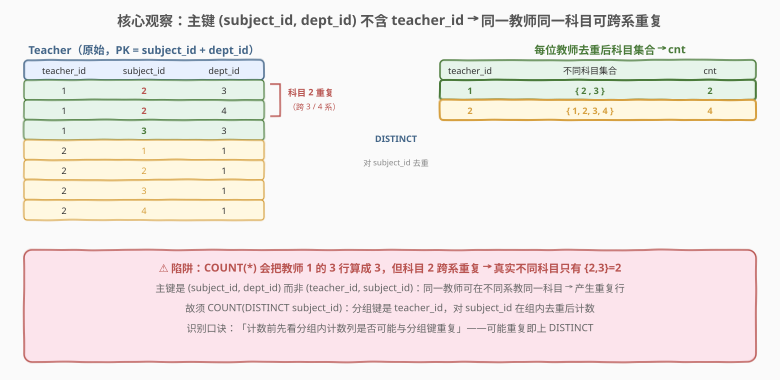
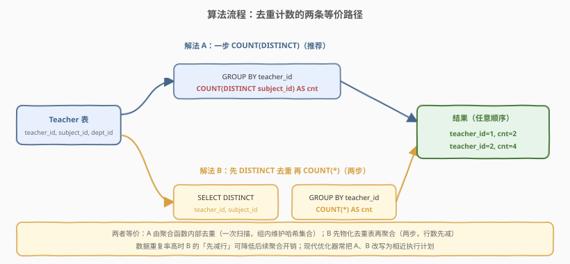
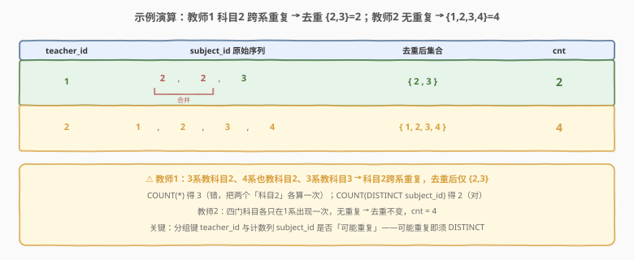

# LeetCode 每位教师所教授的科目种类的数量 题解

## 1. 题目概述

- **标题 / 题号**：每位教师所教授的科目种类的数量（#2356，easy）
- **链接**：https://leetcode.cn/problems/number-of-unique-subjects-taught-by-each-teacher/
- **难度**：简单
- **标签**：数据库、SQL、`GROUP BY`、`COUNT(DISTINCT)`、去重计数、子查询

**题意**：给定 `Teacher` 表，每行表示某教师 (`teacher_id`) 在某系 (`dept_id`) 里教授的某门课程 (`subject_id`)。编写 SQL 查询，返回**每位教师在大学里教授的科目种类（即不同 subject_id）的数量**，以任意顺序返回结果。

**表结构**：

```text
表：Teacher
+-------------+------+
| Column Name | Type |
+-------------+------+
| teacher_id  | int  |
| subject_id  | int  |
| dept_id     | int  |
+-------------+------+
在 SQL 中，(subject_id, dept_id) 是该表的主键（具有唯一值）。
该表中的每一行都表示，该教师(teacher_id)在该系(dept_id)里教授的课程(subject_id)。
```

**示例 1**：

```text
输入：
Teacher 表:
+------------+------------+---------+
| teacher_id | subject_id | dept_id |
+------------+------------+---------+
| 1          | 2          | 3       |
| 1          | 2          | 4       |
| 1          | 3          | 3       |
| 2          | 1          | 1       |
| 2          | 2          | 1       |
| 2          | 3          | 1       |
| 2          | 4          | 1       |
+------------+------------+---------+
输出：
+------------+-----+
| teacher_id | cnt |
+------------+-----+
| 1          | 2   |
| 2          | 4   |
+------------+-----+
解释：
教师 1：
  - 在 3、4 系教科目 2。
  - 在 3 系教科目 3。
教师 2：
  - 在 1 系教科目 1、2、3、4。
```

**约束**：

- `(subject_id, dept_id)` 为 `Teacher` 表的主键，即"某门课在某系"至多一行；
- `teacher_id`、`subject_id`、`dept_id` 均为整数；
- 每位教师至少教授一门课，故每位教师必出现在结果中；
- 结果含 `teacher_id` 与 `cnt` 两列，行顺序任意。

> 💡 **关键观察**：主键是 `(subject_id, dept_id)`，**不含** `teacher_id`。这意味着**同一教师可以在不同系教同一门课**——如教师 1 在 3 系和 4 系都教科目 2，于是表里就有两行 `(1, 2, 3)` 与 `(1, 2, 4)`。它们是**两行但同一门课**。若直接 `COUNT(*)`，教师 1 会被算成 3 门（错），而真实不同科目只有 $\{2, 3\}=2$ 门。这一"主键不含分组键"的定义，正是必须用 `COUNT(DISTINCT subject_id)` 而非 `COUNT(*)` 的根源。

## 2. 解题思路

### 2.1 直觉思路：按教师分组后数行

最直白的做法：按 `teacher_id` 把行分组，每组数有多少行就是该教师教的课数。伪代码：

```text
for each teacher t:
    rows = SELECT * FROM Teacher WHERE teacher_id = t
    answer[t] = count(rows)        # 数行数
```

SQL 即 `SELECT teacher_id, COUNT(*) FROM Teacher GROUP BY teacher_id`。但它**数错了**：教师 1 有 3 行（科目 2 在 3、4 系各一行 + 科目 3 一行），`COUNT(*)` 得 3，而真实不同科目只有 2 门——科目 2 被重复算了一次。

> ⚠️ **陷阱定位**：问题出在"同一教师 + 同一科目"可以跨系重复出现多行。主键 `(subject_id, dept_id)` 允许这种重复（不同 `dept_id` 即不同主键行），但**计数目标是"科目种类数"，与系无关**。故必须在计数前先对 `subject_id` 在组内去重。

### 2.2 核心观察：组内去重计数——`COUNT(DISTINCT)`



把问题拆为「**分组** + **去重计数**」两步：

1. **分组**：`GROUP BY teacher_id`，每位教师一个分组；
2. **去重计数**：在该教师的分组内，对 `subject_id` **去重**后计数——即 `COUNT(DISTINCT subject_id)`。

$$\text{cnt}(t) = \bigl|\{\,\text{subject\_id} : \text{teacher\_id}=t \,\}\bigr|$$

聚合函数 `COUNT(DISTINCT col)` 在内部对每个分组维护一个去重集合（哈希表），扫描完该组的所有行后输出集合大小——天然实现了"组内去重 + 计数"。

> 💡 **何时该上 `DISTINCT`？** 判据是：**计数列是否可能与分组键产生"一对多"的重复**。本题分组键是 `teacher_id`、计数列是 `subject_id`，而主键不含 `teacher_id`（只含 `subject_id, dept_id`），故 `(teacher_id, subject_id)` 不唯一 → 同组内 `subject_id` 可重复 → **必须 `DISTINCT`**。对照：若主键是 `(teacher_id, subject_id)`（即同教师同课只有一行），则组内 `subject_id` 必不重复，`COUNT(*)` 与 `COUNT(DISTINCT subject_id)` 等价、可省 `DISTINCT`。识别主键与计数列的关系，是判断去重必要性的关键。

> ⚠️ **`COUNT(DISTINCT col)` 会忽略 `NULL`**：若 `col` 为 `NULL` 的行不计入。本题 `subject_id` 为主键组成部分，必非 `NULL`，故无影响；但在允许 `NULL` 的列上做去重计数时需留意此语义差异（见第 5 节）。

### 2.3 算法流程图



同一目标有两条等价写法：

| 维度 | 解法 A：一步 `COUNT(DISTINCT)` | 解法 B：先 `DISTINCT` 再 `COUNT(*)` |
|------|--------------------------------|-------------------------------------|
| **思路** | 聚合函数内部去重 | 先物化去重表，再聚合 |
| **写法** | `GROUP BY teacher_id` 上 `COUNT(DISTINCT subject_id)` | 子查询 `SELECT DISTINCT teacher_id, subject_id`，外层 `GROUP BY teacher_id` + `COUNT(*)` |
| **扫描次数** | 一次 | 两次（先去重、再聚合） |
| **中间行数** | 不先减 | 先减为"不同 (教师,科目) 对"数 |
| **推荐度** | ✓ **通用首选**（一行直白） | ✓ 高重复率时可选 |

两者**语义等价**：都等价于"每位教师的不同 subject_id 个数"。区别在执行方式——A 让聚合函数边扫边去重，B 先把全表的 `(teacher_id, subject_id)` 去重再分组数行。

### 2.4 示例演算

以示例 1 走一遍"按教师分组 → 组内对 subject_id 去重 → 计数"：



| teacher_id | subject_id 原始序列 | 去重后集合 | cnt |
|---|---|---|---|
| 1 | 2, **2**, 3 | $\{2, 3\}$ | 2 |
| 2 | 1, 2, 3, 4 | $\{1, 2, 3, 4\}$ | 4 |

- **教师 1**：在 3 系教科目 2、4 系也教科目 2、3 系教科目 3 → 科目 2 跨 3/4 系**重复**，去重后仅 $\{2, 3\}$。`COUNT(*)` 会给 3（错），`COUNT(DISTINCT subject_id)` 给 2（对）。
- **教师 2**：四门科目各只在 1 系出现一次，组内无重复 → 去重不变，$\text{cnt}=4$。

> 💡 **教师 1 是核心考点**：它揭示了"主键不含分组键 → 同组计数列可重复"的陷阱。若用 `COUNT(*)`，只有教师 2（恰好无重复）侥幸算对，教师 1 错。这正说明去重计数不能"看一组对了就推广"——判据是**主键与计数列的关系**，而非某行是否恰好重复。

## 3. 参考代码

### SQL（解法 A：一步 `COUNT(DISTINCT)`，推荐）

```sql
SELECT teacher_id, COUNT(DISTINCT subject_id) AS cnt
FROM Teacher
GROUP BY teacher_id;
```

> 💡 **写法要点**：
> - `GROUP BY teacher_id` 按教师分组；`COUNT(DISTINCT subject_id)` 在组内对 `subject_id` 去重后计数。
> - `AS cnt` 把计数值命名为题面要求的列名 `cnt`。
> - 一行 SQL 表达完整逻辑，**通用首选**：语义直观、优化器友好（常走哈希聚合）。

### SQL（解法 B：先 `DISTINCT` 再 `COUNT(*)`）

```sql
SELECT teacher_id, COUNT(*) AS cnt
FROM (
    SELECT DISTINCT teacher_id, subject_id
    FROM Teacher
) t
GROUP BY teacher_id;
```

> 💡 **写法要点**：
> - 子查询 `SELECT DISTINCT teacher_id, subject_id` 先把全表按"教师 + 科目"去重，得到每位教师每门课恰好一行（如教师 1 的两个"科目 2"被合并为一行）。
> - 外层 `GROUP BY teacher_id, COUNT(*)` 数每组行数——因组内已无重复 `(teacher_id, subject_id)`，`COUNT(*)` 即不同科目数。
> - 与解法 A **结果完全一致**。当全表重复率很高时，先去重可大幅减少输入到 `GROUP BY` 的行数，有时更快；但多一次去重扫描，低重复率时反成开销。

### SQL（解法 C：相关子查询 + `COUNT(DISTINCT)`，对照写法）

```sql
SELECT t.teacher_id,
       (SELECT COUNT(DISTINCT subject_id)
        FROM Teacher t2
        WHERE t2.teacher_id = t.teacher_id) AS cnt
FROM (SELECT DISTINCT teacher_id FROM Teacher) t;
```

> 💡 **写法要点**：
> - 外层 `SELECT DISTINCT teacher_id` 枚举每位教师（去重保证每位只输出一行）；标量子查询为每位教师算其不同科目数。
> - 与解法 A 等价，但写法不同：A 是"一次聚合分组"，C 是"逐教师点查"。相关子查询对每位教师执行一次，最坏 $O(n^2)$；`Teacher(teacher_id)` 上有索引时降为 $O(n \log n)$。语义对照用，**不推荐**用于本题。

### Python（pandas）

```python
import pandas as pd

def count_unique_subjects(teacher: pd.DataFrame) -> pd.DataFrame:
    result = (teacher.groupby('teacher_id')['subject_id']   # 按教师分组
                      .nunique()                            # 组内不同科目数
                      .reset_index(name='cnt'))
    return result
```

> 💡 **pandas 对照**：
> - `groupby('teacher_id')['subject_id']` 对应 `GROUP BY teacher_id`。
> - `.nunique()` 等价于 `COUNT(DISTINCT subject_id)`——**注意是 `nunique()` 而非 `count()`**：后者数行数（含重复），等价于 `COUNT(*)`，会重复计数教师 1 的科目 2。
> - 对照解法 B 的写法：`teacher[['teacher_id','subject_id']].drop_duplicates().groupby('teacher_id').size()`——先对 `(teacher_id, subject_id)` 去重再数行，与 `nunique` 结果一致。

## 4. 复杂度分析

| 维度 | 解法 A（`COUNT(DISTINCT)`） | 解法 B（先 `DISTINCT` + `COUNT(*)`） | 解法 C（相关子查询） | pandas |
|------|----------------------------|--------------------------------------|----------------------|--------|
| **时间** | $O(n)$（哈希聚合）/ $O(n\log n)$（排序聚合） | $O(n)$ / $O(n\log n)$ | $O(n^2)$（最坏）/ $O(n\log n)$（有索引） | $O(n)$ |
| **空间** | $O(n)$ | $O(n)$ | $O(1)$ 额外 | $O(n)$ |
| **扫描次数** | 1 | 2 | 1 + 每教师 1 次 | 1 |
| **依赖窗口函数** | 否 | 否 | 否 | 否 |
| **推荐度** | ✓ **通用首选** | ✓ 高重复率可选 | ✗ 仅对照 | ✓ 验证用 |

> - $n$ = `Teacher` 表行数。
> - **时间**：解法 A 哈希聚合一遍扫描 $O(n)$（排序聚合则 $O(n\log n)$）；组内去重靠哈希集合，每行 $O(1)$ 摊还。解法 B 先 `DISTINCT`（哈希去重 $O(n)$）再 `GROUP BY COUNT`（$O(n)$），共 $O(n)$；多一次扫描，常数更大。解法 C 对每位教师做一次相关子查询，最坏 $O(n^2)$。
> - **空间**：解法 A、B 各需 $O(n)$ 哈希表（存组内不同 `subject_id` / 存去重后的行）；解法 C 仅常数额外空间。
> - **索引建议**：`Teacher(teacher_id)` 上建索引可加速解法 C 的相关子查询点查；解法 A、B 走全表聚合，索引帮助有限。本题规模小，全表扫描已足够。

## 5. 扩展：`COUNT(DISTINCT)` vs 先 `DISTINCT` 再 `COUNT(*)`——何时真有差别

A、B 两条路径**结果永远一致**，但执行计划可能不同。理解差异有助于在"高重复率大表"上选更优写法。

### 5.1 两种去重位置

| 维度 | 解法 A：聚合内去重 | 解法 B：先物化去重 |
|------|--------------------|--------------------|
| **去重粒度** | 每个分组内独立去重 | 全表先去重 `(teacher_id, subject_id)` |
| **中间结果** | 不产生中间去重表 | 产生一行数减少的中间表 |
| **内存** | 每组一个哈希集合 | 一张全局去重哈希表 |
| **何时更优** | 重复率低 / 分组多 | 重复率极高（先减行收益大） |

> 💡 **直觉**：解法 B 的"先 `DISTINCT`"像给后续 `GROUP BY` 减负——若原表大量重复（如某教师某课在 100 个系都教），先合并成一行再聚合，比让聚合函数维护巨大组内集合更省。但低重复率时，多一次扫描与去重哈希的开销可能抵消减行收益。现代优化器（MySQL 8.0+ / PostgreSQL）常把 A、B 改写为相近的哈希聚合计划，实测差距小；面试答「**默认用 A 一行直白；高重复大表可试 B**」即可。

### 5.2 `COUNT(DISTINCT col)` 的 `NULL` 语义

`COUNT(DISTINCT col)` 会**忽略** `col` 为 `NULL` 的行（与 `COUNT(col)` 一致、与 `COUNT(*)` 不同）。本题 `subject_id` 为主键必非 `NULL`，无影响。但若计数列可空，需明确语义：

```sql
-- 想把 NULL 也算"一种值"（不忽略）时，不能直接用 COUNT(DISTINCT)：
SELECT teacher_id,
       COUNT(DISTINCT subject_id)                          -- 忽略 NULL
         + MAX(CASE WHEN subject_id IS NULL THEN 1 ELSE 0 END) AS cnt
FROM Teacher GROUP BY teacher_id;
```

> ⚠️ 主键列必非 `NULL`，本题无需此处理；提及仅为说明 `COUNT(DISTINCT)` 的 `NULL` 边界。

### 5.3 泛化：每组去重计数母题

本题是「**每组对某列去重计数**」的母题。推广：给定任意表 `(group_col, count_col, ...)`，求每组 `count_col` 的不同值个数，核心一句 `GROUP BY group_col → COUNT(DISTINCT count_col)`。识别"主键是否含分组键"决定 `DISTINCT` 必要性：

- 主键**含**分组键（如 `(teacher_id, subject_id)`）→ 组内 `count_col` 不重复 → `COUNT(*)` 即可；
- 主键**不含**分组键（如本题 `(subject_id, dept_id)`）→ 组内 `count_col` 可重复 → 必须 `COUNT(DISTINCT)`。

> 💡 一句话：**「计数列与分组键的关系」决定 `DISTINCT` 的有无**——这是所有"每组去重计数"题的统一判据。

## 6. 面试要点

1. **为什么用 `COUNT(DISTINCT subject_id)` 而非 `COUNT(*)`？**

   > 因为主键是 `(subject_id, dept_id)` 不含 `teacher_id`，同一教师可在不同系教同一门课（如教师 1 在 3、4 系都教科目 2），产生多行但同一门课。`COUNT(*)` 数行数会把重复的科目 2 算两次，得 3（错）；`COUNT(DISTINCT subject_id)` 在组内对 `subject_id` 去重后计数，得 2（对）。判据：计数列 `subject_id` 与分组键 `teacher_id` 不构成唯一组合 → 组内可重复 → 必须 `DISTINCT`。

2. **解法 A 与解法 B 等价吗？性能有差异吗？**

   > 结果完全一致，都等于每位教师不同科目数。区别在执行方式：A 让聚合函数内部去重（一遍扫描，组内维护哈希集合）；B 先 `SELECT DISTINCT` 物化去重表再 `GROUP BY COUNT(*)`（两遍扫描，行数先减）。低重复率时 A 更省（少一次扫描）；高重复率大表时 B 的"先减行"可能更优。现代优化器常把二者改写为相近计划，实测差距通常很小，默认用 A。

3. **能否不用 `DISTINCT`？**

   > 能——解法 B：先 `SELECT DISTINCT teacher_id, subject_id` 把全表按"教师+科目"去重，使每位教师每门课恰好一行，再 `GROUP BY teacher_id` 上 `COUNT(*)`。因组内已无重复 `(teacher_id, subject_id)`，`COUNT(*)` 即不同科目数。这是把"组内去重"前移为"全表去重"的等价变换，避免在聚合函数里写 `DISTINCT`。

4. **`COUNT(DISTINCT col)` 对 `NULL` 如何处理？**

   > 忽略 `col` 为 `NULL` 的行——与 `COUNT(col)` 一致、与 `COUNT(*)`（数所有行）不同。本题 `subject_id` 为主键必非 `NULL`，无影响。若计数列可空且想把 `NULL` 也算一种值，需额外用 `MAX(CASE WHEN col IS NULL THEN 1 ELSE 0 END)` 补上，不能只靠 `COUNT(DISTINCT)`。

5. **如何快速判断一道"每组计数"题要不要 `DISTINCT`？**

   > 看主键是否包含分组键。若主键含分组键（如 `(teacher_id, subject_id)`），则组内计数列不重复，`COUNT(*)` 等价于 `COUNT(DISTINCT)`，可省；若主键不含分组键（如本题 `(subject_id, dept_id)`），组内计数列可重复，必上 `DISTINCT`。一句话：「计数列与分组键是否可能重复」决定 `DISTINCT` 的有无。

> 💡 **一句话总结**：2356 是"每组去重计数"母题——核心就一句 `SELECT teacher_id, COUNT(DISTINCT subject_id) AS cnt FROM Teacher GROUP BY teacher_id`。要点：① 主键 `(subject_id, dept_id)` **不含** `teacher_id` → 同一教师同一科目可跨系重复 → 必须 `COUNT(DISTINCT)` 而非 `COUNT(*)`；② 等价写法是先 `SELECT DISTINCT (teacher_id, subject_id)` 再 `COUNT(*)`，把组内去重前移为全表去重；③ 判据「计数列与分组键是否可能重复」统一所有"每组去重计数"题的 `DISTINCT` 取舍。

## 同类练习题

| # | 题目 | 与本题的关联 |
|---|------|-------------|
| 596 | [超过5名学生的课](https://leetcode.cn/problems/classes-more-than-5-students/)（[题解](../0501-0600/596_超过5名学生的课.md)） | `Courses` 表无主键、`(student, class)` 可重复 → 用 `COUNT(DISTINCT student)` 数每门课的不同学生，是本题"去重计数"的经典前身，对照"无主键→必 DISTINCT" |
| 1141 | [查询近30天活跃用户数](https://leetcode.cn/problems/user-activity-for-the-past-30-days-i/)（[题解](../1101-1200/1141_查询近30天活跃用户数.md)） | 同用户同一天可能多条活动 → `COUNT(DISTINCT user_id)` 数每日活跃用户，与本题"组内计数列可重复"同构 |
| 1076 | [项目员工 II](https://leetcode.cn/problems/project-employees-ii/)（[题解](../1001-1100/1076_项目员工II.md)） | `Project` 表主键含 `(employee_id, project_id)` → 组内无重复 → `COUNT(*)` 即可，与本题"主键不含分组键→须 DISTINCT"形成正反对照 |
| 1050 | [合作过至少三次的演员和导演](https://leetcode.cn/problems/actors-and-directors-who-cooperated-at-least-three-times/)（[题解](../1001-1100/1050_合作过至少三次的演员和导演.md)） | `(actor_id, timestamp)` 主键含计数维度 → 直接 `GROUP BY actor_id, director_id` + `COUNT(*)` 即可，对照"主键已含分组键时无须 DISTINCT" |
| 1729 | [求关注者的数量](https://leetcode.cn/problems/find-followers-count/)（[题解](../1701-1800/1729_求关注者的数量.md)） | 每位用户的不同关注者数，`GROUP BY user_id` + `COUNT(DISTINCT follower_id)`，与本题"每组去重计数"完全同模板 |
