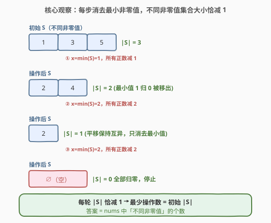
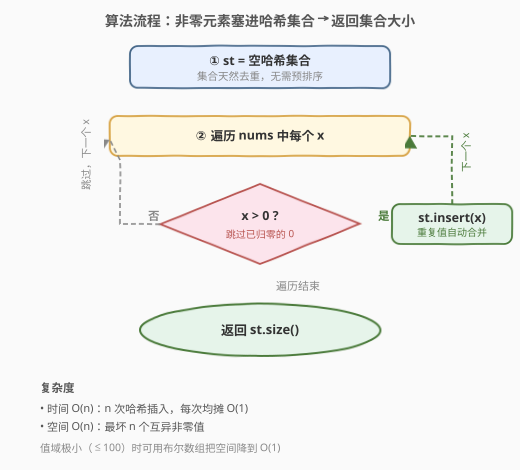
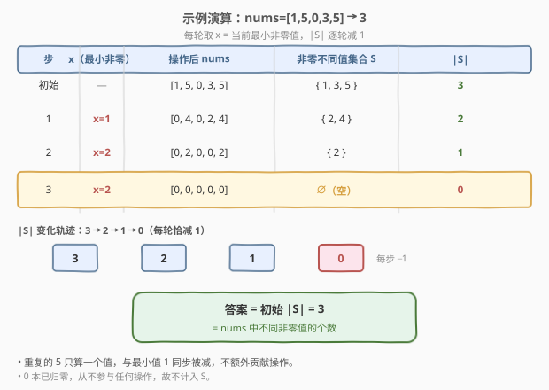

# 使数组中所有元素都等于零

- **题目名称**：使数组中所有元素都等于零
- **链接**：[2357. 使数组中所有元素都等于零](https://leetcode.cn/problems/make-array-zero-by-subtracting-equal-amounts/)
- **难度**：简单
- **标签**：贪心、数组、哈希表

## 1. 题目概述

给定一个非负整数数组 `nums`。在**一步操作**中，你必须：

1. 选出一个正整数 `x`，且 `x` 要**小于或等于** `nums` 中**最小**的**非零**元素；
2. 将 `nums` 中的**每个正整数**都减去 `x`。

返回使 `nums` 中所有元素都等于 `0` 所需的**最少**操作数。

**示例 1**：

```text
输入：nums = [1,5,0,3,5]
输出：3
解释：
  第一步操作：选出 x = 1 ，之后 nums = [0,4,0,2,4]
  第二步操作：选出 x = 2 ，之后 nums = [0,2,0,0,2]
  第三步操作：选出 x = 2 ，之后 nums = [0,0,0,0,0]
```

**示例 2**：

```text
输入：nums = [0]
输出：0
解释：nums 中每个元素都已经是 0，无需任何操作。
```

**约束条件**：

- $1 \le \text{nums.length} \le 100$
- $0 \le \text{nums}[i] \le 100$

> 💡 **关键约束**：值域与长度都极小（$\le 100$），故即便 $O(n^2)$ 的模拟也能通过；但本题的最优解只需 $O(n)$ 时间、$O(n)$ 空间——下面的观察说明答案与"不同非零值的个数"一一对应。

---

## 2. 解题思路

### 2.1 暴力思路：直接模拟

最直白的做法是**照着题意一步步模拟**：每轮找出当前最小的非零元素 `x`，把所有正数都减去 `x`，操作数 `+1`；当数组里不再有正数时停止。复杂度 $O(\text{操作数} \cdot n)$，最坏约 $O(n^2)$，在本题 $n \le 100$ 的甜区下可通过，但**没有触及问题的本质**。

> ⚠️ 模拟的浪费在于：它把注意力放在"每次减完后数组变成什么样"，而真正决定操作次数的，是"数组里有多少个**不同的非零值**"。一旦看清这一点，模拟就完全多余了。

### 2.2 核心观察：每次操作恰好消去一个"不同的非零值"



把数组里所有**不同的非零值**收集到一个集合 $S$ 中（例如 `[1,5,0,3,5]` → $S = \{1, 3, 5\}$）。下面证明两件事：

**① 最优策略：每轮取 $x = \min(S)$（当前最小非零值）。**

题面允许 $x \le \min(\text{非零})$。若取 $x < \min(S)$，那么最小非零值减完仍 $> 0$，集合 $S$ 不会变小——这一步纯属"浪费"，不会让总操作数更少。因此最优解必然取 $x = \min(S)$。

**② 取 $x = \min(S)$ 后，$S$ 的大小恰好减 1。**

设当前最小非零值为 $m = \min(S)$。把所有正数减去 $m$：

- 最小值 $m$ 变成 $0$，从 $S$ 中消失；
- 其余非零值 $v > m$，减去 $m$ 后 $v - m > 0$，仍是正数；并且它们**彼此之间仍然互不相同**——因为给所有元素减去同一个 $m$ 是平移变换，平移保持"互异"（$a \ne b \Rightarrow a - m \ne b - m$）。

所以一轮操作后，$S$ 恰好丢掉 $m$ 这一个元素，大小 $|S| \to |S| - 1$。

由此，初始 $|S| = k$ 时，恰好需要 $k$ 轮操作把 $S$ 减空（每轮减 1），无法更少（每轮至多消去一个最小值），也不会更多（贪心取等号总能达成）。

> 💡 **结论**：**最少操作数 = `nums` 中不同非零元素的个数**。`0` 不计入，因为已经归零的元素不再参与操作；重复值不计入，因为它们与"最小值"同步被减、不会单独贡献额外操作。

### 2.3 算法流程图



最优解极为简洁：遍历 `nums`，把每个正数塞进一个哈希集合，利用集合天然去重；最后返回集合大小。无需排序、无需模拟。

### 2.4 示例演算

以 `nums = [1,5,0,3,5]` 为例，初始不同非零值集合 $S = \{1, 3, 5\}$，$|S| = 3$。



| 步 | 取 $x$（最小非零） | 操作后 nums | 非零不同值集合 $S$ | $|S|$ |
|----|---------------------|-------------|----------------------|-------|
| 初始 | — | `[1,5,0,3,5]` | $\{1, 3, 5\}$ | 3 |
| 1 | $x=1$ | `[0,4,0,2,4]` | $\{2, 4\}$ | 2 |
| 2 | $x=2$ | `[0,2,0,0,2]` | $\{2\}$ | 1 |
| 3 | $x=2$ | `[0,0,0,0,0]` | $\varnothing$ | 0 |

$|S|$ 从 3 逐轮减 1 到 0，恰好 3 步——正等于初始不同非零值个数，与示例输出一致。

---

## 3. 参考代码

### C++

```cpp
class Solution {
public:
    int minimumOperations(vector<int>& nums) {
        unordered_set<int> st;
        for (int x : nums)
            if (x > 0) st.insert(x);          // 只收非零值，集合自动去重
        return st.size();
    }
};
```

> 💡 `unordered_set` 基于哈希，插入与查询均摊 $O(1)$；只把 `x > 0` 的值入集合，`0` 直接跳过。`nums[i]` 取值 $\le 100$，哈希冲突可忽略；若追求极致常数，可用 `bitset` 或定长布尔数组见第 5 节。

### Python

```python
class Solution:
    def minimumOperations(self, nums: List[int]) -> int:
        return len({x for x in nums if x > 0})   # 集合推导式去重 + 排除 0
```

> ⚠️ `{x for x in nums if x > 0}` 是集合推导式，而非字典推导式；返回 `len` 即得答案。也可写作 `len(set(nums) - {0})`，更短但需理解"从全集里删掉 0"。

---

## 4. 复杂度分析

| 维度 | 复杂度 | 说明 |
|------|--------|------|
| **时间复杂度** | $O(n)$ | 单次遍历插入哈希集合，每次均摊 $O(1)$，共 $n$ 个元素 |
| **空间复杂度** | $O(n)$ | 最坏所有元素互异且非零，集合存 $n$ 个值 |

---

## 5. 扩展：排序去重与值域布尔数组

### 5.1 排序 + 计数变值

不借助哈希集合：先升序排序，再数"非零且与前一个不同"的元素个数。$O(n \log n)$ 时间、$O(1)$ 额外空间（原地排序）：

```cpp
class Solution {
public:
    int minimumOperations(vector<int>& nums) {
        sort(nums.begin(), nums.end());
        int ans = 0, prev = -1;
        for (int x : nums)
            if (x > 0 && x != prev) { ans++; prev = x; }
        return ans;
    }
};
```

### 5.2 值域布尔数组（$O(n)$ 时间 / $O(1)$ 空间）

由约束 `0 <= nums[i] <= 100`，值域仅 101 种，可用一个定长布尔数组标记"出现过哪些非零值"，空间为 $O(101) = O(1)$：

```cpp
class Solution {
public:
    int minimumOperations(vector<int>& nums) {
        bool seen[101] = {false};
        for (int x : nums) if (x > 0) seen[x] = true;
        return count(seen, seen + 101, true);
    }
};
```

### 5.3 直接模拟（对照暴力）

照题意一步步减，便于对照理解"为何集合法等价"：

```cpp
class Solution {
public:
    int minimumOperations(vector<int>& nums) {
        int ans = 0;
        while (true) {
            int x = INT_MAX;
            for (int v : nums) if (v > 0) x = min(x, v);   // 当前最小非零值
            if (x == INT_MAX) break;                        // 已全部归零
            for (int& v : nums) if (v > 0) v -= x;           // 所有正数减 x
            ans++;
        }
        return ans;
    }
};
```

| 解法 | 时间 | 空间 | 适用 |
|------|------|------|------|
| 哈希集合 | $O(n)$ | $O(n)$ | 通用首选，无需值域假设 |
| 值域布尔数组 | $O(n)$ | $O(1)$ | 值域极小（如 $\le 100$）时最省空间 |
| 排序 + 计数变值 | $O(n \log n)$ | $O(1)$ | 不愿引入哈希、要求原地时 |
| 直接模拟 | $O(\text{ans} \cdot n) \le O(n^2)$ | $O(1)$ | 直观对照题意，甜区数据可过但未触及本质 |

> 💡 **抽象经验**：当题目问"最少多少次操作把某量归零/拉平"时，先问"每次操作能消去一类什么"——若每次恰好消去一类（这里是一个不同的非零值），答案往往就是"类的总数"。把"过程"翻译成"集合大小"，是这类贪心题的通用降维手法。

---

## 6. 面试要点

1. **为什么最少操作数等于不同非零值的个数？**

   - 每轮最优必取 $x = \min(S)$（$S$ 为不同非零值集合）。取 $x$ 更小则最小值减完仍 $>0$，集合不缩，纯属浪费。取 $x = \min(S)$ 后：最小值 $m \to 0$ 被移出 $S$；其余值 $v>m$ 减 $m$ 后仍正、且因"全体同减一个量"是平移而保持互异。故 $|S|$ 每轮恰减 1，共需 $|S|$ 轮。

2. **重复元素和 0 对答案有什么影响？**

   - 重复值不贡献额外操作：它们与同值元素同步被减，最终一起归零，只占"一个不同的值"。`0` 本已归零，不参与任何操作，故不计入。所以答案只看"不同的非零值"。

3. **为什么说"全体同减一个 $m$ 保持互异"？**

   - 平移变换 $v \mapsto v - m$ 是一一映射：$a \ne b \Rightarrow a - m \ne b - m$。故集合内除 $m$ 外的元素两两仍不同，不会发生"两个不同值相减后撞成同一个"而额外缩小集合。

4. **取 $x < \min(S)$ 会怎样？是否可能更少步数？**

   - 不会更少。若 $x < \min(S)$，则所有非零值减 $x$ 后仍为正，$S$ 仅是被平移、大小不变；这一步没消去任何值，反而把后续需要的步数"延后"。因此贪心取 $x = \min(S)$ 是最优，不存在更少步数。

5. **哈希集合法为什么是 $O(n)$？**

   - 遍历一次 $n$ 个元素，每个插入哈希集合均摊 $O(1)$（哈希表平均 $O(1)$ 插入）。集合最终大小即答案。值域极小时可换布尔数组把空间降到 $O(1)$，但时间仍 $O(n)$。

> 💡 **一句话总结**：每轮取最小非零值 $x$，全体正数减 $x$ → 不同非零值集合大小恰减 1 → 最少操作数 = `nums` 中不同非零值的个数，哈希集合 $O(n)$ 一行解决。

---

## 7. 同类练习题

- [217. 存在重复元素](https://leetcode.cn/problems/contains-duplicate/)（[题解](../0201-0300/217_存在重复元素.md)）：用哈希集合判"是否有重复"，与本题"集合天然去重计数"是同一原语
- [349. 两个数组的交集](https://leetcode.cn/problems/intersection-of-two-arrays/)（[题解](../0301-0400/349_两个数组的交集.md)）：集合运算求交集，承接"集合去重"思想
- [2341. 数组能形成多少数对](https://leetcode.cn/problems/maximum-number-of-pairs-in-array/)（[题解](../2301-2400/2341_数组能形成多少数对.md)）：按值计数配对，同区间同主题的"计数 + 去重"招牌题
- [2352. 相等行列对](https://leetcode.cn/problems/equal-row-and-column-pairs/)（[题解](../2301-2400/2352_相等行列对.md)）：把行/列序列哈希后计数匹配，同区间的"哈希计数"延伸
- [1. 两数之和](https://leetcode.cn/problems/two-sum/)（[题解](../0001-0100/1_两数之和.md)）：哈希一次遍历匹配目标值，"边查边存"的哈希集合入门范式
